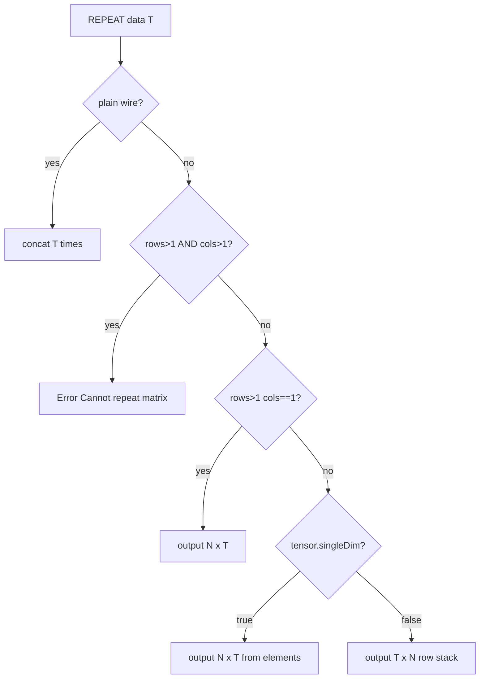

# Plan: ABS și REPEAT

## Spec agreată (rezumat)

### ABS

- Semnătură: `ABS(Xbit x; signed) -> Xbit result, 1bit overflow`
- **Fără** `; signed` → eroare: `ABS requires ; signed`
- Fără `; vector` / `; matrix` în v1 (scalar only)
- `x ≥ 0` → `result = x`, `overflow = 0`
- `x < 0`, nu INT_MIN → `result = -x` (TC, lățime X), `overflow = 0`
- `x = INT_MIN` (ex. `1000` pe 4 biți) → `result` rămâne pattern-ul original, `overflow = 1`

### REPEAT

- `REPEAT(data, T)` — `T` literal `\N` sau wire scalar (unsigned, `≥ 1`); `T=0` → eroare
- `data` matrice `[N,M]` cu `N>1` și `M>1` → `Cannot repeat matrix`
- Limită: `total_bits ≤ 16384`
- Plain wire → wire plat `len(data)×T`
- Shape output:

| `data`                               | Output         |
| ------------------------------------ | -------------- |
| `Wbit` plat                          | `W×T` bit plat |
| `4wire[N]` (sintaxă un singur index) | `4wire[N,T]`   |
| `4wire[N,1]`                         | `4wire[N,T]`   |
| `4wire[1,N]` (sintaxă cu virgulă)    | `4wire[T,N]`   |

---

## Problemă tehnică: `4wire[3]` vs `4wire[1,3]`

La runtime ambele au `tensor.dims = [1,3]` în [`tensor-shape.js`](v0_3_2/core/tensor-shape.js). Fără metadata suplimentară, REPEAT nu poate alege între `[N,T]` și `[T,N]`.

**Soluție:** la parse, în [`parser.js`](v0_3_2/core/parser.js) `parseTensorShapeSuffix`, setăm pe decl:

- `tensorSingleDim: true` când **nu** există virgulă (`4wire[3]`)
- `tensorSingleDim: false` când există virgulă (`4wire[1,3]`, `4wire[3,1]`)

Persistăm pe wire în [`interpreter.js`](v0_3_2/core/interpreter.js) `_applyDeclTensorMeta`:

```js
wireEntry.tensor = { elementWidth: ew, dims: [rows, cols], singleDim: !!decl.tensorSingleDim };
```

Reguli REPEAT pe rank-1:



---

## Audit PIVOT pe vectori (verificat, mic fix)

### Ce funcționează deja

Testele existente (1874–1876) și [`pivotBlob`](v0_3_2/core/tensor-shape.js) sunt corecte:

| Sursă | Țintă declarată | Efect |
|-------|-----------------|-------|
| `4wire[3]` → meta `[1,3]` | `4wire[3,1]` | același blob liniar; index `:1` / `:1:0` = elementul 1 |
| `4wire[3,2]` | `4wire[2,3]` | transpose real (test 1874) |
| double PIVOT | aceeași formă | identitate (test 1876) |

`pivotBlob` nu trebuie rescris — pentru rank-1, `4wire[N]` (`[1,N]`) și `4wire[N,1]` (`[N,1]`) fac swap de dimensiuni păstrând ordinea elementelor liniare (MSB-first).

### Lacună: fără validare shape pe țintă

Handler-ul PIVOT (~L4402 în [`interpreter.js`](v0_3_2/core/interpreter.js)) returnează doar blob-ul; **nu** verifică că wire-ul din stânga (`4wire[3,1] col = PIVOT(row)`) are shape-ul transpus, spre deosebire de OUTER/MCAT care apelează `resolveAssignTargetMeta`.

Risc: același număr total de biți, shape greșit → date valide ca biți, interpretare tensor greșită, fără eroare.

### Fix planificat (în același PR)

În handler PIVOT, după `meta` sursă:

```js
const { rows: pr, cols: pc } = TS.pivotedDims(meta.rows, meta.cols);
const tgt = TB.resolveAssignTargetMeta(this);
if (!tgt) fail('PIVOT: assign to a tensor wire');
if (tgt.rows !== pr || tgt.cols !== pc)
  fail(`PIVOT: target [${tgt.rows},${tgt.cols}] does not match [${pr},${pc}]`);
```

Helper opțional în [`tensor-builtins.js`](v0_3_2/core/tensor-builtins.js): `expectedPivotTarget(meta)` → `{ rows, cols }`.

### Legătură cu `tensorSingleDim`

PIVOT **nu** mută metadata `singleDim` pe wire — shape-ul țintă vine din **declarație** (`4wire[3]` vs `4wire[1,3]`). Documentăm în [`wire-vectors.md`](v0_3_2/doc/wire-vectors.md):

- `PIVOT(4wire[N])` → țintă `4wire[N,1]`
- `PIVOT(4wire[N,1])` → țintă `4wire[N]` (sau `4wire[1,N]` explicit)
- `PIVOT(4wire[1,N])` → țintă `4wire[N,1]`

### Teste PIVOT noi (după 1952+, grup `wire-tensor`)

- **Round-trip invers** (complement la 1875): `4wire[3,1]` → `PIVOT` → `4wire[3]`, verificare `:1`
- **Index liniar** pe rezultat: `col:1` === `col:1:0` pe `[3,1]`
- **Shape mismatch**: `4wire[3] row = …` + `4wire[2,2] bad = PIVOT(row)` → eroare
- (opțional) `4wire[1,3]` explicit → `4wire[3,1]`

Nu se adaugă pagină `builtin-PIVOT.md` separată — doar extindere secțiune PIVOT în `wire-vectors.md`.

---

## Implementare ABS

### 1. Logică în [`signed-arithmetic.js`](v0_3_2/core/signed-arithmetic.js)

- Adaugă `ABS` în `BUILTIN_SIGNED_TAG_FUNCS`
- Funcție nouă `absAtWidth(x, width)`:
  - folosește `signedBinToBigInt` / `signedBigIntToBin` existente
  - `INT_MIN = -(1n << BigInt(width-1))`
  - return `{ result, overflow: '0'|'1' }`

### 2. Eval în [`interpreter.js`](v0_3_2/core/interpreter.js)

- În blocul de tag-uri (~L4359): dacă `name === 'ABS'` și `!signedMode` → `fail('ABS requires ; signed')`
- Dacă `vectorMode || matrixMode` pe ABS → eroare (v1)
- Handler după pattern ADD (~L5504):
  - 1 argument, `argValues[0]`, lățime W
  - `zstate` binary check ca ADD
  - return array de 2 obiecte `{ value, ref }` (ca ADD signed)

### 3. Înregistrare

- `isBuiltinFunction`: adaugă `'ABS'`
- `BUILTIN_DOC`:
  ```
  ABS: ['ABS(Xbit x; signed) -> Xbit result, 1bit overflow']
  ```

---

## Implementare REPEAT

### 1. Constantă și helpers în [`tensor-shape.js`](v0_3_2/core/tensor-shape.js)

- `REPEAT_MAX_BITS = 16384`
- `repeatPlainBlob(val, times)` — concatenare string
- `repeatColumnMatrixBlob(cells, rows, ew, times)` — `[N,T]`: pentru fiecare coloană `t`, emite toate rândurile din sursă
- `repeatRowMatrixBlob(rowBlob, ew, cols, times)` — `[T,N]`: concatenează `times` copii ale rândului
- `checkRepeatTotalBits(total, fnName)` — aruncă dacă `> 16384`

### 2. Helpers în [`tensor-builtins.js`](v0_3_2/core/tensor-builtins.js)

- `resolveRepeatOutputShape(dataMeta, tensorSingleDim, T)` → `{ rows, cols }` sau `null` (plain/matrix error)
- `classifyRepeatOperand(wire, meta)` — plain / col / row / matrix / singleDimVector

### 3. Eval argument `T` în [`interpreter.js`](v0_3_2/core/interpreter.js)

- Helper nou `_evalCallArgRepeatCount(argExpr, fnName)`:
  - acceptă atom cu `dec` (literal `\N`) **sau** expresie scalară evaluată cu `_evalCallArgValue`
  - respinge argument whole-vector / whole-tensor (verifică `tensorSlice`, `vectorIndex`, meta pe wire)
  - valoare unsigned `BigInt`; `0` → eroare; `> prag rezonabil` înainte de concat (ex. evită bucle uriașe)
  - return `number` pentru buclă

### 4. Handler REPEAT în [`interpreter.js`](v0_3_2/core/interpreter.js)

- 2 argumente; `data` = whole wire (fără slice/index)
- citește `wire.tensor.singleDim` pentru `[1,N]`
- validează shape țintă via `resolveAssignTargetMeta` (pattern IDENTITY/OUTER)
- construiește blob, verifică `≤ 16384`, return single value

### 5. Înregistrare

- `isBuiltinFunction`: `'REPEAT'`
- `BUILTIN_DOC`:
  ```
  REPEAT: ['REPEAT(Wbit data, Nbit/\\N times) -> Wbit or Wwire tensor']
  ```

---

## Documentație

Pagini noi:

- [`v0_3_2/doc/builtin-ABS.md`](v0_3_2/doc/builtin-ABS.md) — semantica signed, exemplu −7 / −8, overflow INT_MIN, compoziție `MAX+SUBTRACT`
- [`v0_3_2/doc/builtin-REPEAT.md`](v0_3_2/doc/builtin-REPEAT.md) — tabele shape, limită 16384, exemple plain / `4wire[3]` / `4wire[1,3]` / `4wire[3,1]`, eroare matrice

Actualizări:

- [`v0_3_2/doc/builtin-functions.md`](v0_3_2/doc/builtin-functions.md) — rânduri ABS (arithmetic) și REPEAT (tensor)
- [`v0_3_2/doc/wire-vectors.md`](v0_3_2/doc/wire-vectors.md) — tabel tensor generators + notă `4wire[N]` vs `4wire[1,N]` la REPEAT
- [`v0_3_2/doc/arithmetic.md`](v0_3_2/doc/arithmetic.md) — ABS în hub (opțional, link)

Regenerare: `node node/_gen_doc_data.js`

---

## Teste ([`v0_3_2/tests/test_suite.js`](v0_3_2/tests/test_suite.js))

Grup `builtins` / `wire-tensor`, ID-uri după 1952:

**ABS (~4 teste)**

- `ABS(-7; signed)` → `0111`, ovf `0`
- `ABS(-8; signed)` pe 4 biți → `1000`, ovf `1`
- `ABS(+3; signed)` → neschimbat, ovf `0`
- `ABS(a)` fără signed → eroare

**REPEAT (~8 teste)**

- plain `8wire` × 3
- `4wire[3]` → `4wire[3,2]` verificare celule `:r:c`
- `4wire[3,1]` → `4wire[3,2]`
- `4wire[1,3]` → `4wire[2,3]` (rând duplicat)
- matrice `4wire[2,2]` → eroare
- `T=0` → eroare
- `T` din wire `2wire t = 0010`
- depășire 16384 biți → eroare

**PIVOT vectori (~3–4 teste)**

- invers 1875: `4wire[3,1]` → `PIVOT` → `4wire[3]`, `:1` = `0011`
- shape mismatch: `4wire[3]` → `PIVOT` → țintă `4wire[2,2]` → eroare
- (opțional) `4wire[1,3]` → `4wire[3,1]`

Regenerare: `node node/_gen_test_manifest.js`

Rulare: `node node/_run_test_suite_node.js`

---

## Fișiere atinse (ordine recomandată)

1. [`parser.js`](v0_3_2/core/parser.js) — `tensorSingleDim` pe decl
2. [`interpreter.js`](v0_3_2/core/interpreter.js) — `_applyDeclTensorMeta`, **PIVOT shape check**, ABS, REPEAT
3. [`signed-arithmetic.js`](v0_3_2/core/signed-arithmetic.js) — `absAtWidth`
4. [`tensor-shape.js`](v0_3_2/core/tensor-shape.js) — blob builders + limită
5. [`tensor-builtins.js`](v0_3_2/core/tensor-builtins.js) — shape resolve (+ pivot target helper)
6. Doc + teste + regenerări manifest/doc

Nu sunt necesare schimbări în bundle HTML (module deja încărcate).
