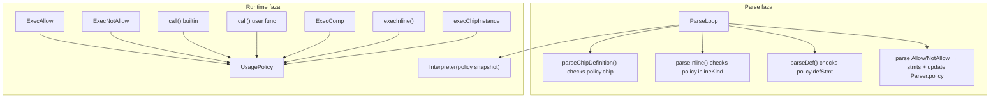

# Plan: Allow / NotAllow în logTscript

## Context din codebase

Versiunea activă: [v0_3_2](v0_3_2).

Pipeline: `preprocessLoop` → `Tokenizer` → `Parser.parse()` → `Interpreter.exec()` per statement.

Model de referință runtime: **`MODE`** — parser produce AST, interpreter modifică starea la `exec()`.

**Important — două timpuri de procesare:**

| Construct | Când se procesează | Loc în cod |
|-----------|-------------------|------------|
| `def foo(...)` top-level | **Parse** (în `parse()`, nu în `stmts`) | `parser.js` ~1014 |
| `chip +[name]:` body | **Parse** | `parseChipDefinition()` |
| `inline [kind] .name:` | **Parse** (`parseInline`) + **Runtime** (`execInline`) | `parser.js` ~5136, `interpreter.js` ~1853 |
| `chip [name] .inst::` | **Runtime** (`execChipInstance`) | `interpreter.js` ~14877 |
| `comp [led] .x:` | **Runtime** (`execComp`) | `interpreter.js` ~12629 |
| `ADD(...)` în expresie | **Runtime** (`call`) | `interpreter.js` ~7058 |
| `Allow` / `NotAllow` | **Runtime** (în `stmts`) + **Parse** (update policy pentru ce urmează în sursă) | hibrid |

**Inline kinds** (din [`parseInline()`](v0_3_2/core/parser.js) ~5153): `asm`, `lut`, `protocol`, `plc`.

Sintaxă: `inline [asm] .myisa:` — `kind` din `[...]` e ce restricționăm cu `inline.type{asm}`, **nu** numele instanței `.myisa`.

---

## Taxonomia completă a intrărilor Allow/NotAllow

### Meta-tokenuri (golesc lista și seteză starea)

| Token | Allow | NotAllow |
|-------|-------|----------|
| `ALL` | golește + permite tot în acea categorie | golește + blochează tot |
| `NONE` | golește + whitelist gol (nimic permis implicit) | golește blacklist (nimic blocat) |

Default script: **Allow ALL** (tot permis), **NotAllow NONE** (nimic blocat).

### Categorii (union pe mai multe linii)

| Intrare | Categorie | Efect |
|---------|-----------|-------|
| `builtIn` | builtin | toate funcțiile builtin |
| `comp` | comp | toate tipurile `comp` |
| `chip` | chip | toate chip-urile |
| `board` | board | toate board-urile |
| `pcb` | pcb | toate pcb-urile |
| `inline` | inline | toate inline-urile (`inline [kind] .name:`) |
| `func` | userFunc | toate apelurile la funcții user (`def`) |
| `def` | defStmt | interzice statement-ul `def` (definire funcții) |

### Sintaxă tipizată (liste specifice în acolade)

| Sintaxă | Categorie | Exemplu |
|---------|-----------|---------|
| `comp.type{reg key ~ +}` | compType | tipuri specifice; shortcut-uri ca în `parseComp()` |
| `chip.type{myChip cpuIsa}` | chipName | chip-uri specifice (nume din `chip +[name]:`) |
| `board.type{myBoard}` | boardName | board-uri specifice |
| `pcb.type{myPcb}` | pcbName | pcb-uri specifice |
| `inline.type{asm protocol}` | inlineKind | kind-uri specifice din `inline [kind]` |

**Shortcut-uri comp** (rezolvate la tip canonic, ca în [`parseComp()`](v0_3_2/core/parser.js) ~3122):

`'7'→7seg`, `+→adder`, `-→subtract`, `*→multiplier`, `/→divider`, `>→shifter`, `=→counter`, `~→osc`, `14→14seg`, `:→dots`, plus ID-uri `fifo`, `lifo`, `bar`, etc.

În `comp.type{...}` parserul acceptă `ID`, `SYM`, `SPECIAL` (`~`), `DEC` (`7`, `14`) — aceeași logică de rezolvare ca `parseComp()`.

**Inline kinds valide** în `inline.type{}`: `asm`, `lut`, `protocol`, `plc` (validare parse-time).

### Intrări directe (fără acolade)

| Intrare | Categorie | Reguli |
|---------|-----------|--------|
| `ADD`, `SUBTRACT`, `REG`, `MUX`, `DEMUX` | builtin | nume builtin direct |
| `myFunc`, `led`, `asm`, … | userFuncName | funcție user specifică (apel) |

**REG**: token `REG` în Allow/NotAllow = **builtin** (`Allow REG`). Tip componentă `reg` = **obligator** `comp.type{reg}`.

**Comp types** și **inline kinds**: **doar** prin `comp.type{...}` / `inline.type{...}` sau categorii `comp` / `inline`. Nu se inferă din bare ID.

**Clasificare bare ID** (ex. `led`, `asm`):
1. dacă e în lista builtin → **builtin**
2. dacă e categorie rezervată (`builtIn`, `comp`, `chip`, …) → categorie
3. altfel → **userFuncName** (apel funcție user)

`NotAllow led` = blochează apelul funcției user `led`, **nu** comp type. Pentru comp type: `NotAllow comp.type{led}`.

**Clasificare în `comp.type{}` / `inline.type{}`**: doar tipuri comp / inline kinds (cu shortcut-uri comp); nu user func names.

### Exemple inline

```
NotAllow inline
# blochează toate inline [asm], inline [lut], inline [protocol], inline [plc]

NotAllow inline.type{asm}
# blochează doar inline [asm]; lut/protocol/plc rămân permise

Allow NONE inline.type{protocol}
# whitelist: DOAR inline [protocol] permis; asm/lut/plc blocate
```

---

## Logica de verificare

Ordine (blacklist first, whitelist second):

```
if isDenied(name, category) → error
if !isAllowed(name, category) → error
```

### Puncte de hook runtime

| Verificare | Loc | Input |
|------------|-----|-------|
| Builtin | `Interpreter.call()` ~7060 | `name` dacă `isBuiltinFunction(name)` |
| User func apel | `Interpreter.call()` ~9467 | `name` când `funcs.has(name)` |
| Comp type | `execComp()` ~12629 | `stmt.comp.type` (tip canonic) |
| Chip instanță | `execChipInstance()` | `chipName` din `chip [chipName] .inst::` |
| Board instanță | `execBoardInstance()` | `boardName` |
| Pcb instanță | `execPcbInstance()` | `pcbName` |
| Inline | `execInline()` ~1853 | `kind` din `inline [kind] .name:` |

### Hook parse-time (model hibrid)

`def`, `chip +[name]:`, `board +[name]:`, `pcb +[name]:` și **`inline [kind] .name:`** sunt întâlnite în ordinea sursei în timpul `parse()`.

**Parser menține `this.usagePolicy`** — actualizată imediat la `Allow`/`NotAllow`:

| Verificare parse | Loc | Input |
|------------------|-----|-------|
| `def` statement | `parseDef()` ~1151 | policy `defStmt` |
| `chip +[name]:` | `parseChipDefinition()` | policy `chip` / `chipName` |
| `board +[name]:` | `parseBoardDefinition()` | policy `board` / `boardName` |
| `pcb +[name]:` | `parsePcbDefinition()` | policy `pcb` / `pcbName` |
| `inline [kind] .name:` | `parseInline()` ~5136 | policy `inline` / `inlineKind` |

**Exemplu sursă inline:**

```
inline [asm] .myisa:     # OK — policy default
NotAllow inline          # actualizează policy (parse + stmts)
inline [lut] .foo:       # ERROR la parse — inline blocat
```

La construcția `Interpreter`: `this.usagePolicy = parser.getUsagePolicySnapshot()`. La `exec()`, Allow/NotAllow continuă să actualizeze policy-ul; `execInline()` verifică la runtime (pentru consistență și body-uri).

---

## Arhitectură



### Module registry de la Faza 1 (nu refactor ulterior)

**Module** = doar forma `module.type{type1 type2}` (`comp`, `chip`, `board`, `pcb`, `inline`). **Non-module** (`builtIn`, `func`, `def`, bare ID) = logică fixă în policy.

| Familie | Exemple | Implementare |
|---------|---------|--------------|
| **Module** | `comp.type{led}`, `chip.type{myCpu}` | `PolicyTypeModuleRegistry` |
| **Non-module** | `builtIn`, `ADD`, `func`, `def`, `chip` (toate), bare `myFunc` | câmpuri fixe în `UsagePolicy` |

Modul nou ulterior (ex. `schema.type{opcode}`) = un `registry.register({...})`, fără edit în parser Allow/NotAllow.

### Modul nou: [v0_3_2/core/policy-type-modules.js](v0_3_2/core/policy-type-modules.js)

`PolicyTypeModuleRegistry` + `createDefaultPolicyTypeModules(ctx)` — înregistrează la startup cele 5 module MVP.

Descriptor:
```javascript
{
  moduleName: 'chip',              // chip.type{...} și categorie NotAllow chip
  docLabel: 'chip types',
  resolveTypeToken(token, ctx) { return token; },
  getRuntimeId(stmt) { return stmt.chipInstance?.chipName; },
  parseDefinition: { keyword: 'chip', peekChar: '+' },  // chip +[name]:
}
```

### [v0_3_2/core/usage-policy.js](v0_3_2/core/usage-policy.js)

**Non-module** (fixe):
- `builtIn` — ALL / builtIn / nomi directe
- `userFunc` — ALL / func / bare ID / nomi specifice
- `defStmt` — flag `def`

**Module** (via registry):
- `Map<moduleName, DimensionState>` — Allow + NotAllow per modul
- `isModuleTypeAllowed(moduleName, typeId)` — generic, nu `isChipAllowed` × 5
- `applyAllow` / `applyNotAllow` — intrări `module.type{...}` și categorie `module` dispatch prin registry

Metode: `applyAllow(entries, registry)`, `isBuiltInAllowed`, `isUserFuncCallAllowed`, `isDefAllowed`, `isModuleAllowed(moduleName, id)`, `formatDocLines()`, `clone()`, `snapshot()`, `restore()`.

---

## Faze de implementare

### Faza 1 — Registry skeleton + policy + hooks non-module

- Creează `policy-type-modules.js` — registry gol + API `register` / `get` / `all`
- Creează `usage-policy.js` — non-module (`builtIn`, `userFunc`, `defStmt`) + `Map` module
- `Interpreter`: `this.usagePolicy`, `this.policyTypeModules` (registry populat în Faza 3)
- `call()` — builtin + user func check
- `_execAllow(s)` / `_execNotAllow(s)` — stub; completare parser în Faza 2
- Teste unitare policy (non-module + `isModuleAllowed` pe Map gol)

### Faza 2 — Parser + tokenizer (registry-driven pentru module)

**Tokenizer**: `Allow`, `NotAllow` ca KEYWORD.

**Parser `allow()` / `notAllow()`**:

1. Meta: `ALL`, `NONE`
2. **Module categorie**: loop `registry.all()` — match ID `chip` → categorie modul
3. **Module tipizat**: loop registry — parse `moduleName` + `.type` + `{tokens}` generic
4. **Non-module**: `builtIn`, `func`, `def` + builtin names + bare ID → userFunc

**Nu** switch hardcodat `if (module === 'chip')` — un singur `parseModuleTypeList(registry, moduleName)`.

Validare neutră în acolade: `Unknown entry 'foo' in comp.type{}`.

**În `parse()` loop**: stmts + `usagePolicy.apply...(entries, registry)`.

Teste: builtins, `func`, bare `led` ca user func, `comp.type{}` via registry (module înregistrate în test setup).

### Faza 3 — Înregistrare module MVP + runtime hooks

În `createDefaultPolicyTypeModules({ componentRegistry, … })`:

| moduleName | resolveTypeToken | getRuntimeId | parseDefinition |
|------------|------------------|--------------|-----------------|
| `comp` | comp shortcuts + registry types | `stmt.comp.type` | — |
| `chip` | ID liber | `chipInstance.chipName` | `chip` + `+` |
| `board` | ID liber | `boardInstance.boardName` | `board` + `+` |
| `pcb` | ID liber | `pcbInstance.pcbName` | `pcb` + `+` |
| `inline` | asm/lut/protocol/plc | `inline.kind` | — |

Runtime: fiecare `exec*` apelează `usagePolicy.isModuleAllowed('chip', id)` — nu metode per modul.

Parse-time definitions: `parseChipDefinition` etc. → `policy.isModuleAllowed('chip', name)` + registry descriptor.

Teste: toate scenarii comp/chip/board/pcb/inline.

### Faza 4 — Parse-time def + definiții structurale + inline + scope body

- `parseDef()` — policy `defStmt`
- `parseChipDefinition()` / `parseBoardDefinition()` / `parsePcbDefinition()`
- `parseInline()` — policy `inline` / `inlineKind`
- `Interpreter` init: snapshot din parser
- Save/restore `usagePolicy` în `executePcbBody()` și `executeCompositeBody()`
- Teste:
  - `inline [asm]` + `NotAllow inline` + `inline [lut]` → lut fail la parse
  - `Allow NONE inline.type{protocol}` la start → asm fail la parse
  - policy în pcb body nu afectă top-level după exit

### Faza 5 — Docs + UI + doc(Allow) / doc(NotAllow)

**Documentație statică** — [v0_3_2/doc/allow-notallow.md](v0_3_2/doc/allow-notallow.md):
- sintaxă completă (`ALL`/`NONE`, categorii, `comp.type{}`, `chip.type{}`, …)
- exemple; diferență `NotAllow led` (user func) vs `NotAllow comp.type{led}` (comp type)
- **sursa principală** pentru explicații (nu mesajele de eroare)

**`doc(Allow)` / `doc(NotAllow)`** — stare **dinamică** a policy-ului curent (în `Interpreter.getDocLines`, pattern ca `doc(def)`):

```
doc(Allow)
Allow policy:
  builtIn functions: ALL
  comp types: ALL
  chips: ALL
  boards: ALL
  pcbs: ALL
  inline kinds: ALL
  user functions: ALL
  def statements: allowed

# după Allow NONE ADD comp.type{mem} NotAllow myFunc:
doc(Allow)
Allow policy:
  builtIn functions: ADD
  comp types: mem
  chips: (none)
  boards: (none)
  ...
  user functions: (none)
  def statements: allowed

doc(NotAllow)
NotAllow policy:
  builtIn functions: (none)
  ...
  user functions: myFunc
```

Implementare: `UsagePolicy.formatDocLines(mode)` → `['builtIn functions: ALL | ADD, OR | (none)', ...]`. Hook în `exec()` pentru `s.doc === 'Allow'` / `'NotAllow'`, sau în `getDocLines(name)` când `name === 'Allow'`.

Actualizare `getDocIndexLines()` — intrări `Allow`, `NotAllow`.

Editor: highlight `Allow`, `NotAllow` în `_logtsKeywords`. Regenerare doc index dacă e cazul.

---

## Mesaje de eroare

**Principiu**: mesajele (runtime și parse) indică ce e blocat / ce e invalid, **fără** a explica sintaxa Allow/NotAllow. Explicația sintaxei → `allow-notallow.md` și `doc(Allow)` / `doc(NotAllow)`.

### Runtime

Format:
- blocat de blacklist → `(NotAllow policy)`
- blocat de whitelist → `(Allow policy)`

| Situație | Mesaj |
|----------|-------|
| Builtin | `Built-in ADD is not allowed (NotAllow policy)` / `(Allow policy)` |
| User func | `Function myFunc is not allowed (NotAllow policy)` / `(Allow policy)` |
| `func` | `User functions are not allowed (NotAllow policy)` |
| `def` | `def is not allowed (NotAllow policy)` |
| Comp type | `Component type 'led' is not allowed (NotAllow policy)` / `(Allow policy)` |
| Chip | `Chip 'myChip' is not allowed (NotAllow policy)` / `(Allow policy)` |
| Board | `Board 'myBoard' is not allowed (NotAllow policy)` / `(Allow policy)` |
| Pcb | `PCB 'myPcb' is not allowed (NotAllow policy)` / `(Allow policy)` |
| Inline | `inline [asm] is not allowed (NotAllow policy)` / `(Allow policy)` |

### Parse-time (doar sintaxă structură, mesaje neutre)

| Situație | Mesaj |
|----------|-------|
| `}` lipsă | `Expected '}' in comp.type{}` |
| Token invalid în acolade | `Unknown entry 'foo' in comp.type{}` / `Unknown entry 'foo' in inline.type{}` |
| `def` blocat | `def is not allowed (NotAllow policy)` |

**Nu** folosim: „use comp.type{led}”, „use MULTIPLY”, „supported: asm, lut…” — `led`/`asm` pot fi user func la bare ID.

Folosește `_throwRuntime()` / `scriptError()` pentru caret în editor.

---

## Decizii de design confirmate

1. **REG** = builtin direct; **reg** componentă = `comp.type{reg}`
2. **Comp types** obligatoriu prin `comp.type{}` (cu shortcut-uri); bare `led` = user func name
3. **Inline kinds** obligatoriu prin `inline.type{}` sau `inline`; bare `asm` = user func name
4. **chip/board/pcb** = categorii structurale, distinct de `comp`
5. **chip.type{}** / **board.type{}** / **pcb.type{}** pentru restricții specifice
6. **inline** + **inline.type{kind}**
7. **func** / **def** / bare ID pentru apel user func specific
8. **Model hibrid** parse+runtime pentru `def`, definiții structurale și `inline`
9. **Save/restore policy** în body-uri pcb/chip/board
10. **Erori neutre**; sintaxă în `allow-notallow.md` + `doc(Allow)` / `doc(NotAllow)`
11. **Registry `module.type{}` de la Faza 1** — extensibilitate fără refactor ulterior

---

## Fișiere principale

| Fișier | Schimbare |
|--------|-----------|
| [v0_3_2/core/policy-type-modules.js](v0_3_2/core/policy-type-modules.js) | **nou** — registry module `.type{}` |
| [v0_3_2/core/usage-policy.js](v0_3_2/core/usage-policy.js) | **nou** — policy + Map module |
| [v0_3_2/core/interpreter.js](v0_3_2/core/interpreter.js) | hooks + execInline + doc(Allow/NotAllow) + body scope |
| [v0_3_2/core/parser.js](v0_3_2/core/parser.js) | parse Allow/NotAllow + policy la parse + inline/def/chip checks |
| [v0_3_2/core/tokenizer.js](v0_3_2/core/tokenizer.js) | keywords |
| [v0_3_2/tests/test_scripts.json](v0_3_2/tests/test_scripts.json) | teste |
| [v0_3_2/script_editor_v0_3_2.html](v0_3_2/script_editor_v0_3_2.html) | highlight |
| [v0_3_2/doc/allow-notallow.md](v0_3_2/doc/allow-notallow.md) | **nou** |

---

## Extindere ulterior (post-MVP)

Adăugare modul nou — un singur `register()`, exemplu `schema`:

```javascript
registry.register({
  moduleName: 'schema',
  docLabel: 'schema types',
  resolveTypeToken(token, ctx) { … },
  getRuntimeId(stmt) { return stmt.schemaDecl?.name; },
});
```

Script: `NotAllow schema.type{opcode}` — parser și policy deja dispatch generic.

Documentat în `allow-notallow.md` secțiune „Adding a type module”.

---

## Opțional ulterior (nu MVP)

- Restricții pe keywords statement (`show`, `probe`, …)
- Migrare `CHIP_FORBIDDEN_TYPES` static → Allow/NotAllow dinamic
