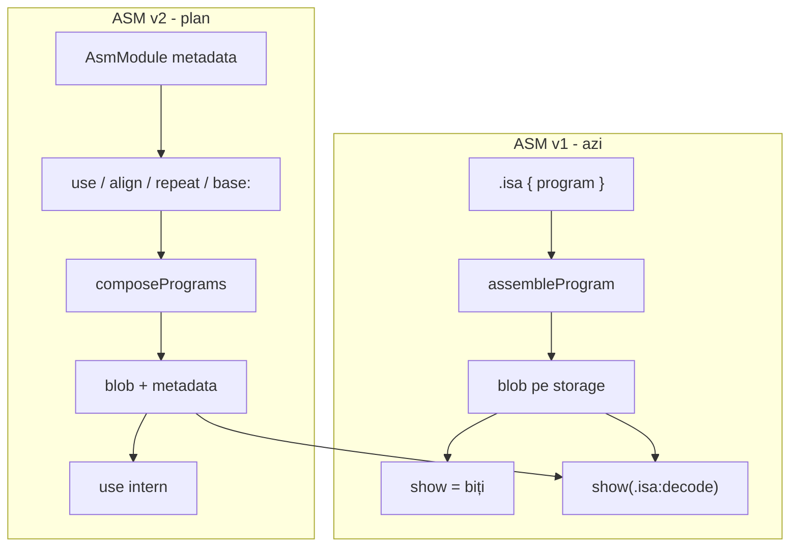

# ASM composition cu `use` (ASM v2)

## Confirmări

| Subiect | Decizie |
|---------|---------|
| Sintaxă `base` | **Doar `base: valoare`** — ex. `base: 0`, `base: BOOT_BASE`, `base: .memoryMap:boot` (fără `base 128` statement) |
| `show(wire)` | **Rămâne afișarea de biți**; disasamblarea doar cu `show(.isa:decode(wire))` explicit |
| Metadate pe fire | **Da** — necesare pentru `use` și `:decode`; nu schimbăm comportamentul `show()` |
| Limbă | Plan în română; **doc + teste + comentarii cod în engleză** |
| Spec sursă | [`v0_3_1/ideas.txt`](v0_3_1/ideas.txt) (linii ~1233–1615) + input utilizator |

---

## Stare actuală (v0_3_2)

Implementat (ASM v1):

- [`asm-assembler.js`](v0_3_2/core/asm-assembler.js) — `parseProgramLines`, `pass1CollectLabels`, `assembleProgram`, `disassembleProgram`
- [`parser.js`](v0_3_2/core/parser.js) — `parseAsmProgramRaw`, atom `{ asmProgram }`
- [`interpreter.js`](v0_3_2/core/interpreter.js) — `evalAsmProgram` → blob; flag temporar `asmBlob: true` (doar padding strict la assign)
- [`doc/asm.md`](v0_3_2/doc/asm.md) — doc v1; teste **883–907**, **947–948**, **1740**

**Lipsesc complet:** `use`, `repeat`, `align`, `base:`, etichete `label>`, metadate persistente, compoziție multi-ISA.



---

## Model: `AsmModule`

Obiect imutabil produs la asamblare, stocat alături de blob:

```javascript
{
  blob: '0101...',           // binary string
  wordWidth: 8,
  segments: [                // pentru multi-ISA după compoziție
    { isaRef: '.cpuA', instrCount: 4, blobOffset: 0 },
    { isaRef: '.cpuB', instrCount: 2, blobOffset: 32 },
  ],
  instructions: [            // per-word decode info
    { index, isaRef, mnemonic, args, sourceLine }
  ],
  labels: { start: 0, dsp: 5, end: 10 },  // global logical instr addresses
  externRefs: [              // unresolved at unit assemble time
    { name: 'dsp', fromIndex: 1, field: 'A4b' }
  ],
  basePreferred: 128,        // resolved numeric; ignored on use unless override
  sourceMap: [...],          // optional
}
```

**Stocare în interpreter:**

- `interp.asmModules` — `Map<moduleId, AsmModule>`
- La `evalAsmProgramAtom`: `storeValue(blob)` + `asmModuleId` pe rezultat și pe intrarea din `wires` (câmp nou `asmModuleId` pe `wireEntry`, similar `symbolicMeta` la LUT)
- La assign `boot = .cpuA { ... }` sau `firmware = boot` — propagare `asmModuleId` (metadata copy by reference, blob copy by value)

Fișiere: [`interpreter.js`](v0_3_2/core/interpreter.js), eventual [`asm-assembler.js`](v0_3_2/core/asm-assembler.js) export `composeAsmModules`.

---

## Faze de implementare

### Faza 1 — Directive locale (`repeat`, `align`, `base:`)

**Fișier principal:** [`asm-assembler.js`](v0_3_2/core/asm-assembler.js)

Extinde `parseProgramLines` / `parseProgramEntry` cu tipuri noi de intrări:

| Directivă | Sintaxă | Comportament |
|-----------|---------|--------------|
| `repeat` | `repeat N { ... }` | Expandare înainte de pass1; `N` integer; corpul poate conține labels, `repeat` imbricat |
| `align` | `align N { block }` | La adresa logică curentă, repetă `block` până `pc % N === 0`; eroare dacă lungimea blocului nu divide gap-ul |
| `base:` | `base: 0` / `base: BOOT_BASE` / `base: .memoryMap:boot` | Setează **adresa logică inițială**; nu emite instrucțiuni; `pass1` pornește de la valoarea rezolvată |

**`base:` rezolvare** (înainte de asamblare, din interpreter):

- Literal: `base: 0`, `base: \128`
- Simbol: `base: BOOT_BASE` — lookup wire/constant definit în script (eroare dacă lipsă)
- LUT label: `base: .memoryMap:boot` — reutilizează pattern din [`lut-labels.js`](v0_3_2/core/lut-labels.js) (`resolveLutLabelRef`)
- **Interzis:** expresii (`base: BOOT_BASE + 256`) — eroare la parse/resolve

**Adrese absolute (`A4b`):** encode `label_addr - base` sau index relativ la base (aliniat cu semantica actuală A = index instrucțiune, dar offsetată de `base`).

Teste 1411–1415 (grup `asm-composition`).

---

### Faza 2 — Etichete externe (`label>`)

**Parser argumente:** extinde `parseArgToken`:

```javascript
// dsp> → { type: 'extLabel', name: 'dsp' }
```

**Scope etichete:**

- `loop:` fără `>` — **local** programului curent (unitate de asamblare)
- `JMP dsp>` — referință **externă**; nu se rezolvă în pass1 local
- `JMP boot>` — poate rezolva în același block, alt `use`, sau după în stream

**Erori:**

```text
Unresolved external label 'dsp'
```

Teste 1416–1418.

---

### Faza 3 — Metadate pe fire + `AsmModule` la asamblare

Refactor [`assembleProgram`](v0_3_2/core/asm-assembler.js) → returnează `AsmModule` (nu doar `{ blob, wordWidth }`).

[`evalAsmProgram`](v0_3_2/core/interpreter.js):

- Înregistrează modulul în `asmModules`
- Propagă `asmModuleId` pe wire la declarație și assign

`:decode` — [`evalAsmDecode`](v0_3_2/core/interpreter.js): dacă operandul are `asmModuleId`, folosește `instructions[]` din modul (multi-ISA: segment potrivit); fallback la disasamblare ISA unică ca azi.

**`show()` — fără schimbare** (confirmat).

Teste 1419–1420 (metadata round-trip, decode din modul).

---

### Faza 4 — `use` și compoziție multi-ISA

**Sintaxă în corpul `{ }`:**

```logts
use boot
use dsp
use driver:
  base: .memoryMap:drivers
```

**Pipeline în 3 etape** (conform spec):

1. **Asamblare independentă** — fiecare wire/program referit (`boot`, `dsp`) devine `AsmModule` cu ISA-ul său
2. **Expandare `use`** — la poziția curentă în stream, inserează blob + segment metadata; **`base:` din modulul inserat ignorat** (relocare automată la offset curent)
3. **Rezolvare `label>`** — pe programul compus final; patch câmpuri `A4b` / re-encode dacă e necesar

**Multi-ISA:** blocul exterior (ex. `.cpuA { use boot; use dsp; end: NOP }`) asamblează doar instrucțiunile `.cpuA`; segmentele `.cpuB` vin pre-asamblate din `use dsp`.

**Override base la use:**

```logts
use driver:
  base: .memoryMap:drivers
```

Asamblează/relochează `driver` cu base-ul furnizat, nu `basePreferred` al modulului.

Teste 1421–1428 (use simplu, multi-ISA, override base, unresolved external).

---

### Faza 5 — Documentație (engleză)

| Fișier | Conținut |
|--------|----------|
| **[`doc/asm-composition.md`](v0_3_2/doc/asm-composition.md)** (nou) | Pagină dedicată: `use`, `label>`, `repeat`, `align`, `base:`, memory map LUT, faze, exemple `logts-play`, „not a linker” |
| [`doc/asm.md`](v0_3_2/doc/asm.md) | Secțiune scurtă + link la `asm-composition.md`; mențiune metadate + `:decode` |
| [`doc/mem.md`](v0_3_2/doc/mem.md) | Notă: mem primește blob final; compoziția e la nivel wire |
| [`doc/doc-index.json`](v0_3_2/doc/doc-index.json) | Intrare `asm-composition.md` lângă `asm.md` |
| `node _gen_doc_data.js` | Regenerare bundle |

Exemple doc obligatorii (din spec):

- Reutilizare `boot` cu `JMP dsp>`
- Multi-ISA `.cpuA` + `.cpuB` + `firmware`
- `repeat 8 { NOP }`
- `align 16 { NOP }` + eroare align imposibil
- `base:` + memory map LUT
- `use boot` cu relocare vs `align 128 { NOP }` + `use boot`
- `use driver: base: .memoryMap:drivers`

---

### Faza 6 — Teste (engleză, id **1411+**)

Grup nou: **`asm-composition`** (sau sub-grupuri `asm-use`, `asm-directives`).

| Id | Titlu (EN) | Verifică |
|----|------------|----------|
| 1411 | `repeat 8 expands to 8 NOPs` | blob length / instruction count |
| 1412 | `align 16 pads with block` | `next` la adresa logică 16 |
| 1413 | `align error unsatisfiable block` | mesaj eroare |
| 1414 | `base colon sets logical start` | encoding A field cu base 128 |
| 1415 | `base colon LUT label` | `base: .memoryMap:boot` |
| 1416 | `base colon rejects expression` | `base: X + 256` → error |
| 1417 | `external label unresolved` | `JMP dsp>` fără `dsp:` |
| 1418 | `external label resolved via use` | boot + dsp + firmware |
| 1419 | `use inserts module blob` | lungime / conținut |
| 1420 | `use ignores embedded base` | boot cu `base: 128` în firmware |
| 1421 | `use base override` | `use driver: base: ...` |
| 1422 | `multi-ISA composition` | `.cpuA` + `.cpuB` în același firmware |
| 1423 | `asm metadata on wire` | `asmModuleId` prezent după assign |
| 1424 | `decode uses module metadata` | `show(.isa:decode(prg))` multi-segment |
| 1425 | `nested repeat and use` | smoke |
| 1426 | `doc asm-composition listed` | doc-index / `doc(asm)` link |

Helper ISAs în teste: extinde `INLINE_ASM_ISA` sau definește `.cpuA` / `.cpuB` minimale în setup.

`node _gen_manifest.js` + `node _run_suite_node.js`.

---

## Fișiere de atins (rezumat)

| Fișier | Schimbări |
|--------|-----------|
| [`asm-assembler.js`](v0_3_2/core/asm-assembler.js) | Directives, ext labels, compose, AsmModule |
| [`parser.js`](v0_3_2/core/parser.js) | Parse `use` / `base:` în program; `use driver:` block |
| [`interpreter.js`](v0_3_2/core/interpreter.js) | `asmModules`, wire metadata, base resolve context, compose pipeline |
| [`lut-labels.js`](v0_3_2/core/lut-labels.js) | Export/refactor resolver pentru `base: .lut:label` |
| [`tests/test_suite.js`](v0_3_2/tests/test_suite.js) | 1411–1426 |
| [`doc/asm-composition.md`](v0_3_2/doc/asm-composition.md) | Doc nou |
| [`doc/asm.md`](v0_3_2/doc/asm.md) | Link + notă scurtă |

---

## Riscuri / atenție

1. **Conflict `repeat`** — în protocol există `repeat`; în ASM e în corp `{ }` cu alt parser de linii — fără ambiguitate dacă `parseProgramEntry` recunoaște `repeat N {`.
2. **`>` în alte contexte** — property redirects (`get>`); în ASM doar ca sufix pe argument label.
3. **Assign strict width** — compoziția poate produce blob mai lung; `=` strict rămâne; documentăm `:=` / `=:` unde e cazul.
4. **Re-assign pierde metadata?** — trebuie definit: `x = boot` copiază `asmModuleId`; `x = ^hex` șterge metadata.
5. **Efort estimat:** ~5–8 zile (model + directive + use + multi-ISA + doc + 16 teste).
