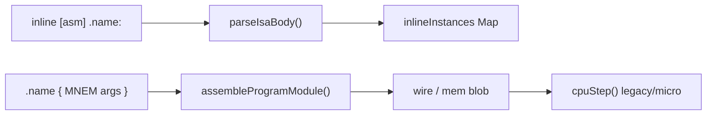
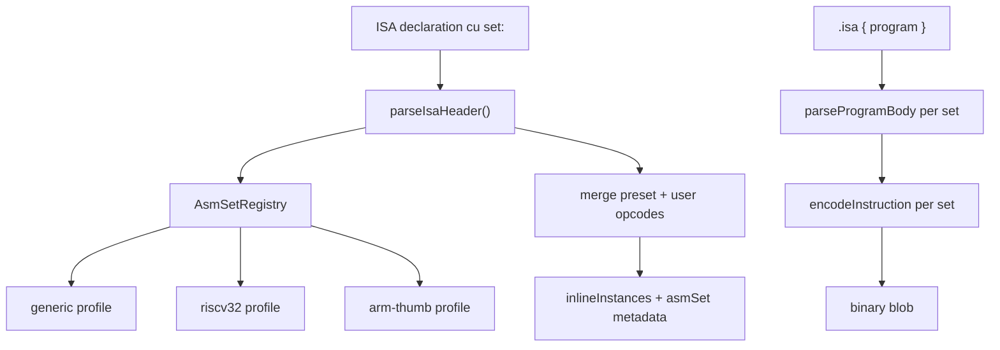
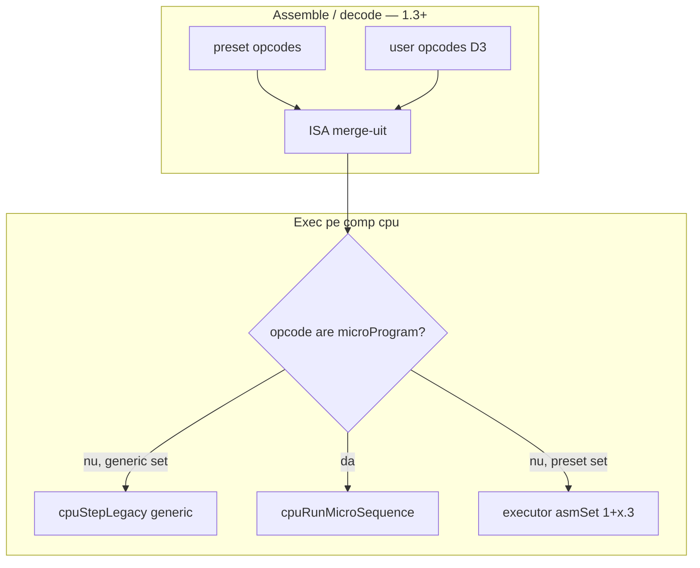
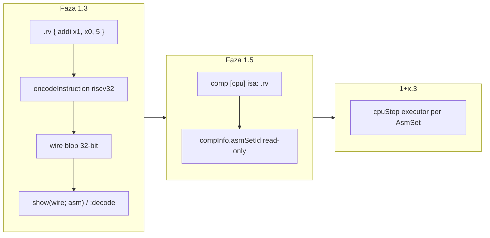
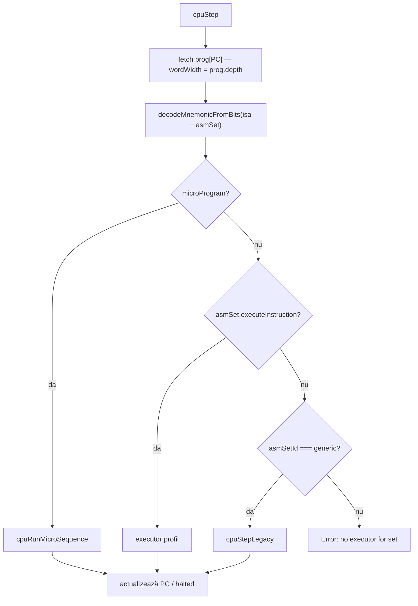
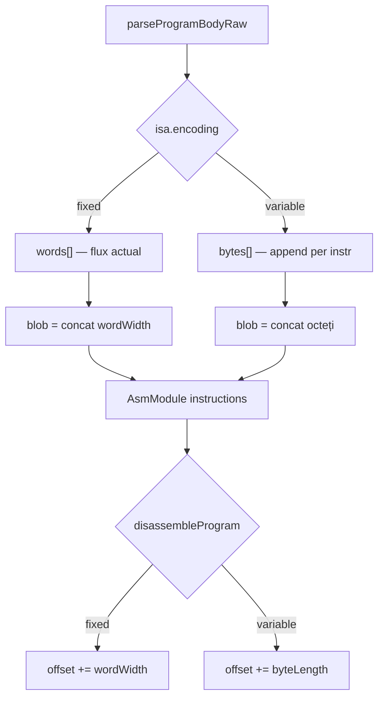
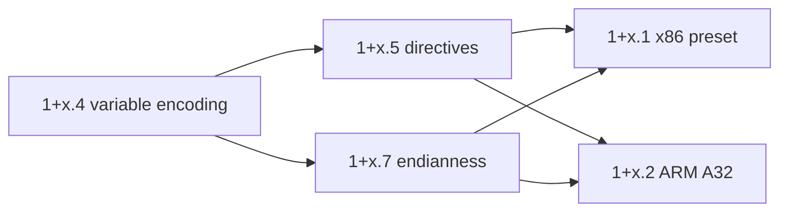

# Plan: Profile de set de instrucțiuni (AsmSet) pentru inline ASM

Introducerea unui sistem modular de profile de arhitectură (AsmSet) în inline ASM, păstrând comportamentul actual ca `set: generic` implicit, și adăugând preset-uri (ex. RISC-V, ARM Thumb) cu posibilitate de extindere.

**Documentație existentă (user):** [v0_3_2/doc/asm.md](../v0_3_2/doc/asm.md) · [asm-composition.md](../v0_3_2/doc/asm-composition.md) · [asm-microcode.md](../v0_3_2/doc/asm-microcode.md)

Relaționat: [faza_7_micro_asm.plan.md](faza_7_micro_asm.plan.md) · [comp_cpu.plan.md](comp_cpu.plan.md) · [asm_composition_use.plan.md](asm_composition_use.plan.md)

---

## Starea codului (aug 2026)

**AsmSet: implementat (faze 1.1–1.5 + 1+x.3a ✅ + 1+x.3b ✅ + 1+x.3c ✅)** — registry, preset-uri `generic`/`riscv32`/`arm-thumb`, policy `inline.asm.set{}`, metadata `asmSetId`, composition multi-set, **executoare CPU nativ riscv32 + arm-thumb**, teste 3176–3232 (**2574** teste).

**Următorul pas (x86/ARM):** **1+x.4** (variable encoding) → **1+x.5** (directives) → **1+x.1** (x86) / **1+x.2** (ARM A32). Alternative: **1+x.3d** (FP) dacă reprioritizat.

Inline ASM rămâne un **mini-asamblor declarativ** — fără x86/ARM/RISC-V preset „din cutie” până la implementarea acestui plan. Utilizatorul definește manual fiecare ISA (sau va folosi preset-uri după 1.3+):

```logts
inline [asm] .myisa:
  NOP   : 0000 + 4b
  LOAD  : 0001 + R2b + A2b
  :
```

**Pipeline actual:**



**Fișiere cheie (v0_3_2):**

| Fișier | Rol |
|--------|-----|
| [`v0_3_2/core/asm-assembler.js`](../v0_3_2/core/asm-assembler.js) | Parsare ISA, encode/decode, asamblare program |
| [`v0_3_2/core/parser.js`](../v0_3_2/core/parser.js) L5212–5288 | `parseInline()`, `parseAsmProgramRaw()` |
| [`v0_3_2/core/interpreter.js`](../v0_3_2/core/interpreter.js) L1866–1888 | `execInline()` — înregistrează ISA |
| [`v0_3_2/devices/cpu-devices.js`](../v0_3_2/devices/cpu-devices.js) L616–647 | Execuție CPU (legacy hardcodat + micro opțional) |
| [v0_3_2/doc/asm.md](../v0_3_2/doc/asm.md) | Documentație sintaxă segmente `R/A/S/imm` |

**Ce lipsește:** orice concept de arhitectură/ISA preset. Operanzii sunt fixi (`R1`, `A3`, `\18`), `wordWidth` fix per ISA, fără variabile pe set.

**Concluzie:** soluția potrivită este un **strat AsmSet modular** deasupra motorului existent, nu înlocuirea lui.

### Deja livrat (planurile dependente subestimează progresul)

| Feature | Plan vechi | Realitate în cod |
|---------|------------|------------------|
| Micro ASM (faza 7) | pending | `consts`/`macros`/bloc `{ micro }` în `parseIsaBody`; `cpuRunMicroSequence` în [`cpu-devices.js`](../v0_3_2/devices/cpu-devices.js) |
| ASM composition | pending | `use`, `repeat`, `align`, `base:` în `parseProgramBodyRaw`; `asmModuleId` pe fire în [`interpreter.js`](../v0_3_2/core/interpreter.js) |

**Implicație:** faza 1.x pornește pe motor matur; nu așteptăm alte planuri. Compoziția `use` + preset multi-ISA trebuie testată explicit în 1.5.

---

## Direcție recomandată

### Model: `set:` la declararea ISA + registry de profile

Sintaxă propusă (backward compatible — fără `set:` = comportament actual):

```logts
inline [asm] .myisa:
  set: generic          # implicit dacă lipsește
  NOP   : 0000 + 4b
  LOAD  : 0001 + R2b + A2b
  :

inline [asm] .riscv:
  set: riscv32          # preset complet — corp gol sau minimal
  :

inline [asm] .rv_ext:
  set: riscv32
  FOO   : 0000000 + 00010 + 000 + 00000 + 0000000 + 0000000 + 1110011
  :
```

**Principii de design:**

1. **`generic`** = exact ce există azi (segmente `0000 + R2b + A4b`, operanzi `R/A/label`)
2. **Preset-urile** livrează opcodes + reguli de operanzi + lățime cuvânt
3. **Extindere (D3):** opcodes declarate după `set:` se **suprapun/adaugă** peste preset — de la faza 1.1; fără directivă `extends:` separată
4. **Modular:** fiecare set = modul JS în `v0_3_2/core/asm-sets/`, înregistrat central
5. **Execuția CPU** — legată de obiectul `inline [asm]` referit prin `isa:` (D7-A); encode/decode și simulare rămân straturi distincte

### Arhitectură țintă



### Structură fișiere noi

```
v0_3_2/core/
  asm-set-registry.js      # registry + resolve + merge
  asm-sets/
    generic.js             # profil formalizat (comportament actual)
    riscv32.js             # primul preset real
    arm-thumb.js           # al doilea preset (faza 1.4)
```

**Interfață profil AsmSet (contract):**

```js
{
  id: 'riscv32',
  label: 'RISC-V RV32I',
  wordWidth: 32,
  encoding: 'fixed',           // 'fixed' | 'variable' (1+x)
  endianness: 'little',
  operandGrammar: 'riscv',     // parser args program
  defaultOpcodes: { ... },     // același format ca opcodes din parseIsaBody
  opcodeOrder: [...],
  consts: {},
  macros: {},
  parseProgramArg(token, ctx),  // opțional — override per set
  validateOpcode(def, set),     // opțional
}
```

Contract profil + flux: `parseIsaHeader → registry → merge → inlineInstances.asmSet`.

---

## Decizii confirmate

| ID | Decizie | Status |
|----|---------|--------|
| D1 | Directive `set:`; **`generic` implicit** dacă lipsește | Confirmat |
| D2 | `set:` **doar în declarația ISA** (`inline [asm] .name:`), nu în blocul `{ program }` | Confirmat |
| D3 | OpCodes user **extind și suprascriu** preset-ul (merge după `set:`) — **singurul** mecanism de extindere; nu există `extends:` | Confirmat |
| **D3b** | **`extends:` respins** — redundant cu `set:` + opcodes user; nu se implementează | **Confirmat** |
| D4 | Primul preset real: **RISC-V RV32I** | Confirmat |
| D5 | Al doilea preset: **ARM Thumb 16-bit** | Confirmat |
| D6 | x86/x86-64 | Amânat 1+x |
| **D7** | **Opțiunea A:** CPU doar cu `isa: .name`; `asmSet` moștenit din `inlineInstances`; `doc(.cpu)` afișează `asmSet` read-only | **Confirmat** |
| D8 | Policy per set Allow/NotAllow | Confirmat |
| **D9** | Sintaxă policy: **`inline.asm.set{…}`** — extindem parserul Allow/NotAllow (nu `module.type{}`) | **Confirmat** |
| **D10** | Metadata `asmSetId` pe AsmModule (lângă `asmModuleId`) | **Confirmat** |
| **D11** | Corp ISA gol cu preset (`set: riscv32` + `:`) — merge preset, fără eroare „no opcodes” | **Confirmat** |
| **D12** | Faza 1.3 riscv32: **assemble + decode**; exec CPU pe set amânat (1+x.3) | **Confirmat** |
| **D13** | **ASM composition** (`use`, `repeat`, `align`, `base:`) funcționează cu preset-uri AsmSet | **Confirmat** — obligatoriu în implementare |
| **D14** | **Microcode** pe seturi noi: model stratificat (vezi secțiune dedicată) | **Confirmat** |
| **D15** | **Routing exec CPU:** micro → executor nativ AsmSet → legacy **doar** `generic`; set non-generic fără micro/executor → **eroare** | **Confirmat** |
| **D16** | Executor nativ pe **profil AsmSet** (`executeInstruction` în `asm-sets/*.js`); `cpuStep` = router subțire | **Confirmat** |
| **D17** | **D17-A:** mapare directă `xN` → `c.regs[N]`; **eroare la init CPU** dacă `registers` / `regDepth` ≠ cerințele profilului | **Confirmat** |
| **D18** | **D18-A:** PC = **index instrucțiune** (nu adresă byte RV); `prog[PC]` fetch | **Confirmat** |
| **D19** | **D19-A:** `lw`/`sw` word-aligned, `ram[index]` cu `index = byteAddr >> 2`; `ram.depth` = wordWidth profil | **Confirmat** |
| **D20** | Exec MVP = subset encode faza 1.3; extensii (mul, div, lb/lh, fence, ecall, FP) → **1+x.3c** | **Confirmat** |
| **D21** | CPU decode/exec cu **profil unic** din `isa:` (fără metadata per instrucțiune); prog heterogen/raw permis la load — comportament nedorit **documentat**, fără eroare/warning | **Confirmat** |
| **D22** | **1+x.3a** = proof of concept riscv32; **arm-thumb exec** → 1+x.3b | **Confirmat** |
| **D23** | **1+x.3c** în sub-faze **3c-i → 3c-ii → 3c-iii** (fără FP) | **Confirmat** |
| **D24** | **M minimal:** `mul`, `div`, `divu`, `rem`, `remu`; **÷0 = A+C:** rezultate RV32M în `rd` + flag pedagogic **`divByZero`** (fără throw) | **Confirmat** |
| **D25** | Mem byte/half: RAM 32-bit cells; aliniere ca RV; little-endian; RMW la `sb/sh` | **Confirmat** |
| **D26** | `fence`/`fence.i` no-op; `ecall`/`ebreak` → `halted` + **`trapCause`** | **Confirmat** |
| **D27** | **FP amânat** (1+x.3d) | **Confirmat** |
| **D28** | Extindere preset **`riscv32`** + override **`{ micro }`** pe opcodes noi | **Confirmat** |
| **D29** | Blob **byte-oriented** pentru `encoding: 'variable'` — stream de octeți (8 biți/celulă logică), nu padding la wordWidth fix | **Confirmat** — prerechizit 1+x.4 |
| **D30** | `encoding: 'fixed' \| 'variable'` pe profil; la `variable`, `wordWidth` = **unitate minimă de stocare** (8); preset-urile existente rămân `fixed` | **Confirmat** |
| **D31** | Metadata per instrucțiune: `byteOffset`, `byteLength`, `kind: 'code' \| 'data'`; `:decode` parcurge offset variabil | **Confirmat** |
| **D32** | **PC CPU = index instrucțiune** (D18) **păstrat**; fetch variable = `instructions[PC].byteOffset` + `byteLength`; salturi byte (x86 `rel32`) = adresă logică separată de PC didactic | **Confirmat** |
| **D33** | Directives în `{ program }`: **`.org`**, **`.byte`**, **`.word`**, **`.skip`**; **`.align`** extinde `align:` existent — vezi [exemple D33](#d33--exemple-directives) | **Confirmat** — 1+x.5 |
| **D34** | Label resolution: la `variable` → **adresă byte** (`locationCounter`); la `fixed` → index instrucțiune (comportament actual) | **Confirmat** |
| **D35** | **x86-32** preset: `encoding: 'variable'`, sintaxă **Intel** (MVP); subset ~20 mnemonici — vezi [exemple D35](#d35--exemple-x86-intel-mvp) | **Confirmat** — 1+x.1 |
| **D36** | **ARM A32:** strategie **2a** = preset separat `arm-a32` (fixed 32 sau variable 4B) + `use` cu `arm-thumb`; **2b** (amânat) = profil mixt `arm-cortex-a` cu directive `.thumb`/`.arm` | **Confirmat** — 1+x.2 |
| **D37** | **Nu implementa x86/ARM** pe modelul blob fix-width actual — obligatoriu **1+x.4 + 1+x.5** înainte | **Confirmat** |

### D33 — Exemple directives

Sintaxă în blocul `{ program }` (aceleași immediate ca la `addi`: decimal sau `0x…`). La **`encoding: 'variable'`**, **`locationCounter`** = adresă **byte**; gap-urile la `.org` se umplu cu **`0x00`** (decizie implementare — documentat).

#### Exemplu 1 — Tabel de vectori (ARM / generic layout)

```logts
inline [asm] .vec:
  set: generic
  encoding: variable
  :

32wire vectors = .vec {
  .org 0
  .word 0x00000000
  .word 0x00008000
  .word 0x00008008
  reset: .word 0x00008040
}
```

| Adresă byte | Emis | Rol |
|-------------|------|-----|
| `0x00`–`0x03` | `.word 0` | reset SP (placeholder) |
| `0x04`–`0x07` | `.word 0x8000` | handler nmi |
| `0x08`–`0x0B` | `.word 0x8008` | handler fault |
| `0x0C`–`0x0F` | label `reset` | entry point |

**`:decode`:** pseudo-linii `.org 0`, `.word …`, nu opcode necunoscut.

#### Exemplu 2 — Boot sector x86 la `0x7C00` (după 1+x.1)

```logts
inline [asm] .boot:
  set: x86-32
  :

128wire mbr = .boot {
  .org 0x7C00
  start:
    jmp short setup
    .byte 0x90, 0x90
  setup:
    mov ax, 0x07C0
    mov ds, ax
    .skip 510 - (. - start)
    .word 0xAA55
}
```

- **`.org 0x7C00`** — următorul octet la adresă logică `0x7C00` (didactic: offset 0 în blob = `0x7C00` în hartă).
- **`.byte 0x90, 0x90`** — NOP-uri de padding BIOS.
- **`.skip n`** — `n` octeți `0x00` (aici formulă NASM-style `510 - (. - start)` — **evaluare la assemble** pe `locationCounter`).
- **`.word 0xAA55`** — semnătură boot little-endian → octeți `55 AA`.

#### Exemplu 3 — String + date amestecate cu cod

```logts
32wire pkg = .x86 {
  .org 0x100
  msg:
    .byte 72, 105, 10
  code:
    mov eax, 1
    mov ebx, msg
    int 0x80
}
```

| Offset | Conținut | Decode |
|--------|----------|--------|
| `0x100` | `48` | `.byte 72` → `'H'` |
| `0x101` | `69` | `'i'` |
| `0x102` | `0A` | newline |
| `0x103+` | `B8 01…` | `mov eax, 1` |

Label **`msg`** = **`0x100`** (byte); **`code`** = **`0x103`**.

#### Exemplu 4 — `.align` înainte de salt

```logts
32wire jumpTable = .x86 {
  loop:
    jmp loop
  .align 4
  target:
    nop
}
```

- **`jmp`** ocupă 2 octeți (ex. `EB FE`).
- **`.align 4`** — `locationCounter` avansează cu `0x00` până la multiplu de 4.
- Label **`target`** = primul octet aliniat.

#### Exemplu 5 — `.org` cu gap (fill zero)

```logts
16wire rom = .arm-a32 {
  .org 0
  vectors: .word reset_handler
  .org 0x100
  reset_handler:
    mov r0, 1
}
```

| Interval | Conținut |
|----------|----------|
| `0x00`–`0x03` | pointer reset |
| `0x04`–`0xFF` | **auto-fill `0x00`** (gap) |
| `0x100` | prima instrucțiune |

#### Reguli sintaxă D33 (rezumat)

| Directivă | Forme acceptate (MVP) |
|-----------|------------------------|
| `.org expr` | `0`, `0x100`, `0x7C00`, label aritmetică ulterior |
| `.byte expr [, expr …]` | `255`, `0xFF`, `72` |
| `.word expr` | 4 octeți LE pe profil 32-bit; 2 octeți pe profil 16-bit (arm-thumb data) |
| `.skip expr` | număr octeți zero |
| `.align n` | `n` = 2, 4, 8, 16 (putere a lui 2) |

**Notă:** alias NASM `db`/`dw`/`dd` — **amânat**; MVP = doar `.byte`/`.word`. `.word` pe **x86-32** = **4 octeți** (echivalent `dd`); pe **arm-thumb** data section = **2 octeți** — lățimea vine din profil (`wordBytes: 2|4`).

### D35 — Exemple x86 Intel (MVP)

Profil **`x86-32`**, **`encoding: 'variable'`**, ordine operanzi **Intel** (`dest, src`). Registre 32-bit MVP: **`eax`–`edi`**, **`esp`**, **`ebp`**. Fără prefixe, fără `fs`/`gs`.

#### Mapare registre (ModR/M reg field)

| Reg | Cod 3-bit |
|-----|-----------|
| eax | 0 |
| ecx | 1 |
| edx | 2 |
| ebx | 3 |
| esp | 4 |
| ebp | 5 |
| esi | 6 |
| edi | 7 |

#### Exemplu A — Registre și immediate (MOV, ADD, SUB)

```logts
inline [asm] .x86:
  set: x86-32
  :

64wire demo = .x86 {
  mov eax, ebx
  mov eax, 5
  add eax, 1
  sub eax, 2
  nop
}
```

| Sursă | Octeți (hex) | Instrucțiune |
|-------|--------------|--------------|
| `mov eax, ebx` | `89 D8` | `mov eax, ebx` (89 /r, ebx→eax) |
| `mov eax, 5` | `B8 05 00 00 00` | `mov eax, imm32` |
| `add eax, 1` | `83 C0 01` | `add eax, imm8` (sign-extended) |
| `sub eax, 2` | `83 E8 02` | `sub eax, imm8` |
| `nop` | `90` | `nop` |

**Blob total:** 13 octeți. Metadata: 5 intrări `kind: 'code'` cu `byteLength` 2, 5, 3, 3, 1.

#### Exemplu B — Stack (PUSH / POP)

```logts
64wire stackOps = .x86 {
  push eax
  pop ebx
  ret
}
```

| Sursă | Octeți | Notă |
|-------|--------|------|
| `push eax` | `50` | `push eax` (opcode+reg) |
| `pop ebx` | `5B` | `pop ebx` |
| `ret` | `C3` | near return |

#### Exemplu C — Salturi și comparații (JMP, JE, JNE, CMP)

```logts
64wire branch = .x86 {
  cmp eax, ebx
  je equal
  jmp done
equal:
  mov eax, 1
done:
  mov ebx, 2
}
```

| Sursă | Octeți (tipic) | Notă |
|-------|----------------|------|
| `cmp eax, ebx` | `39 D8` | `cmp eax, ebx` |
| `je equal` | `74 xx` | short jump rel8 dacă distanța ≤ 127 |
| `jmp done` | `EB xx` | short jump |
| `mov eax, 1` | `B8 01 00 00 00` | la label `equal` |
| `mov ebx, 2` | `BB 02 00 00 00` | la label `done` |

**Label-uri:** adresă **byte** (D34). **`je`/`jmp`** calculează offset relativ față de **octetul următor** instrucțiunii curente (convenție x86).

#### Exemplu D — CALL și memorie simplă (disp8)

```logts
64wire mem = .x86 {
  mov eax, [ebp-4]
  mov [ebp-4], eax
  call helper
helper:
  ret
}
```

| Sursă | Octeți (tipic) | ModR/M |
|-------|----------------|--------|
| `mov eax, [ebp-4]` | `8B 45 FC` | `[ebp+disp8]` |
| `mov [ebp-4], eax` | `89 45 FC` | store |
| `call helper` | `E8 xx xx xx xx` | rel32 (MVP: rel32 dacă short insuficient) |

**MVP 1+x.1a:** doar **`[ebp±disp8]`** și **`[esp±disp8]`**; fără SIB, fără `[eax+ebx*4]`.

#### Exemplu E — Program complet (assemble + decode)

```logts
inline [asm] .x86:
  set: x86-32
  :

comp [cpu] .u:
  isa: .x86
  registers: 8
  on: 1
  maxSteps: 10
  prog:
    depth: 8
    length: 32
    = .x86 {
      .org 0
      mov eax, 10
      mov ebx, 3
      add eax, ebx
      jmp halt
      nop
    halt:
      jmp halt
    }
  :

show(.x86:decode(.u:prog:get))
```

**Load & Run (după 1+x.1b):** `eax` = 13. **Înainte de exec:** `show(decode)` listează mnemonici + offset byte.

#### Subset mnemonici D35 (1+x.1a — checklist encode/decode)

| Categorie | Mnemonici |
|-----------|-----------|
| ALU | `mov`, `add`, `sub`, `cmp`, `and`, `or`, `xor` |
| Stack | `push`, `pop` |
| Control | `jmp`, `je`, `jne`, `call`, `ret` |
| Misc | `nop`, `int` (imm8) |
| Operanzi | reg-reg, reg-imm8/imm32, reg↔`[ebp±disp8]` |

**Amânat 1+x.1c:** `lea`, `mul`, `div`, segment overrides, `word` ptr, prefix `0x66`/`0x67`, x86-64.


### D1 — Default `generic`

Lipsa directivei `set:` este echivalentă cu `set: generic`. Comportament identic cu implementarea actuală; testele existente rămân valide fără modificări.

```logts
inline [asm] .myisa:     # asmSet = generic (implicit)
  NOP : 0000 + 4b
  :
```

### D7 — Integrare `comp [cpu]` și AsmSet (Opțiunea A confirmată)

**Starea actuală** ([`v0_3_2/core/components/cpu.js`](../v0_3_2/core/components/cpu.js), [`v0_3_2/devices/cpu-devices.js`](../v0_3_2/devices/cpu-devices.js)):

```logts
inline [asm] .cpuisa:
  NOP : 0000 + 4b
  ...

comp [cpu] .u:
  isa: .cpuisa          # referință la instanța inline [asm]
  prog: = .cpuisa { NOP; HALT }
  :
```

Flux: `isa: .cpuisa` → `isaRef` pe CPU → `ctx.inlineInstances.get(isaRef)` → opcodes, consts, macros, microProgram. **CPU nu are atribut `set:` separat.**

| Opțiune | Descriere | Verdict |
|---------|-----------|---------|
| **A** | Doar `isa: .name`; CPU citește `asmSet` din instanța inline referită | **Confirmat** |
| B | Atribut nou `set:` pe `comp [cpu]` | Respingem — redundant |
| C | Snapshot ISA la init | Parțial via `isaRef`; extindem cu `asmSetId` pe AsmModule (D10), nu duplicare pe CPU |

**La implementare (faza 1.5 / 1+x.3):**

- `execInline()` stochează `asmSet` pe instanța `.cpuisa`
- `cpuStep()` continuă să rezolve ISA via `c.isaRef`, citește `isaInst.asmSet` pentru routing execuție (legacy vs micro vs executor per-set viitor)
- `doc(.cpu)` afișează `isa: .cpuisa` + `asmSet: riscv32` (moștenit, read-only)
- Fără atribut `set:` duplicat pe CPU

### D8 / D9 — Policy per set (`inline.asm.set{…}`)

**Confirmat:** sintaxa user-facing oglindește atributul ISA `set:`:

```logts
Allow inline.asm.set{generic riscv32 arm-thumb}
NotAllow inline.asm.set{x86}

inline [asm] .rv:
  set: riscv32    # OK dacă valoarea e în Allow
  :
```

Parserul Allow/NotAllow acceptă azi doar `moduleName.type{tokens}`. **Extindem parserul** ([`parser.js`](../v0_3_2/core/parser.js) `_parsePolicyEntries`):

- Recunoaște pattern **`inline.asm.set{…}`** (ID `inline` + `.asm` + `.set` + `{`)
- Dimensiune policy internă: moduleName **`inline.asm.set`** (sau echivalent în `UsagePolicy`)
- Token-uri: `generic`, `riscv32`, `arm-thumb`, … — aceleași ID-uri ca valorile `set:` din registry
- Validare la `execInline()`: `usagePolicy.isModuleAllowed('inline.asm.set', asmSetId)`
- Registry + resolve token în [`policy-type-modules.js`](../v0_3_2/core/policy-type-modules.js)
- `doc(Allow)` / `doc(NotAllow)` afișează `inline.asm.set{…}`
- Documentat în [`allow-notallow.md`](../v0_3_2/doc/allow-notallow.md)

### D10 — Metadata `asmSetId` pe AsmModule

Pe lângă `asmModuleId` existent, stocăm `asmSetId` la `_registerAsmModule()` — `:decode`, `show(wire; asm)` și compoziția `use` știu ce profil/format de operanzi au fost folosite, chiar dacă ISA user a suprascrie opcodes din preset.

### D11 — Corp ISA gol cu preset

`set: riscv32` + `:` fără opcodes user → merge preset complet; **`parseIsaBody` nu mai aruncă** „ISA definition has no opcodes” după merge.

### D12 — Scope faza 1.3 (riscv32)

Livrabile 1.3: **encode + decode round-trip** (`show(wire; asm)`, `.rv:decode(wire)`). **Exec CPU** pe riscv32 → **1+x.3** (executor per AsmSet).

### D3 / D3b — Extindere: doar `set:` + opcodes user (fără `extends:`)

**Ce face extinderea (de la faza 1.1):**

```logts
inline [asm] .rv_ext:
  set: riscv32              # 1) alege profil din registry
  FOO : ... + ...           # 2) opcodes user: adaugă sau suprascriu preset (D3)
  HALT: ... { micro ... }   # 3) poate suprascrie și execuția (micro), dacă e cazul
  :
```

Flux: `resolveAsmSet('riscv32')` → merge `defaultOpcodes` + opcodes user → ISA final pe instanță.

**`extends:` — respins definitiv (D3b):** nu există în cod/doc; nu se planifică. Era o propunere echivalentă cu `set:` + D3, eliminată din plan.

### De ce „ambiguitate” la `extends:` dar nu la `set:`?

Ambiguitatea nu era „opcodes extra” — asta e clar și merge prin D3. Problema era **moștenire în lanț**, sugerată de cuvântul *extends* (model OOP):

| Interpretare greșită posibilă cu `extends:` | Planificat? |
|-----------------------------------------------|-------------|
| `extends: .alt_isa` — moștenesc altă instanță `inline [asm]` user | Nu |
| Lanț preset: `.c` extends `.b` extends `riscv32` | Nu |
| Două linii `extends:` în același ISA | Nu |

**`set:` nu are aceeași ambiguitate** pentru că:

1. **O singură linie**, **o singură valoare** — alege profil din **registry fix** (`generic`, `riscv32`, `arm-thumb`), nu referință la alt `.myisa`
2. **Un nivel de merge:** preset registry + opcodes din **același** corp ISA (D3) — nu lanț ISA→ISA
3. **Semantica e „profil/template”**, nu „class extends class”

Reguli explicite (implementare + doc):

- Cel mult un `set:` per declarație; duplicate → eroare parse
- Valoarea trebuie ID valid din registry; `set: .other_isa` → eroare
- OpCodes user = override/add pe presetul ales, nu moștenire de la alt inline

Compoziție între module ASM rămâne separată: directive **`use`** în blocul `{ program }` ([asm-composition.md](../v0_3_2/doc/asm-composition.md)), nu în declarația ISA.

---

## Model binar: encode, decode, CPU (D12 + întrebări user)

### Cum arată binary-ul pentru noile seturi?

**Același model ca azi:** blob = concatenare de **cuvinte fixe** (`wordWidth` biți), fără metadata în biți.

| Set | `wordWidth` | Exemplu per instrucțiune |
|-----|-------------|---------------------------|
| `generic` (custom) | ce definești tu (ex. 8, 16) | `0000` + `R2b` + `A4b` → 8 biți |
| `riscv32` | **32** | un cuvânt RV32I (ex. `addi x1,x0,5` → 32 biți little-endian în blob) |
| `arm-thumb` | **16** | un halfword Thumb → 16 biți per instrucțiune |

Profilul preset definește opcodes (segmente biți) + parser operanzi (sintaxă `addi x1, x0, 5` vs `LOAD R0 A0`). **Motorul de blob nu se schimbă** — doar lățimea cuvântului și regulile encode/decode per set.

```logts
128wire prog = .rv { addi x1, x0, 5; add x3, x1, x2 }
# prog = 64 biți (2 × 32) — aceeași structură wire ca la generic, alt wordWidth
```

### Program asamblat: binary + AsmModule (ca azi)

Când scrii `.rv { … }` sau `comp [cpu] prog: = .rv { … }`:

1. **blob** pe wire/storage — biți concatenați
2. **AsmModule** (metadata): `instructions[]`, mnemonici/args sursă, `word` per instrucțiune, `isaRef`, **`asmSetId`** (D10), `asmModuleId` pe wire

`show(prog; asm)` — decode din metadata (sursa originală), ca azi.

### Wire doar binary, fără asmModule — se poate decoda?

| Situație | Decode |
|----------|--------|
| Wire din `.rv { … }` | Da — `asmModuleId` + `show(wire; asm)` sau `.rv:decode(wire)` |
| Wire raw (`128wire x = ^…` sau literal biți), **fără** `asmModuleId` | **`show(wire)`** = doar biți (neschimbat) |
| Wire raw + ISA explicit | Da — **`show(.rv:decode(x))`** — [`evalAsmDecode`](../v0_3_2/core/interpreter.js) apelează `disassembleProgram(isa, bits)` dacă nu există modul |
| Wire raw, fără ISA | **Nu** — nimeni nu știe wordWidth/opcodes; trebuie `.numeisa:decode(wire)` sau wire asamblat cu metadata |

**Condiții decode explicit** (`.rv:decode(wire)`):

- Lungime biți **multiplu de** `wordWidth` (32 pentru riscv32)
- Biții respectă opcode-urile din instanța `.rv` (preset merge-uit + override user)
- Faza 1.3 extinde **`disassembleInstruction`** pentru formatare operanzi RISC-V (`x1`, nu `R1`)

### CPU: binary în prog + exec (viitor)

```logts
comp [cpu] .u:
  isa: .rv
  prog: = .rv { addi x1, x0, 5 }   # sau = wireRaw fără metadata
  :
```

| Aspect | Azi / 1.3–1.5 | 1+x.3 (exec CPU per set) |
|--------|----------------|---------------------------|
| **Fetch** | Citește cuvânt fix din prog (depth = wordWidth) | La fel — blob e același |
| **Decode trace** | Via `isaRef` → opcodes instanță `.rv` | La fel + `asmSetId` |
| **Execute** | `cpuStepLegacy` (generic 4-bit) sau micro pe opcode | Executor pe **`asmSet`** (riscv32, etc.) |
| **prog = raw binary** | Merge dacă `depth`/`length` OK; **decode** necesită `isa:` | **Exec** necesită `isa:` — CPU știe setul din instanță, nu din blob |

**Răspuns scurt:** da, noile seturi **se encodifică și se decodifică** ca blob fix-width; metadata AsmModule e opțională dar utilă; binary gol poate fi decodat **doar cu ISA explicit**; CPU va putea executa binary-ul același (inclusiv raw) **când** implementăm exec pe set (1+x.3) **și** CPU are `isa: .rv` (D7-A).

---

## ASM composition cu AsmSet (D13)

Composition (`use`, `repeat`, `align`, `base:`, etichete externe) **există deja** în [`asm-assembler.js`](../v0_3_2/core/asm-assembler.js). Cu AsmSet trebuie să **rămână validă** și extinsă pentru preset-uri — nu e feature separat, e **criteriu de acceptanță** în fiecare fază relevantă.

### Comportament țintă

```logts
inline [asm] .boot:
  set: generic
  NOP : 0000 + 4b
  :

inline [asm] .app:
  set: riscv32
  :

8wire bootBlob = .boot { NOP }
128wire app = .app {
  use bootBlob: base: 0
  addi x1, x0, 5
}
show(app; asm)
```

| Aspect | Reguli |
|--------|--------|
| **`use`** | Wire-ul referit are propriul `isaRef` + **`asmSetId`** (din modulul asamblat); segment compus păstrează ISA/set per instrucțiune |
| **Multi-set în același blob** | Permis — ex. segment `generic` 8b + segment `riscv32` 32b concatenați (ca azi multi-ISA); **fără** presupunere de `wordWidth` unic pe tot modulul |
| **`:decode` / `show(wire; asm)`** | `formatModuleDecode` folosește **`ins.isa` + `ins.asmSetId`** per instrucțiune (nu doar ISA principal) |
| **`base:` / labels** | Neschimbat — resolve pe adrese instrucțiuni; validare cross-set la patch externe |
| **Metadate modul** | `module.segments[]`: `isaRef`, **`asmSetId`**, `wordWidth`, `blobOffset`, `instrCount` per segment |
| **Instrucțiuni index** | Fiecare entry din `instructions[]`: `word`, `isa`, `isaRef`, **`asmSetId`**, `wordWidth` (per instrucțiune) |

### Implementare (pe faze)

- **1.1:** la merge preset, propagăm `asmSetId` pe instanța inline; module simple (fără `use`) stochează `asmSetId` pe modul
- **1.3:** teste composition: `use` wire riscv32 + corp riscv32; decode corect pe ambele segmente
- **1.4:** test `use` cu `arm-thumb` (16b) + `riscv32` (32b) — demonstrează `wordWidth` heterogen
- **1.5:** teste E2E composition + policy + CPU `isa:` (decode/trace pe segmente mixte)

### Limitări acceptate (MVP)

- **Nu** impunem același `set:` pe program și pe wire-ul `use` — combinații libere dacă encode/decode per segment reușesc
- **CPU exec** pe blob compus multi-set: CPU folosește **un singur profil** din `isa:` (D21); metadata per instrucțiune e pentru `:decode`, nu pentru fetch CPU; prog heterogen ca input CPU → comportament nedorit documentat, fără eroare la load

---

## Microcode pe seturi noi (D14)

Micro ASM ([`asm-microcode.md`](../v0_3_2/doc/asm-microcode.md)) **există** pentru ISA **generic/custom**: `consts`, `macros`, `{ micro }` per mnemonic, dual legacy/micro în [`cpu-devices.js`](../v0_3_2/devices/cpu-devices.js).

**Preset-urile (`riscv32`, `arm-thumb`) nu livrează microProgram implicit** — doar opcodes + parser operanzi (faza 1.3–1.4). Exec nativ pe set → **1+x.3**.

### Model stratificat (3 căi)



| Cale | Când | Cine |
|------|------|------|
| **1. Encode/decode** | Întotdeauna | Profil AsmSet — fără micro |
| **2. Micro user (D3)** | User adaugă `{ micro }` pe mnemonic (inclusiv override preset) | Motor micro **existent** — opcodes cu `microProgram` |
| **3. Exec nativ** | Preset fără micro | **1+x.3** — `cpuStep` pe `asmSetId` |

### Reguli micro + preset

1. **`consts:` / `macros:`** rămân în header ISA (după `set:`) — merge cu preset; valabile pentru orice set dacă user le declară
2. **Override cu micro (D3):**

```logts
inline [asm] .rv_cpu:
  set: riscv32
  consts:{ MAR = ^10; MDR = ^11; ... }
  addi : ...pattern... {    # suprascrie preset addi
    # micro sequence — demo didactic
  }
  :
```

3. **Operanzi decodați → micro:** motorul micro azi citește `fields.R`, `fields.A`, `fields.imm` din [`decodeMnemonicFromBits`](../v0_3_2/core/asm-assembler.js) (segmente `reg`/`addr`/`imm`). Preset-urile RISC-V/Thumb definesc segmente compatibile sau hook **`mapDecodedFieldsForMicro(fields, asmSet)`** pe profil (faza 1.3+ dacă e nevoie pentru demo micro pe preset)
4. **Preset fără `{ micro }` + CPU `isa: .rv`** → encode/decode OK; **exec** e no-op/legacy greșit până la 1+x.3 — documentat (D12)
5. **Composition + micro:** fiecare segment păstrează opcodes/consts/micro de la **instanța ISA referită**; micro rulează doar dacă CPU `isaRef` pointează la instanța cu microProgram pentru mnemonicul decodat (comportament actual extins)

### Ce NU facem în MVP

- MicroProgram **complet pe fiecare** mnemonic RISC-V din preset (efort enorm, duplică 1+x.3)
- `riscv16` / preset fictiv — respins (vezi discuție RV32/RVC)

### Doc + teste

- Secțiune în `asm-sets.md` / `asm-microcode.md`: „Micro pe preset — override opțional (D3); exec preset fără micro → 1+x.3”
- Test 1.5: `set: generic` cu micro mixt + `use` wire `riscv32` (composition + metadata)
- Test opțional 1.3: un mnemonic riscv32 suprascrie cu `{ micro }` + CPU step pe acel opcode only

---

## Faza 1.3 riscv32 — scope confirmat (D12)



**De ce nu exec CPU în 1.3:**

- [`cpuStepLegacy`](../v0_3_2/devices/cpu-devices.js) e hardcodat pe opcode-uri 4-bit — **incompatibil RISC-V**
- Motor micro există, dar microProgram pe **fiecare** mnemonic RISC-V = efort mare, duplică 1+x.3
- Cale practică interim: utilizatorul poate **suprascrie** un mnemonic preset cu bloc `{ micro }` (D3 + dual execution deja live) pentru demo punctual — fără obligație în preset

**Livrabil 1.3:** subset (`addi`, `add`, `sub`, `lui`, `lw`, `sw`, `beq`, `bne`, `jal`, `jalr`, `nop`), registre `x0`–`x31`, teste `{ src → blob → disassemble → compare }`, decode explicit pe wire raw fără asmModule.

---

## Faze de implementare

### Faza 1.1 — Infrastructură AsmSet registry ✅

**Scop:** suport `set:` fără schimbare de comportament.

**Modificări:**

- [`asm-assembler.js`](../v0_3_2/core/asm-assembler.js): `parseIsaHeader(raw)` — citește `set:`, `consts:`, `macros:` înainte de opcodes; merge preset
- Nou [`asm-set-registry.js`](../v0_3_2/core/asm-set-registry.js): `registerAsmSet()`, `resolveAsmSet(id)`, `mergeIsaWithSet(userIsa, preset)`
- [`interpreter.js`](../v0_3_2/core/interpreter.js) `execInline()`: stochează `asmSet`, `asmSetLabel` pe instanță
- [`asm-sets/generic.js`](../v0_3_2/core/asm-sets/generic.js): profil explicit cu `id: 'generic'`, fără opcodes preset
- Teste: ISA fără `set:` trece identic; `set: generic` echivalent; `set: unknown` → eroare clară
- `doc(inline.asm)` + `formatInstanceDoc()` — afișează `set: …`

**Backward compatibility:** 100% — lipsa `set:` = `generic`.

---

### Faza 1.2 — Formalizare profil `generic` + validare pe set ✅

**Scop:** reguli explicite pentru setul actual.

- Mută logica `parseFieldToken`, `parseArgToken`, `resolveArgValue` sub responsabilitatea profilului `generic`
- Validare: dacă `set: riscv32` dar opcodes folosesc tokeni `R2b`/`A4b` → eroare „segment token 'R2b' invalid for set 'riscv32'”
- `doc(inline.asm.sets)` — listă profile disponibile + scurtă descriere
- Teste negative: segmente greșite pe set greșit

---

### Faza 1.3 — Preset `riscv32` (RV32I subset) ✅

**Scop:** primul set real, fixed 32-bit — **assemble/decode only** (fără CPU exec).

**Preset include (subset practic):**

- `addi`, `add`, `sub`, `lui`, `lw`, `sw`, `beq`, `bne`, `jal`, `jalr`, `nop` (alias)
- Registre: `x0`–`x31` (alias `zero`, `ra`, `sp`, …)
- Immediat: `addi x1, x0, 42`
- Labels: `beq x1, x0, loop`

**Modificări:**

- [`riscv32.js`](../v0_3_2/core/asm-sets/riscv32.js): tabel opcodes + `parseProgramArg` / `parseInstructionLine`
- `parseProgramBodyRaw`: delegare când set ≠ generic
- Corp preset-only + teste round-trip, `show(wire; asm)`, erori operanzi invalizi
- **Composition (D13):** `use` + `base:` cu wire/module preset; `instructions[].asmSetId`; decode per segment
- Doc: secțiune RISC-V în [`asm.md`](../v0_3_2/doc/asm.md) sau `asm-sets.md`

**Exemplu țintă:**

```logts
inline [asm] .rv:
  set: riscv32
  :

128wire prog = .rv {
  addi x1, x0, 5
  addi x2, x0, 3
  add x3, x1, x2
}
show(prog; asm)
```

---

### Faza 1.4 — Preset `arm-thumb` (16-bit subset) ✅

**Scop:** al doilea set, demonstrează modularitatea.

- Thumb-16 subset: `movs`, `adds`, `subs`, `b`, `beq`, `ldr`, `str`
- Registre `r0`–`r7`, sintaxă ARM Thumb clasică
- `wordWidth: 16`
- Teste + doc user
- **Composition (D13):** test segment 16b `use`-uit în program 32b (sau invers)

---

### Faza 1.5 — Policy, CPU bridge, metadata, composition + micro ✅

- Parser Allow/NotAllow: **`inline.asm.set{generic riscv32 arm-thumb}`** (D9)
- CPU: propagare `asmSet` din `isaRef` → `cpuStep()`; `doc(.cpu)` afișează set moștenit (D7-A)
- [`cpu.js`](../v0_3_2/core/components/cpu.js): `compInfo.asmSetId` copiat din `isaInst.asmSet` la init
- `asmSetId` pe AsmModule (D10) în `_registerAsmModule()`
- Regenerare [`ui/doc-data_generated.js`](../v0_3_2/ui/doc-data_generated.js) dacă e workflow existent
- Teste: policy blochează `set:` nepermis; CPU cu `isa: .rv` (riscv32) decode corect
- **Teste composition (D13):** multi-set `use` + `:decode`; metadata `segments[]` cu `asmSetId`
- **Teste micro (D14):** generic micro + `use` preset; opțional override `{ micro }` pe un mnemonic preset

---

## Faza 1+x.3 — Executor CPU per AsmSet

**1+x.3a ✅ livrat.** **1+x.3b ✅ livrat.** **1+x.3c ✅ livrat.** Următorul pas: **1+x.3d** (FP) sau **1+x.2**.

### Obiectiv

`comp [cpu] isa: .rv` execută preset **riscv32** nativ (fără micro pe fiecare mnemonic). Generic rămâne pe `cpuStepLegacy`.

### Flux exec (D15, D16)



### Contract profil (extindere interfață)

Pe lângă encode/decode, profilul preset expune:

```js
{
  // cerințe CPU — validate la init comp [cpu] (D17)
  cpuRequirements: {
    regCount: 32,      // registers:
    regDepth: 32,      // = ram.depth pentru date; prog.depth = wordWidth
    progDepth: 32,
  },
  executeInstruction(c, ctx, isaInst, decoded, instrBits) {
    // return { nextPc } sau throw; poate seta c.halted
  },
}
```

`generic` păstrează `executeInstruction: null` → legacy.

### Decizii 1+x.3 (detaliu)

| ID | Regulă |
|----|--------|
| **D15** | Fără fallback legacy pe set non-generic |
| **D17** | `xN` → `c.regs[N]`; mismatch `registers`/`regDepth`/`prog.depth` vs `cpuRequirements` → **eroare init** |
| **D18** | PC = index instrucțiune; branch offset în unități de **instrucțiune** |
| **D19** | `lw`/`sw`: `index = (rs1 + imm) >> 2`; nealiniat la 4 → eroare runtime |
| **D20** | Subset MVP exec = subset encode 1.3 (vezi tabel mai jos) |
| **D21** | Prog = raw binary, mem externă, sau blob compus — CPU decodează tot cu profilul `isa:`; doc: prog multi-arhitectură pe un singur CPU = nedefinit |
| **D22** | Sub-faze: 3a riscv32 → 3b thumb → 3c extended RV |

### 1+x.3c — extensii riscv32 (D23–D28)

**Scope:** sub-faze confirmate; **FP amânat (D27)**.

| Sub-fază | Livrabil |
|----------|----------|
| **3c-i** | `mul`, `div`, `divu`, `rem`, `remu` — encode + decode + exec + teste legacy/wave |
| **3c-ii** | `lb`, `lh`, `lbu`, `lhu`, `sb`, `sh` — reguli aliniere D25 + teste |
| **3c-iii** | `fence`, `fence.i`, `ecall`, `ebreak` — exec didactic D26 + teste |

Fiecare sub-fază = extindere **`riscv32.js`** (D28) + doc `logts-play` + teste. Override `{ micro }` permis pe orice opcode nou.

#### D24 — M extension + împărțire la zero

| Instrucțiune | Semnificație |
|--------------|--------------|
| `mul` | `rd = (rs1 × rs2)[31:0]` (32-bit low product) |
| `div` | `rd = rs1 ÷ rs2` semnat |
| `divu` | `rd = rs1 ÷ rs2` nesemnat |
| `rem` | `rd = rs1 mod rs2` semnat |
| `remu` | `rd = rs1 mod rs2` nesemnat |

**RISC-V real:** nu aruncă excepție la ÷0; nu are „flag ZF/SF” ca x86. Rezultate definite:

| Instr. | rs2 = 0 → rd |
|--------|----------------|
| `div` | −1 |
| `divu` | 0xFFFFFFFF |
| `rem` / `remu` | rs1 (dividendul) |

**Simulator (D24 — opțiunea A+C):** scriem **rezultatele RV32M** în `rd` (**fără `throw`**). Când `rs2=0` la `div`/`divu`/`rem`/`remu`, setăm și **`divByZero = 1`** (sticky până la `reset` / reload prog) — **extensie pedagogică LogTscript**, documentată în [cpu.md](../../v0_3_2/doc/cpu.md) și [asm-set-riscv32.md](../../v0_3_2/doc/asm-set-riscv32.md); nu este CSR hardware RISC-V.

#### D25 — Load/store byte/half (recomandare didactică „spre real”)

- Aceeași **RAM internă**: fiecare celulă = un cuvânt 32-bit (`ram.depth = 32`).
- **`lb` / `lbu`:** adresă byte oarecare; citește octetul din cuvântul `RAM[byteAddr >> 2]`, index octet `byteAddr & 3`; sign/zero-extend la 32 bit.
- **`lh` / `lhu`:** adresă **halfword-aligned** (`byteAddr & 1 === 0`); altfel **eroare runtime**; citește 16 bit din cuvânt (poate span 2 celule dacă cross-word — implementare explicită).
- **`sb` / `sh`:** read-modify-write pe cuvânt(urile) afectate; **`lw`/`sw`** păstrează regula D19 (align 4).
- **Endianness:** little-endian (ca RV).

#### D26 — System (didactic)

| Instr. | Rol real (scurt) | Exec simulator |
|--------|------------------|----------------|
| **`fence`** | Ordine vizibilitate load/store între nuclee / dispozitive | **No-op** (memoria e sincronă); `PC++` |
| **`fence.i`** | Flush pipeline instrucțiuni (coerență I/D-cache) | **No-op**; `PC++` |
| **`ecall` | Syscall / trap în SO (ex. Linux: apel kernel) | **`halted = 1`**, `trapCause = 8` (environment call) |
| **`ebreak` | Breakpoint debugger | **`halted = 1`**, `trapCause = 3` (breakpoint) |

Proprietăți CPU documentate: **`halted`**, **`trapCause`**, **`divByZero`** (read-only unde e cazul). Fără `mtvec`/`mepc`/handler automat în MVP — programe didactice pot folosi micro `{ HALTED < 1 }` dacă vor alt comportament. Vezi [cpu.md](../../v0_3_2/doc/cpu.md#riscv32-trap-and-divide-flags).

#### D27 — Floating point (amânat)

Extensia **F** ar necesita: registre **`f0`–`f31`** (separate de `x*`), instrucțiuni `*.s` / `*.d`, `flw`/`fsw`, reguli NaN/rounding, eventual **`cpuRequirements`** extins. **Nu intră în 3c** — planificat **1+x.3d** sau item separat în Amânat.

#### D28 — Profil și micro

- Toate opcodes noi în **`set: riscv32`** existent (merge D3).
- User poate suprascrie orice mnemonic cu bloc **`{ micro }`** (D14); router CPU: micro → native → eroare.

### Subset D20 — MVP 1+x.3a (exec) ✅

| Mnemonic | Exec MVP |
|----------|----------|
| `addi`, `add`, `sub`, `lui` | Da |
| `lw`, `sw` | Da (D19-A) |
| `beq`, `bne`, `jal`, `jalr` | Da |
| `nop` | Da |

### 1+x.3c — extensii (plan vechi — vezi D23–D28 mai sus)

| Categorie | Mnemonici | Sub-fază |
|-----------|-----------|----------|
| M extension | `mul`, `div`, `divu`, `rem`, `remu` | **3c-i** |
| Load/store byte/half | `lb`, `lh`, `lbu`, `lhu`, `sb`, `sh` | **3c-ii** |
| System | `fence`, `fence.i`, `ecall`, `ebreak` | **3c-iii** |
| Floating point | — | **Amânat D27** |

### Sub-faze

| ID | Livrabil |
|----|----------|
| **1+x.3a ✅** | Router `cpuStep`; `executeInstruction` riscv32; validare init CPU; teste ALU/branch/mem/micro; doc `cpu.md` + `asm-set-riscv32.md` |
| **1+x.3b ✅** | Executor `arm-thumb`; `cpuRequirements` 8×16; teste ALU/ldr/str/beq + legacy/wave; doc `cpu.md` + `asm-set-arm-thumb.md` |
| **1+x.3c-i ✅** | M: mul/div/divu/rem/remu + divByZero pedagogic |
| **1+x.3c-ii ✅** | Mem byte/half (D25) |
| **1+x.3c-iii ✅** | fence / ecall / ebreak (D26) |

### Modificări fișiere (1+x.3a)

| Fișier | Schimbare |
|--------|-----------|
| [`cpu-devices.js`](../v0_3_2/devices/cpu-devices.js) | Router D15; apel `asmSet.executeInstruction` |
| [`asm-sets/riscv32.js`](../v0_3_2/core/asm-sets/riscv32.js) | `cpuRequirements` + executor subset D20 |
| [`cpu.js`](../v0_3_2/core/components/cpu.js) | Validare init vs `cpuRequirements` |
| [`doc/cpu.md`](../v0_3_2/doc/cpu.md), [`asm-set-riscv32.md`](../v0_3_2/doc/asm-set-riscv32.md) | Exec nativ, D18/D19/D21 |
| `tests/test_suite.js` | E2E riscv32 CPU (addi, loop beq, lw/sw) |

### Teste acceptanță 1+x.3a

1. `addi` + `add` → registru corect, `x0` read-only
2. `beq` loop simplu
3. `lw`/`sw` round-trip RAM (word-aligned)
4. Init CPU cu `registers: 4` + `isa: .rv` → eroare
5. Preset fără micro, fără executor (mock) → eroare step, nu legacy
6. Prog raw `= ^hex` cu același `isa:` → exec OK

### Exemplu țintă

```logts
inline [asm] .rv:
  set: riscv32
  :

comp [cpu] .u:
  isa: .rv
  registers: 32
  on: 1
  ram:
    depth: 32
    length: 64
    = ^0
  prog:
    depth: 32
    length: 16
    = .rv {
      addi x1, x0, 5
      addi x2, x0, 3
      add x3, x1, x2
      sw x3, 0(x0)
      halt: beq x0, x0, halt
    }
  :

.u:{ set = 1 }
show(.u:ram:0)
```

*(Ultima instrucțiune: infinite loop sau mnemonic HALT user cu micro — de aliniat la subset; alternativ `jalr` spre sine.)*

---

## Faza 1+x.4 — Variable encoding (blob byte-oriented)

**Prerechizit pentru 1+x.1 (x86) și 1+x.2 (ARM A32+Thumb mixt).** Fără această fază, modelul actual (blob = concatenare cuvinte fixe, un singur `wordWidth` per ISA) nu poate reprezenta instrucțiuni de lungime variabilă.

### Problema actuală

În [`asm-assembler.js`](../v0_3_2/core/asm-assembler.js):

- fiecare ISA are **un singur** `wordWidth` (32 riscv32, 16 arm-thumb);
- toate opcode-urile trebuie să encodeze la aceeași lățime — altfel eroare;
- blob = `words.join('')` — biți la pași fixi;
- PC CPU = **index instrucțiune** (D18), nu adresă byte;
- `disassembleProgram` presupune `bits.length % wordWidth === 0`.

**x86:** 1–15 octeți/instrucțiune. **ARM Cortex-A + Thumb-2:** mix 32 + 16 biți (uneori 32-bit Thumb-2). **Nu încap** în modelul fix-width.

### Obiectiv 1+x.4

Introduce **`encoding: 'variable'`** pe profil AsmSet, cu blob **stream de octeți** și metadata **byteLength** per instrucțiune, **fără** a rupe preset-urile `fixed` existente (riscv32, arm-thumb, generic).

### Flux assemble (propus)



### Contract profil extins (D29–D32)

Pe lângă câmpurile existente (`wordWidth`, `encodeInstruction`, …):

```js
{
  id: 'x86-32',
  encoding: 'variable',    // 'fixed' | 'variable' — default 'fixed'
  wordWidth: 8,            // unitate minimă blob / prog.depth la variable
  minInstrBytes: 1,
  maxInstrBytes: 15,
  // encodeInstruction → string bits (fixed) SAU:
  encodeInstruction(...) → { bytes: [0x89, 0xC3], length: 2 },
  decodeAtOffset(isa, blobBits, byteOffset) → { mnemonic, byteLength, fields },
}
```

**Preset-uri existente:** `encoding: 'fixed'`, `wordWidth: 32|16|…` — **niciun change** de comportament.

### Modificări tehnice (fișiere)

| Fișier | Schimbare |
|--------|-----------|
| [`asm-assembler.js`](../v0_3_2/core/asm-assembler.js) | Ramificare `assembleFromEntries` / `disassembleProgram` după `isa.encoding`; metadata `byteOffset`, `byteLength`, `kind` |
| [`asm-set-registry.js`](../v0_3_2/core/asm-set-registry.js) | Propagă `encoding` în merge ISA |
| [`interpreter.js`](../v0_3_2/core/interpreter.js) | `evalAsmDecode`, `show(wire; asm)` — offset variabil |
| [`cpu-devices.js`](../v0_3_2/devices/cpu-devices.js) | `loadCpuProg` — lungime blob orice multiplu de 8 (variable); fetch helper `cpuFetchBytes(c, byteOffset, len)` |
| [`cpu.js`](../v0_3_2/core/components/cpu.js) | `prog.depth: 8` recomandat pentru seturi variable; validare init |
| **Composition** | `segments[]`: `encoding`, `byteOffset`, `byteLength` per segment (extinde D13) |

### CPU fetch (variable) — D32

- **PC** rămâne **index instrucțiune** (D18) — branch `+1` / `-1` neschimbat pentru preset-uri didactice.
- **Fetch:** `instr = prog.bytes[ instructions[PC].byteOffset .. +byteLength )`.
- **Adresă byte** pentru operand (`jmp rel32`, `.org`): câmp separat `bytePc` sau calcul din `instructions[PC].byteOffset` — documentat în doc set, nu confundat cu PC index.

### SPIKE acceptanță (1+x.4a)

Profil test **`variable8`** (generic simplu sau preset minimal):

1. Două „instrucțiuni” custom: 8 biți + 16 biți.
2. Assemble → blob 3 octeți; metadata 2 intrări cu `byteLength` 1+2.
3. Round-trip decode.
4. **Regression:** riscv32 + arm-thumb neregat (2574+ teste verzi).

### Livrabile 1+x.4

- Contract `encoding` documentat în [asm.md](../v0_3_2/doc/asm.md) + secțiune nouă `asm-variable-encoding.md` (sau subsecțiune în asm-composition)
- Teste encode/decode variable + legacy/wave
- **Fără** preset x86 încă — doar infrastructura

---

## Faza 1+x.5 — Directives (`.byte`, `.word`, `.org`)

**Dependență:** recomandat **după sau împreună cu 1+x.4** (directives emit octeți — natural pe blob byte-oriented). Minim necesar **înainte de 1+x.1 / 1+x.2**.

### Obiectiv

Directives standard în blocul `{ program }` pentru **date**, **layout** și **vectori** — ca la GNU as / NASM simplificat.

### Set minim (D33–D34)

Vezi secțiunea **[D33 — Exemple directives](#d33--exemple-directives)** (confirmat user) pentru programe complete: vectori, boot `0x7C00`, string+code, `.align`, gap la `.org`.

| Directivă | Semantică | Exemplu x86 | Exemplu ARM |
|-----------|-----------|-------------|-------------|
| **`.org addr`** | Următorul octet/instrucțiune la **adresă logică** `addr`; gap = fill implicit 0 sau `.skip` | boot @ 0x7C00 | vector table @ 0 |
| **`.byte n[, n…]`** | Emite octeți raw (fără mnemonic) | `DB 0x90`, string | `.byte 0xFF` |
| **`.word n`** | Emite 2 sau 4 octeți conform **`endianness`** profilului (D7 → 1+x.7) | `DD 0xDEADBEEF` | handler address |
| **`.skip n`** | Rezervă `n` octeți (BSS / padding) | `.space 512` | `.space 16` |
| **`.align n`** | Aliniere la graniță **byte** (extinde `align:` din composition) | jump target align 16 | Thumb `align 4` |

### Integrare parser

Extinde [`buildSegmentsFromParsed`](../v0_3_2/core/asm-assembler.js) — azi tratează `base`, `repeat`, `align`:

```logts
.org 0x100
.byte 0x90, 0x90
.word 0xDEADBEEF
mov eax, ebx          ; x86 — după 1+x.1
```

- `.org` → setează `ctx.locationCounter` (byte);
- `.byte` / `.word` / `.skip` → `directiveEntries` tip `emitBytes`, **fără** encode mnemonic;
- label-uri: la **`encoding: 'variable'`** → adresă **byte**; la **`fixed`** → index instrucțiune (comportament actual, D34).

### Metadata (D31 extins)

```js
instructions: [
  { kind: 'data', bytes: [0x90, 0x90], byteOffset: 0x100 },
  { kind: 'code', mnemonic: 'MOV', byteLength: 2, byteOffset: 0x102 },
]
```

`:decode` / `show(wire; asm)` — afișează `.byte` ca pseudo-linii, nu „unknown opcode”.

### Livrabile 1+x.5

- Parser + expandProgramEntries pentru directives
- Teste: `.org` + `.word` + instrucțiune; label pe byte offset
- Doc `logts-play` cu Load / Load & Run (blob vizibil pe wire)

---

## Faza 1+x.1 / 1+x.2 — x86 și ARM (după 4+5)

**Regulă (D37):** nu implementa preset x86 sau ARM A32 pe modelul fix-width — **obligatoriu 1+x.4 + 1+x.5** (minim directives + variable blob).

### Ordine recomandată



| Fază | Livrabil | Depinde de |
|------|----------|------------|
| **1+x.4** | Blob byte stream, metadata byteLength | — |
| **1+x.5** | `.org`, `.byte`, `.word`, `.skip` | 1+x.4 (recomandat) |
| **1+x.1** | Preset `x86-32` + executor subset | 1+x.4, 1+x.5 |
| **1+x.2** | Preset `arm-a32` (+ mixt Thumb) | 1+x.4, 1+x.5 |
| **1+x.7** | Endianness runtime la encode multi-byte | paralel / înainte de exec mem x86 |

---

### 1+x.1 — x86 / x86-64 (D35)

#### 1+x.1a — assemble-only (MVP)

Vezi **[D35 — Exemple x86 Intel](#d35--exemple-x86-intel-mvp)** (confirmat user): `mov`/`add`/`jmp`, stack, mem `[ebp±disp8]`, program CPU complet.

- Profil **`x86-32`**: `encoding: 'variable'`, sintaxă **Intel** (D35);
- ~**20 mnemonici** MVP: `mov`, `add`, `sub`, `push`/`pop`, `jmp`/`je`/`jne`, `call`/`ret`, `nop`, `int`;
- ModR/M simplu: reg-reg, reg-imm8, reg-mem disp8;
- **Fără** prefixe multiple, **fără** SSE/AVX în MVP;
- Fișier: `asm-sets/x86-32.js`;
- Teste: encode → bytes → decode round-trip; **fără CPU exec**.

#### 1+x.1b — exec CPU

- `executeInstruction` pe bytes decodați;
- Registre `eax`–`edi` (+ `esp`, `ebp`) → `c.regs[]`;
- Flags pedagogice (`zf`, `cf`, `sf`, …) — extensie LogTscript (ca `divByZero` pe riscv32);
- `cpuRequirements`: `regCount: 8`, `progDepth: 8`, `encoding: variable`;
- Router `cpuStep`: ramură fetch variable (D32).

#### 1+x.1c — extensii (amânat)

- Prefixe, moduri adresare 32-bit, `lea`, segment overrides;
- **x86-64** = preset separat sau mod pe același profil (decizie la implementare).

---

### 1+x.2 — ARM Cortex-A (D36)

#### Strategii

| ID | Strategie | Descriere | Pro | Contra |
|----|-----------|-----------|-----|--------|
| **2a** | **Două preset-uri** | `arm-a32` (32-bit) + `arm-thumb` (16-bit, **există**) + compoziție `use` | Reutilizezi thumb; rapid didactic | Schimbare mod A↔Thumb nu e `bx` — segmente `use` |
| **2b** | **Profil mixt** | `arm-cortex-a`, `encoding: 'variable'`, emit 2 sau 4 octeți | Un blob, `.thumb`/`.arm` directive | Encoder complex (IT blocks, Thumb-2 32-bit) |

**Recomandare plan:** **1+x.2a** întâi; **2b** după MVP stabil.

#### 1+x.2a — ARM A32 assemble (+ exec subset)

- Profil **`arm-a32`**: `encoding: 'variable'` (4 octeți/instr) **sau** `fixed` 32 — preferat **variable** pentru uniformitate cu x86;
- Subset MVP: `mov`, `add`, `sub`, `ldr`/`str`, `b`/`bl`/`bx`, `cmp`, `and`, `orr`;
- Compoziție: `use` thumb + a32 în același prog — **D21** (heterogen documentat, CPU cu un singur `isa:` = nedefinit);
- Teste + doc `asm-set-arm-a32.md`.

#### 1+x.2b — mixt Thumb-2 (amânat)

- Directive `.thumb_set` / `.arm_set` (1+x.5);
- IT blocks, instrucțiuni Thumb 32-bit;
- Eventual același executor cu mod flag pe CPU.

---

### Plan implementare (pași concreți)

| Pas | Fază | Efort estimat | Output |
|-----|------|---------------|--------|
| 1 | **1+x.4a SPIKE** `variable8` | Mic | Infrastructură blob bytes + teste |
| 2 | **1+x.5** directives | Mic–Mediu | `.org`/`.byte`/`.word` + teste |
| 3 | **1+x.1a** x86 assemble MVP | Mare | `x86-32.js` round-trip |
| 4 | **1+x.2a** ARM A32 assemble | Mediu–Mare | `arm-a32.js` + doc |
| 5 | **1+x.1b / 1+x.2c** exec CPU | Mare | Router variable + subset exec |
| 6 | **1+x.7** endianness | Mediu | `.word` corect BE/LE |

### Ce rămâne în afara 4/5 (nu blochează SPIKE)

| Item | Fază |
|------|------|
| Assembler extern Capstone/LLVM | **1+x.6** |
| CPU routing multi-set per fetch | **1+x.8** |
| FP x86 (`xmm`) / NEON ARM | mult după MVP |
| **1+x.3d** FP RISC-V | independent |

---

## Amânat (1+x) — rezumat

| ID | Feature | Motiv / stare | Depinde de |
|----|---------|---------------|------------|
| **1+x.4a ✅** | **Variable encoding SPIKE** (`variable8`, w8+w16) | Livrat — teste 3233–3237, D29–D32 |
| **1+x.4b** | Composition + `:decode` multi-set variable | Următor pas 1+x.4 |
| **1+x.5** | **Directives** (`.byte`, `.word`, `.org`, `.skip`) | Layout + date raw — **secțiune dedicată mai sus** | 1+x.4 (recomandat) |
| 1+x.1 | **x86 / x86-64** | Variable-length, prefixe, ModR/M — sub-faze 1a/1b/1c | **1+x.4**, **1+x.5** |
| 1+x.2 | **ARM Cortex-A (ARM + Thumb-2 mixt)** | Strategie 2a (preset separat) / 2b (mixt) | **1+x.4**, **1+x.5** |
| **1+x.3a ✅** | Executor riscv32 MVP | Livrat — teste 3197–3206 | — |
| **1+x.3b ✅** | Executor arm-thumb | Livrat — teste 3207–3215 | — |
| **1+x.3c ✅** | riscv32 extended (M, mem, system) | Livrat — teste 3216–3232 | — |
| 1+x.3d | Floating point (F extension) | Amânat D27 | — |
| 1+x.6 | Integrare assembler extern (Capstone/LLVM MC) | Overkill pentru simulare | — |
| 1+x.7 | Endianness runtime | `.word` multi-byte; metadata există | 1+x.4/5 |
| 1+x.8 | CPU routing multi-set per fetch | D21: doc suficient pentru MVP | — |

---

## Alte îmbunătățiri recomandate

1. **Metadata pe AsmModule** — `asmSetId` (D10)
2. **Round-trip test harness** — pentru fiecare preset: `{ src → blob → disassemble → compare }`
3. **`show(.isa:decode(wire))` cu set** — decode folosește set-ul din metadata
4. **Erori contextualizate** — `riscv32: unknown register 'eax' (expected x0–x31)`
5. **Template doc per set** — `doc(inline.asm.set:riscv32)` cu mnemonici + exemple
6. **Separare encode vs exec** — AsmSet = asamblor; CPU = simulator via `isa:` (D7)
7. **Policy list syntax** — documentat în allow-notallow: `inline.asm.set{riscv32 arm-thumb}`

---

## Riscuri și mitigări

| Risc | Mitigare |
|------|----------|
| Complexitate parser per set | Contract AsmSet cu hook-uri opționale; generic rămâne default |
| Breaking changes | `set:` opțional; teste existente nemodificate |
| Scope creep x86 | Explicit 1+x; **D37:** 4+5 înainte de x86; RISC-V + Thumb ca proof-of-concept |
| CPU nealiniat cu preset | Bridge D7 în 1.5; executor generic în 1+x.3 |
| Așteptare exec CPU riscv32 după 1.3 | Documentăm clar; 1+x.3 = executor per set |
| Parser policy doar `module.type{}` | D9: extindem parser pentru `inline.asm.set{…}` |
| `parseIsaBody` respinge corp gol | Merge preset înainte de validare |
| Composition multi-set + wordWidth mixt | D13: `asmSetId`/`wordWidth` per instrucțiune; **1+x.4:** + `encoding`/`byteLength` per segment |
| Micro pe preset neclar | D14: preset fără micro; override user D3; exec nativ 1+x.3 |

---

## Estimare efort

| Fază | Efort relativ |
|------|---------------|
| 1.1 Infrastructură | Mic |
| 1.2 Generic formalizat | Mic |
| 1.3 RISC-V preset | Mediu |
| 1.4 ARM Thumb preset | Mediu |
| 1.5 Policy + doc | Mic ✅ |
| 1+x.3a riscv32 exec | Mediu ✅ |
| 1+x.3b thumb exec | Mediu ✅ |
| 1+x.3c-i…iii riscv32 extended | Mediu–Mare |
| 1+x.3d FP (F ext) | Mare (amânat) |
| 1+x.4 variable encoding | Mediu |
| 1+x.5 directives | Mic–Mediu |
| 1+x.1 x86 (după 4+5) | Mare |
| 1+x.2 ARM A32 (după 4+5) | Mediu–Mare |

---

## Checklist implementare

- [x] **Confirmare user:** D9 (`inline.asm.set{…}`), D10, D11 corp gol, D12 riscv32 fără CPU exec
- [x] **Confirmare user:** D23–D28 (scope 3c-i/ii/iii, M minimal, mem D25, system D26, FP amânat, preset riscv32 + micro)
- [x] **Confirmare user:** D29–D37 (variable encoding, directives, x86/ARM ordine, Intel syntax, ARM strategie 2a)
- [x] ✅ **1.1** AsmSet registry + `parseIsaHeader` + `set: generic` implicit + merge preset (D11) + teste backward compat
- [x] ✅ **1.2** Profil generic formalizat + validare segmente per set + `doc(inline.asm.sets)`
- [x] ✅ **1.3** Preset `riscv32` + round-trip + **composition `use` (D13)**
- [x] ✅ **1.4** Preset `arm-thumb` + **multi-width composition (D13)**
- [x] ✅ **1.5** policy, CPU bridge, `asmSetId`, **composition + micro tests (D13/D14)**
- [x] ✅ **1+x.3a** Router `cpuStep` + executor riscv32 MVP (D20 subset) + validare init + teste legacy/wave + doc
- [x] ✅ **1+x.3b** Executor arm-thumb + validare init + teste legacy/wave + doc
- [x] ✅ **1+x.3c-i** M extension (D24)
- [x] ✅ **1+x.3c-ii** lb/lh/sb/sh (D25)
- [x] ✅ **1+x.3c-iii** fence/ecall/ebreak (D26)
- [ ] **1+x.3d** FP (D27 amânat)
- [x] ✅ **1+x.4a** SPIKE `variable8` — `encoding: variable`, blob bytes, metadata `byteOffset`/`byteLength`, decode offset walk (teste 3233–3237)
- [ ] **1+x.4b** Integrare composition multi-set variable + regression extinsă
- [ ] **1+x.5** Directives `.org`/`.byte`/`.word`/`.skip` + label byte offset
- [ ] **1+x.1a** Preset `x86-32` assemble MVP (Intel, subset ModR/M)
- [ ] **1+x.1b** Executor CPU x86 subset + flags pedagogice
- [ ] **1+x.2a** Preset `arm-a32` assemble (+ exec subset opțional)
- [ ] **1+x.2b** Profil mixt Thumb-2 / IT blocks (amânat)
- [ ] **1+x.6–8** assembler extern, endianness runtime, CPU multi-set routing
