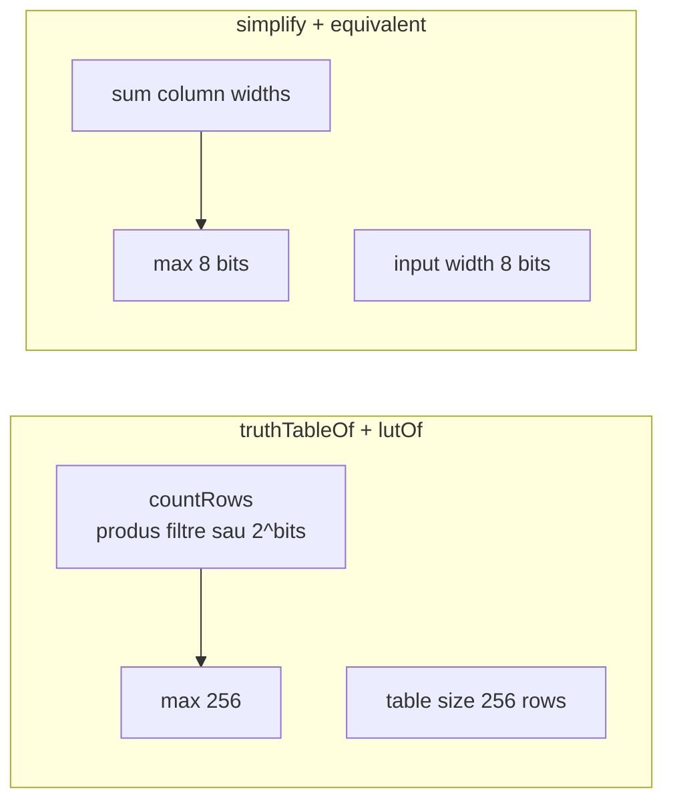
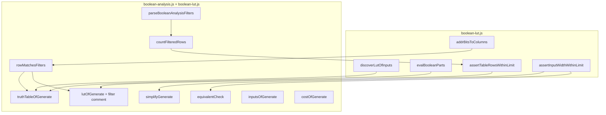

# Plan: Boolean Expression Analysis Helpers

## Decizii confirmate (din clarificări)

| Subiect | Decizie |
|---------|---------|
| Sintaxă expresii | Doar LogTScript + short-notation în backticks (ca `lutOf`) |
| `simplify()` output | Ca `exprOfLut`: două assignment-uri; multi-bit cu ` + ` |
| **Limită `truthTableOf` / `lutOf`** | **Două concepte:** (1) spațiu adrese `2^totalBits` → câmp `length:` în LUT; (2) limită tooling max **256 rânduri generate**; eroare: `…table size (256 rows)` |
| **`lutOf` filtre** | Același parametru 2 ca `truthTableOf`; comentariu extra `# A=01x1x B=x` după header |
| **`exprOfLut` + filtre** | **Viitor** — citește comentariul cu filtre din LUT; acum variabilele se dau manual în apel |
| **Limită `simplify` / `equivalent`** | Neschimbată: max **8 biți** intrare; eroare: `Boolean analysis exceeds maximum supported input width (8 bits)` |
| **`inputsOf` / `costOf`** | Neschimbate (fără truth table completă) |
| `truthTableOf` filtre | Al 2-lea parametru opțional: `A=01x1x B=x C=000xx` (spații flexibile între asignări) |
| Filtre parțiale | Coloane nelistate → enumerare completă `2^width` |
| Chei filtru | Coloane detectate (`A`, `A.1`, `B.1/6`, `D.0-3`) — ca `inputsOf` / header `lutOf` |
| Pattern | `0`, `1`, `x` (case insensitive); lungime = lățimea coloanei; `x` = don't-care |
| Numărare rânduri | Produs combinații (filtre) sau `2^inputBits` (fără filtre); mereu ≤ 256 |
| Ordine rânduri (filtre) | Parcurgere adresă `0 … 2^totalBits-1`; afișare doar rânduri care trec filtrele |
| `inputsOf()` | Tabel aliniat, câte o linie per coloană |
| `costOf()` | Cost sintactic pe biți; literal + minimized + reducere |
| Teste noi | De la **1125** (ultimul existent: **1124**) |

---

## Limite — două regimuri



În [`boolean-lut.js`](v0_3_2/core/boolean-lut.js):

```javascript
const BOOLEAN_ANALYSIS_MAX_TABLE_ROWS = 256;
const BOOLEAN_ANALYSIS_TABLE_TOO_BIG_ERR =
  'Boolean analysis exceeds maximum supported table size (256 rows)';

const BOOLEAN_ANALYSIS_MAX_INPUT_BITS = 8;
const BOOLEAN_ANALYSIS_TOO_WIDE_ERR =
  'Boolean analysis exceeds maximum supported input width (8 bits)';
```

Helpers:

```javascript
function countFullTableRows(columns) {
  return 1 << columns.reduce((s, c) => s + c.width, 0);
}

function assertTableRowsWithinLimit(rowCount) {
  if (rowCount > BOOLEAN_ANALYSIS_MAX_TABLE_ROWS) {
    throw new Error(BOOLEAN_ANALYSIS_TABLE_TOO_BIG_ERR);
  }
}

function assertInputWidthWithinLimit(columns) {
  const bits = columns.reduce((s, c) => s + c.width, 0);
  if (bits > BOOLEAN_ANALYSIS_MAX_INPUT_BITS) {
    throw new Error(BOOLEAN_ANALYSIS_TOO_WIDE_ERR);
  }
}
```

- **`lutOf` / `truthTableOf`:** `assertTableRowsWithinLimit(rowsToGenerate)` — rânduri de emis (produs filtre sau `2^bits`).
- **`simplify` / `equivalent`:** `assertInputWidthWithinLimit` — neschimbat.

### Cele două limite (nu le confundăm)

| Concept | Semnificație | Exemplu 11 biți, 32 rânduri filtrate |
|---------|--------------|--------------------------------------|
| **Spațiu adrese (logic)** | `totalBits = sum(widths)`; funcția are `2^totalBits` combinații | 11 biți → **2048** combinații — documentat în comentarii |
| **Limită tooling** | Max rânduri în output / `length` / `data {}` | **32** rânduri (≤ 256) |

**Regulă importantă:** nu folosim LUT sparse + `fillwith` pentru a umple până la `2^totalBits` — la build, `_buildTable` ar crea **2048** intrări (> 256). Cu filtre, `length` = **numărul de rânduri emise**, nu spațiul complet de adrese.

---

## `lutOf(expression [, filters])` — actualizat

### Sintaxă

Identică cu `truthTableOf`:

```logts
lutOf(OR(AND(A, B), NOT(C)), A=01x1x B=x C=000xx)
```

- Parametrul 2 opțional: aceleași reguli filtre (parțiale, whitespace flexibil, chei = coloane detectate).
- Validare: `rowsToGenerate ≤ 256` (nu `totalBits ≤ 8` când există filtre).

### Output — comentarii

**Linie 1 (existentă, păstrată):**

```text
# A 5b, B 1b, C 5b -> out 1b
```

**Linie 2 (doar când există filtre):**

```text
# A=01x1x B=x C=000xx
```

- Spațiu după `#`; asignări separate prin unul sau mai multe spații.
- Ordinea asignărilor: ordinea din apel (sau ordinea coloanelor detectate — consistent cu filtrele listate).

### Output — `length` și `data {}`

| Câmp | Fără filtre | Cu filtre |
|------|-------------|-----------|
| `length` | `2^totalBits` (≤ 256) | **`rowsToGenerate`** (ex. **32**) — același număr ca rândurile din `data {}` |
| `data {}` | Toate combinațiile | Doar rândurile care trec filtrele |
| `fillwith` | **Nu se emite** | **Nu se emite** — fără LUT sparse |

**Adrese în `data {}` (cu filtre):** index secvențial `0 … length-1`, afișat binar cu `bitIndexWidth(length)` biți (ex. 32 rânduri → adrese `00000` … `11111`). Spațiul logic complet (11 biți) rămâne doar în comentarii (`#` header + `#` filtre), nu în `length`.

Exemplu:

```text
inline [lut] .generated:
  # A 5b, B 1b, C 5b -> out 1b
  # A=01x1x B=x C=000xx

  depth: 1
  length: 32
  data {
    00000 : 1
    00001 : 0
    ...
    11111 : 1
  }
:
```

- Fiecare rând din `data {}` = o combinație care trece filtrele, în **ordinea parcurgerii adresei complete** `0 … 2^totalBits-1` (aceeași ordine ca `truthTableOf` cu filtre).
- **Fără `fillwith`:** nu completăm sloturi nemapate — tabelul conține exact `length` intrări, mereu ≤ 256.
- **Fără filtre:** `length = 2^bits`, `data {}` complet; adrese pe `totalBits` biți.

### `exprOfLut` — starea actuală vs viitor

**Acum (`exprOfLut` NU citește comentariile din LUT):**

- Variabilele și lățimile vin din **apelul** `exprOfLut(.lut, A, B, C)` / `A 5b` etc.
- `length` și `depth` vin din atributele LUT; `lutTable` = exact intrările din `data {}` (fără extindere `fillwith`).
- Headerul `# A 5b, B 1b, C 5b -> out 1b` este **documentație pentru om**, nu input pentru generator.
- LUT filtrat (`length: 32`) ≠ tabel complet pe 11 biți — `exprOfLut` pe asta minimizează doar cele 32 rânduri (nu funcția completă pe 2048 combinații).

**Viitor (scope separat, notat în plan):**

- `exprOfLut` citește comentariul `# A=01x1x B=x C=000xx` + header coloane pentru a reconstrui maparea la spațiul complet de adrese.

---

## `truthTableOf(expression [, filters])`

### Fără filtre — `truthTableOf(expr)`

- `generatedRows = 2^(sum input bits)`.
- Verifică `generatedRows ≤ 256`.
- Afișează **toate** combinațiile (comportament anterior).
- Efect practic: max 8 biți intrare fără filtre — dar eroarea citește **rânduri**, nu biți.

### Cu filtre — `truthTableOf(expr, A=01x1x B=x C=000xx)`

Sintaxă al 2-lea argument (opțional, după virgulă):

- O secvență de asignări `columnKey = pattern`, separate prin **unul sau mai multe spații** (whitespace flexibil).
- `columnKey` = referință coloană ca la `exprOfLut` / `discoverLutOfInputs` (`A`, `A.2`, `B.1/6`, `D.0-3`).
- `pattern` = șir `0` / `1` / `x` (case insensitive); **lungime obligatorie = lățimea coloanei**.

**Numărare rânduri (înainte de generare):**

Pentru fiecare coloană detectată în expr:

| Coloană în filtre? | Combinații |
|--------------------|------------|
| Da | `2^(număr de x în pattern)` — pozițiile `0`/`1` fixe |
| Nu | `2^width` — enumerare completă |

`generatedRows = produs` peste toate coloanele. Dacă `> 256` → eroare table size.

**Exemplu:**

```logts
truthTableOf(OR(AND(A, B), NOT(C)), A=01x1x B=x C=000xx)
```

| Coloană | Pattern | Combinații |
|---------|---------|------------|
| A | `01x1x` | 4 |
| B | `x` | 2 |
| C | `000xx` | 4 |

→ `4 × 2 × 4 = 32` rânduri ≤ 256 → valid.

**Generare rânduri:**

1. Parcurgere adresă `addr = 0 … 2^totalBits - 1` (aceeași mapare ca `lutOf` / `addrBitsToColumns`).
2. Pentru fiecare `addr`, decodează valorile coloanelor.
3. Pentru coloane **cu filtru**: valoarea trebuie să **match-uiască** pattern-ul bit-cu-bit (`x` = wildcard).
4. Pentru coloane **fără filtru**: mereu OK.
5. Dacă trece → emit rând; altfel skip.

**Output:**

- Header: `A B C | OUT` (coloane detectate, ordinea primei apariții).
- Separator: `--------------`.
- Celule: valori binare concrete (nu pattern-uri cu `x`).
- OUT: șir binar pe `depth` biți.

**Caz special — mai mult de 8 biți intrare cu filtre:**

Dacă `sum widths > 8` dar `generatedRows ≤ 256` → **permis** (ex. 10 biți totali, filtre reduc la 32 rânduri).

### Erori filtre

| Caz | Mesaj (propus) |
|-----|----------------|
| Cheie necunoscută | `truthTableOf: unknown filter column 'X'` |
| Lungime pattern ≠ width | `truthTableOf: pattern length mismatch for 'A'` |
| Caracter invalid în pattern | `truthTableOf: invalid pattern character in 'A=01?1'` |
| Cheie duplicată | `truthTableOf: duplicate filter for 'A'` |

---

## Celelalte funcții (neschimbate față de plan anterior)

### `simplify(expression)`

- Limită **8 biți** intrare (`assertInputWidthWithinLimit`).
- Output: 2 linii assignment ca `exprOfLutGenerate`.

### `equivalent(expr1, expr2)`

- Limită **8 biți** pe uniunea coloanelor.
- Output: `true` / `false`.

### `inputsOf(expression)`

- Listă coloane aliniate; fără filtre.
- Dacă `> 8` biți totali → eroare input width (opțional, pentru consistență).

### `costOf(expression)`

- Cost sintactic width-aware; 3 linii output (literal, minimized, reducere).

---

## Arhitectură



**Fișiere noi:** [`v0_3_2/core/boolean-analysis.js`](v0_3_2/core/boolean-analysis.js)  
**Fișiere modificate:** [`boolean-lut.js`](v0_3_2/core/boolean-lut.js), [`parser.js`](v0_3_2/core/parser.js), [`tokenizer.js`](v0_3_2/core/tokenizer.js), [`interpreter.js`](v0_3_2/core/interpreter.js), bundle, teste, doc.

---

## Integrare parser / interpreter

### Parser ([`parser.js`](v0_3_2/core/parser.js))

`parseBooleanAnalysisFilters()` — **partajat** de `truthTableOf` și `lutOf`:

- Repetă: `columnRef` (reutilizează parser coloană `exprOfLut`) + `=` + `PATTERN` token (`[01xX]+`).
- Whitespace flexibil între asignări; stop la `)`.
- AST: `[{ key, atom, pattern: '01x1x' }, …]`.

```javascript
lutOf() {
  this.eat('KEYWORD', 'lutOf');
  this.eat('SYM', '(');
  const expr = this.expr();
  let filters = null;
  if (this.c.value === ',') {
    this.eat('SYM', ',');
    filters = this.parseBooleanAnalysisFilters();
  }
  this.eat('SYM', ')');
  return { lutOf: { expr, filters } };
}
```

| Statement | AST |
|-----------|-----|
| `lutOf(expr);` | `{ lutOf: { expr, filters: null } }` |
| `lutOf(expr, A=01x1x B=x);` | `{ lutOf: { expr, filters: [...] } }` |
| `truthTableOf(expr);` | `{ truthTableOf: { expr, filters: null } }` |
| `truthTableOf(expr, A=01x1x B=x);` | `{ truthTableOf: { expr, filters: [...] } }` |
| `simplify(expr);` | `{ simplify: { expr } }` |
| `equivalent(e1, e2);` | `{ equivalent: { expr1, expr2 } }` |
| `inputsOf(expr);` | `{ inputsOf: { expr } }` |
| `costOf(expr);` | `{ costOf: { expr } }` |

---

## Documentație

### [`v0_3_2/doc/boolean-analysis.md`](v0_3_2/doc/boolean-analysis.md)

Secțiuni noi / actualizate:

1. **Limite** — tabel: ce funcție folosește 256 rânduri vs 8 biți; mesaje eroare distincte.
2. **`truthTableOf`** — fără filtre + cu filtre `x`; exemplu 32 rânduri; filtre parțiale; ordine rânduri.
3. Restul funcțiilor ca în planul anterior.

Exemplu `logts-play`:

```logts-play
truthTableOf(OR(AND(A, B), NOT(C)), A=01x1x B=x C=000xx)
```

### [`boolean-lut.md`](v0_3_2/doc/boolean-lut.md)

- Limită tooling **256 rânduri**; cu filtre `length` = rânduri emise, nu `2^totalBits`.
- `lutOf(expr, A=01x1x …)` + comentariu filtre; **fără** `fillwith` / tabel sparse.
- Clarificare: `exprOfLut` nu citește comentariile (variabile în apel); filtre = viitor.
- Link `boolean-analysis.md`.

---

## Teste (1125–1142)

| ID | Grup | Scop |
|----|------|------|
| 1125 | bool-analysis | `truthTableOf(OR(A,B))` — 4 rânduri |
| 1126 | bool-analysis | `truthTableOf` multi-bit `A.1 & B` |
| 1127 | bool-analysis | `truthTableOf` fără filtre, `2^bits > 256` → eroare table size |
| 1128 | bool-analysis | `simplify` — 2 linii, forma `B` |
| 1129 | bool-analysis | `simplify` multi-bit `depth>1` |
| 1130 | bool-analysis | `equivalent` true |
| 1131 | bool-analysis | `equivalent` false |
| 1132 | bool-analysis | `inputsOf` — linii aliniate |
| 1133 | bool-analysis | `costOf` 1-bit |
| 1134 | bool-analysis-mb | `costOf` multi-bit |
| 1135 | bool-analysis-mb | `costOf` `(A&B)|A` pe 4wire |
| 1136 | bool-lut | `lutOf` >256 rânduri → eroare table size |
| 1137 | bool-analysis | short-notation `truthTableOf(\`A \| B\`)` |
| **1138** | bool-analysis | filtre complete: `A=01x1x B=x C=000xx` → 32 rânduri |
| **1139** | bool-analysis | filtre parțiale (doar `A=…`; restul complet) |
| **1140** | bool-analysis | filtre cu produs > 256 → eroare |
| **1141** | bool-analysis-mb | `>8` biți intrare + filtre → `≤256` rânduri → OK |
| **1142** | bool-analysis | pattern invalid / lungime greșită → eroare |
| **1143** | bool-lut | `lutOf` cu filtre — comentariu `# A=…` + `length: 32` + 32 linii data (fără fillwith) |
| **1144** | bool-lut | `lutOf` fără filtre — fără linie filtru; data complet |
| **1145** | bool-lut-mb | `lutOf` filtre, `>8` biți intrare, `≤256` rânduri generate → OK |

---

## Ordine implementare

1. Constante + `countFilteredRows` / `rowMatchesFilters` în `boolean-lut.js`
2. Refactor `lutOfGenerate` — filtre, comentariu, `length=2^bits`, data sparse
3. `boolean-analysis.js` — `truthTableOfGenerate` (reutilizează helpers filtre)
4. Parser `parseBooleanAnalysisFilters` + interpreter (`lutOf` + `truthTableOf`)
5. Teste filtre 1138–1142 (truthTable) + 1143–1145 (lutOf)
5. `simplify`, `equivalent`, `inputsOf`, `costOf` (limită 8 biți unde e cazul)
6. Restul testelor 1125–1137
7. Doc + `_gen_doc_data.js` + linkuri

---

## Riscuri / note

- **Tokenizer pattern:** `01x1x` nu e expresie LogTScript — necesită token dedicat `TRUTH_PATTERN` sau lexare inline în parser după `=`.
- **Filtre pe coloane multi-bit:** pattern `000xx` pe coloană `C` 5b — match pe întreaga valoare binară a coloanei, nu per-bit expandat în header.
- **Validare anticipată:** numără `generatedRows` înainte de loop-ul de adrese — evită iterări inutile când produsul depășește 256.
- **`lutOf` cu filtre:** `length` = rânduri emise (≤ 256); **nu** `2^totalBits`; **nu** `fillwith` / LUT sparse.
- **simplify/equivalent:** rămân la 8 biți — nu beneficiază de filtre `x`.
- **exprOfLut + filtre:** scope viitor — citește comentariile pentru mapare la spațiul logic complet.
