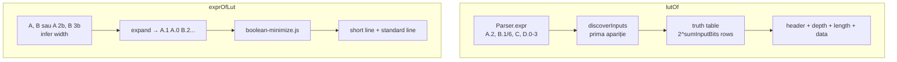

# Plan: Boolean Expression Utilities (`lutOf` / `exprOfLut`)

## Context

Funcțiile **nu există încă** în cod. Utilitare de **analiză**: emit text în **Output** (ca `show`), copy-pasteable și rulabil. **Nu** creează logică runtime.

### Decizii confirmate

| Subiect | Decizie |
|---------|---------|
| Minimizare | [`core/boolean-minimize.js`](v0_3_2/core/boolean-minimize.js) — QM v1, înlocuibil |
| Statements | `lutOf(...);` / `exprOfLut(...);` — oriunde merge `show()` |
| Intrare expresii | **Fără dialect nou** — `Parser.expr()` + preprocess short-notation |
| `lutOf` args | **Un singur argument**: expresie (ca până acum) |
| `lutOf` limită adresă | **Max 8 biți** adresă (`length` max 256). Peste: `LUT table too big (256 values), max bits number reached` |
| `exprOfLut` args | `.lut` + listă variabile separate prin virgulă: `A`, `B` sau `A 2b`, `B 3b` (lățime `Nb` **opțională**) |
| `exprOfLut` lățimi | Dacă `Nb` lipsește: **1b** implicit; dacă wire/`Nwire` declarat mai sus în script → lățimea declarată |
| Ieșire `exprOfLut` | **Mereu două assignment-uri** complete: short-notation, apoi standard notation |
| Multi-bit | Ambele funcții suportă variabile multi-bit (vezi Partea A) |
| Lățime adresă LUT | **`bitIndexWidth`** din [`interpreter.js`](v0_3_2/core/interpreter.js) — `Math.clz32`, **nu** `Math.log2` |



---

## Partea 0 — Sintaxă de bază (1-bit simbolic)

### `lutOf(expression)`

Un argument — expresie normală:

| Formă | Exemplu |
|-------|---------|
| Builtin | `lutOf(OR(A, B))` |
| Imbricat | `lutOf(AND(A, OR(NOT(C), B)))` |
| XOR | `lutOf(XOR(C, OR(A, B)))` |
| Short input | `` lutOf(`A \| B`) `` → preprocess → `OR(A, B)` |

Operații booleene: `NOT`, `AND`, `OR`, `XOR`, `NXOR`, `NAND`, `NOR`.

Header 1-bit (variabile atomice `A`, `B`):

```text
# A 1b, B 1b -> out 1b
```

### `exprOfLut(.lut, ...)`

Listă variabile separate prin virgulă. Lățimea fiecărei variabile:

| Formă în apel | Lățime folosită |
|---------------|-----------------|
| `A` (fără `Nb`) | `1b` dacă `A` nu e declarat; altfel lățimea wire-ului declarat |
| `A 4b` | **4b** explicit (override) |

Exemple:

```logts
exprOfLut(.or2, A, B)
```

→ `A` și `B` necunoscute → **1b + 1b = 2b** adresă (LUT `length: 4`).

```logts
4wire A := 0100
exprOfLut(.example, A, B)
```

→ `A` = **4b** (din declarație), `B` = **1b** (implicit) → **5b** adresă totală.

Explicit (override sau fără prelude):

```logts
exprOfLut(.example, A 2b, B 3b)
```

→ **5b** adresă indiferent de declarații anterioare.

### Ieșire `exprOfLut` — două notații (obligatoriu)

Ordine: **(1) short-notation**, **(2) standard notation**. Ambele copy-pasteable.

1-bit:

```logts
1wire out = `A | B`
1wire out = OR(A, B)
```

Multi-bit output (depth 2), cu paranteze per segment `+`:

```logts
2wire out = (`A & B`) + (A)
2wire out = (AND(A, B)) + (A)
```

Expresii mai lungi (multi-bit inputs) — aceeași regulă, **două linii**; poate fi o singură linie sau pretty-print pe mai multe rânduri dacă e mai lizibil, dar fiecare linie rămâne assignment valid:

```logts
1wire out = `(A.1 & !B.2) | (A.0 & B.0)`
1wire out = OR(AND(A.1, NOT(B.2)), AND(A.0, B.0))
```

---

## Partea A — Multi-bit variables

### A.1 Concept comun

- **Bit references** — sintaxă existentă: `A.0`, `A.1`, `A.2`, range `D.0-3`, length `B.1/6`
- **Whole variable** — `C` unde `C` e `7wire` → coloană de 7 biți intrare
- Fiecare **coloană de adresă LUT** = un bit logic sau un grup de biți contigui dintr-un wire
- **Ordinea coloanelor** = prima apariție în expresie (`lutOf`) sau ordinea declarațiilor în apel (`exprOfLut`)

### A.2 `lutOf()` — descoperire automată

**Fără** parametri extra. Lățimile se obțin din:
- fire/`Nwire` declarate în același script (interpreter consultă `wires` / `vars` la exec)
- slice/range din AST (`bitRange` pe atomi `{var: A, bitRange: ...}`)

#### Exemplu — biți individuali

```logts-play
4wire A
3wire B
lutOf(OR(AND(A.2, B.1), AND(A.0, B.0)))
```

Inputs descoperite (ordine):

```text
A.2  1b
B.1  1b
A.0  1b
B.0  1b
```

Header + LUT:

```text
# A.2 1b, B.1 1b, A.0 1b, B.0 1b -> out 1b

depth: 1
length: 16
data { ... }
```

#### Exemplu — variabilă întreagă

```logts-play
7wire C
lutOf(C)
```

```text
# C 7b -> out 7b

depth: 7
length: 128
data { ... }
```

(`lutOf(C)` = LUT identitate / passthrough pe 7 biți.)

#### Exemplu — bit range

```logts-play
10wire D
lutOf(D.0-3)
```

```text
# D.0-3 4b -> out 4b

depth: 4
length: 16
data { ... }
```

#### Exemplu — mixt (în limita 8b adresă)

```logts-play
4wire A
8wire B
2wire C
lutOf(OR(AND(A.2, B.1/3), C))
```

| Input | Lățime |
|-------|--------|
| A.2 | 1b |
| B.1/3 | 3b |
| C | 2b |

Adresă = `1+3+2 = 6` biti → `length: 64` ✓ (sub limita de 8).

#### Exemplu — eroare adresă prea mare

```logts-play
4wire A
8wire B
7wire C
10wire D
lutOf(OR(AND(A.2, B.1/6), AND(C, D.0-3)))
```

Adresă = `1+6+7+4 = 18` biti → **eroare**:

```text
LUT table too big (256 values), max bits number reached
```

**Erori `lutOf`:**
- simbol nedeclarat / lățime necunoscută
- expresie non-booleană
- sumă biți adresă **> 8** → `LUT table too big (256 values), max bits number reached`

### A.3 `exprOfLut()` — variabile cu lățime opțională

LUT-ul **nu** păstrează numele/grupările originale → utilizatorul listează variabilele de intrare.

**Sintaxă:**

```logts
exprOfLut(.example, A, B)
exprOfLut(.example, A 2b, B 3b)
exprOfLut(.example, A, B 3b)          # mixt: A din declarație/default, B explicit 3b
```

**Rezolvare lățime per variabilă** (în ordine):

1. Dacă apelul specifică `Nb` (ex. `A 2b`) → folosește **Nb**
2. Altfel, dacă `A` e declarat ca `Nwire` / `Nbit` mai sus în script → **N** biți
3. Altfel → **1b** implicit

```logts-play
4wire A := 0100
exprOfLut(.example, A, B)
```

→ `A` = 4b, `B` = 1b → expand `A.3 A.2 A.1 A.0 B.0` (MSB first per variabilă).

Expandare internă pentru `exprOfLut(.example, A 2b, B 3b)`:

```text
A.1, A.0, B.2, B.1, B.0
```

**Validare:**

```text
sum(widths) === lutAddrBits(length)
```

`lutAddrBits(length)` — aceeași convenție ca `LutComponent._addrBits` din [`lut.js`](v0_3_2/core/components/lut.js), implementat cu `bitIndexWidth` (nu `Math.log2`):

```javascript
function lutAddrBits(length) {
  if (length <= 1) return 1;
  return bitIndexWidth(length);
}

// bitIndexWidth — reutilizat din interpreter.js:
function bitIndexWidth(len) {
  return len <= 1 ? 1 : 32 - Math.clz32(len - 1);
}
```

Ex.: `length: 32` → `lutAddrBits(32)` = `bitIndexWidth(32)` = **5** (echivalent `ceil(log₂(32))`, fără `Math.log2`).

Valid (`5b` adresă):

```logts
exprOfLut(.example, A 2b, B 3b)   # 2+3=5
```

Invalid:

```logts
exprOfLut(.example, A 2b, B 2b)   # 2+2=4 ≠ 5
```

Eroare:

```text
exprOfLut expects 5 input bits but received 4
```

**Ordinea variabilelor contează** pentru maparea adreselor (nu pentru echivalența logică a expresiei regenerate):

```logts
exprOfLut(.example, B 3b, A 2b)   # B.2 B.1 B.0 A.1 A.0
exprOfLut(.example, A 2b, B 3b)   # A.1 A.0 B.2 B.1 B.0
```

Ambele sunt echivalente cu LUT-ul dacă adresa e permutată corespunzător — documentăm că ordinea din apel trebuie să corespundă convenției folosite la generarea LUT.

#### Output multi-bit input, 1-bit out

LUT `5b → 1b`. Ambele notații:

```logts
1wire out = `(A.1 & !B.2) | (A.0 & B.0)`
1wire out = OR(AND(A.1, NOT(B.2)), AND(A.0, B.0))
```

#### Output multi-bit out (depth 3)

```logts
3wire out = (`A.1 & B.2`) + (`A.0 | B.1`) + (`!B.0`)
3wire out = (AND(A.1, B.2)) + (OR(A.0, B.1)) + (NOT(B.0))
```

Fiecare bit de ieșire minimizat independent (QM per coloană output).

### A.4 Round-trip multi-bit

```logts-play
2wire A
3wire B
lutOf(OR(AND(A.1, B.0), AND(A.0, B.2)))
# → lipește LUT ca inline [lut] .generated
exprOfLut(.generated, A 2b, B 3b)
# → două linii echivalente logic (posibil minimizate diferit)
```

---

## Partea 1 — `core/boolean-minimize.js`

Interfață:

```javascript
/**
 * @param {string[]} inputBitLabels - ex. ['A.1','A.0','B.2','B.1','B.0']
 * @param {boolean[]} outputs - câte un bit funcție pentru fiecare adresă
 */
function minimizeBoolean(inputBitLabels, outputs) { ... }
```

QM v1. Limită: `inputBitLabels.length <= 8` (aliniat cu `lutOf`).

---

## Partea 2 — `core/boolean-lut.js`

### Helper lățime adresă — `bitIndexWidth` (nu `Math.log2`)

La calculul biților de adresă din `length` LUT (validare `exprOfLut`, generare `lutOf`), folosim helperul existent din [`interpreter.js`](v0_3_2/core/interpreter.js):

```javascript
function bitIndexWidth(len) {
  return len <= 1 ? 1 : 32 - Math.clz32(len - 1);
}
```

Wrapper pentru LUT (identic cu `LutComponent._addrBits`):

```javascript
function lutAddrBits(length) {
  if (length <= 1) return 1;
  return bitIndexWidth(length);
}
```

**Regulă implementare:** în cod nou `boolean-lut.js` / `boolean-minimize.js` — **interzis** `Math.log2`, `Math.ceil(Math.log2(...))`. Reutilizează `bitIndexWidth` (import sau copie locală aceeași semnătură ca în interpreter/queue-storage).

### Funcții cheie

| Funcție | Rol |
|---------|-----|
| `discoverLutOfInputs(exprAst, widthResolver)` | listă `{ label, width }` — prima apariție |
| `evalLutOfExpr(exprAst, env, widthResolver)` | evaluează expresia pe env (mapare bit → `'0'|'1'`) |
| `lutOfGenerate(exprAst, widthResolver)` | header + `depth` + `length` + `data { }`; respinge dacă `sum(widths) > 8` |
| `expandExprOfLutVars(varSpecs, widthResolver)` | `A` → 1b sau N din wire; `A 2b` → 2b forțat |
| `exprOfLutGenerate(lutInst, varSpecs)` | `lutAddrBits(length)` via `bitIndexWidth`; validare `sum(widths)`; QM; **2 linii** |

`widthResolver(name)` — callback din interpreter: citește `wires.get(name).type` → biți.

### Header `lutOf`

Format:

```text
# <col1> <w1>b, <col2> <w2>b, ... -> out <depth>b
```

Exemple header: `# A 1b, B 1b -> out 1b` · `# C 7b -> out 7b` · `# A.2 1b, B.1/3 3b, C 2b -> out 2b` (max 8b adresă totală)

---

## Partea 3 — Parser

### `lutOf()`

```javascript
{ lutOf: { expr: [...] } }  // Parser.expr()
```

### `exprOfLut()`

```javascript
// exprOfLut(.example, A, B)
// exprOfLut(.example, A 2b, B 3b)
{ exprOfLut: {
  lutRef: '.example',
  varSpecs: [
    { name: 'A', width: null },      // null = resolve la runtime
    { name: 'B', width: null },
    // sau { name: 'A', width: 2 }   // explicit Nb
  ]
}}
```

Parse: după `.lut`, virgulă, apoi repetă `ID` cu `Nb` opțional (`(\d+)b`), separate prin virgulă.

La runtime, `widthResolver(name)` completează `width: null` → declarație wire sau **1**.

Chip/board allowlist: `show|peek|lutOf|exprOfLut`

---

## Partea 4 — Interpreter

- `_execLutOf` / `_execExprOfLut` → `this.out.push(...)`; timing ca `show`
- `widthResolver` din `wires` / `vars` pentru **`lutOf`** (slice/range) și **`exprOfLut`** (infer `A` → Nwire sau 1b)
- Pentru `lutOf` în script fără declarații precedente → eroare clară

Bundle: `boolean-minimize.js` → `boolean-lut.js` în [`_run_suite_node.js`](v0_3_2/_run_suite_node.js)

---

## Partea 5 — Documentație [`doc/boolean-lut.md`](v0_3_2/doc/boolean-lut.md)

Structură:

1. **Scop** — analiză, nu runtime; Output ca `show`
2. **`lutOf()`** — sintaxă, header, exemple 1-bit (`OR(A,B)`)
3. **`exprOfLut()`** — `A, B` sau `A Nb`; infer lățime; două notații obligatorii
4. **Multi-bit variables** — secțiune dedicată (conținut din Partea A; **fără** repetarea întregii doc de bază)
5. **Round-trip**, **erori**, link [short-notation.md](v0_3_2/doc/short-notation.md)
6. Toate exemplele runnable = **`logts-play`** (inclusiv prelude `Nwire` unde e nevoie)

Linkuri: [`debug.md`](v0_3_2/doc/debug.md), [`lut.md`](v0_3_2/doc/lut.md), [`doc-index.json`](v0_3_2/doc/doc-index.json)

---

## Partea 6 — Teste (ID-uri **1091–1122**)

### Grup `bool-lut` — 1-bit (1091–1107)

| ID | Titlu |
|----|-------|
| 1091 | `lutOf(OR(A, B))` — header `# A 1b, B 1b -> out 1b`, length 4 |
| 1092 | `lutOf(AND(A, OR(NOT(C), B)))` — ordine `A, C, B` |
| 1093 | `lutOf(XOR(C, OR(A, B)))` — ordine `C, A, B` |
| 1094 | `` lutOf(`A \| B`) `` |
| 1095 | `lutOf(LSHIFT(...))` → eroare |
| 1096 | `exprOfLut(.or2, A, B)` — implicit 1b+1b; două linii short + standard |
| 1097 | `exprOfLut` — `expects 5 input bits but received 4` |
| 1098 | `exprOfLut(.decoder, A, B)` pe LUT depth 2 — `+` paranteze, ambele notații |
| 1099 | LUT depth 3 — 3 termeni `+`, ambele notații |
| 1100 | copy-paste linie **standard** → script rulabil |
| 1101 | copy-paste linie **short** → script rulabil |
| 1102 | round-trip 1-bit |
| 1103 | `comp [lut]` + `exprOfLut` |
| 1104 | `prefixFree` / `variableDepth` LUT → respinge |
| 1105 | QM: formă minimizată, nu canonică lungă |
| 1106 | `lutOf` / `exprOfLut` în board body |
| 1107 | `lutOf` — adresă > 8 biți → `LUT table too big (256 values), max bits number reached` |

### Grup `bool-lut-mb` — multi-bit (1108–1122)

| ID | Titlu |
|----|-------|
| 1108 | `lutOf` — `A.2`, `B.1`, `A.0`, `B.0` → header 4×1b, length 16 |
| 1109 | `lutOf(C)` pe `7wire C` → depth 7, length 128 |
| 1110 | `lutOf(D.0-3)` pe `10wire D` → depth 4, length 16 |
| 1111 | `lutOf` mixt 6b adresă — succes sub limita 8 |
| 1112 | `lutOf` mixt 18b — eroare LUT table too big |
| 1113 | `exprOfLut(.lut5, A 2b, B 3b)` — expand explicit 5b |
| 1114 | `exprOfLut(.lut, A, B)` fără prelude — A=1b, B=1b |
| 1115 | `4wire A := 0100` + `exprOfLut(.lut, A, B)` — A=4b, B=1b |
| 1116 | `exprOfLut` ordine `B, A` vs `A, B` — mapare adresă |
| 1117 | `exprOfLut` output 1b cu slice refs — două notații |
| 1118 | `exprOfLut` output 3b — `+` ambele notații |
| 1119 | round-trip multi-bit |
| 1120 | `lutOf` fără wire declarat unde e necesar → eroare |
| 1121 | `exprOfLut(.lut, A 2b)` — sumă biți ≠ adresă LUT |
| 1122 | regresie: `exprOfLut` emite exact 2 linii |

După: `node v0_3_2/_gen_manifest.js`

---

## Fișiere

| Fișier | Rol |
|--------|-----|
| `core/boolean-minimize.js` | QM — modul separat, înlocuibil |
| `core/boolean-lut.js` | discover inputs, lutOf, exprOfLut, formatare duală |
| `core/tokenizer.js`, `parser.js`, `interpreter.js` | statements + widthResolver |
| `test_suite_ported.js` | 1091–1122 |
| `doc/boolean-lut.md` | bază + **Multi-bit** |
| `doc/debug.md`, `doc/lut.md` | linkuri |

**În afara scope:** `wire = lutOf(...)`; `exprOfLut` pe LUT `prefixFree`; modificare sintaxă globală expresii; parametru `shortNotation` (renunțat).

---

## Ordine implementare

1. `boolean-minimize.js`
2. `boolean-lut.js` — 1-bit, apoi multi-bit discover + expand
3. parser (`exprOfLut` cu `A` sau `A Nb`) + interpreter + widthResolver
4. teste 1091–1122
5. `boolean-lut.md` + linkuri + `_gen_doc_data.js`
