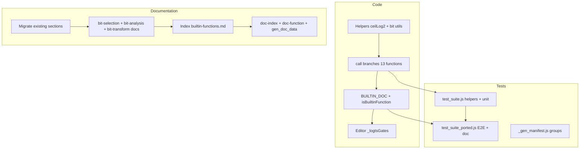

# Plan: funcții built-in pentru selecție și manipulare biți

## Context

Toate built-in-urile sunt definite central în [`v0_3_2/core/interpreter.js`](v0_3_2/core/interpreter.js): `Interpreter.BUILTIN_DOC`, `isBuiltinFunction()`, și ramuri în `call()`. Pattern-ul existent (porți, `LSHIFT`, aritmetică) se reutilizează.

**Decizii confirmate:**
- `BITINDEX` returnează **două valori**: `(index, isInvalid)` — `isInvalid=0` când exact un bit e setat; `isInvalid=1` când 0 sau mai mulți biți (index = `0…0` padded)
- Documentație: **migrare completă** — [`v0_3_2/doc/builtin-functions.md`](v0_3_2/doc/builtin-functions.md) devine doar index + link-uri
- `LROTATE`/`RROTATE`: rotație circulară standard, lățime constantă, `count = parseInt(count, 2) % width`
- Corecție exemplu: `LROTATE(1011, 10)` → `1110` (nu `1100`)
- **Documentație:** nu există categorie „Shift” separată — `LSHIFT`/`RSHIFT` (existente) + `REVERSE`/`LROTATE`/`RROTATE` (noi) sunt toate în **Bit transform** (`builtin-bit-transform-functions.md`)
- **`SIZE` → `BITSIZE`**: funcția de lungime a stringului binar se numește `BITSIZE` (evită ambiguitatea cu „size” din alte contexte)

---

## Funcții de implementat (13)

### Categoria A — Bit selection & detection

| Funcție | Semnătură | Logică |
|---------|-----------|--------|
| `HIGH` | `HIGH(Xbit) -> Xbit` | Un singur bit setat: poziția celui mai semnificativ; altfel `0…0` |
| `LOW` | `LOW(Xbit) -> Xbit` | Un singur bit setat: poziția celui mai puțin semnificativ |
| `ANY` | `ANY(Xbit) -> 1bit` | Echivalent `OR(value)` (fold) |
| `ZERO` | `ZERO(Xbit) -> 1bit` | `NOT(ANY(value))` — `1` dacă toți biții sunt 0 |
| `BITINDEX` | `BITINDEX(Xbit) -> Ybit index, 1bit isInvalid` | `Y = ceilLog2(len)`; index = poziția bitului (LSB=0) dacă one-hot; altfel `0…0` + `isInvalid=1` |
| `ONEHOT` | `ONEHOT(Xbit index) -> 2^X bits` | Un singur `1` la poziția `index`; lățime ieșire = `2^index.length` |

**Relație inversă:** `BITINDEX(ONEHOT(i))` → `(i, 0)` când `i` e în range.

**Priority encoder** (exemplu documentat):

```logts
8wire requests = 00101010
8wire winner   = HIGH(requests)
1wire valid    = ANY(requests)
3wire index, 1wire bad = BITINDEX(winner)
# winner=00100000, valid=1, index=101, bad=0
```

### Categoria B — Bit analysis

| Funcție | Semnătură | Logică |
|---------|-----------|--------|
| `PARITY` | `PARITY(Xbit) -> 1bit` | `1` dacă număr impar de biți `1` (XOR fold) |
| `CNTONE` | `CNTONE(Xbit) -> Ybit` | Număr biți `1`; `Y = ceilLog2(len+1)` |
| `CNTZERO` | `CNTZERO(Xbit) -> Ybit` | `len - countOnes`; aceeași lățime `Y` |
| `BITSIZE` | `BITSIZE(Xbit) -> Ybit` | `len` ca valoare binară; `Y = ceilLog2(len+1)` |

### Categoria C — Bit transform (shift, rotate, reverse)

Include funcțiile **existente** `LSHIFT`/`RSHIFT` și cele **noi** `REVERSE`/`LROTATE`/`RROTATE`. Toate modifică poziția sau ordinea biților.

| Funcție | Semnătură | Logică | Status |
|---------|-----------|--------|--------|
| `LSHIFT` | `LSHIFT(Xbit data, Nbit n) -> Xbit` (+ optional `fill`) | Append `n` fill bits la dreapta → lățime crește | existent |
| `RSHIFT` | `RSHIFT(Xbit data, Nbit n) -> Xbit` (+ optional `fill`) | Shift dreapta, MSB fill, lățime constantă | existent |
| `REVERSE` | `REVERSE(Xbit) -> Xbit` | Inversare ordine biți (MSB↔LSB) | **nou** |
| `LROTATE` | `LROTATE(Xbit data, Ybit count) -> Xbit` | `n = parseInt(count,2) % len`; `data.slice(n)+data.slice(0,n)` | **nou** |
| `RROTATE` | `RROTATE(Xbit data, Ybit count) -> Xbit` | `n = parseInt(count,2) % len`; `data.slice(-n)+data.slice(0,-n)` | **nou** |

**Notă docs:** secțiunea Shift din `builtin-functions.md` + short notation `data < n` / `data > n` (vezi [`short-notation.md`](v0_3_2/doc/short-notation.md)) se mută în `builtin-bit-transform-functions.md`, nu într-un fișier separat.

**Helper intern** (în `interpreter.js`, lângă `call()`):

```javascript
function ceilLog2Bits(n) {
  if (n <= 1) return 1;
  return Math.ceil(Math.log2(n + 1)); // sau loop bit-shift pentru consistență
}
```

---

## Implementare cod

### 1. [`v0_3_2/core/interpreter.js`](v0_3_2/core/interpreter.js)

- Extinde `isBuiltinFunction()` cu toate cele 13 nume
- Adaugă intrări în `Interpreter.BUILTIN_DOC` (inclusiv overload `BITINDEX` cu 2 return values)
- Secțiuni noi în `call()` după pattern-ul existent (după `LSHIFT`/`RSHIFT`)

Ordine propusă în `call()`: **Bit selection** → **Bit analysis** → **REVERSE** → **LROTATE/RROTATE** (după secțiunea existentă LSHIFT/RSHIFT, sau grupate împreună sub `// BUILTIN: BIT TRANSFORM`)

- `BITINDEX` returnează array `[{index}, {isInvalid}]` (ca `ADD` returnează 2 valori)
- `ONEHOT`: validează `index < 2^indexLen`; index out-of-range → toți `0` (consistent cu alte built-in-uri)

### 2. [`v0_3_2/script_editor_v0_3_2.html`](v0_3_2/script_editor_v0_3_2.html)

Adaugă noile nume în `_logtsGates` (~linia 1450) pentru syntax highlighting / autocomplete.

---

## Teste

### Grupuri noi în [`v0_3_2/_gen_manifest.js`](v0_3_2/_gen_manifest.js)

| Grup ID | Label | ID-uri test (propuse) |
|---------|-------|----------------------|
| `bit-selection` | Bit selection built-ins | 82–110 |
| `bit-analysis` | Bit analysis built-ins | 111–125 |
| `bit-transform` | Bit transform (LSHIFT, RSHIFT, REVERSE, LROTATE, RROTATE) | 40–60 (migrare grup `shifts` existent + teste noi rotate/reverse) |

Grupul vechi `shifts` din `_gen_manifest.js` se **redenumește** în `bit-transform` (sau testele LSHIFT/RSHIFT sunt re-înregistrate acolo); nu rămâne categorie „Shift” separată.

### [`v0_3_2/test_suite.js`](v0_3_2/test_suite.js)

Helperi locali (pattern `gate()`, `lshift()`):

- `high()`, `low()`, `any()`, `zero()`, `bitIndex()`, `oneHot()`, `parity()`, `reverse()`, `cntOne()`, `cntZero()`, `bitSize()`, `lrotate()`, `rrotate()`

Teste unitare pentru fiecare exemplu din specificație + edge cases:

- `HIGH/LOW` pe `00000000`
- `BITINDEX(000)` → `000`, `1`; one-hot valid → `isInvalid=0`
- `BITINDEX` multi-bit → `isInvalid=1`
- `ONEHOT` + invers `BITINDEX(ONEHOT(x))`
- `LROTATE(1011,1)=0111`, `LROTATE(1011,10)=1110`, `count >= width` modulo
- Priority encoder end-to-end (helper local)

### [`v0_3_2/test_suite_ported.js`](v0_3_2/test_suite_ported.js)

Teste interpreter E2E (grup `doc`, ID 353–380):

- `Interpreter.getDocLines('HIGH', …)` pentru fiecare funcție nouă
- `session.runDoc('doc(BITINDEX)')` — semnătura cu 2 return values
- `session.run()` + `getWire()` pentru scenarii reale
- Test `probe()` / output pentru priority encoder (grup `probe` sau `doc`)

### Regenerare

```bash
node v0_3_2/_gen_manifest.js
node v0_3_2/_run_suite_node.js
```

---

## Documentație (engleză, migrare completă)

### Structură nouă

[`v0_3_2/doc/builtin-functions.md`](v0_3_2/doc/builtin-functions.md) — **doar index**:

| Category | Functions | Detail |
|----------|-----------|--------|
| Logic gates | `NOT`…`EQ` | [builtin-logic-gate-functions.md](v0_3_2/doc/builtin-logic-gate-functions.md) |
| Sequential | `LATCH`, `REG` | [builtin-sequential-functions.md](v0_3_2/doc/builtin-sequential-functions.md) · REG → [reg.md](v0_3_2/doc/reg.md) |
| Routing | `MUX`, `DEMUX` | [builtin-routing-functions.md](v0_3_2/doc/builtin-routing-functions.md) |
| Arithmetic | `ADD`…`DIVIDE` | [arithmetic.md](v0_3_2/doc/arithmetic.md) |
| **Bit selection** | `HIGH`…`ONEHOT` | [builtin-bit-selection-functions.md](v0_3_2/doc/builtin-bit-selection-functions.md) **NEW** |
| **Bit analysis** | `PARITY`, `CNTONE`, `CNTZERO`, `BITSIZE` | [builtin-bit-analysis-functions.md](v0_3_2/doc/builtin-bit-analysis-functions.md) **NEW** |
| **Bit transform** | `LSHIFT`, `RSHIFT`, `REVERSE`, `LROTATE`, `RROTATE` | [builtin-bit-transform-functions.md](v0_3_2/doc/builtin-bit-transform-functions.md) **NEW** (include migrare LSHIFT/RSHIFT) |

### Fișiere de creat / migrat

1. **Migrare conținut** din secțiunile actuale ale `builtin-functions.md` în:
   - `builtin-logic-gate-functions.md`
   - `builtin-sequential-functions.md`
   - `builtin-routing-functions.md`
   - ~~`builtin-shifter-functions.md`~~ — **nu se creează**; secțiunea Shift → `builtin-bit-transform-functions.md`

2. **Fișiere noi** cu conținutul din specificație (syntax, returns, examples, typical uses):
   - `builtin-bit-selection-functions.md` — include secțiunea „Building a Priority Encoder”
   - `builtin-bit-analysis-functions.md`
   - `builtin-bit-transform-functions.md` — **LSHIFT/RSHIFT** (migrat) + **REVERSE/LROTATE/RROTATE** (nou); include short notation `<`/`>`; corecție `LROTATE(1011,10)=1110`

3. **Exemplu rulabil per funcție** (pattern din [`v0_3_2/doc/lut.md`](v0_3_2/doc/lut.md)):

```logts
8wire requests = 00101010
8wire winner = HIGH(requests)
probe(winner)
show(winner)
```

Fiecare funcție primește un mini-script copy-paste cu `show()` sau `probe()`.

4. Actualizări cross-reference:
   - [`v0_3_2/doc/doc-function.md`](v0_3_2/doc/doc-function.md) — tabele semnături + link-uri către subcategorii
   - [`v0_3_2/doc/doc-index.json`](v0_3_2/doc/doc-index.json) — intrări Reference pentru toate fișierele noi
   - [`v0_3_2/doc/future-component-ideas.md`](v0_3_2/doc/future-component-ideas.md) — actualizare linia „Built-ins” din context (opțional, 1 rând)

5. Regenerare UI docs:

```bash
node v0_3_2/_gen_doc_data.js
```

---

## Flux implementare



---

## Ordine recomandată de lucru

1. Helperi + implementare în `interpreter.js` (bit selection → analysis → transform)
2. Teste unitare `test_suite.js`
3. Teste E2E + `doc()` în `test_suite_ported.js`
4. Migrare docs existente + fișiere noi + index
5. Editor autocomplete + `doc-index.json` + `_gen_doc_data.js` + `_gen_manifest.js`
6. Rulare `node _run_suite_node.js` — toate testele verzi

---

## Riscuri / note

- **Lățime `BITINDEX`**: pentru intrare `100` (3 biți), index valid = `010` (poziția 2); `isInvalid=0`. Exemplul cu `011` era probabil typo — testele vor ancora comportamentul corect LSB=0.
- **`ONEHOT` lățime**: ieșirea `2^indexWidth` poate depăși lățimea wire-ului țintă; documentăm că utilizatorul declară wire suficient de lat (ex. `8wire sel = ONEHOT(101)`).
- **`BITSIZE`**: returnează lungimea **stringului binar** (nu valoarea numerică), conform specificației (`BITSIZE(0101010)` → `111` = 7 biți). Redenumit din `SIZE` pentru a evita confuzia cu alte concepte de „size” din limbaj.
