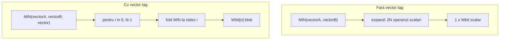

# Tag `; vector` pentru MIN / MAX / SUM

> Plan canonic (repo): [`.cursor/plans/builtin_vector_tag.plan.md`](builtin_vector_tag.plan.md)  
> Copie Cursor IDE: `c:\Users\adypa\.cursor\plans\builtin_vector_tag_5495233b.plan.md` — mențineți ambele sincronizate.  
> Predecesor livrat: [vector_reduction_functions.plan.md](vector_reduction_functions.plan.md) (reducere scalară cu expandare implicită)  
> Workspace: [`v0_3_2/`](../v0_3_2/)

## Context și distincție față de starea actuală

Astăzi, **fără tag**, `SUM` / `MIN` / `MAX` folosesc [`_expandReductionArgValues`](../v0_3_2/core/interpreter.js) — un vector întreg devine N operanzi scalari și rezultatul e **scalar** (sau `result`+`over` scalari la SUM).

Cu **`; vector`**, semantica se inversează intenționat:

| Apel | Comportament |
|------|--------------|
| `SUM(vectorA, vectorB)` | Expandare → sumă peste **toate** elementele → `Wbit` + `Wbit over` |
| `SUM(vectorA, vectorB; vector)` | Sumă **per index** → `Wbit[n]` + `Wbit[n] over` |
| `MAX(vectorA, 0001; vector signed)` | Max **per index** (signed pe W biți/element) → `Wbit[n]` |
| `DOT(...)` | **Neschimbat** — deja cere doi vectori întregi |

**ADD** are deja broadcast element-wise **fără** tag ([`getVectorBroadcastPair`](../v0_3_2/core/vector-reduce.js)); tag explicit `; vector` vine în [Faza 2](#faza-2--add-subtract-clamp-cu-vector) (broadcast implicit rămâne pentru compatibilitate).



---

## Semantica confirmată

### Tag-uri

- `vector` — bool (`; vector` sau `; vector=1`); ordinea față de `signed` e indiferentă (`; signed vector` ≡ `; vector signed`).
- Doar **MIN**, **MAX**, **SUM** acceptă `vector` în această fază.
- `signed` rămâne pe același set ca acum ([`BUILTIN_SIGNED_TAG_FUNCS`](../v0_3_2/core/signed-arithmetic.js)).

### Operanzi (cu `; vector`)

- **Cel puțin 2 argumente** la apel (variadic).
- **Cel puțin un** argument = vector întreg (`4wire[N] vectorA`, atom simplu fără `:index` / `bitRange`) — detectat via [`isWholeVectorWireArg`](../v0_3_2/core/vector-reduce.js).
- Alții: vector cu **aceeași formă** `(N, W)` **sau** scalar/fire non-vector de lățime **W** (ex. literal `1111` pe 4 biți).
- La index `i`: se colectează valoarea fiecărui operand (`vectorX:i` sau scalar broadcastat) și se aplică MIN/MAX/SUM.
- **MIN/MAX la egalitate**: păstrăm regula existentă — câștigă **primul** operand cu valoarea extremă ([`pickMinMaxUnsigned`](../v0_3_2/core/interpreter.js) / [`pickMinMaxSigned`](../v0_3_2/core/signed-arithmetic.js)).
- **SUM overflow per element**: identic cu SUM scalar — low W în `result[i]`, next W în `over[i]` ([`sumExpanded`](../v0_3_2/core/vector-reduce.js)); signed folosește același range 2W.

### Erori runtime (mesaje propuse)

| Condiție | Mesaj (orientativ) |
|----------|-------------------|
| `; vector` + un singur argument | `{FN}: with '; vector' expects at least 2 arguments` |
| `; vector` + zero vectori întregi | `{FN}: remove '; vector' — no argument is a whole vector` |
| Formă/lățime nepotrivită | `{FN}: vector arguments must have the same shape; scalars must match element width W` |
| Tag necunoscut / duplicat | deja în [`parseFuncTags`](../v0_3_2/core/parser.js) |

### Semnături `doc()` (de adăugat în [`Interpreter.BUILTIN_DOC`](../v0_3_2/core/interpreter.js))

```
MIN(Wbit[n] a, Wbit/Wbit[n] b, ... ; vector) -> Wbit[n]
MIN(... ; vector signed) -> Wbit[n]
MAX(Wbit[n] a, Wbit/Wbit[n] b, ... ; vector) -> Wbit[n]
MAX(... ; vector signed) -> Wbit[n]
SUM(Wbit[n] a, Wbit/Wbit[n] b, ... ; vector) -> Wbit[n], Wbit[n]
SUM(... ; signed vector) -> Wbit[n], Wbit[n]
```

### Exemple de referință (teste)

```logts
4wire[4] vectorA = 0001 + 0010 + 0100 + 1000
4wire[4] vectorB = 0010 + 0011 + 0100 + 1001
4wire[4] out = MAX(vectorA, 0001; vector signed)   // per-index max cu scalar
4wire[4] out = MIN(vectorA, vectorB; vector)
4wire[4] r, 4wire[4] o = SUM(vectorA, vectorB, vectorC; vector)
4wire[4] r, 4wire[4] o = SUM(vectorA, 1111, 0010, 0001; signed vector)
```

### În afara scope-ului Faza 1

- Slice-uri ca operanzi (`vectorA:0`, `vectorA:0.1/2`) cu `; vector`
- DOT element-wise / alt tag
- MULTIPLY, MAC, DIVIDE cu `; vector` (și `; signed` pentru DIVIDE) → [Faza 3](#faza-3--multiply-mac-divide)
- **ADD / SUBTRACT / CLAMP** cu `; vector` → [Faza 2](#faza-2--add-subtract-clamp-cu-vector)

---

## Design tehnic

### 1. Refactor parsare tag-uri built-in

În [`signed-arithmetic.js`](../v0_3_2/core/signed-arithmetic.js) (sau fișier nou `builtin-call-tags.js` dacă preferăm separare):

- Înlocuim `parseBuiltinSignedCallTags` cu `parseBuiltinCallTags(callTags, fnName, fail)` → `{ signed, vector }`.
- Seturi: `BUILTIN_SIGNED_TAG_FUNCS` (existent), `BUILTIN_VECTOR_TAG_FUNCS = { MIN, MAX, SUM }`.
- Validare: tag-uri bool doar `signed` / `vector`; necunoscute → eroare; `signed=0` respins (ca acum).

În [`call()`](../v0_3_2/core/interpreter.js) (~3901):

```javascript
let signedMode = false, vectorMode = false;
if (callTags?.length) {
  const tags = SA.parseBuiltinCallTags(callTags, name, fail);
  signedMode = tags.signed;
  vectorMode = tags.vector;
}
```

### 2. Helperi noi în [`vector-reduce.js`](../v0_3_2/core/vector-reduce.js)

| Helper | Rol |
|--------|-----|
| `classifyVectorTaggedOperands(args, getWire)` | Pentru fiecare arg: `wholeVector` \| `scalar`; derivă `meta { elementWidth, elementCount }` din primul vector |
| `requireVectorTaggedOperands(args, getWire, fnName)` | Validări: ≥1 vector, ≥2 args total, shape + width W |
| `elementValuesAtIndex(args, i, getWire, evalScalar, evalElement)` | Listează W-bit strings la index `i` |
| `minMaxVectorTagged(args, pickMin, signed, evalFns)` | Returnează blob `N*W` |
| `sumVectorTagged(args, signed, evalFns)` | Returnează `{ resultBlob, overBlob }` fiecare `N*W` |

**Eval fn-uri** (în interpreter, nu în modul): reutilizăm `_evalReductionAtomValue` pentru elemente și `_evalCallArgValue` pentru scalari — același pattern ca la ADD (~4536).

### 3. Ramuri interpreter

**SUM** (~3935): dacă `vectorMode` → `sumVectorTagged` + return array de 2 blob-uri (ca ADD vector, ~4569). Altfel → flux actual cu `_expandReductionArgValues`.

**MIN/MAX** (~4786): dacă `vectorMode` → `minMaxVectorTagged` + return un blob. Altfel → flux actual.

**DOT**: fără modificări; dacă cineva pasează `; vector` → eroare „does not accept tag 'vector'”.

### 4. Asignare rezultat

Modelul existent pentru vectori e deja suportat:

- Un blob `N*W` → `4wire[N] x = MAX(...; vector)` ([`getBitWidthFromDecl`](../v0_3_2/core/interpreter.js) = `W*N`).
- Două blob-uri → `4wire[N] r, 4wire[N] o = SUM(...; vector)` — split pe declarații ca la SUM scalar (bitOffset în `execWireStatement`).

Nu e nevoie de logică nouă de assignment dacă blob-urile au lungimea corectă.

### 5. Documentație

- [`doc/vector-reduction.md`](../v0_3_2/doc/vector-reduction.md) — secțiune nouă „Element-wise mode (`; vector`)” cu tabel comparativ expand-vs-vector-tag.
- [`doc/arithmetic.md`](../v0_3_2/doc/arithmetic.md) — cross-link scurt la MIN/MAX/SUM vector.
- Regenerare [`ui/doc-data_generated.js`](../v0_3_2/ui/doc-data_generated.js) (script existent din repo).

### 6. Teste — grup `builtin-vector` (ID ~1802+)

| ID | Scenariu |
|----|----------|
| 1802 | `MAX(vectorA, 0001; vector signed)` — exemplu utilizator |
| 1803 | `MIN(vectorA, vectorB; vector)` |
| 1804 | `SUM(vectorA, vectorB, vectorC; vector)` per-index |
| 1805 | `SUM(...; signed vector)` cu overflow per element |
| 1806 | Variadic mix: `MIN(vectorA, 1111, vectorB; vector)` |
| 1807 | Eroare: `SUM(vectorA; vector)` — un singur arg |
| 1808 | Eroare: `MAX(a, b; vector)` — fără vector întreg |
| 1809 | Eroare: tag `vector` pe DOT |
| 1810 | Regresie: `SUM(vectorA)` / `MIN(vectorA)` fără tag (comportament expand) |
| 1811 | Wave mode pe `SUM(...; vector)` (pattern test 1801) |
| 1812 | `doc(MIN)` / `doc(SUM)` — semnături vector |

Actualizare manifest: `node node/_gen_test_manifest.js`.

---

## Faza 2 — ADD / SUBTRACT / CLAMP cu `; vector`

Extinde `BUILTIN_VECTOR_TAG_FUNCS` cu **ADD**, **SUBTRACT**, **CLAMP**. Aceleași reguli de operanzi ca Faza 1 (cel puțin un vector întreg; ceilalți vector aceeași formă `(N,W)` sau scalar/fire `W` biți). Tag `signed` combinabil.

### ADD

**Stare actuală:** broadcast element-wise **implicit**, fără tag, doar pentru 2 operanzi ([`getVectorBroadcastPair`](../v0_3_2/core/vector-reduce.js) + ramură ADD ~4522). `ADD(vectorA, scalar)` → `Wbit[n]` + `Wbit[n]` flag.

**Faza 2:**

| Apel | Comportament |
|------|--------------|
| `ADD(vectorA, 0001)` (fără tag) | **Păstrat** — broadcast implicit (regresie zero) |
| `ADD(vectorA, 0001; vector)` | Același rezultat, dar **explicit** via tag; reutilizează helperii Faza 1 |
| `ADD(a, b)` (doi scalari) + `; vector` | Eroare: `remove '; vector' — no argument is a whole vector` |

Semnături `doc()`:

```
ADD(Wbit[n] a, Wbit/Wbit[n] b ; vector) -> Wbit[n], Wbit[n]
ADD(... ; vector signed) -> Wbit[n], Wbit[n]
```

Return: blob `result` + blob `flag` (carry/borrow per element), ca ADD scalar.

### Politică coexistență (fără deprecare)

Formele **cu** și **fără** `; vector` rămân ambele suportate pe termen lung. Nu există plan de deprecare sau warning pentru broadcast-ul implicit la ADD (`ADD(vectorA, scalar)` fără tag). Utilizatorul alege explicit tag-ul când dorește semantica documentată `; vector`; fără tag, comportamentul actual (scalar, expandare reducere, sau broadcast ADD) se păstrează.

**Refactor:** helper comun `addVectorTagged`; ramura fără tag îl apelează via `getVectorBroadcastPair`; ramura cu `; vector` folosește `requireVectorTaggedOperands`.

### SUBTRACT

**Stare actuală:** doar scalar, 2 operanzi, return `result` + `flag` (borrow).

**Faza 2:** simetric cu ADD element-wise.

```logts
4wire[3] vectorA = 0100 + 0010 + 0001
4wire[3] vectorB = 0001 + 0001 + 0001
4wire[3] r, 4wire[3] f = SUBTRACT(vectorA, vectorB; vector)
4wire[3] r2, 4wire[3] f2 = SUBTRACT(vectorA, 0001; vector signed)
```

Semnături:

```
SUBTRACT(Wbit[n] a, Wbit/Wbit[n] b ; vector) -> Wbit[n], Wbit[n]
SUBTRACT(... ; vector signed) -> Wbit[n], Wbit[n]
```

Fără `; vector`: comportament scalar actual (fără broadcast implicit — spre deosebire de ADD).

### CLAMP

**Stare actuală:** 3 operanzi scalari `CLAMP(x, min, max) -> Ybit`.

**Faza 2:** clamp **per index**; `x`, `min`, `max` fiecare pot fi vector `(N,W)` sau scalar `W` (broadcast). Cel puțin unul dintre cei 3 trebuie să fie vector întreg.

```logts
4wire[4] vectorA = 1100 + 0100 + 0010 + 0001
4wire[4] out = CLAMP(vectorA, 0010, 1000; vector)
4wire[4] outS = CLAMP(vectorA, loVec, hiVec; vector signed)
```

Semnături:

```
CLAMP(Wbit[n] x, Wbit/Wbit[n] min, Wbit/Wbit[n] max ; vector) -> Wbit[n]
CLAMP(... ; vector signed) -> Wbit[n]
```

La fiecare index `i`: `clamp(x[i], min[i], max[i])` cu aceeași logică ca scalar ([`clampUnsigned`](../v0_3_2/core/interpreter.js) / [`clampSigned`](../v0_3_2/core/signed-arithmetic.js)).

### Implementare Faza 2 (după livrarea Faza 1)

1. Extinde `BUILTIN_VECTOR_TAG_FUNCS` → `{ MIN, MAX, SUM, ADD, SUBTRACT, CLAMP }`.
2. Helperi noi în `vector-reduce.js`: `addSubtractVectorTagged(op, ...)`, `clampVectorTagged(...)`.
3. Ramuri `vectorMode` în `call()` pentru ADD (refactor), SUBTRACT, CLAMP.
4. Teste grup `builtin-vector` ~1813–1822 (ADD explicit tag, SUBTRACT vector+scalar, CLAMP mix, erori fără vector, regresie ADD implicit).
5. Doc: [`arithmetic.md`](../v0_3_2/doc/arithmetic.md) — secțiune `; vector` pentru ADD/SUBTRACT/CLAMP.

### Efort estimativ Faza 2

| Activitate | Ore |
|------------|-----|
| Refactor ADD + helper comun | 3–4h |
| SUBTRACT vector | 2–3h |
| CLAMP vector (3 operanzi) | 3–4h |
| Teste + doc | 3–4h |
| **Total Faza 2** | **~11–15h (~1.5–2 zile)** |

---

## Faza 3 — MULTIPLY / MAC / DIVIDE

Extinde tag-urile pentru operații aritmetice multi-bit. **MULTIPLY** și **MAC** primesc `; vector` (au deja `; signed`). **DIVIDE** primește **ambele**: `; signed` (nou — nu e în `BUILTIN_SIGNED_TAG_FUNCS` astăzi) și `; vector`.

Aceleași reguli operanzi ca Faza 2: cel puțin un vector întreg; ceilalți vector `(N,W)` sau scalar/fire `W`. Fără `; vector`: comportament scalar actual, **nemodificat**.

### MULTIPLY

**Stare actuală:** 2 operanzi scalari; `; signed` suportat; return `Wbit result, Wbit over` (2W total).

**Faza 3:** înmulțire per index; overflow per element ca la scalar ([`multiplyAtWidth`](../v0_3_2/core/signed-arithmetic.js)).

```logts
4wire[3] vectorA = 0010 + 0011 + 0100
4wire[3] vectorB = 0010 + 0001 + 0010
4wire[3] r, 4wire[3] o = MULTIPLY(vectorA, vectorB; vector)
4wire[3] rS, 4wire[3] oS = MULTIPLY(vectorA, 1111; vector signed)
```

Semnături:

```
MULTIPLY(Wbit[n] a, Wbit/Wbit[n] b ; vector) -> Wbit[n], Wbit[n]
MULTIPLY(... ; vector signed) -> Wbit[n], Wbit[n]
```

La index `i`: `result[i]` = low W, `over[i]` = high W din produsul 2W (convenție identică cu MULTIPLY scalar).

### MAC

**Stare actuală:** 3 operanzi scalari `MAC(acc, a, b)`; `; signed` suportat; return `Wbit result, (W+1)bit over` ([`macAtWidth`](../v0_3_2/core/signed-arithmetic.js) — `over` are **W+1** biți, nu W).

**Faza 3:** `acc + a*b` per index; operanzii `acc`, `a`, `b` fiecare vector sau scalar `W` (broadcast). Cel puțin un vector întreg printre cei 3. La fiecare index `i` se apelează `macAtWidth` — **aceeași lățime overflow ca scalar: (W+1) biți per element**.

```logts
4wire[3] acc = 0001 + 0000 + 0000
4wire[3] a = 0010 + 0011 + 0100
4wire[3] b = 0001 + 0001 + 0010
4wire[3] r, 5wire[3] o = MAC(acc, a, b; vector)   // over: (4+1)wire[3]
```

Semnături:

```
MAC(Wbit[n] acc, Wbit/Wbit[n] a, Wbit/Wbit[n] b ; vector) -> Wbit[n], (W+1)bit[n]
MAC(... ; vector signed) -> Wbit[n], (W+1)bit[n]
```

- `result` — blob `N×W` biți (`Wbit[n]`).
- `over` — blob `N×(W+1)` biți (`(W+1)bit[n]`); elementul `o:i` are lățimea **W+1**, ca la MAC scalar.
- Asignare: `4wire[n] r, 5wire[n] o` când operanzii sunt `4wire` (W=4).

**Nu** se trunchiază `over` la W biți — păstrăm convenția `(W+1)bit` existentă.

### DIVIDE

**Stare actuală:** 2 operanzi, **doar unsigned**, fără tag-uri; return `Wbit result, Wbit mod` — împărțire întreagă `BigInt` `/` și `%`, fără floating-point, **fără truncare sau rotunjire suplimentară** față de cât/mod întreg.

**Faza 3:** adaugă `DIVIDE` la `BUILTIN_SIGNED_TAG_FUNCS` **și** `BUILTIN_VECTOR_TAG_FUNCS`.

| Tag | Comportament |
|-----|--------------|
| (niciunul) | Împărțire întreagă unsigned scalar (actual, neschimbat) |
| `; signed` | Același stil **împărțire întreagă** pe valori two's complement W-bit (`result` + `mod`) |
| `; vector` | `result[i]`, `mod[i]` per index — doi vectori `Wbit[n]` |
| `; signed vector` | împărțire întreagă signed per element |

```logts
4wire[3] vectorA = 1100 + 0100 + 0001
4wire[3] vectorB = 0010 + 0010 + 0001
4wire[3] q, 4wire[3] m = DIVIDE(vectorA, vectorB; vector)
4wire[3] qS, 4wire[3] mS = DIVIDE(vectorA, 0001; vector signed)
```

Semnături:

```
DIVIDE(Wbit[n] a, Wbit/Wbit[n] b ; vector) -> Wbit[n], Wbit[n]
DIVIDE(... ; vector signed) -> Wbit[n], Wbit[n]
DIVIDE(Wbit a, Wbit b ; signed) -> Wbit, Wbit
```

**Semantica numerică (explicit):**

- **Fără rotunjire floating-point** — doar cât și rest întreg, ca implementarea scalară actuală.
- **Fără politici noi de truncare** — per element se aplică exact aceeași funcție ca la scalar (`quotient` + `remainder` pe W biți, mascați la W).
- **`; vector`**: două blob-uri de `N×W` biți — `result` și `mod`, fiecare `Wbit[n]`.
- **Împărțire la zero:** aceeași regulă ca scalar (`quotient`/`mod` = 0 pe W biți) — per element în mod vector.

**Helper nou:** `divideAtWidth(a, b, width, signed)` în `signed-arithmetic.js` — extrage logica scalară actuală (`/` + `%`) + ramură signed; reutilizat per index în mod vector.

### Implementare Faza 3

1. Extinde `BUILTIN_VECTOR_TAG_FUNCS` → adaugă `MULTIPLY`, `MAC`, `DIVIDE`.
2. Extinde `BUILTIN_SIGNED_TAG_FUNCS` → adaugă `DIVIDE`.
3. Helperi: `multiplyVectorTagged`, `macVectorTagged`, `divideVectorTagged` în `vector-reduce.js` / `signed-arithmetic.js`.
4. Ramuri `vectorMode` (+ `signedMode` pentru DIVIDE) în `call()`.
5. Teste ~1823–1832: MULTIPLY vector+scalar; MAC mix + verificare `5wire[n]` over (W=4); DIVIDE vector `q`/`m` ambele `4wire[n]`; DIVIDE `; signed` scalar; divide-by-zero per element; regresie fără tag.
6. Doc + `BUILTIN_DOC`.

### Efort estimativ Faza 3

| Activitate | Ore |
|------------|-----|
| MULTIPLY `; vector` | 2–3h |
| MAC `; vector` (3 operanzi) | 3–4h |
| DIVIDE `; signed` scalar + `; vector` | 4–6h |
| Teste + doc | 4–5h |
| **Total Faza 3** | **~13–18h (~2–2.5 zile)** |

---

## Faza 4 — GT / LT / EQ / shift / rotate / REVERSE cu `; vector`

> Plan detaliat: [faza_4_vector_tag.plan.md](faza_4_vector_tag.plan.md)

Extinde `BUILTIN_VECTOR_TAG_FUNCS` cu **GT, LT, EQ, RSHIFT, LSHIFT, LROTATE, RROTATE, REVERSE**.

| Funcție | Rezultat vector | `; signed` |
|---------|-----------------|------------|
| GT / LT | `1wire[n]` | DA (combinabil cu `; vector`) |
| EQ | `1wire[n]` (bitwise) | NU |
| RSHIFT | `Wbit[n]` | DA (ASHR per element) |
| LSHIFT | `(W+n)bit[n]` | NU |
| LROTATE / RROTATE | `Wbit[n]` | NU |
| REVERSE | `Wbit[n]` (unar) | NU |

Teste **1834–1852** livrate. LT are deja `; signed` scalar; Faza 4 adaugă `; vector signed`.

---

## Faza 5+ (recomandări, neimplementat)

1. **Operanzi slice** cu `; vector` (`vectorA:0` ca operand sau broadcast parțial).
2. **Integrare** cu [user_def_tag_overloads.plan.md](user_def_tag_overloads.plan.md) pentru funcții user cu `; vector`.
3. **Optimizare wave** — propagare per-element fără re-evaluare completă a vectorului.
4. EQ variadic (≥3 operanzi) cu `; vector`.
5. Alte predicate (ANY, ZERO, …) element-wise.

---

## Faza 4+ (înlocuit de Faza 4 și Faza 5+ de mai sus)

~~1. Operanzi slice…~~ → mutat în Faza 5+


## Efort estimativ (Faza 1)

| Activitate | Ore | Zile (~6h/zi) |
|------------|-----|---------------|
| Refactor tag parsing + validări | 3–4h | 0.5 |
| Helperi `vector-reduce.js` | 4–6h | 0.75 |
| Ramuri interpreter MIN/MAX/SUM | 4–6h | 0.75 |
| Teste (12+) + regresie suite | 4–6h | 0.75 |
| Documentație + doc-data + review | 2–4h | 0.5 |
| Buffer debug / edge cases | 4–6h | 0.75 |
| **Total Faza 1** | **21–32h** | **~2.5–3.5 zile** |
| **Total Faza 1+2** | **32–47h** | **~4–5.5 zile** |
| **Total Faza 1+2+3** | **45–65h** | **~6–8 zile** |

---

## Ordine de implementare recomandată

### Faza 1

1. `parseBuiltinCallTags` + actualizare `call()` header
2. Helperi + teste unitare indirecte via interpreter
3. MIN/MAX vector (un singur return)
4. SUM vector (două return-uri)
5. Doc + BUILTIN_DOC + manifest teste
6. Rulare completă: `node node/_run_test_suite_node.js` (țintă: 1279+ teste verzi)

### Faza 2

7. Refactor ADD → helper comun; `; vector` explicit + păstrare broadcast implicit (fără deprecare)
8. SUBTRACT `; vector` (result + flag vectors)
9. CLAMP `; vector` (3 operanzi variabil vector/scalar)
10. Teste ~1813+, doc arithmetic, regresie ADD fără tag

### Faza 3

11. MULTIPLY `; vector` (`Wbit[n]` result + `Wbit[n]` over)
12. MAC `; vector` (`Wbit[n]` result + `(W+1)bit[n]` over — ca scalar)
13. DIVIDE `; signed` scalar + `; vector` (`Wbit[n]` result + `Wbit[n]` mod, împărțire întreagă)
14. Teste ~1823+, doc + regresie MULTIPLY/MAC/DIVIDE fără tag
