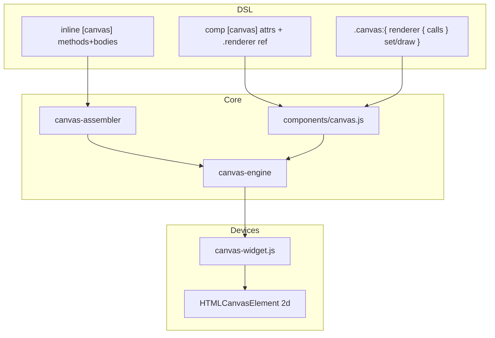

# Plan: `inline [canvas]` + `comp [canvas]` — desen 2D

> **Plan nou** (nu continuare logic2). Decizii de la **D1**; faze **1–8**; amânări **1+c, …** (fără **1+k**, **1+n**, **1+a**, **1+b** — promovate **F5–F8**).  
> **Sketch sursă:** [canvas_component.md](../my_ideas/canvas_component.md) (chat 2026-08-31).  
> **Separat de:** [inline_logic2.plan.md](inline_logic2.plan.md) (`observe` → pout → canvas inputs); [comp_clcd.plan.md](comp_clcd.plan.md) (CLCD = simboluri pe biți, **nu** API draw liber).  
> **Continuare globală teste:** alocare draft **4700+** (după hotkey/CLCD ~4663).

---

## Pachet confirmare — prioritate

User confirmă în scris `D#: literă` (ex. `D1 A`, `D5 A`, …). Ordine: **întâi Faza 1 (D1–D12)** → F1 poate deveni **(ready-to-implement)**; apoi F2/F3/F4.

### Batch F1 — confirmat user 2026-08-31

```text
D1 A ✅
D2 A ✅
D3 A ✅ — width/height fixe la elaborare; fără resize runtime
D4 D ✅ — fără default; width și height obligatorii (parse error dacă lipsesc)
D5 A ✅
D6 B ✅
D7 B ✅ — default bgColor ^000000 (tema dark, ca CLCD)
D8 A ✅
D9 A ✅
D10 A ✅
D11 A ✅
D12 A ✅
```

> **D6 B:** braces `{ }` — confirmat cu D5.  
> **D4:** opțiune nouă **D (change)** — nu exista în tabelul inițial; user respinge A/B/C (defaults).

### Batch F2 — confirmat user 2026-09-01

```text
D13 A ✅
D13b A ✅
D14 A ✅
D16 A ✅
D18 A ✅ → **superseded D18b** user 2026-09-01
D19/D19b → **superseded D19c** ✅
D21/D21b → **superseded D21c** ✅
D16b ✅ — user 2026-09-01
D18b ✅ — user 2026-09-01
D19c A ✅
D21c A ✅
D22a ✅ D22b ✅ D22c ✅ D22d A ✅ — user 2026-09-01
D20 A ✅
D15 A ✅
D17 A ✅
D23 A ✅
D24 A ✅
D25 A ✅
D26 A ✅
D27 A ✅
D28 A ✅
```

> **F2 (ready-to-implement)** — **D13–D28 ✅** (D17 A user 2026-09-01).

---

## Legenda

| Marcaj | Semnificație |
| ------ | ------------ |
| **(recommended)** | Opțiunea recomandată de analiză |
| **(change)** | Alternativă validă; diferă de sketch sau de direcția implicită |
| **(ready-to-implement)** | Faza poate începe după confirmarea deciziilor ei |
| **(completed)** | Decizie luată / fază implementată |
| **1+a … 1+z** | Faze **amânate** — vezi [Backlog faze amânate](#backlog-faze-amânate-1a--1z) |
| ✅ | Backlog **promovat / livrat** |
| ❌ | Backlog **respins** definitiv |
| 🟠✗ | Backlog **închis** — alternativa nu se face |
| ⏳ | Backlog **deschis** — încă amânat |
| ⏸ | Backlog **pause** — idee, fără promovare fază |

**Notă:** **D1+** sunt **locale acestui plan**. Nu importă numerotarea din logic2/hotkey. Breaking față de alte planuri = notă cross-link, nu reutilizare ID.

---

## Reguli planului

1. **Plan izolat:** numerotare **Faza 1, 2, 3, 4** + subfaze **F1a, F1b, …**; decizii **D1, D2, …**.
2. **Confirmare:** user confirmă **A/B/C** în scris; până atunci **draft**.
3. **Backlog amânat:** ID **1+a, 1+b, …** — tabel master mai jos; promovare → **Faza N** cu secțiune completă.
4. **Implementare:** pattern legacy + wave în `tests/test_suite.js`; doc EN în `v0_3_2/doc/`; `node _run_test_suite_node.js -q` + `_verify_doc_examples.js` la done.
5. **Fără întrebări în chat pentru draft:** opțiunile stau în tabel + detaliu sub tabel.
6. **Sketch ≠ spec:** sketch-ul poate conține lacune/erori — analiza notează **(change)** unde e cazul.
7. **Principiu arhitectură (din sketch):** logic = **ce stare**; canvas = **cum se desenează**; `observe` = punte (depinde de F108 logic, nu de acest plan).

---

## Stare la handoff (azi)

| Existent azi | Relevant canvas |
| ------------ | --------------- |
| `inline [logic]` / `comp [logic]` | Pattern inline+comp de urmat |
| `inline` kinds: `asm`, `lut`, `protocol`, `plc`, `logic` | **`canvas` necunoscut** → parse error |
| `comp [clcd]` / LCD / servo widgets | Canvas DOM + `getContext('2d')` + rAF — **pattern UI** |
| Culori pe comps: `^aaffaa` / wire color | Sketch folosește `"aaffaa"`; **`#` = comentariu** în LogTScript |
| `set` pe logic/clcd | Control pin existent ca model |
| `busy` pe DMA/CPU | Model pout status |
| **Nu există** `inline [canvas]` / `comp [canvas]` | Feature nou |
| **Nu există** limbaj draw (rect/text/line/circle) | Feature nou |
| Logic `observe` (F108) | Consumator downstream — **nu** blocant MVP canvas |

**Teste:** alocare canvas draft **4700+**.

---

## Mapare decizii → faze

| Fază | Decizii | Status |
| ---- | ------- | ------ |
| **Faza 1** Scaffold parse + device + attrs | **D1–D12** | **done** |
| **Faza 2** Limbaj draw + builtins | **D13–D28** | **done** |
| **Faza 3** Renderer + wires + set/draw/busy/clear | **D29–D40** | **done** |
| **Faza 4** Doc + teste + integrare observe | **D43–D48** | **done** |
| **Faza 5** Font family + `fontStyle` (**1+k**) | **D49–D52** | **done** |
| **Faza 6** CLCD symbols `drawSymbol` (**1+n**) | **D53–D61** | **done** |
| **Faza 7** `if` / `else` în body (**1+a**) | **D62–D68** | **done** |
| **Faza 8** Loops `for` / `while` (**1+b**) | **D69–D75** ✅ | **done** |
| *(amânate)* | **1+c …** (fără 1+a, 1+b, 1+k, 1+n) | — |

---

## Backlog faze amânate (1+a … 1+z)

Tabel master — itemi **amânați**. **Stare:** ⏳ deschis · ✅ promovat/livrat · ⏸ pause.

| Stare | ID | Subiect | Detaliu | Fază draft | Legat de |
| ----- | -- | ------- | ------- | ---------- | -------- |
| ✅ | **1+a** | `if` / conditional draw | `if` / `else` în body metodă; comparații în condiție | **Faza 7** | D62–D68, D26 |
| ✅ | **1+b** | Loops `for` / `while` | C-style `for`; `while (cond)`; body metodă | **Faza 8** | D69–D75 |
| ⏳ | **1+c** | Imagini / sprite sheet | `drawImage`, load asset | — | post-MVP |
| ⏳ | **1+d** | Transform (rotate/scale/translate) | Stack `save`/`restore` JS | — | post-MVP |
| ⏳ | **1+e** | Path / arc / bezier / polygon | Dincolo de rect/line/circle | — | post-MVP |
| ⏳ | **1+f** | Input mouse/touch pe canvas | Hit-test → pout / logic | — | CLCD touch pattern |
| ⏳ | **1+g** | Clip / partial dirty rect | Optimizare redraw regiuni | — | D36 |
| ⏳ | **1+h** | Layer / offscreen buffer | Multi-layer compose | — | — |
| ⏳ | **1+i** | `fill` vs `stroke` separate API | Extindere style | — | D18 |
| ⏳ | **1+j** | Alpha 8-hex | `"rrggbbaa"` — **D16b** ✅; fără keyword `transparent` |
| ✅ | **1+k** | Font family + `fontStyle` | **`fontFamily("mono"\|"sans"\|"serif")`**; **`fontStyle(family, size)`**; + `textAlign` `start`/`end` | **Faza 5** | D22e, D49–D52 |
| ⏳ | **1+p** | Text contur (`strokeText`) | `drawText` = fill only (**D22c**); contur → backlog | — | D22c |
| ⏳ | **1+l** | Vector wire args (`shotsXVector/s16`) | Sketch menționează; MVP scalar | — | D33 |
| ⏳ | **1+m** | Multiple `inline [canvas]` pe un comp | Switch renderer runtime | — | D8 |
| ✅ | **1+n** | **CLCD symbols pe canvas** (`drawSymbol`) | **`drawSymbol`**, `symbolSize`, `symbolStyle`, `symbolBits`; registry shared | **Faza 6** | D53–D61 |
| ⏸ | **1+o** | *(slot liber)* | — | — | — |

**Ordine recomandată:** **F1–F8** ✅; apoi **1+c** / **1+d** la cerere; input **1+f** după observe+games.

---

## Backlog **1+b** → **Faza 8** (promovat)

Vezi [Faza 8](#faza-8--loops-for--while-1b-promovat) — `for` / `while` în metode canvas.

---

## Backlog post-MVP (2+a … 2+z)

| Stare | ID | Subiect | Detaliu | Fază draft | Legat de |
| ----- | -- | ------- | ------- | ---------- | -------- |
| ⏸ | **2+a** | WebGL / 3D | Out of scope 2D | — | — |
| ⏸ | **2+b** | Export PNG / screenshot pin | — | — | — |
| ⏸ | **2+c** | *(slot liber)* | — | — | — |

---

## Analiză direcție (sketch — global)

**Ce se dorește:**

```text
inline [canvas]  →  metode de desen reutilizabile (implementare vizuală)
comp [canvas]    →  instanță <canvas> + legături input + când se redesenează
logic + observe  →  stare → wire → canvas input → set/dirty → renderer → pixeli
```

**Potrivire cu codebase:**

| Building block | Stare | Canvas |
| -------------- | ----- | ------ |
| `parseInline` kinds | fără `canvas` | F1 — extindere |
| Comp registry + Devices panel | CLCD/LCD pattern | F1 — `canvas.js` + widget |
| Property block `.comp:{ … set = 1 }` | logic/clcd | F3 — `set`/`draw`/`busy` |
| rAF coalesce | `clcd-widget`, `panel-anim-raf` | F3 — dirty single-slot |
| Expr aritmetică | logic `is/2`, wire expr | F2 — **subset nou** în body canvas (fără Prolog) |

**Lacune / posibile erori în sketch:**

| # | Observație | Impact | Decizie |
| - | ---------- | ------ | ------- |
| 1 | Inline arată **doar semnături** `drawBg(...)` — **fără body** | Fără body nu există desen | **D5 (change)** — metode **cu body** |
| 2 | **Cum se leagă** `inline` de `comp`? Sketch omite `use`/program block | Binding obligatoriu | **D8** |
| 3 | Culori `"aaffaa"` vs ecosistem `^aaffaa` | Consistență + `#` comentariu | **D16** |
| 4 | `renderer { }` e în **comp body** sau în **exec block** `.comp:{ }`? Sketch amestecă | Parse + semantică | **D29** |
| 5 | Args `xWire/s16` — codec existent logic vs tip nou canvas | Reuse vs invent | **D33** |
| 6 | `busy` synchronous pe rAF? JS e single-thread — busy scurt | Semantică reală | **D38** |
| 7 | `draw` vs `set` — ambele schedule; diferența „immediate” e subtilă în browser | Clarificare | **D35–D37** |
| 8 | Fără `if`/`for` — scene complexe greu de scris | Acceptat MVP; backlog **1+a/1+b** | — |
| 9 | Clear canvas la fiecare frame? Sketch nu spune | Artefacte / flicker | **D36** |
| 10 | Parametri metodă vs variabile locale vs pinuri | Scope limbaj | **D14–D15** |

**Verdict:** direcția sketch e **coerentă** (separare logic/render + dirty coalesce). Spec-ul de implementare trebuie să **completeze** body-urile metodelor, binding inline↔comp, și subsetul de limbaj draw (builtins + aritmetică + assign). Nu e nevoie de motor logic în canvas.

---

## Faza 1 — Scaffold: `inline [canvas]` + `comp [canvas]` + device + atribute **(draft)**

> **Status:** draft — așteaptă **D1–D12**.  
> **Livrabil:** parse OK, componentă înregistrată, panou Devices cu `<canvas>` gol (bgColor), fără draw API încă.

### Problemă (azi)

| Situație | Comportament azi |
| -------- | ---------------- |
| `inline [canvas] .r:` | **Parse error** — unknown kind |
| `comp [canvas] .c:` | **Unknown component** |
| Device canvas user-draw | **Nu există** (doar CLCD/LCD interne) |

### Sintaxă țintă (F1 — structură)

```logts
inline [canvas] .gameRenderer:

    /* F1: poate accepta body gol sau doar declarații metode stub;
       body real + builtins → Faza 2 */

:

comp [canvas] .myCanvas:

    width: 512
    height: 512
    bgColor: ^000000

    .gameRenderer { }
:
```

### Atribute componentă (cerință user)

| Atribut | Tip | Default | Rol |
| ------- | --- | ------- | --- |
| `width` | int | **obligatoriu** (**D4 D✅**) | lățime canvas (px); setat o dată la definirea comp |
| `height` | int | **obligatoriu** (**D4 D✅**) | înălțime px; setat o dată |
| `bgColor` | color | **`^000000`** (**D7 B✅**) | fundal clear/init — ca CLCD dark |

### Decizii **D1–D12** (draft)

| ID | Subiect | Opțiuni |
| -- | ------- | ------- |
| **D1** | Kind name | **A (recommended)** `canvas` · **B** `draw` · **C** `gfx` |
| **D2** | Device UI | **A (recommended)** panou Devices ca CLCD (un `<canvas>` per comp) · **B** doar offscreen (fără widget) |
| **D3** | `width`/`height` mutable runtime | **A (recommended)** parse-time only (ca CLCD) · **B** pins resize · **C** property block |
| **D4** | Defaults `width`/`height` | **A** 320×240 · **B** 512×512 · **C** 200×100 · **D (change) ✅** **fără default** — ambele atribute **obligatorii** |
| **D5** | Formă `inline [canvas]` | **A (change, recommended)** metode **cu body** `{…}` sau indent block · **B** doar semnături (sketch literal — insuficient) · **C** semnături în inline + body în fișier separat |
| **D6** | Delimitare body metodă | **A** indent până la next method · **B (change, recommended)** braces `{ }` obligatoriu · **C** `name(args): … :` |
| **D7** | Default `bgColor` | **A (recommended)** `"ffffff"` · **B** `"000000"` · **C** transparent (fără fill init) |
| **D8** | Binding inline → comp | **A (recommended)** program block `.rendererName { }` ca logic · **B** `use .renderer` · **C** `renderer: .gameRenderer` attr · **D** implicit același nume |
| **D9** | Comp fără inline | **A (recommended)** elaboration error · **B** permis (doar clear bg) · **C** builtins doar în `renderer` exec (fără inline) **(change)** |
| **D10** | Allow policy | **A (recommended)** `inline.type{canvas}` + `comp.type{canvas}` ca logic · **B** mereu allowed |
| **D11** | Fișiere | **A (recommended)** `core/components/canvas.js` + `devices/canvas-widget.js` + assembler dedicat · **B** tot în un fișier |
| **D12** | Teste F1 | **A (recommended)** parse + registry + width/height/bgColor; ID **4700+** · **B** doar parse |

### D1 — Kind name

**Ce înseamnă „Kind name”:** cuvântul din parantezele pătrate după `inline` / `comp` — **identificatorul tipului** de modul inline sau componentă.

```logts
inline [canvas] .gameRenderer:    ← kind = canvas
comp [canvas] .myCanvas:          ← kind = canvas
```

Analogii existente în LogTScript:

| Kind | Rol |
| ---- | --- |
| `logic` | motor Prolog inline + comp logic |
| `clcd` | display simboluri pe biți |
| `asm`, `lut`, `protocol`, `plc` | alte inline-uri |

Parserul (`parseInline`) acceptă azi doar lista fixă de kinds; pentru canvas trebuie adăugat **`canvas`** în acea listă + înregistrare `CanvasComponent`.

| | |
| - | - |
| **A (recommended)** | `inline [canvas]` / `comp [canvas]` — aliniat sketch + element HTML `<canvas>` |
| **B** | `draw` — scurt, dar **confuz** cu pinul de control `draw` (redraw) |
| **C** | `gfx` — nefolosit în sketch |

**Decizie:** **A ✅** — confirmed user 2026-09-01.

### D2 — Device UI

| | |
| - | - |
| **A (recommended)** | Widget în panoul Devices — un `<canvas>` DOM per `comp [canvas]` (pattern CLCD/LCD) |
| **B** | Offscreen only — fără panou |

**Decizie:** **A ✅** — confirmed user 2026-08-31.

### D3 — `width` / `height` — ce înseamnă „mutable”

În plan, **mutable** = poate fi **schimbat după ce comp-ul există** (runtime), de ex. prin pin `width`, property block `.canvas:{ width = 800 }`, sau resize dinamic.

| Opțiune plan | Semnificație |
| ------------ | ------------ |
| **A** | Dimensiunea se citește **o singură dată** la parse/elaboration din atributele `width:` / `height:` — apoi **fixă** |
| **B** | Pinuri wire care pot redimensiona canvas la fiecare wave |
| **C** | Resize prin property block exec |

**Confirmare user:** width și height sunt **atribute de componentă**, se inițializează **o dată** și **nu se mai schimbă** → **D3 A ✅**.

Implementare: `comp [canvas]` **fără** `width`/`height` ca pin sau property mutabilă; lipsă atribut → eroare (**D4**).

### D4 — Defaults dimensiuni

| | |
| - | - |
| **A** | Default 320×240 dacă omit user |
| **B** | Default 512×512 |
| **C** | Default 200×100 |
| **D (change) ✅** | **Fără default** — `width:` și `height:` **obligatorii**; `comp [canvas] .x:` fără ele → **parse/elaboration error** |

Exemplu valid:

```logts
comp [canvas] .board:
    width: 512
    height: 512
    bgColor: ^000000
    .gameRenderer { }
:
```

**Decizie:** **D ✅** — confirmed user 2026-08-31.

### D5 — Semnături vs body **(change față de sketch)**

Sketch:

```text
inline [canvas] .gameRenderer
    drawBg(x, y, width, height, color)
```

**Problemă:** fără body, `drawBg` nu poate apela builtins. User cere builtins + aritmetică în canvas.

| | |
| - | - |
| **A (change, recommended)** | Metodă = nume + params + **body** cu statements draw/assign |
| **B** | Doar semnături (sketch) — **respins practic** pentru MVP util |
| **C** | Semnături în inline; implementare JS host — out of LogTScript |

Exemplu țintă **A** (cu **D6 B** braces):

```logts
inline [canvas] .gameRenderer:

    drawBg(x, y, w, h, color) {
        style(color)
        drawRect(x, y, w, h)
    }

    drawPlayer(x, y, name, health) {
        style("0000ff")
        drawCircle(x, y, 12)
        style("000000")
        drawText(x, y - 20, name)
    }
:
```

**Decizie:** **A ✅** — confirmed user 2026-08-31.

### D6 — Delimitare body metodă

| | |
| - | - |
| **A** | Indent |
| **B** | `{ }` obligatoriu după semnătură |
| **C** | `drawBg(...): … :` |

**Decizie:** **B ✅** — confirmed user 2026-08-31 (cu D5).

### D7 — Default `bgColor`

| | |
| - | - |
| **A** | `"ffffff"` |
| **B ✅** | **`^000000`** — fundal negru, aliniat CLCD + tema dark Devices |
| **C** | transparent |

**Notă:** pe **atribut comp** folosim sintaxa existentă **`^000000`** (ca `clcd.md`), nu `#000000` — `#` rămâne comentariu în LogTScript. În **body metode** canvas, culorile rămân string `"rrggbb"` conform **D16**.

**Decizie:** **B ✅** — confirmed user 2026-08-31.

### D8 — Binding inline → comp

Sketch **nu** arată legătura. Pattern logic (cod real):

```logts
comp [logic] .L:
    .world { }
```

Parser: `compType === 'logic'` + `.ref { bodyRaw }` → `attributes.logicPrograms`.

| | |
| - | - |
| **A (recommended)** | Același pattern: `comp [canvas] .C: .gameRenderer { }` → `canvasPrograms` / `canvasRenderers`; body block **gol în F1**; F3 poate pune mapări pin dacă **D30 B** |
| **B** | `use .gameRenderer` — keyword nou |
| **C** | `renderer: .gameRenderer` — attr scalar |
| **D** | basename identic obligatoriu — fragil la rename |

**MVP A:** un singur inline per comp; multiple → **1+m**.

Exemplu F1:

```logts
comp [canvas] .myCanvas:

    width: 512
    height: 512
    bgColor: ^000000

    .gameRenderer { }
:
```

**Decizie:** **A ✅** — confirmed user 2026-08-31.

### D9 — Comp fără inline

**Decizie:** **A ✅** — elaboration error.

### D10 — Allow / NotAllow

**Decizie:** **A ✅** — `inline.type{canvas}` + `comp.type{canvas}`.

### D11 — Layout fișiere

**Decizie:** **A ✅** — split `canvas.js` + `canvas-widget.js` + assembler/engine.

### D12 — Teste F1

| ID draft | Caz |
| -------- | --- |
| 4700 | parse `inline [canvas]` minimal |
| 4701 | parse `comp [canvas]` + attrs obligatorii + `.renderer { }` |
| 4702 | parse error — lipsește `width` sau `height` (**D4 D**) |
| 4703 | default `bgColor` ^000000 când omit (**D7 B**) |
| 4704 | explicit width/height/bgColor |
| 4705 | missing inline ref → elaboration error (**D9 A**) |
| 4706 | Allow policy reject (**D10 A**) |

**Decizie:** **A ✅** — confirmed user 2026-08-31 (detaliu test IDs alocat în plan).

### Arhitectură F1–F3



### Scope F1 (subfaze)

| Subfază | Conținut |
| ------- | -------- |
| **F1a** | Parser: kind `canvas`; stub inline body; attrs `width`/`height`/`bgColor` |
| **F1b** | `CanvasComponent` + register + validate attrs |
| **F1c** | `canvas-widget.js` — create/resize `<canvas>`, fill `bgColor` |
| **F1d** | Teste **4700+** + doc stub `canvas.md` (minimal) |

### Criterii done F1

- [ ] `inline [canvas]` / `comp [canvas]` parse fără eroare (cu binding D8)
- [ ] Device vizibil; dimensiuni + bgColor aplicate
- [ ] Policy Allow/NotAllow (D10)
- [ ] Teste F1 verzi; **nu** încă builtins

### Status F1

**(ready-to-implement)** — **D1–D12✅** (D1 A user 2026-09-01).

---

## Faza 2 — Limbaj draw: expresii, asignări, builtins **(ready-to-implement)**

> **Status:** **(ready-to-implement)** — **D13–D28 ✅** (D17 A user 2026-09-01).  
> **Depinde:** F1.  
> **Out of scope:** `if`, loops (**1+a**, **1+b**).

### Cerințe user (confirmate ca intent)

| Cerință | Interpretare |
| ------- | ------------ |
| builtins tip JS canvas | `drawRect`, `drawText`, `drawLine`, `drawCircle`, `style` |
| `#` = comentariu | **niciodată** culoare `#rrggbb` |
| text `"..."` | string literal |
| int / float | `1`, `34`, `1.3`, `1.444` |
| aritmetică | `x + 10`, `x - (y * 3)`, paranteze |
| asignări | `a = 31 + (b / 3) * 2 - (b - 3)` |
| fără `if` / `for` / `while` | backlog |

### Gramatică draft (body metodă)

```text
method     := name '(' params? ')' '{' stmt* '}'     # D6 B
params     := id (',' id)*
stmt       := assign | call
assign     := id '=' expr
call       := name '(' args? ')'
args       := expr (',' expr)*
expr       := term (('+'|'-') term)*
term       := factor (('*'|'/') factor)*
factor      := number | float | string | id | '(' expr ')' | '-' factor
```

**Interzis MVP:** `if`, `while`, `for`, `==`, `<`, `&&`.

### Sintaxă țintă (body metodă)

```logts
inline [canvas] .demo:

    drawBox(x, y, w, h, color) {
        pad = 2
        style(0, color)
        drawRect(x + pad, y + pad, w - pad * 2, h - pad * 2)
        style("000000", 0, 1)
        drawLine(x, y, x + w, y + h)
        drawCircle(x + w / 2, y + h / 2, 4, "0000ff", 0)
        drawText(x, y - 12, "box")
    }
:
```

### Decizii **D13–D28** (draft)

| ID | Subiect | Opțiuni |
| -- | ------- | ------- |
| **D13** | Unde rulează statements | **A (recommended)** doar în body metode inline · **B** și în `renderer` comp · **C** doar în renderer **(change)** |
| **D13b** | Apel metodă→metodă | **A (recommended)** permis · **B** interzis MVP · **C** max depth N |
| **D14** | Scope variabile | **A (recommended)** local per apel metodă · **B** state persistent pe comp · **C** `static` |
| **D15** | Params metode | **A (recommended)** by-value la apel; shadow pe locals · **B** mutable ref |
| **D16** | Literali culoare | **A (recommended)** string hex `"rrggbb"` / `"rgb"` (3 sau 6) · **B** doar `^rrggbb` (ecosistem comps) · **C (change)** ambele `"…"` și `^…` · **D** interzis `#…` (obligatoriu — aliniat user) |
| **D17** | Normalizare culoare intern | **A (recommended)** → CSS `#rrggbb` doar în widget JS · **B** păstrează fără `#` în tot stack-ul |
| **D18** | `style(...)` | **superseded → D18b** |
| **D19** | `drawRect` | **superseded → D19c** |
| **D20** | `drawLine` | **A ✅** stroke din styleStroke |
| **D21** | `drawCircle` | **superseded → D21c** |
| **D16b** | transparență | **✅** `0`/`"0"` + `"rrggbb"` / `"rrggbbaa"` |
| **D18b** | styleFill / styleStroke / style | **✅** |
| **D19c** | drawRect fill+stroke | **✅** |
| **D21c** | drawCircle fill+stroke | **✅** |
| **D22** | `drawText` | **A (recommended)** (x,y,text) font default monospace 14 · **B** + size · **C** + font args (**1+k**) |
| **D23** | Operatori aritmetici MVP | **A (recommended)** `+ - * /` + paranteze · **B** + `%` · **C** + `//` floor div |
| **D24** | Diviziune | **A (recommended)** float JS (`/`) · **B** int trunc · **C** eroare dacă mix int/float fără cast |
| **D25** | Tipuri în expr | **A (recommended)** number unificat (IEEE) la runtime draw · **B** int/float distincte cu erori |
| **D26** | Comparații / bool | **A (recommended)** **interzis** MVP (fără if) · **B** permis dar inutil |
| **D27** | Erori runtime draw | **A (recommended)** elaboration unde e static; runtime → log + skip op · **B** stop renderer · **C** set pout `error` |
| **D28** | Comentarii în body | **A (recommended)** `#` line comment (ca restul LogT) · **B** `/* */` only |

### D13 — Unde rulează statements

| | |
| - | - |
| **A (recommended)** | Body metode = assign + builtins; `renderer { }` doar **invocă** metode (sketch) |
| **B** | + statements brute în `renderer` |
| **C (change)** | Totul în `renderer` — slăbește reuzarea |

**Decizie:** **A ✅** — confirmed user 2026-09-01.

### D13b — Compoziție metode

```logts
drawFrame(x, y) {
    drawBg(0, 0, 320, 240, "ffffff")
    drawPlayer(x, y, "p1", 100)
}
```

| | |
| - | - |
| **A (recommended)** | Permis — altfel scenele se copiază în `renderer` |
| **B** | Interzis — doar builtins în body |
| **C** | Depth max (ex. 8) |

Cicluri statice → elab error; overflow → **D27**.

**Decizie:** **A ✅** — confirmed user 2026-09-01.

### D14 — Locals vs state între frame-uri

Starea animației trăiește în **logic**, nu în canvas.

| | |
| - | - |
| **A (recommended)** | Locals **per apel**; dispar după return |
| **B** | State pe comp — **(change)** față de principiu |
| **C** | `static` — post-MVP |

**Decizie:** **A ✅** — confirmed user 2026-09-01.

### D16 — Culori **(important)**

| | |
| - | - |
| **A (recommended)** | `"rrggbb"` / `"rgb"`; **`#` = comentariu** |
| **B** | Doar `^rrggbb` |
| **C (change)** | `"…"` **și** `^…` |

Constraint: `#rrggbb` **nu** e literal culoare. Attr `bgColor` pe comp = `^…` (ca CLCD).

**Decizie:** **A ✅** — confirmed user 2026-09-01.

### D15 — Parametri metode

| | |
| - | - |
| **A ✅** | By-value la apel; parametrii nu modifică variabilele din apelant; locals pot shadow param names |
| **B** | Mutable ref — respins MVP |

**Decizie:** **A ✅** — confirmed user 2026-09-01.

### D17 — Normalizare culoare intern ✅

În LogTScript canvas **nu folosim `#`** în sursă (`"ff0000"`, `0`, `"ff000080"`). API-ul browser **`ctx.fillStyle`** totuși acceptă forme CSS — de obicei **`"#rrggbb"`** sau **`rgba(...)`**.

| | |
| - | - |
| **A ✅** | Până la widget, culorile rămân **string fără `#`** (sau sentinel `0`). **Doar în widget** (ultimul pas): `toCssColor(c)` → `"#ff0000"` / `"rgba(...)"` apoi `ctx.fillStyle = …` |
| **B** | **Nici în runtime JS** nu producem string cu `#` — widget setează `fillStyle` via **`rgb(r,g,b)`** sau **`rgba(r,g,b,a)`** parse din hex intern; `#` nu apare nicăieri în stack |

**Practic pentru user:** identic vizual. Diferența e doar în implementare:

| | **A** | **B** |
| - | ----- | ----- |
| Unde se convertește | o funcție la granița engine → ctx | parse hex → rgb() fără `#` |
| Simplitate | **mai simplu** — o mapare directă la ce așteaptă Canvas | puțin mai mult cod |
| Debug / log | poate apărea `#` în string-uri JS interne | `#` zero ori în tot procesul |

**Decizie:** **A ✅** — confirmed user 2026-09-01.

### D23 — Operatori aritmetici

**Decizie:** **A ✅** — `+ - * /` + paranteze — confirmed user 2026-09-01.

### D24 — Diviziune

**Decizie:** **A ✅** — float JS (`/`) — confirmed user 2026-09-01.

### D25 — Tipuri expr

**Decizie:** **A ✅** — number unificat IEEE — confirmed user 2026-09-01.

### D26 — Comparații / bool

**Decizie:** **A ✅** — interzis MVP — confirmed user 2026-09-01.

### D27 — Erori runtime draw

**Decizie:** **A ✅** — log + skip op — confirmed user 2026-09-01.

### D28 — Comentarii

**Decizie:** **A ✅** — `#` line comment — confirmed user 2026-09-01.

---

### Revizie stroke / fill — **D16b, D18b, D19c, D21c** ✅ user 2026-09-01

> Înlocuiește semantic **D18 A**, **D19/D19b**, **D21/D21b**.  
> **Nu** folosim keyword `"transparent"` — vezi **D16b**.

#### D16b — transparență / alpha ✅

| Formă culoare | Semnificație |
| ------------- | ------------ |
| `"rrggbb"` (6 hex) | opac — alpha **FF** implicit |
| `"rrggbbaa"` (8 hex) | alpha explicit (ex. `"ff000080"` = roșu 50%, `"ff000000"` = roșu invizibil) |
| **`0`** sau **`"0"`** | **transparent** — skip fill sau skip stroke la desen (nu e culoare validă CSS) |

**Respins:** literal `"transparent"` ca keyword.

```logts
styleFill(0)                    # fără fill la drawRect/drawCircle
styleStroke("0")                # fără stroke
drawRect(x, y, w, h, 0, "ff0000")   # doar contur roșu
drawRect(x, y, w, h, "00ff00", 0)   # doar fill verde
```

**Decizie:** **✅** confirmed user 2026-09-01.

#### D18b — API `style*` ✅

| Builtin | Semnificație |
| ------- | ------------ |
| **`styleFill(fillColor)`** | setează doar fill; stroke / strokeWidth **neschimbate** |
| **`styleStroke(strokeColor)`** | setează doar strokeColor; strokeWidth **neschimbat** |
| **`styleStroke(strokeColor, strokeWidth)`** | strokeColor + strokeWidth (px) |
| **`style(strokeColor, fillColor)`** | setează **ambele** — ordine: **stroke întâi, fill al doilea** |
| **`style(strokeColor, fillColor, strokeWidth)`** | stroke + fill + lățime contur |

**Default:** `strokeWidth = 1` la primul `styleStroke` / `style(..., width)` dacă nu a fost setat.

**Fără** builtin separat `styleStrokeWidth` — lățimea intră doar în `styleStroke(c, w)` și `style(cStroke, cFill, w)`.

```logts
styleFill("aaffaa")
styleStroke("000000", 2)
drawRect(x, y, w, h)

style("000000", "aaffaa", 2)    # echivalent: stroke negru 2px, fill verde

styleFill(0)
styleStroke("ff0000")
drawRect(x, y, w, h)            # doar contur roșu
```

**Notă ordine `style`:** primul arg = **stroke**, al doilea = **fill** (diferit de unele API-uri grafice — documentat explicit).

**Decizie:** **✅** confirmed user 2026-09-01.

#### D19c — `drawRect` fill + stroke ✅

| Formă | Semnificație |
| ----- | ------------ |
| `drawRect(x, y, w, h)` | fill + stroke din `styleFill` / `styleStroke` curente |
| `drawRect(x, y, w, h, fill)` | override **doar fill**; stroke din style |
| `drawRect(x, y, w, h, fill, stroke)` | override ambele; **`0` / `"0"`** = skip acel pas |

La fiecare apel: dacă fill **nu** e transparent → `fillRect`; dacă stroke **nu** e transparent → `strokeRect`.

```logts
drawRect(x, y, w, h, 0, "ff0000")           # doar contur
drawRect(x, y, w, h, "00ff00", 0)           # doar fill
drawRect(x, y, w, h, "aaffaa", "000000")    # ambele, culori diferite
```

**Decizie:** **A ✅** — confirmed user 2026-09-01.

#### D21c — `drawCircle` fill + stroke ✅

Aceeași regulă ca **D19c** (inclusiv `0` / `"0"`).

```logts
drawCircle(x, y, 12, "0000ff", "ffffff")
drawCircle(x, y, 12, 0, "ff0000")            # doar inel
```

**Decizie:** **A ✅** — confirmed user 2026-09-01.

#### Matrice rapidă

| Scop | Exemplu |
| ---- | ------- |
| fill roșu, fără stroke | `drawRect(x,y,w,h,"ff0000",0)` |
| stroke roșu, fără fill | `drawRect(x,y,w,h,0,"ff0000")` |
| fill + stroke diferite | `style("000000","aaffaa",2)` + `drawRect(...)` sau args pe draw |
| nimic | `drawRect(x,y,w,h,0,0)` → noop |

---

### D18 — `style(...)` *(superseded de **D18b** ✅)*

### D19 / D19b *(superseded de **D19c** ✅)*

### D20 — `drawLine`

Folosește **strokeColor** + **strokeWidth** din `styleStroke` / `style` (nu fill).

```logts
styleStroke("ff0000", 3)
drawLine(x1, y1, x2, y2)
```

**Decizie:** **A ✅** — confirmed user 2026-09-01.

### D22 — `drawText` ✅

`(x, y, text)` — font default **`14px monospace`** (vezi **D22d**).

**Culoare:** **`styleFill`** → JS `fillText` (**D22c**).

**Tipografie:** `fontSize` + `textAlign` + `textBaseline` — stare pe context (**D22a**, **D22b**, **D22d**).

```logts
styleFill("ffffff")
textAlign("center")
textBaseline("top")
drawText(160, 20, "Score: 7")
```

**Decizie:** **A ✅** — confirmed user 2026-09-01.

### D22a — builtin `textAlign` ✅

| Apel | JS |
| ---- | -- |
| `textAlign("left")` | `ctx.textAlign = 'left'` |
| `textAlign("center")` | `ctx.textAlign = 'center'` |
| `textAlign("right")` | `ctx.textAlign = 'right'` |

**Default:** **`"left"`** (ca JS). `start` / `end` → **Faza 5** (**D51**) ✅.

**Decizie:** **✅** confirmed user 2026-09-01.

### D22b — builtin `textBaseline` ✅

| Apel | JS |
| ---- | -- |
| `textBaseline("top")` | `ctx.textBaseline = 'top'` |
| `textBaseline("middle")` | `ctx.textBaseline = 'middle'` |
| `textBaseline("alphabetic")` | `ctx.textBaseline = 'alphabetic'` |
| `textBaseline("bottom")` | `ctx.textBaseline = 'bottom'` |

**Default:** **`"alphabetic"`** (ca JS). `hanging` / `ideographic` → backlog **1+k**.

**Decizie:** **✅** confirmed user 2026-09-01.

### D22c — `drawText` fill vs stroke ✅

| | |
| - | - |
| **A ✅** | `drawText` → **`fillText`** — culoare din **`styleFill`**; **nu** folosește `styleStroke` / strokeWidth |
| **B** | și contur — ar necesita `strokeText` (backlog **1+p**) |

**Decizie:** **A ✅** — confirmed user 2026-09-01.

### D22d — `fontSize` ✅

Builtin **`fontSize(n)`** — `n` int/float, **pixeli**; setează partea de mărime din `ctx.font`.

| | |
| - | - |
| **A ✅** | `fontSize(n)` — stare pe context; **default `14`** la init renderer |
| **B** | `drawText(x,y,text,size)` — respins pentru MVP |
| **C** | amânat — respins (user: vital în MVP) |

**MVP:** familia rămâne **`monospace` fix** — schimbare familie → **Faza 5** (**D22e** / **D49**).

```logts
styleFill("ffffff")
fontSize(24)
textAlign("center")
textBaseline("top")
drawText(160, 30, "GAME OVER")

fontSize(14)
drawText(10, 10, "FPS")
```

**JS intern:** `ctx.font = fontSize + "px monospace"` (family din state, default `monospace`).

**Decizie:** **A ✅** — confirmed user 2026-09-01.

### D22e — `fontFamily` + `fontStyle` → **Faza 5** (promovat din **1+k**)

Vezi [Faza 5](#faza-5--fontfamily--fontstyle-1k-promovat) — **D49–D52**.

### Mapping JS (rezumat post-D18b)

| Builtin LogT | JS 2D |
| ------------ | ----- |
| `styleFill(c)` | `fillStyle` |
| `styleStroke(c)` / `styleStroke(c,w)` | `strokeStyle` + `lineWidth` |
| `style(stroke, fill)` / `style(stroke, fill, w)` | ambele + width |
| `fontSize(n)` | parte din `ctx.font` (px) |
| `textAlign(...)` | `ctx.textAlign` |
| `textBaseline(...)` | `ctx.textBaseline` |
| `drawRect(...)` | `fillRect` +/sau `strokeRect` |
| `drawCircle(...)` | `arc` + fill/stroke |
| `drawLine(...)` | `stroke` |
| `drawText(...)` | `fillText` + font/align/baseline curente |

*(D22n închis. **D22e** → **Faza 5**.)*

### Scope F2

| Subfază | Conținut |
| ------- | -------- |
| **F2a** | Parser body (gramatică) |
| **F2b** | Engine → ctx |
| **F2c** | Builtins + mock ctx |
| **F2d** | Doc builtins |

### Criterii done F2

- [ ] Builtins text: `fontSize`, `textAlign`, `textBaseline` + draw primitives
- [ ] `#` ≠ culoare; `"ff00aa"` OK
- [ ] `if`/`for` → parse error
- [ ] Compoziție metode (D13b)
- [ ] Teste **47xx**

### Status F2

**(ready-to-implement)** — **D13–D28 ✅** (D17 A user 2026-09-01).

---

## Faza 3 — `renderer` + wire args + `set` / `draw` / `busy` / dirty **(draft)**

> **Status:** draft — **D29–D42**.  
> **Depinde:** F2.  
> **Sursă sketch:** set/draw/busy/dirty + coalescing + single-slot pending.

### Sintaxă țintă (din sketch, clarificată)

**Definiție comp (body):**

```logts
comp [canvas] .myCanvas:

    width: 512
    height: 512
    bgColor: "ffffff"

    .gameRenderer {
        /* F3: eventual mapări pin; sau gol dacă pinii vin din exec — D30 */
    }
:
```

**Exec / property block (ca logic):**

```logts
.myCanvas:{
    renderer {
        drawBg(0, 0, 512, 512, "aaffaa")
        drawPlayer(xWire/s16, yWire/s16, playerNameWire/ascii, healthWire/u16)
        drawBox(boxX/s16, boxY/s16, 100, 150, "0000ff")
    }

    set = 1
}
```

`renderer { }` **invocă** metode din inline selectat — **nu** le definește (sketch OK).

### Model control (sketch)

| Semnal | Vizibilitate | Rol |
| ------ | ------------ | --- |
| `set = 1` | public | state updated → `dirty=1` → schedule coalesced |
| `draw = 1` | public | explicit redraw request (tot schedule, „urgent”) |
| `busy` | public pout | 1 în timpul exec renderer |
| `dirty` | **intern** | pending redraw; nu pin user |

Coalesce: N× `set` înainte de frame → **un** redraw cu starea latest.

### Decizii **D29–D42** (draft)

| ID | Subiect | Opțiuni |
| -- | ------- | ------- |
| **D29** | Unde trăiește `renderer { }` | **A (recommended)** în exec block `.comp:{ }` (sketch) · **B** doar în body comp · **C** ambele (body = default list; exec poate override) |
| **D30** | Pinii canvas — declarație | **A (recommended)** inferați din args `name/type` din `renderer` · **B** declarație explicită în program block ca logic · **C** mix |
| **D31** | Ordine apeluri în `renderer` | **A (recommended)** secvențial top→bottom · **B** paralel (nonsens 2D) |
| **D32** | Literal vs wire arg | **A (recommended)** număr/string literal **sau** `wire/rep` · **B** doar wire · **C** expr în arg listă (`x+1` — **change**, util) |
| **D33** | Reprezentări `/s16` `/u16` `/ascii` | **A (recommended)** reuse codec logic number/text pe lățime wire · **B** tipuri canvas-only · **C** MVP doar `/number` pe wire lățime naturală; `/s16` în **1+l** delay |
| **D34** | Vector args sketch | **A (recommended)** amânat **1+l** · **B** MVP vector |
| **D35** | `set` semantică | **A (recommended)** latch/pulse ca logic: pe edge/valoare 1 → dirty+schedule · **B** level-triggered cât e 1 |
| **D36** | Clear înainte de renderer | **A (recommended)** clear cu `bgColor` fiecare redraw · **B** nu clear (user desenează bg) · **C** attr `autoClear: 0/1` |
| **D37** | `draw` vs `set` | **A (recommended)** ambele setează dirty; `draw` bypass debounce / schedule rAF ASAP; `set` poate coalesța în același frame · **B** `draw` = sync `renderer()` imediat (poate bloca) · **C (change)** un singur pin `redraw` (simplificare sketch) |
| **D38** | `busy` | **A (recommended)** 1 pe durata rulării metodelor pe ctx; 0 după; pout 1-bit · **B** busy și cât e rAF pending · **C** fără busy MVP |
| **D39** | Pending când busy | **A (recommended)** sketch: dirty rămâne 1; după busy re-schedule o dată · **B** drop · **C** eroare |
| **D40** | Scheduler | **A (recommended)** `requestAnimationFrame` single-slot · **B** `queueMicrotask` · **C** sync always |
| **D41** | `set` fără `renderer` block | **A (recommended)** clear-only / no-op draw · **B** elaboration error dacă lipsește renderer |
| **D42** | Test helpers | **A (recommended)** `flushCanvas(comp)` + mock ctx spy calls · **B** doar pixel digest |

### D29 — Loc `renderer { }`

Sketch pune `renderer` în `.myCanvas:{ … }` lângă `set = 1` → **exec block**.

| | |
| - | - |
| **A (recommended)** | Exec block — ca `query =` la logic |
| **B** | Body comp — listă statică |
| **C** | Body = default; exec override |

**Notă:** cu **A**, fiecare update reia `renderer { }` + `set` — consistent wave.

**Alternativă (change) C:** body declară lista „scenă default”; exec doar `set=1` fără a re-lista apelurile — mai puțin verbose la animație.

### D30 — Pinii

| | |
| - | - |
| **A (recommended)** | Infer din `renderer` args `boxX/s16` → pin/input `boxX` |
| **B** | Declarație în `.gameRenderer { x is number xPin }` ca logic — verbose |
| **C** | Mix |

**Risc A:** `renderer` trebuie să apară o dată la elaboration (sau primul exec) ca pinii să existe — clarificat: **lista `renderer` din primul exec block din script** sau **obligatoriu și un default în body (D29 C)**.

### D32 — Expr în args `renderer`

Sketch: doar literal sau `wire/rep`.

| | |
| - | - |
| **A (recommended)** | literal **sau** `wire/rep` |
| **C (change)** | și `xWire/s16 + 10` — util, dar parser mai greu; poate aștepta F2 expr pe wire decode |

### D33 — `wire/s16`

| | |
| - | - |
| **A (recommended)** | Decode ca logic `/s16` `/u16` `/ascii` |
| **C (change, MVP mic)** | Wire numeric/string fără slash formats — **1+l** pentru rest |

### D35 / D37 — `set` vs `draw`

| Op | Semantica recommended **A** |
| -- | --------------------------- |
| `set` | dirty=1; coalesce în rAF curent/următor |
| `draw` | dirty=1; tot rAF, dar **nu** debounced dincolo de frame (același single-slot; diferența e documentară + eventual skip coalescing delay artificial) |

**Realitate JS:** ambele ajung pe același rAF single-slot. Diferența utilă: **intent** + eventual `draw` forțează redraw chiar dacă valorile pin neschimbate (skip dirty-check pe inputs).

| | |
| - | - |
| **A (recommended)** | Păstrează ambele pinuri (sketch) |
| **B** | `draw` = sync blocking |
| **C (change)** | Un singur `redraw` |

### D36 — Clear **(lacună sketch)**

| | |
| - | - |
| **A (recommended)** | Auto-clear `bgColor` înainte de `renderer` |
| **B** | Fără clear — user `drawBg` obligatoriu |
| **C** | Attr `autoClear: 0/1` (default 1) |

### D38–D40 — busy + schedule

JS single-thread: `busy=1` e scurt (durata interpretării). Tot util pentru `wait = OR(.canvas:busy)` patterns ca DMA.

| | |
| - | - |
| **D38 A** | busy doar în timpul run metodelor |
| **D39 A** | set în timpul busy → dirty rămâne; re-schedule o dată |
| **D40 A** | `requestAnimationFrame` single-slot (ca CLCD widget) |

### Flow (formalizat)

```text
set/draw → dirty=1 → (dacă !busy) schedule rAF
rAF → busy=1 → [clear?] → run renderer calls → busy=0 → dirty=0
         ↘ dacă dirty din nou în timpul busy → re-schedule după
```

### Scope F3

| Subfază | Conținut |
| ------- | -------- |
| **F3a** | Parse `renderer { calls }` + wire/rep args |
| **F3b** | Pins infer / validate; pout `busy` |
| **F3c** | Dirty/rAF/coalesce + set/draw handlers |
| **F3d** | Teste schedule + flush + spy draw order |

### Criterii done F3

- [x] `set` multiplu → un redraw (rAF coalesce)
- [x] `set` în timpul `busy` → redraw ulterior (`_pendingAfterBusy`)
- [x] Args literal + wire decode (`pinName/s16`, `/ascii`, `/bool`)
- [x] `busy` pout observabil
- [x] `clear` pin (default 1; `clear = 0` additive)
- [x] `dirty` **nu** e pin public

### Status F3

**done** — D29 A, D30 A, D32–D33 A, D35 A, D36 **`clear`** (default 1), D37 A, D38–D40 A. Teste 4730–4735 (wave + legacy unde aplicabil).

---

## Faza 4 — Documentație, teste end-to-end, integrare logic/observe **(done)**

> **Status:** done — **D43–D48**.

### Scop

| Item | Detaliu |
| ---- | ------- |
| Doc EN | `canvas.md`, `inline-canvas.md` (sau secțiuni), update `components.md`, `doc-index.json` |
| Exemple | static draw; wire-driven; osc→logic→observe→canvas (dacă observe gata) |
| Verify | `_verify_doc_examples.js` + logts-play |
| Non-goals | implementare `if`/loops; sprite; touch |

### Decizii **D43–D48** (draft)

| ID | Subiect | Opțiuni |
| -- | ------- | ------- |
| **D43** | Structură doc | **A (recommended)** un `canvas.md` (inline+comp+builtins+control) · **B** split `inline-canvas.md` + `comp-canvas.md` (ca logic) |
| **D44** | Exemplu anim osc | **A (recommended)** doc + test dacă observe+`$` disponibile · **B** doc conceptual only până F108 done |
| **D45** | Integrare observe | **A (recommended)** soft: canvas MVP fără observe; exemplu integrare când F108✅ · **B** hard dep F108 |
| **D46** | Pixel tests | **A (recommended)** mock ctx call log (nu PNG) MVP · **B** hash PNG |
| **D47** | Wave + legacy | **A (recommended)** ambele ca restul suitei · **B** doar wave |
| **D48** | Demo script | **A (recommended)** exemplu în doc + optional `examples/` · **B** doar unit tests |

### Exemplu țintă integrare (din sketch, adaptat)

```logts
inline [logic] .game:
    boxX$(10)
    /* … */
:

inline [canvas] .gameRenderer:
    drawScene(x, y) {
        style("aaffaa")
        drawRect(0, 0, 800, 600)
        style("0000ff")
        drawRect(x, y, 40, 40)
    }
:

comp [logic] .gameLogic:
    on: 1
    .game {
        observe boxX$ is number boxXPin
    }
:

comp [canvas] .gameCanvas:
    width: 800
    height: 600
    bgColor: "aaffaa"
    .gameRenderer { }
:

/* wiring + osc → query → commit → observe → set canvas — detalii după D8/D30/D45 */
```

### Scope F4

| Subfază | Conținut |
| ------- | -------- |
| **F4a** | Doc + index + verify examples |
| **F4b** | Suite e2e **47xx–48xx** |
| **F4c** | Notă cross-link în logic2 / monopoly dacă e cazul |

### Criterii done F4

- [x] Doc EN verificată (`inline-canvas`, `comp-canvas`, `canvas-builtins`, `components.md`, `doc-index.json`)
- [x] Suite verde quiet (4700–4741)
- [x] Exemplu static + dinamic (`logts-play`: wire `/s16`, `observe` → canvas)
- [x] `doc_verify` comp-canvas + inline-canvas

### Status F4

**done** — D43 B (split docs), D44 B (observe e2e doc, fără osc anim), D45 A (soft dep observe), D46 A (mock ctx), D47 A (wave+legacy), D48 A (doc `logts-play`).

---

## Faza 5 — `fontFamily` + `fontStyle` (**1+k** promovat)

> **Status:** done — **D49–D52** ✅ (user 2026-09-01).
> **Depinde:** F2 (text builtins existente: `fontSize`, `drawText`, `textAlign`, `textBaseline`).  
> **Promovat din backlog:** **1+k** (user 2026-09-01).

### Scop

| Item | Detaliu |
| ---- | ------- |
| **`fontFamily(name)`** | Schimbă familia din lista allowed (aliniat CLCD `label` / `family:`) |
| **`fontStyle(family, size)`** | Sugar: `fontFamily` + `fontSize` într-un apel |
| **`textAlign("start"\|"end")`** | Extindere D22a (în MVP doar left/center/right) |
| **Engine** | `ctx.font = size + "px " + cssStack` — state deja are `fontFamily` intern (fix `monospace` azi) |
| **Doc + teste** | `canvas-builtins.md`, `logts-play`, **4742+** wave + legacy |

### Sintaxă țintă

```logts
fontStyle("sans", 18)
textAlign("start")
drawText(100, 40, "Menu")

fontFamily("serif")
fontSize(12)
textBaseline("alphabetic")
drawText(10, 200, "caption")
```

### Mapare familie → CSS (draft — aliniat CLCD)

| Token LogT | `ctx.font` stack (ca CLCD `label`) |
| ---------- | ----------------------------------- |
| **`"mono"`** | `Consolas, "Courier New", monospace` |
| **`"sans"`** | `system-ui, Segoe UI, sans-serif` |
| **`"serif"`** | `Georgia, Times New Roman, serif` |

**Notă:** token **`"mono"`** (nu `"monospace"`) — același vocabular ca `comp [clcd]` `family: mono|sans|serif`. Alias `"monospace"` → acceptat sau eroare: **D49**.

### Decizii **D49–D52** ✅

| ID | Subiect | Decizie |
| -- | ------- | ------- |
| **D49** | Tokeni `fontFamily` / `fontStyle` | **A ✅** `mono` \| `sans` \| `serif` (ca CLCD) |
| **D50** | `fontStyle(family, size)` | **A ✅** |
| **D51** | `textAlign` `start`/`end` | **A ✅** |
| **D52** | Familie invalidă | **A ✅** runtime error |

### Scope F5

| Subfază | Conținut |
| ------- | -------- |
| **F5a** | Builtins `fontFamily`, `fontStyle` în assembler + engine + mock `fillText` font string |
| **F5b** | `textAlign("start"\|"end")` |
| **F5c** | Doc `canvas-builtins.md` + exemplu `logts-play` (Load & Run) |
| **F5d** | Teste **4742+** (wave + legacy), `doc_verify` |

### Criterii done F5

- [x] `fontFamily("sans")` + `fontSize` → `ctx.font` corect în widget + mock
- [x] `fontStyle("serif", 20)` echivalent cu apelurile separate
- [x] `textAlign("start")` / `("end")` acceptate
- [x] Familie necunoscută → eroare
- [x] Doc EN + suite verde (4742–4749)

### Status F5

**done** — D49–D52 A; teste **4742–4749** (wave + legacy).

---

## Faza 6 — CLCD symbols (`drawSymbol`, **1+n** promovat)

> **Status:** done — **D53–D61** ✅ (user 2026-09-01).
> **Depinde:** F2 (style/color), F5 (text separat de simboluri).  
> **Promovat din backlog:** **1+n** (user 2026-09-01).

### Scop

Același **catalog de nume** ca `comp [clcd]` (~500 FA + `digit7`/`digit14`/`colon`/`dp`), desenate liber pe `comp [canvas]` via builtins — fără symbol blocks, fără `bit`/`bits` CLCD.

| Separare clară | API |
| -------------- | --- |
| Text liber | `drawText` + `fontFamily` / `fontStyle` (**F5**) |
| Simbol catalog | `drawSymbol` + `symbolSize` / `symbolStyle` (**F6**) |
| `label` | **nu** pe `drawSymbol` — rămâne text |

### Dispatch (identic CLCD widget)

```
drawSymbol(x, y, name [, bits])
    → getClcdSymbolDef(name)
        kind 'fa'     → 3 args; fillText(FA glyph)     [clcd-symbol-draw]
        kind 'canvas' → 4 args obligatoriu (bits)      [clcd-symbol-draw]
        kind 'text'   → ERROR (use drawText)
        missing       → ERROR (unknown symbol)
```

### API țintă

```logts
# Font Awesome icon (3 args)
styleFill("00ff00")
symbolSize(28)
symbolStyle(1)
drawSymbol(20, 10, "battery")

# 7-segment digit (4 args — bits în apel)
style("334455", "00ff00")    # off / on — D58
symbolSize(44)
drawSymbol(60, 10, "digit7", "1101010")

# dp — 1 bit
drawSymbol(80, 10, "dp", "1")
drawSymbol(90, 10, "dp", "0")

# colon — 2 biți (top, bottom); nume registry: colon
drawSymbol(100, 20, "colon", "10")
drawSymbol(110, 20, "colon", "00")
```

### Builtins

| Builtin | Rol |
| ------- | --- |
| **`drawSymbol(x, y, name)`** | FA și simboluri fără biți — **3 argumente** |
| **`drawSymbol(x, y, name, bits)`** | Simboluri **canvas** care acceptă biți — **4 argumente obligatorii** |
| **`symbolSize(n)`** | State pentru următorul `drawSymbol`; semantica **per kind** (CLCD) |
| **`symbolStyle(n)`** | FA only: `1` solid, `2` regular, `3` brands; default **D61** `symDef.defaultStyle` |

**Nu** există `symbolBits` builtin — biții sunt **doar** al 4-lea parametru la `drawSymbol`.

### Al 4-lea arg `bits` — **D56 B ✅**

| Simbol | `bits` | Semnificație |
| ------ | ------ | ------------ |
| **`digit7`** | string **7** × `0`\|`1` | segmente on/off → `styleFill` / `styleStroke` |
| **`digit14`** | string **7** sau **14** × `0`\|`1` | desen 7-seg (ca CLCD: primele 7 folosite) |
| **`dp`** | **1** × `0`\|`1` | `1` = dot on (`fillColor`), `0` = off (`strokeColor`) |
| **`colon`** | **2** × `0`\|`1` | bit0 = punct superior, bit1 = punct inferior |
| **`fa`** | — | al 4-lea arg **interzis** (eroare) |

Validare: lungime și caractere `0`/`1` only; mesaj clar la mismatch.

**CLCD widget (refactor):** mapează `bit`/`bits` register → același `bits` string pentru shared draw (`colon` cu un singur `bit` → `"11"` / `"00"`).

### `symbolSize` — reuse CLCD helpers

Engine construiește un obiect `sym` sintetic `{ size: state.symbolSize }` și apelează:

| `kind` | Helper | Default size | Validare (ca parser CLCD) |
| ------ | ------ | ------------ | ------------------------- |
| **`fa`** | `resolveClcdFaIconSize(sym)` | **22** px înălțime | **8–64** (**D59**) |
| **`canvas`** | `resolveClcdCanvasScale(sym, renderer)` | nat.h (44 / 32 / …) | **8–120** (**D59**) |

Un singur `symbolSize(n)` — interpretarea depinde de **numele** din `drawSymbol`, nu de un tip declarat de user.

### Culori — **D58 A ✅**

Fără builtins noi de culoare; refolosim `styleFill` / `styleStroke` / `style`:

| `kind` | Culoare | Mapare canvas state |
| ------ | ------- | ------------------- |
| **`fa`** | icon | `styleFill` → `fillColor` (ca `drawText`) |
| **`digit7`**, **`digit14`** | segment on / off | `styleFill` = on, `styleStroke` = off |
| **`dp`**, **`colon`** | dot on / off | din **biții** arg-ului 4: `1` → `fillColor`, `0` → `strokeColor` per dot/segment |

**D60:** închis — **nu** `symbolOn` separat; totul din `bits` la `drawSymbol`.

### Refactor shared (obligatoriu în F6)

| Pas | Fișier | Acțiune |
| --- | ------ | ------- |
| **F6a** | `devices/clcd-symbol-draw.js` **(nou)** | `drawClcdFaIcon(ctx, opts)`, `drawClcdCanvasSymbol(ctx, opts)` — extras din `clcd-widget.js` |
| **F6b** | `devices/clcd-widget.js` | delegă la `clcd-symbol-draw.js` (zero schimbare vizuală CLCD) |
| **F6c** | `core/canvas-engine.js` | state `symbolSize`, `symbolStyle`; builtin `drawSymbol` 3–4 args; shared draw |
| **F6d** | `devices/canvas-widget.js` | `document.fonts.load` FA (3 faces, ca CLCD) la primul draw sau mount |
| **F6e** | `core/canvas-assembler.js` | înregistrare builtins noi |
| **F6f** | test bundle | `clcd-symbols_generated.js` deja în bundle ✓ |

`opts` pentru shared draw: `{ x, y, name, symDef, size, style, bits, fg, bg }` — `bits` string; CLCD widget derivă din register; canvas din arg 4.

### Mock ctx / teste

| Test | Verificare |
| ---- | ---------- |
| FA `battery` | `fillText` glyph `\uf240` |
| `symbolStyle(2)` vs `1` | weight 400 vs 900 |
| `digit7` + `"1101010"` | `fillRect` segmente |
| `dp` `"1"` / `"0"` | `arc` cu culori fg/bg |
| `colon` `"10"` / `"00"` | 2× `arc`, culori per bit |
| FA cu 4 args | eroare |
| `digit7` fără bits | eroare |
| unknown `foo` | eroare |

**Alocare teste:** **4750–4759** (wave perechi, ca F5).

### Decizii **D53–D61**

| ID | Subiect | Decizie |
| -- | ------- | ------- |
| **D53** | Nume API | **A** `drawSymbol` |
| **D54** | `symbolSize` / `symbolStyle` | **A** builtins separate în draw state |
| **D55** | Size semantics | **A** identic CLCD helpers |
| **D56** | Biți canvas symbols | **B ✅** al 4-lea arg `drawSymbol(x,y,name,bits)` — user 2026-09-01 |
| **D57** | `label` exclus | **A** — doar `drawText` |
| **D58** | Culori simboluri | **A ✅** `styleFill`+`styleStroke` |
| **D59** | Validare `symbolSize` | **A** limite CLCD (FA 8–64, canvas 8–120) |
| **D60** | `symbolOn` separat | **respins** — on/off din `bits` arg (**D56**) |
| **D61** | `symbolStyle` neapelat | **A ✅** `symDef.defaultStyle` |

### Scope F6

| Subfază | Conținut |
| ------- | -------- |
| **F6a** | `clcd-symbol-draw.js` + refactor widget |
| **F6b** | Builtins canvas + draw state |
| **F6c** | FA font preload pe canvas widget |
| **F6d** | Doc `canvas-builtins.md` + secțiune „Symbols” + link `clcd-symbols.md` + `logts-play` |
| **F6e** | Teste **4750+** wave + legacy |

### Criterii done F6

- [x] `drawSymbol` 3-arg (FA) + 4-arg (canvas + bits)
- [x] `symbolSize` / `symbolStyle` conform CLCD
- [x] CLCD widget delegă la `clcd-symbol-draw.js`
- [x] Doc `canvas-builtins.md` + exemplu `logts-play`
- [x] Suite verde **4750–4759**

### Status F6

**done** — teste **4750–4759** (wave + legacy).

---

## Faza 7 — `if` / `else` în body (**1+a** promovat)

> **Status:** done — **D62–D68** ✅ (user 2026-09-01).

### Scop

Branch condițional în **body metodă** `inline [canvas]` (și apeluri din `renderer { }` via metode) — fără loops (**1+b** rămâne amânat).

| În scope F7 | În afara scope |
| ----------- | -------------- |
| `if (cond) { stmts }` | `for` / `while` (**1+b**) |
| `else { stmts }` opțional | `for` / `while` (**1+b**) |
| `else if` / `else if` / `else` (JS) | keywords `and` / `or` / `not` (folosește `&&` `||` `!`) |
| Comparații number + string `==` `!=` | `true` / `false` literali |
| Truthiness `if (name)` / `if (!name)` | `if` în `renderer { }` direct (**D67**) |
| `&&` `||` `!` + `()` | |

### Sintaxă țintă

```logts
inline [canvas] .hud:

    drawScore(score, hi) {
        styleFill("ffffff")
        fontSize(16)
        drawText(10, 10, "Score")

        if (score > hi) {
            styleFill("ffff00")
            drawText(10, 30, "NEW HI!")
        } else {
            styleFill("888888")
            drawText(10, 30, "keep going")
        }

        if (score == 0) {
            drawSymbol(50, 20, "ban", "1")
        }
    }

:

comp [canvas] .screen:
    width: 200
    height: 60
    .hud { }
:

# renderer: drawScore(xPos/s16, hiWire/s16)
```

### Parser / AST (draft)

| Construct | AST |
| --------- | --- |
| `if (expr) { body }` | `{ kind: 'if', cond, then, else: null }` |
| `else if (expr) { … }` | lanț `else: { kind: 'if', … }` sau listă `elif` — implementare la alegere |
| `else { body }` | `else: [stmts]` |
| Block `{ }` | aceeași delimitare ca body metodă (**D6 B**) |

**Tokenizer:** extindere pentru `==`, `!=`, `<=`, `>=`, `<`, `>` (azi doar `=` există).  
**CANVAS_FORBIDDEN_IDS:** scoate `if`, `else`; păstrează `for`, `while`, `and`, `or`, `not`, `true`, `false`.

### Expresii condiție — **D64–D66**

| Nivel | Draft recommended |
| ----- | ----------------- |
| **Comparație** | `expr cmp expr` — `cmp` ∈ `==` `!=` `<` `>` `<=` `>=` |
| **Operanzi** | number (literal, var, param, wire în expr dacă e în scope renderer — doar în metode apelate cu args); **nu** string compare în F7 |
| **Truthiness** (**D65**) | **A** condiția trebuie comparație (nu `if (x)` bare) · **B** + numeric truthy `!= 0` |
| **Bool ops** (**D66**) | **A** fără `and`/`or`/`not` în F7 — condiții simple · **B** `and`/`or`/`not` ca logic |

### Execuție (engine)

```text
evalCond(expr) → boolean
executeBlock(stmts) → void (existing assign/call/if)
if (evalCond(cond)) executeBlock(then); else if (else) executeBlock(else);
```

- Locals / params: același env ca azi (**D14**).
- Erori: condiție non-boolean la runtime → eroare clară (**D27** pattern: throw sau skip — recomandat **throw** la eval cond invalid).

### Decizii **D62–D68** ✅

| ID | Subiect | Decizie |
| -- | ------- | ------- |
| **D62** | `if` / `else` JS-style | **A ✅** |
| **D63** | `else if` chain | **A ✅** |
| **D64** | Comparații | **A ✅** number + string `==`/`!=` |
| **D65** | Truthiness | **A ✅** + ascii `if (name)` / `if (!name)` |
| **D66** | `&&` `||` `!` | **A ✅** în F7 |
| **D67** | `if` doar în metode | **A ✅** |
| **D68** | Teste **4760+** | **A ✅** |

### Criterii done F7

- [x] `if`/`else`/`else if` în mock ctx
- [x] Comparații number + string equality
- [x] Truthiness ascii + `!`
- [x] `&&` `||`
- [x] `for` încă forbidden (**4768**)
- [x] Doc `inline-canvas.md` + suite **3851** verde

### Status F7

**done** — teste **4710** (parse), **4760–4768** (exec + for forbidden).

---

## Faza 8 — Loops `for` / `while` (**1+b** promovat)

> **Status:** **done** — **D69–D75** confirmate user 2026-09-01.  
> **Depinde:** F7 (condiții `if` — reutilizare `parseCond` / `canvasEvalCond`).  
> **Promovat din backlog:** **1+b** (user 2026-09-01).

### Scop

Iterație în **body metodă** — grid de tile-uri, animații procedurale simple, scan linii — fără `break`/`continue` în F8.

| În scope F8 | În afara scope |
| ----------- | -------------- |
| `for (init; cond; step) { … }` | `do` / `do-while` |
| `while (cond) { … }` | `break` / `continue` (rămân interzise) |
| Condiții ca F7 (`&&` `||` `!`, comparații, truthiness) | `for`/`while` în `renderer { }` direct (**D74**) |
| Init/step: assign expr (`i = 0`, `i = i + 1`) | Operatori `++` / `--` (draft: amânat sau D71) |
| Locals loop var în același `env` (**D14**) | Recursivitate nouă |

### Sintaxă țintă (JS/C obișnuit)

```logts
inline [canvas] .tiles:

    drawGrid(cols, rows, tileW, tileH) {
        y = 0
        row = 0
        while (row < rows) {
            x = 0
            col = 0
            while (col < cols) {
                style(0, "aaffaa")
                drawRect(x, y, tileW - 2, tileH - 2)
                x = x + tileW
                col = col + 1
            }
            y = y + tileH
            row = row + 1
        }
    }

    drawStrip(n, color) {
        for (i = 0; i < n; i = i + 1) {
            style(0, color)
            drawRect(i * 18, 10, 16, 16)
        }
    }

:

comp [canvas] .board:
    width: 200
    height: 120
    .tiles { }
:

# renderer: drawGrid(cols/s16, rows/s16, 20, 20)
```

### Gramatică `for` (draft)

```text
forStmt   := 'for' '(' forInit ';' cond ';' forStep ')' block
forInit   := assignStmt | empty
forStep   := assignStmt | empty
cond      := parseCond()   # aceeași ca F7
block     := '{' stmt* '}'
```

- **Clauze goale permise:** `for (;;)` — infinit → protejat de **D73** max iterations.
- **Init/step:** o singură assign per clauză (`i = 0`, `i = i + 1`) — nu listă cu `,`.

### Gramatică `while`

```text
whileStmt := 'while' '(' cond ')' block
```

### Execuție (engine)

```text
for:
  eval forInit (assign în env)
  iter = 0
  while canvasEvalCond(cond) && iter < MAX:
    executeBlock(body)
    eval forStep
    iter++

while:
  iter = 0
  while canvasEvalCond(cond) && iter < MAX:
    executeBlock(body)
    iter++
```

**MAX** — cap siguranță browser (**D73**), ex. **10 000** iterații → runtime error sau log+stop.

### Tokenizer / parser

| Schimbare | Detaliu |
| --------- | ------- |
| **KW** | `for`, `while` (ca `if`/`else`) |
| **CANVAS_FORBIDDEN_IDS** | scoate `for`, `while`; păstrează `do`, `break`, `continue` |
| **parseStmt** | + `parseForStmt`, `parseWhileStmt` |
| **AST** | `{ kind: 'for', init, cond, step, body }`, `{ kind: 'while', cond, body }` |
| **canvasExecuteStmts** | + exec `for` / `while` |

### Decizii **D69–D75** (draft)

| ID | Subiect | Recommended |
| -- | ------- | ----------- |
| **D69** | `for` C-style 3 clauze | **A** `for (init; cond; step)` cu `;` și assign init/step |
| **D70** | `while` | **A** da — `while (cond) { }` |
| **D71** | `++` / `--` | **B** parțial — postfix `i++` / `i--` da; prefix `++i` / `--i` amânat |
| **D72** | `break` / `continue` | **A** permise în `for`/`while`; `for` imbricat permis |
| **D73** | Max iterații | **A** cap **10000** per loop → eroare · **B** fără cap |
| **D74** | Doar în metode | **A** ca F7 — nu în `renderer` direct |
| **D75** | Teste | **A** **4770–4779** wave+legacy; **4768** → `for` permis |

### Scope F8

| Subfază | Conținut |
| ------- | -------- |
| **F8a** | KW `for`/`while` + parser |
| **F8b** | Exec loop + iteration cap |
| **F8c** | Doc `inline-canvas.md` secțiune Loops |
| **F8d** | Teste **4770+**; actualizare **4768** |

### Criterii done F8

- [x] `for (i = 0; i < n; i++)` desenează N tile-uri
- [x] `while` imbricat (grid)
- [x] Condiție F7 în loop (`i < cols`)
- [x] Depășire cap iterații → eroare
- [x] `break` în body → parse interzis
- [x] Doc + suite verde (**4770–4779**, **4768** actualizat)

### Non-goals F8

- prefix `++i` / `--i`
- `break` / `continue`
- `do-while`
- `for-each` / range syntax

### Status F8

**done** — teste **4768**, **4770–4779**; postfix `i++`/`i--` (D71 parțial).

---

## Tabel rezumat decizii (toate — draft)

| ID | Fază | Subiect | Recommended |
| -- | ---- | ------- | ----------- |
| **D1** | 1 | Kind `canvas` | **A ✅** |
| **D2** | 1 | Device UI Devices panel | **A ✅** |
| **D3** | 1 | size fixe elaborare | **A ✅** |
| **D4** | 1 | width/height obligatorii | **D ✅** |
| **D5** | 1 | metode cu body | **A ✅** |
| **D6** | 1 | delimitare body | **B ✅** |
| **D7** | 1 | bgColor default | **B ✅** `^000000` |
| **D8** | 1 | binding `.inline { }` | **A ✅** |
| **D9** | 1 | inline obligatoriu | **A ✅** |
| **D10** | 1 | Allow policy | **A ✅** |
| **D11** | 1 | fișiere split | **A ✅** |
| **D12** | 1 | teste 4700+ | **A ✅** |
| **D13** | 2 | statements în metode | **A ✅** |
| **D13b** | 2 | apel metodă→metodă | **A ✅** |
| **D14** | 2 | locals per call | **A ✅** |
| **D16** | 2 | color `"hex"` | **A ✅** |
| **D16b** | 2 | `0`/`"0"` + 8hex alpha | **✅** |
| **D18b** | 2 | styleFill/Stroke/style | **✅** |
| **D19c** | 2 | drawRect fill+stroke | **✅** |
| **D21c** | 2 | drawCircle fill+stroke | **✅** |
| **D18** | 2 | *(superseded D18b)* | — |
| **D19** | 2 | *(superseded D19c)* | — |
| **D20** | 2 | `drawLine` stroke | **A ✅** |
| **D21** | 2 | *(superseded D21c)* | — |
| **D22** | 2 | `drawText` basic | **A ✅** |
| **D22a** | 2 | `textAlign` builtin | **✅** default `left` |
| **D22b** | 2 | `textBaseline` builtin | **✅** default `alphabetic` |
| **D22c** | 2 | drawText = fill only | **A ✅** |
| **D22d** | 2 | `fontSize(n)` px, default 14 | **A ✅** |
| **D22e** | 5 | `fontFamily` / `fontStyle` | **F5** (1+k) |
| **D49** | 5 | tokeni family mono/sans/serif | **A ✅** |
| **D50** | 5 | builtin `fontStyle(family, size)` | **A ✅** |
| **D51** | 5 | `textAlign` start/end | **A ✅** |
| **D52** | 5 | familie invalidă → error | **A ✅** |
| **D53** | 6 | `drawSymbol` API | **A ✅** |
| **D54** | 6 | `symbolSize` / `symbolStyle` | **A ✅** |
| **D55** | 6 | size semantics CLCD | **A ✅** |
| **D56** | 6 | biți în `drawSymbol` | **B ✅** arg 4 |
| **D57** | 6 | `label` exclus | **A ✅** |
| **D58** | 6 | culori simboluri | **A ✅** |
| **D59** | 6 | validare size 8–64/120 | **A ✅** |
| **D60** | 6 | `symbolOn` | **respins** |
| **D61** | 6 | default symbolStyle | **A ✅** |
| **D62** | 7 | `if`/`else` JS-style | **A ✅** |
| **D63** | 7 | `else if` chain | **A ✅** |
| **D64** | 7 | comparații | **A ✅** |
| **D65** | 7 | truthiness ascii | **A ✅** |
| **D66** | 7 | `&&` `||` `!` | **A ✅** |
| **D67** | 7 | `if` doar în metode | **A ✅** |
| **D68** | 7 | teste 4760+ | **A ✅** |
| **D69** | 8 | `for` C-style | **A** |
| **D70** | 8 | `while` | **A** |
| **D71** | 8 | `++`/`--` | **A** amânat |
| **D72** | 8 | `break`/`continue` | **A** interzise |
| **D73** | 8 | max iterations | **A** 10000 |
| **D74** | 8 | doar în metode | **A** |
| **D75** | 8 | teste 4770+ | **A** |
| **D23** | 2 | ops `+ - * /` | **A** |
| **D24** | 2 | `/` float | **A** |
| **D25** | 2 | number unificat | **A** |
| **D26** | 2 | fără bool/cmp | **A** |
| **D27** | 2 | erori skip/log | **A** |
| **D28** | 2 | `#` comment | **A** |
| **D29** | 3 | `renderer` în exec | **A** |
| **D30** | 3 | pins inferate | **A** |
| **D31** | 3 | ordine secvențială | **A** |
| **D32** | 3 | literal sau wire | **A** (+ **C** expr?) |
| **D33** | 3 | `/s16` codec | **A** |
| **D34** | 3 | vector → **1+l** | **A** |
| **D35** | 3 | `set` pulse/edge | **A** |
| **D36** | 3 | auto-clear bg | **A** |
| **D37** | 3 | `draw` vs `set` | **A** |
| **D38** | 3 | `busy` pout | **A** |
| **D39** | 3 | pending if busy | **A** |
| **D40** | 3 | rAF single-slot | **A** |
| **D41** | 3 | set fără renderer | **A** |
| **D42** | 3 | mock ctx tests | **A** |
| **D43** | 4 | un `canvas.md` | **A** |
| **D44** | 4 | osc exemplu | **A** |
| **D45** | 4 | soft dep observe | **A** |
| **D46** | 4 | mock not PNG | **A** |
| **D47** | 4 | wave+legacy | **A** |
| **D48** | 4 | doc demo | **A** |

---

## Riscuri / neclarități

| Topic | ID | Notă |
| ----- | -- | ---- |
| Sketch fără body metode | **D5** | **(change)** obligatoriu pentru MVP util |
| Binding inline omis în sketch | **D8** | Pattern logic recommended |
| `renderer` în exec vs body | **D29** | Sketch sugerează exec |
| Culori `"hex"` vs `^hex` | **D16** | User: fără `#`; string OK |
| `busy` aproape instant pe JS | **D38** | Tot util pentru sync cu alte comps |
| Fără loops | **1+b → F8** | `for`/`while` în body metodă |
| Depend observe | **D45** | Canvas MVP independent |
| Confuzie CLCD vs canvas | doc | CLCD = layout + touch + symbol blocks; canvas = draw API; **1+n** = același catalog simboluri via `drawSymbol` |

---

## Istoric plan

| Data | Eveniment |
| ---- | --------- |
| 2026-08-31 | Creat **canvas_inline_and_comp.plan.md** — analiză sketch; **F1–F4** draft; **D1–D48** draft; backlog **1+a …**; numerotare **D1** (plan nou) |
| 2026-09-01 | **D22d A✅** — `fontSize(n)` MVP default 14; **D22e** draft `fontFamily`/`fontStyle` → **1+k** |
| 2026-09-01 | **1+b → Faza 8** — `for`/`while` în body; D69–D75 draft; teste **4770+** |
| 2026-09-01 | **F5 done** — `fontFamily`/`fontStyle`/`textAlign` start|end; D49–D52 A; teste **4742–4749** |
| 2026-09-01 | **D16b/D18b/D19c/D21c** draft — stroke+fill separat (înlocuit de confirmare de mai sus) |
| 2026-09-01 | **D13/13b/14/16/18–22✅** + **D19b/D21b** fillColor opțional; **D22n** explicat (pending) |

---

## Legături

- [inline_logic2.plan.md](inline_logic2.plan.md) — `observe` (F108) ca sursă de inputuri
- [comp_clcd.plan.md](comp_clcd.plan.md) — pattern device canvas (nu API draw)
- [clcd-symbols.md](../../v0_3_2/doc/clcd-symbols.md) — catalog simboluri (**Faza 6**)
- [hotkey_on_comps.plan.md](hotkey_on_comps.plan.md) — structură plan + legendă (referință format)
