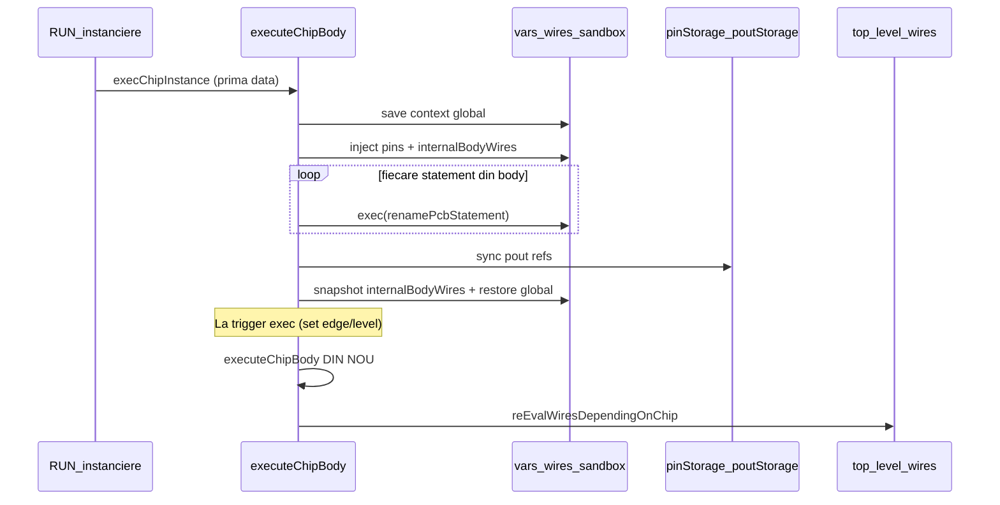
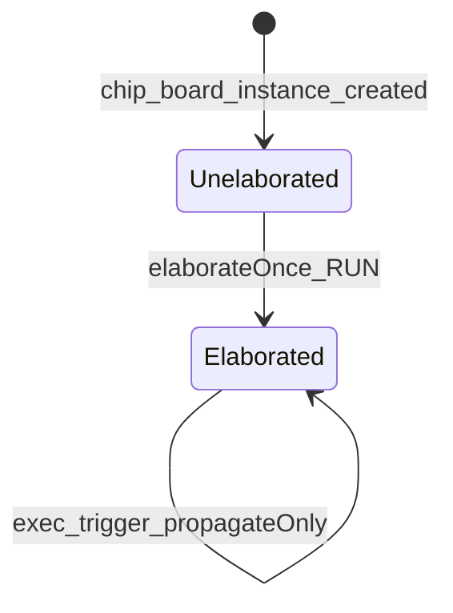

# Plan: Chip/Board — elaborare la RUN, propagare la exec (fără re-exec body)

**Status implementare:** complet în v0_3_2 (`executeCompositeBody`, `propagateCompositeInstance`). Documentație utilizator: [v0_3_2/doc/chip-board-execution.md](../../v0_3_2/doc/chip-board-execution.md). Teste: 1674/1674.

## Ce se întâmplă astăzi

Modelul actual este **„re-elaborare imperativă la fiecare clock”**, nu propagare persistentă.



### Trigger-e care re-execută body-ul

| Trigger | Unde | Comportament |
|---------|------|--------------|
| Instanțiere `chip [x] .u1::` | [`execChipInstance`](v0_3_2/core/interpreter.js) ~12234 | body o dată obligatoriu |
| `.u1:set = 1` (pin `exec:`) | asignare directă ~9252 | edge/level pe `def.on` → `executeChipBody` |
| `.u1:{ set=1, ... }` | [`executeChipPropertyBlock`](v0_3_2/core/interpreter.js) ~12379 | setează pins → `executeChipBody` |
| Property block intern în body | inline la fiecare body run | gating level pe `set` |

Semantica `on:` (`raise`, `edge`, `1`/level) rămâne pe **evenimentul exec** — doar **ce face** după trigger trebuie schimbat.

### Ce persistă vs ce e aruncat

**Persistă** (corect, de păstrat):
- `pinStorage` / `poutStorage` — refs stabile în storage
- componente interne `._{prefix}_*` — nu se recreează ([`exec` skip re-decl](v0_3_2/core/interpreter.js) ~8525)
- `internalBodyWires` — snapshot `{type, ref, schemaRef, vector}` între run-uri
- `lastExecValue` — edge tracking

**Se aruncă** la fiecare body run (problema):
- `this.vars` / `this.wires` globale — restaurate; firele body sunt efemere
- **toate statement-urile** sunt re-rulate imperativ

### Diferența față de top-level

| | Top-level | Chip/board body azi |
|---|-----------|---------------------|
| Fire | persistente în `this.wires` | temporare, snapshot în `internalBodyWires` |
| Actualizare | `wireStatements` + wave `propagate()` | re-exec completă body |
| La `NEXT(~)` | re-eval expresii înregistrate | body NU rulează (decât la exec trigger) |
| Componente | declarate o dată | declarate o dată, dar wiring re-făcut la fiecare exec |

**Observație importantă:** `trackWireStatement` exclude doar PCB (`!insidePcbBody`), deci assignment-urile din chip/board body ajung în `wireStatements` global — dar firele dispar după restore, deci la `NEXT` sunt ignorate (`wire` inexistent). Graful intern **nu e conectat** la propagarea globală.

---

## Ce dorești (confirmat)

- La **RUN**: citește/elaborează body-ul o dată — creează fire, componente, legături
- La **exec trigger** (`exec` + `on:`): aplică valori pe pins, **propagă** prin graful deja creat
- **Fără** re-rulare statement-uri și **fără** ordinea imperativă a body-ului
- PCB: **nu** în scope-ul primei faze (deprecated mai târziu); chip/board pot fi refactorizate separat

---

## Direcție recomandată: două faze pe instanță



### Faza A — `elaborate` (o singură dată)

La `execChipInstance` / `execBoardInstance`:
1. Alocă `pinStorage` / `poutStorage` (ca acum)
2. Rulează body **o singură dată** cu scop: structură, nu „ciclu CPU”
   - creează componente interne
   - creează fire interne (refs în storage)
   - **înregistrează** assignment-urile combinaționale într-un graf propriu instanței
3. Setează `instance.elaborated = true`
4. Salvează pe instanță:
   - `instance.internalWireGraph` — lista de noduri de propagare (vezi mai jos)
   - `instance.internalBodyWires` (există deja)
   - componente prefixate (există deja)

### Faza B — `propagate` (la fiecare exec valid)

În loc de `executeChipBody(name, def.body)` la trigger:
1. **Gate exec** — păstrează logica existentă `on:` + `lastExecValue` (~9252–9264, ~12455–12473)
2. Aplică valorile pins din property block / asignare directă (deja în property block handler)
3. **`propagateCompositeInstance(instanceName)`** — nou:
   - re-injectează fire interne din `internalBodyWires` într-un context scoped (fără re-decl)
   - rulează propagare wave/combinational pe `internalWireGraph`
   - actualizează componente interne conectate (`updateConnectedComponents` / computed refresh)
   - sync `poutStorage` din firele pout
4. `reEvalWiresDependingOnChip/Board` — păstrează podul spre top-level

---

## Design `internalWireGraph` (propagare fără ordine body)

Pentru fiecare assignment combinațional din body (la elaborare), înregistrează:

```js
{
  targetWire: 'aluOut',      // nume local body
  expr: [...],               // AST RHS (deja în statement)
  deps: Set(['aluIn','instr']), // fire/pin/component refs
  kind: 'wire' | 'compPin'  // ex: .add:a = a
}
```

La propagate:
- Construiește ordinea din **dependențe** (topological sort / wave fixpoint), nu din ordinea textului body
- Echivalent semantic cu top-level wave mode
- Pinii `exec:` / `set` sunt **surse** — nu fac parte din graf

**Ce NU intră în graf** (rămân one-shot la elaborare):
- `comp [alu] .add:` — declarație componentă
- `chip [inner] .x::` / `board [...]` — instanțiere imbricată
- `show` / `doc` / `probe` — side-effect debug (doar la elaborare sau explicit interzise în body combinațional)

**Componente cu stare** (`mem`, `reg`, `counter`, …):
- Deja persistă între exec-uri (skip re-decl)
- La propagate: nu re-instanciază; primesc input-uri noi prin `updateConnectedComponents` / property apply
- Exec-ul chipului devine „clock edge” care permite componentei să-și actualizeze ieșirile — aliniat cu modelul existent

---

## Separare chip/board vs PCB

| | Chip/Board (faza 1) | PCB (mai târziu) |
|---|---------------------|------------------|
| `nextSection` / `~~` | nu există | da — lifecycle separat |
| `propagate()` în body | da (wave) | nu |
| Izolare chip/board imbricate | salvează/restaurează maps | nu salvează |
| Refactor sigur separat | **da** | risc înalt dacă inclus acum |

**Recomandare:** refactor comun doar între chip și board (cod ~95% duplicat: `executeChipBody` ≈ `executeBoardBody`). PCB rămâne pe `executePcbBody` până la deprecation.

Pași mecanici chip/board (pre-propagate):
- Extrage `executeCompositeBody(kind, ...)` + `propagateCompositeInstance(kind, ...)`
- Păstrează `renamePcbStatement` neschimbat (folosit și de PCB)

---

## Fișiere principale de atins

| Fișier | Schimbări |
|--------|-----------|
| [`v0_3_2/core/interpreter.js`](v0_3_2/core/interpreter.js) | `elaborateCompositeBody`, `propagateCompositeInstance`, înlocuire apeluri `executeChipBody` la re-exec; captură graf la elaborare |
| [`v0_3_2/core/signal-propagation.js`](v0_3_2/core/signal-propagation.js) | eventual scope instanță pentru propagare internă (sau reutilizare strategy cu wire map local) |
| [`v0_3_2/tests/test_suite.js`](v0_3_2/tests/test_suite.js) | teste noi + migrare teste chip/board re-exec |

**Nu atinge** în faza 1: `executePcbBody`, `pendingNextSection`, `insidePcbBody` guards.

---

## Plan de implementare (incremental)

### Etapa 1 — Inventar + flag (fără schimbare comportament)

- Adaugă `instance.elaborated` și `instance.internalWireGraph = []`
- La finalul primei `executeChipBody`, populează graful (doar logging / test)
- Test: graful conține assignment-urile așteptate după instanțiere

### Etapa 2 — `propagateCompositeInstance` (paralel cu vechiul path)

- Implementează propagare pe graf pentru fire combinaționale simple
- Feature flag / test-only: `PROPAGATE_ONLY_CHIP=1` sau test dedicat
- Compară output cu modelul vechi pe exemple mici (halfAdd, schema encoder 2241)

### Etapa 3 — Înlocuire trigger exec

- În `executeChipPropertyBlock` / asignare directă pin exec: dacă `elaborated` → `propagateCompositeInstance` în loc de `executeChipBody`
- Prima instanțiere: `elaborate` (body o dată) + `elaborated=true`
- **Elimină** loop-ul de re-exec statement-uri la trigger

### Etapa 4 — Curățare și unificare chip/board

- Unifică `executeChipBody` + `executeBoardBody` → `executeCompositeBody`
- Unifică property blocks
- Elimină dependența de re-decl `initOnly` pentru fire deja elaborate (simplificare `internalBodyWires`)

### Etapa 5 — Teste regresie

Teste existente de verificat / adaptat:

| Test | Ce verifică |
|------|-------------|
| 840, 827–828 | board/chip property block + pout |
| 2241–2242 | schema literal + re-exec → devine re-propagate |
| 858 | board în chip body |
| 861+ | cpu4 board (stare mem/reg) |
| noi | storage nu crește la N exec-uri (echivalent 507 pentru chip) |
| noi | `on: raise` vs `on: 1` — același gate, fără body re-exec |

### Etapa 6 (opțional, post-MVP) — PCB

- Doar dacă PCB nu e încă deprecated: același pattern cu hooks pentru `nextSection`
- Sau lasă PCB pe model vechi până la removal

---

## Riscuri și mitigări

| Risc | Mitigare |
|------|----------|
| Body cu `var` / non-wire | Documentare: doar wiring combinațional suportat; detectare la elaborare cu eroare clară |
| Property blocks **interne** în body | La elaborare: înregistrare ca surse pin, nu re-inline la fiecare exec |
| Imbricare chip→board→chip | Elaborare recursivă la instanțiere; propagate în ordine ierarhică (copil înainte de pout sync) |
| Legacy vs wave propagation | `propagateCompositeInstance` folosește aceeași strategy ca top-level; teste pe ambele moduri unde relevant |
| Cod care se baza pe „a doua exec body” pentru side effects | Audit grep `executeChipBody` / `executeBoardBody`; interzice show/doc în body combinațional sau rulează doar la elaborare |
| `reEvalWiresDependingOn*` devine insuficient | După propagate intern, sync pouts declanșează automat publish (poate înlocui parțial reEval) |

---

## Rezultat așteptat

După implementare, un script tip:

```logts
chip +[cpu]:
  4pin aluIn
  1pin set
  4pout aluOut
  exec: set
  on: raise
  16wire<opcode> instr = { alu=\5 }<opcode>
  instr:alu = aluIn
  aluOut = instr:alu
  :4bit aluOut
chip [cpu] .u1::
```

- **RUN**: elaborare → graf intern + componente/fire create
- **`.u1:{ aluIn=0101; set=1 }`** (rising edge): doar pins actualizați + propagare → `aluOut=0101`
- **A doua pulse**: fără re-rulare `instr:alu = aluIn` ca statement; doar propagare din valorile pinilor curenți
- Storage stabil (fără alocări noi per pulse, ca test 507)

---

## Notă despre ordinea statement-urilor

Ai confirmat explicit: **nu** păstrăm ordinea textului din body. Propagarea va folosi dependențe (fixpoint wave), aliniat cu firele top-level. Corpurile care se bazeau pe ordine imperativă (ex: `tmp = a; a = b`) vor avea comportament diferit — documentat în [chip-board-execution.md](../../v0_3_2/doc/chip-board-execution.md) ca stil dataflow recomandat.
