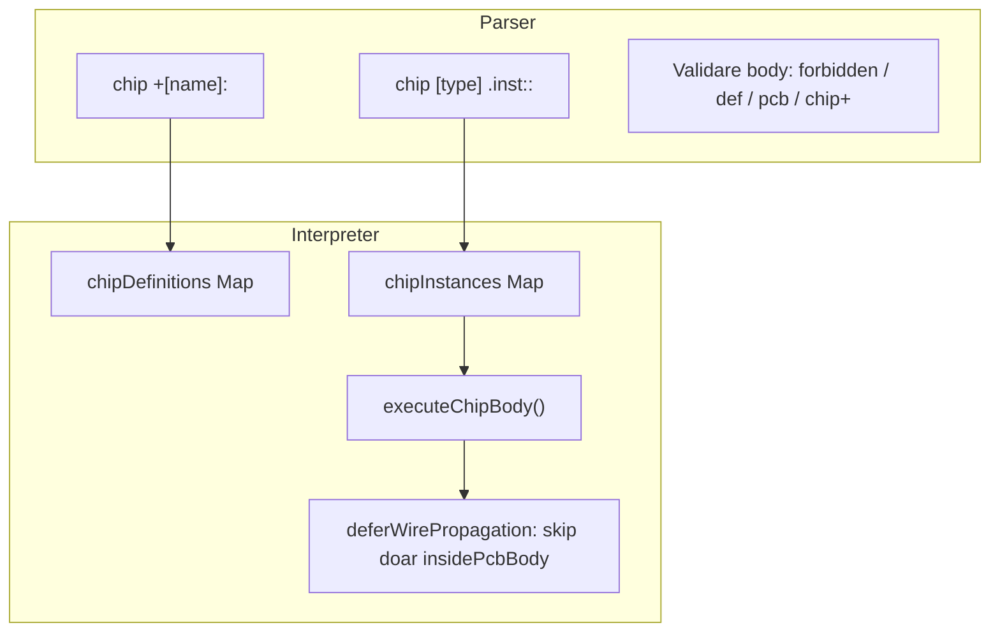
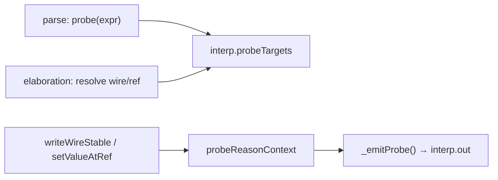

# Plan: componentă chip + debug probe

## Context

În v0_3_2, PCB-urile (`pcb +[name]:` / `pcb [type] .inst::`) sunt implementate în [`parser.js`](d:\wamp64\www\logic\library\logTscript\v0_3_2\core\parser.js) și [`interpreter.js`](d:\wamp64\www\logic\library\logTscript\v0_3_2\core\interpreter.js). Corpul PCB este **forțat legacy** prin `insidePcbBody`:

```60:63:d:\wamp64\www\logic\library\logTscript\v0_3_2\core\interpreter.js
  deferWirePropagation() {
    return !!(this.signalPropagationStrategy
      && this.signalPropagationStrategy.deferWireWrites
      && !this.insidePcbBody);
```

`show` depinde de poziție și de strategie (defer pe wave); `probe` va fi hook-based la commit.

**Decizii confirmate:**
- Componente interzise în chip: switch, key, dip, rotary, osc, led, 7seg, 14seg, lcd, dots, ledBar
- Imbricare: chip poate conține comp logice + **instanțe** de chip deja definite; **fără pcb** în chip
- **Definire chip (`chip +[name]:`) doar la top-level** — interzisă în body-ul oricărui chip; în body se permite doar `chip [type] .inst::`
- Chip păstrează `exec:`, `on:`, `:Nbit return` ca PCB
- Probe: 3 motive — `initialised`, `changed`, `edge committed`

---

## Partea 1 — Componenta `chip`

### Sintaxă (paralelă cu pcb)

```text
chip +[alu]:
  4pin a
  4pin b
  1pin set
  4pout sum
  exec: set
  on: 1
  comp [adder] .add:
    depth: 4
    on: 1
    :
  .add:a = a
  .add:b = b
  sum = .add:get
  :4bit sum

chip [alu] .u1::

.u1:{ a = 0101; b = 0011; set = 1 }
4wire r = .u1:sum
```

**Imbricare chip — permis vs interzis:**

```text
# EROARE — definire tip nou în body chip
chip +[alu]:
  body1
  chip +[logics]:
    body2
  :
  :4bit sum

# OK — instanțiere tip chip deja definit (logics definit la top-level)
chip +[logics]:
  ...
  :4bit out

chip +[alu]:
  body1
  chip [logics] .interLogic::
  sum = .interLogic:out
  :4bit sum
```

Diferențe față de pcb:
- **Fără** `~~` / secțiune NEXT
- **Fără** `def` în body
- **Fără** componente din lista interzisă
- **Fără** `pcb [x] .inst::` în body
- **Fără** `chip +[name]:` în body (definire tip nou doar top-level)
- **Cu** `chip [type] .inst::` în body (instanțiere tip existent)
- Body respectă strategia globală wave/legacy (nu `insidePcbBody`)

### Arhitectură



### 1.1 Tokenizer + Parser

Fișiere: [`tokenizer.js`](d:\wamp64\www\logic\library\logTscript\v0_3_2\core\tokenizer.js), [`parser.js`](d:\wamp64\www\logic\library\logTscript\v0_3_2\core\parser.js)

- Keyword `chip`
- `Parser.chips = new Map()` (sau map unificat `composites` cu `kind: 'pcb'|'chip'`)
- `parseChipDefinition()` — apelabil **doar la top-level** (în `parse()`, nu din `stmt()` când `insideChipDefinition`)
- `parseChipDefinition()` — copie din `parsePcbDefinition()` minus:
  - parsare `~~`
  - `nextSection`
- `parseChipInstance()` — analog `parsePcbInstance()` → `{ chipInstance: { chipName, instanceName } }`; permis și în body chip
- **Routing parser** (ca la pcb):
  - `chip +[name]:` → `parseChipDefinition()` doar dacă `!parsingChipBody`
  - în body chip, `chip +[...]` → **eroare parse** cu mesaj explicit
  - `chip [type] .inst::` → `parseChipInstance()` mereu permis (dacă tipul există)
- Flag parser: `parsingChipBody` (sau depth counter) setat în timpul `parseChipDefinition()`
- **Validare la parse** (funcție `validateChipBodyStatement(stmt)`):
  - respinge `def`
  - respinge `pcbInstance`
  - respinge `chipDefinition` (sau detectat prin routing de mai sus)
  - respinge `comp` cu tip în `CHIP_FORBIDDEN_TYPES`
  - permite `chipInstance` (instanțiere tip existent)
- Nume chip rezervat: verificare `getReservedNames()` + `chip` ca keyword

Lista constantă:

```javascript
const CHIP_FORBIDDEN_TYPES = [
  'switch', 'key', 'dip', 'rotary', 'osc',
  'led', '7seg', '14seg', 'lcd', 'dots', 'ledBar'
];
```

### 1.2 Interpreter — refactor minim comun cu PCB

Fișier: [`interpreter.js`](d:\wamp64\www\logic\library\logTscript\v0_3_2\core\interpreter.js)

Extragem logică comună din `execPcbInstance` / `executePcbBody` / `executePcbPropertyBlock` / `reEvalWiresDependingOnPcb`:

| Funcție comună | Parametru diferențiator |
|----------------|-------------------------|
| `execCompositeInstance(kind, inst)` | `'pcb'` vs `'chip'` |
| `executeCompositeBody(instanceName, statements, kind)` | flag propagare |
| `executeCompositePropertyBlock(...)` | shared |
| `reEvalWiresDependingOnComposite(...)` | shared |

**Flag-uri noi:**
- `insideChipBody` (sau `compositeKind: null | 'pcb' | 'chip'`)
- `chipDefinitions`, `chipInstances` (sau map unificat)

**Diferența critică în `executeChipBody`:**
- **NU** setează `insidePcbBody = true`
- Setează `insideChipBody = true` / `currentChipInstance`
- `trackWireStatement()` — include fire din chip body (spre deosebire de pcb)
- La final, înainte de restore context:
  - dacă wave: `signalPropagationStrategy.propagate()`
  - apoi copiere pout-uri / returnValue (ca pcb)

**`deferWirePropagation()`** — rămâne `!insidePcbBody` (chip nu e exclus).

### 1.3 Propagare wave în body chip

Fișiere: [`interpreter.js`](d:\wamp64\www\logic\library\logTscript\v0_3_2\core\interpreter.js), [`signal-propagation.js`](d:\wamp64\www\logic\library\logTscript\v0_3_2\core\signal-propagation.js)

Pași:
1. În `executeChipBody`, push/pop temporar pe `wireStatements` pentru statements din body (scoped index)
2. `buildWireDependentsIndex` sau rebuild parțial la intrare/ieșire din chip body
3. `postExecBody()` — dacă wave, propagare înainte de restaurare
4. Granița chip↔exterior: reutilizăm `publishWireValue` / `reEvalWiresDependingOnComposite` (audit ca în planul wave P3.2 pentru pcb)

### 1.4 Acces instanță + property blocks

Reutilizăm pattern-ul pcb existent:
- `.u1:sum`, `.u1` (returnSpec), property blocks `.u1:{ set=1 ... }`
- `evalGetProperty`, `watch` — extindere pentru chip
- `internalComponentName` pe instanță (ca pcb) — necesar pentru `doc(.inst.sub)`

### 1.5 `doc(chip)` — documentație tipuri și instanțe

Model de referință existent în [`interpreter.js`](d:\wamp64\www\logic\library\logTscript\v0_3_2\core\interpreter.js): `getDocLines`, `formatPcbDef`, handler `exec` pentru `s.doc` (rezolvare `.inst` → `pcb.type`, sub-componente interne).

#### Variante suportate

| Apel | Rol | Analog |
|------|-----|--------|
| `doc(chip)` | Listează tipurile chip definite + instanțele utilizator | `doc(pcb)` |
| `doc(chip.alu)` | Afișează semnătura tipului `alu` (pin/pout/exec/on/return, sub-componente) | `doc(pcb.bcd)` |
| `doc(.u1)` | Afișează definiția tipului chip al instanței `.u1` | `doc(.instPcb)` |
| `doc(.u1.add)` | Afișează doc componentă internă `.add` din instanța chip | `doc(.instPcb.ram)` |

#### Exemple output așteptat

**`doc(chip)`** (după definire `chip +[alu]:` și instanțiere `chip [alu] .u1::`):

```text
chip.alu
chip.logics

User defined chip:
.u1 (chip.alu)
```

**`doc(chip.alu)`** sau **`doc(.u1)`** (instanță existentă):

```text
chip [alu] .name:
  exec: set
  on: raise/edge/1/0
  :{
    4pin a
    4pin b
    4pout sum
    1pin set
  }
  -> 4bit

Sub components:
 .add (comp.adder)
 .interLogic (chip.logics)
```

**`doc(.u1.add)`**:

```text
comp [adder] .add:
  depth: integer
  = Xbit
  :{
    1pin set
    Xpin a
    Xpin b
    Xpout get
    1pout carry
  }
  -> Xbit
```

**Tip nedefinit:** `doc(chip.xyz)` → `chip.xyz: tip chip nedefinit`

#### Implementare

**Parser** ([`parser.js`](d:\wamp64\www\logic\library\logTscript\v0_3_2\core\parser.js)):
- `chip` ca keyword valid în `doc()` (deja funcționează pattern-ul `name.name` pentru `doc(chip.alu)`)
- `doc(.u1)` / `doc(.u1.add)` — același mecanism ca pcb: parser produce `._u1_add` → restaurat la alias în exec

**Interpreter — `exec` handler `s.doc`** (l.1667+):
- După lookup `this.components`, adaugă lookup `this.chipInstances.get(name)`:
  - `alias = name` (ex. `.u1`)
  - `name = 'chip.' + chip.chipName`
- Construiește `chipInstNames` (Map instanță → tip) paralel cu `pcbInstNames`
- Pasează la `getDocLines`: `chipDefinitions`, `chipInstNames`, `chipCompNames` (= `chip.internalComponentName` când e cazul)

**`Interpreter.getDocLines`** — secțiuni noi:

```javascript
// doc(chip) — listă tipuri + instanțe
if (name === 'chip') { ... }

// doc(chip.type)
if (name.startsWith('chip.')) {
  return Interpreter.formatChipDef(alias, chipName, def, chipCompNames);
}
```

**`Interpreter.formatChipDef`** — ca `formatPcbDef`, dar:
- prefix `chip [name] ${alias}:`
- fără mențiune `~~`
- sub-componente: atât `comp.*` cât și `chip.*` în secțiunea „Sub components”

**`executeChipBody`** — populare `instance.internalComponentName` (identic pcb: map `.subName` → tip `comp` sau `chip`)

#### Fișiere documentație + exemple Load & Run

Sursa markdown: [`doc/doc-function.md`](d:\wamp64\www\logic\library\logTscript\v0_3_2\doc\doc-function.md) — secțiune nouă **„Chip components (chip)”** (după secțiunea PCB), cu toate cele 4 variante `doc`.

**Exemple rulabile în HTML** — blocuri fenced cu clasă specială (detectate de [`doc-viewer.js`](d:\wamp64\www\logic\library\logTscript\v0_3_2\ui\doc-viewer.js) → butoane **Load** / **Load & Run**):

````markdown
```logts-play
chip +[halfAdd]:
  4pin a
  4pin b
  1pin set
  4pout sum
  1pout carry
  exec: set
  on: 1
  comp [adder] .add:
    depth: 4
    on: 1
    :
  .add:a = a
  .add:b = b
  sum = .add:get
  carry = .add:carry
  :4bit sum

chip [halfAdd] .u1::
doc(chip)
doc(chip.halfAdd)
```
````

Pentru scenarii wave (body chip urmează strategia globală):

````markdown
```logts-play wave
chip +[mux2]:
  ...
chip [mux2] .u1::
.u1:{ sel = 1; set = 1 }
4wire q = .u1:out
show(q)
```
````

- `logts-play` — propagare legacy (default test_session)
- `logts-play wave` — badge wave + tab editor pe wave la Load & Run

**Regenerare bundle** (obligatoriu după editare `.md`):

```bash
node v0_3_2/_gen_doc_data.js
```

Produce [`ui/doc-data.js`](d:\wamp64\www\logic\library\logTscript\v0_3_2\ui\doc-data.js) folosit de viewerul HTML.

Alte doc:
- [`signal-propagation.md`](d:\wamp64\www\logic\library\logTscript\v0_3_2\doc\signal-propagation.md) — notă chip body urmează strategia globală (eventual exemplu `logts-play wave`)

### 1.6 Teste automate (`run_tests` / `test_session`)

**Locație teste — DOAR:**
- [`test_suite_ported.js`](d:\wamp64\www\logic\library\logTscript\v0_3_2\test_suite_ported.js) — `reg(id, group, title, fn, opts?)` via `test_session`
- [`test_manifest.js`](d:\wamp64\www\logic\library\logTscript\v0_3_2\test_manifest.js) — înregistrare ID-uri + grup `chip`

**NU adăuga teste în [`test_repeat.js`](d:\wamp64\www\logic\library\logTscript\v0_3_2\test_repeat.js).**

**`test_session.js`** — extinde `run()` / `runDoc()` să paseze `p.chips` la `Interpreter` (paralel `p.pcbs`).

#### Pattern legacy + wave (ca PCB 500–531)

Helper reutilizabil (analog `regPcbWave`):

```javascript
function regChipWave(id, title, run) {
  reg(id, 'chip', title + ' (wave)', run, { propagation: 'wave' });
}
// legacy: reg(540, 'chip', '...', fn);
// wave:   regChipWave(556, '...', fn); // același fn
```

Grup nou manifest: `chip`, range **540–571** (sau similar).

| ID legacy | ID wave | Scenariu |
|-----------|---------|----------|
| 540 | 556 | parse + instanțiere chip, acces pout/return |
| 541 | 557 | `chip +[inner]` în body → eroare parse |
| 542 | 558 | `chip [logics] .inter::` în body (tip top-level) |
| 543 | 559 | forbidden: `comp [switch]` / `def` / `pcb [...]` |
| 544 | 560 | exec/on re-exec property block |
| 545 | 561 | body combinational (fire interne) |
| 546 | 562 | instanță chip imbricată propagă output |
| … | … | (extins după nevoie) |

#### Teste `doc(chip)` — grup `doc-comp`, ID **428+**

| ID | Scenariu |
|----|----------|
| 428 | `doc(chip)` listează `chip.halfAdd` |
| 429 | `doc(chip.halfAdd)` prima linie + pin/pout |
| 430 | `doc(chip.halfAdd)` sub-componente |
| 431 | `doc(chip.xyz)` tip nedefinit |
| 432 | `doc(.u1)` după instanțiere (echivalent tip) |
| 433 | `doc(.u1.add)` componentă internă |

Toate via `session.runDoc(src)` — fără `test_repeat`.

---

## Partea 2 — Funcția `probe`

### Comportament dorit

```text
a := 0
a = AND(b, 1)
probe(a)
# a = 0 (&1) - initialised
# a = 1 (&1) - changed
# a = 0 (&1) - changed
# a = 1 (&1) - edge committed
```

- **Independent de poziție**: nu folosește `deferShow`; înregistrare la elaborare, emitere la hook-uri de commit
- **Un singur argument**: `probe(wireName)` sau `probe(&3)` / `probe(&3.0)`
- **Multiple probe**: `probe(a)` + `probe(b)` → ambele active
- **Format**: `# {name} = {value} ({ref}) - {reason}` în `interp.out`

### Arhitectură probe



### 2.1 Parser

- Keyword `probe` în tokenizer
- `probe(expr)` → `{ probe: expr }` (un singur argument)
- Acceptă: identificator wire, `&N`, `&N.bit`, `&N.start-end`

### 2.2 Registru + elaborare

În interpreter:

```javascript
this.probeTargets = []; // { kind:'wire'|'ref', key, label, ref, seen: false }
this.probeReasonContext = 'normal'; // 'initialising' | 'edge_block' | 'normal'
```

**Înregistrare la elaborare** (nu la exec secvențial):
- La `postExecSrc` / `initializeFromElaboration`: scan toate statements (inclusiv în chip body) pentru `{ probe }`
- Rezolvă argumentul la wire name sau storage ref
- Deduplicare: același wire/ref → o singură intrare

Motiv: `probe(a)` declarat după `a:=0` tot vede `initialised` la prima valoare comisă în sesiune.

### 2.3 Clasificare motive (3 categorii)

| Motiv | Când |
|-------|------|
| `initialised` | Prima emitere pentru target (flag `seen === false`) |
| `edge committed` | Commit în timp ce `probeReasonContext === 'edge_block'` |
| `changed` | Orice alt commit cu valoare diferită de ultima emisă |

**Detectare `edge_block`:**
- În `executePropertyBlock` / `updateConnectedComponents`, când `shouldExecute === true` pentru `on: raise|edge|rising|falling` (nu `on:1` level) → setează `probeReasonContext = 'edge_block'` pe durata execuției blocului + propagare imediată din bloc
- Similar pentru exec chip/pcb property block declanșat de edge
- Restaurează context la ieșire

**`initialising`**: setat în `initializeFromElaboration` / primul `_recomputeAllWires` până la primul `_finishPropagate`

### 2.4 Hook-uri emitere

Fișiere: [`interpreter.js`](d:\wamp64\www\logic\library\logTscript\v0_3_2\core\interpreter.js), [`signal-propagation.js`](d:\wamp64\www\logic\library\logTscript\v0_3_2\core\signal-propagation.js)

| Hook | Target |
|------|--------|
| `writeWireStable(name, value)` | `probe(wireName)` |
| `setValueAtRef(ref, value)` | `probe(&N)` |
| `commitPendingWires()` | backup pentru wave (dacă writeWireStable nu acoperă tot) |

`_emitProbe(target, value, reason)`:
- skip dacă valoarea == ultima emisă
- formatare reutilizând `formatValue` / ref din `_execShowImmediate`
- `this.out.push('# ...')`

**Nu** folosi `enqueueShow` / `flushDeferredShows`.

### 2.5 UI

[`app.js`](d:\wamp64\www\logic\library\logTscript\v0_3_2\ui\app.js): `render(globalInterp.out)` afișează deja liniile `# ...` din output. Opțional stil distinct pentru probe (clasă CSS, ex. `.output-line--probe`).

### 2.6 Documentație `probe` + exemple Load & Run

#### Fișiere

| Fișier | Conținut |
|--------|----------|
| [`doc/doc-function.md`](d:\wamp64\www\logic\library\logTscript\v0_3_2\doc\doc-function.md) | Secțiune principală **„Debug: probe”** — sintaxă, argumente, format output, cele 3 motive |
| [`doc/signal-propagation.md`](d:\wamp64\www\logic\library\logTscript\v0_3_2\doc\signal-propagation.md) | Subsecțiune **„probe vs show vs peek”** — când se emite, independență de poziție, wave vs legacy |
| `node v0_3_2/_gen_doc_data.js` | Regenerare [`ui/doc-data.js`](d:\wamp64\www\logic\library\logTscript\v0_3_2\ui\doc-data.js) după editare |

#### Structură doc-function.md (referință keyword)

- **Ce face** — monitorizează un wire sau o adresă storage; la fiecare **commit** de valoare scrie în panoul Output (nu depinde de poziția în script, spre deosebire de `show`)
- **Sintaxă** — `probe(expr)` — un singur argument: nume wire, `&N`, `&N.bit`, `&N.start-end`
- **Format linie** — `# name = value (ref) - reason`
- **Motive (`reason`)** — `initialised` | `changed` | `edge committed` (tabel scurt)
- **Comparație** cu `show` / `peek` (link la signal-propagation.md)

#### Exemple rulabile (`logts-play`)

**1. Wire simplu — initialised + changed (legacy):**

````markdown
```logts-play
1wire b = 0
1wire a := 0
a = AND(b, 1)
probe(a)

b = 1
```
````

Output așteptat în panou (după RUN + schimbare `b`):

```text
# a = 0 (&…) - initialised
# a = 1 (&…) - changed
```

**2. Același exemplu pe wave:**

````markdown
```logts-play wave
1wire b = 0
1wire a := 0
a = AND(b, 1)
probe(a)

b = 1
```
````

**3. Probe pe adresă storage (`probe(&ref)`):**

````markdown
```logts-play
4wire x := 0000
probe(&1)
x = 1010
```
````

(`&1` = ref-ul alocat la `x`; în doc explicăm că ref-ul apare și la `show`)

**4. Probe multiplu + placement independent:**

````markdown
```logts-play
1wire a = 0
1wire b = 1
1wire c = AND(a, b)
probe(a)
probe(b)
a = 1
```
````

**5. Edge committed — property block `on: raise`:**

````markdown
```logts-play
comp [mem] .m:
  depth: 4
  length: 4
  on: raise
  :

4wire data = 1010
1wire clk = 0
1wire q = .m:get
probe(q)

.m:{ data = data; set = clk }
clk = 1
clk = 0
```
````

După front `clk` 1→0, linie `# q = … - edge committed` (dacă `q` se modifică în timpul execuției blocului edge-triggered).

**Notă pentru autor doc:** exemplele 1–4 trebuie să fie **self-contained** (rulabile cu Load & Run fără componente UI externe, exceptând 5 care folosește `mem` fără switch).

#### Actualizare signal-propagation.md

Extinde tabelul existent `show` vs `peek`:

| | `show` | `peek` | `probe` |
|---|--------|--------|---------|
| Când emite | La RUN/NEXT (după settle pe wave) | Imediat la poziția din script | La fiecare commit de valoare |
| Poziție în script | Contează | Contează | **Nu contează** (înregistrare la elaborare) |
| Format | `name (type) = value` | la fel | `# name = value (ref) - reason` |

### 2.7 Teste probe (`test_suite_ported.js` + `test_manifest.js`, NU `test_repeat`)

Grup nou `probe`, ID **800+** (legacy default + perechi wave cu `{ propagation: 'wave' }`):

| Scenariu | Verificare |
|----------|------------|
| probe wire init | `initialised` la prima valoare |
| probe wire changes | `changed` la propagare |
| probe edge block | `edge committed` când `on:raise` declanșează bloc |
| probe ref | `probe(&3)` la `setValueAtRef` |
| probe placement | aceeași ieșire indiferent unde e `probe()` în sursă |
| probe multi | `probe(a)` + `probe(b)` independente |
| probe wave + legacy | ambele mode (duplicate ca PCB) |

---

## Ordine implementare recomandată

1. **Probe** (izolat, fără dependențe chip) — implementare + doc `probe` cu `logts-play` + `_gen_doc_data.js`
2. **Parser chip** + validări
3. **Interpreter chip** — instanțiere + body legacy
4. **Wave în chip body** — scoped wireStatements + propagate
5. **doc(chip)** în `doc-function.md` + `_gen_doc_data.js` + teste `test_suite_ported` / `test_manifest`

## Riscuri

| Risc | Mitigare |
|------|----------|
| Duplicare cod pcb/chip | Refactor `executeCompositeBody` cu parametru `kind` |
| Wave în chip body complex | Teste incrementale legacy apoi wave; scoped index |
| `edge committed` fals pozitiv pe `on:1` | Clasificare doar pentru raise/edge/rising/falling |
| Probe spam în propagare | Dedup valoare; emit doar la commit nu schedule |

## Fișiere principale de modificat

- [`v0_3_2/core/tokenizer.js`](d:\wamp64\www\logic\library\logTscript\v0_3_2\core\tokenizer.js)
- [`v0_3_2/core/parser.js`](d:\wamp64\www\logic\library\logTscript\v0_3_2\core\parser.js)
- [`v0_3_2/core/interpreter.js`](d:\wamp64\www\logic\library\logTscript\v0_3_2\core\interpreter.js)
- [`v0_3_2/core/signal-propagation.js`](d:\wamp64\www\logic\library\logTscript\v0_3_2\core\signal-propagation.js)
- [`v0_3_2/ui/app.js`](d:\wamp64\www\logic\library\logTscript\v0_3_2\ui\app.js) (minor)
- [`v0_3_2/test_suite_ported.js`](d:\wamp64\www\logic\library\logTscript\v0_3_2\test_suite_ported.js) — teste chip/probe/doc (NU test_repeat)
- [`v0_3_2/test_manifest.js`](d:\wamp64\www\logic\library\logTscript\v0_3_2\test_manifest.js) — grupuri `chip`, `probe`
- [`v0_3_2/test_session.js`](d:\wamp64\www\logic\library\logTscript\v0_3_2\test_session.js) — `p.chips`
- Documentație: `doc/doc-function.md` (chip + probe), `doc/signal-propagation.md` (probe vs show/peek) → `node _gen_doc_data.js` → `ui/doc-data.js`
