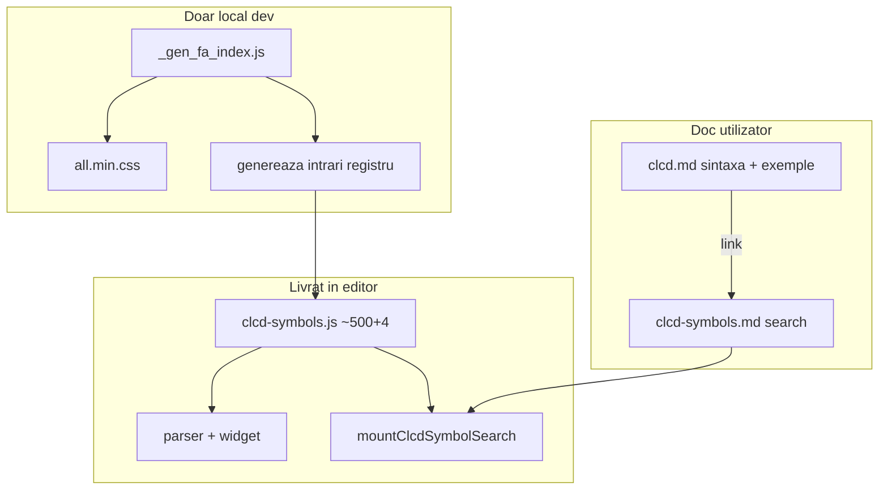

# CLCD: galerie doc + `style` per simbol FA

## Confirmări

- Galerie doc + registru unic — aprobat.
- **`digit7`, `digit14`, `dp`, `colon`** — canvas, **neschimbate**; `style` interzis (eroare la parse).
- **`style: 1 | 2 | 3` only** — nu documentăm și nu acceptăm `style: 4` (Light/Duotone = Pro, absent din bundle).
- **`allowedStyles` — NU** în registru; vezi secțiunea de mai jos.

---

## Stiluri FA în bundle-ul Free 5.15.4

| `style` | Familie | CSS | Font | Greutate |
|---------|---------|-----|------|----------|
| **1** | Solid (implicit) | `fas` | Font Awesome 5 Free | 900 |
| **2** | Regular | `far` | Font Awesome 5 Free | 400 |
| **3** | Brands | `fab` | Font Awesome 5 Brands | 400 |

---

## Există iconițe fără anumite stiluri? — Da

În **FA Free**, seturile **nu sunt identice**:

| Caz | Exemplu | Ce înseamnă |
|-----|---------|-------------|
| **Brands only** | `bluetooth`, `usb` | Glyph doar în familia Brands → practic doar `style: 3` |
| **Solid only** | multe iconițe tehnice (`antenna`, `ethernet`, …) | Există în Solid; **nu** toate au variantă Regular în Free |
| **Solid + Regular** | `bell`, `heart`, `wifi`, `power` | Același nume, contur (2) vs plin (1) |

Deci validarea „poate folosi style 2?” **nu e aceeași pentru toate simbolurile**.

### De ce NU avem nevoie de `allowedStyles[]`

Suficient să păstrăm în registru doar glyph-urile **reale**:

```javascript
{
  name: 'wifi',
  kind: 'fa',
  defaultStyle: 1,
  glyphs: { 1: '\uf1eb', 2: '\uf1eb' }
}
{
  name: 'bluetooth',
  kind: 'fa',
  defaultStyle: 3,
  glyphs: { 3: '\uf293' }
}
{
  name: 'antenna',
  kind: 'fa',
  defaultStyle: 1,
  glyphs: { 1: '\uf519' }   // fără 2 — regular nu e în catalog
}
```

**Reguli:**
- `style` omis → `defaultStyle`
- `style: N` la parse/draw → **eroare** dacă `glyphs[N]` lipsește
- `allowedStyles` = redundant cu `Object.keys(glyphs)` — nu îl duplicăm

La **simboluri noi**, autorul registru verifică în FA cheatsheet ce variante există și completează doar cheile `1` / `2` / `3` aplicabile.

---

## Sintaxă

```logts
wifi:
  x: 10
  y: 10
  bit: 0
  style: 2
```

`digit7` / `digit14` / `dp` / `colon` — fără `style`.

---

## Registru [`clcd-symbols.js`](v0_3_2/devices/clcd-symbols.js)

```javascript
{ name: 'digit7', kind: 'canvas', renderer: 'digit7' }
```

Refactor: [`clcd.js`](v0_3_2/core/components/clcd.js), [`clcd-widget.js`](v0_3_2/devices/clcd-widget.js) citesc din registru.

`_drawFaIcon`: `resolveStyle(sym)` → `{ glyph, fontFamily, weight }` din `glyphs[sym.style || defaultStyle]`.

---

## Parser

[`parseClcdSymbolsRaw`](v0_3_2/core/parser.js): `style:` integer **1, 2 sau 3**; validează `glyphs[style]`; respinge pe `kind: 'canvas'`.

---

## Documentație — catalog simboluri CLCD (abordare finală)

### Răspuns scurt: da, `clcd-symbols.md` cu search are sens

Cu **~500 simboluri** în registru, un tabel static în markdown e inutil de mare; **search + autocomplete pe catalogul CLCD** e exact ce trebuie. Documentația rămâne despre **CLCD**, nu despre Font Awesome ca produs.

| Ce | Rol |
|----|-----|
| [`clcd-symbols.js`](v0_3_2/devices/clcd-symbols.js) | **Sursă unică de adevăr** — runtime, parse, search doc (~500 FA + 4 canvas) |
| [`_gen_fa_index.js`](v0_3_2/_gen_fa_index.js) | **Doar workflow local** — extrage nume + unicode din `all.min.css` când extinzi registrul; **nu** se încarcă în editor, **nu** apare în doc |
| [`clcd-symbols.md`](v0_3_2/doc/clcd-symbols.md) | Pagină doc: search pe **catalog CLCD** + preview stiluri |
| [`clcd.md`](v0_3_2/doc/clcd.md) | Doc componentă: sintaxă, `style`, exemple `logts-play`, **link** la catalog |

**`_gen_doc_data.js`**: doar bundle markdown → `DOC_CONTENT`. **UI-ul** (search, preview) = **`doc-viewer.js`**, nu `marked.parse()` la build.

---

### Faza 1 — Extindere registru (~500 iconițe)

Înainte de search doc, extindem registrul de la ~30 la **~500 iconițe FA Free** utile pentru diagrame logice / UI / status / hardware, fiecare cu **toate stilurile reale** (`glyphs: { 1 }`, `{ 1, 2 }`, sau `{ 3 }` pentru brands).

**Categorii curate** (selecție la implementare, ~500 total):

- Status: `check`, `times`, `exclamation`, `question`, `info`, `bell`, `flag`, …
- Alimentare / energie: `bolt`, `battery-*`, `plug`, `power-off`, …
- Conectivitate: `wifi`, `ethernet`, `bluetooth`, `usb`, `satellite`, `broadcast-tower`, …
- Media / control: `play`, `pause`, `stop`, `volume-*`, `microphone`, …
- Săgeți / direcție: `arrow-*`, `chevron-*`, `caret-*`, `long-arrow-*`, …
- Fișiere / date: `file`, `folder`, `save`, `download`, `upload`, `database`, …
- Unelte / setări: `cog`, `wrench`, `sliders-h`, `filter`, `search`, …
- Hardware / embedded: `microchip`, `memory`, `hdd`, `server`, `desktop`, `mobile`, …
- Timp: `clock`, `hourglass`, `calendar`, `stopwatch`, …
- Brands relevante (style 3): `usb`, `bluetooth`, `apple`, `android`, `raspberry-pi`, …

**Workflow generare:**

1. Rulezi local `node _gen_fa_index.js` → JSON/JS cu toate iconițele FA din bundle
2. Script auxiliar (sau manual filtrat) produce intrări pentru `clcd-symbols.js` din lista curată
3. Păstrăm simbolurile **canvas** existente (`digit7`, `digit14`, `dp`, `colon`) — `kind: 'canvas'`, fără `style`

`CLCD_KNOWN_SYMBOLS` din [`clcd.js`](v0_3_2/core/components/clcd.js) devine derivat din registru (lista de nume).

---

### Faza 2 — [`clcd-symbols.md`](v0_3_2/doc/clcd-symbols.md)

Conținut minimal (fence gol, ca la `logts-play`):

    # CLCD — Symbol catalog
    …
    (fence deschis) clcd-symbol-gallery
    (fence închis)

În [`doc-index.json`](v0_3_2/doc/doc-index.json): sub **Displays**, după `clcd.md`.

### Hook în markdown — recomandat: fenced block (nu comentariu HTML)

| Variantă | Verdict |
|----------|---------|
| `<!-- clcd-symbol-gallery -->` | **Evitat** — comentariile HTML nu au selector DOM stabil după `innerHTML`; uneori necesită replace în string înainte de parse |
| `<div data-clcd-symbol-gallery></div>` | OK — marked (GFM) păstrează HTML raw; `querySelector('[data-clcd-symbol-gallery]')` |
| **`` ```clcd-symbol-gallery ``** | **Recomandat** — același pattern ca `` ```logts-play `` în doc |

**De ce fenced block:**

- Deja folosit în doc: `enhancePlayBlocks()` caută `pre > code[class*="logts-play"]` după `marked.parse()`
- `enhanceClcdSymbolGallery(container)` analog: `pre > code[class*="clcd-symbol-gallery"]` → înlocuiește `pre` cu host-ul search
- Corp gol — zero conținut de întreținut în markdown
- Vizibil în sursă ca „componentă doc”, nu magic comment ascuns

```javascript
// doc-viewer.js — după marked.parse(), alături de enhancePlayBlocks
function enhanceClcdSymbolGallery(container) {
  container.querySelectorAll('pre > code[class*="clcd-symbol-gallery"]').forEach(function (codeEl) {
    const pre = codeEl.parentElement;
    if (!pre) return;
    const host = document.createElement('div');
    host.className = 'clcd-symbol-gallery-host';
    pre.replaceWith(host);
    mountClcdSymbolSearch(host);
  });
}
```

În `loadDoc()`: `enhancePlayBlocks(el); enhanceClcdSymbolGallery(el);`

**Fără** replace pe string markdown înainte de parse — totul post-parse, ca la play blocks.

### UI search (catalog CLCD)

Pattern reutilizat din doc search (`renderDocSearchMenu`):

```
┌─────────────────────────────────────┐
│  Caută simbol (wifi, battery, …)    │  autocomplete max ~15
└─────────────────────────────────────┘
┌──────────┬──────────┬──────────┐
│  [icon]  │  [icon]  │  [icon]  │  preview: 1 celulă per style din glyphs
│  style 1 │  style 2 │  style 3 │
└──────────┴──────────┴──────────┘
Exemplu sintaxă:
  wifi:
    x: 10
    y: 10
    bit: 0
    style: 2
```

- Filtrare pe `name` (prefix + conține)
- La select: grid mic cu toate stilurile din `glyphs` + snippet logts copiabil
- Secțiune fixă jos: cele 4 simboluri **canvas** (preview desenat, nu FA)
- **Fără** listă completă la load — doar rezultatul căutării + canvas fix

---

### [`clcd.md`](v0_3_2/doc/clcd.md)

- Tabel `style: 1|2|3` + note brands / solid-only
- Link: „Symbol catalog → clcd-symbols.md”
- Exemple `logts-play` (Load & Run în Devices)
- **Fără** grid cu sute de iconițe; **fără** referințe la FA ca catalog general



---

## Galerie doc (implementare — vechi, înlocuit)

## Teste (1383+)

- `wifi` + `style: 2` — OK
- `bluetooth` + `style: 1` — eroare (lipsește `glyphs[1]`)
- `digit7` + `style: 1` — eroare
- `style: 4` — eroare (valoare invalidă)

---

## Efort ~3–4 zile (expansiune ~500 simboluri + style + search doc + teste smoke)
