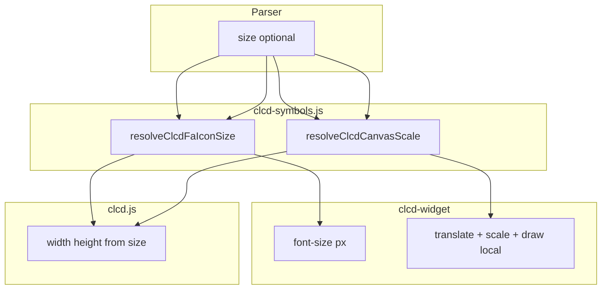

# CLCD: `size` pentru iconițe FA + simboluri canvas

## Semantică unificată (recomandat)

**`size` = înălțimea nominală a simbolului în pixeli** (colțul `(x, y)` rămâne ancora din stânga-sus).

| `kind` | Simbol | Default `size` | Plajă | Ce se întâmplă |
|--------|--------|----------------|-------|----------------|
| `fa` | `wifi`, `power`, … | **22** | 8–64 | `font-size` = `size` (ca acum la 22px) |
| `canvas` | `digit7`, `digit14` | **44** | 16–120 | Scale uniform `size / 44` pe desenul 28×44 |
| `canvas` | `dp` | **8** | 4–32 | Scale pe punct (bbox nativ ~12×8) |
| `canvas` | `colon` | **32** | 8–96 | Scale pe cele două puncte |
| `text` | `label` | **14** | 6–48 | Font size (neschimbat) |

**De ce așa:** un singur atribut, același nume în script; `size: 30` pe `power` și pe `digit7` înseamnă „vreau ~30px înălțime vizuală”, fără `scale:` separat.

Alternativa respinsă: `scale: 150` (procent) — mai greu de aliniat cu FA/label în px.

## Dimensiuni native (referință scalare canvas)

Din [`clcd-widget.js`](v0_3_2/devices/clcd-widget.js):

| Renderer | Native W×H | Note |
|----------|------------|------|
| `digit7` / `digit14` | 28 × 44 | segmente, grosime 3px |
| `dp` | ~12 × 8 | punct la (x+4, y+28), r=4 |
| `colon` | ~8 × 32 | puncte la y+10, y+22, r=3 |

```javascript
// clcd-symbols.js (sau clcd.js)
var CLCD_CANVAS_NATIVE = {
  digit7:  { w: 28, h: 44 },
  digit14: { w: 28, h: 44 },
  dp:      { w: 12, h: 8 },
  colon:   { w: 8,  h: 32 },
};

function resolveClcdCanvasScale(sym, renderer) {
  var nat = CLCD_CANVAS_NATIVE[renderer];
  if (!nat) return 1;
  var targetH = (sym && sym.size !== undefined) ? sym.size : nat.h;
  return targetH / nat.h;
}
```

## Desen canvas (widget)

Pattern pentru fiecare simbol canvas:

```javascript
const scale = resolveClcdCanvasScale(sym, sym.name);
ctx.save();
ctx.translate(sym.x, sym.y);
ctx.scale(scale, scale);
this._drawDigit7(ctx, 0, 0, segBits, fg, bg, 7);  // coordonate locale
ctx.restore();
```

Refactor necesar:
- **`dp` / `colon`**: desen la coordonate **relative (0,0)** (mută offset-urile +4/+28 etc. în funcția locală)
- **`digit7`**: deja parametrizat pe `x,y` — apelează cu `0,0` în spațiul scalat

FA rămâne fără `ctx.scale` — direct `font-size: size`.

## Touch hit-box

[`defaultTouchSize`](v0_3_2/core/components/clcd.js) primește `sym` (nu doar nume):

```javascript
if (symDef.kind === 'canvas') {
  const nat = CLCD_CANVAS_NATIVE[symName];
  const scale = resolveClcdCanvasScale(sym, symName);
  return { width: Math.round(nat.w * scale), height: Math.round(nat.h * scale) };
}
if (symDef.kind === 'fa') {
  const sz = resolveClcdFaIconSize(sym);
  return { width: sz, height: sz };
}
```

`width` / `height` explicite pe simbol **suprascriu** în continuare (test 1413).

## Parser — [`parser.js`](v0_3_2/core/parser.js)

- Elimină respingerea globală `size` pe non-text
- După `getClcdSymbolDef`:
  - **`fa`**: `8 <= size <= 64`
  - **`canvas`**: `8 <= size <= 120` (acoperă digit mare; sub 16 pe digit7 opțional warning doc — nu validare strictă per simbol)
  - **`text`**: `6 <= size <= 48`
- Mesaje de eroare distincte per kind

## Registru — [`clcd-symbols.js`](v0_3_2/devices/clcd-symbols.js)

```javascript
var CLCD_FA_ICON_SIZE_DEFAULT = 22;

function resolveClcdFaIconSize(sym) {
  var sz = sym && sym.size;
  return (sz !== undefined && sz !== null) ? sz : CLCD_FA_ICON_SIZE_DEFAULT;
}
```

Adaugă `CLCD_CANVAS_NATIVE` + `resolveClcdCanvasScale` în același fișier (secțiune manuală — **nu** în blocul auto-generat din `_gen_clcd_symbols.js`, sau extinde generatorul cu trailer fix).

## Sintaxă exemple

```logts
digit7:
  x: 10
  y: 10
  bits: 0-6
  size: 60        # digit înalt 60px (default 44)
:

power:
  x: 120
  y: 12
  bit: 0
  size: 30
:
```

## Documentație — [`clcd.md`](v0_3_2/doc/clcd.md)

Tabel `size` în secțiunea simboluri:

- FA: font / înălțime icon ~`size` px, default 22
- Canvas: scalare proporțională la înălțimea țintă, default per simbol (44 / 8 / 32)
- Label: font px, default 14
- Touch: hit box derivat din `size` dacă `width`/`height` lipsesc

## Teste (1549–1558)

| ID | Scop |
|----|------|
| 1549 | parse FA `power` + `size: 30` |
| 1550 | parse canvas `digit7` + `size: 60` |
| 1551 | eroare FA `size: 7`; eroare canvas `size: 4` |
| 1552 | `resolveClcdFaIconSize({})` → 22 |
| 1553 | `resolveClcdCanvasScale({}, 'digit7')` → 1; cu `size: 44` → 1; cu `size: 88` → 2 |
| 1554 | `computeTouchRect` FA `size: 30` → 30×30 |
| 1555 | `computeTouchRect` digit7 `size: 88` → 56×88 (28×2, 44×2) |
| 1556 | eroare `label` + `size: 5` (sub 6) |



## Efort

~1 zi (FA + canvas scale + refactor dp/colon + touch + doc + teste).

## Ce nu intră în scope

- `size` diferit pe lățime vs înălțime (ar necesita `scaleX`/`scaleY` — overkill)
- Preview doc search la dimensiune reală (rămâne mic)
- Modificări în `clcd-symbols.js` registry entries (canvas rămân `kind: 'canvas'`)
