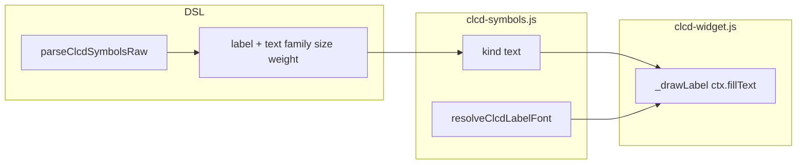

# CLCD: `label` symbol (canvas text)

## Goal

Add static text labels on `comp [clcd]` displays, bit-driven like FA icons: **ON** → `color`, **OFF** → `bgColor` (confirmed).

```logts
comp [clcd] .panel:
  width: 200
  height: 60
  color: ^00ff00
  bgColor: ^001100
  = {
    label:
      x: 10
      y: 8
      bit: 0
      text: "Load"
      family: mono
      size: 14
      weight: bold
    :
    power:
      x: 80
      y: 10
      bit: 0
    :
  }
  :
```

Symbol name is fixed **`label`**. Multiple labels = multiple `label:` entries (same pattern as duplicate `digit7`).

---

## Language conventions

All deliverables for this feature use **English only**:

| Area | Rule |
|------|------|
| **Tests** (`test_suite.js`, `test_manifest.js`) | English `title`, assertion messages, and step labels |
| **Documentation** (`doc/clcd.md`, `doc/clcd-symbols.md`) | English prose and table headers |
| **Code comments** | English in all touched `.js` files |
| **Parse/runtime errors** | English error strings (consistent with existing CLCD errors) |

No Romanian in implementation artifacts.

---

## Proposed syntax

| Field | Required | Symbols | Description |
|-------|----------|---------|-------------|
| `x`, `y` | yes | all | Position (px), `textBaseline: top` |
| `bit` | yes | `label` | Single control bit (no `bits` — text is not segment-encoded) |
| `text` | yes | `label` | Quoted string `"..."` or `'...'` |
| `color`, `bgColor` | no | all | Per-symbol override |
| `family` | no | `label` | Font family — see table |
| `size` | no | `label` | Font size in px (integer) |
| `weight` | no | `label` | Font weight/style — see table |
| `style` | no | FA only | **Forbidden** on `label` |

### `family` (ident enum, default `mono`)

No extra web fonts — system stacks already available in the browser:

| Value | CSS `font-family` |
|-------|-------------------|
| `mono` | `Consolas, "Courier New", monospace` |
| `sans` | `system-ui, -apple-system, Segoe UI, sans-serif` |
| `serif` | `Georgia, "Times New Roman", serif` |

### `size` (integer, default `14`)

- Parse-time range: **6–48** px (suitable for typical CLCD panels 60–200px tall).

### `weight` (ident enum, default `normal`)

| Value | Canvas |
|-------|--------|
| `normal` | 400, normal |
| `bold` | 700, normal |
| `italic` | 400, italic |
| `boldItalic` | 700, italic |

Central mapping in [`clcd-symbols.js`](v0_3_2/devices/clcd-symbols.js): `resolveClcdLabelFont(sym)`.

---

## Design decisions (included)

1. **OFF = `bgColor`** — aligned with icons; text stays visible (useful for dimmed legends).
2. **`bit` only, not `bits`** — labels are not segment-encoded.
3. **Ident enums** (`mono`, `bold`) — more readable than numeric codes.
4. **No `style` on label** — `style` stays FA-only (`1|2|3`).
5. **Draw order** — declaration order in `= { }`; put `label` before icons if icons should paint on top.
6. **No background box in v1** — `fillText` only; optional `bgPad` can come later.
7. **Minimal escape in `text`** — optional `\n` for two lines; raw newline inside string = parse error (same as rest of parser).

---

## Architecture



Key files:

- [`v0_3_2/devices/clcd-symbols.js`](v0_3_2/devices/clcd-symbols.js) + [`_gen_clcd_symbols.js`](v0_3_2/_gen_clcd_symbols.js) — `{ name: 'label', kind: 'text' }` (preserved on FA regeneration)
- [`v0_3_2/core/parser.js`](v0_3_2/core/parser.js) — `readQuotedString()` + new fields + per-`kind` validation
- [`v0_3_2/devices/clcd-widget.js`](v0_3_2/devices/clcd-widget.js) — `kind === 'text'` branch in `draw()`
- [`v0_3_2/doc/clcd.md`](v0_3_2/doc/clcd.md) — `label` section + `logts-play` example (English)
- [`v0_3_2/ui/doc-viewer.js`](v0_3_2/ui/doc-viewer.js) — canvas gallery section: add `label` preview
- [`v0_3_2/test_suite.js`](v0_3_2/test_suite.js) — tests **1399+** (English)

---

## Implementation detail

### 1. Registry

In [`_gen_clcd_symbols.js`](v0_3_2/_gen_clcd_symbols.js), next to `CANVAS_SYMBOLS`:

```javascript
const TEXT_SYMBOLS = [
  { name: 'label', kind: 'text' },
];
// append to CLCD_SYMBOL_REGISTRY after canvas symbols
```

New export:

```javascript
function resolveClcdLabelFont(sym) {
  // family → stack, size default 14, weight → { fontWeight, fontStyle }
  return { fontFamily, fontWeight, fontStyle, fontSize };
}
```

### 2. Parser — [`parseClcdSymbolsRaw`](v0_3_2/core/parser.js)

- Add `readQuotedString()` (simplified copy of string logic ~L1940, no tokenizer).
- New attribute keys:
  - `text` → `readQuotedString()`
  - `family` → `readIdent()` + validate `['mono','sans','serif']`
  - `size` → `readInt()` + range 6–48
  - `weight` → `readIdent()` + validate `['normal','bold','italic','boldItalic']`
- Post-parse, per `symDef.kind`:
  - **`text`**: `text` required; `bit` required; `bits` forbidden; `style` forbidden
  - **`fa` / `canvas`**: `text`, `family`, `size`, `weight` forbidden

### 3. Widget — [`clcd-widget.js`](v0_3_2/devices/clcd-widget.js)

```javascript
} else if (symDef && symDef.kind === 'text') {
  this._drawLabel(ctx, sym, on ? fg : bg);
}
```

`_drawLabel`:

- `const f = resolveClcdLabelFont(sym)`
- `ctx.font = \`${f.fontStyle} ${f.fontWeight} ${f.fontSize}px ${f.fontFamily}\``
- `ctx.fillStyle = color` (ON/OFF already resolved in `draw`)
- `ctx.textBaseline = 'top'`
- `ctx.fillText(sym.text, sym.x, sym.y)` — no `document.fonts.load` (system fonts)

### 4. Core — [`clcd.js`](v0_3_2/core/components/clcd.js)

- Update `initValue` in `getDef()` with label fields: `text`, `family`, `size`, `weight`.
- `resolveSymbols` — pass through text fields unchanged (not colors).

### 5. Documentation (English)

- [`clcd.md`](v0_3_2/doc/clcd.md): label field table, `family` / `weight` tables, interactive example.
- [`clcd-symbols.md`](v0_3_2/doc/clcd-symbols.md): mention in canvas/text section.
- `node _gen_doc_data.js`

### 6. Tests (group `clcd`, id **1399+**, English)

| Id | Title (example) | Checks |
|----|-----------------|--------|
| 1399 | `parse label with text` | `label` + `text: "Load"`, `bit: 0`, `x`/`y` |
| 1400 | `parse label font options` | `family: sans`, `size: 18`, `weight: bold` |
| 1401 | `parse error label missing text` | error when `text` omitted |
| 1402 | `parse error text on fa symbol` | `wifi` + `text: "x"` → error |
| 1403 | `parse error label with bits range` | `label` + `bits: 0-3` → error |
| 1404 | `parse error label with style` | `label` + `style: 1` → error |
| 1405 | `parse error unknown family` | `family: comic` → error |
| 1406 | `registry has label kind text` | `getClcdSymbolDef('label').kind === 'text'` |

Assertion strings in English, e.g. `h.assert('label text', sym.text, 'Load')`.

Run `node _gen_manifest.js` + `node _run_suite_node.js`.

---

## Doc example (`logts-play`)

```logts-play
comp [clcd] .ui:
  width: 220
  height: 50
  color: ^00ff00
  bgColor: ^002200
  = {
    label:
      x: 8
      y: 6
      bit: 0
      text: "Load"
      family: mono
      size: 16
      weight: bold
    :
    label:
      x: 8
      y: 28
      bit: 1
      text: "Save"
      weight: normal
    :
    power:
      x: 120
      y: 12
      bit: 0
    :
  }
  :

3wire flags = 11
.panel = flags
```

**Load & Run** — "Load" green (bit 0 ON), "Save" green (bit 1 ON); flip DIP → OFF colors use `bgColor`.

---

## Effort estimate

~0.5–1 day: parser string + validation, draw, registry, English doc, 8 tests.
