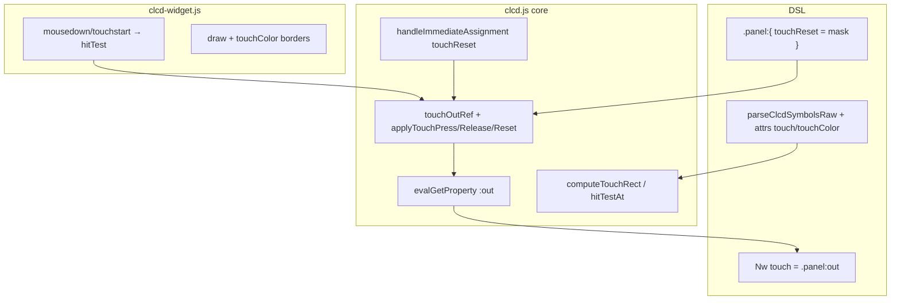

# CLCD Touch Screen — implementation plan

## Goal

Simulate touch-screen LCDs: the existing display bus (`bit`/`bits` → `:get`) stays unchanged; a separate `:out` bus is driven by symbol presses, with external reset and per-symbol modes (`touchType`).

**Language policy:** all new **test titles**, **assertion messages**, and **`.md` documentation** must be written in **English** (match existing CLCD tests 1337–1410).

---

## Design decisions

| Topic | Decision |
|-------|----------|
| UI enable | `touch: 1` on component (default `0`) — no hit-testing when `touch: 0` |
| Display vs touch | **Separate namespaces**: `bit`/`bits` = display; `bitOut` = touch output (optional per symbol) |
| `:out` width | `max(bitOut) + 1` over symbols with `bitOut` only; symbols without `bitOut` are not in `out` |
| `bitOut` validation | Contiguous from 0, no gaps — same rule as [`validateContiguousBits`](v0_3_2/core/components/clcd.js), new `validateContiguousBitOut` |
| Hit box coords | **`x` = left, `y` = top** (canvas, `textBaseline: top`); **`width` horizontal**, **`height` vertical** |
| Touch rect | `(x - pad, y - pad)` … `(x + width + pad, y + height + pad)` |
| Default `width`/`height` | Per symbol kind if omitted: FA → 22×22, `digit7` → 28×44; `label` measured in widget (core/tests use explicit sizes or exported constants) |
| Default `padding` | `0`; optional component-level `touchPadding` fallback |
| `touchColor` | When set + `touch: 1` → debug border on hit boxes in widget |
| Wiring `out` | `Nw touch = .panel:out` or property block `.panel:{ out> touchWire }` (existing DSL `out>`, not `out>=`) |
| `touchReset` | Writable component property, same width as `:out`; `1` bits clear the corresponding `out` positions |
| Overlap | On click, **all** hit symbols are processed; overlapping symbols → multiple bits `1` at once |

### `touchType` per symbol (required when `bitOut` is set, default `1`)

| Value | Name | Behaviour |
|-------|------|-----------|
| `1` | **A — momentary** | `onPress` → bit `1`; `onRelease` → bit `0` (like `key` with `type: 1`) |
| `2` | **B — pulse** | `onPress` → bit `1`, then back to `0` in the same propagation step (like `key` with `type: 0`) |
| `3` | **Latch** | `onPress` on same symbol → toggle bit; stays `1` until press again **or** `touchReset` with `1` on that position |

`touchReset = 00110` → clears `bitOut` positions 2 and 3 (where mask is `1`).

---

## Architecture



**Testable separation:** bounds + hit-test + `out` construction live in [`clcd.js`](v0_3_2/core/components/clcd.js) (Node-runnable); the widget only calls the exported API.

---

## Files to change

### 1. Core — [`v0_3_2/core/components/clcd.js`](v0_3_2/core/components/clcd.js)

New static API (unit-tested directly):

```javascript
static validateContiguousBitOut(symbols) { /* gap error like display bits */ }
static touchOutWidthFromSymbols(symbols) { /* 0 if no bitOut */ }
static defaultTouchSize(symName, symDef) { /* 22×22 fa, 28×44 digit7, … */ }
static computeTouchRect(sym, defaults) { /* {x1,y1,x2,y2,bitOut} */ }
static hitTestAt(symbols, px, py, defaults) { /* hit symbols, draw order */ }
static buildTouchOutValue(symbols, pressedBitOuts, latchedState, width) { /* merge state */ }
```

Component extensions:

- `getDef()`: attrs `touch`, `touchColor`, `touchPadding`; symbol fields `bitOut`, `width`, `height`, `padding`, `touchType`
- `getSupportedProperties()` → `['get', 'out', 'touchReset']` when any `bitOut` exists (else `['get']` only)
- `getOutWidthBits(attributes)` / `evalGetProperty` for `:out` (reads `comp.touchOutRef`)
- `handleImmediateAssignment(comp, 'touchReset', value, ctx)` — apply reset mask
- `createDevice`: when `touch: 1`, wire `onPress`/`onRelease` to widget; `touchOutRef` separate from display `ref`
- `scheduleTouchOutChange(compName, value, ctx)` — update `touchOutRef` + propagate wires bound to `.panel:out` without touching display `ref`

**Propagation:** reuse [`exprReferencesComponent`](v0_3_2/core/signal-propagation.js) + `updateComponentConnections` / `_scheduleWiresDependingOnComponent` after `touchOutRef` changes.

### 2. Parser — [`v0_3_2/core/parser.js`](v0_3_2/core/parser.js) (`parseClcdSymbolsRaw`)

Parse symbol keys: `bitOut`, `width`, `height`, `padding`, `touchType`.

Validations: `touchType ∈ {1,2,3}`; missing `touchType` with `bitOut` → default `1`; `touchType` without `bitOut` → error; end-of-block `validateContiguousBitOut`.

Parse component attrs: `touch`, `touchColor`, `touchPadding`.

### 3. Widget — [`v0_3_2/devices/clcd-widget.js`](v0_3_2/devices/clcd-widget.js)

- Accept `touch`, `touchColor`, `onPress`, `onRelease`
- `mousedown` / `touchstart` on canvas when `touch: 1` → `hitTestAt` → callback with hit `bitOut` list
- `mouseup` / `touchend` → `onRelease` for type-A symbols
- `_drawTouchDebug(ctx)`: `strokeRect` per `computeTouchRect` when `touchColor` set
- Remove stray `console.log` in `_drawDigit7`

### 4. Interpreter — [`v0_3_2/core/interpreter.js`](v0_3_2/core/interpreter.js) (minimal)

- Support `touchReset` in property blocks and `.panel:touchReset = …`
- `scheduleComponentPropertyChange(compName, 'out', value)` if needed (must not update display `comp.ref`)

### 5. Documentation (English)

- [`v0_3_2/doc/clcd.md`](v0_3_2/doc/clcd.md) — new **Touch** section (attributes, symbol fields, `out`, `touchReset`, `touchType`, wiring examples)
- [`v0_3_2/doc/interactive-components.md`](v0_3_2/doc/interactive-components.md) — add `clcd` with `onPress` / `onRelease`
- Regenerate: `node _gen_doc_data.js` (updates `ui/doc-data.js`, `doc/doc-index.json`)

---

## Test infrastructure (required)

Tests must run from **both** runners without extra setup:

| Runner | Entry | Loads |
|--------|-------|-------|
| Browser | [`v0_3_2/run_tests.html`](v0_3_2/run_tests.html) | `test_session.js` → `test_manifest.js` → `test_suite.js` |
| Node | [`v0_3_2/_run_suite_node.js`](v0_3_2/_run_suite_node.js) | same chain (already includes `clcd.js`, `clcd-symbols.js`) |

### Workflow after adding tests

1. Register tests in [`v0_3_2/test_suite.js`](v0_3_2/test_suite.js) with `reg(id, 'clcd', 'English title', fn, opts?)` — **English** `title` and `h.assert('English message', …)` strings.
2. Add helper to [`v0_3_2/test_session.js`](v0_3_2/test_session.js):

```javascript
triggerClcdTouch(interp, compName, { x, y, phase: 'press' | 'release' })
```

Calls the component touch handler without canvas (same path widget would use).

3. Regenerate manifest: `node v0_3_2/_gen_manifest.js` → updates [`v0_3_2/test_manifest.js`](v0_3_2/test_manifest.js) from `LogTScriptTestSuite`.
4. Verify: open `run_tests.html` (filter group `clcd`) and/or `node v0_3_2/_run_suite_node.js` (optionally filter by id range 1411–1428).

No manual manifest edits — manifest is generated from `test_suite.js`.

---

## Tests — IDs **1411–1428** (group `clcd`, English)

| ID | Title (English) |
|----|-----------------|
| 1411 | Parse touch:1, touchColor, symbol bitOut + touchType |
| 1412 | Parse error — bitOut gap (0 and 2 without 1) |
| 1413 | computeTouchRect — padding and width/height |
| 1414 | hitTestAt — point inside / outside rect |
| 1415 | hitTestAt — two overlapping symbols both hit |
| 1416 | touchOutWidthFromSymbols — bitOut 0,1,2 → width 3 |
| 1417 | Symbol without bitOut excluded from out width |
| 1418 | touchType 1 — press/release via triggerClcdTouch |
| 1419 | touchType 2 — pulse returns out to 0 after propagate |
| 1420 | touchType 3 — latch toggle on second press |
| 1421 | touchReset mask 00110 clears bitOut 2 and 3 |
| 1422 | Wire Nwire t = .panel:out updates on press |
| 1423 | Property block out> touchWire |
| 1424 | touch:0 — triggerClcdTouch is no-op |
| 1425 | Parse error — touchType without bitOut |
| 1426 | doc(comp.clcd) lists touch, touchColor, out, touchReset |
| 1427 | touchType 1 press/release (wave propagation) |
| 1428 | touchReset + wire out (wave propagation) |

Example assertion style (English):

```javascript
reg(1413, 'clcd', 'computeTouchRect — padding and width/height', function(h, session) {
  const rect = ClcdComponent.computeTouchRect(
    { x: 10, y: 20, width: 22, height: 22, padding: 4, bitOut: 0 },
    { touchPadding: 0 }
  );
  h.assert('left edge', String(rect.x1), '6');
  h.assert('top edge', String(rect.y1), '16');
  h.assert('right edge', String(rect.x2), '36');
  h.assert('bottom edge', String(rect.y2), '46');
});
```

Wave duplicates: pass `{ propagation: 'wave' }` as 5th argument to `reg()` (same pattern as tests 609, 1345, etc.).

**No canvas click tests** — only core geometry + `triggerClcdTouch` for `onPress` / `out` / `touchReset` behaviour.

---

## Target DSL example

```logts
comp [clcd] .panel:
  touch: 1
  touchColor: ^ff00ff
  width: 200
  height: 100
  = {
    wifi:
      x: 10  y: 10
      bit: 0
      bitOut: 0
      touchType: 1
      width: 22  height: 22
      padding: 4
    :
    bell:
      x: 50  y: 10
      bit: 1
      bitOut: 1
      touchType: 3
      width: 22  height: 22
    :
    label:
      x: 80  y: 10
      bit: 2
      text: "OK"
    :
  }
  :

3wire touchEvt = .panel:out

.panel:{
  touchReset = 011
}
```

---

## Recommendations

1. **Core logic, not widget** — export `computeTouchRect` / `hitTestAt` from `clcd.js` for Node tests.
2. **Separate `out` storage** from display `ref` — same pattern as `shifter:out` / `ioport:out`.
3. **Optional `defaultTouchW/H`** in [`clcd-symbols.js`](v0_3_2/devices/clcd-symbols.js) per symbol kind.
4. **Default `touchType: 1`** when `bitOut` is set but `touchType` omitted.
5. **Overlaps** — report all hit symbols (not only topmost).
6. **English-only** test strings and `.md` docs for this feature.

---

## Implementation order

1. Core static API + parser validation
2. `out` / `touchReset` + propagation
3. Widget hit-testing + `touchColor` debug
4. Tests 1411–1428 in `test_suite.js` + `triggerClcdTouch` in `test_session.js` + `node _gen_manifest.js`
5. English docs + `node _gen_doc_data.js`

---

## Interpreter addition (scheduleTouchOutChange)

Add to [`interpreter.js`](v0_3_2/core/interpreter.js) after `scheduleComponentOutputChange`:

```javascript
scheduleTouchOutChange(compName) {
  this.runSafely(() => {
    if (this.deferWirePropagation() && this.signalPropagationStrategy) {
      this.signalPropagationStrategy.propagate();
    } else {
      this.updateComponentConnections(compName);
    }
    this._emitComputedComponentProbes(compName);
    if (typeof showVars === 'function') showVars();
  });
}
```

Does **not** update `comp.ref` (display) — only re-runs wire statements referencing the component (legacy line ~818, wave via `_scheduleWiresDependingOnComponent`).

---

## Registry note

`component-registry.js` `supportsProperty` already calls `supportsPropertyName(attributes)` when defined on handler — `ClcdComponent.supportsPropertyName` gates `out` / `touchReset` on `touchOutWidth > 0`.

`getSupportedProperties(attributes)` signature differs from base — registry uses `supportsPropertyName` path; keep `getSupportedProperties()` no-arg for backward compat returning `['get']` or delegate with attributes from call sites.

**Fix:** implement `supportsPropertyName` only; leave `getSupportedProperties()` returning dynamic list is optional — existing registry checks `supportsPropertyName` first.
