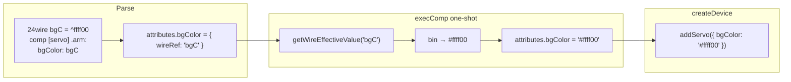

# Plan: atribute culoare din wire-uri (snapshot la creare)

## Context actual

Astăzi, culorile în definițiile `comp` acceptă doar literali `^hex` (parsați ca `#hex`):

```3678:3686:v0_3_2/core/parser.js
          if (this.c.type === 'HEX') {
            // ...
              attributes[attrName] = '#' + this.c.value;
```

Dacă scrii `frameColor: myColor`, parserul stochează stringul `"myColor"` (token `ID`), iar `resolveColorAttr` îl transformă greșit în `#mycolor`.

Există deja un pattern **one-shot** pentru valori din wire la declarare — `initialValue.varRef` în [`v0_3_2/core/interpreter.js`](v0_3_2/core/interpreter.js) (l.12599–12609). Trebuie urmat același model, **nu** `wireRefAttrs` din CPU (`wait:`), care rămâne reactiv la runtime.



## Componente afectate (faza 1)

| Componentă | Atribute culoare |
|------------|------------------|
| motor, servo | `color`, `frameColor`, `bgColor` |
| sensor, led, slider, rotary, terminal | `color` |
| scanner, keyboard | `color`, `bgColor`, `focusColor`, `focusBgColor` (+ `pulseColor` keyboard) |
| clcd | `color`, `bgColor`, `bgColorSym`, `touchColor` |
| ledBar, 7seg, 14seg, dots | `color`, `bgColor`, `lgColor` |
| dip | `color`, `colorFor` (array indexat) |
| lcd | `color`, `pixelOnColor`, `bg`, `backgroundColor` |

Normalizarea existentă (`resolveColorAttr`, `normalizeColor`) rămâne în componente; după snapshot, ele primesc deja `#hex` valid.

## Arhitectură propusă

### 1. Metadata în `getDef()` — tip `color`

Standardizăm atributele de culoare cu `value: 'color'` (CLCD le are deja). Parserul citește din `getDef().attrs` lista `colorAttrNames`, similar cu `attrNamesArray` pentru `type: 'array'`.

Fișiere: toate componentele din tabelul de mai sus în [`v0_3_2/core/components/`](v0_3_2/core/components/).

### 2. Parser — marchează referința wire

În [`v0_3_2/core/parser.js`](v0_3_2/core/parser.js), în `parseComp()`:

- La început, alături de `attrNamesArray`, calculează `colorAttrNames` din `def.attrs` unde `value === 'color'`.
- Când un atribut din `colorAttrNames` primește token `ID` (nu `HEX`, nu string quoted), stochează:
  ```js
  attributes[attrName] = { wireRef: 'myColor' };
  ```
- Pentru array-uri (`colorFor.3: myWire`), același marker în `attributes.colorFor[stateNum]`.
- Literali `^hex` și `#hex` rămân neschimbați.

**Important:** markerul `{ wireRef }` elimină ambiguitatea față de un string literal care ar putea coincide cu un nume de wire.

### 3. Utilitar comun — conversie wire binar → CSS hex

Fișier nou: [`v0_3_2/core/color-wire-resolve.js`](v0_3_2/core/color-wire-resolve.js)

Funcții:

- `isColorWireRef(v)` — detectează `{ wireRef: string }`
- `wireBinToCssHex(binStr, bitWidth)` — convertește valoarea wire la `#rrggbb`
  - strip caractere non-`01` (sau eroare dacă conține X/Z)
  - `parseInt(bin, 2).toString(16)`
  - pentru lățimi > 24 biți: folosește ultimii 24 biți (RGB)
  - pentru lățimi < 24: pad la 3 sau 6 cifre hex după convenția existentă din LCD `:rgb` (l.16780–16798 din interpreter)
- `resolveColorWireRef(wireRef, ctx, contextLabel)` — citește wire o dată via `ctx.getWireEffectiveValue()`, convertește, returnează `#hex` lowercase
  - eroare clară dacă wire-ul nu există sau nu are valoare (ca la `initialValue.varRef`)
- `resolveColorAttributesForComp(type, attributes, ctx, registry)` — parcurge toate atributele `color` din `getDef()`, inclusiv obiecte array (`colorFor`)

### 4. Interpreter — snapshot înainte de `createDevice`

În [`v0_3_2/core/interpreter.js`](v0_3_2/core/interpreter.js), în `execComp()`, imediat după rezolvarea `initialValue.varRef` și înainte de `handler.createDevice()`:

```js
if (this.componentRegistry) {
  resolveColorAttributesForComp(type, attributes, this, this.componentRegistry);
}
```

Aceasta **înlocuiește** `{ wireRef }` cu stringul `#hex` final în `attributes`. Device-ul și `compInfo.attributes` păstrează valoarea snapshot — schimbările ulterioare ale wire-ului nu au efect (cerința explicită).

Fallback legacy din `execComp` (led/dip/lcd inline, l.12702+) primește același apel pentru consistență.

### 5. Fără modificări reactive

- **NU** adăugăm atributele de culoare în `wireRefAttrs` (pattern CPU `wait`).
- **NU** legăm device-ul de wire după creare.
- **NU** re-evaluăm culorile în `applyProperties` / wave propagation.

### 6. Teste

Adăugăm în [`v0_3_2/tests/test_suite.js`](v0_3_2/tests/test_suite.js):

1. **Exemplul servo** — `frameColor: myColor`, `bgColor: bgC` din `24wire`
2. **Ordine declarare** — eroare dacă wire-ul nu e definit încă la `comp`
3. **Snapshot** — după creare, modificăm wire-ul; `resolveConfig` / widget-ul rămân cu culoarea inițială
4. **colorFor** — `colorFor.3: myWire` pe dip
5. **Regresie** — literali `^hex` existente (teste 2983–2986 motor/servo) rămân verzi
6. **Unit** — `wireBinToCssHex` pentru `^ffff00` pe 24wire, `^888` pe 12wire

### 7. Documentație (faza 1 — obligatoriu)

Propunere **hub + note locale**, aliniată cu structura existentă din [`v0_3_2/doc/`](v0_3_2/doc/) și [`v0_3_2/doc/doc-index.json`](v0_3_2/doc/doc-index.json):

#### A. Pagină centrală nouă (sursă de adevăr)

Fișier nou: [`v0_3_2/doc/component-color-attributes.md`](v0_3_2/doc/component-color-attributes.md)

Secțiune **Reference** în doc viewer, lângă `wire-literals.md` și `components.md`.

Conținut:

- **Ce acceptă un atribut `color`:** literal `^hex` **sau** nume de wire (ex. `bgColor: bgC`)
- **Regula snapshot:** valoarea wire-ului se citește **o singură dată** la declararea `comp`; schimbările ulterioare ale wire-ului **nu** actualizează widget-ul (diferit de `cpu.wait:` sau propagarea wave)
- **Ordinea scriptului:** wire-ul trebuie declarat/asignat **înainte** de `comp` (ca la `comp [...] .x = myWire`)
- **Conversie:** wire binar → `#rrggbb` (24wire `^ffff00` → `#ffff00`; wire > 24 biți → ultimii 24 biți RGB)
- **Erori:** wire nedefinit, fără valoare, sau biți X/Z la creare
- **Exemplu complet**, cu bloc `logts-play` runnable:

```logts-play
24wire bgC = ^ffff00
24wire myColor = ^888888

comp [servo] .arm:
  display: servo
  length: 8
  minAngle: 0
  maxAngle: 180
  text: 'Arm'
  frameColor: myColor
  bgColor: bgC
  on: 1
  :
```

- **Tabel componente → atribute color** (din secțiunea „Componente afectate” de mai sus)
- **Diferență față de `^` pe wire:** în `24wire x = ^ffff00`, `^` e literal de inițializare wire; în `color: ^ffff00`, `^` e literal CSS direct — link către [`v0_3_2/doc/wire-literals.md`](v0_3_2/doc/wire-literals.md) pentru context

#### B. Note scurte în paginile per-componentă (fără duplicare reguli)

În secțiunile „Colors” / tabelele de atribute din paginile care au deja culori documentate, adăugăm **1–2 rânduri + link**:

| Fișier | Modificare |
|--------|------------|
| [`servo.md`](v0_3_2/doc/servo.md), [`motor.md`](v0_3_2/doc/motor.md) | În tabelul `color` / `frameColor` / `bgColor`: tip `hex \| wire` + link hub; opțional înlocuim un exemplu cu varianta wire-ref |
| [`keyboard.md`](v0_3_2/doc/keyboard.md), [`scanner.md`](v0_3_2/doc/scanner.md) | Idem pentru `focusColor`, `pulseColor` etc. |
| [`dip.md`](v0_3_2/doc/dip.md) | Mențiune `colorFor.N: myWire` |
| led, seven-seg, led-bar, dots, 14seg, slider, rotary, sensor, terminal, lcd, clcd | O linie „Color attributes accept wire refs — see [component-color-attributes.md](component-color-attributes.md)” |

**Nu** duplicăm regulile snapshot/conversie în fiecare pagină — doar link către hub.

#### C. Index și catalog

- [`doc-index.json`](v0_3_2/doc/doc-index.json): intrare nouă în secțiunea **Reference**:
  ```json
  { "file": "component-color-attributes.md", "label": "Component color attributes", "searchExtra": "color frameColor bgColor wire ref snapshot hex theme palette" }
  ```
- [`components.md`](v0_3_2/doc/components.md): un rând în introducere sau sub „Displays” — link la pagina hub
- [`wire-literals.md`](v0_3_2/doc/wire-literals.md): paragraf scurt „Using a wire's value as a component color” → link hub (clarifică confuzia `^` wire vs `^` atribut)

#### D. Regenerare bundle doc

După editarea `.md`:

```bash
node v0_3_2/node/_gen_doc_data.js
```

Actualizează [`v0_3_2/ui/doc-data_generated.js`](v0_3_2/ui/doc-data_generated.js) pentru doc viewer.

#### E. `doc(comp.*)` în editor (opțional, mic)

După ce `getDef()` folosește `value: 'color'`, putem extinde afișarea `doc(comp.servo)` astfel încât coloana tip să arate `color` (sau `hex | wire`) în loc de `string` — ajută la discoverability fără a citi manual pagina hub. Dacă e prea mult scope, rămâne doar documentația markdown.

#### F. Faza 2 doc (CLCD symbols)

Când implementăm wire-ref în blocuri `= { ... }`:

- [`clcd.md`](v0_3_2/doc/clcd.md) + [`clcd-symbols.md`](v0_3_2/doc/clcd-symbols.md): `color: myWire` / `bgColor: myWire` în exemple symbol
- Secțiune scurtă în hub-ul central, sub „CLCD symbol blocks”

---

## Faza 2 (ulterior): culori CLCD symbol

Blocurile `= { icon: color: ^fff ... }` folosesc `readHexColor()` în parser (l.5460), care acceptă doar `^` / `#`.

Modificări viitoare:

- Extinde `readHexColor()` → `readColorValue()` cu suport ident → `{ wireRef }`
- În `execComp` sau `ClcdComponent.createDevice`, rezolvă `attributes.clcdSymbols[].color` / `.bgColor` cu același utilitar
- Test dedicat CLCD symbol cu wire ref

---

## Riscuri / decizii

| Subiect | Decizie |
|---------|---------|
| Lățime wire | Orice lățime; pentru UI color folosim ultimii 24 biți dacă wire > 24 |
| Valori X/Z în wire | Eroare la creare (culoare invalidă) |
| `transparent` (lcd bg) | Rămâne literal string; nu e atribut `color` în metadata |
| Performanță | Neglijabilă — o citire per atribut, doar la declarare |

## Estimare efort

- **Faza 1:** ~6–8 fișiere cod + 1 pagină doc hub + note în ~12 pagini componentă + regen doc bundle + teste
- **Faza 2:** parser CLCD symbol + clcd.js + doc clcd + 1–2 teste
