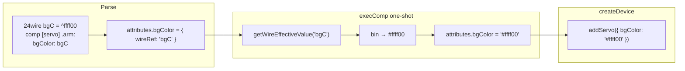

# Plan: atribute culoare din wire-uri (snapshot la creare)

## Stare implementare

| Parte | Status |
|-------|--------|
| **Faza 1 — cod** (`color-wire-resolve.js`, parser, interpreter, `getDef`, teste 2987–2991) | ✅ făcut |
| **Faza 1 — doc user-facing** | ✅ făcut |
| **Faza 2 — cod** (CLCD symbol `color` / `bgColor` din wire) | ✅ făcut |
| **Faza 2 — doc user-facing** | ✅ făcut |

---

## Context

Culorile la `comp` acceptau doar literali `^hex`. Acum un atribut `color` poate fi și **nume de wire**; valoarea se citește **o singură dată** la declarare (snapshot), nu reactiv ca `cpu.wait:`.



Fișiere cod Faza 1: [`v0_3_2/core/color-wire-resolve.js`](v0_3_2/core/color-wire-resolve.js), [`parser.js`](v0_3_2/core/parser.js), [`interpreter.js`](v0_3_2/core/interpreter.js), componente în [`v0_3_2/core/components/`](v0_3_2/core/components/).

---

## Faza 1 — cod (finalizată)

### Componente cu atribute `color`

| Componentă | Atribute |
|------------|----------|
| motor, servo | `color`, `frameColor`, `bgColor` |
| sensor, led, slider, rotary, terminal | `color` |
| scanner, keyboard | `color`, `bgColor`, `focusColor`, `focusBgColor` (+ `pulseColor`) |
| clcd | `color`, `bgColor`, `bgColorSym`, `touchColor` |
| ledBar, 7seg, 14seg, dots | `color`, `bgColor`, `lgColor` |
| dip | `color`, `colorFor` |
| lcd | `color`, `pixelOnColor` (`bg` / `transparent` rămân string literal) |

### Teste (2987–2991)

Rulate cu succes în suite-ul complet (2437/2437).

---

## Documentație user-facing

**Ce înseamnă:** paginile Markdown din [`v0_3_2/doc/`](v0_3_2/doc/) afișate în **Doc viewer** din editor (`script_editor_v0_3_2.html` → Search / Index). Nu planul din `.cursor/plans/`, nu comentarii în cod.

**Principiu:** un **hub central** cu regulile complete; paginile per-componentă doar **1–2 rânduri + link**, fără duplicare.

**Limba doc:** engleză (ca restul doc-urilor existente, ex. [`servo.md`](v0_3_2/doc/servo.md)).

**Pipeline după editare:**

```bash
node v0_3_2/node/_gen_doc_data.js
```

Regenerează [`v0_3_2/ui/doc-data_generated.js`](v0_3_2/ui/doc-data_generated.js) și secțiunile din [`doc-viewer.js`](v0_3_2/ui/doc-viewer.js).

**Verificare manuală:** deschide editorul → Doc → caută „component color” / „wire ref” → rulează un bloc `logts-play` de pe pagina hub.

---

### Pas 1 — Pagină hub nouă (sursă de adevăr)

**Fișier:** [`v0_3_2/doc/component-color-attributes.md`](v0_3_2/doc/component-color-attributes.md) *(de creat)*

**Poziție în index:** secțiunea **Reference**, imediat după `wire-literals.md`.

**Structură propusă:**

1. **Titlu + one-liner** — atributele `color` acceptă `^hex` sau nume wire
2. **Syntax** — exemplu minimal + exemplul servo cu `frameColor: myColor`, `bgColor: bgC`
3. **Snapshot rule** — citire unică la `comp`; schimbări ulterioare ale wire-ului nu actualizează widget-ul; contrast cu `cpu.wait:` (reactiv)
4. **Declaration order** — wire-ul trebuie definit/asignat **înainte** de `comp`
5. **Wire → CSS conversion** — `24wire` + `^ffff00` → `#ffff00`; wire > 24 biți → ultimii 24 biți RGB; erori X/Z
6. **Literal forms** — tabel: `color: ^aabbcc` | `color: myWire` | `colorFor.3: swatch` (dip)
7. **Component table** — lista din secțiunea Faza 1 (atribute per componentă)
8. **vs wire literals** — link la [`wire-literals.md`](v0_3_2/doc/wire-literals.md): `^` la inițializare wire ≠ `^` în atribut
9. **`logts-play` runnable** — același script ca testul 2987 (servo + două wire-uri)
10. **See also** — linkuri către motor, servo, keyboard, clcd, dip

**`doc-index.json`** — intrare nouă:

```json
{
  "file": "component-color-attributes.md",
  "label": "Component color attributes",
  "searchExtra": "color frameColor bgColor wire ref snapshot hex theme palette myColor bgC colorFor"
}
```

---

### Pas 2 — Legături în catalog și referințe transversale

| Fișier | Modificare |
|--------|------------|
| [`components.md`](v0_3_2/doc/components.md) | Paragraf scurt după introducere sau sub „Displays”: *Color attributes can use wire refs — see [component-color-attributes.md](component-color-attributes.md)* |
| [`wire-literals.md`](v0_3_2/doc/wire-literals.md) | Secțiune nouă „Using a wire value as a component color” (3–5 rânduri) + link hub |

---

### Pas 3 — Note locale per componentă (fără duplicare reguli)

În **tabelele de atribute** existente, schimbăm tipul `hex` → `hex \| wire` și adăugăm footnote sau rând:

> Wire name: value read once at declaration. See [component-color-attributes.md](component-color-attributes.md).

| Prioritate | Fișier | Detaliu extra |
|------------|--------|----------------|
| P1 | [`servo.md`](v0_3_2/doc/servo.md), [`motor.md`](v0_3_2/doc/motor.md) | Secțiunea „Colors”: un exemplu `logts-play` cu wire-uri (lângă exemplul existent cu `^hex`) |
| P1 | [`keyboard.md`](v0_3_2/doc/keyboard.md), [`scanner.md`](v0_3_2/doc/scanner.md) | Tabele `focusColor`, `pulseColor` etc. |
| P1 | [`dip.md`](v0_3_2/doc/dip.md) | `colorFor.N: myWire` |
| P2 | [`led.md`](v0_3_2/doc/led.md), [`seven-seg.md`](v0_3_2/doc/seven-seg.md), [`led-bar.md`](v0_3_2/doc/led-bar.md), [`14seg.md`](v0_3_2/doc/14seg.md), [`dots.md`](v0_3_2/doc/dots.md) | O linie + link hub |
| P2 | [`slider.md`](v0_3_2/doc/slider.md), [`rotary.md`](v0_3_2/doc/rotary.md), [`sensor.md`](v0_3_2/doc/sensor.md), [`terminal.md`](v0_3_2/doc/terminal.md), [`lcd.md`](v0_3_2/doc/lcd.md) | Idem |
| P2 | [`clcd.md`](v0_3_2/doc/clcd.md) | Atribute `comp` (Faza 1); symbol blocks — Pas 5 după cod Faza 2 |

**Nu** copiem regulile snapshot/conversie în fiecare pagină.

---

### Pas 4 — Regenerare și verificare

1. `node v0_3_2/node/_gen_doc_data.js`
2. Commit include `doc/*.md`, `doc-index.json`, `ui/doc-data_generated.js` (și `doc-viewer.js` dacă s-a modificat)
3. Smoke test în doc viewer: pagina hub, link din `servo.md`, search „wire ref color”

---

### Pas 5 — Doc Faza 2 (după implementare CLCD symbol wire-ref)

**Cod Faza 2** (prerequisite pentru doc):

- `readHexColor()` → `readColorValue()` cu suport ident → `{ wireRef }` în parser (bloc `= { ... }`)
- Rezolvare în `resolveColorAttributesForComp` sau helper dedicat pentru `attributes.clcdSymbols[].color` / `.bgColor`
- Test în `test_suite.js`

**Doc Faza 2:**

| Fișier | Modificare |
|--------|------------|
| [`component-color-attributes.md`](v0_3_2/doc/component-color-attributes.md) | Secțiune nouă **CLCD symbol blocks** cu exemplu `color: symFg` în `= { warning: ... }` |
| [`clcd.md`](v0_3_2/doc/clcd.md) | Tabel symbol fields: `color` / `bgColor` → `hex \| wire`; exemplu în syntax-ul de la început |
| [`clcd-symbols.md`](v0_3_2/doc/clcd-symbols.md) | 1 exemplu symbol cu wire ref + mențiune snapshot |
| `doc-index.json` | Opțional: `searchExtra` pe intrarea `clcd.md` / hub — cuvinte `symbol color wire` |

Apoi din nou Pas 4 (regen bundle).

---

### Pas 6 — Opțional (discoverability în editor)

Extinde output-ul `doc(comp.servo)` astfel încât atributele cu `value: 'color'` în `getDef()` să apară ca tip `color` (sau `hex | wire`) în loc de `string`. Mică modificare în generatorul `doc()` — **nu blochează** livrarea doc Markdown.

---

## Faza 2 — cod CLCD symbol (de făcut)

Blocurile `= { icon: color: ^fff ... }` folosesc `readHexColor()` în [`parser.js`](v0_3_2/core/parser.js) (l.5460), care acceptă doar `^` / `#`.

- Extinde parser symbol → `{ wireRef }` pentru `color` / `bgColor`
- Rezolvare snapshot cu [`color-wire-resolve.js`](v0_3_2/core/color-wire-resolve.js)
- Test dedicat CLCD symbol cu wire ref
- Apoi **Pas 5** documentație de mai sus

---

## Riscuri / decizii

| Subiect | Decizie |
|---------|---------|
| Lățime wire | Ultimii 24 biți RGB dacă wire > 24 |
| Valori X/Z | Eroare la creare |
| `transparent` (lcd `bg`) | Rămâne string literal, nu `value: 'color'` |
| Reassign wire în test snapshot | Doc exemplu: menționează `MODE WIREWRITE` dacă arătăm modificare wire după `comp` |
| Ordine livrare doc | Hub + note Faza 1 **pot** fi făcute acum; secțiunea CLCD symbol **după** cod Faza 2 |

## Estimare efort rămas

| Task | Efort |
|------|-------|
| Doc Faza 1 (hub + ~12 pagini note + index + regen) | ~1–2h |
| Cod Faza 2 CLCD symbol | ~2–3h |
| Doc Faza 2 (clcd + hub section) | ~30–45 min |
