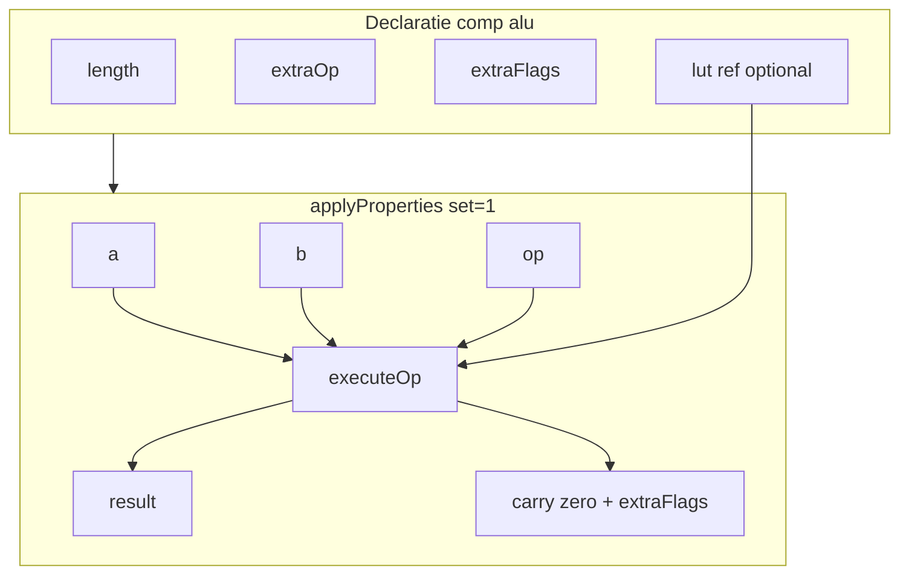

# Plan: `comp [alu]` — Opcode ALU (A1)

Referință: [future-component-ideas.md](v0_3_2/doc/future-component-ideas.md) secțiunea **A1**.

## Obiectiv

Un singur bloc panel pentru ALU didactică: operanzi `a`/`b`, selector `op`, ieșiri `result` + flaguri — înlocuiește manual `chip +[alu4]` (adder + subtract + MUX) din [mini-cpu-v2.md](v0_3_2/doc/mini-cpu-v2.md).

**Nu** adaugă capabilități engine noi față de `comp [adder]` + `comp [subtract]` + `MUX()` + porți built-in; **ambalează** pattern-ul într-o componentă probe-friendly și extensibilă.

---

## Decizii confirmate

| Subiect | Decizie |
|---------|---------|
| Lățime datapath | Atribut **`length`** (nu `depth`) — lățime `a`, `b`, `result` |
| Operații standard (fără `extraOp`) | **ADD, SUB, AND, OR** — **4 op**, pin **`op` 2 biți** |
| Trigger | `set` + `on: 1` (level), ca adder/subtract |
| Flaguri standard | **`carry`**, **`zero`** (1 bit fiecare) |
| Extensii | **`extraOp`**, **`extraFlags`** — liste în declarație |
| LUT custom | Atribut opțional **`lut: .ref`** — adaptor pentru op-uri din `extraOp` (vezi mai jos) |
| Encoding `op` | `0=ADD`, `1=SUB`, `2=AND`, `3=OR`; extraOp continuă de la `4`, `5`, … |

---

## Sintaxă țintă

### Minimal (echivalent `alu4` mini-CPU)

```logts
comp [alu] .alu:
  length: 4
  on: 1
  :

.alu:{ a = curacc
  b = opd
  op = aluop
  set = 1 }
4wire aluy = .alu:result
1wire alucarry = .alu:carry
```

### Extins (extra op + flaguri)

```logts
comp [alu] .alu:
  length: 8
  extraOp: XOR, LSHIFT, PASS
  extraFlags: overflow, less, equal
  on: 1
  :

.alu:{ a = x
  b = y
  op = opcode
  set = 1 }
8wire r = .alu:result
1wire z = .alu:zero
1wire ov = .alu:overflow
```

### Cu adaptor LUT (op custom combinational)

```logts
comp [lut] .aluFn:
  length: 16
  depth: 8
  = data { 0: 00000000, 1: 11111111, ... }
  :

comp [alu] .alu:
  length: 4
  extraOp: CUSTOM
  lut: .aluFn
  on: 1
  :
```

---

## Atribute

| Atribut | Tip | Default | Descriere |
|---------|-----|---------|-----------|
| `length` | integer | `4` | Lățime biți `a`, `b`, `result` |
| `on` | `0`/`1`/`raise`/`edge` | `0` | Trigger property block (ca adder) |
| `extraOp` | listă ID | — | Op-uri suplimentare după cele 4 standard |
| `extraFlags` | listă ID | — | Pout-uri flag suplimentare |
| `lut` | `.component` | — | Referință `comp [lut]` pentru op-uri custom din `extraOp` |

**Sintaxă listă** (de aliniat cu convenții existente — propunere):

```logts
extraOp: XOR, LSHIFT, PASS
extraFlags: overflow, less, equal
```

sau pe linii separate (dacă parserul permite duplicate key — de verificat; altfel listă comma pe o linie).

---

## Operații standard (implementare internă)

| `op` | Nume | `result` | `carry` | `zero` |
|------|------|----------|---------|--------|
| `00` | ADD | `a+b` mod 2^length | carry out | result==0 |
| `01` | SUB | `a-b` mod 2^length | borrow | result==0 |
| `10` | AND | `a AND b` | `0` | result==0 |
| `11` | OR | `a OR b` | `0` | result==0 |

Implementare: reutilizează logica din built-in `ADD`/`SUBTRACT` și porți `AND`/`OR` în [interpreter.js](v0_3_2/core/interpreter.js) `call()` sau helper partajat (nu duplicate UI adder/subtract).

---

## `extraOp` — op-uri suplimentare (built-in)

Propunere catalog inițial (extensibil în `alu.js`):

| Nume | Semantica | Note |
|------|-----------|------|
| `XOR` | `a XOR b` | |
| `NXOR` | `a NXOR b` | |
| `NOT` | `NOT a` (ignoră `b` sau `b` unused) | unary |
| `PASS` | `a` | transfer |
| `LSHIFT` | `LSHIFT(a, b)` sau shift by `b` LSBs | `b` = amount, limitat la `length` |
| `RSHIFT` | `RSHIFT(a, b)` | |
| `NAND`, `NOR` | porți | opțional v1.1 |

**Lățime pin `op`:** `opBits = bitIndexWidth(4 + extraOpCount)` — [bitIndexWidth](v0_3_2/core/interpreter.js) ca la slider/stack.

Dacă `extraOp` lipsește → `op` rămâne **2 biți** (compat `alu4`).

---

## `extraFlags` — flaguri suplimentare

| Nume | Semantica | Când are sens |
|------|-----------|---------------|
| `overflow` | signed overflow ADD/SUB | aritmetică |
| `negative` / `sign` | `result[length-1]` | comparare |
| `less` | `a < b` unsigned | comparare |
| `equal` | `a == b` | comparare |
| `borrow` | alias explicit SUB | pedagogic |

Flagurile **nu** apar în `getSupportedProperties()` dacă nu sunt în `extraFlags` (+ standard `carry`, `zero` mereu).

**`supportsPropertyName(property, attributes)`** — model [mem.js](v0_3_2/core/components/mem.js): pout dinamic din configurația instanței.

---

## Pinuri și pout-uri (dinamice)

### Pinuri (mereu)

| Pin | Lățime | Rol |
|-----|--------|-----|
| `set` | 1 | Trigger |
| `a` | `length` | Operand A |
| `b` | `length` | Operand B |
| `op` | `opBits` | Selector operație |

### Pout-uri (bază)

| Pout | Lățime | Rol |
|------|--------|-----|
| `result` | `length` | Alias **`get`** permis (`:get`, `get>=`) |
| `carry` | 1 | Carry/borrow ADD/SUB |
| `zero` | 1 | `result == 0` |

### Pout-uri din `extraFlags`

Câte un pin 1-bit per nume declarat (`overflow`, `less`, …).

`getDef(attributes)` returnează pins/pouts calculate la `doc(comp.alu)` cu atributele exemplu.

---

## Adaptor LUT (`lut: .ref`)

**Scop:** op-uri din `extraOp` care nu sunt în catalogul built-in (ex. `CUSTOM`, `MICRO1`) sau tabele truth custom mici.

**Reguli:**

1. `lut` referă un `comp [lut]` **declarat înainte**, aceeași `length` (depth LUT = `length`) sau depth mai mare dacă include și biți flag în cuvânt.
2. Adresă LUT: `addr = (op << (2*length)) | (a << length) | b` — fezabil pentru **`length ≤ 4`** (addr ≤ 12 biți, 4096 intrări). Pentru `length > 4`, LUT adapter **doar** `op` indexat (microcode per op, nu truth table completă) sau eroare la compile.
3. Dacă `op` se potrivește unui nume din `extraOp` **și** există `lut:`, rezultatul vine din LUT; altfel built-in din catalog.
4. Op-urile standard `0..3` **nu** trec prin LUT (mereu hardcoded).

**Alternativă simplă (MVP):** fără adresare `a|b` — LUT indexat doar pe `op` pentru extra slots, fiecare rând = constantă de test / micro-op; `a`,`b` încă folosite de built-in pentru XOR etc. Documentăm limitarea.

**Faza LUT:** după MVP ADD/SUB/AND/OR + extraOp built-in.

---

## Arhitectură



**Stocare:** [devices/alu-devices.js](v0_3_2/devices/alu-devices.js) (nou) sau extensie [mem-devices.js](v0_3_2/devices/mem-devices.js) — Map `id → { length, opBits, lastResult, flags }`.

**Panel:** widget compact — operanzi, `op` decode label (ADD/SUB/…), result hex/bin, LED-uri flag.

---

## Fișiere de creat/modificat

| Fișier | Acțiune |
|--------|---------|
| [core/components/alu.js](v0_3_2/core/components/alu.js) | **nou** — logică principală |
| [devices/alu-devices.js](v0_3_2/devices/alu-devices.js) | **nou** — stare + panel |
| [core/components/index.js](v0_3_2/core/components/index.js) | register |
| [core/parser.js](v0_3_2/core/parser.js) | parse `extraOp`/`extraFlags` listă (dacă nu există helper list attr) |
| [doc/alu.md](v0_3_2/doc/alu.md) | **nou** |
| [doc/components.md](v0_3_2/doc/components.md) | rând alu |
| [doc/mini-cpu-v2.md](v0_3_2/doc/mini-cpu-v2.md) | variantă cu `comp [alu]` în loc de `chip [alu4]` |
| [doc/future-component-ideas.md](v0_3_2/doc/future-component-ideas.md) | A1 marcat done |
| [test_suite.js](v0_3_2/test_suite.js) | grup `alu` |
| [script_editor_v0_3_2.html](v0_3_2/script_editor_v0_3_2.html), `_run_suite_node.js`, `run_tests.html` | scripts + CSS |
| `_gen_manifest.js`, `_gen_doc_data.js` | regenerare |

---

## Faze și efort

| Fază | Conținut | Zile | Teste |
|------|----------|------|-------|
| **MVP** | length, ADD/SUB/AND/OR, carry, zero, result/get, panel minimal | 3–4 | 1291–1305 |
| **extraOp** | XOR, PASS, LSHIFT, opBits dinamic | 2–3 | 1306–1312 |
| **extraFlags** | overflow, less, equal, pout dinamic | 1–2 | 1313–1317 |
| **LUT adapter** | `lut: .ref`, length≤4 full addr | 2–3 | 1318–1320 |
| **Doc + mini-cpu** | alu.md, exemplu board | 1–2 | — |
| **Total** | | **~9–14 zile** | **~30** |

MVP singur înlocuiește `chip +[alu4]` — livrabil util la ~4 zile.

---

## Teste planificate (1291+)

Rezervat în [tristate_bus_buffer.plan.md](tristate_bus_buffer.plan.md) până la 1290 — ALU începe la **1291**.

| ID | Scop |
|----|------|
| 1291 | parse minimal `comp [alu] .a::` length 4 |
| 1292 | ADD — carry + zero |
| 1293 | SUB — borrow |
| 1294 | AND / OR |
| 1295 | op=ADD echivalent mini-cpu aluop `00` |
| 1296 | `result` / `:get` / `get>=` redirect |
| 1297 | `extraOp: XOR` — op code 4 |
| 1298 | `extraFlags: overflow` — pout prezent |
| 1299 | `doc(comp.alu)` cu extraOp |
| 1300–1305 | wave propagation, probe, property block |
| 1306+ | LUT adapter, mini-cpu-v2 integration |

---

## Out of scope (v1)

- Barrel shifter dedicat (A6) — poate fi `extraOp: LSHIFT` simplu
- `comp [cmp]` / `comp [flags]` separate (A2) — parțial acoperit de `extraFlags`
- ALU cu registru intern latched (folosește `comp [reg]` downstream)
- `length > 8` cu LUT full `a|b` truth table
- Integrare `MODE ZSTATE` (fire X pe result) — după plan tristate

---

## Relație cu alte planuri

- [tristate_bus_buffer.plan.md](tristate_bus_buffer.plan.md) — independent; ALU rămâne binar în v1
- [mini_cpu_v2.plan.md](mini-cpu_v2.plan.md) — opțional: exemplu board cu `comp [alu]` post-livrare

---

## ID test

- **1291–1320** (rezervat ALU)
