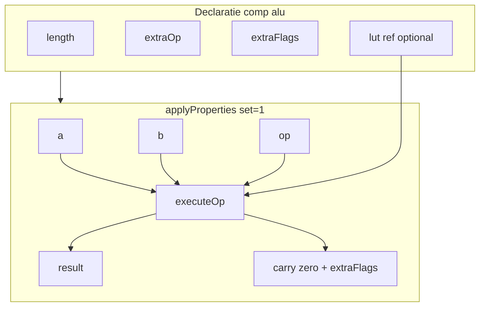

# Plan: `comp [alu]` — Opcode ALU (A1)

Referință: [future-component-ideas.md](v0_3_2/doc/future-component-ideas.md) secțiunea **A1**.

## Obiectiv

Un singur bloc panel pentru ALU didactică: operanzi `a`/`b`, selector `op`, ieșiri `result` + flaguri — înlocuiește manual `chip +[alu4]` (adder + subtract + MUX) din [mini-cpu-v2.md](v0_3_2/doc/mini-cpu-v2.md).

**Nu** adaugă capabilități engine noi față de `comp [adder]` + `comp [subtract]` + `MUX()` + porți built-in; **ambalează** pattern-ul într-o componentă probe-friendly și extensibilă.

---

## Decizii confirmate

| Subiect | Decizie |
|---------|---------|
| Lățime datapath | Atribut **`length`** (nu `depth`) — lățime `a`, `b`, `result` |
| Operații standard (fără `extraOp`) | **ADD, SUB, AND, OR** — **4 op**, pin **`op` 2 biți** |
| Trigger | `set` + `on: 1` (level), ca adder/subtract |
| Flaguri standard | **`carry`**, **`zero`** (1 bit fiecare) |
| Extensii | **`extraOp`**, **`extraFlags`** — liste în declarație |
| LUT custom | Atribut opțional **`lut: .ref`** — adaptor pentru op-uri din `extraOp` (vezi mai jos) |
| Encoding `op` | `0=ADD`, `1=SUB`, `2=AND`, `3=OR`; extraOp continuă de la `4`, `5`, … |

---

## Recomandare pedagogică (ce „are sens” în ALU)

### Ce predă un curs intro de arhitectură

ALU tipică **single-cycle** = aritmetică simplă + logică pe biți:

- **Aritmetică:** ADD, SUB (aceeași structură, carry/borrow)
- **Logică:** AND, OR (XOR vine la al doilea curs)
- **Flaguri:** zero, carry — pentru `BEQ` / overflow mai târziu

**MUL / DIV** în hardware real sunt adesea **unități separate** (multi-cycle, sau coprocesor), nu în aceeași ALU combinatională de 1 ciclu ca ADD. **MOD** nu e opcode separat — e restul la DIV sau se calculează în software.

### Tier-uri pentru `comp [alu]`

| Tier | Config | Public țintă | Mesaj didactic |
|------|--------|--------------|----------------|
| **1 — default** | doar standard (ADD/SUB/AND/OR) + `carry`, `zero` | mini-CPU v2, primul lab ALU | „ALU = add/sub + logică, ca în diagramă” |
| **2 — logică extinsă** | `extraOp: XOR, PASS` + opțional `extraFlags: less, equal` | ISA cu compare / XOR | „Extinzi ALU fără alt chip” |
| **3 — shift** | `extraOp: LSHIFT, RSHIFT` | ISA cu SLL/SRL | Barrel shifter = altă unitate; aici variantă didactică simplă |
| **4 — advanced** | `extraOp: MUL, DIV` | curs arhitectură avansat | „Matematică mai grea — în silicon e alt bloc sau mai multe cicluri” |
| **Lab alternativ** | `comp [alu]` + `comp [multiplier]` pe board | contrast explicit | Elevul **vede două unități** — mai fidel hardware-ului decât totul în ALU |

### Verdict MUL / DIV

| Op | În ALU? | Decizie |
|----|---------|---------|
| **MUL** | `extraOp` | **Da** — tier 4, pout `over` |
| **DIV** | `extraOp` | **Da** — tier 4, pout `mod` (restul; **fără opcode MOD**) |
| **MOD** | — | **Respins** — restul doar via `DIV` + `:mod` |

**Confirmat:** `extraOp: MUL, DIV` da; opcode **`MOD` nu** se implementează.

**Concluzie:** are sens tehnic (engine-ul suportă), dar **pedagogic** MUL/DIV nu sunt în „ALU de bază” — le păstrăm în `extraOp`, nu în cele 4 op standard, și doc-ul recomandă tier 1 pentru mini-CPU și tier 4 / multiplier separat pentru labs avansate.

### Cum ai totuși MUL/DIV „în ALU” (practic)

În silicon, mul/div sunt adesea **extensie** (ex. RISC-V **M-extension**) — același datapath `a`/`b`, alt opcode, uneori mai multe cicluri. În LogTScript modelăm asta **fără** a minți că sunt ADD:

**Varianta A — `extraOp` pe același `comp [alu]` (recomandat pentru „un singur bloc”):**

```logts
comp [alu] .alu:
  length: 4
  extraOp: MUL, DIV
  on: 1
  :

// op = 4 → MUL, op = 5 → DIV (după ADD=0, SUB=1, AND=2, OR=3)
2wire aluop   // sau 3 biți dacă ai mai multe extraOp
4wire acc
4wire operand

.alu:{ a = acc
  b = operand
  op = aluop
  set = 1 }

4wire aluOut = .alu:result
4wire mulHi   = .alu:over    // activ doar dacă MUL în extraOp
4wire divRem  = .alu:mod      // activ doar dacă DIV în extraOp
```

| `op` (exemplu) | Operație | `:result` | Extra pout |
|----------------|----------|-----------|------------|
| `100` (4) | MUL | low(`a×b`) | `:over` |
| `101` (5) | DIV | `⌊a/b⌋` | `:mod` |

Doc: numește asta **„ALU extinsă”** sau **„ALU + M-unit”** — nu „ALU minimală din cursul 1”.

**Varianta B — două unități pe board (mai fidel hardware):**

```logts
comp [alu] .alu:
  length: 4
  on: 1
  :

comp [multiplier] .mul:
  depth: 4
  on: 1
  :

// Control din LUT/decoder: isMul → pulse .mul, altfel → .alu
```

CPU decode alege **care unitate** primește `set=1` — elevul vede că MUL nu e același chip ca ADD.

**Varianta C — ambele în același lab:** mai întâi Varianta B, apoi refactor la Varianta A și discuție „în FPGA un singur modul poate îngloba tot”.

**Rest (MOD):** nu opcode — la **DIV** citești `:mod`; la MUL nu există rest.

### Flaguri — ordine didactică

1. **`zero`** + **`carry`** — imediat după ADD/SUB (mini-CPU `BEQ` / carry)
2. **`less`**, **`equal`** — când introduci compare / branch (aproape de A2 `cmp`, dar în ALU)
3. **`overflow`** — signed, după ce elevul știe reprezentare cu semn

---

## Sintaxă țintă

### Minimal (echivalent `alu4` mini-CPU)

```logts
comp [alu] .alu:
  length: 4
  on: 1
  :

.alu:{ a = curacc
  b = opd
  op = aluop
  set = 1 }
4wire aluy = .alu:result
1wire alucarry = .alu:carry
```

### Extins (extra op + flaguri)

```logts
comp [alu] .alu:
  length: 8
  extraOp: XOR, LSHIFT, PASS
  extraFlags: overflow, less, equal
  on: 1
  :

.alu:{ a = x
  b = y
  op = opcode
  set = 1 }
8wire r = .alu:result
1wire z = .alu:zero
1wire ov = .alu:overflow
```

### Cu adaptor LUT (op custom combinational)

```logts
comp [lut] .aluFn:
  length: 16
  depth: 8
  = data { 0: 00000000, 1: 11111111, ... }
  :

comp [alu] .alu:
  length: 4
  extraOp: CUSTOM
  lut: .aluFn
  on: 1
  :
```

---

## Atribute

| Atribut | Tip | Default | Descriere |
|---------|-----|---------|-----------|
| `length` | integer | `4` | Lățime biți `a`, `b`, `result` |
| `on` | `0`/`1`/`raise`/`edge` | `0` | Trigger property block (ca adder) |
| `extraOp` | listă ID | — | Op-uri suplimentare după cele 4 standard |
| `extraFlags` | listă ID | — | Pout-uri flag suplimentare |
| `lut` | `.component` | — | Referință `comp [lut]` pentru op-uri custom din `extraOp` |

**Sintaxă listă** (de aliniat cu convenții existente — propunere):

```logts
extraOp: XOR, LSHIFT, PASS
extraFlags: overflow, less, equal
```

sau pe linii separate (dacă parserul permite duplicate key — de verificat; altfel listă comma pe o linie).

---

## Operații standard (implementare internă)

| `op` | Nume | `result` | `carry` | `zero` |
|------|------|----------|---------|--------|
| `00` | ADD | `a+b` mod 2^length | carry out | result==0 |
| `01` | SUB | `a-b` mod 2^length | borrow | result==0 |
| `10` | AND | `a AND b` | `0` | result==0 |
| `11` | OR | `a OR b` | `0` | result==0 |

Implementare: reutilizează logica din built-in `ADD`/`SUBTRACT` și porți `AND`/`OR` în [interpreter.js](v0_3_2/core/interpreter.js) `call()` sau helper partajat (nu duplicate UI adder/subtract).

---

## `extraOp` — catalog (confirmat + recomandat)

### Implementare v1 (built-in în `alu.js`)

| Tier | Nume | Semantica | Pout / flag extra |
|------|------|-----------|-------------------|
| — | *(standard)* | ADD, SUB, AND, OR | `carry`, `zero` |
| **2** | `XOR` | `a XOR b` | — |
| **2** | `NOT` | `NOT a` (`b` ignorat) | unary |
| **2** | `PASS` | `result = a` | transfer / MOV |
| **2** | `CMP` | `result = a - b` (ca SUB) | activează **`less`**, **`equal`** dacă în `extraFlags` sau auto la CMP |
| **3** | `LSHIFT` | `LSHIFT(a, amount)`; `amount` = low bits din `b` | |
| **3** | `RSHIFT` | `RSHIFT(a, amount)` logical | |
| **3** | `ASHR` | `RSHIFT(a, amount, a[MSB])` — arithmetic shift right | alias didactic SRA |
| **4** | `MUL` | unsigned `a×b` | **`:over`** auto |
| **4** | `DIV` | unsigned `⌊a/b⌋` | **`:mod`** auto |

**Exemplu „ALU completă” pentru doc:**

```logts
comp [alu] .alu:
  length: 8
  extraOp: XOR, NOT, PASS, CMP, LSHIFT, RSHIFT, ASHR, MUL, DIV
  extraFlags: less, equal, overflow
  on: 1
  :
```

### De ce acestea (simplitate didactică)

| Op | Motiv |
|----|-------|
| **XOR** | Aproape orice ALU real; util la parity, crypto intro, mask |
| **NOT** | Unary simplu; complement înainte de ADD (two's complement) |
| **PASS** | Evită MUX extern „result = a”; load/move pe același datapath |
| **CMP** | Un pas pentru branch: SUB + flags fără `comp [cmp]` separat (A2) |
| **LSHIFT / RSHIFT / ASHR** | SLL/SRL/SRA din ISA — built-in `LSHIFT`/`RSHIFT` există deja |
| **MUL / DIV** | Extensie M; restul la DIV via `:mod` |

### Opțional v1.1+ (nu în MVP dacă vrem scope mic)

| Nume | Notă |
|------|------|
| `NXOR`, `NAND`, `NOR` | Porți extra — rar în CPU ISA |
| `ROL`, `ROR` | Rotate — `LROTATE`/`RROTATE` built-in există |
| `NEG` | `-a` = SUB(0,a) — redundat cu SUB + `b=0` |
| `INC` / `DEC` | redundat cu ADD/SUB immediate în ISA |

### Respins

- **`MOD`** ca opcode — folosește `DIV` + `:mod`

**Lățime pin `op`:** `opBits = bitIndexWidth(4 + extraOpCount)`.

Dacă `extraOp` lipsește → `op` rămâne **2 biți** (compat `alu4`).

---

## `MUL`, `DIV` — semantica (aliniat la engine)

LogTScript definește deja aritmetica în [interpreter.js](v0_3_2/core/interpreter.js) și în `comp [multiplier]` / `comp [divider]`:

| Built-in / comp | Ieșiri | Semantica (unsigned, `length` biți) |
|-----------------|--------|-------------------------------------|
| `MULTIPLY(a,b)` | `result`, **`over`** | `product = a×b`; `result` = low `length` bits; `over` = high `length` bits |
| `DIVIDE(a,b)` | `result`, **`mod`** | `result` = `⌊a/b⌋`; `mod` = `a % b` |
| — | — | **`b = 0`** → quotient și remainder **0** (ca divider) |

**Nu există built-in `MOD` separat** — restul vine din al doilea rezultat al `DIVIDE`.

### În `comp [alu]` (prin `extraOp`)

```logts
comp [alu] .alu:
  length: 4
  extraOp: MUL, DIV
  on: 1
  :
```

| Op (`extraOp`) | `:result` | Pout secundar | `carry` / `zero` |
|----------------|-----------|---------------|------------------|
| **MUL** | low bits `a×b` | **`:over`** (`length` biți) | `zero` pe `result`; `carry` = 0 |
| **DIV** | quotient `⌊a/b⌋` | **`:mod`** (`length` biți) — **restul (fost MOD)** | `zero` pe `result`; `carry` = 0 |

**Pout-uri secundare auto:** `MUL` → `over`; `DIV` → `mod`. Fără opcode `MOD`.

Exemplu:

```logts
.alu:{ a = 1101
  b = 0011
  op = opMul
  set = 1 }
4wire lo = .alu:result
4wire hi = .alu:over

.alu:{ a = 1101
  b = 0011
  op = opDiv
  set = 1 }
4wire q = .alu:result
4wire r = .alu:mod
```

Implementare internă: apelează aceeași logică ca `MULTIPLY`/`DIVIDE` din `call()` (BigInt, mască `length` biți) — **nu** instanțiază multiplier/divider separat în panel.

### Limitări pedagogice

- **Unsigned** doar (ca multiplier/divider existente); signed → `extraFlags: overflow` + documentare separată.
- Produsul complet are `2×length` biți — ALU expune doar `result`+`over`, nu produsul pe `2×length` într-un singur wire (folosește `comp [multiplier]` dacă vrei widget dedicat).
- Împărțirea la 0: **0/0** pe ambele ieșiri (consistent cu divider), fără eroare — documentat în `alu.md`.

---

## `extraFlags` — flaguri suplimentare

| Nume | Semantica | Când are sens |
|------|-----------|---------------|
| `overflow` | signed overflow ADD/SUB | aritmetică |
| `negative` / `sign` | `result[length-1]` | comparare |
| `less` | `a < b` unsigned | comparare |
| `equal` | `a == b` | comparare |
| `borrow` | alias explicit SUB | pedagogic |

Flagurile **nu** apar în `getSupportedProperties()` dacă nu sunt în `extraFlags` (+ standard `carry`, `zero` mereu).

**`supportsPropertyName(property, attributes)`** — model [mem.js](v0_3_2/core/components/mem.js): pout dinamic din configurația instanței.

---

## Pinuri și pout-uri (dinamice)

### Pinuri (mereu)

| Pin | Lățime | Rol |
|-----|--------|-----|
| `set` | 1 | Trigger |
| `a` | `length` | Operand A |
| `b` | `length` | Operand B |
| `op` | `opBits` | Selector operație |

### Pout-uri (bază)

| Pout | Lățime | Rol |
|------|--------|-----|
| `result` | `length` | Alias **`get`** permis (`:get`, `get>=`) |
| `carry` | 1 | Carry/borrow ADD/SUB |
| `zero` | 1 | `result == 0` |

### Pout-uri auto din `extraOp` (multi-rezultat)

| Condiție | Pout | Lățime | Rol |
|----------|------|--------|-----|
| `MUL` în `extraOp` | `over` | `length` | High bits produs |
| `DIV` în `extraOp` | `mod` | `length` | Rest împărțire |

### Pout-uri din `extraFlags`

Câte un pin 1-bit per nume declarat (`overflow`, `less`, …).

`getDef(attributes)` returnează pins/pouts calculate la `doc(comp.alu)` cu atributele exemplu.

---

## Adaptor LUT (`lut: .ref`)

**Scop:** op-uri din `extraOp` care nu sunt în catalogul built-in (ex. `CUSTOM`, `MICRO1`) sau tabele truth custom mici.

**Reguli:**

1. `lut` referă un `comp [lut]` **declarat înainte**, aceeași `length` (depth LUT = `length`) sau depth mai mare dacă include și biți flag în cuvânt.
2. Adresă LUT: `addr = (op << (2*length)) | (a << length) | b` — fezabil pentru **`length ≤ 4`** (addr ≤ 12 biți, 4096 intrări). Pentru `length > 4`, LUT adapter **doar** `op` indexat (microcode per op, nu truth table completă) sau eroare la compile.
3. Dacă `op` se potrivește unui nume din `extraOp` **și** există `lut:`, rezultatul vine din LUT; altfel built-in din catalog.
4. Op-urile standard `0..3` **nu** trec prin LUT (mereu hardcoded).

**Alternativă simplă (MVP):** fără adresare `a|b` — LUT indexat doar pe `op` pentru extra slots, fiecare rând = constantă de test / micro-op; `a`,`b` încă folosite de built-in pentru XOR etc. Documentăm limitarea.

**Faza LUT:** după MVP ADD/SUB/AND/OR + extraOp built-in.

---

## Arhitectură



**Stocare:** [devices/alu-devices.js](v0_3_2/devices/alu-devices.js) (nou) sau extensie [mem-devices.js](v0_3_2/devices/mem-devices.js) — Map `id → { length, opBits, lastResult, flags }`.

**Panel:** widget compact — operanzi, `op` decode label (ADD/SUB/…), result hex/bin, LED-uri flag.

---

## Fișiere de creat/modificat

| Fișier | Acțiune |
|--------|---------|
| [core/components/alu.js](v0_3_2/core/components/alu.js) | **nou** — logică principală |
| [devices/alu-devices.js](v0_3_2/devices/alu-devices.js) | **nou** — stare + panel |
| [core/components/index.js](v0_3_2/core/components/index.js) | register |
| [core/parser.js](v0_3_2/core/parser.js) | parse `extraOp`/`extraFlags` listă (dacă nu există helper list attr) |
| [doc/alu.md](v0_3_2/doc/alu.md) | **nou** |
| [doc/components.md](v0_3_2/doc/components.md) | rând alu |
| [doc/mini-cpu-v2.md](v0_3_2/doc/mini-cpu-v2.md) | variantă cu `comp [alu]` în loc de `chip [alu4]` |
| [doc/future-component-ideas.md](v0_3_2/doc/future-component-ideas.md) | A1 marcat done |
| [test_suite.js](v0_3_2/test_suite.js) | grup `alu` |
| [script_editor_v0_3_2.html](v0_3_2/script_editor_v0_3_2.html), `_run_suite_node.js`, `run_tests.html` | scripts + CSS |
| `_gen_manifest.js`, `_gen_doc_data.js` | regenerare |

---

## Faze și efort

| Fază | Conținut | Zile | Teste |
|------|----------|------|-------|
| **MVP** | length, ADD/SUB/AND/OR, carry, zero, result/get, panel minimal | 3–4 | 1353–1367 |
| **extraOp** | XOR, NOT, PASS, CMP, LSHIFT, RSHIFT, ASHR, **MUL, DIV**, opBits dinamic | 2–3 | 1368–1377 |
| **extraFlags** | overflow, less, equal, pout dinamic | 1–2 | 1375–1379 |
| **LUT adapter** | `lut: .ref`, length≤4 full addr | 2–3 | 1380–1382 |
| **Doc + mini-cpu** | alu.md, exemplu board | 1–2 | — |
| **Total** | | **~9–14 zile** | **~30** |

MVP singur înlocuiește `chip +[alu4]` — livrabil util la ~4 zile.

---

## Teste planificate (1353+)

**Notă ID-uri:** intervalul vechi **1291–1320** nu mai e disponibil — suprapunere cu rezervări din [tristate_bus_buffer.plan.md](tristate_bus_buffer.plan.md) (1222–1290) și cu grupuri deja livrate (`short-notation` 1334–1336, `clcd` 1337–1352). ALU folosește **1353–1382** (după ultimul test CLCD).

| ID | Scop |
|----|------|
| 1353 | parse minimal `comp [alu] .a::` length 4 |
| 1354 | ADD — carry + zero |
| 1355 | SUB — borrow |
| 1356 | AND / OR |
| 1357 | op=ADD echivalent mini-cpu aluop `00` |
| 1358 | `result` / `:get` / `get>=` redirect |
| 1359 | `extraOp: XOR` — op code 4 |
| 1360 | `extraOp: MUL` — result + over |
| 1361 | `extraOp: DIV` — result + mod; div-by-zero |
| 1362 | `extraOp: CMP` + flags less/equal |
| 1363 | `extraOp: ASHR` vs RSHIFT |
| 1364 | `extraFlags: overflow` |
| 1365–1367 | MVP suplimentar (panel, on:1, length 8) |
| 1368–1377 | extraOp NOT, PASS, LSHIFT, RSHIFT, opBits dinamic |
| 1375–1379 | extraFlags less, equal, negative |
| 1380–1382 | LUT adapter, mini-cpu-v2 integration |

---

## Out of scope (v1)

- Barrel shifter dedicat (A6) — poate fi `extraOp: LSHIFT` simplu
- `comp [cmp]` / `comp [flags]` separate (A2) — parțial acoperit de `extraFlags`
- ALU cu registru intern latched (folosește `comp [reg]` downstream)
- `length > 8` cu LUT full `a|b` truth table
- Integrare `MODE ZSTATE` (fire X pe result) — după plan tristate

---

## Relație cu alte planuri

- [tristate_bus_buffer.plan.md](tristate_bus_buffer.plan.md) — independent; ALU rămâne binar în v1
- [mini_cpu_v2.plan.md](mini-cpu_v2.plan.md) — opțional: exemplu board cu `comp [alu]` post-livrare

---

## ID test

- **1353–1382** (grup `alu`; vechi 1291–1320 indisponibil)
