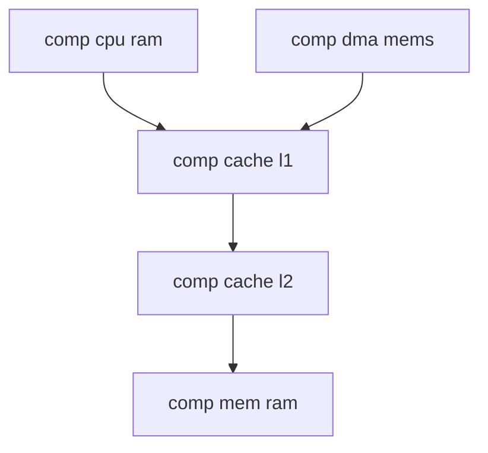
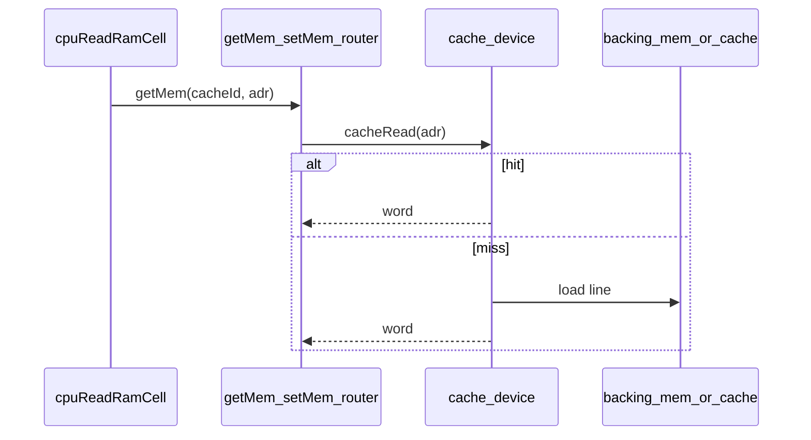

# Plan: componenta `comp [cache]`

Scratch / idei inițiale: [comp_cache.txt](../my_ideas/comp_cache.txt)

Planuri înrudite: [comp_cpu.plan.md](comp_cpu.plan.md), [comp_mmap.plan.md](comp_mmap.plan.md)

## Context și obiectiv

Documentația scratch descrie un cache transparent cu aceeași interfață logică ca [mem.md](../v0_3_2/doc/mem.md), plasabil în lanț:



**Obiectiv v1:** un master care face `ram = .l1` sau `mems: .cache` să nu știe că există cache; accesul trece prin `getMem`/`setMem` (ca astăzi pentru `mem`).

**Lanț multi-nivel (confirmat):** `cpu ram = .l1` → `.l1 mem = .l2` → `.l2 mem = .ram`.

---

## Starea actuală în codebase

| Legătură | Fișier | Restricție actuală |
|----------|--------|---------------------|
| `cpu ram =` / `prog =` | [cpu.js](../v0_3_2/core/components/cpu.js) `_resolveMemLink` | doar `comp [mem]` |
| `dma mems:` | [dma.js](../v0_3_2/core/components/dma.js) `_resolveMemSlots` | doar `comp [mem]` |
| `mmap regions: mem:` | [mmap.js](../v0_3_2/core/components/mmap.js) `_resolveMemRef` | doar `comp [mem]` |
| Acces runtime | [cpu-devices.js](../v0_3_2/devices/cpu-devices.js) | `ramMemId` → `getMem`/`setMem` |
| Stocare device | [mem-devices.js](../v0_3_2/devices/mem-devices.js) | `dm().memories` Map |

Nu există `comp [cache]` în registry ([index.js](../v0_3_2/core/components/index.js)). Pattern-ul cel mai apropiat: **mmap ca proxy de adresare** — cache ar fi proxy de stocare cu aceeași adresare ca `mem`.

---

## Modificări recomandate față de scratch

### 1. `depth` / `length` — declarate explicit, validate față de backing

Cache are `depth:` și `length:` în script (vizibile în `doc(.cache)`), dar **trebuie să coincidă** cu backing-ul (`mem =`).

Reguli la `createDevice`:
- Rezolvă backing-ul (`mem` sau `cache`) → `expectedDepth`, `expectedLength`.
- Dacă `depth` / `length` lipsesc → eroare (obligatorii).
- Dacă nu coincid → eroare clară, ex.: `cache .l1 depth 4 does not match backing .ram depth 8`.

### 2. `lines`, `lineSize`, `depth` — terminologie LogTScript

| Atribut | Ce măsoară | Exemplu |
|---------|------------|---------|
| **`depth`** | Biți **per adresă** (ca la `mem`) | `8` |
| **`length`** | Adrese în backing (`0 .. length-1`) | `256` |
| **`lineSize`** | Adrese consecutive per linie cache | `4` |
| **`lines`** | Număr de **seturi** (v1: 1 linie/set) | `16` |

**Capacitate:** `lines × lineSize` adrese; `lines × lineSize × depth` biți.

`lines` și `lineSize` sunt **obligatorii, alese de utilizator** (nu auto-derivate).

Mapare direct-mapped v1:
```
setIndex = floor(adr / lineSize) % lines
tag      = floor(adr / (lineSize * lines))
offset   = adr % lineSize
```

### 3. Pinuri bus — nu în Faza A

Acces programatic (`getMem`/`setMem`) + property block. Faza D: pinuri `adr`/`data`/`write`/`get` (vezi mai jos).

### 4. `busy` — sincron în v1

Hit/miss/evict instant; `busy = 0` mereu pe cache.

### 5. `invalidate` — suport pe `line` și `adr`

### 6. `hitRate` — 7 biți, 0–100

Calculat din contoare **interne**; `round(hits * 100 / total)`.

### 7. `evictType` — lru | fifo | random (default lru)

Ales explicit de utilizator; random doar dacă `evictType: random`.

### 8. Coerență multi-cache — documentat, fără snooping v1

### 9. `prog = .cache` — confirmat

### 10. mmap — Faza B separată

---

## Decizii închise

| ID | Decizie |
|----|---------|
| D1 | Faza A only (fără mmap în același PR) |
| D2 | Sincron v1 — hit/miss instant, `busy` cache = 0 |
| D3 | Direct-mapped |
| D4 | Fără pinuri bus în Faza A |
| D5 | `prog = .cache` — da |
| D6 | `invalidate` fără write-back automat |
| D7 | `getMem`/`setMem` polimorf |
| D8 | `hitRate` 7 biți, 0–100 |
| D9 | `evictType` (lru \| fifo \| random), default `lru` |
| D10 | mmap în Faza B |
| D11 | Faza D amânată pentru pinuri bus |
| D12 | Contoare 16 biți pe wire, saturare (nu wrap); `hitRate` din intern |
| D13 | `lines` + `lineSize` obligatorii, alese de user |
| D14 | Pin `resetStats` + `set` — doar contoare, nu liniile cache |

---

## Atribute și API

```
comp [cache] .l1:
  mem = .ram          # comp [mem] sau comp [cache]
  depth: 8
  length: 256
  lines: 16
  lineSize: 4
  evictType: lru
  writePolicy: writeBack
  writeAllocate: 1
  on: 1
:
```

**Pinuri:** `flush`, `invalidate`, `invalidateAll`, `resetStats`, `line`, `adr`, `set`

**Pouturi:** `hits`, `misses`, `hitRate` (7 bit), `evictions`, `dirtyEvictions`, `busy` (0 v1), `valid`, `dirty`, `tag`, `data`

### Reset contoare

```
.cache:{
  resetStats = 1
  set = 1
}
```

| Operație | Efect |
|----------|--------|
| `resetStats` | contoare → 0 |
| `flush` | write-back dirty |
| `invalidateAll` | linii invalide |

---

## D12 — overflow contoare

- **Intern:** număr JS, crește liber.
- **Wire:** 16 biți, **saturare** la 65535 (nu wrap, nu reset automat).
- **`hitRate`:** mereu din valori interne.

---

## Arhitectură



### Fișiere noi

| Fișier | Rol |
|--------|-----|
| [cache.js](../v0_3_2/core/components/cache.js) | componentă |
| [cache-devices.js](../v0_3_2/devices/cache-devices.js) | runtime |
| [cache.md](../v0_3_2/doc/cache.md) | documentație |

### Fișiere modificate

- [device-maps.js](../v0_3_2/devices/device-maps.js) — `caches` Map
- [mem-devices.js](../v0_3_2/devices/mem-devices.js) — dispatch `getMem`/`setMem`
- [cpu.js](../v0_3_2/core/components/cpu.js), [dma.js](../v0_3_2/core/components/dma.js) — `mem` \| `cache`
- [index.js](../v0_3_2/core/components/index.js), script editor, doc cpu/dma/mem

### Helper recomandat

`resolveStorageBackend(ref, ctx)` — refolosit CPU, DMA, (viitor) mmap.

---

## Faze

### Faza A — nucleu (MVP)

1. `cache-devices.js` + router storage
2. `cache.js` + registry
3. CPU `ram`/`prog` + DMA `mems:` acceptă cache
4. Teste `comp-cache` (2708+)
5. `doc/cache.md`

### Faza B — mmap

`regions: cache: .l1` în mmap.

### Faza C — extensii

Associativity, miss penalty async, snooping.

### Faza D — bus pin-level (amanată)

Pinuri `adr`/`data`/`write`/`get`, multi-port opțional, teste wave.

---

## Teste Faza A (minim)

| Scenariu |
|----------|
| hit / miss |
| writeBack / writeThrough / noWriteAllocate |
| L1 → L2 → RAM |
| DMA shared cache |
| invalidate (line + adr) |
| evictType lru/fifo/random |
| depth/length mismatch → eroare |
| resetStats |
| counter saturate + hitRate corect |
| doc(.cache) |

---

## Riscuri

| Risc | Mitigare |
|------|----------|
| Lanț cache adânc | max 8 niveluri la resolve |
| `random` flaky | seed fix per run |
| DMA bypass cache | doc + invalidate/flush |
| `line` vs `adr` | ambele suportate |

---

## Estimare

- **Faza A:** feature mediu (~1 componentă + device + resolvere + 12–15 teste + doc)
- **Faza B:** ~30% din Faza A
