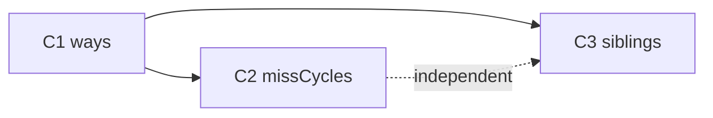

# Plan: `comp [cache]` — Faza C

Plan părinte: [comp_cache.plan.md](comp_cache.plan.md)

**Stare A/B:** implementate — nucleu, CPU/DMA/mmap, teste 2708+, mmap+cache 2728+.

**Faza D** (pinuri bus `adr`/`data`/`write`/`get`) rămâne în planul părinte — nu face parte din C.

---

## Obiectiv Faza C

Trecere de la cache **direct-mapped** (1 linie/set) la opțiuni **didactice + puțin mai realiste**, fără:

- `getMem` care returnează gol până e gata
- componentă „bus global”
- penalty obligatoriu (default rămâne instant)

Pattern aliniat cu **DMA `mode: instant | paced`** și **CPU `wait`**: un atribut numeric care pornește comportamentul avansat doar când e ≠ 0.

---

## Glosar (pe scurt)

| Termen | Înseamnă la noi |
|--------|------------------|
| **Set (coloană)** | Grup de adrese care mapează la aceeași indexare (`lines`) |
| **`ways: N`** | Câte **linii** (sertare) poate ține un set simultan |
| **`ways: 1`** | Direct-mapped — comportament A/B |
| **Evict** | Înlocuirea unei linii când setul e plin |
| **Cache frați (siblings)** | Două+ `comp [cache]` cu același `mem = .ram` |
| **Invalidare** | Linia marcată invalidă — următorul read e miss |
| **Snooping (C3)** | La write în RAM, cache-urile frați sunt notificate automat (fără `invalidate` manual) |

**Nu** introducem magistrală globală — starea `busy` și hook-urile de coerență sunt **per instanță cache** sau **per backing `mem`**.

---

## Sintaxă țintă (după C)

```logts
comp [cache] .l1:
  mem = .ram
  depth: 8
  length: 256
  lines: 16
  lineSize: 4
  ways: 1              # default — ca A/B
  missCycles: 0        # default — instant
  evictType: lru
  writePolicy: writeBack
  writeAllocate: 1
  on: 1
  :
```

---

## Decizii închise (Faza C)

| ID | Decizie |
|----|---------|
| **C-W1** | Atribut **`ways: N`**, default **`1`** — compatibilitate totală A/B |
| **C-W2** | Capacitate adresabilă: **`lines × ways × lineSize`** |
| **C-W3** | **`evictType`** (lru \| fifo \| random) devine relevant când **`ways > 1`** și setul e plin |
| **C-W4** | **`random`**: seed fix per instanță (`rngSeed`) — teste deterministe |
| **C-M1** | Atribut **`missCycles: N`**; **`N = 0`** (default) = **instant** — fără atribut separat `timing:` |
| **C-M2** | **`missCycles > 0`**: la miss, linia se încarcă **imediat**; **`getMem`/`setMem` returnează datele la primul acces** — nu așteptare la API |
| **C-M3** | **`busy`** pout = **`1`** cât timp contorul intern `remaining > 0` după un miss penalizat |
| **C-M4** | Contorul scade la **fiecare `getMem` / `setMem`** pe **acea instanță** de cache cât `remaining > 0` — **nu** la pas global CPU (`set`) |
| **C-M5** | Mai multe CPU / DMA / mmap pe același cache **împart** același `busy` / contor |
| **C-M6** | **Fără** „bus global” ca abstracție sau componentă |
| **C-M7** | Penalty **nu** e obligatoriu — scripturile fără `missCycles` se comportă ca A/B |
| **C-S1** | C3: coerență prin **hook la write** pe backing (`mem` / cache inferior), **nu** magistrală |
| **C-S2** | C3: scope minim = **cache-uri frați** (același `mem =` direct) |
| **C-W5** | Pin **`way`**: `0…ways−1` cale specifică; **`ways`** = tot setul la `invalidate`; **`ways+1`** = prima validă la inspect |
| **C-W6** | (același pin `way` — vezi secțiunea de encoding) |
| **C-M8** | Miss-ul care pornește `remaining = N` **nu** decrementează; primul decrement la **următorul** acces `getMem`/`setMem` |
| **C-M9** | Orice acces la cache (hit sau miss) cât `remaining > 0` decrementează contorul |
| **C-S3** | **C3.1** (implementare): invalidare automată doar frați direct pe același `mem =`; **fără** propagare automată în lanț — user invalidează manual cache-urile de deasupra cu pinii `invalidate` / `invalidateAll` |
| **C-S4** | **Invalidate** la notificare (nu update in-place) — **închis** |

---

## Pin `way` — encoding (C-W5 + C-W6)

Lățime pin: **`wayBits = max(1, ceil(log2(ways + 2)))`** — încape index `0…ways−1` plus două valori rezervate.

| Valoare `way` (numeric) | La **`invalidate`** (+ `line`/`adr`) | La **inspect** pout-uri (`valid`, `dirty`, `tag`, `data`) |
|-------------------------|--------------------------------------|-----------------------------------------------------------|
| **`0` … `ways − 1`** | Invalidează **doar** calea aleasă în setul selectat | Citește **calea** respectivă |
| **`ways`** | Invalidează **toate** căile din set | — |
| **`ways + 1`** | — (tratat ca invalid sau no-op la invalidate) | **Prima cale validă** din set (index mic → mare); dacă niciuna → `valid=0`, rest neutru |

**Set selectat** ca azi: pin **`line`** sau **`adr`** (derivă setIndex).

**`ways: 1`:** `way=0` = singura cale; `way=1` = tot setul (= aceeași cale); `way=2` = auto/prima validă (= way 0 dacă valid).

**Exemple:**

```logts
# Invalidează doar way 0 din setul 2
.l1:{ line = 10, way = 00, invalidate = 1, set = 1 }

# Invalidează toate way-urile din setul adresat de adr
.l1:{ adr = 10100, way = \2, invalidate = 1, set = 1 }
# (ways=2 → way=\2 = ways = tot setul)

# Inspect prima cale validă din set
.l1:{ line = 10, way = \3, set = 1 }
show(.l1:valid)
show(.l1:tag)
```

**`invalidateAll`** rămâne separat — invalidează **întreg** cache-ul (toate seturile, toate way-urile).

---

# Sub-faza C1 — `ways` (set-associativity)

## Scop

Permite mai multe linii per set; **`lru` / `fifo` / `random`** au efect real.

## Model date (runtime)

Structură actuală: `sets[i]` = o linie.

Țintă:

```
sets[setIndex][wayIndex]  →  { valid, dirty, tag, addrs[], lastUsed, fifoSeq }
```

- **`lines`** = număr de seturi (neschimbat semantic)
- **`ways`** = linii per set (default 1)

### Mapare adresă (neschimbat index set/tag)

```
setIndex = floor(adr / lineSize) % lines
tag      = floor(adr / (lineSize * lines))
offset   = adr % lineSize
```

La lookup: caută tag în toate way-urile din `setIndex`.

La miss cu set plin: evict conform `evictType`.

## Fișiere

| Fișier | Schimbare |
|--------|-----------|
| [cache-devices.js](../../v0_3_2/devices/cache-devices.js) | structură way, lookup/evict/flush/invalidate |
| [cache.js](../../v0_3_2/core/components/cache.js) | atribut `ways`, validare, `doc`, pin inspect |
| [cache.md](../../v0_3_2/doc/cache.md) | secțiune ways, capacitate, exemple |
| [test_suite.js](../../v0_3_2/tests/test_suite.js) | grup `comp-cache-ways` |

## Teste minime C1

| Scenariu |
|----------|
| `ways` omis → echivalent 1 (regresie A/B) |
| `ways: 2`, două adrese același set, tag diferit — fără evict |
| Al treilea tag în același set → `evictions >= 1` |
| LRU vs FIFO — secvențe diferite, rezultat diferit |
| `doc(.cache)` arată `ways:` |
| Flush / writeBack / invalidate pe set multi-way |
| Pin `way`: invalidate o cale vs `way=ways` tot setul |
| Pin `way`: inspect `way=ways+1` prima validă vs cale specifică |

---

# Sub-faza C2 — `missCycles` + `busy`

## Scop

Model **pedagogic** de latență la miss (ca DMA `paced`), fără a schimba return-ul sincron al `getMem`.

## Comportament

### `missCycles: 0` (default)

Identic A/B: `busy` mereu `0` (exceptând rezervări viitoare); miss instant.

### `missCycles: N` (N > 0)

**La miss** (nu la hit):

1. Încarcă linia și returnează cuvântul imediat (**C-M2**).
2. `remaining ← N`, `busy ← 1`.
3. La fiecare **`getMem` / `setMem`** ulterior pe acest cache cât `remaining > 0`:
   - `remaining--`
   - când `remaining === 0` → `busy ← 0`

**La hit:** nu pornește contor nou; dacă `busy` deja 1, accesul poate decrementa `remaining` (**C-M9** — de confirmat).

### Legătură CPU (documentație, nu cod CPU nou obligatoriu)

```logts
comp [cpu] .u:
  wait = .l1:busy
  ...
```

Instrucțiunea cu LOAD primește datele; **`wait`** poate bloca **următorul** `set` — lecție stall memorie.

### Ce nu facem

| Interzis | Decizie |
|----------|---------|
| `getMem` → null/gol până gata | **C-M2** — respins |
| Decrement la fiecare `cpu set` global | **C-M4** — respins |
| Bus global | **C-M6** — respins |
| `timing: instant \| penalized` | **C-M1** — respins; doar `missCycles` |

## Fișiere

| Fișier | Schimbare |
|--------|-----------|
| [cache-devices.js](../../v0_3_2/devices/cache-devices.js) | `remaining`, logică miss/hit + busy |
| [cache.js](../../v0_3_2/core/components/cache.js) | atribut `missCycles`, default 0 |
| [cache.md](../../v0_3_2/doc/cache.md) | miss penalty, busy, CPU wait, exemple logts-play |
| [cpu.md](../../v0_3_2/doc/cpu.md) | link exemplu cache busy + wait |

## Teste minime C2

| Scenariu |
|----------|
| `missCycles: 0` → `busy` 0 după miss |
| `missCycles: 3` → după miss `busy=1`, `remaining=3` intern |
| 3 accese ulterioare la cache → `busy=0` |
| Două CPU pe același cache — accesele oricăruia decrementează |
| CPU cu `wait = .l1:busy` — stall vizibil (opțional E2E) |
| Lanț L1→L2: `missCycles` diferit pe fiecare nivel (doc demo) |

---

# Sub-faza C3 — coerență (snooping light)

## C-S3 — propagare invalidare (didactic vs complet)

### Problema

Două surse de adevăr pentru aceeași adresă → cache-uri cu copii diferite.

**Exemplu clasic (frați pe RAM):**

```
CPU  → .l1 → .ram
DMA  → .l2 → .ram     ← ambele „frați”: același mem =
```

CPU citește prin `.l1` (linia pentru adresa 0 e în cache). DMA scrie **direct** în `.ram[0]`. Fără coerență, CPU poate citi încă valoarea veche din `.l1`.

### C3.1 — Didactic (implementare C3)

**Regulă simplă:** la orice write efectiv într-un **`comp [mem]`**, invalidează în **toate cache-urile** care au **`mem = .ram`** (aceeași instanță, legătură directă).

| Eveniment | Ce se întâmplă |
|-----------|----------------|
| `setMem(ram, adr, val)` | Hook: pentru fiecare cache cu `mem = .ram` → invalidate linia pentru `adr` |
| Write prin cache cu `writeThrough` | Ajunge în RAM → același hook |
| Write prin cache `writeBack` | RAM încă vechi până la flush — **frații nu văd** write-ul (corect pentru WB) |
| Un singur cache partajat (CPU+DMA pe `.l1`) | Regresie: un singur cache, fără „frate” |

**Lecție:** *„Dacă cineva scrie în RAM, cache-urile care stau direct pe RAM își pierd încrederea în linia de la acea adresă.”*

**Ce NU acoperă C3.1:** lanțul L1→L2→RAM când DMA scrie în RAM dar CPU are date doar în L1 (L1 `mem = .l2`, nu `.ram`). Pentru asta, **nu** facem propagare automată — vezi mai jos.

### Lanț L1→L2→RAM — invalidare manuală (decizie C-S3)

**De ce nu automat:** cache-ul de deasupra (`.l1`) **nu știe** că `.l2` e backing-ul său în sens invers — legătura e doar `mem =` (`.l1` → `.l2`), nu există registry „cine mă folosește ca backing”. O propagare automată ar impune asocieri inverse în `mem` sau walk-uri de graf pe care **nu le dorim**.

**Ce face userul:** după write extern în RAM (sau oricând), invalidează explicit cache-ul de deasupra cu pinii existenți:

```logts
# După DMA scrie în .ram — invalidează setul pentru adr în L1
.l1:{ adr = 10100, way = \2, invalidate = 1, set = 1 }

# Sau tot L1
.l1:{ invalidateAll = 1, set = 1 }
```

**Lecție:** *„Coerența automată se oprește la frații pe același backing. Ierarhia L1→L2 e responsabilitatea scriptului — pinurile `invalidate` / `invalidateAll` / `way` o fac posibilă fără magistrală.”*

**C3.2 (propagare automată în lanț):** **respins** — nu se implementează.

---

## C-S4 — invalidate vs update (didactic vs complet)

### La notificare (alt master a scris), ce facem cu linia din cache?

### Invalidate — decizie C-S4 (**închis**)

**Acțiune:** `valid ← 0` (linia rămâne în structură, dar e ignorată la read).

| Avantaj | Explicație |
|---------|------------|
| Simplu | O singură operație, funcționează cu `lineSize > 1` |
| Safe cu writeBack | Nu copiem date parțiale greșit în linie |
| Pedagogic | Următorul read = **miss** vizibil în contoare |

**Flux:**

```
DMA scrie ram[5] = 0xAA
  → hook invalidează linia (set,tag) pentru adr 5 în .l1 și .l2
CPU LOAD de la adr 5
  → miss în .l1
  → citește 0xAA din ram
```

### Update (snoop cu modificare) — mai complet, **nu** în C3

**Acțiune:** dacă cache-ul are linia pentru `adr`, **actualizează cuvântul** în linie (și eventual `dirty ← 0`).

| Avantaj | Dezavantaj |
|---------|------------|
| Hit după write extern — fără miss | Cu `lineSize > 1`, un singur cuvânt se schimbă — restul liniei poate fi stale |
| Mai apropiat de hardware MESI „shared” | writeBack + update = conflicte de proiectare |
| | Două cache-uri cu aceeași linie dirty — nightmare |

**Pentru LogTScript:** **invalidate** e potrivit pentru didactic + writeBack dominant. Update poate fi „faza viitoare” dacă vreți protocoale MESI — nu C3.

### Tabel rezumativ C-S4

| Model | La write extern în RAM | Următorul read CPU |
|-------|------------------------|---------------------|
| **Invalidate** (C3) | `valid=0` | Miss, date noi |
| **Update** | Patch word în linie | Poate hit cu date noi |
| **Nimic** (azi) | Linie stale | Hit greșit (bug didactic) |

---

## Scop C3 (implementare)

Când **două maeștri** au **cache-uri separate** pe **aceeași RAM**, write-ul în RAM nu lasă celălalt cache cu date vechi — fără `invalidate` manual în script.

## Topologie

```
CPU → .l1 ──┐
            ├── mem = .ram
DMA → .l2 ──┘
```

**Nu** e același lucru cu **un cache partajat** (`cpu ram = .l1`, `dma mems: .l1`) — acolo coerența e deja automată.

## Mecanism C3.1 (fără bus global)

La **`setMem`** pe **`comp [mem]`** (write efectiv în array):

1. Găsește toate cache-urile cu **`memMembers[0] === .ram`** (aceeași instanță).
2. Pentru adresa scrisă: **`cacheInvalidateAddress(cacheId, adr)`** — invalidare pe set (+ toate way-urile sau tag match — vezi C-W5).

La write în cache care face **writeThrough** către RAM: același hook când ajunge în `setMemDirect(ram, …)`.

**Nu** notificăm la write doar în cache writeBack fără flush (RAM încă neactualizat).

**Fără propagare în lanț:** write în `.ram` invalidează doar cache-uri cu `mem = .ram` (frați). Cache-uri deasupra (ex. `.l1` cu `mem = .l2`) — **manual** via pinuri.

## Fișiere

| Fișier | Schimbare |
|--------|-----------|
| [cache-devices.js](../../v0_3_2/devices/cache-devices.js) | registry backing → caches, `cacheNotifyWrite` |
| [mem-devices.js](../../v0_3_2/devices/mem-devices.js) | hook după `setMem` pe mem |
| [cache.md](../../v0_3_2/doc/cache.md) | frați, snooping, lanț L1→L2 + invalidate manual |
| [dma.md](../../v0_3_2/doc/dma.md) | DMA direct la RAM vs prin cache |

## Teste minime C3

| Scenariu |
|----------|
| CPU pe `.l1`, DMA scrie direct în `.ram` → read CPU invalidat / miss |
| Două cache-uri frați: write prin `.l2` → `.l1` invalidat |
| Cache partajat (un singur `.l1`) — regresie, fără dublă invalidare greșită |
| Lanț L1→L2→RAM: DMA scrie `.ram` → `.l2` invalidat automat, `.l1` **nu** — doc + exemplu invalidate manual pe `.l1` |

---

## Ordine implementare recomandată



1. **C1** — fundație evict real  
2. **C2** — poate în paralel sau după C1 (independent de ways)  
3. **C3** — după ce invalidarea pe set/way e stabilă (C1)

---

## Estimare

| Sub-fază | Efort relativ |
|----------|----------------|
| C1 | ~60% din A (restructurare sets + teste evict) |
| C2 | ~25% din A |
| C3 | ~35% din A (hook-uri + teste multi-cache) |

---

## Legături

- [comp_cache.plan.md](comp_cache.plan.md) — Faze A/B/D
- [comp_cache.txt](../my_ideas/comp_cache.txt) — idei inițiale
- [cache.md](../../v0_3_2/doc/cache.md) — documentație utilizator
