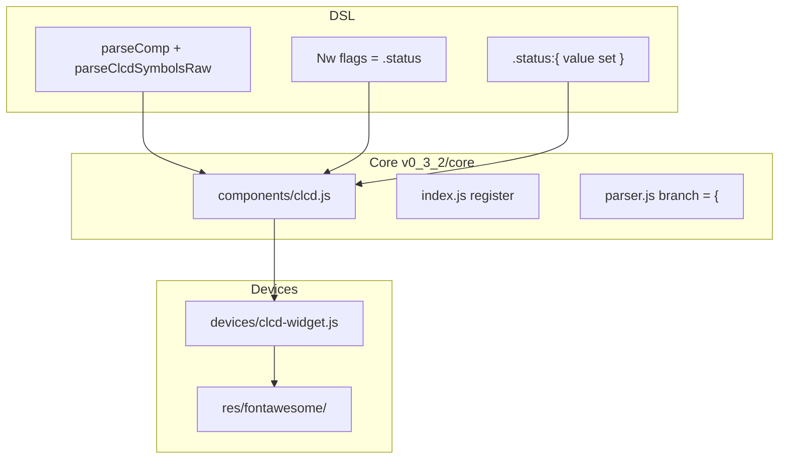

# Plan: componenta `comp [clcd]`

## Obiectiv

Implementare **CLCD (Custom LCD)** conform specificației furnizate: panou canvas cu simboluri predefinite (ON = `color`, OFF = `bgColor`), fiecare simbol legat de un bit sau un interval de biți. Culori globale la nivel de componentă + override opțional `color` / `bgColor` per simbol. Suport `doc()`, `show()`, `peek()`, `probe()` ca la `bar` / `slider` / `7seg`.

**Distinct de `comp [lcd]`** — `lcd` desenează matrice pixel cu font HD44780; `clcd` plasează simboluri iconografice la coordonate `(x, y)` pe un canvas fix.

---

## Decizii confirmate

| Subiect | Decizie |
|---------|---------|
| Font Awesome | CSS din [`ext/css/all.min.css`](ext/css/all.min.css) + **webfonts din pachetul oficial FA Free 5.15.4** în [`v0_3_2/res/fontawesome/`](v0_3_2/res/fontawesome/) |
| Lățime bus | Dinamică: `max(bitIndex) + 1` peste toate simbolurile; default **1 bit** dacă forma minimală `::` fără simboluri |
| **Mapare biți** | **Contiguă de la 0, fără goluri** — dacă se folosesc bitul 0 și bitul 2 dar nu bitul 1 → **eroare la parse/elaborare**; mulțimea biților referențiați trebuie să fie exact `{0, 1, …, max}` |
| Input | Atribuire directă `.status = flags` + property block `{ value = …; set = 1 }` (conform doc, **nu** `data` ca la `bar`) |
| Debug | `getRedirectProperties: ['get']` + `evalGetProperty` — `show(.status)`, `peek(.status)`, `probe(.status:get)` funcționează chiar dacă `doc(comp.clcd)` nu listează pin-uri (conform spec: `pins: []`, `pouts: []`) |
| Simboluri v1 | Setul din doc + `uart` (exemplul comm panel) ca alias FA |
| **Culori** | Atribute componentă: **`color`** (ON, default `^00ff00`) și **`bgColor`** (OFF, default `^000000`) — înlocuiesc `fg` / `bg` din spec inițial; aliniat cu `led`, `bar`, `7seg` |
| **Culori per simbol** | Opțional în blocul `= { }`, la același nivel cu `x`, `y`, `bit` / `bits`: `color:` și `bgColor:` (hex `^…`); dacă lipsesc → moștenesc valorile de la componentă |

### Atribute

**Nivel componentă** (în corpul `comp [clcd] .name:`):

| Atribut | Tip | Default | Rol |
|---------|-----|---------|-----|
| `width` | integer | 200 | Lățime canvas (px) |
| `height` | integer | 100 | Înălțime canvas (px) |
| `color` | color | `^00ff00` | Culoare ON (foreground) — default pentru toate simbolurile |
| `bgColor` | color | `^000000` | Culoare OFF (background) — default pentru toate simbolurile |
| `nl` | flag | off | Linie nouă după display |

**Nivel simbol** (în `= { symbolName: … : }`):

| Atribut | Tip | Obligatoriu | Rol |
|---------|-----|-------------|-----|
| `x`, `y` | integer | da | Poziție pe canvas |
| `bit` | integer | da* | Un singur bit de control |
| `bits` | range `N-M` | da* | Interval de biți (ex. `digit7`) |
| `color` | color | nu | Override culoare ON pentru acest simbol |
| `bgColor` | color | nu | Override culoare OFF pentru acest simbol |

\* exact unul din `bit` sau `bits`.

---

## Arhitectură



Pattern de referință: [`slider.js`](v0_3_2/core/components/slider.js) + [`slider-widget.js`](v0_3_2/devices/slider-widget.js) + [`character-lcd.js`](v0_3_2/devices/character-lcd.js) (canvas + `requestAnimationFrame`).

---

## Exemple LogTscript

Exemple de inclus în [`doc/clcd.md`](v0_3_2/doc/clcd.md) (cu `logts-play` unde e cazul) și reutilizate în teste.

### Formă minimală

```logts
comp [clcd] .panel::
```

Canvas gol 200×100 (default), bus 1 bit, fără simboluri.

### Status indicators (3 biți)

```logts
comp [clcd] .status:

  width: 200
  height: 60

  color: ^00ff00
  bgColor: ^001000

  = {

    power:
      x: 10
      y: 10
      bit: 0
    :

    wifi:
      x: 50
      y: 10
      bit: 1
    :

    warning:
      x: 90
      y: 10
      bit: 2
      color: ^ffaa00
      bgColor: ^332200
    :

  }
:

3wire flags = 101

.status = flags
```

Rezultat vizual: `power` ON, `wifi` OFF, `warning` ON (warning folosește culori proprii când e ON/OFF).

### Culori per simbol (override)

```logts
comp [clcd] .panel:

  color: ^00ff00
  bgColor: ^001000

  = {

    power:
      x: 10
      y: 10
      bit: 0
      color: ^ffffff
      bgColor: ^333333
    :

    error:
      x: 50
      y: 10
      bit: 1
      color: ^ff0000
      bgColor: ^220000
    :

  }
:

2wire state = 10
.panel = state
```

`power` moștenește culori custom; `error` roșu pe fundal închis; simbolurile fără `color`/`bgColor` folosesc default-ul componentei.

### Baterie + încărcare

```logts
comp [clcd] .battery:

  width: 120
  height: 50

  = {

    battery:
      x: 10
      y: 10
      bit: 0
    :

    charging:
      x: 60
      y: 10
      bit: 1
    :

  }
:

2wire state = 11

.battery = state
```

Ambele simboluri ON când `state = 11`.

### Panou comunicații

```logts
comp [clcd] .comm:

  width: 200
  height: 60

  = {

    uart:
      x: 10
      y: 10
      bit: 0
    :

    usb:
      x: 50
      y: 10
      bit: 1
    :

    ethernet:
      x: 90
      y: 10
      bit: 2
    :

  }
:

3wire links = 101

.comm = links
```

`uart` ON, `usb` OFF, `ethernet` ON.

### Cifră 7 segmente + punct zecimal

```logts
comp [clcd] .digit:

  width: 80
  height: 120

  = {

    digit7:
      x: 10
      y: 10
      bits: 0-6
    :

    dp:
      x: 60
      y: 10
      bit: 7
    :

  }
:

8wire value = 11111100

.digit = value
```

`digit7` consumă biții 0–6 (pattern segmente); `dp` folosește bitul 7.

### Mai multe cifre 7 segmente (același simbol, biți diferiți)

```logts
comp [clcd] .display:
  width: 160
  height: 80
  = {
    digit7: x:10 y:10 bits:0-6 :
    digit7: x:50 y:10 bits:7-13 :
    digit7: x:90 y:10 bits:14-20 :
  }
:

21wire val = 1111111000000111111100000
.display = val
```

Același nume de simbol (`digit7`) poate apărea de mai multe ori; fiecare intrare are propriile `x`, `y`, `bits`.

### Biți partajați între simboluri

```logts
comp [clcd] .linked:

  = {

    power:
      x: 10
      y: 10
      bit: 0
    :

    wifi:
      x: 50
      y: 10
      bit: 0
    :

  }
:

1wire link = 1

.linked = link
```

`power` și `wifi` se aprind/sting împreună (același bit 0).

### Property block (drive extern)

```logts
comp [clcd] .status:
  width: 200
  height: 60
  = { power: x:10 y:10 bit:0 : }
  on: 1
  :

3wire flags = 000

.status:{
  value = flags
  set = 1
}
```

Alternativă la `.status = flags` — pin `value` + `set` (nu `data` ca la `bar`).

### Debug — show / peek / probe

```logts
comp [clcd] .status:
  = { power: x:10 y:10 bit:0 : wifi: x:50 y:10 bit:1 : warning: x:90 y:10 bit:2 : }
  :

3wire flags = 101
.status = flags

show(.status)
peek(.status)
probe(.status:get)
```

- `show(.status)` — afișează `101` (redirect la `:get`)
- `peek(.status)` — la fel, fără amânare pe Wave
- `probe(.status:get)` — emite la fiecare schimbare: `# status:get = 101`

### doc()

```logts
doc(comp.clcd)
```

Output așteptat (primele linii):

```text
comp [clcd] .name:
  width: integer
  height: integer
  color: color
  bgColor: color
  nl
  = { symbol: x: integer y: integer bit: N bits: N-M color: color bgColor: color : }
  :{
  }
```

### Layout vizual (status panel)

```text
┌─────────────────────────┐
│ [POWER] [WIFI] [WARN]   │
│                         │
└─────────────────────────┘
```

Coordonatele `x`, `y` plasează fiecare simbol pe canvas; aspectul exact al iconițelor e definit de implementare (Font Awesome + segmente custom).

### Invalid — gol în maparea biților (eroare)

```logts
comp [clcd] .bad:

  = {

    power:
      x: 10
      y: 10
      bit: 0
    :

    warning:
      x: 90
      y: 10
      bit: 2
    :

  }
:
```

**Eroare așteptată** (la `comp` / elaborare):

```text
CLCD bit mapping must be contiguous from 0 with no gaps — unused bit 1
```

Biții `0` și `2` fără `1` nu sunt permisi. Valid: `bit: 0`, `bit: 1`, `bit: 2` sau `bits: 0-2` pe un singur simbol multi-bit.

---

## 1. Resurse Font Awesome (`v0_3_2/res/`)

Structură țintă:

```
v0_3_2/res/fontawesome/
  css/all.min.css          ← copiat din ext/css/all.min.css (5.15.4)
  webfonts/
    fa-solid-900.woff2
    fa-solid-900.woff
    fa-solid-900.ttf
    fa-regular-400.woff2    ← pentru simboluri regular dacă e nevoie
    fa-brands-400.woff2     ← bluetooth, usb
    (opțional .eot/.svg legacy)
```

În [`script_editor_v0_3_2.html`](v0_3_2/script_editor_v0_3_2.html):

```html
<link rel="stylesheet" href="res/fontawesome/css/all.min.css">
```

**Notă:** `ext/` singur nu e suficient — lipsește `webfonts/`; webfonts se iau din arhiva oficială [Font Awesome Free 5.15.4](https://fontawesome.com/download).

---

## 2. Parser — blocul `= { symbols }`

Extindere în [`parser.js`](v0_3_2/core/parser.js) la ramura `=` din `parseComp()` (~linia 2049), **înainte** de eroarea generică:

```javascript
} else if (this.c.type === 'SYM' && this.c.value === '{') {
  if (compType === 'clcd') {
    const bracePos = this.t.i - 1;
    initialValue = this.parseClcdSymbolsRaw(bracePos);
    continue;
  }
  throw Error(`Expected binary or decimal value after '=' ...`);
}
```

Funcție nouă `parseClcdSymbolsRaw(bracePos)` (model [`parseLutDataRaw`](v0_3_2/core/parser.js) ~2967):

- Parsează blocul până la `}`
- Fiecare simbol: `name:` … `x: N` `y: N` `bit: N` **sau** `bits: N-M` … opțional `color: ^…` `bgColor: ^…` … `:`
- Returnează `{ kind: 'clcdSymbols', symbols: [...] }` — fiecare simbol poate include `color` / `bgColor` (string hex, fără `#` sau cu normalizare la `#` în widget)
- Validări: nume simbol cunoscut, `x`/`y` integer, `bit` XOR `bits` (nu ambele), range `bits` cu `start <= end`, `color`/`bgColor` opționale (hex valid)
- **Validare contiguitate biți** (după parsare, înainte de return):
  1. Construiește mulțimea `used` = toți indicii referențiați (`bit` sau fiecare index din `bits: N-M`)
  2. Dacă `used` e goală (fără simboluri) → OK
  3. Altfel: `max = max(used)`; verifică `used.size === max + 1` și `used` conține fiecare `i` din `0..max`
  4. La eșec: `throw Error('CLCD bit mapping must be contiguous from 0 with no gaps — unused bit N')` (primul bit lipsă)

Helper reutilizabil în [`clcd.js`](v0_3_2/core/components/clcd.js):

```javascript
static validateContiguousBits(symbols) {
  const used = new Set();
  for (const s of symbols) {
    if (s.bit !== undefined) used.add(s.bit);
    else for (let i = s.bitsStart; i <= s.bitsEnd; i++) used.add(i);
  }
  if (used.size === 0) return;
  const max = Math.max(...used);
  for (let i = 0; i <= max; i++) {
    if (!used.has(i)) {
      throw Error(`CLCD bit mapping must be contiguous from 0 with no gaps — unused bit ${i}`);
    }
  }
}
```

Apelat din `parseClcdSymbolsRaw` (după listă completă) și din `finalizeCompInfo` / `getWidthBits` (apărare dublă).

Exemplu rezultat parsat:

```javascript
{ kind: 'clcdSymbols', symbols: [
  { name: 'power', x: 10, y: 10, bit: 0 },
  { name: 'warning', x: 90, y: 10, bit: 2, color: '#ffaa00', bgColor: '#332200' },
  { name: 'digit7', x: 10, y: 10, bitsStart: 0, bitsEnd: 6 },
]}
```

---

## 3. Core — [`v0_3_2/core/components/clcd.js`](v0_3_2/core/components/clcd.js)

```javascript
var ClcdComponent = class ClcdComponent extends BuiltinComponent {
  static get type() { return 'clcd'; }
  static get isReservedName() { return true; }

  getWidthBits(attributes, symbols) { /* max bit + 1 după validateContiguousBits; default 1 */ }
  getSupportedProperties() { return ['get']; }
  getRedirectProperties() { return ['get']; }

  getDef() {
    return {
      attrs: [
        { name: 'width', value: 'integer' },
        { name: 'height', value: 'integer' },
        { name: 'color', value: 'color' },
        { name: 'bgColor', value: 'color' },
        { name: 'nl', value: null },
      ],
      initValue: '{ symbol: x: integer y: integer bit: N bits: N-M color: color bgColor: color : }',
      pins: [],
      pouts: [],
      returns: null,
    };
  }
  // evalGetProperty, finalizeCompInfo, createDevice, applyProperties, updateDisplayValue
};
```

**Logică cheie:**

- `finalizeCompInfo` — `validateContiguousBits(symbols)`, stochează `symbols`, calculează `bitWidth = max + 1`, inițializează `lastValue`
- `createDevice` — rezolvă default-uri: `color = attributes.color || '#00ff00'`, `bgColor = attributes.bgColor || '#000000'`; pentru fiecare simbol, `sym.color ||= defaultColor`, `sym.bgColor ||= defaultBgColor`; apelează `addClcd({ id, width, height, color, bgColor, symbols, nl, initialBits })`
- `applyProperties` — `set` + `value` (pattern slider/bar, dar pin `value` nu `data`)
- `updateDisplayValue` — la `.status = wire`, actualizează canvas + `lastValue` + `comp.ref`
- `evalGetProperty` — returnează `lastValue` pentru `:get` / redirect

Înregistrare în [`index.js`](v0_3_2/core/components/index.js).

---

## 4. Device UI — [`v0_3_2/devices/clcd-widget.js`](v0_3_2/devices/clcd-widget.js)

Clasă `ClcdDisplay` (canvas):

| Responsabilitate | Detaliu |
|------------------|---------|
| Fundal canvas | `fillRect` cu `bgColor` global (zona neacoperită de simboluri) |
| Simboluri FA | Mapare nume → unicode + font family (`"Font Awesome 5 Free"` solid 900 / brands 400); `document.fonts.load()` înainte de primul draw |
| `digit7` | Desen segmente pe canvas — reutilizează maparea din [`seven-seg.js`](v0_3_2/core/components/seven-seg.js) `hexTo7Seg` inversat: biți 0-6 → segmente a-g |
| `digit14` | Segmente simplificate — pattern din [`14seg.js`](v0_3_2/core/components/14seg.js) |
| `dp`, `colon` | Forme geometrice simple (cerc / două puncte) |
| Stare ON/OFF | ON: `symbol.color` (sau default componentă); OFF: `symbol.bgColor` (sau default) |
| Rezolvare culori | `resolveSymbolColors(sym, compDefaults)` la draw — override per simbol > default componentă |
| Batching | `requestDraw()` + `requestAnimationFrame` ca `CharacterLCD` |

**Registru simboluri** (fișier `clcd-symbols.js` sau secțiune în widget):

| Simbol | Sursă |
|--------|-------|
| battery, power, warning, error, check, cross | FA solid |
| wifi, ethernet, antenna, chip, memory, clock | FA solid |
| bluetooth, usb | FA brands |
| arrowUp/Down/Left/Right, play, stop, pause, record | FA solid |
| uart | `fa-plug` sau `fa-exchange-alt` (exemplu comm) |
| digit7, digit14, dp, colon | Canvas custom |

Funcții globale: `addClcd()`, `setClcdBits(id, bitString)`, Map `clcdDisplays`.

CSS minimal în `script_editor_v0_3_2.html`:

```css
.clcd-wrapper { display: inline-block; margin: 4px; }
.clcd-wrapper canvas { display: block; border: 1px solid #333; }
```

Script tags: `clcd-widget.js` după `character-lcd.js`; `<link>` FA în `<head>`.

Editor: buton `insertComp('clcd')` în dropdown Displays; adaugă `'clcd'` în lista de tipuri rezervate (~linia 1572).

---

## 5. Teste — [`test_suite.js`](v0_3_2/test_suite.js) grup `clcd`, ID **1221–1235**

| ID | Test |
|----|------|
| 1337–1352 | Grup `clcd` (16 teste; ID-uri 1337–1352, după `bool-lut-use` 1221) |

Actualizare test **200** (`expectedTypes`) — adaugă `'clcd'`.

După teste: `node _gen_manifest.js`.

---

## 6. Documentație

| Fișier | Acțiune |
|--------|---------|
| [`v0_3_2/doc/clcd.md`](v0_3_2/doc/clcd.md) | Documentație completă (conținutul furnizat de tine, adaptat la implementare) |
| [`v0_3_2/doc/components.md`](v0_3_2/doc/components.md) | Rând nou în secțiunea Displays |
| [`v0_3_2/doc/doc-index.json`](v0_3_2/doc/doc-index.json) | `{ "file": "clcd.md", "label": "clcd" }` |
| `node _gen_doc_data.js` | Regenerare `ui/doc-data.js` |

Secțiune suplimentară în `clcd.md`: notă despre `res/fontawesome/`, diferența față de `lcd`, regula **biți contigui 0..max fără goluri**, și tabel atribute `color` / `bgColor` (global + per simbol).

---

## 7. Fișiere modificate (rezumat)

| Fișier | Tip |
|--------|-----|
| `v0_3_2/res/fontawesome/css/all.min.css` | nou (copiat) |
| `v0_3_2/res/fontawesome/webfonts/*` | nou (descărcat) |
| `v0_3_2/core/components/clcd.js` | nou |
| `v0_3_2/devices/clcd-widget.js` | nou |
| `v0_3_2/core/components/index.js` | modificat |
| `v0_3_2/core/parser.js` | modificat (`parseClcdSymbolsRaw`) |
| `v0_3_2/script_editor_v0_3_2.html` | modificat (link FA, script, CSS, insert) |
| `v0_3_2/test_suite.js` | modificat |
| `v0_3_2/doc/clcd.md` | nou |
| `v0_3_2/doc/components.md`, `doc-index.json` | modificat |
| `test_manifest.js`, `ui/doc-data.js` | regenerat |

---

## Riscuri / limitări

- **Canvas + webfont:** primul frame poate fi gol până la `document.fonts.ready` — widget așteaptă fontul înainte de draw inițial
- **`doc(comp.clcd)`:** va include blocul gol `:{ }` din `formatCompDef` (comportament existent) — diferit marginal de spec, dar acceptabil
- **Simboluri viitoare:** extensibile prin registru în `clcd-widget.js` fără schimbări parser
