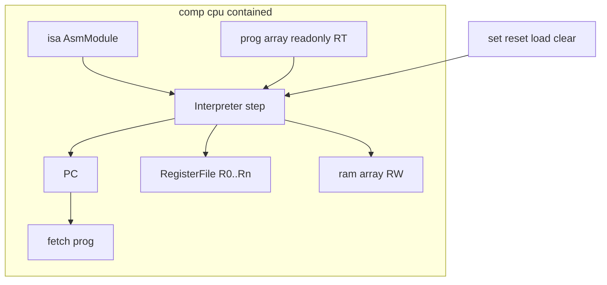
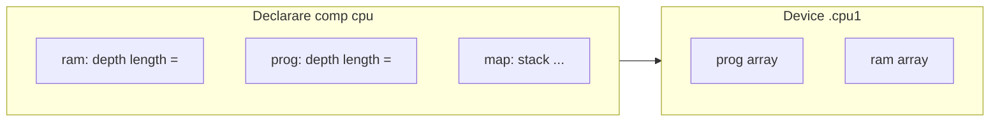

# Plan: `comp [cpu]` (contained + registre)

## Context și decizii

- Ecosistemul actual acoperă deja un CPU „adevărat” ca **board** ([mini-cpu-v2.md](../v0_3_2/doc/mini-cpu-v2.md)): Harvard, `inline [asm]`, `comp [mem]`, LUT, wave la fiecare `set`. [mini-cpu-plan.md](../v0_3_2/doc/mini-cpu-plan.md) spune explicit că **nu e nevoie de tipuri noi** pentru demo — dar tu ai ales **contained + registre**, ceea ce justifică un tip nou: interpretor + stare centralizată, nu alt board de 200+ linii.
- **Bus separat (`comp [bus]` sau `.cpu1:bus`)**: **nu în v1**. Pentru contained, CPU vorbește direct cu array-urile interne. Pentru legare externă (**faza 3**), pattern-ul existent e mai bun decât un bus generic: **binding** ca la [`ioport`](../v0_3_2/core/components/ioport.js) / `output = .term` — **`prog = .rom`**, **`ram = .data`** (instanțe `comp [mem]`). Bus-ul tristate rămâne pentru [zstate.md](../v0_3_2/doc/zstate.md) când vrei Von Neumann vizibil pe fire, nu în interpretor.
- **Set de instrucțiuni**: **nu duplicăm** ASM — rămâne [`inline [asm]`](../v0_3_2/doc/asm.md) + atribut `isa: .cpuisa`. Interpretorul citește **opcode layout** din modulul ASM (lățime cuvânt, segmente, mnemonici). `:decode` există deja pe instanța asm — CPU poate expune `decode` ca redirect sau alias `show(.cpu1:decode(ir))` prin `isa`.
- **„ROM dar nu chiar”**: spațiul **`prog`** e read-only la runtime (ca `readonly` pe [mem.md](../v0_3_2/doc/mem.md)): init/reload prin `=`, fără STORE accidental în prog. **RAM** e pentru date; după rulare inspectezi în principal RAM + registre. Execuția din RAM (Von Neumann) — vezi secțiunea dedicată; **nu** e implicit în v1.
- **Init `prog` din wire ASM**: același model ca la `comp [mem]` — orice expresie blob e validă la `=`:
  - inline: `= .cpuisa { … }`
  - wire preasamblat: `512wire myProg = .cpuisa { … }` apoi în `prog:` bloc `= myProg`
  - hex: `= ^…` (fără metadata `:decode` dacă nu vine din asm)
  Validări: `wordWidth === prog.depth`, număr instrucțiuni `<= prog.length`; dacă wire-ul e mai scurt decât `length`, restul sloturilor rămân 0 (ca la mem).



### Exemplu: `prog` din wire

```logts
inline [asm] .cpuisa:
  LOAD  : 0001 + R2b + A4b
  HALT  : 0111 + 4b
  :

512wire myProg = .cpuisa {
  LOAD R0 A0
  HALT
}

comp [cpu] .cpu1:
  isa: .cpuisa
  registers: 4
  prog:
    depth: 8
    length: 64
    = myProg
  ram:
    depth: 8
    length: 256
  :
```

`isa:` rămâne obligatoriu când vrei decode/trace pe mnemonici; un `= ^hex` merge fără asm dacă nu ai nevoie de `:decode`.

---

## Model de memorie și registre

| Spațiu | Rol | Init / reload | După run |
|--------|-----|---------------|----------|
| **prog** | Instrucțiuni (fetch implicit v1) | `= .isa { … }`, `= myProg`, sau `= ^hex` | citire slot `prog:get` + `show(.cpuisa:decode(word))`; protejat la scriere runtime |
| **ram** | Date, stack, **opțional** cod încărcat (faza 2) | `= ^hex` sau `resetRAM` | `peek` / `ram:get` pe `adr` |
| **registers** | R0..R(n-1) în device | `reset` → init (0 sau map) | pout `r0`..`rN` sau `probe(.cpu1:r2)` |
| **SP** | Registru dedicat sau alias | ex. `sp: 3` în map | la fel ca registrele |

### Program în RAM — ce înseamnă (clarificare)

| Întrebare | Răspuns planificat |
|-----------|-------------------|
| „Declar program în RAM?” | În **v1**, **nu** rulezi cod din RAM: **PC fetch-ează mereu din `prog`**. RAM = date (LOAD/STORE). |
| `JMP` către o adresă din RAM? | `JMP` / `BEQ` schimbă **PC**; dacă PC pointează în afara spațiului `prog` (ex. adresă RAM), în v1 = **eroare** sau NOP documentat — altfel ai impresia că „sari în RAM” dar fetch-ul tot din prog ar citi gunoi. |
| Ce vrei de obicei | **Copie program în `prog`** la start (`= myProg`); în RAM ții doar date. |
| **Faza 2 — execuție din RAM (v2)** | Atribut `fetch: ram` + `entry:` / `pcInit`: PC fetch din `ram[PC]`; programul poate fi scris în RAM la runtime. **v1: doar `fetch: prog` (implicit).** |
| Shortcut fără Von Neumann | Mnemonic **`BOOT`** / property **`.cpu1:loadRamToProg`** (copie interval RAM→prog) — util dacă vrei „program generat în RAM” fără fetch din RAM. |

**Concluzie pentru tine acum:** super-util ca **date** și eventual **buffer** pentru cod; **execuție din RAM** = faza 2 (`fetch: ram`) sau copie explicită în `prog`, nu doar `JMP` în programul principal.

**Stack (software, recomandat v1):** nu `comp [stack]` hardware în interior — prea diferit de modelul wave. În schimb:

- `map.stackTop: 255` (sau ultima adresă RAM) — SP decrementează la push;
- mnemonici viitoare `PUSH R1` / `POP R1` în profilul ISA sau pseudo-op implementate în interpretor;
- alternativ: instrucțiuni existente `STORE`/`LOAD` + convenție documentată („stack la 0xF0..FF”).

**Heap (faza 1.5):** zonă RAM `[heapBase .. heapEnd]` + registru `hp` (opțional); fără allocator real în v1 — suficient pentru laboratoare „malloc simplu”. Algoritmi grei rămân pe [`comp [heap]`](../v0_3_2/doc/conditional-assignment.md) în script LogTScript separat, nu în CPU.

**Mapare registre ↔ ASM:** câmpurile `R2b` din asm înseamnă index 0..3; CPU validează la load că `registers >= max(R)+1`. Opțional aliasuri în bloc:

```logts
comp [cpu] .cpu1:
  isa: .cpuisa
  registers: 4
  sp: 3
  ram:
    depth: 8
    length: 256
  prog:
    depth: 8
    length: 64
    = .cpuisa {
      LOAD R0 A0
      ADDI R1 \1
      HALT
    }
  map:
    stack: 240
  :
```

(Sintaxa `ram`/`prog` — vezi secțiunea **Decizie sintaxă** mai jos.)

### Decizie sintaxă: `ram:` / `prog:` — **confirmat (faza 1)**

**Intern (contained)** — sub-blocuri imbricate (Varianta A, implementată):

```logts
comp [cpu] .cpu1:
  isa: .cpuisa
  registers: 4
  ram:
    depth: 8
    length: 256
    = ^00
  prog:
    depth: 8
    length: 64
    = myProg
  map:
    stack: 240
  :
```

- Pro: lizibil, același model mental ca `mem` (depth/length/`=` în același loc).
- Sub-blocurile **nu** creează `comp [mem]` în graf; un device CPU deține `prog[]` / `ram[]` în `cpu-devices.js`.

**Extern (faza 3)** — binding canonic (fără `mode:` global):

```logts
comp [mem] .rom:
  depth: 8
  length: 64
  readonly: 1
  = myProg
  on: raise
  :

comp [mem] .data:
  depth: 8
  length: 256
  = ^00
  on: raise
  :

comp [cpu] .cpu1:
  isa: .cpuisa
  registers: 4
  prog = .rom
  ram = .data
  :
```

| Regulă | Detaliu |
|--------|---------|
| Formă | **`prog = .component`**, **`ram = .component`** (`bindingAttrs`, ca `output = .term`) |
| Țintă | Obligatoriu **`comp [mem]`** (același API `adr` / `get` / `data` / `write`) |
| Per spațiu | **Fie** sub-bloc intern (`depth`, `length`, `=` opțional), **fie** binding `= .mem` — **nu ambele**, nu niciunul |
| Combinații | prog intern + ram intern; prog intern + ram extern; prog extern + ram intern; ambele externe |
| Semantica CPU | Identică: fetch din spațiul program, LOAD/STORE în spațiul ram, `pcInit`, reload prog, HALT, `set`/`run`, `fetch: ram` |
| Execuție | În `step`/`run`, interpretorul citește/scrie memoria legată **sincron** (apel handler `mem`), fără a cere wave între instrucțiuni |
| Reload | `.cpu1:prog = …` rescrie spațiul program (array intern sau delegare la `.rom = …`); **PC ← pcInit**, **halted ← 0** |
| Init în sub-bloc | Când spațiul e legat extern, **nu** pui `depth`/`length`/`=` pe CPU pentru acel spațiu — init pe instanța `mem` |

**Varianta B — atribute plate** — respinsă (rămâne istoric):

```logts
comp [cpu] .cpu1:
  isa: .cpuisa
  registers: 4
  ramDepth: 8
  ramLength: 256
  progDepth: 8
  progLength: 64
  = myProg
  :
```

- Pro: fără parser nou pentru imbricare; `=` la nivelul CPU poate însemna doar init prog.
- Contra: mai puțin elegant — **nefolosit**.

### Varianta A (intern) — cum interacționezi

Sub-blocurile **nu** creează `comp [mem]` copii în script. Parserul le transformă în obiecte pe instanța **`.cpu1`** (ex. `attributes.prog.depth`, blob init); **un singur device CPU** deține array-urile `prog[]` și `ram[]` în `cpu-devices.js`.



#### 1. Declarare (o dată)

```logts
comp [cpu] .cpu1:
  isa: .cpuisa
  registers: 4
  pcInit: 0
  ram:
    depth: 8
    length: 256
    = ^00
  prog:
    depth: 8
    length: 64
    = myProg
  map:
    stack: 240
  :
```

- **`ram:` / `prog:`** — setează dimensiuni + init opțional (`=` ca la `mem`).
- **`map:`** — doar convenții (adresă stack etc.), fără blob.
- După parse + `createDevice`: încărcare blob, **PC ← pcInit**, **halted ← 0**.

#### 2. Reload / rescriere la runtime (ca la mem, dar pe „membru”)

| Acțiune | Sintaxă propusă | Efect |
|---------|-----------------|--------|
| Program nou | **`.cpu1:prog = .cpuisa { … }`** sau **`= myProg`** / **`= ^hex`** | Rescrie `prog[]`; **PC ← pcInit**; **halted ← 0** |
| Imagine RAM nouă | **`.cpu1:ram = ^…`** | Zero + scriere de la 0 (ca `.mem =`); **nu** atinge PC/registre |
| Init doar la declarare | `prog:` / `ram:` cu `=` în bloc | La fel ca la create |

Implementare: `CpuComponent.handleDirectAssign` distinge target **`prog`** vs **`ram`** (parser: assign pe `.cpu1:prog` — extensie față de `.mem =` simplu).

#### 3. Citire / debug (property block + **pout** — mirror `comp [mem]`)

Ca la [mem.md](../v0_3_2/doc/mem.md): în property block pui **adresa** (pin); **citirea** e **pout** `get`, nu flag în block.

| Spațiu | Pin (property block) | Pout |
|--------|----------------------|------|
| **RAM** | `ramAdr` | **`ram:get`** (sau alias documentat `ramGet` = același pout) |
| **prog** | `progAdr` | **`prog:get`** |

```logts
.cpu1:{
  ramAdr = 10
  set = 1
}
8wire cell = .cpu1:ram:get

.cpu1:{
  progAdr = 2
  set = 1
}
8wire word = .cpu1:prog:get
show(.cpuisa:decode(word))

probe(.cpu1:pc)
probe(.cpu1:instr)
probe(.cpu1:r0)
```

**Nu** `ramGet = 1` în block — `ram:get` / `prog:get` sunt **pout-uri** (citire în expresie sau `probe(.cpu1:ram:get)` după ce ai setat `ramAdr` în același pas / block).

#### 4. Ce **nu** faci cu sub-blocurile

| Nu | De ce |
|----|--------|
| `comp [mem] .x` separat legat manual | Contained = totul în CPU |
| `.cpu1:ram:{ write … }` în același stil hardware port | v1: CPU interpretează LOAD/STORE intern; extern doar peek |
| Rescrie `prog` din property block fără `=` | Reload = assign **`.cpu1:prog = …`** sau init la declarare |

#### 5. Lucru parser (tehnic, v1)

- La `comp [cpu]`, după `attrName` (`ram`, `prog`, `map`), dacă urmează **`:`**, parsezi un **mini-bloc de atribute** până la `:` de închidere (aceeași ierarhie indent ca `clcd` / `=` map).
- Rezultatul e JSON-like pe `attributes.ram` / `attributes.prog`, nu nod AST `comp` copil.

---

## Ciclu de viață (pornire, repornire, ștergere)

### Pini și clock

| Pin / atribut | Nume în plan | Comportament |
|---------------|--------------|--------------|
| **Clock / step** | `set` | La **front activ** (`on: raise` / `on: 1`, ca la alte `comp`): **exact un** ciclu fetch-decode-execute. E echivalentul „clock”-ului din mini-cpu-v2 (`board` `exec: set`). |
| **Reset global** | **`reset`** (pin) | Resetează subsistemele listate în atributul **`onReset:`** (vezi mai jos). Nu e același lucru cu reseturile granulare din property block. |
| **Run rapid** | `run` (faza 1 sau 2) | Ține `set` logic intern până la HALT / `maxSteps` / `reset`. |

**Legare oscilator:** două variante echivalente (ca în restul limbajului):

1. **Wiring explicit** (mereu valid): `comp [osc] .clk:` … apoi `.cpu1:{ set = .clk:get }` sau fire în `board`.
2. **Atribut de legare (ergonomic, de implementat):** `clock: .clk` în declarația CPU (`bindingAttrs`, ca `isa:`) — la fiecare puls de la osc, CPU face un `step` automat când `on: raise`.

Nu înlocuim pinul `set`; `clock: .osc` e doar sugar pentru a nu repeta property block-ul.

### Reseturi granulare (property block) — înlocuiește `clearRam`

În același spirit ca `counter` (`data`, `set`, `write`), CPU expune **flag-uri de reset** în property block (nu neapărat pini separați în v1):

```logts
.cpu1:{
  resetPC   = 1
  resetRegs = 1
  resetRAM  = 1
  resetSP   = 1
  resetHalted = 1
  set = 1
}
```

| Flag (`= 1`) | Efect |
|--------------|--------|
| **`resetPC`** | PC ← **`pcInit`** (atribut pe componentă, default `0`; vezi mai jos) |
| **`resetRegs`** | R0..Rn ← init (0 sau map viitor) |
| **`resetRAM`** | toate celulele RAM ← 0 (**înlocuiește** `clearRam` — nu mai expunem `clearRam`) |
| **`resetSP`** | SP ← `map.stackTop` sau `spInit` |
| **`resetHalted`** | iese din HALT (`halted` ← 0) |

**Ordine într-un block:** mai întâi reseturile cerute (toate flag-urile `1`), apoi **`set = 1`** (un pas), dacă e prezent.

Exemplu doar repornire PC fără pas: `.cpu1:{ resetPC = 1 }` (fără `set`).

**Pin `reset`:** echivalent convenabil la un subset fix definit de **`onReset:`** la declarare, ex. `onReset: pc, regs, sp, halted` (implicit **fără** `ram`, ca la reload).

### `pcInit` (valoare PC la reset)

| Mecanism | Rol |
|----------|-----|
| **`pcInit: N`** | Index în **`prog`** (default `0`). Folosit la **`resetPC`**, pin **`reset`** (dacă `onReset` include `pc`), și **automat la reload program** (vezi mai jos). Ex. `pcInit: 4` pentru entry `main`. |

Nu există atribut **`onReloadReset`** — utilizatorul alege manual ce resetează prin property block (`resetRAM`, `resetRegs`, …).

### Reload program — reguli explicite

La fel ca [mem.md](../v0_3_2/doc/mem.md) pentru `.mem = value`:

| Formă | Efect |
|-------|--------|
| `.cpu1:prog = .cpuisa { … }` | Sloturi `prog` → 0, apoi scrie blob de la 0 |
| `.cpu1:prog = myProg` | La fel, din wire |
| `.cpu1:prog = ^hex` | Blob brut |

**După orice reload program (obligatoriu, fără configurare):**

- **PC ← `pcInit`** — nu continuă niciodată de unde a rămas.
- **`halted ← 0`** — program nou poate primi clock imediat (fără `resetHalted` manual).
- **RAM, registre, SP** — **neschimbate** (utilizatorul dă `resetRAM` / `resetRegs` / etc. dacă vrea).

Init la declarare (`prog:` cu `=` în `comp [cpu]`): aceeași regulă — după încărcare blob, **PC ← `pcInit`**.

### HALT

| Element | Rol |
|---------|-----|
| **Instrucțiune `HALT` în ISA** | Execută un pas normal; la final CPU intră în stare oprită. |
| **pout `halted`** | **`1`** cât timp CPU e oprit pe HALT; **`0`** după `reset` sau după primul `set` valid dacă documentăm „resume” (recomandare: **rămâne 1** până la `reset` — mai clar pentru elevi). |
| **pout `pc`** | Rămâne la indexul instrucțiunii `HALT` (util la `probe`). |
| **Pin `set` cât e halted** | **Ignorat** (no-op) — default ca să nu avanseze accidental. |
| **pout `instr`** | Ultimul **cuvânt de instrucțiune** fetch-uit (N biți, valoare brută — **nu** text). Nume ales în loc de `ir` (prea apropiat de hardware IR). Text mnemonics: `show(.cpuisa:decode(.cpu1:instr))`. Lățime = `prog.depth`. |

Nu e nevoie de pin separat `halt` — starea e vizibilă pe `halted`.

### Inspectare post-run

- **Registre:** `probe(.cpu1:r2)`, pout-uri `r0`…
- **RAM:** `.cpu1:{ ramAdr = …, set = 1 }` apoi **`8wire x = .cpu1:ram:get`** sau `probe(.cpu1:ram:get)`
- **Prog:** `.cpu1:{ progAdr = n }` + `prog:get`, sau `show(.cpuisa:decode(word))`

### Trace — cum funcționează (debugger vs Signal Trace vs terminal)

Trei roluri **distincte** — nu le amestecăm într-un singur canal:

| Rol | Ce arată | Unde apare | Cine îl produce |
|-----|----------|------------|-----------------|
| **A. Trace CPU (debugger)** | La fiecare `set`: `pc`, `instr` (biți), opțional decode + delta registre | Vezi modurile mai jos | Atribut **`trace:`** pe `comp [cpu]` |
| **B. Signal Trace / watch** | Evoluția semnalelor în timp (formă de undă / listă engine) | Panou **Signal Trace** (Win → Signal Trace) sau **`watch(...)`** | Engine existent + (opțional) evenimente `state` de la CPU |
| **C. Output program** | Text „de la program” (PRINT, mesaj la HALT, etc.) | **`comp [terminal]`** + atribut **`output:`** (faza 2) | ISA / device CPU |

#### A. Atribut `trace:` pe CPU (nu e pin)

**`trace:`** se scrie doar în **declarația** `comp [cpu]` (ca `isa:`, `pcInit:`), **nu** în property block ca `set`/`resetPC`. Nu există pin `trace`.

**O singură valoare** — variantele se exclud reciproc:

| Valoare | Trace activ? | Buffer intern | Unde apare fiecare pas |
|---------|--------------|---------------|-------------------------|
| **`off`** (implicit) | nu | — | — |
| **`on`** | da | da | doar buffer; citești cu `show(.cpu1:trace)` sau pout/property **`trace:get`** |
| **`output`** | da | da | buffer **+** echo în panoul **Output** (ca probe controlat) |
| **`.dbg`** (referință `comp [terminal]`) | da | da | buffer **+** append la terminalul `.dbg` (linii cu prefix `# ` pentru debug) |

Exemple:

```logts
comp [cpu] .cpu1:
  trace: off
  :

comp [cpu] .cpu2:
  trace: on          # doar buffer
  :

comp [cpu] .cpu3:
  trace: output       # buffer + Output
  :

comp [terminal] .dbg::
comp [cpu] .cpu4:
  trace: .dbg         # buffer + terminal .dbg (NU înseamnă „off”)
  :
```

**`trace: .dbg`** nu înlocuiește `on`/`off` — e modul „**on + sink terminal**”. Dacă vrei fără trace, folosești explicit **`trace: off`**.

Property block-ul rămâne pentru **clock și reseturi**, nu pentru trace:

```logts
.cpu1:{ set = .clk:get }           # pas
.cpu1:{ resetPC = 1, resetHalted = 1 }   # reset granular
```

Format linie (exemplu):

```text
# step 7  pc=3  instr=00010111  LOAD R0 A0  r0:00→05
```

- `instr` = valoarea brută (același sens ca pout **`instr`**).
- Partea textuală folosește `isa:decode` când există AsmModule.

**Nu** înlocuiește Signal Trace: e un **jurnal semantic de CPU** (mnemonics), nu `commit wire = …`.

#### B. Signal Trace și `watch` — „listen” fără atribut `trace`

Deja util **fără cod nou în CPU** (documentăm în `cpu.md`):

```logts
watch(.cpu1:pc)
watch(.cpu1:instr)
watch(.cpu1:r0)
```

- **`watch`**: grafic / listă per canal — ideal să „asculți” PC și registre la fiecare pas când dai clock manual.
- **Signal Trace ON**: în **faza 2**, opțional `trace: signalTrace` sau mereu când trace≠off — CPU emite linii tip **`state .cpu1.pc = …`** (filter **Components** / **Internals**), aliniat la [debug.md — Signal Trace](../v0_3_2/doc/debug.md). Asta e integrarea cu „listen”, nu redirecționarea întregului jurnal mnemonic acolo (prea zgomotos pentru L1 wire).

**Recomandare:** v1 = **`trace: on`** (buffer + Output) + doc **`watch(.cpu1:*)`**; v2 = hook opțional în Signal Trace pentru power users.

#### C. Terminal — **`output:`** (program), separat de **`trace:`**

[mini-cpu-v2](../v0_3_2/doc/mini-cpu-v2.md) leagă terminal la HALT — **output de demo**, nu trace pas-cu-pas.

```logts
comp [terminal] .screen:
  rows: 10
  :

comp [terminal] .dbg::

comp [cpu] .cpu1:
  trace: .dbg              # jurnal debugger → .dbg
  output: .screen          # faza 2: text emis de program (OUT / syscall)
  :
```

- **`output: .screen`** — binding la terminal (**doar scriere**; terminalul nu e input). **`input:`** pentru tastatură / port — **viitor**, nu în v1.
- **`trace: .dbg`** — doar linii de debug de la CPU (prefix `# `), nu output-ul elevului.
- Fără `output:`, wiring manual în board (pattern v2) rămâne valid.

#### Rezumat recomandare

| Nevoie | Folosește |
|--------|-----------|
| „Ce a executat CPU-ul?” | `trace: on`, `trace: output`, sau `trace: .dbg` |
| „Cum evoluiază PC/registrele?” | `watch(.cpu1:pc)` etc. |
| „Ce a printat programul?” | `output: .screen` (faza 2) sau terminal manual |
| Debug propagare wave | Signal Trace (separat de CPU) |

Trace **nu** schimbă semantica execuției. MVP faza 1: **`trace: off | on | output`** + `trace:get`; **`trace: .dbg`** și **`output:`** în faza 2.

---

## Profil ISA v1 (pe baza registrelor)

Pornește de la opcode-urile din mini-cpu-v2, extinse pentru **R2b** (nu doar ACC):

- `LOAD Rd, A` / `STORE Rs, A` — mem[RAM]
- `ADDI Rd, imm` / `SUBI` — ALU pe registru
- `JMP` / `BEQ` — ca în v2 (`A4b` / `S4b`)
- `MOV Rd, Rs` — dacă nu vrei să supraîncarci ADDI
- `HALT`, `NOP`

Implementare: tabel **micro-op** în `cpu-devices.js` (nu LUT wave). Decode: citește cuvânt la `PC`, potrivește primul mnemonic din modulul asm (sau map opcode fix dacă profilul e „builtin harvard8”).

**Registru vs ComponentRegistry:** „registry” din conversație = **register file**, nu `ComponentRegistry`. Legătura cu ASM e prin **AsmModule** (metadata `:decode`, segmente) deja creat la asamblare ([asm-composition.md](../v0_3_2/doc/asm-composition.md)).

---

## Implementare tehnică (fișiere)

| Fișier | Rol |
|--------|-----|
| [core/components/cpu.js](../v0_3_2/core/components/cpu.js) | `CpuComponent`: pins/pouts, `bindingAttrs: ['isa']`, property blocks |
| [devices/cpu-devices.js](../v0_3_2/devices/cpu-devices.js) | Stare: prog[], ram[], regs[], PC, flags, `step()`, `reset()` |
| [devices/device-maps.js](../v0_3_2/devices/device-maps.js) | Map `cpus` per RunContext |
| [core/components/index.js](../v0_3_2/core/components/index.js) | `register(CpuComponent)` |
| [core/parser.js](../v0_3_2/core/parser.js) | Sub-blocuri `ram:`/`prog:`/`map:` dacă nu merg doar cu atribute plate |
| [core/interpreter.js](../v0_3_2/core/interpreter.js) | Init prog din asm blob; validări wordWidth |
| [doc/cpu.md](../v0_3_2/doc/cpu.md) | API complet — **tabele valori** (secțiunea de mai jos), `doc(comp.cpu)`, contrast mini-cpu-v2 |
| Teste în [tests/test_suite.js](../v0_3_2/tests/test_suite.js) | step, LOAD/STORE, HALT, resetRAM/resetPC, prog reload → PC=pcInit |

Pattern de referință pentru device stateful: [`terminal.js`](../v0_3_2/core/components/terminal.js) + device maps; pentru mem API: [`mem.js`](../v0_3_2/core/components/mem.js).

---

## Documentație obligatorie (`doc/cpu.md` + `doc(comp.cpu)`)

La livrare **nu omit** tabelele de valori — același stil ca [terminal.md](../v0_3_2/doc/terminal.md) / [mem.md](../v0_3_2/doc/mem.md). Checklist conținut:

### Atribute declarare

| Atribut | Valori / tip | Default | Documentează |
|---------|----------------|---------|--------------|
| **`isa`** | `.asmInstance` | — | obligatoriu pentru decode/trace mnemonic |
| **`registers`** | int N | 4 | R0..R(N-1), legătură `R2b` |
| **`sp`** | int (index registru) | opțional | alias SP |
| **`pcInit`** | int (index prog) | 0 | `resetPC`, pin `reset`; **mereu** la `.cpu1:prog = …` |
| **`onReset`** | listă: `pc`, `ram`, `regs`, `sp`, `halted` sau `all` / `none` | `pc, regs, sp, halted` (fără ram) | pin **`reset`** |
| **`trace`** | `off` /| `on` /| `output` /| `.terminal` | `off` | **nu e pin**; tabel sink (buffer / Output / terminal) |
| **`output`** | `.terminal` | — | faza 2; program → terminal |
| **`fetch`** | `prog` /| `ram` | `prog` | v1 vs v2 Von Neumann |
| Sub-bloc **`ram:`** | `depth`, `length`, `=` init | — | intern; **sau** omit + **`ram = .data`** (faza 3) |
| Sub-bloc **`prog:`** | `depth`, `length`, `=` asm/wire/hex | — | intern; **sau** omit + **`prog = .rom`** (faza 3) |
| **`prog =`** | `.mem` | — | faza 3; binding program → `comp [mem]` |
| **`ram =`** | `.mem` | — | faza 3; binding date → `comp [mem]` |
| Sub-bloc **`map:`** | `stack`, etc. | — | convenții adresă |

### Pini, pout-uri, property block

| Nume | Tip | Documentează |
|------|-----|--------------|
| **`set`** | pin | un ciclu = un pas (clock); exemplu `.cpu1:{ set = .clk:get }` |
| **`reset`** | pin | aplică `onReset` |
| **`run`** | pin | faza 2; buclă până HALT / maxSteps |
| **`pc`**, **`halted`**, **`instr`**, **`r0`…** | pout | stare CPU |
| **`ram:get`**, **`prog:get`** | pout | după `ramAdr` / `progAdr` + `set` în property block (ca `mem`) |
| **`ramAdr`**, **`progAdr`**, **`set`** | property / pin | adresă pentru peek prog/ram |
| **`resetPC`**, **`resetRAM`**, **`resetRegs`**, **`resetSP`**, **`resetHalted`** | property flags | ordine: reseturi apoi `set` |
| **`trace:get`** | pout/property | dump buffer trace |
| Reload | `.cpu1:prog = …` | rescrie prog; **PC ← pcInit** + **halted ← 0**; RAM/regs/SP neschimbate |

### Secțiuni doc suplimentare

- **Trace vs `watch` vs Signal Trace vs `output:`** — rezumat din plan (3 roluri).
- **`show(.cpuisa:decode(.cpu1:instr))`** — exemplu runnable `logts-play`.
- **Related:** [asm.md](../v0_3_2/doc/asm.md), [mini-cpu-v2.md](../v0_3_2/doc/mini-cpu-v2.md), [debug.md](../v0_3_2/doc/debug.md).
- Actualizare **`doc-index.json`**, [components.md](../v0_3_2/doc/components.md), **`CpuComponent.formatInstanceDoc`** / pipeline `_gen_doc_data.js` ca la celelalte `comp`.

---

## Faze livrabile

**Faza 1 — MVP contained**

- `isa`, `registers`, `ram`, `prog`, `set`, **`reset`**, pout `pc`/`halted`/**`instr`**/`r*`
- Init prog: `= .cpuisa { }`, **`= myProg`**, `= ^hex`
- reseturi manuale `resetPC` / `resetRAM` / `resetRegs` / `resetSP` / `resetHalted`; **`pcInit`**; reload prog **forțează PC ← pcInit**
- Profil ISA registre (LOAD/STORE/ADDI/HALT/JMP minim)
- **`trace: off | on | output`** + `trace:get`
- Doc + 6–10 teste (**inclusiv checklist tabele de mai sus în `cpu.md`**)

**Faza 2 — Von Neumann + ergonomie** (livrată)

- **`fetch: ram`** (sau `fetch: 1`) — PC citește instrucțiuni din array-ul **intern** `ram[]`, nu din `prog[]` (Von Neumann contained; test 2594)
- `run` + `maxSteps`; `onReset:`; `clock:` (parse); `map.stack` + PUSH/POP; `trace` / `output = .terminal`
- `doc(.cpu1)` — parțial în `cpu.md` (runnable `logts-play`)

**Faza 3 — legare memorie per spațiu** (livrată)

- **`prog = .rom`**, **`ram = .data`** — binding la `comp [mem]`; combinații intern/extern independente
- `cpu-devices.js`: `getMem` / `setMem` pentru spații legate; intern neschimbat
- Validare: nu combina sub-bloc + binding; depth prog/ram aliniat
- Teste **2600–2604** în `test_suite.js`

**Încă out of scope (nu e pe roadmap CPU contained)**

- **`comp [cpu]` ca CPU „wave/hardware”** — nu există atribut `mode: wave` pe `comp [cpu]`; fetch/decode/execute rămân în interpretor JS. Pentru PC/LUT/mem pe fire la fiecare puls, folosești **`board +[cpu4v2]`** ([mini-cpu-v2.md](../v0_3_2/doc/mini-cpu-v2.md)). Scripturile cu `comp [cpu]` pot rula cu propagare **wave** în editor (ca orice alt `comp`), dar CPU-ul nu devine un board.
- **DMA, IRQ**
- **Heap cu allocator în nucleul CPU** (rămâne `comp [heap]` + convenții RAM)

---

## Recomandare sintetică la întrebările tale

- **Legare memorie:** faza 1–2 intern (sub-blocuri); faza 3 **`prog = .rom`** / **`ram = .data`** independent per spațiu.
- **Bus:** intern nu adaugă valoare la contained; extern folosește ZSTATE doar în designuri board, nu în interpretor.
- **ASM:** suficient ca **definiție + blob**; interpretorul trebuie doar **decode executabil** (și poate reutiliza segment parser din assembler).
- **Stack:** registru SP + zonă RAM în `map`, nu LIFO hardware în CPU.
- **Heap:** convenție de adrese în RAM; componenta `heap` separată pentru algoritmi, nu în nucleul CPU.
- **Pornire/oprire:** `reset` + `set` (un pas, ca clock) sau `run`; `clock: .osc` opțional; program în `prog` (wire sau asm); RAM pentru date; execuție din RAM în faza 2.
