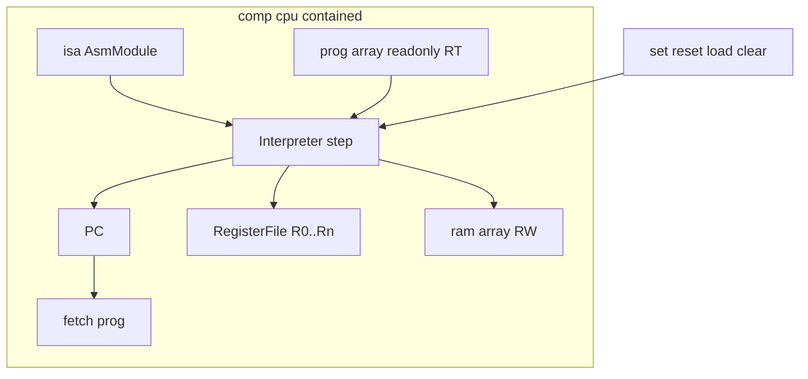
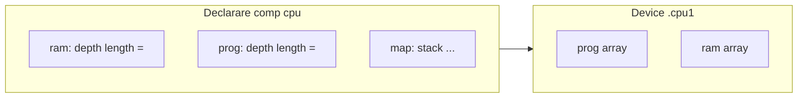
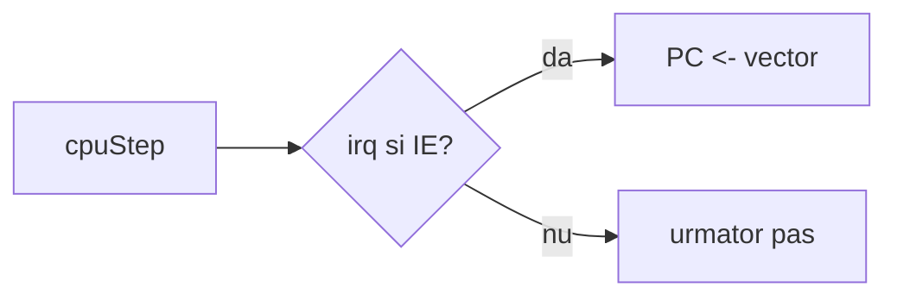
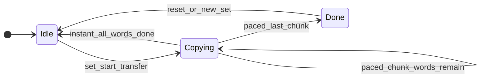

# Plan: `comp [cpu]` (contained + registre)

## Context și decizii

- Ecosistemul actual acoperă deja un CPU „adevărat” ca **board** ([mini-cpu-v2.md](../v0_3_2/doc/mini-cpu-v2.md)): Harvard, `inline [asm]`, `comp [mem]`, LUT, wave la fiecare `set`. [mini-cpu-plan.md](../v0_3_2/doc/mini-cpu-plan.md) spune explicit că **nu e nevoie de tipuri noi** pentru demo — dar tu ai ales **contained + registre**, ceea ce justifică un tip nou: interpretor + stare centralizată, nu alt board de 200+ linii.
- **Bus separat (`comp [bus]` sau `.cpu1:bus`)**: **nu în v1**. Pentru contained, CPU vorbește direct cu array-urile interne. Pentru legare externă (**faza 3**), pattern-ul existent e mai bun decât un bus generic: **binding** ca la [`ioport`](../v0_3_2/core/components/ioport.js) / `output = .term` — **`prog = .rom`**, **`ram = .data`** (instanțe `comp [mem]`). Bus-ul tristate rămâne pentru [zstate.md](../v0_3_2/doc/zstate.md) când vrei Von Neumann vizibil pe fire, nu în interpretor.
- **Set de instrucțiuni**: **nu duplicăm** ASM — rămâne [`inline [asm]`](../v0_3_2/doc/asm.md) + atribut `isa: .cpuisa`. Interpretorul citește **opcode layout** din modulul ASM (lățime cuvânt, segmente, mnemonici). `:decode` există deja pe instanța asm — CPU poate expune `decode` ca redirect sau alias `show(.cpu1:decode(ir))` prin `isa`.
- **„ROM dar nu chiar”**: spațiul **`prog`** e read-only la runtime (ca `readonly` pe [mem.md](../v0_3_2/doc/mem.md)): init/reload prin `=`, fără STORE accidental în prog. **RAM** e pentru date; după rulare inspectezi în principal RAM + registre. Execuția din RAM (Von Neumann) — vezi secțiunea dedicată; **nu** e implicit în v1.
- **Init `prog` din wire ASM**: același model ca la `comp [mem]` — orice expresie blob e validă la `=`:
  - inline: `= .cpuisa { … }`
  - wire preasamblat: `512wire myProg = .cpuisa { … }` apoi în `prog:` bloc `= myProg`
  - hex: `= ^…` (fără metadata `:decode` dacă nu vine din asm)
  Validări: `wordWidth === prog.depth`, număr instrucțiuni `<= prog.length`; dacă wire-ul e mai scurt decât `length`, restul sloturilor rămân 0 (ca la mem).


```mermaid
flowchart TB
  subgraph cpuDevice [comp cpu contained]
    ISA[isa AsmModule]
    PC[PC]
    RF[RegisterFile R0..Rn]
    PROG[prog array readonly RT]
    RAM[ram array RW]
    EXE[Interpreter step]
    ISA --> EXE
    PC --> FETCH[fetch prog]
    PROG --> EXE
    EXE --> RF
    EXE --> RAM
    EXE --> PC
  end
  User[set reset load clear] --> EXE
```

### Exemplu: `prog` din wire

```logts
inline [asm] .cpuisa:
  LOAD  : 0001 + R2b + A4b
  HALT  : 0111 + 4b
  :

512wire myProg = .cpuisa {
  LOAD R0 A0
  HALT
}

comp [cpu] .cpu1:
  isa: .cpuisa
  registers: 4
  prog:
    depth: 8
    length: 64
    = myProg
  ram:
    depth: 8
    length: 256
  :
```

`isa:` rămâne obligatoriu când vrei decode/trace pe mnemonici; un `= ^hex` merge fără asm dacă nu ai nevoie de `:decode`.

---

## Model de memorie și registre

| Spațiu | Rol | Init / reload | După run |
|--------|-----|---------------|----------|
| **prog** | Instrucțiuni (fetch implicit v1) | `= .isa { … }`, `= myProg`, sau `= ^hex` | citire slot `prog:get` + `show(.cpuisa:decode(word))`; protejat la scriere runtime |
| **ram** | Date, stack, **opțional** cod încărcat (faza 2) | `= ^hex` sau `resetRAM` | `peek` / `ram:get` pe `adr` |
| **registers** | R0..R(n-1) în device | `reset` → init (0 sau map) | pout `r0`..`rN` sau `probe(.cpu1:r2)` |
| **SP** | Registru dedicat sau alias | ex. `sp: 3` în map | la fel ca registrele |

### Program în RAM — ce înseamnă (clarificare)

| Întrebare | Răspuns planificat |
|-----------|-------------------|
| „Declar program în RAM?” | În **v1**, **nu** rulezi cod din RAM: **PC fetch-ează mereu din `prog`**. RAM = date (LOAD/STORE). |
| `JMP` către o adresă din RAM? | `JMP` / `BEQ` schimbă **PC**; dacă PC pointează în afara spațiului `prog` (ex. adresă RAM), în v1 = **eroare** sau NOP documentat — altfel ai impresia că „sari în RAM” dar fetch-ul tot din prog ar citi gunoi. |
| Ce vrei de obicei | **Copie program în `prog`** la start (`= myProg`); în RAM ții doar date. |
| **Faza 2 — execuție din RAM (v2)** | Atribut `fetch: ram` + `entry:` / `pcInit`: PC fetch din `ram[PC]`; programul poate fi scris în RAM la runtime. **v1: doar `fetch: prog` (implicit).** |
| Shortcut fără Von Neumann | Mnemonic **`BOOT`** / property **`.cpu1:loadRamToProg`** (copie interval RAM→prog) — util dacă vrei „program generat în RAM” fără fetch din RAM. |

**Concluzie pentru tine acum:** super-util ca **date** și eventual **buffer** pentru cod; **execuție din RAM** = faza 2 (`fetch: ram`) sau copie explicită în `prog`, nu doar `JMP` în programul principal.

**Stack (software, recomandat v1):** nu `comp [stack]` hardware în interior — prea diferit de modelul wave. În schimb:

- `map.stackTop: 255` (sau ultima adresă RAM) — SP decrementează la push;
- mnemonici viitoare `PUSH R1` / `POP R1` în profilul ISA sau pseudo-op implementate în interpretor;
- alternativ: instrucțiuni existente `STORE`/`LOAD` + convenție documentată („stack la 0xF0..FF”).

**Heap (faza 1.5):** zonă RAM `[heapBase .. heapEnd]` + registru `hp` (opțional); fără allocator real în v1 — suficient pentru laboratoare „malloc simplu”. Algoritmi grei rămân pe [`comp [heap]`](../v0_3_2/doc/conditional-assignment.md) în script LogTScript separat, nu în CPU.

**Mapare registre ↔ ASM:** câmpurile `R2b` din asm înseamnă index 0..3; CPU validează la load că `registers >= max(R)+1`. Opțional aliasuri în bloc:

```logts
comp [cpu] .cpu1:
  isa: .cpuisa
  registers: 4
  sp: 3
  ram:
    depth: 8
    length: 256
  prog:
    depth: 8
    length: 64
    = .cpuisa {
      LOAD R0 A0
      ADDI R1 \1
      HALT
    }
  map:
    stack: 240
  :
```

(Sintaxa `ram`/`prog` — vezi secțiunea **Decizie sintaxă** mai jos.)

### Decizie sintaxă: `ram:` / `prog:` — **confirmat (faza 1)**

**Intern (contained)** — sub-blocuri imbricate (Varianta A, implementată):

```logts
comp [cpu] .cpu1:
  isa: .cpuisa
  registers: 4
  ram:
    depth: 8
    length: 256
    = ^00
  prog:
    depth: 8
    length: 64
    = myProg
  map:
    stack: 240
  :
```

- Pro: lizibil, același model mental ca `mem` (depth/length/`=` în același loc).
- Sub-blocurile **nu** creează `comp [mem]` în graf; un device CPU deține `prog[]` / `ram[]` în `cpu-devices.js`.

**Extern (faza 3)** — binding canonic (fără `mode:` global):

```logts
comp [mem] .rom:
  depth: 8
  length: 64
  readonly: 1
  = myProg
  on: raise
  :

comp [mem] .data:
  depth: 8
  length: 256
  = ^00
  on: raise
  :

comp [cpu] .cpu1:
  isa: .cpuisa
  registers: 4
  prog = .rom
  ram = .data
  :
```

| Regulă | Detaliu |
|--------|---------|
| Formă | **`prog = .component`**, **`ram = .component`** (`bindingAttrs`, ca `output = .term`) |
| Țintă | Obligatoriu **`comp [mem]`** (același API `adr` / `get` / `data` / `write`) |
| Per spațiu | **Fie** sub-bloc intern (`depth`, `length`, `=` opțional), **fie** binding `= .mem` — **nu ambele**, nu niciunul |
| Combinații | prog intern + ram intern; prog intern + ram extern; prog extern + ram intern; ambele externe |
| Semantica CPU | Identică: fetch din spațiul program, LOAD/STORE în spațiul ram, `pcInit`, reload prog, HALT, `set`/`run`, `fetch: ram` |
| Execuție | În `step`/`run`, interpretorul citește/scrie memoria legată **sincron** (apel handler `mem`), fără a cere wave între instrucțiuni |
| Reload | `.cpu1:prog = …` rescrie spațiul program (array intern sau delegare la `.rom = …`); **PC ← pcInit**, **halted ← 0** |
| Init în sub-bloc | Când spațiul e legat extern, **nu** pui `depth`/`length`/`=` pe CPU pentru acel spațiu — init pe instanța `mem` |

**Varianta B — atribute plate** — respinsă (rămâne istoric):

```logts
comp [cpu] .cpu1:
  isa: .cpuisa
  registers: 4
  ramDepth: 8
  ramLength: 256
  progDepth: 8
  progLength: 64
  = myProg
  :
```

- Pro: fără parser nou pentru imbricare; `=` la nivelul CPU poate însemna doar init prog.
- Contra: mai puțin elegant — **nefolosit**.

### Varianta A (intern) — cum interacționezi

Sub-blocurile **nu** creează `comp [mem]` copii în script. Parserul le transformă în obiecte pe instanța **`.cpu1`** (ex. `attributes.prog.depth`, blob init); **un singur device CPU** deține array-urile `prog[]` și `ram[]` în `cpu-devices.js`.


```mermaid
flowchart LR
  subgraph decl [Declarare comp cpu]
    RAMB[ram: depth length =]
    PROGB[prog: depth length =]
    MAPB[map: stack ...]
  end
  subgraph device [Device .cpu1]
    PROGARR[prog array]
    RAMARR[ram array]
  end
  decl --> device
```

#### 1. Declarare (o dată)

```logts
comp [cpu] .cpu1:
  isa: .cpuisa
  registers: 4
  pcInit: 0
  ram:
    depth: 8
    length: 256
    = ^00
  prog:
    depth: 8
    length: 64
    = myProg
  map:
    stack: 240
  :
```

- **`ram:` / `prog:`** — setează dimensiuni + init opțional (`=` ca la `mem`).
- **`map:`** — doar convenții (adresă stack etc.), fără blob.
- După parse + `createDevice`: încărcare blob, **PC ← pcInit**, **halted ← 0**.

#### 2. Reload / rescriere la runtime (ca la mem, dar pe „membru”)

| Acțiune | Sintaxă propusă | Efect |
|---------|-----------------|--------|
| Program nou | **`.cpu1:prog = .cpuisa { … }`** sau **`= myProg`** / **`= ^hex`** | Rescrie `prog[]`; **PC ← pcInit**; **halted ← 0** |
| Imagine RAM nouă | **`.cpu1:ram = ^…`** | Zero + scriere de la 0 (ca `.mem =`); **nu** atinge PC/registre |
| Init doar la declarare | `prog:` / `ram:` cu `=` în bloc | La fel ca la create |

Implementare: `CpuComponent.handleDirectAssign` distinge target **`prog`** vs **`ram`** (parser: assign pe `.cpu1:prog` — extensie față de `.mem =` simplu).

#### 3. Citire / debug (property block + **pout** — mirror `comp [mem]`)

Ca la [mem.md](../v0_3_2/doc/mem.md): în property block pui **adresa** (pin); **citirea** e **pout** `get`, nu flag în block.

| Spațiu | Pin (property block) | Pout |
|--------|----------------------|------|
| **RAM** | `ramAdr` | **`ram:get`** (sau alias documentat `ramGet` = același pout) |
| **prog** | `progAdr` | **`prog:get`** |

```logts
.cpu1:{
  ramAdr = 10
  set = 1
}
8wire cell = .cpu1:ram:get

.cpu1:{
  progAdr = 2
  set = 1
}
8wire word = .cpu1:prog:get
show(.cpuisa:decode(word))

probe(.cpu1:pc)
probe(.cpu1:instr)
probe(.cpu1:r0)
```

**Nu** `ramGet = 1` în block — `ram:get` / `prog:get` sunt **pout-uri** (citire în expresie sau `probe(.cpu1:ram:get)` după ce ai setat `ramAdr` în același pas / block).

#### 4. Ce **nu** faci cu sub-blocurile

| Nu | De ce |
|----|--------|
| `comp [mem] .x` separat legat manual | Contained = totul în CPU |
| `.cpu1:ram:{ write … }` în același stil hardware port | v1: CPU interpretează LOAD/STORE intern; extern doar peek |
| Rescrie `prog` din property block fără `=` | Reload = assign **`.cpu1:prog = …`** sau init la declarare |

#### 5. Lucru parser (tehnic, v1)

- La `comp [cpu]`, după `attrName` (`ram`, `prog`, `map`), dacă urmează **`:`**, parsezi un **mini-bloc de atribute** până la `:` de închidere (aceeași ierarhie indent ca `clcd` / `=` map).
- Rezultatul e JSON-like pe `attributes.ram` / `attributes.prog`, nu nod AST `comp` copil.

---

## Ciclu de viață (pornire, repornire, ștergere)

### Pini și clock

| Pin / atribut | Nume în plan | Comportament |
|---------------|--------------|--------------|
| **Clock / step** | `set` | La **front activ** (`on: raise` / `on: 1`, ca la alte `comp`): **exact un** ciclu fetch-decode-execute. E echivalentul „clock”-ului din mini-cpu-v2 (`board` `exec: set`). |
| **Reset global** | **`reset`** (pin) | Resetează subsistemele listate în atributul **`onReset:`** (vezi mai jos). Nu e același lucru cu reseturile granulare din property block. |
| **Run rapid** | `run` (faza 1 sau 2) | Ține `set` logic intern până la HALT / `maxSteps` / `reset`. |

**Legare oscilator:** două variante echivalente (ca în restul limbajului):

1. **Wiring explicit** (mereu valid): `comp [osc] .clk:` … apoi `.cpu1:{ set = .clk:get }` sau fire în `board`.
2. **Atribut de legare (ergonomic, de implementat):** `clock: .clk` în declarația CPU (`bindingAttrs`, ca `isa:`) — la fiecare puls de la osc, CPU face un `step` automat când `on: raise`.

Nu înlocuim pinul `set`; `clock: .osc` e doar sugar pentru a nu repeta property block-ul.

### Reseturi granulare (property block) — înlocuiește `clearRam`

În același spirit ca `counter` (`data`, `set`, `write`), CPU expune **flag-uri de reset** în property block (nu neapărat pini separați în v1):

```logts
.cpu1:{
  resetPC   = 1
  resetRegs = 1
  resetRAM  = 1
  resetSP   = 1
  resetHalted = 1
  set = 1
}
```

| Flag (`= 1`) | Efect |
|--------------|--------|
| **`resetPC`** | PC ← **`pcInit`** (atribut pe componentă, default `0`; vezi mai jos) |
| **`resetRegs`** | R0..Rn ← init (0 sau map viitor) |
| **`resetRAM`** | toate celulele RAM ← 0 (**înlocuiește** `clearRam` — nu mai expunem `clearRam`) |
| **`resetSP`** | SP ← `map.stackTop` sau `spInit` |
| **`resetHalted`** | iese din HALT (`halted` ← 0) |

**Ordine într-un block:** mai întâi reseturile cerute (toate flag-urile `1`), apoi **`set = 1`** (un pas), dacă e prezent.

Exemplu doar repornire PC fără pas: `.cpu1:{ resetPC = 1 }` (fără `set`).

**Pin `reset`:** echivalent convenabil la un subset fix definit de **`onReset:`** la declarare, ex. `onReset: pc, regs, sp, halted` (implicit **fără** `ram`, ca la reload).

### `pcInit` (valoare PC la reset)

| Mecanism | Rol |
|----------|-----|
| **`pcInit: N`** | Index în **`prog`** (default `0`). Folosit la **`resetPC`**, pin **`reset`** (dacă `onReset` include `pc`), și **automat la reload program** (vezi mai jos). Ex. `pcInit: 4` pentru entry `main`. |

Nu există atribut **`onReloadReset`** — utilizatorul alege manual ce resetează prin property block (`resetRAM`, `resetRegs`, …).

### Reload program — reguli explicite

La fel ca [mem.md](../v0_3_2/doc/mem.md) pentru `.mem = value`:

| Formă | Efect |
|-------|--------|
| `.cpu1:prog = .cpuisa { … }` | Sloturi `prog` → 0, apoi scrie blob de la 0 |
| `.cpu1:prog = myProg` | La fel, din wire |
| `.cpu1:prog = ^hex` | Blob brut |

**După orice reload program (obligatoriu, fără configurare):**

- **PC ← `pcInit`** — nu continuă niciodată de unde a rămas.
- **`halted ← 0`** — program nou poate primi clock imediat (fără `resetHalted` manual).
- **RAM, registre, SP** — **neschimbate** (utilizatorul dă `resetRAM` / `resetRegs` / etc. dacă vrea).

Init la declarare (`prog:` cu `=` în `comp [cpu]`): aceeași regulă — după încărcare blob, **PC ← `pcInit`**.

### HALT

| Element | Rol |
|---------|-----|
| **Instrucțiune `HALT` în ISA** | Execută un pas normal; la final CPU intră în stare oprită. |
| **pout `halted`** | **`1`** cât timp CPU e oprit pe HALT; **`0`** după `reset` sau după primul `set` valid dacă documentăm „resume” (recomandare: **rămâne 1** până la `reset` — mai clar pentru elevi). |
| **pout `pc`** | Rămâne la indexul instrucțiunii `HALT` (util la `probe`). |
| **Pin `set` cât e halted** | **Ignorat** (no-op) — default ca să nu avanseze accidental. |
| **pout `instr`** | Ultimul **cuvânt de instrucțiune** fetch-uit (N biți, valoare brută — **nu** text). Nume ales în loc de `ir` (prea apropiat de hardware IR). Text mnemonics: `show(.cpuisa:decode(.cpu1:instr))`. Lățime = `prog.depth`. |

Nu e nevoie de pin separat `halt` — starea e vizibilă pe `halted`.

### Inspectare post-run

- **Registre:** `probe(.cpu1:r2)`, pout-uri `r0`…
- **RAM:** `.cpu1:{ ramAdr = …, set = 1 }` apoi **`8wire x = .cpu1:ram:get`** sau `probe(.cpu1:ram:get)`
- **Prog:** `.cpu1:{ progAdr = n }` + `prog:get`, sau `show(.cpuisa:decode(word))`

### Trace — cum funcționează (debugger vs Signal Trace vs terminal)

Trei roluri **distincte** — nu le amestecăm într-un singur canal:

| Rol | Ce arată | Unde apare | Cine îl produce |
|-----|----------|------------|-----------------|
| **A. Trace CPU (debugger)** | La fiecare `set`: `pc`, `instr` (biți), opțional decode + delta registre | Vezi modurile mai jos | Atribut **`trace:`** pe `comp [cpu]` |
| **B. Signal Trace / watch** | Evoluția semnalelor în timp (formă de undă / listă engine) | Panou **Signal Trace** (Win → Signal Trace) sau **`watch(...)`** | Engine existent + (opțional) evenimente `state` de la CPU |
| **C. Output program** | Text „de la program” (PRINT, mesaj la HALT, etc.) | **`comp [terminal]`** + atribut **`output:`** (faza 2) | ISA / device CPU |

#### A. Atribut `trace:` pe CPU (nu e pin)

**`trace:`** se scrie doar în **declarația** `comp [cpu]` (ca `isa:`, `pcInit:`), **nu** în property block ca `set`/`resetPC`. Nu există pin `trace`.

**O singură valoare** — variantele se exclud reciproc:

| Valoare | Trace activ? | Buffer intern | Unde apare fiecare pas |
|---------|--------------|---------------|-------------------------|
| **`off`** (implicit) | nu | — | — |
| **`on`** | da | da | doar buffer; citești cu `show(.cpu1:trace)` sau pout/property **`trace:get`** |
| **`output`** | da | da | buffer **+** echo în panoul **Output** (ca probe controlat) |
| **`.dbg`** (referință `comp [terminal]`) | da | da | buffer **+** append la terminalul `.dbg` (linii cu prefix `# ` pentru debug) |

Exemple:

```logts
comp [cpu] .cpu1:
  trace: off
  :

comp [cpu] .cpu2:
  trace: on          # doar buffer
  :

comp [cpu] .cpu3:
  trace: output       # buffer + Output
  :

comp [terminal] .dbg::
comp [cpu] .cpu4:
  trace: .dbg         # buffer + terminal .dbg (NU înseamnă „off”)
  :
```

**`trace: .dbg`** nu înlocuiește `on`/`off` — e modul „**on + sink terminal**”. Dacă vrei fără trace, folosești explicit **`trace: off`**.

Property block-ul rămâne pentru **clock și reseturi**, nu pentru trace:

```logts
.cpu1:{ set = .clk:get }           # pas
.cpu1:{ resetPC = 1, resetHalted = 1 }   # reset granular
```

Format linie (exemplu):

```text
# step 7  pc=3  instr=00010111  LOAD R0 A0  r0:00→05
```

- `instr` = valoarea brută (același sens ca pout **`instr`**).
- Partea textuală folosește `isa:decode` când există AsmModule.

**Nu** înlocuiește Signal Trace: e un **jurnal semantic de CPU** (mnemonics), nu `commit wire = …`.

#### B. Signal Trace și `watch` — „listen” fără atribut `trace`

Deja util **fără cod nou în CPU** (documentăm în `cpu.md`):

```logts
watch(.cpu1:pc)
watch(.cpu1:instr)
watch(.cpu1:r0)
```

- **`watch`**: grafic / listă per canal — ideal să „asculți” PC și registre la fiecare pas când dai clock manual.
- **Signal Trace ON**: în **faza 2**, opțional `trace: signalTrace` sau mereu când trace≠off — CPU emite linii tip **`state .cpu1.pc = …`** (filter **Components** / **Internals**), aliniat la [debug.md — Signal Trace](../v0_3_2/doc/debug.md). Asta e integrarea cu „listen”, nu redirecționarea întregului jurnal mnemonic acolo (prea zgomotos pentru L1 wire).

**Recomandare:** v1 = **`trace: on`** (buffer + Output) + doc **`watch(.cpu1:*)`**; v2 = hook opțional în Signal Trace pentru power users.

#### C. Terminal — **`output:`** (program), separat de **`trace:`**

[mini-cpu-v2](../v0_3_2/doc/mini-cpu-v2.md) leagă terminal la HALT — **output de demo**, nu trace pas-cu-pas.

```logts
comp [terminal] .screen:
  rows: 10
  :

comp [terminal] .dbg::

comp [cpu] .cpu1:
  trace: .dbg              # jurnal debugger → .dbg
  output: .screen          # faza 2: text emis de program (OUT / syscall)
  :
```

- **`output: .screen`** — binding la terminal (**doar scriere**; terminalul nu e input). **`input:`** pentru tastatură / port — **viitor**, nu în v1.
- **`trace: .dbg`** — doar linii de debug de la CPU (prefix `# `), nu output-ul elevului.
- Fără `output:`, wiring manual în board (pattern v2) rămâne valid.

#### Rezumat recomandare

| Nevoie | Folosește |
|--------|-----------|
| „Ce a executat CPU-ul?” | `trace: on`, `trace: output`, sau `trace: .dbg` |
| „Cum evoluiază PC/registrele?” | `watch(.cpu1:pc)` etc. |
| „Ce a printat programul?” | `output: .screen` (faza 2) sau terminal manual |
| Debug propagare wave | Signal Trace (separat de CPU) |

Trace **nu** schimbă semantica execuției. MVP faza 1: **`trace: off | on | output`** + `trace:get`; **`trace: .dbg`** și **`output:`** în faza 2.

---

## Profil ISA v1 (pe baza registrelor)

Pornește de la opcode-urile din mini-cpu-v2, extinse pentru **R2b** (nu doar ACC):

- `LOAD Rd, A` / `STORE Rs, A` — mem[RAM]
- `ADDI Rd, imm` / `SUBI` — ALU pe registru
- `JMP` / `BEQ` — ca în v2 (`A4b` / `S4b`)
- `MOV Rd, Rs` — dacă nu vrei să supraîncarci ADDI
- `HALT`, `NOP`

Implementare: tabel **micro-op** în `cpu-devices.js` (nu LUT wave). Decode: citește cuvânt la `PC`, potrivește primul mnemonic din modulul asm (sau map opcode fix dacă profilul e „builtin harvard8”).

**Registru vs ComponentRegistry:** „registry” din conversație = **register file**, nu `ComponentRegistry`. Legătura cu ASM e prin **AsmModule** (metadata `:decode`, segmente) deja creat la asamblare ([asm-composition.md](../v0_3_2/doc/asm-composition.md)).

---

## Implementare tehnică (fișiere)

| Fișier | Rol |
|--------|-----|
| [core/components/cpu.js](../v0_3_2/core/components/cpu.js) | `CpuComponent`: pins/pouts, `bindingAttrs: ['isa']`, property blocks |
| [devices/cpu-devices.js](../v0_3_2/devices/cpu-devices.js) | Stare: prog[], ram[], regs[], PC, flags, `step()`, `reset()` |
| [devices/device-maps.js](../v0_3_2/devices/device-maps.js) | Map `cpus` per RunContext |
| [core/components/index.js](../v0_3_2/core/components/index.js) | `register(CpuComponent)` |
| [core/parser.js](../v0_3_2/core/parser.js) | Sub-blocuri `ram:`/`prog:`/`map:` dacă nu merg doar cu atribute plate |
| [core/interpreter.js](../v0_3_2/core/interpreter.js) | Init prog din asm blob; validări wordWidth |
| [doc/cpu.md](../v0_3_2/doc/cpu.md) | API complet — **tabele valori** (secțiunea de mai jos), `doc(comp.cpu)`, contrast mini-cpu-v2 |
| Teste în [tests/test_suite.js](../v0_3_2/tests/test_suite.js) | step, LOAD/STORE, HALT, resetRAM/resetPC, prog reload → PC=pcInit |

Pattern de referință pentru device stateful: [`terminal.js`](../v0_3_2/core/components/terminal.js) + device maps; pentru mem API: [`mem.js`](../v0_3_2/core/components/mem.js).

---

## Documentație obligatorie (`doc/cpu.md` + `doc(comp.cpu)`)

La livrare **nu omit** tabelele de valori — același stil ca [terminal.md](../v0_3_2/doc/terminal.md) / [mem.md](../v0_3_2/doc/mem.md). Checklist conținut:

### Atribute declarare

| Atribut | Valori / tip | Default | Documentează |
|---------|----------------|---------|--------------|
| **`isa`** | `.asmInstance` | — | obligatoriu pentru decode/trace mnemonic |
| **`registers`** | int N | 4 | R0..R(N-1), legătură `R2b` |
| **`sp`** | int (index registru) | opțional | alias SP |
| **`pcInit`** | int (index prog) | 0 | `resetPC`, pin `reset`; **mereu** la `.cpu1:prog = …` |
| **`onReset`** | listă: `pc`, `ram`, `regs`, `sp`, `halted` sau `all` / `none` | `pc, regs, sp, halted` (fără ram) | pin **`reset`** |
| **`trace`** | `off` /| `on` /| `output` /| `.terminal` | `off` | **nu e pin**; tabel sink (buffer / Output / terminal) |
| **`output`** | `.terminal` | — | faza 2; program → terminal |
| **`fetch`** | `prog` /| `ram` | `prog` | v1 vs v2 Von Neumann |
| Sub-bloc **`ram:`** | `depth`, `length`, `=` init | — | intern; **sau** omit + **`ram = .data`** (faza 3) |
| Sub-bloc **`prog:`** | `depth`, `length`, `=` asm/wire/hex | — | intern; **sau** omit + **`prog = .rom`** (faza 3) |
| **`prog =`** | `.mem` | — | faza 3; binding program → `comp [mem]` |
| **`ram =`** | `.mem` | — | faza 3; binding date → `comp [mem]` |
| Sub-bloc **`map:`** | `stack`, etc. | — | convenții adresă |

### Pini, pout-uri, property block

| Nume | Tip | Documentează |
|------|-----|--------------|
| **`set`** | pin | un ciclu = un pas (clock); exemplu `.cpu1:{ set = .clk:get }` |
| **`reset`** | pin | aplică `onReset` |
| **`run`** | pin | faza 2; buclă până HALT / maxSteps |
| **`pc`**, **`halted`**, **`instr`**, **`r0`…** | pout | stare CPU |
| **`ram:get`**, **`prog:get`** | pout | după `ramAdr` / `progAdr` + `set` în property block (ca `mem`) |
| **`ramAdr`**, **`progAdr`**, **`set`** | property / pin | adresă pentru peek prog/ram |
| **`resetPC`**, **`resetRAM`**, **`resetRegs`**, **`resetSP`**, **`resetHalted`** | property flags | ordine: reseturi apoi `set` |
| **`trace:get`** | pout/property | dump buffer trace |
| Reload | `.cpu1:prog = …` | rescrie prog; **PC ← pcInit** + **halted ← 0**; RAM/regs/SP neschimbate |

### Secțiuni doc suplimentare

- **Trace vs `watch` vs Signal Trace vs `output:`** — rezumat din plan (3 roluri).
- **`show(.cpuisa:decode(.cpu1:instr))`** — exemplu runnable `logts-play`.
- **Related:** [asm.md](../v0_3_2/doc/asm.md), [mini-cpu-v2.md](../v0_3_2/doc/mini-cpu-v2.md), [debug.md](../v0_3_2/doc/debug.md).
- Actualizare **`doc-index.json`**, [components.md](../v0_3_2/doc/components.md), **`CpuComponent.formatInstanceDoc`** / pipeline `_gen_doc_data.js` ca la celelalte `comp`.

---

## Faze livrabile

**Faza 1 — MVP contained**

- `isa`, `registers`, `ram`, `prog`, `set`, **`reset`**, pout `pc`/`halted`/**`instr`**/`r*`
- Init prog: `= .cpuisa { }`, **`= myProg`**, `= ^hex`
- reseturi manuale `resetPC` / `resetRAM` / `resetRegs` / `resetSP` / `resetHalted`; **`pcInit`**; reload prog **forțează PC ← pcInit**
- Profil ISA registre (LOAD/STORE/ADDI/HALT/JMP minim)
- **`trace: off | on | output`** + `trace:get`
- Doc + 6–10 teste (**inclusiv checklist tabele de mai sus în `cpu.md`**)

**Faza 2 — Von Neumann + ergonomie** (livrată)

- **`fetch: ram`** (sau `fetch: 1`) — PC citește instrucțiuni din array-ul **intern** `ram[]`, nu din `prog[]` (Von Neumann contained; test 2594)
- `run` + `maxSteps`; `onReset:`; `clock:` (parse); `map.stack` + PUSH/POP; `trace` / `output = .terminal`
- `doc(.cpu1)` — parțial în `cpu.md` (runnable `logts-play`)

**Faza 3 — legare memorie per spațiu** (livrată)

- **`prog = .rom`**, **`ram = .data`** — binding la `comp [mem]`; combinații intern/extern independente
- `cpu-devices.js`: `getMem` / `setMem` pentru spații legate; intern neschimbat
- Validare: nu combina sub-bloc + binding; depth prog/ram aliniat
- Teste **2600–2604** în `test_suite.js`

**Faza 4 — IRQ** (implementată)

- Pini `irq`, `irqVec`; pout `ie`, `irqPending`
- `map.vectorBase` sau `vectors:`; servire după fiecare `cpuStep`; `EI`/`DI`/`RETI` (opcodes `1100`/`1101`/`1110`)
- Teste **2605–2608**; [cpu.md](../v0_3_2/doc/cpu.md) secțiune IRQ

**Faza 5 — `comp [dma]`** (plan — nu implementată)

Vezi **[Faza 5: componentă DMA](#faza-5-componentă-dma)**. DMA este componentă **independentă** (funcționează **fără** `comp [cpu]`).

**Încă out of scope**

- **`comp [cpu]` ca CPU „wave/hardware”** — interpretor JS; pentru PC/LUT/mem pe fire: **`board +[cpu4v2]`** ([mini-cpu-v2.md](../v0_3_2/doc/mini-cpu-v2.md)).
- **Heap cu allocator în nucleul CPU** (rămâne `comp [heap]` + convenții RAM)
- **Arbiter bus pe fire** (ZSTATE; opțional mem multi-port în faza **5c**)

---

## Faza 4: IRQ

### Focus

Doar **`comp [cpu]`**: IRQ la **sfârșitul** fiecărei instrucțiuni. **DMA** → [Faza 5](#faza-5-componentă-dma).

### De ce nu în faza 1–3

Polling (`LOAD` din I/O mapat, `keyboard`, `queue`) e suficient pentru intro. **IRQ** aduce handler + vectori în interpretor.

`comp [cpu]` rămâne interpretor: IRQ = **eveniment între pași**, nu LUT wave.

### Principii de design (IRQ)

| Principiu | Detaliu |
|-----------|---------|
| Granularitate | IRQ evaluat **după** fiecare instrucțiune completă (`cpuStep`), înainte de următorul pas în `run` |
| ISA | Mnemonici **`EI` / `DI` / `RETI` / `WFI`** (sau echivalent) în **`inline [asm]`**, nu opcode-uri hardcodate în device |
| Vectori | Tabel în **RAM** (`map.vectorBase` + index) sau **adrese fixe** în atribut `vectors:` |
| Wave | Pulsul **`irq`** sample la granița de step CPU (documentat) |


```mermaid
flowchart LR
  STEP[cpuStep] --> IRQCHK{irq si IE?}
  IRQCHK -->|da| VEC[PC <- vector]
  IRQCHK -->|nu| DONE[urmator pas]
```

---

### Partea A — IRQ (în `comp [cpu]`)

#### Pini / atribute propuse

| Nume | Tip | Rol |
|------|-----|-----|
| **`irq`** | pin `1` | Cerere interrupt (activ `1`; edge vs level documentat, default **level** cu `irqAck`) |
| **`irqVec`** | pin `N` | Index vector (opțional; dacă lipsește, vector `0`) |
| **`irqAck`** | property / pin | Confirmare handler — debounce / clear level IRQ (opțional faza 4.1) |
| **`ie`** | pout sau registru virtual | Interrupt enable (oglindă bit în RF sau registru dedicat) |
| **`irqPending`** | pout | `1` dacă IRQ așteaptă și e mascat de `DI` |
| **`map.vectorBase`** sau **`vectors:`** | atribut | Adresa în RAM unde sunt intrările PC (câte un cuvânt per vector) |
| **`irqSave:`** | listă | Ce se salvează la intrare: `pc`, `ie` (default `pc,ie`) |

#### Comportament (propunere)

1. La sfârșitul fiecărei instrucțiuni (inclusiv în bucla `run`), dacă **`halted`** → nu IRQ.
2. Dacă pin **`irq`** activ (și opțional **`ie`** din stare CPU / registru ISA) → **servire**:
   - salvează PC (și opțional IE) conform `irqSave` — stack software (`PUSH`) sau celule dedicate în `map` (faza 4.1: **doar PC în registru `irqPc`** intern sau pe stack prin convenție ASM);
   - **`PC ← ram[vectorBase + irqVec]`** sau prog dacă vectorii în prog;
   - **`IE ← 0`** automat la intrare (ca pe MCU clasice).
3. **`RETI`** (în ISA): restaurează PC/IE din profilul asm — implementare în interpretor ca pseudo-flow sau opcode dedicat în profilul `.cpuisa_irq`.
4. **`WFI` / wait**: opțional — `run` se oprește până la IRQ (alternativ: script extern doar nu mai dă `set`).

#### Legare la viitor PIC

- Faza **4.2**: `irq = .pic` binding (ca `output = .term`) către `comp [pic]` — PIC agregă linii și furnizește `vec`; până atunci un fir `1wire irqLine = …` în property block `.cpu:{ irq = irqLine }`.

#### Teste planificate

- Handler la vector 1, main face `DI` loop, pulse `irq` → PC în handler, `RETI` înapoi.
- IRQ ignorat când `IE=0`; servit după `EI`.

---

## Faza 5: componentă DMA

**Nu face parte din `comp [cpu]`.** Tip nou **`comp [dma]`** (la implementare: `doc/dma.md`, device + registry).

### Sub-faze 5a–5e (overview)

| Sub-fază | Scop | Livrabile principale | CPU în teste? | După |
|----------|------|----------------------|---------------|------|
| **5a** | Nucleu DMA standalone — **copy** `instant` | `comp [dma]`, `dma-devices.js`, registry; **`mems:`** (min 1, depth egal la declarare); slot **1-based** + `src=0` rezervat fill; **`queue` default 1**; pout-uri **`busy`**, **`done`**, **`queueSize`**, **`queueFull`**, **`started`/`queued`/`rejected`**, **`*Total`**, **`submitSeq`**; pin **`reset`**; asignări **block** + **pin** separate; validare readonly la `dst`; teste **~2609+** **fără CPU** | Nu | — |
| **5b** | Documentație și exemple runnable | **`doc/dma.md`**, `doc(.dma)` cu **tabel slot→instanță**; exemple **`logts-play`** (instant, coadă, wave); semantica **`started`/`queued`/`rejected`** vs contoare; index în `doc-index` / regenerare viewer | Nu | 5a |
| **5c** | Integrare **CPU ↔ DMA** | Demo **`ram` partajat**; opțional **`dma = .dma`** pe CPU → **stall** cât `busy`; avansat **`comp [mem]` `ports: 2`**; teste CPU+DMA | Da | 5a |
| **5d** | Transfer **paced** (didactic / osc) | **`mode: paced`**, **`chunk`**, opțional **`clock = .osc`**; pout **`remaining`**; exemple timeline; teste pași manuali + osc | Nu (osc opțional) | 5a |
| **5e** | **Fill** (memset) | **`src = 0`** + **`value`** + `dst` (slot ≥ 1) / `dstAdr` / `count`; aceeași coadă și pout-uri ca la copy; teste fill | Nu | 5a |

**Nu sunt sub-faze 5f+** în planul curent. Următorul strat după 5e:

| Fază | Conținut (pe scurt) |
|------|---------------------|
| **6** | **`comp [mmap]`** — adrese logice; pe DMA: **`mmap =`** **sau** **`mems:`**, nu ambele |
| **post-5d** | **`accessLatency`** pe `comp [mem]` (disc lent) — strat separat |

**Explicit nu în faza 5:** scatter-gather, descriptor chains în DMA, aliasuri `mems`, `mmap` (→ faza 6).

### Problemă de scalabilitate (rezolvată în design)

Modelul vechi **`mem = .x`** (copy intern) + **`src`/`dst` fixe pe corpul componentei** nu scalează: cu 4 memorii (`.m1`…`.m4`) ai nevoie de DMA per mem **și** per pereche direcționată → explozie combinatorică.

**Soluție:** **un singur** `comp [dma]` în scenă; lista de memorii pe **corp**; **indici** în property block (nu referințe `.mem` în block).

#### Declarare — `mems:`

```logts
comp [mem] .m1: depth: 8, length: 64, on: 1, :
comp [mem] .m2: depth: 8, length: 64, on: 1, :
comp [mem] .m3: depth: 8, length: 64, on: 1, :
comp [mem] .m4: depth: 8, length: 64, on: 1, :

comp [dma] .dma:
  mems: .m1 .m2 .m3 .m4
  on: 1
  :
```

| Atribut corp | Rol |
|--------------|-----|
| **`mems:`** | Listă ordonată de `comp [mem]` (`listAttrs`, ca `vectors:` la CPU). **Minim 1** instanță (numele rămâne plural). Slot **1** = primul, **2** = al doilea, … **Ordinea contează** — parte din contractul API |
| **`queue:`**, **`mode`**, **`chunk`** | Ca înainte |

**Nu** mai există `src = .m1` / `dst = .m2` pe corp — doar **`mems:`** (faza 5) sau **`mmap =`** (faza 6, exclusiv).

**Regulă:** **`mems:` obligatoriu** pe `comp [dma]` în faza 5 (minim **o** memorie). Fără listă, sloturile `src` / `dst` **nu au semnificație** — **eroare la declarare** dacă lipsește `mems:` sau lista e goală.

**Validare la declarare (`comp [dma]`):**

| Verificare | Când | Eroare |
|------------|------|--------|
| `mems:` prezent, ≥ 1 referință | `createDevice` | lipsește / listă goală |
| **`depth` egal** pe toate instanțele din `mems:` | declarare | ex. `DMA mems depth mismatch: .rom=8 .ram=16` |
| Duplicate în listă (`mems: .buf .buf`) | — | **permis** — sloturi diferite, aceeași instanță fizică |
| `mmap =` + `mems:` ambele | faza 6 | **mutual exclusive** — vezi faza 6 |

**`doc(.dma)`** (ca la alte componente): afișează tabel **slot → instanță** derivat din `mems:` (ordinea listei), plus `queue`, `mode`, stare coadă / contoare dacă există.

**Lățime pini `src` / `dst`:** derivată din `mems.length` — suficient pentru sloturi **0…N** la `src` (fill + N mem) și **1…N** la `dst` (ex. `ceil(log2(N+1))` biți).

**Fără aliasuri** pe `mems` (nu `names:`, nu sub-bloc etichetat) — dacă vrei nume în script, folosești **fire** cu valori slot.

#### Property block — `src` / `dst`: indici **1-based** + fill

| Câmp | Rol |
|------|-----|
| **`src`** | Slot sursă în `mems` (**1**…N) sau **`0`** = **fill** (memset, 5e) |
| **`dst`** | Slot destinație în `mems` (**1**…N); **`dst = 0`** → **eroare** |
| `srcAdr`, `dstAdr`, `count` | Offset / lungime în fiecare `comp [mem]` |
| `value` | La **fill** (`src = 0`): cuvânt de scris repetat `count` ori |
| `set` | Trigger pornește jobul |

**Mapare slot → mem** (`mems: .m1 .m2 .m3 .m4`):

| `src` / `dst` | Memorie |
|---------------|---------|
| **`0`** | Doar **`src`**: mod **fill** — **nu** e o memorie |
| **`1`** sau **`\1`** | `.m1` (primul din listă) |
| **`2`** sau **`\2`** | `.m2` |
| **`3`** sau **`\3`** | `.m3` |
| **`4`** sau **`\4`** | `.m4` |
| **`0`** la **`dst`** | **eroare** — destinația nu poate fi 0 |
| **`\5`** sau slot **> `mems.length`** | **eroare** — în afara listei |

În **binar**, același număr de slot: `1` = slot 1, `10` = slot 2, `11` = slot 3, `100` = slot 4 — **după rezolvare**, valoarea numerică = slotul 1-based.

#### Expresii la submit — property block **sau** asignări pe pin (ca orice `comp`)

La submit, parserul rezolvă fiecare câmp (`src`, `dst`, `srcAdr`, `dstAdr`, `count`, `value`, `set`) ca la orice altă componentă — **ambele** forme echivalente:

**Block:**

```logts
.dma:{ src = 1, dst = \2, srcAdr = 0, dstAdr = 1000, count = 100, set = 1 }
```

**Asignări separate** (același pas logic când toate pinii sunt setați înainte de `set = 1`):

```logts
.dma:src = 1
.dma:dst = \2
.dma:srcAdr = 0
.dma:dstAdr = 1000
.dma:count = 100
.dma:set = 1
```

Exemplele `0`, `1`, `\2`, `100` sunt **ilustrative** — orice formă permisă de limbaj (literal binar, `\zecimal`, wire, expresie dacă gramatica o acceptă):

| Formă tipică | Exemplu |
|--------------|---------|
| Literal binar | `src = 1`, `count = 100` |
| Zecimal escape | `dst = \2`, `count = \4` |
| Wire | `src = si`, `count = cnt`, `set = go` |
| Expresie / concatenare | dacă gramatica o acceptă pentru acel pin (ca la `ramAdr`, `data` la `comp [mem]`) |

**DMA nu impune un parser propriu** pentru operanzi — primește **valoarea rezolvată** (de obicei șir binar → `parseInt(..., 2)`, ca `ramAdr` la CPU) și o interpretează semantic:

| Câmp rezolvat | Semnificație |
|---------------|--------------|
| **`src` = 0** | fill (5e) |
| **`src` = k**, k ≥ 1 | slot sursă k → `mems[k − 1]` |
| **`dst` = 0** | **eroare** |
| **`dst` = k**, k ≥ 1 | slot destinație k |
| **`count`**, **`srcAdr`**, **`dstAdr`** | offset / lungime (validare limite mem) |

```logts
2wire si = 1
2wire di = \2
4wire n = \4
1wire go

.dma:{ src = si, dst = di, srcAdr = 0, dstAdr = 0, count = n, set = go }
```

```logts
# copy .m1 → .m2, 4 cuvinte (literali direcți)
.dma:{ src = 1, dst = \2, srcAdr = 0, dstAdr = 0, count = \4, set = 1 }

# fill .m2 (5e)
.dma:{ src = 0, dst = \2, dstAdr = 0, count = \16, value = ^00, set = 1 }
```

- **Copy:** `src` ∈ **1…N**, `dst` ∈ **1…N**; același slot → memmove dacă zonele se suprapun.
- **Fill:** `src = 0` + **`value`** + `dst` ≥ 1; **`srcAdr` ignorat**.
- La submit: slot `k` → `mems[k − 1]`; jobul din **coadă** salvează sloturile + referințele rezolvate.

**Validare la `set`:** copy → `src` și `dst` obligatorii, ambele **≥ 1**; fill → `src = 0`, `value` obligatoriu, `dst` **≥ 1**; slot **≤ `mems.length`**; adrese + `count` în limite; **`dst` referă mem `readonly: 1`** → **eroare la submit**.

**Descriptori în RAM (pattern D, fără API special):** CPU sau alt logic citește câmpuri din RAM, le pune pe **fire**, apoi `.dma:src = …` / block + `.dma:set = 1` — nu e nevoie de lanț de descriptori în DMA MVP.

**Nu** în MVP 5a: scatter-gather, lanț descriptori, **fill** (`src = 0`, 5e).

#### Fill (memset) — sub-faza **5e**

- **`src = 0`** = fill (singura semnificație a lui 0 la sursă).
- **`dst = \2`** (etc.) = memoria țintă; **`dst = 0`** → **eroare**.
- **`value`** + **`dstAdr`** + **`count`** obligatorii; **`set`** = trigger.
- `src = 0` fără **`value`** → **eroare**; `src ≥ 1` cu **`value`** în același job → **eroare** (ambiguu).

### Funcționează fără CPU

| Scenariu | Exemplu |
|----------|---------|
| Copy în aceeași mem | `.dma:{ src = 1, dst = 1, srcAdr, dstAdr, count, set }` |
| Copy între mem | `.dma:{ src = \3, dst = 1, … }` (`.m3` → `.m1`) |
| Fill constant (5e) | `.dma:{ src = 0, dst = \2, dstAdr, count = \16, value = ^00, set }` |
| Init bulk | Mai multe property block-uri cu perechi/adrese diferite |

Prezența unui **`comp [cpu]`** în același fișier este **opțională**. Integrarea (stall, RAM partajat) = sub-faza **5c**.

### API MVP (`comp [dma]`)

```logts
comp [dma] .dma:
  mems: .m1 .m2
  # slot 1=.m1, slot 2=.m2
  on: 1
  :

.dma:{ src = 1, dst = \2, srcAdr = 0, dstAdr = 1000000, count = 10000, set = 1 }
# .m1 → .m2
1wire ok = .dma:done
```

| Element | Propunere |
|---------|-----------|
| Atribute corp | **`mems:`** (listă `comp [mem]`); **`queue:`** (default **`1`**); **`mode`**, **`chunk`** |
| Per transfer | **`src`**, **`dst`**, adrese, **`count`** — orice expresie permisă de property block; **semantica** slot 1-based / `src=0` fill după rezolvare |
| Pini | `srcAdr`, `dstAdr`, `count`, **`set`**, **`reset`** |
| Pouts | **`busy`**, **`done`**, **`queueSize`**, **`queueFull`**, **`started`**, **`queued`**, **`rejected`**, **`startedTotal`**, **`queuedTotal`**, **`rejectedTotal`**, **`submitSeq`** |
| Execuție | La **`set = 1`**: copiere conform **`mode`** (vezi mai jos); apoi **`done`** când transferul e complet |

**Un transfer** = indici `src`/`dst` în `mems` + `srcAdr`, `dstAdr`, `count`.

### Durata transferului (`mode` / `chunk`)

**Problema:** copierea instantanee (tot `count` într-un singur `set`) e simplă dar nu arată „DMA ocupă busul” și nu se leagă natural de **osc** / pași vizibili.

**Recomandare: două straturi separate**

| Strat | Unde | Rol |
|-------|------|-----|
| **A. DMA `mode` + `chunk`** | `comp [dma]` | Cât de mult copiază **per pas** de ceas DMA (`set` sau `clock = .osc`) — control explicit didactic |
| **B. `accessLatency` pe `comp [mem]`** | viitor, **nu** în 5a | Fiecare `getMem`/`setMem` pe acel device „costă” timp — simulează RAM lent / backing store; afectează **și CPU** |

**Nu amesteca** latența memoriei în MVP-ul DMA: e cross-cutting (CPU, DMA, eventual FIFO). Îl planificăm ca extensie **`comp [mem]`** după 5b dacă e nevoie de „disc”.

#### Moduri DMA (strat A)

| `mode` | Comportament | `busy` |
|--------|--------------|--------|
| **`instant`** (default) | La **`set = 1`**: toate cele **`count`** cuvinte într-o execuție; `busy` scurt (sau doar în timpul buclei interne) | `0` la finalul aceluiași `set` |
| **`paced`** | La **`set = 1`**: copiază cel mult **`chunk`** cuvinte, avansează pointeri interni; dacă mai rămân → **`busy = 1`**, așteaptă **următorul** `set` (sau tick de la **`clock = .osc`**) | `1` până la `count` epuizat, apoi **`done`** |

Atribute / pini:

| Nume | Rol |
|------|-----|
| `mode:` | `instant` \| `paced` — **omit = `instant`** (nu e nevoie să scrii `mode: instant`) |
| `chunk:` | Cuvinte per pas în `paced` (default `1`; ignorat în `instant`) |
| `clock:` | Opțional, ca la CPU — `clock = .osc` → fiecare flankă continuă transferul dacă `busy` |
| `remaining` (pout) | Opțional, în `paced`: câte cuvinte au rămas |

#### Exemple complete per mod (plan — `logts-play` la implementare în `doc/dma.md`)

##### `mode: instant` — tot blocul într-un singur `set`

Copiază **4 cuvinte** din `.rom` în `.ram` **imediat**. Sloturile `src`/`dst` se citesc **doar** din ordinea `mems:` de pe același `.dma`.

```logts
comp [mem] .rom:
  depth: 8
  length: 16
  readonly: 1
  on: 1
  = ^aa5500ff11223344
  :

comp [mem] .ram:
  depth: 8
  length: 16
  on: 1
  = ^00
  :

comp [dma] .dma:
  mems: .rom .ram
  # slot 1 = .rom,  slot 2 = .ram
  on: 1
  :

.dma:{ src = 1, dst = \2, srcAdr = 0, dstAdr = 1000, count = 100, set = 1 }
#      ^slot 1=.rom  ^slot 2=.ram     ^adr 8 binar    ^4 cuvinte binar

1wire done = .dma:done
1wire busy = .dma:busy
.ram:{ adr = 1000, set = 1 }
8wire cell = .ram:get
show(done)
show(busy)
show(cell)
```

**Rezultat așteptat:** `done=1`, `busy=0`, `cell` = primul cuvânt din ROM (`^aa` = `10101010`). Un singur „pas” DMA din punct de vedere al scriptului.

**Timeline (instant):**

```text
set=1  →  [copiază 4 cuvinte intern]  →  done=1, busy=0
```

---

##### `mode: paced` + `chunk` — câte `chunk` cuvinte per pas

Aceeași sursă/destinație, **`count = 4`**, **`chunk = 1`**: fiecare **`set`** (sau tick de la **`clock`**) mută **un** cuvânt. **`busy`** rămâne `1` până la al 4-lea pas.

**Varianta A — pași manuali** (fără osc, pentru teste):

```logts
comp [mem] .rom:
  depth: 8
  length: 16
  readonly: 1
  on: 1
  = ^aa5500ff
  :

comp [mem] .ram:
  depth: 8
  length: 16
  on: 1
  = ^00
  :

comp [dma] .dma:
  mems: .rom .ram
  # slot 1 = .rom,  slot 2 = .ram
  mode: paced
  chunk: 1
  on: 1
  :

# start: .rom[0..3] → .ram[4..7]  (count=100 binar = 4)
.dma:{ src = 1, dst = \2, srcAdr = 0, dstAdr = 100, count = 100, set = 1 }
.dma:{ set = 1 }
.dma:{ set = 1 }
.dma:{ set = 1 }

1wire done = .dma:done
1wire busy = .dma:busy
.ram:{ adr = 100, set = 1 }
8wire w0 = .ram:get
.ram:{ adr = 101, set = 1 }
8wire w1 = .ram:get
.ram:{ adr = 110, set = 1 }
8wire w2 = .ram:get
.ram:{ adr = 111, set = 1 }
8wire w3 = .ram:get
show(done)
show(busy)
show(w0)
show(w3)
```

**Timeline (paced, chunk=1, count=4):**

```text
set #1 (cu src/dst/count)  →  1 cuvânt, busy=1, remaining=3
set #2                     →  1 cuvânt, busy=1, remaining=2
set #3                     →  1 cuvânt, busy=1, remaining=1
set #4                     →  1 cuvânt, busy=0, done=1
```

**Varianta B — cu osc** (demo vizual în UI):

```logts
comp [~] .clk:
  freq: 4
  on: 1
  :

comp [mem] .rom:
  depth: 8
  length: 32
  readonly: 1
  on: 1
  = ^aa5500ff11223344
  :

comp [mem] .ram:
  depth: 8
  length: 32
  on: 1
  = ^00
  :

comp [dma] .dma:
  mems: .rom .ram
  # slot 1 = .rom,  slot 2 = .ram
  mode: paced
  chunk: 2
  clock = .clk
  on: 1
  :

.dma:{ src = 1, dst = \2, srcAdr = 0, dstAdr = 10000, count = 1000, set = 1 }
# .rom → .ram, 8 cuvinte (1000 binar), dstAdr 16 (10000 binar)

1wire b = .dma:busy
1wire d = .dma:done
show(b)
show(d)
```

Cu **`chunk: 2`** și **`count: 8`**: **4** perioade de ceas până la **`done`** (2+2+2+2 cuvinte).

| Parametru | `instant` | `paced` |
|-----------|-----------|---------|
| `set`-uri pentru `count=4` | **1** (cu parametri) | **4** dacă `chunk=1`, sau **2** dacă `chunk=2` |
| `busy` după primul `set` | `0` | `1` până la final |
| Legare `clock` | inutilă | recomandată pentru demo live |


```mermaid
stateDiagram-v2
  direction LR
  [*] --> Idle
  Idle --> Copying: set_start_transfer
  Copying --> Idle: instant_all_words_done
  Copying --> Copying: paced_chunk_words_remain
  Copying --> Done: paced_last_chunk
  Done --> Idle: reset_or_new_set
```

**Reguli `paced`:**

- **`chunk: 0`** invalid; **`chunk >= count`** în `paced` ≈ un singur pas (echivalent practic cu instant).

#### Concurență și coadă FIFO (decizie)

##### Ce înseamnă `queue: N` (default **`1`**)

- **`queue: N`** = maxim **`N` joburi în așteptare** (FIFO), **fără** jobul **activ** (cel care rulează acum).
- Capacitate totală în sistem: **1 activ + N în coadă** (ex. `queue: 1` → poți accepta al doilea submit în coadă; al **treilea** cu același DMA activ + coadă plină → **respins**, nu eroare).
- **`queue: 0`** (mod **strict**): **fără** sloturi în așteptare — dacă există job activ **sau** `queueSize > 0` (nu ar trebui), orice submit nou e **respins** (`queueFull=1`). Echivalent „un singur job, fără double-buffer”. Util la lab-uri unde vrei să forțezi `done` / poll înainte de al doilea copy; **majoritatea scripturilor lasă default `queue: 1`**.

##### `busy` — definiție (aliniat cu preferința ta)

**`busy = 1`** cât timp:

- există un **job activ** (inclusiv `paced` neterminat), **sau**
- **`queueSize > 0`** (mai sunt joburi în coadă de rulat).

**`busy = 0`** doar când nu rulează nimic **și** coada e goală.

Astfel nu există confuzia „s-a copiat deja”: dacă `busy=1` sau `queueSize>0`, **încă** mai e de lucru. Confuzia apărea doar fără aceste semnale vizibile — cu pout-uri, modelul e clar.

##### La submit (property block cu parametri job + `set = 1`)

**Două familii de pout** (ambele la fiecare submit cu job nou):

| Familie | Pout-uri | Semnificație |
|---------|----------|--------------|
| **Rezultat ultimul block** | **`started`**, **`queued`**, **`rejected`** | La fiecare `.dma:{…}` cu job nou: se resetează la `0`, apoi **exact unul** devine `1` conform rezultatului **acelui** block. **Se schimbă** la următorul block DMA cu job nou — documentat explicit (nu prefix `last`). |
| **Contoare cumulative** | **`startedTotal`**, **`queuedTotal`**, **`rejectedTotal`**, **`submitSeq`** | +1 la fiecare eveniment; **nu** se suprascriu — istoric de la `reset`. |

| Rezultat submit | `started` / `queued` / `rejected` | contoare |
|-----------------|-----------------------------------|----------|
| Pornit imediat | `started=1` | `startedTotal++`, `submitSeq++` |
| În coadă | `queued=1` | `queuedTotal++`, `submitSeq++` |
| Respins | `rejected=1` | `rejectedTotal++`, `submitSeq++` |

**`paced`**, `.dma:{ set = 1 }` fără parametri job noi → **nu** modifică `started`/`queued`/`rejected` și **nu** incrementează contoare.

**`reset`:** oprește activ + golește coada; `busy←0`; `queueSize←0`; `queueFull←0`; `started`/`queued`/`rejected←0`; toate contoarele **← 0**.

##### Documentație wave — `started` / `queued` / `rejected`

Aceste trei pout-uri descriu **doar ultimul** property block `.dma:{…}` care a trimis un **job nou**. La execuția următorului astfel de block, valorile **se înlocuiesc** (ex. după al doilea block: `started=0`, `queued=1`).

În mod **wave**, firele `wire = .dma:started` sunt adesea **reactive** — citirea pe o linie **după** mai multe block-uri DMA arată rezultatul **ultimului** block, nu al unuia anterior. Pentru istoric sau inspecție sigură între block-uri: folosește **`startedTotal`** / **`queuedTotal`** / **`rejectedTotal`**, **`show(...)`** imediat după block, sau **`comp [reg]`**.

##### Pouts DMA

| Pout | Tip | Semnificație |
|------|-----|----------------|
| **`queueSize`** | stare | Joburi în așteptare |
| **`queueFull`** | stare | Coada nu mai acceptă |
| **`started`** | ultimul block job | `1` = ultimul submit a **pornit** imediat (**se schimbă** la următorul block) |
| **`queued`** | ultimul block job | `1` = ultimul submit în **coadă** |
| **`rejected`** | ultimul block job | `1` = ultimul submit **respins** |
| **`startedTotal`** | contor | Total „pornit imediat” de la `reset` |
| **`queuedTotal`** | contor | Total „pus în coadă” |
| **`rejectedTotal`** | contor | Total „respins” |
| **`submitSeq`** | contor | Total submit-uri cu job nou |
| **`busy`** | stare | Job activ sau `queueSize > 0` |
| **`done`** | eveniment | Sfârșitul fiecărui job terminat |

##### Cum afli „ce s-a întâmplat la **acest** block”

| Nevoie | Pattern |
|--------|---------|
| Rezultat **ultimul** block (live / panel) | Citește **`started`**, **`queued`**, **`rejected`** |
| Istoric / wave / mai multe block-uri | **`show(.dma:startedTotal)`** după block, sau delta pe **`*Total`**, sau **reg** |

```logts
# presupune comp [dma] .dma: mems: .m1 .m2 .m3 .m4  (slot 1=.m1 …)

.dma:{ src = 1, dst = \2, srcAdr = 0, dstAdr = 0, count = 1000, set = 1 }
show(.dma:started)
show(.dma:startedTotal)

.dma:{ src = \2, dst = \3, srcAdr = 0, dstAdr = 0, count = 100, set = 1 }
show(.dma:queued)
show(.dma:queuedTotal)
```

##### Exemplu `queue: 1` (default)

```logts
comp [dma] .dma:
  mems: .m1 .m2 .m3 .m4
  # slot 1=.m1 … slot 4=.m4
  on: 1
  :

.dma:{ src = 1, dst = \2, srcAdr = 0, dstAdr = 0, count = 1000, set = 1 }   # .m1→.m2, started=1
.dma:{ src = \2, dst = \3, srcAdr = 0, dstAdr = 0, count = 100, set = 1 }   # .m2→.m3, queued=1
.dma:{ src = \3, dst = \4, srcAdr = 0, dstAdr = 0, count = 10, set = 1 }    # .m3→.m4, rejected=1
```

##### Exemplu `queue: 2`

```logts
comp [dma] .dma:
  mems: .m1 .m2 .m3 .m4
  queue: 2
  on: 1
  :

.dma:{ src = 1, dst = \2, srcAdr = 0, dstAdr = 0, count = 1000, set = 1 }
.dma:{ src = \2, dst = \3, srcAdr = 0, dstAdr = 0, count = 100, set = 1 }
.dma:{ src = \3, dst = \4, srcAdr = 0, dstAdr = 0, count = 10, set = 1 }
# busy=1 până se termină toate 3 (1 activ + 2 în coadă la un moment dat)
3wire qs = .dma:queueSize
1wire b = .dma:busy
```

**`mode` implicit:** dacă **`mode`** lipsește → **`instant`**. Joburile din coadă rulează **FIFO**, fiecare `instant` atomic sau `paced` conform atributelor DMA.

*Status: coadă `queue` default 1; `busy` până la gol; `started`/`queued`/`rejected` (ultimul block, documentat wave) + contoare `*Total`/`submitSeq`; fără throw la respins.*

#### Latență memorie (strat B — viitor, opțional)

Pe **`comp [mem]`** (nu în faza 5a):

```logts
comp [mem] .disk:
  depth: 8
  length: 4096
  accessLatency: 8    # propunere: N tick-uri abstracte per read/write
  on: 1
  :
```

DMA care citește din `.disk` ar fi lent **indirect** (fiecare `getMem` întârzie), fără logică specială în DMA — dar necesită **model de timp global** pe mem (sau stall pe master). **Amânat** până există cerință clară pentru CPU + disc + DMA în același demo.

### Integrare opțională cu CPU (5c)

- Demo CPU + DMA pe **`ram = .data`** comun
- Opțional pe CPU: **`dma = .dma`** → stall cât timp `busy`
- Avansat: **`comp [mem]`** `ports: 2` — CPU port 1, DMA port 2 pe aceeași memorie

### Wave: un singur block DMA, fără mapă unificată (5a–5d)

**Problema:** în wave nu vrei multe property block-uri `.dma:{…}` diferite, ci **un șablon** pe care CPU (sau fire) îl alimentează la fiecare transfer.

**Soluție în faza 5 (fără memory map):**

| Element | Pattern |
|---------|---------|
| Lista mem | **`mems:`** pe corp — indici stabili în wave |
| Adrese / count / indici | **Fire** sau **`comp [reg]`** |
| Trigger | **Un singur** `.dma:{ src = si, dst = di, srcAdr = sa, dstAdr = da, count = n, set = trig }` |

```logts
comp [dma] .dma:
  mems: .m1 .m2 .m3 .m4
  on: 1
  :

2wire si, di
4wire sa, da, n
1wire go

.dma:{ src = si, dst = di, srcAdr = sa, dstAdr = da, count = n, set = go }
# si/di = slot 1-based în mems de mai sus
```

**Limitare faza 5:** `srcAdr` / `dstAdr` sunt **offset local** în fiecare `comp [mem]` (0 … `length−1`), nu adrese într-un spațiu global „de la X la Y peste mai multe chip-uri”.

---

## Faza 6 (viitor): spațiu de adrese unificat (`comp [mmap]`)

**Problema:** adresa logică **0…N** trebuie decodată: `[0..Y] → .m1`, `[Y+1..Z] → .m2`, etc. Atât **CPU** (LOAD/STORE / I/O mapped) cât și **DMA** trebuie să folosească **aceeași** mapare — altfel firmware-ul duplică logica de decodare.

**Nu intră în faza 5.** Motive:

| Motiv | Detaliu |
|-------|---------|
| Scope | Scatter-gather / transfer peste granița a două `mem` = job intern împărțit sau lanț de descriptori — explicit exclus din MVP |
| CPU actual | `prog` și `ram` sunt **două spații separate**, fiecare legat la **o** `comp [mem]`; `map:` = convenții (`stack`, `vectorBase`), nu decode region |
| Complexitate | Necesită componentă sau strat comun de decode, validare overlap, eventual stall/arbitraj bus |

### Model recomandat (când implementăm)

**O singură sursă de adevăr** — `comp [mmap]` (sau extensie `map:` pe un „system” parent):

```logts
comp [mmap] .sys:
  regions:
    - base: 0,   mem: .rom,  size: 256
    - base: 256, mem: .ram,  size: 256
    - base: 512, mem: .io,   size: 64
  :

comp [cpu] .cpu1:
  mmap = .sys        # LOAD/STORE pe adrese logice (extensie ISA / fetch: ram)
  prog = .rom        # sau tot prin mmap, dacă Von Neumann unificat
  dma = .dma
  :

comp [dma] .dma:
  mmap = .sys        # srcAdr/dstAdr = adrese logice — **fără** mems:
  :
```

**Faza 6 — `mems:` vs `mmap =`:** pe același `comp [dma]`, **fie** `mems:` (slot + offset local, faza 5), **fie** `mmap = .sys` (adrese logice) — **nu ambele**. La declarare: eroare dacă sunt prezente simultan.

| Master | Binding | Semnificație adresă |
|--------|---------|---------------------|
| CPU | `mmap = .sys` | `LOAD R0 A8` → adresă logică în `.sys` |
| DMA | `mmap = .sys` | `srcAdr`/`dstAdr` logice; copiere word-by-word cu decode |
| Fără mmap | (faza 5) | Indici în **`mems:`** + adrese locale |

**Transfer peste graniță** (ex. logic 250→270, trece din `.rom` în `.ram`): DMA cu `mmap` face intern **două segmente** (sau loop per cuvânt) — echivalent scatter-gather simplu, dar **ascuns** în decoder, nu în script.

**Alternativă didactică (board):** decoder pe fire + `MODE ZSTATE` — vizual, dar greu de menținut în interpretor; **`comp [mmap]`** e varianta potrivită pentru simulare deterministă.

### Sub-faze propuse (după 5d)

| Sub-fază | Conținut |
|----------|----------|
| **6a** | `comp [mmap]`, `regions:`, decode `base+offset → mem+localAdr`, teste fără CPU |
| **6b** | `dma.mmap = .sys` — adrese logice la submit |
| **6c** | `cpu.mmap = .sys` — LOAD/STORE / I/O mapped (posibil schimbare semantica `ram =` vs mmap) |
| **6d** | Demo CPU + DMA + 3 mem, un block DMA, adrese logice din registre |

---

### Sub-faze livrabile

| Sub-fază | Conținut | Fază |
|----------|----------|------|
| **4a** | Pini `irq`, `IE`, vector RAM, teste + `cpu.md` | 4 |
| **4b** | Profil `.cpuisa_irq` (`EI`, `DI`, `RETI`), runnable | 4 |
| **4c** | `irq = .pic` (după PIC) | 4 |
| **5a** | `comp [dma]`, **`mems:`** + indici **`src`/`dst`**, coadă **`queue` default 1**, pout-uri coadă + **`started`/`queued`/`rejected`** + **`*Total`/`submitSeq`**, **`mode` instant**, teste **fără CPU** | 5 |
| **5b** | `doc/dma.md`, `doc(.dma)` cu **tabel slot→instanță**, exemple `logts-play`, asignări block + pin separate, semantica wave pentru `started`/`queued`/`rejected` | 5 |
| **5c** | CPU + DMA partajat, stall / port 2 mem | 5 |
| **5d** | **`mode: paced`**, `chunk`, `clock = .osc`, `remaining` pout | 5 |
| **5e** | **Fill:** `src = 0` + `value` + `dst` (slot ≥ 1) / `dstAdr` / `count` | 5 |

### Explicit nu (faza 4 / 5 MVP)

- Nested interrupts / priority hardware stack nelimitat
- Cache, MPU, TLB
- Scatter-gather, descriptor chains
- **Spațiu de adrese unificat / `comp [mmap]`** — faza **6** (vezi secțiunea dedicată)
- **`accessLatency` pe `comp [mem]`** (disc lent) — strat separat, după 5d dacă e nevoie
- IRQ mid-instruction
- Logică DMA în `cpu-devices.js`

### Documentație

- [cpu.md](../v0_3_2/doc/cpu.md) — IRQ (faza 4)
- `doc/dma.md` — DMA (faza 5), când există componenta
- [future-component-ideas.md](../v0_3_2/doc/future-component-ideas.md) — D3 IRQ, D4 DMA

---

## Recomandare sintetică la întrebările tale

- **Legare memorie:** faza 1–2 intern (sub-blocuri); faza 3 **`prog = .rom`** / **`ram = .data`** independent per spațiu.
- **Bus:** intern nu adaugă valoare la contained; extern folosește ZSTATE doar în designuri board, nu în interpretor.
- **ASM:** suficient ca **definiție + blob**; interpretorul trebuie doar **decode executabil** (și poate reutiliza segment parser din assembler).
- **Stack:** registru SP + zonă RAM în `map`, nu LIFO hardware în CPU.
- **Heap:** convenție de adrese în RAM; componenta `heap` separată pentru algoritmi, nu în nucleul CPU.
- **Pornire/oprire:** `reset` + `set` (un pas, ca clock) sau `run`; `clock: .osc` opțional; program în `prog` (wire sau asm); RAM pentru date; execuție din RAM în faza 2.
- **Mapare adrese multi-mem:** **nu** în faza 5; faza 6 `comp [mmap]` partajat CPU+DMA; în wave, un singur block DMA cu fire/registre (faza 5).
