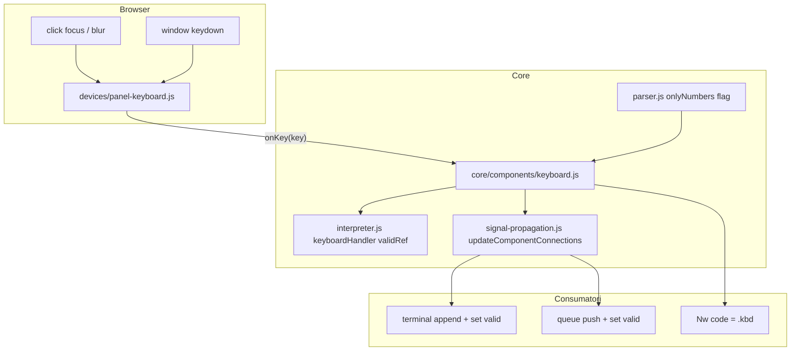

# Plan: componenta `comp [keyboard]` — IMPLEMENTAT

## Obiectiv

Componentă interactivă care capturează taste din browser **doar când e focusată** și emite evenimente în simulare:

- **`:get`** — ultimul cod tastă (8 bit ASCII sau 4 bit cu `onlyNumbers`)
- **`:valid`** — puls `1` la fiecare tastă acceptată, apoi revine la `0` (pattern ca `clcd` `touchType: 2`)

Nu afișează caracterele tastate — pentru afișare se folosește `comp [terminal]` sau alte consumatori (`queue`, `stack`, UART etc.).

Documentație: [`v0_3_2/doc/keyboard.md`](../../v0_3_2/doc/keyboard.md) · Index: [`interactive-components.md`](../../v0_3_2/doc/interactive-components.md)

---

## Decizii confirmate

| Subiect | Decizie |
|---------|---------|
| Nume rezervat | `isReservedName: true` — nu poate fi folosit ca nume de wire |
| Focus | Click pe panou → focus; click în afară → unfocus; `window.focusedKeyboardId` |
| Taste fără focus | Ignorate (în teste headless: `triggerKeyboardKey` cu `force: true`) |
| Enter | ASCII `10` (`00001010`); ignorat în mod `onlyNumbers` |
| Spațiu | ASCII `32` |
| `onlyNumbers` | Doar `0`–`9`; `:get` pe **4 bit** (ex. `5` → `0101`) |
| Puls `valid` | `setValueAtRef(valid, '1')` → propagare → `setValueAtRef(valid, '0')` → propagare |
| Wiring tipic | `.term:{ append = .kbd; set = .kbd:valid }` sau `.q:{ push = .kbd; set = .kbd:valid }` |
| Propagare browser | Mod **wave** (implicit în editor): `updateComponentConnections` la schimbare `valid`, nu doar `_scheduleWiresDependingOnComponent` |

### Atribute

| Atribut | Tip | Default | Rol |
|---------|-----|---------|-----|
| `label` | string | `Keyboard` | Text lângă cursor |
| `color` | color | `^808080` | Border / label nefocusat |
| `bgColor` | color | `^101010` | Fundal nefocusat |
| `focusColor` | color | `^2ecc71` | Border / label / cursor la focus |
| `focusBgColor` | color | `^181818` | Fundal la focus |
| `onlyNumbers` | flag | off | Mod numeric 4 bit |
| `nl` | flag | off | Linie nouă după widget în panoul Devices |

### Pouts

| Pout | Lățime | Descriere |
|------|--------|-----------|
| `get` | 8 sau 4 | Ultimul cod emis |
| `valid` | 1 | Puls la tastă acceptată |

---

## Arhitectură



Pattern de referință: [`key.js`](../../v0_3_2/core/components/key.js) + [`panel-key.js`](../../v0_3_2/devices/panel-key.js) pentru UI interactiv; puls `valid` ca [`clcd.js`](../../v0_3_2/core/components/clcd.js) `touchType: 2`.

---

## Fișiere implementate

| Fișier | Rol |
|--------|-----|
| [`v0_3_2/core/components/keyboard.js`](../../v0_3_2/core/components/keyboard.js) | `KeyboardComponent`: `getDef`, `createDevice`, `buildHandler`, `evalGetProperty`, `propagateKeyboardOutput` |
| [`v0_3_2/devices/panel-keyboard.js`](../../v0_3_2/devices/panel-keyboard.js) | `PanelKeyboard`, `addKeyboard`, focus, blink 400ms, `keydown` |
| [`v0_3_2/core/components/index.js`](../../v0_3_2/core/components/index.js) | `registry.register(KeyboardComponent)` |
| [`v0_3_2/core/interpreter.js`](../../v0_3_2/core/interpreter.js) | `compInfo.keyboardHandler`, `compInfo.validRef` din `createDevice` |
| [`v0_3_2/core/parser.js`](../../v0_3_2/core/parser.js) | `onlyNumbers` în `attributesWithNoValues` + branch `attributes.onlyNumbers = true` |
| [`v0_3_2/test_session.js`](../../v0_3_2/test_session.js) | `triggerKeyboardKey(interp, name, { key, charCode, force })` |
| [`v0_3_2/test_suite.js`](../../v0_3_2/test_suite.js) | Teste 1599–1608 |
| [`v0_3_2/script_editor_v0_3_2.html`](../../v0_3_2/script_editor_v0_3_2.html) | CSS `.keyboard-panel`, script tags |
| [`v0_3_2/_run_suite_node.js`](../../v0_3_2/_run_suite_node.js) | include `keyboard.js` |
| [`v0_3_2/doc/keyboard.md`](../../v0_3_2/doc/keyboard.md) | Doc + exemple `logts-play` |
| [`v0_3_2/doc/components.md`](../../v0_3_2/doc/components.md), [`doc-index.json`](../../v0_3_2/doc/doc-index.json) | Index documentație |

---

## Detalii implementare

### Core — `keyboard.js`

- `createDevice` alocă `getRef` (`&N`) și `validRef` (`&M`) în storage; `ref` componentă = `getRef`.
- `buildHandler` → `onKey(input, opts)`:
  1. Verifică focus (`window.focusedKeyboardId`) sau `opts.force`
  2. `resolveKeyInput` — mapare tastă / charCode → cod zecimal sau `null`
  3. `scheduleComponentOutputChange` (wave) sau `setValueAtRef` (legacy) pentru `:get`
  4. `setValueAtRef(validRef, '1')` + `propagateKeyboardOutput`
  5. `setValueAtRef(validRef, '0')` + `propagateKeyboardOutput` (puls)
- `propagateKeyboardOutput`: în **wave**, dacă `_scheduleWiresDependingOnComponent` nu programează fire, apelează **`updateComponentConnections`** — necesar ca blocurile `{ set = .kbd:valid }` să ruleze în browser.

### UI — `panel-keyboard.js`

- Panou click → `focus()`; document mousedown în afară → `unfocus()`
- Cursor `|` cu blink **400ms** la focus
- `keydown` pe `window` când focusat; ignoră Tab, săgeți, Escape, Meta, Ctrl, Alt, `repeat`
- `addKeyboard` montează în `#devices`, înregistrează în `window.panelKeyboards`

### Parser — `onlyNumbers`

Flag fără valoare (ca `nl`):

```logts
comp [keyboard] .kbd:
  onlyNumbers
  :
```

---

## Exemple LogTscript

### Keyboard → terminal

```logts
comp [keyboard] .kbd:
  label: 'Console'
  focusColor: ^00ff00
  on: 1
  :

comp [terminal] .term:
  rows: 10
  columns: 40
  color: ^0f0
  on: 1
  nl
  :

.term:{
  append = .kbd
  set = .kbd:valid
}
```

### Keyboard → queue (BCD)

```logts
comp [keyboard] .digits:
  onlyNumbers
  on: 1
  :

comp [queue] .q:
  width: 4
  length: 16
  on: 1
  :

.q:{
  push = .digits
  set = .digits:valid
}
```

---

## Teste (grup `keyboard`)

| ID | Titlu |
|----|-------|
| 1599 | Parser — `onlyNumbers`, `label`, `focusColor`, `nl` |
| 1600 | ASCII `A` → `get` = `01000001` |
| 1601 | Enter → `00001010` |
| 1602 | `onlyNumbers` — `5` → `0101` |
| 1603 | `onlyNumbers` ignoră `A` și Enter |
| 1604 | keyboard → queue `push` via `valid` |
| 1605 | keyboard → terminal `append` |
| 1606 | `keyboardHandler` pe `compInfo` |
| 1607 | `doc(comp.keyboard)` semnătură |
| 1608 | terminal append în mod **wave** (`propagation: 'wave'`) |

Rulare: `node v0_3_2/_run_suite_node.js` → **1043/1043** (după manifest).

Headless: `session.triggerKeyboardKey(interp, '.kbd', { key: 'A' })`.

---

## Bugfix post-implementare (browser)

| Problemă | Cauză | Fix |
|----------|-------|-----|
| Taste fără efect în editor | Mod wave: `propagate()` fără `updateComponentConnections` | Fallback în `propagateKeyboardOutput` |
| `probe` stătea la init | Aceeași cauză — blocuri `.term` nu executau | Idem |
| Test 1604 eșua | `.q:size` pentru `length: 8` = **4 bit**, nu 5 | Assert `4wire` / `0010` |

---

## Lucrări conexe (nu fac parte din acest plan)

În timpul testării keyboard → terminal s-a îmbunătățit scroll-ul terminalului UI ([`devices/terminal.js`](../../v0_3_2/devices/terminal.js)): container `.terminal-scroll`, auto-scroll la append, eliminare dublu-scrollbar (`<pre>` → `<div>`).

---

## Status

**Implementat și verde** — iunie 2026, `v0_3_2`.
