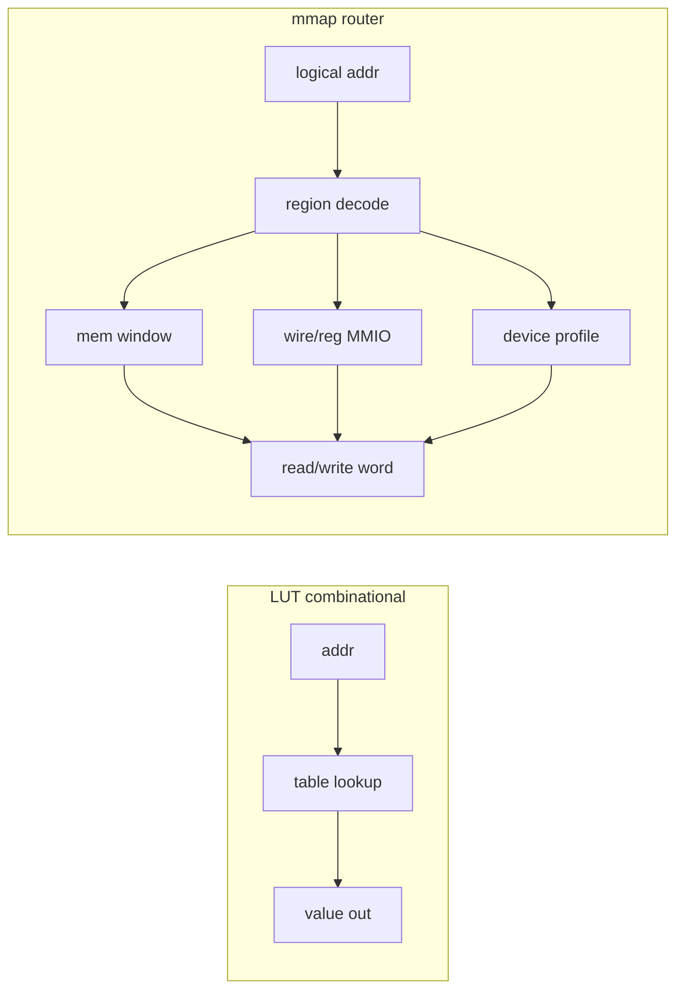

# Plan: componentă mapare adrese (`comp [mmap]`)

Plan părinte CPU/DMA: [comp_cpu.plan.md](comp_cpu.plan.md) — faza 6.

## Nume confirmat: **mmap**

Decizie utilizator: tipul componentei rămâne **`comp [mmap]`**. În documentație: „memory / I/O map” (nu Unix file mmap).

Nu folosim `map` singur — pe CPU există deja atributul nested **`map:`** (convenții simbolice: `vectorBase`, `stack` în [cpu.md](../v0_3_2/doc/cpu.md)), care e altceva.

---

## Sintaxă explicată (pe scurt)

### Trei piese separate

| Piesă | Ce e | Exemplu |
|-------|------|---------|
| **1. Harta** | `comp [mmap]` — definește ce înseamnă fiecare adresă logică | `comp [mmap] .mmap:` + `regions:` |
| **2. Legătura DMA** | pe `comp [dma]` — spune DMA să folosească harta | `mmap = .mmap` |
| **3. Transferul** | property block — adrese **logice**, nu sloturi mem | `.dma:{ srcAdr = …, dstAdr = …, count = …, set = 1 }` |

**Important:** legătura e `mmap = .mmap` (cu **`=`**, ca `ram = .data` la CPU) — **nu** `mmap:` pe DMA. Două puncte diferite:

- `regions:` pe **comp [mmap]** = listă de zone (ca `mems:` pe DMA în faza 5)
- `mmap = .mmap` pe **comp [dma]** = referință la instanța hărții

### Exemplu complet (minimal)

```logts
comp [mem] .rom:
  depth: 8
  length: 16
  readonly: 1
  on: 1
  = ^01020304
  :

comp [mem] .ram:
  depth: 8
  length: 16
  on: 1
  = ^00
  :

# 1) HARTA — adrese logice 0..31 = ROM, 32..47 = RAM
comp [mmap] .mmap:
  depth: 8
  regions:
    - base: 0,  size: 16, mem: .rom
    - base: 16, size: 16, mem: .ram
  on: 1
  :

# 2) DMA legat de hartă (FĂRĂ mems:)
comp [dma] .dma:
  mmap = .mmap
  on: 1
  :

# 3) COPY — 4 cuvinte din ROM logic 0 → RAM logic 32 (local .ram adr 0)
.dma:{ srcAdr = 0, dstAdr = 16, count = 100, set = 1 }

# 4) FILL — 4 cuvinte cu ^aa la adresa logică 32
.dma:{ src = 0, dstAdr = 16, count = 100, value = ^aa, set = 1 }
```

**Cum citești adresele:**

| Adresă logică | Regiune | Unde ajunge fizic |
|---------------|---------|-------------------|
| `0` | base 0, mem `.rom` | `.rom` offset 0 |
| `15` | tot ROM | `.rom` offset 15 |
| `16` | base 16, mem `.ram` | `.ram` offset 0 |
| `20` | tot RAM | `.ram` offset 4 |

Formula: `adresă logică` → găsești regiunea cu `base ≤ adr < base+size` → `offset local = adr - base` → citești/scrii în `mem` / `mmio` / etc.

### Faza 5 (mems) vs faza 6 (mmap) — DMA

| | **Faza 5 — `mems:`** | **Faza 6 — `mmap = .mmap`** |
|---|----------------------|------------------------------|
| Declarație DMA | `mems: .rom .ram` | `mmap = .mmap` |
| Copy | `src = 1, dst = \2, srcAdr, dstAdr` | `srcAdr, dstAdr` (**adrese logice**) |
| Slot `src`/`dst` | **da** (1…N în listă) | **nu** (nu mai ai listă mem) |
| Fill | `src = 0, dst = \2, dstAdr, value` | `src = 0, dstAdr` (**logic**), `value` |
| Peste 2 chip-uri | 2 joburi sau același slot | **un singur job** — DMA decodează per cuvânt |
| `srcAdr` la fill | ignorat | ignorat |

**Copy și fill pe mmap:** la fiecare cuvânt DMA apelează `mmapRead` / `mmapWrite`. Funcționează pentru regiuni `mem:`, `mmio:` (fire), și ulterior `device:` — același mecanism. Eroare la submit/write dacă ținta e readonly sau adresă nemapată (default `unmapped: error`).

**Exemplu copy peste graniță** (un singur `set`, fără script special):

```logts
# Copiază 10 cuvinte de la logic 14 (ROM+10) peste logic 30 (RAM+14)
.dma:{ srcAdr = 1110, dstAdr = 11110, count = 1010, set = 1 }
```

DMA intern: pentru `i = 0..count-1` → `word = mmapRead(srcAdr+i)` → `mmapWrite(dstAdr+i, word)`.

### Regiuni în `regions:`

Fiecare intrare = fereastră în spațiul logic:

```logts
regions:
  - base: 0,    size: 256, mem: .rom      # RAM/ROM — fereastră în comp [mem]
  - base: 256,  size: 256, mem: .ram
  - base: 512,  size: 4096, mem: .vram     # „memorie grafică” = mem mare
  - base: 0xFF00, size: 4, mmio:           # fiecare slot = wire/pin exact depth biți
      0: dmaBusy         # 8wire = .dma:busy + padding (în script)
      1: data1data2      # 8wire; data/data2 din slice
      2: .panel:out       # pin 8 bit = depth
```

| Câmp regiune | Rol |
|--------------|-----|
| `base` | Prima adresă logică a zonei |
| `size` | Câte cuvinte (nu bytes) ocupă zona |
| `mem:` | Țintă `comp [mem]` — offset local 0…size−1 |
| `mmio:` | Sub-hartă offset → wire sau pin/pout componentă |
| `regs:` | (6a+) fereastră `comp [reg]` |
| `device:` | (6d+) profil MMIO al unei componente (lcd, dma, …) |

**Reguli:** regiunile **nu se suprapun**; `depth` pe mmap = lățime **bus** (cuvânt la `mmapRead`/`mmapWrite`), egală cu mem-urile din regiuni `mem`.

### Regiune `mmio:` — index `0`, `1`, `2` și regula lățimii

**`0`, `1`, `2`** = **index de registru** (offset local) în regiunea `mmio`, **nu** biți și **nu** adrese absolute.

| Index mmio | Adresă logică (ex. `base: 0xFF00`) |
|------------|--------------------------------------|
| `0` | `0xFF00` |
| `1` | `0xFF01` |
| `2` | `0xFF02` |

`size: 8` = zona ocupă **8 adrese logice consecutive** (`base` … `base+7`). Sloturile nedefinite în sub-hartă folosesc `unmapped:`.

#### Regulă lățime (decizie): **egal cu `depth`, fără mascare LSB în mmap**

Limbajul **nu** face conversie implicită 8→3 biți sau 1→8 la asignare mmap. Fiecare slot `mmio` trebuie legat la ceva cu **exact `depth` biți** (aceeași lățime ca bus-ul mmap).

| Legare în `mmio:` | Lățime cerută (`depth: 8`) | Rezultat |
|-------------------|---------------------------|----------|
| `3wire data` | 3 ≠ 8 | **eroare** la declarare |
| `.dma:busy` (pout 1 bit) | 1 ≠ 8 | **eroare** — nu legare directă |
| `8wire busReg` | 8 = 8 | **ok** |
| `.panel:out` (pin 8 bit) | 8 = 8 | **ok** |
| `.panel:out` (pin 4 bit) | 4 ≠ 8 | **eroare** — folosește wire intermediar |

**Responsabilitatea utilizatorului:** compune fire de lățime `depth` în script (concatenare `+`, slice `.lo/hi`), apoi mapează **wire-ul de `depth` biți** în `mmio`. Sub-firele își iau valorile prin **propagare wave** normală — mmap nu știe de LSB/MSB.

#### Pattern: pout/pin îngust → wire `depth` biți

```logts
# busy 1 bit → registru bus 8 bit (concatenare în script)
8wire dmaBusy = .dma:busy + 0000000

comp [mmap] .mmap:
  depth: 8
  regions:
    - base: 0xFF00, size: 4, mmio:
        0: dmaBusy
        1: data1data2
        2: .panel:out
  :
```

#### Pattern: mai multe câmpuri înguste într-un registru de 8 bit

```logts
3wire data
5wire data2
8wire data1data2

data = data1data2.0/3
data2 = data1data2.3/5

comp [mmap] .mmap:
  depth: 8
  regions:
    - base: 0xFF00, size: 4, mmio:
        0: dmaBusy
        1: data1data2      # un singur registru 8 bit; data și data2 din slice
        2: .panel:out
  :
```

La **write** pe adresa logică `0xFF01` (mmap / CPU STORE / DMA):

1. Se scrie cuvântul de 8 biți în wire-ul `data1data2`.
2. Propagarea wave actualizează `data` (3 biți) și `data2` (5 biți) din slice-uri.

La **write** pe `0xFF02`:

1. Se scrie în `.panel:out` (trebuie 8 bit = `depth`) — asignare directă ca orice pin, propagare wave către panou.

La **read** pe `0xFF00`:

1. `mmapRead` returnează valoarea curentă a wire-ului `dmaBusy` (8 bit, inclusiv bitul sincronizat din `.dma:busy`).

#### Semantica accesului

| Operație | Comportament |
|----------|--------------|
| `mmapWrite(adr, word)` | `word` are **exact `depth` biți** → asignare la ținta slotului (wire sau pin write) |
| `mmapRead(adr)` | citește ținta → returnează **exact `depth` biți** |
| DMA copy/fill peste `mmio` | per adresă, același lucru — fără mascare |
| Wave | schimbarea valorii la o adresă logică = schimbare pe wire/pin legat → propagare la slice-uri și componente |

**Forme permise la fiecare slot `mmio`:**

| Formă | Condiție |
|-------|----------|
| `Nwire name` | `N === depth` |
| `.comp:pout` (read) | lățime pout `=== depth` |
| `.comp:pin` (write) | lățime pin `=== depth` |
| `.comp:pin` read-only / pout write-only | eroare la acces invalid |

**Nu în MVP:** mascare automată, `depth` per slot, conversie implicită narrow↔wide.

### Ce NU e `mmap`

| Construct | Unde | Ce face |
|-----------|------|---------|
| `map:` nested pe CPU | `comp [cpu]` | convenții firmware (`stack`, `vectorBase`) — **nu** decode hardware |
| `mems:` pe DMA | faza 5 | slot 1…N + offset local |
| `inline [lut]` | expresii | tabel combinational, nu bus |
| mascare LSB la mmio | — | **respins** — folosește fire `depth` + slice în script |

---

## Intuiția „ca un LUT” — ce e similar și ce nu



| | **LUT** | **mmap** |
|---|---------|----------|
| Rol | adresă → valoare statică | adresă → **țintă** + offset local |
| Stare | tabel fix (sau fillwith) | mem RAM, fire live, device cu side-effects |
| Side-effects | nu (combinational) | da (LCD update, DMA latch, etc.) |
| Măiestri | expresii / pin `in` | CPU LOAD/STORE, DMA word-by-word |

Deci: **aceeași idee de decode pe adresă**, dar mmap e un **fabric/router**, nu un tabel pur.

---

## Model arhitectural

### O singură sursă de adevăr

```logts
comp [mmap] .mmap:
  depth: 8
  regions:
    - base: 0,    size: 256, mem: .rom
    - base: 256,  size: 256, mem: .ram
    - base: 512,  size: 64,  mem: .vram
    - base: 0xFE00, size: 16, regs: .io
    - base: 0xFF00, size: 8,  mmio:
        0: dmaBusy
        1: data1data2
        2: panelBus
  :
```

**API intern (device layer nou: `mmap-devices.js`):**

- `mmapResolve(id, addr) → { kind, target, localAdr, readonly? }`
- `mmapRead(id, addr) → word`
- `mmapWrite(id, addr, word)`
- Validare: regiuni **fără overlap**, `depth` consistent pe regiuni `mem`, `size` > 0

### Tipuri de regiune (prioritate implementare)

1. **`mem:`** — fereastră în `comp [mem]` (ROM/RAM/framebuffer grafic). Offset local 0…size−1. Readonly dacă mem `readonly: 1`.
2. **`regs:`** — fereastră în `comp [reg]` multi-word sau banc de registre (similar mem, dar semantic I/O).
3. **`mmio:`** — mapare **offset → wire** (lățime exact `depth`) sau pin/pout componentă (aceeași lățime).
4. **`device:`** (faza ulterioară) — profil MMIO declarat de componentă. Necesită hook `getMmapProfile()` pe componente selectate.

**Framebuffer grafic:** nu e tip special — e `comp [mem]` (eventual mare) + opțional regiune `mmio`/`device` pentru control (`dots`, `lcd`, `clcd`).

---

## Legături cu maeștri existenți

| Master | Binding faza 5 (azi) | Binding cu mmap |
|--------|----------------------|-----------------|
| **DMA** | `mems:` + slot + offset local | `mmap = .mmap` — `srcAdr`/`dstAdr` logice; **copy + fill**; **mutual exclusive** cu `mems:` |
| **CPU** | `ram = .data`, `prog = .rom` (Harvard) | `mmap = .mmap` pentru LOAD/STORE / OUT — **mutual exclusive** cu `ram =` / `ram:` (decizie: fie Harvard ca azi, fie mmap pentru date+I/O) |
| **Script** | fire + property blocks | pin-uri pe `comp [mmap]` sau helper intern (opțional 6a) |

**Transfer DMA peste graniță:** loop intern per cuvânt cu `mmapResolve` — scatter-gather simplu ascuns în device.

---

## Adrese speciale: DMA, CLCD, LCD, fire

**Strat 1 — `mmio:` pe fire `depth` biți** (MVP): compunere în script cu `+` și slice.

**Strat 2 — profil `device:`** (6d): registre declarate de componentă.

---

## Atribute `comp [mmap]`

| Atribut | Rol |
|---------|-----|
| **`depth:`** | Lățime cuvânt bus (obligatoriu) |
| **`regions:`** | Listă ordonată de regiuni |
| **`unmapped:`** | `error` (default) \| `read0` \| `ignore` — pentru adrese **în afara** tuturor regiunilor |

**Sloturi goale în interiorul unei regiuni `mmio:`** (ex. `size: 8`, definite doar `0..2`) — **decizie confirmată:** read → **`0`** (depth biți), write → **ignorat** (registre „reserved”). Eroare doar pentru adrese **în afara** tuturor regiunilor (`unmapped: error` implicit).


Pin-uri opționale (6a): `adr`, `data`, `write`, `get` — test manual fără CPU.

---

## Sub-faze propuse

### 6a — Nucleu mmap (fără CPU/DMA)

- [core/components/mmap.js](../v0_3_2/core/components/mmap.js), [devices/mmap-devices.js](../v0_3_2/devices/mmap-devices.js)
- Regiuni: **`mem`**, **`mmio`** (wire exact `depth` biți)
- Teste ~2700+

### 6b — DMA + mmap (copy și fill)

- `mmap = .mmap` pe [dma.js](../v0_3_2/core/components/dma.js); mutual exclusive cu `mems:`
- Copy/fill/paced pe adrese logice via `mmapRead`/`mmapWrite`

### 6c — CPU + mmap

- `mmap = .mmap` pe [cpu.js](../v0_3_2/core/components/cpu.js)
- `LOAD` / `STORE` (și `OUT`/`IN` dacă există în ISA) pe **adrese logice** → același **`mmapRead` / `mmapWrite`** ca la DMA
- Harvard: `prog =` poate rămâne separat; **`ram =` / `ram:` și `mmap =` mutual exclusive** pe același CPU

#### CPU citește din componente sau din fire?

**CPU nu știe** de `.dma`, `lcd`, fire etc. — vede doar **adrese logice**. Decodarea e în **`comp [mmap]`**:

| Regiune mmap | `LOAD` la adresă logică | Ce se întâmplă |
|--------------|-------------------------|----------------|
| **`mem:`** | ex. `16` | `getMem` pe chip-ul mapat (ca azi, dar adresă globală) |
| **`mmio:`** → `8wire dmaBusy` | ex. `0xFF00` | `mmapRead` → **valoarea wire-ului** `dmaBusy` |
| **`mmio:`** → `.panel:out` (pin 8 bit) | ex. `0xFF02` | `mmapRead` → citește pinul componentei (dacă read permis) |

**Fire legate de componente** — da, CPU „vede” starea componentei **prin wire**, nu prin magie:

```logts
8wire dmaBusy = .dma:busy + 0000000
# mmio slot 0: dmaBusy
# LOAD R0, A_FF00  →  R0 = valoarea curentă a dmaBusy
#                    →  bitul 0 = .dma:busy (propagare wave)
```

La fiecare `LOAD`, `mmapRead` citește wire-ul **la momentul accesului**; dacă `.dma:busy` s-a schimbat și wave-ul a propagat în `dmaBusy`, registrul CPU primește valoarea actualizată.

**Reguli:**

- **Nu** există citire automată a tuturor pinilor unei componente — doar ce e **explicit** în `regions:` / `mmio:`.
- Slot `mmio` legat la **wire `depth` biți** → read/write pe wire; slice-urile (`data = data1data2.0/3`) se actualizează la STORE prin wave.
- Slot legat **direct** la `.comp:pout` (lățime = `depth`) → `mmapRead` apelează `evalGetProperty` pe acel pout.
- Slot legat la **pin write-only** → `LOAD` = **eroare** (sau politică `unmapped` — default eroare).

**Simetrie cu DMA:** același decoder, aceleași ținte; diferența e doar cine inițiază accesul (instrucțiune CPU vs job DMA).


### 6d — Profile `device:` MMIO

- Hook `getMmapProfile`; dma + lcd/clcd

### 6e — Demo + doc

- [doc/mmap.md](../v0_3_2/doc/mmap.md), logts-play CPU+DMA+VRAM

### 6f — Regiune `regs:` (implementat)

- Fereastră în `comp [reg]` multi-word sau banc de registre (similar `mem:`, dar semantic I/O)
- `mmapRead`/`mmapWrite` pe offset local în regiunea `regs:`

---

## Decizii închise (gata de implementare)

| Subiect | Decizie |
|---------|---------|
| Nume componentă | **`mmap`** |
| DMA binding | `mmap = .mmap`, mutual exclusive cu `mems:` |
| DMA copy/fill | adrese logice, paced ca 5d/5e |
| `mmio` lățime | exact `depth`; compunere fire în script (`+`, slice) |
| CPU + mmap | `mmapRead`/`mmapWrite` ca DMA; fire/componente prin ce e mapat |
| CPU `ram` vs `mmap` | **mutual exclusive** |
| Gap-uri în regiune `mmio` | **confirmat:** read `0` (depth biți), write ignorat |
| Adresare | cuvânt (word), nu byte |
| MVP regiuni | `mem` + `mmio` (6a); `device:` în 6d; **`regs:` în 6f** |

## Opțional / amânat (nu blochează 6a)

- **Von Neumann** (cod în aceeași mmap ca date) — după 6c
- **Profile `device:`** — 6d (lcd/clcd/dma regs)
- **Pin-uri pe `comp [mmap]`** (`adr`, `data`, `write`, `get`) — util la teste, nu obligatoriu day one
- **`accessLatency`** per regiune
- **Sintaxă `base:`** hex vs `\decimal` — urmează convențiile existente din parser

---

## Ce NU intră în MVP

- TLB, cache, MPU
- Mascare LSB la mmio
- `accessLatency` per regiune
