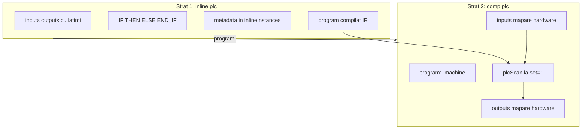
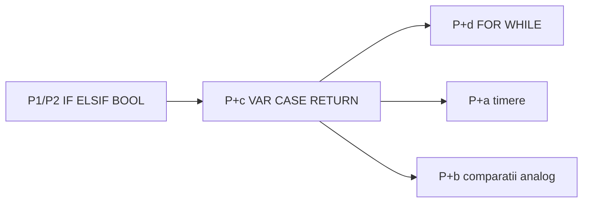
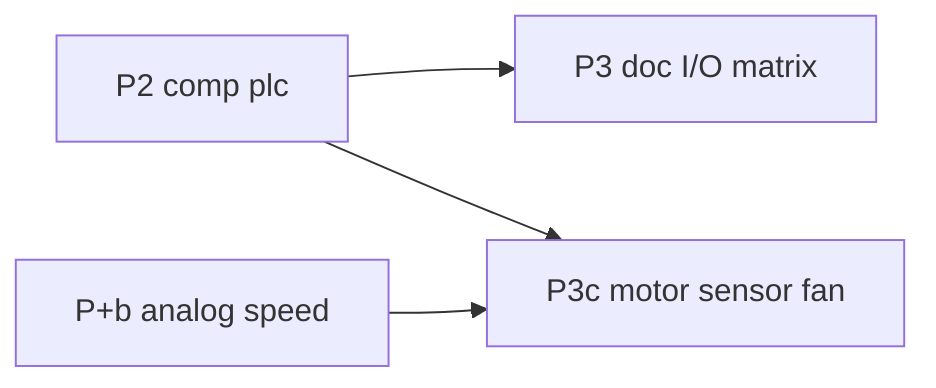
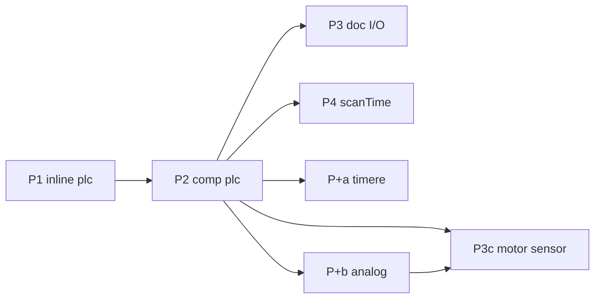

# Plan: `comp [plc]` — analiză și roadmap

Sursă idei: [comp_plc.txt](../my_ideas/comp_plc.txt)

Model plan: [comp_cache.plan.md](comp_cache.plan.md), [comp_cpu.plan.md](comp_cpu.plan.md)

---

## Stare actuală (v0_3_2)

| Element | Status |
|---------|--------|
| `inline [plc]` | **Nu există** — parser: doar `asm`, `lut`, `protocol` |
| `comp [plc]` | **Nu există** |
| `button`, `motor`, `fan`, `sensor` | **Nu există** (schiță aspiratională) |
| Substituenți intrări | `key`, `switch`, `dip`, `slider`, `rotary` |
| Substituenți ieșiri | `led`, `bar`, `reg`, `clcd` (multi-bit — via wires) |
| `doc/plc.md` | **Lipsește** |

---

## Arhitectură confirmată: două straturi (ca ASM + CPU)

**Da — exact modelul `inline [asm]` + `comp [cpu]`.**



| | `inline [asm]` | `inline [plc]` |
|---|----------------|----------------|
| **Ce definește** | ISA: opcodes, consts, macros, micro | Simboluri I/O + **lățimi** + logică BOOL |
| **La declarare** | `parseIsaBody` → `inlineInstances` | `parsePlcBody` → `inlineInstances` |
| **Nu rulează singur** | Da — trebuie `comp [cpu]` | Da — trebuie `comp [plc]` |
| **Legătură** | `isa: .cpuisa` | `program: .machine` |
| **Execuție** | `cpuStep` / fetch-decode | `plcScan` / read-logic-write |

`inline [plc]` **nu** este script LogTscript obișnuit — este **sub-limbaj** cu metadata proprie (ca ASM are metadata opcode, PLC are metadata simbol + lățime + IR).

---

## Decizii închise (iterație plan)

| ID | Decizie |
|----|---------|
| **P-FIX1** | În toate exemplele/doc: **`motorWire -> .motor1` greșit** → **`.motor1 = motorWire`** (sau bloc `{ value, set }`) |
| **P-FIX2** | **`comp [plc]` canonic LogTscript** — **nu** pin `:on` pentru comandă motor; output = asignare directă / wire (confirmat) |
| **P-ARCH1** | Implementare: **P1 `inline [plc]`** apoi **P2 `comp [plc]`** |
| **P-ARCH2** | Faze amânate: **P+a** timere, **P+b** analog |
| **P-W1** | Declarație simbol: **`START: 1`** sau **`START`** (alone) — ambele valide |
| **P-W2** | **P1/P2:** logică (`IF`, `AND`, `OR`, `NOT`, `XOR`) **doar pe simboluri 1 bit** (confirmat) |
| **P-W3** | Mapare `comp [plc]`: **lățime strictă** simbol ↔ wire/comp (confirmat) |
| **P-W4** | **`START` alone** = default **`1` bit**; explicit `START: 1` echivalent (confirmat) |
| **P-W5** | Simboluri `>1` bit declarabile în P1; **folosire în logică** doar din **P+b** (`IF TEMP > 50`, atribuiri multi-bit) |
| **P-MAP1** | Output → asignare directă `.led = val` / wire — **nu** pseudo-pin `:on` |
| **P-MAP2** | Input → wire sau `:get` componentă (resolver implicit) |
| **P-SCAN1** | **P2:** scan la `.plc:{ set = 1 }` (`scanTime` omis sau `0`) |
| **P-SCAN2** | **P4:** `scanTime` + osc — amânat |
| **P-IO1** | **Nu** există `comp [button]` — intrări digitale: **`key`**, **`switch`**, **`dip`** (confirmat) |
| **P-IO2** | **P2/P3:** ieșiri digitale 1-bit: **`led`**, **`reg`**, wires; **nu** mapare directă `comp [plc]` → `clcd` |
| **P-IO3** | **`clcd`:** doar prin **wires multi-bit** + logică LogTscript în afara PLC (`:get` / bloc `{ value, set }`) |
| **P-IO4** | **`motor`**, **`sensor`**, **`fan`**, alias **`button`** — **amânat P3c** (complexitate motor: viteză, tip, rotație) |
| **P-D4** | Operatori / control v1 | **P1/P2:** `IF/THEN/ELSE/ELSIF/END_IF`, `AND/OR/NOT/XOR`, `TRUE/FALSE`; **P+c/d:** restul ST |
| **P-D6** | Validare mapări: **eroare strictă** la elaborare `comp [plc]` | **închis** |
| **P-D7** | Output neasignat în scan: **păstrează ultima valoare** (ca PLC real) | **închis** |
| **P-D8** | Corp program: **listă secvențială** — atribuiri top-level + `IF`-uri multiple, o trecere per scan | **închis** |
| **P-D9** | `inputs` **read-only**; `outputs` **citibile** în expresii (valoare curentă din scan, ca ST) | **închis** |

---

## P-D4 — Operatori și control (decizie închisă)

**Operatori booleeni:** `AND`, `OR`, `NOT`, `XOR` — standard IEC 61131-3 ST.

**Control flow de la P1 (nu amânat):**
- **`ELSIF`** — da, există în ST (`IF … THEN … ELSIF … THEN … ELSE … END_IF`); echivalent cu lanț `ELSE IF`, dar idiom ST/PLC.
- **`TRUE` / `FALSE`** — da, literali booleani ST; **`0` / `1`** rămân alias acceptați în context 1-bit.

**Decizie:** **`ELSIF` + `TRUE`/`FALSE` din prima implementare (P1)** — același parser cu `IF/ELSE`, cost mic, limbaj mai autentic.

**Nu în P1/P2:** `CASE`, `FOR`, `WHILE`, `VAR` — faze **P+c** / **P+d**.

---

## P-D7 / P-D8 / P-D9 — Semantica execuție scan (P1/P2, închis)

### P-D7 — Output neasignat

**Decizie:** output-ul **păstrează ultima valoare** dacă nu e atribuit în scan-ul curent (ca PLC real).

```logts
IF START THEN
  MOTOR = 1
END_IF
```

Când `START = 0`, `MOTOR` rămâne la valoarea anterioară (latch implicit fără `VAR`). Pentru logică combinațională strictă, programatorul folosește `ELSE MOTOR = 0` sau atribuire top-level.

La **primul scan** (fără istoric): output-urile pornesc la **`0` / `FALSE`**.

### P-D8 — Structura corpului

**Decizie:** corpul = **listă secvențială de statements** (ca ST / PLC real):

- atribuiri top-level (`MOTOR = START AND NOT STOP`)
- blocuri `IF … END_IF` (multiple, în ordine)
- **un** impuls `set = 1` = **o trecere** completă prin listă (fără bucle în P1/P2)

Ordinea contează: ultima atribuire la același simbol câștigă în acel scan.

### P-D9 — Read-only inputs, outputs citibile

| Simbol | Citire în expresie | Atribuire |
|--------|-------------------|-----------|
| **input** | da (valoare citită la începutul scan-ului) | **eroare** la parse |
| **output** | da (valoare curentă din scan — ce s-a scris deja) | da |
| **input în P+c `VAR`** | — | amânat P+c |

Eroare parse (ex.): `plc program: cannot assign to input START`.

---

## Lexicon — keyworduri `inline [plc]` (IEC 61131-3 ST-inspired)

Lista completă țintă vs ce implementăm per fază. Modelul ST (Structured Text) din IEC 61131-3 include aproape toate keywordurile enumerate de utilizator.

### Tabel master keyworduri

| Keyword | Rol (ST) | Fază plan |
|---------|----------|-----------|
| **`inputs:`** | Interfață intrări (mapate la `comp [plc]`) | **P1/P2** |
| **`outputs:`** | Interfață ieșiri | **P1/P2** |
| **`IF`** | Condiție | **P1/P2** |
| **`THEN`** | Ramură true | **P1/P2** |
| **`ELSE`** | Ramură false | **P1/P2** |
| **`ELSIF`** | Lanț else-if | **P1/P2** |
| **`END_IF`** | Închide `IF` | **P1/P2** |
| **`AND`**, **`OR`**, **`NOT`**, **`XOR`** | Operatori booleeni | **P1/P2** |
| **`TRUE`**, **`FALSE`** | Literali booleani | **P1/P2** |
| **`0`**, **`1`** | Literali booleani (alias) | **P1/P2** |
| **`=`** | Atribuire | **P1/P2** |
| **`VAR`** … **`END_VAR`** | Variabile **interne** (memorie între scan-uri) | **P+c** |
| **`CONST`** … **`END_CONST`** | Constante program | **P+c** |
| **`CASE`** … **`OF`** … **`END_CASE`** | Selecție multiplă | **P+c** |
| **`RETURN`** | Ieșire timpurie din corp program (sfârșit scan logic) | **P+c** |
| **`FOR`** … **`TO`** … **`BY`** … **`DO`** … **`END_FOR`** | Buclă numărată | **P+d** |
| **`WHILE`** … **`DO`** … **`END_WHILE`** | Buclă condiționată | **P+d** |
| **`>`**, **`<`**, **`==`**, … | Comparații | **P+b** (analog) |
| **`TON`**, **`TOF`**, … | Timere | **P+a** (biblioteci) |

**Nu în plan (ST are, amânăm):** `REPEAT`/`UNTIL`, `EXIT`, `VAR_INPUT`/`VAR_OUTPUT` separate — la noi `inputs:`/`outputs:` acoperă interfața.

### P1/P2 — nucleu (primul program rulabil)

```logts
inline [plc] .machine:
  inputs: { START, STOP: 1 }
  outputs: { MOTOR }
  IF START AND NOT STOP THEN
    MOTOR = TRUE
  ELSIF STOP THEN
    MOTOR = FALSE
  ELSE
    MOTOR = FALSE
  END_IF
  :
```

| Grup | Keyworduri |
|------|------------|
| Declarații | `inputs:`, `outputs:`, `{`, `}` |
| Condițional | `IF`, `THEN`, `ELSE`, `ELSIF`, `END_IF` |
| Booleans | `AND`, `OR`, `NOT`, `XOR`, `(`, `)` |
| Literali | `TRUE`, `FALSE`, `0`, `1` |
| Atribuire | `=` |

**Semantica scan (P-D7–P-D9):** un impuls `set` = o trecere secvențială prin corp; outputs păstrează valoarea dacă nu sunt atribuite; inputs read-only; outputs citibile în același scan.

### P+c — memorie internă + control (după P2 stabil)

**`VAR` / `END_VAR`** — variabile **nu** mapate la hardware; persistă între scan-uri (relee interne, tip `M0`):

```logts
VAR
  latch: 1
  step: 1
END_VAR

IF START AND NOT latch THEN
  latch = TRUE
END_IF
MOTOR = latch AND NOT STOP
```

| Keyword | Notă |
|---------|------|
| `VAR` / `END_VAR` | Declarație cu lățime (`name: N` sau default 1) |
| `CONST` / `END_CONST` | Valori fixe în program (`MAX: 8 = 100` în P+b) |
| `CASE expr OF` … `END_CASE` | `expr` 1-bit sau multi-bit (P+b); ramuri `1:`, `2:`, `ELSE:` |
| `RETURN` | Oprește execuția corpului în **acest scan** (outputs deja setate rămân) |

**Diferență față de `inputs`/`outputs`:** `inputs`/`outputs` = interfață spre hardware (mapare obligatorie pe `comp [plc]`); `VAR` = stare internă PLC.

### P+d — bucle (după P+c)

Într-un **singur scan**, bucla rulează complet (ca ST), cu **limită de iterații** la implementare (protecție buclă infinită, ex. max 65535).

```logts
FOR i := 1 TO 4 BY 1 DO
  ; corp — util mai mult cu array / multi-bit (P+b)
END_FOR

WHILE condition DO
  ...
END_WHILE
```

| Keyword | Fază |
|---------|------|
| `FOR`, `TO`, `BY`, `DO`, `END_FOR` | P+d |
| `WHILE`, `DO`, `END_WHILE` | P+d |

**Didactic P1/P2:** buclele sunt **rare** în PLC clasic (logică combinațională per scan); le amânăm intenționat.

### Operatori și precedență (P1/P2+)

`NOT` > `AND` > `OR` > `XOR` — keyworduri **case-insensitive** (`if` = `IF`).

### Identificatori

Simboluri `START`, `MOTOR`, `latch` — nu pot fi keyworduri rezervate. Propunere: **majuscule** pentru I/O, minuscule permise în `VAR` (de confirmat la implementare).

### Comentarii

`;` până la newline (ca `inline [asm]`).

### Ce rămâne în LogTscript (nu keyword PLC)

`comp [plc]`, `program:`, mapări `= .start`, `on:`, `probe`, `show`.

### Diagramă faze limbaj



### `comp [plc]` — atribute (nu keyworduri în program)

| Atribut | Fază |
|---------|------|
| `program:` | P2 |
| `inputs:` / `outputs:` | P2 (mapare) |
| `on:` | P2 |
| `scanTime:` | P4 |

---

## P-D6 — Erori mapare (decizie închisă)

**Principiu:** **fail fast la elaborare** (`createDevice` pe `comp [plc]`) — nu la runtime în timpul scan-ului. Programul PLC nu pornește cu mapări incomplete sau inconsistente.

### Erori obligatorii (hard error)

| Verificare | Când | Mesaj (exemplu) |
|------------|------|-----------------|
| Simbol în `inline [plc]` **inputs/outputs** dar **lipsă** din `comp [plc]` mapare | elaborare | `plc .ctrl: input START declared in program but not mapped` |
| Cheie în `comp [plc]` `inputs:{ }` / `outputs:{ }` **necunoscută** în program | elaborare | `plc .ctrl: mapping STOP is not declared in program .machine` |
| Simbol folosit în corp (`IF`, atribuire) dar **nedeclarat** | parse `inline [plc]` | `plc program: unknown symbol ALARM` |
| Atribuire la simbol **input** | parse `inline [plc]` | `plc program: cannot assign to input START` |
| Lățime mapare ≠ lățime simbol | elaborare | `plc .ctrl: MOTOR width 1 does not match wire motorCmd (8 bits)` |
| `program:` lipsă sau ref invalid | elaborare | `plc requires program: inline [plc]` |
| Simbol multi-bit folosit în `IF`/`AND`/… (**P1/P2**) | parse | `plc program: IF requires 1-bit symbol, got TEMP (8 bits)` |

### Comportament la scan (runtime)

| Situație | Comportament |
|----------|--------------|
| Mapare validă la elaborare | scan normal |
| Citire input eșuată (comp șters?) | eroare runtime — nu ar trebui după elaborare reușită |
| **Nu** există fallback `simbol nemapat → 0` | evită „merge din greșeală” |

### Mapare parțială intenționată?

**Nu** în v1. Dacă vrei să lași `TEMP:8` pentru P+b dar să nu mapezi încă, **nu** declara simbolul în program până îl folosești — sau folosește program separat. Alternativ viitoare: atribut `optional:` pe simbol (nu în P1/P2).

### Simetrie inputs / outputs

- Fiecare simbol din declarația `inline [plc]` trebuie **exact o** intrare în maparea `comp [plc]` (aceeași categorie: input→inputs, output→outputs).
- Mapări **extra** (chei fără simbol în program) = **eroare** — prinde typo-uri (`STRAT` vs `START`).

---

## Clarificare: `on:` (atribut) vs semnal comandă motor

În LogTscript există **două lucruri diferite** care în schiță sunt amestecate:

### 1. Atributul `on:` pe componentă

**Ce este:** modul în care un **property block** (`.comp:{ ... }`) se declanșează.

```logts
comp [led] .motorLed:
  on: 1          # level-triggered: rulează cât set=1
  :

.motorLed:{ value = cmd, set = 1 }
```

| Valoare `on:` | Semnificație |
|---------------|--------------|
| `raise` (default) | Blocul rulează la front `0→1` pe `set` |
| `edge` | Front `1→0` |
| `on: 1` | Level: rulează cât `set` este `1` |

**Nu** înseamnă „motorul merge” — înseamnă **când** se aplică pinii din acel bloc.

### 2. Semnalul de comandă (ce vrea PLC-ul)

**Ce este:** valoarea logică `0`/`1` (sau multi-bit) care **pornește/oprește** actuatorul.

În schiță (greșit):
```logts
# Sketch sugerează intern:
MOTOR = 1  →  .motor1:on = 1   # NU — :on nu e pin comandă!
```

**Corect în LogTscript v1:**
```logts
# Mapare output MOTOR:1 → componentă
MOTOR = 1  →  .motorLed = 1
# sau wire
MOTOR = 1  →  motorWire = 1  →  .motorLed = motorWire
```

### Exemplu complet (corect)

```logts
inline [plc] .machine:
  inputs: { START: 1, STOP: 1 }
  outputs: { MOTOR: 1 }
  IF START AND NOT STOP THEN
    MOTOR = 1
  ELSE
    MOTOR = 0
  END_IF
  :

1wire motorCmd

comp [key] .start:
  on: 1
  :

comp [switch] .stop:
  on: 1
  :

comp [led] .motorLed:
  on: 1
  :

comp [plc] .ctrl:
  program: .machine
  inputs: {
    START = .start
    STOP = .stop
  }
  outputs: {
    MOTOR = motorCmd
  }
  on: 1
  :

# Logica INAFARA programului PLC (permis de schiță)
.motorLed = motorCmd

# Un scan = citește START/STOP, evaluează IF, scrie motorCmd
.ctrl:{ set = 1 }

probe(motorCmd)
show(motorCmd)
```

**Load & Run:** `motorCmd` = `1` când START activ și STOP inactiv.

**Notă:** `.ctrl` are `on: 1` (când se aplică scan-ul), `.motorLed` are `on: 1` (când se propagă `motorCmd` → LED). Sunt **două `on:` independente**.

---

## Lățimi I/O — recomandare didactică + extensibil

### Principiu

- **LogTscript** are wires cu lățimi arbitrare (`1wire`, `8wire`, …).
- **`inline [plc]`** declară simboluri cu **lățime fixă** (metadata, ca ASM declară `R4b`).
- **`comp [plc]`** mapează simbol → sursă cu **aceeași lățime**.

### Sintaxă declarație (în `inline [plc]`)

```logts
inline [plc] .machine:
  inputs: {
    START          # alone → 1 bit (P-W4)
    STOP: 1        # explicit → echivalent
    TEMP: 8        # declarat; logică în P+b
  }
  outputs: {
    MOTOR          # alone → 1 bit
    SPEED: 8       # P+b
  }
  ...
```

| Regulă | Detaliu |
|--------|---------|
| `NUME` fără `:N` | **`NUME: 1`** (default 1 bit) — **confirmat** |
| `NUME: N` | simbol cu lățime N biți |
| IF / AND / NOT (**P1/P2**) | doar simboluri **1 bit** — **confirmat** |
| Mapare `comp [plc]` | **lățime strictă** — **confirmat** |
| **P+b** | `IF TEMP > 50`, atribuiri multi-bit pe `SPEED: 8` etc. |

### Faze și lățimi

| Fază | Ce permitem |
|------|-------------|
| **P1/P2** | Declarații orice lățime; **logică** doar 1-bit; mapare strictă |
| **P+b** | `IF TEMP > 50`, `SPEED = TEMP`, senzori multi-bit |

### Substituenți (P2 — componente existente, fără `button`/`motor`)

Schița `comp_plc.txt` menționează `button`, `motor`, `fan`, `sensor` — **niciuna nu există în v0_3_2**. Pentru P1/P2 folosim ce avem:

| Rol didactic | Simbol PLC | Lățime | Substituent LogTscript | Mapare |
|--------------|------------|--------|------------------------|--------|
| Buton momentan | `START` | 1 | `comp [key]` | `START = .start` → `:get` |
| Comutator | `STOP`, `ENABLE` | 1 | `comp [switch]` | `STOP = .sw` |
| Intrări paralele | `SEL` | N | `comp [dip]` | `SEL = .dip` (lățime = `length`) |
| Indicator on/off | `MOTOR`, `ALARM` | 1 | `comp [led]` | `MOTOR = .led` sau `motorWire` |
| Stocare comandă | `CMD` | N | `comp [reg]` | `CMD = .reg` + bloc `set` |
| Port I/O | — | N | `comp [ioport]` | P+b doc |
| **Afișaj** | — | — | **`comp [clcd]`** | **nu direct** — vezi mai jos |

**Wires:** orice lățime; PLC mapează strict (`1wire` ↔ simbol `:1`, `8wire` ↔ `TEMP:8` în P+b).

### `comp [clcd]` și PLC (P3 — pattern wire, nu mapare directă)

`clcd` este **multi-bit** (`:get` display, simboluri touch, `touchReset`) — nu e un actuator 1-bit ca `led`.

**P2/P3:** PLC **nu** mapează direct `OUTPUT = .panel` pentru CLCD. Pattern recomandat:

```logts
# PLC comandă un singur bit (ex. ALARM)
1wire alarmCmd

comp [plc] .ctrl:
  outputs: { ALARM = alarmCmd }
  ...

# În afara PLC: alarmCmd → simbol/bit CLCD sau text
.panel:{ value = alarmCmd, set = 1 }   # sau logică mai bogată pe wires
```

Pentru text/status pe display: wires multi-bit (`8wire statusCode`) mapate în P+b sau logică script între PLC și `.panel:{ value, set }`. Documentăm pattern-ul în `plc.md` (secțiune P3), fără componentă nouă.

### P3 — Documentare I/O (fără componente noi obligatorii)

**Scop:** `plc.md` + tabel „ce există astăzi” — înlocuiește referințele greșite la `button.md` / `motor.md` din schiță.

- Matrice input: `key`, `switch`, `dip`, `slider` (P+b), `clcd` touch (via wires, avansat)
- Matrice output: `led`, `reg`, `bar`, `clcd` (via wires)
- Exemple `logts-play`: START/STOP/MOTOR cu substituenți reali
- **Nu** implementăm `comp [button]` ca alias — opțional foarte târziu în P3c

### P3c — Componente dedicate actuator/senzor (amânat)

Schița și cerința utilizator: **`motor`**, **`sensor`**, eventual **`fan`**, **`button`** (alias pedagogic).

**De ce amânat (nu P2/P3):**

| Componentă | Complexitate | Note design viitoare |
|------------|--------------|----------------------|
| **`button`** | Mică | Alias peste `key` — prioritate scăzută |
| **`fan`** | Medie | On/off + eventual viteză PWM (legat de P+b) |
| **`sensor`** | Medie–mare | Vizual diferit; digital 1-bit vs analog multi-bit (`TEMP:8`) |
| **`motor`** | **Mare** | Nu e doar 0/1: **viteză**, direcție, tip motor (DC servo, stepper, „rotire vizuală”), rampă, poziție — depinde de P+b și poate componentă vizuală separată |

**Propunere P3c (când se deschide faza):**
- Sub-faze: **P3c-digital** (motor on/off simplu, senzor digital) apoi **P3c-motion** (viteză, RPM, tipuri motor)
- Mapare PLC: simboluri cu lățime potrivită (`MOTOR:1` run, `SPEED:8` în P+b)
- Vizual: motor/sensor ca componente UI proprii (nu doar LED)
- Integrare PLC: același model `outputs:{ MOTOR = .m1 }` cu resolver pe componentă

**Legătură faze:** P3c după **P2** stabil; **P+b** pentru analog/viteză; **P+a** pentru timere motor (TON pornire întârziată etc.)



---

## Îmbunătățiri schiță (comp_plc.txt)

| # | Acțiune | Status plan |
|---|---------|-------------|
| 1 | `->` → `=` | **P-FIX1** închis |
| 2 | Clarificare `on:` vs comandă | secțiune de mai sus + exemplu |
| 3 | Exemplu complet | secțiune de mai sus |
| 4 | Limitări v1 + faze P+a/P+b | mai jos |
| 5 | Substituenți + lățimi | secțiune lățimi |
| 6 | Erori documentate | P2 teste |
| 7 | Legătură `on:raise` vs PLC | doc plc.md |

---

## Faze implementare



### P1 — `inline [plc]` (limbaj + metadata) — **în execuție**

**Fișiere:** `core/plc-assembler.js`, `parser.js`, `interpreter.js`, `doc/plc.md`

- Parse `inputs:{ SYM }` și `inputs:{ SYM: N }` (default width 1)
- Parse `IF / THEN / ELSE / ELSIF / END_IF`, `AND`, `OR`, `NOT`, `XOR`, `TRUE`/`FALSE`, atribuiri
- Compile → IR (AST statements) în `inlineInstances` (kind `plc`)
- `executePlcScan(inst, inputs, outputState)` — motor scan (folosit de teste + P2)
- Validare: simbol folosit ⊆ declarat; assign la input → eroare; IF pe multi-bit → eroare
- `doc(.machine)` / `doc(inline.plc)` via `formatPlcInstanceDoc`
- **Nu** acces hardware în P1 (dar `comp [plc]` minimal pentru exemple `logts-play` rulabile)

**Teste:** `comp-plc-lang` (ID-uri 2750+)

**Doc P1 (`doc/plc.md`):**
- Referință limbaj `inline [plc]` (keyworduri, precedență, P-D7–P-D9)
- Exemple `logts-play` verificate în test_suite:
  1. START/STOP/MOTOR — `doc(.machine)` după parse
  2. ELSIF + TRUE/FALSE
  3. Eroare assign la input (comentat sau secțiune erori)
- Pentru exemple **rulabile** cu Load & Run care demonstrează comportament I/O: include **`comp [plc]` minimal** (scan la `set=1`, mapări wire/comp) — altfel Load & Run nu poate arăta MOTOR=1

**Integrare scripturi:** `test_scripts.json`, `script_editor_v0_3_2.html`, `run_tests.html` — adaugă `plc-assembler.js` (+ `plc.js` dacă exemple complete)

### P2 — `comp [plc]` (runtime)

**Fișiere:** `core/components/plc.js`, `devices/plc-devices.js`

- `program: .machine`, `inputs:{ }`, `outputs:{ }`, `on:`
- `plcScan`: read map → exec IR → write map
- `.plc:{ set = 1 }` = un scan
- pouts: `scanCount` (opțional `busy=0`)

**Teste:** `comp-plc` — exemplu START/STOP/MOTOR, reutilizare program, wires, erori lățime

**Doc:** `doc/plc.md` + `logts-play`; actualizare [comp_plc.txt](../my_ideas/comp_plc.txt)

### P3 — Documentare matrice I/O (substituenți existenți)

Vezi secțiunea **Substituenți** și **clcd via wires** de mai sus. Actualizare `plc.md` + `comp_plc.txt` (fără `button.md` inexistent).

**Nu** implementare obligatorie de componente noi în P3.

### P3c — `motor`, `sensor`, `fan`, `button` (amânat)

Componente dedicate cu UI și semantică proprie. **Motor** nu e boolean simplu — necesită design pentru viteză, direcție, tip actuator, eventual animație rotație. **Sensor** — vizual + digital/analog. Detalii în secțiunea P3c de mai sus.

### P4 — `scanTime` + osc (opțional)

Execuție periodică; pattern DMA paced / osc

### P+a — Timere (amânat)

TON, TOF, CTU — biblioteci sau extensie `inline [plc]`; **nu** în P1/P2

### P+b — Analog (amânat)

- Logică pe simboluri `>1` bit: **`IF TEMP > 50`**, comparații, praguri
- Atribuiri multi-bit (`SPEED = TEMP`, etc.)
- Senzori, `comp [slider]`, doc surse analogice

---

## Decizii deschise

**Niciuna** — P-D4, P-D6, P-D7, P-D8, P-D9, P0, lățimi, mapare, I/O substituenți sunt închise. Următorul pas: **implementare P1**.

---

## Fișiere cheie referință

| Rol | Cale |
|-----|------|
| Inline ASM model | [asm-assembler.js](../v0_3_2/core/asm-assembler.js), [interpreter.js](../v0_3_2/core/interpreter.js) `execInline` |
| CPU binding | [cpu.js](../v0_3_2/core/components/cpu.js) `isa:` |
| LED output pattern | [led.js](../v0_3_2/core/components/led.js) |
| Conditional logic fără PLC | [conditional-assignment.md](../v0_3_2/doc/conditional-assignment.md) |
| Doc model | [cache.md](../v0_3_2/doc/cache.md) |

---

## Estimare efort

| Fază | Efort relativ |
|------|----------------|
| P1 inline + lățimi | ~80% din cache A |
| P2 comp + mapare | ~40% |
| P+a / P+b | fiecare ~50% P1 |

**Risc principal:** parser limbaj PLC (IF/THEN); maparea lățimi e mecanică dacă e strictă de la început.
