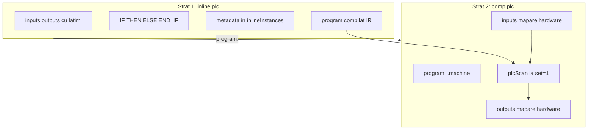
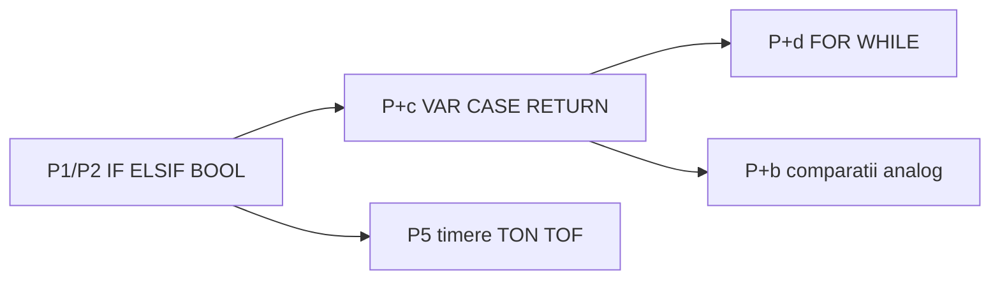
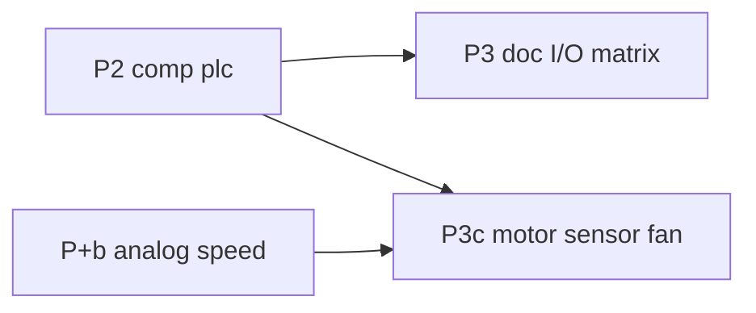
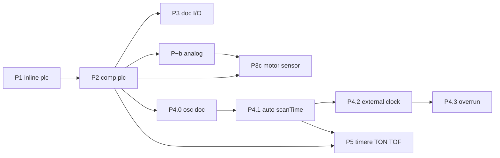

# Plan: `comp [plc]` — analiză și roadmap

Sursă idei: [comp_plc.txt](../my_ideas/comp_plc.txt)

Model plan: [comp_cache.plan.md](comp_cache.plan.md), [comp_cpu.plan.md](comp_cpu.plan.md)

---

## Stare actuală (v0_3_2)

| Element | Status |
|---------|--------|
| `inline [plc]` | **Nu există** — parser: doar `asm`, `lut`, `protocol` |
| `comp [plc]` | **Nu există** |
| `button`, `motor`, `fan`, `sensor` | **Nu există** (schiță aspiratională) |
| Substituenți intrări | `key`, `switch`, `dip`, `slider`, `rotary` |
| Substituenți ieșiri | `led`, `bar`, `reg`, `clcd` (multi-bit — via wires) |
| `doc/plc.md` | **Lipsește** |

---

## Arhitectură confirmată: două straturi (ca ASM + CPU)

**Da — exact modelul `inline [asm]` + `comp [cpu]`.**



| | `inline [asm]` | `inline [plc]` |
|---|----------------|----------------|
| **Ce definește** | ISA: opcodes, consts, macros, micro | Simboluri I/O + **lățimi** + logică BOOL |
| **La declarare** | `parseIsaBody` → `inlineInstances` | `parsePlcBody` → `inlineInstances` |
| **Nu rulează singur** | Da — trebuie `comp [cpu]` | Da — trebuie `comp [plc]` |
| **Legătură** | `isa: .cpuisa` | `program: .machine` |
| **Execuție** | `cpuStep` / fetch-decode | `plcScan` / read-logic-write |

`inline [plc]` **nu** este script LogTscript obișnuit — este **sub-limbaj** cu metadata proprie (ca ASM are metadata opcode, PLC are metadata simbol + lățime + IR).

---

## Decizii închise (iterație plan)

| ID | Decizie |
|----|---------|
| **P-FIX1** | În toate exemplele/doc: **`motorWire -> .motor1` greșit** → **`.motor1 = motorWire`** (sau bloc `{ value, set }`) |
| **P-FIX2** | **`comp [plc]` canonic LogTscript** — **nu** pin `:on` pentru comandă motor; output = asignare directă / wire (confirmat) |
| **P-ARCH1** | Implementare: **P1 `inline [plc]`** apoi **P2 `comp [plc]`** |
| **P-ARCH2** | **P5** timere TON/TOF — fază activă; **P+b** analog — amânat |
| **P-W1** | Declarație simbol: **`START: 1`** sau **`START`** (alone) — ambele valide |
| **P-W2** | **P1/P2:** logică (`IF`, `AND`, `OR`, `NOT`, `XOR`) **doar pe simboluri 1 bit** (confirmat) |
| **P-W3** | Mapare `comp [plc]`: **lățime strictă** simbol ↔ wire/comp (confirmat) |
| **P-W4** | **`START` alone** = default **`1` bit**; explicit `START: 1` echivalent (confirmat) |
| **P-W5** | Simboluri `>1` bit declarabile în P1; **folosire în logică** doar din **P+b** (`IF TEMP > 50`, atribuiri multi-bit) |
| **P-MAP1** | Output → asignare directă `.led = val` / wire — **nu** pseudo-pin `:on` |
| **P-MAP2** | Input → wire sau `:get` componentă (resolver implicit) |
| **P-SCAN1** | **`scanTime` omis sau `0`:** mod **event-driven** — **fără** timer intern; scan la fiecare **`set = 1`** activ; execuție **instant** (`busy = 0`). **Nu** înseamnă „o singură execuție” — câte scan-uri declanșezi, atâtea rulează | **închis** |
| **P-SCAN2** | **`scanTime: N`** (N > 0, **ms**): mod **auto** — timer intern pe `comp [plc]`; scan periodic la fiecare **~N ms** fără `set` manual | **închis** |
| **P-SCAN3** | **Un scan** = read inputs → `executePlcScan` → write outputs → `scanCount++` (ca P2); indiferent de `scanTime` | **închis** |
| **P-SCAN4** | **Master clock:** `scanTime > 0` → ceas **intern**; `scanTime = 0` → trigger **extern** (`set` manual, `osc`, wave). **Nu** amestecăm ambele ca master fără regulă explicită | **închis** |
| **P-SCAN5** | **`busy`:** `0` când `scanTime = 0`; la **P4.1+** `busy = 1` pe durata execuției **simulate** a scan-ului (durată fixă configurabilă sau derivată) | **închis** |
| **P-SCAN6** | **`set` în timp ce `busy = 1`:** scan **ignorat** (nu queue — ca PLC real la overrun simplu); opțional pout **`skipped`** în P4.3 | **închis** |
| **P-SCAN7** | **Pattern osc extern** (fără timer PLC): `scanTime: 0` + `.ctrl:{ set = .clk:get }` + `on: raise` — documentat **P4.0/P4.2**, model DMA | **închis** |
| **P-SCAN8** | **Overrun/miss** (`strict:`): amânat **P4.3** — dacă durata scan depășește `scanTime`, cicluri ratate + contor | **închis** |
| **P-TMR1** | **TON / TOF** doar în **`inline [plc]`** — blocuri keyword în corpul programului; **fără** `comp [ton]` / `comp [tof]` separate | **închis** |
| **P-TMR2** | Timerele **nu** sunt I/O mapabil pe `comp [plc]`; rulează în **`executePlcScan`** cu stare persistentă între scan-uri | **închis** |
| **P-TMR3** | Avans timere la **granița de scan** (un tick TON/TOF per scan PLC) — nu timp real independent de PLC | **închis** |
| **P-TMR4** | **P5.1:** **TON** + **TOF** ✓; **P5.2:** **CTU** + **CTD** | **închis** |
| **P-TMR5** | **`PT` în scan-uri** (număr întreg de cicluri); doc: echivalent ms ≈ `PT × scanTime` când `scanTime > 0` | **închis** |
| **P-TMR6** | La **`scanTime: 0`**: `PT` = scan-uri la fiecare `set` activ (osc/manual) — **permis** | **închis** |
| **P-TMR7** | La **re-RUN**: stare timere **reset** (fără RETAIN în P5.1) | **închis** |
| **P-TMR8** | **Ordine evaluare IEC/ST:** blocurile TON/TOF rulează **în ordinea din corp**; `Q` actualizat înainte ca statement-urile următoare să-l citească în **același scan** | **închis** |
| **P-TMR9** | **P5.1 (MVP plasare):** TON/TOF ca statements **top-level** și în corpul **`IF`/`THEN`/`ELSE`/`ELSIF`** | **închis** |
| **P-TMR13** | **Fază amânată P5.3:** extindere **plasare completă IEC/ST** — TON/TOF **oriunde e permis un statement** în corpul programului (inclusiv în `CASE`/`FOR`/`WHILE` odată cu **P+c**/**P+d**) | **închis** (țintă) |
| **P-TMR10** | **P5.1:** doar **`name.Q`** expus; **fără** `ET`, **fără** `R` (reset explicit) | **închis** |
| **P-TMR11** | **`PT` ≥ 1** — `PT = 0` → eroare parse | **închis** |
| **P-TMR12** | **`IN`** = expresie 1-bit completă; **`name.Q`** read-only (atribuire → eroare); **nume timer unic** (duplicat → eroare parse) | **închis** |
| **P-CTR1** | **P5.2:** **CTU** + **CTD** în **`inline [plc]`** — același model ca TON/TOF (fără `comp` separate) | **închis** |
| **P-CTR2** | **RETAIN** amânat **P5.2b** — la re-RUN stare contoare/timere **reset** (ca P5.1) până atunci | **închis** |
| **P-CTR3** | **CTU:** `CTU name(CU := expr, R := expr, PV := n)` — sintaxă confirmată | **închis** |
| **P-CTR4** | **CTD:** `CTD name(CD := expr, LD := expr, PV := n)` — model IEC (load `LD`, nu `R`) | **închis** |
| **P-CTR5** | **`CU` / `CD`:** numără la **front rising 0→1** între scan-uri (IEC), nu la nivel `1` continuu | **închis** |
| **P-CTR6** | **CTU:** `R = 1` → `CV := 0`, `Q := 0` (prioritar, ignoră `CU` în același scan); altfel front `CU` → `CV++`; `Q := (CV >= PV)` | **închis** |
| **P-CTR7** | **CTD:** `LD = 1` → `CV := PV` (prioritar); altfel front `CD` → `CV--` dacă `CV > 0`; `Q := (CV <= 0)` | **închis** |
| **P-CTR8** | **`PV` ≥ 1** — `PV = 0` → eroare parse | **închis** |
| **P-CTR9** | Expunere **`name.Q`** (1-bit) și **`name.CV`** (întreg); **`.CV`** comparabil cu **literal numeric** în `IF` (`>=`, `<=`, `==`, `>`, `<`) — extensie minimă P5.2, nu deschide P+b complet | **închis** |
| **P-CTR10** | Plasare ca P5.1 (top-level + `IF`); **`counterState`** per `comp [plc]`; nume unice (fără conflict I/O / timere / contoare); **`.Q` / `.CV`** read-only | **închis** |
| **P-IO1** | **Nu** există `comp [button]` — intrări digitale: **`key`**, **`switch`**, **`dip`** (confirmat) |
| **P-IO2** | **P2/P3:** ieșiri digitale 1-bit: **`led`**, **`reg`**, wires; **nu** mapare directă `comp [plc]` → `clcd` |
| **P-IO3** | **`clcd`:** doar prin **wires multi-bit** + logică LogTscript în afara PLC (`:get` / bloc `{ value, set }`) |
| **P-IO4** | **`motor`**, **`sensor`**, **`fan`**, alias **`button`** — **amânat P3c** (complexitate motor: viteză, tip, rotație) |
| **P-D4** | Operatori / control v1 | **P1/P2:** `IF/THEN/ELSE/ELSIF/END_IF`, `AND/OR/NOT/XOR`, `TRUE/FALSE`; **P+c/d:** restul ST |
| **P-D6** | Validare mapări: **eroare strictă** la elaborare `comp [plc]` | **închis** |
| **P-D7** | Output neasignat în scan: **păstrează ultima valoare** (ca PLC real) | **închis** |
| **P-D8** | Corp program: **listă secvențială** — atribuiri top-level + `IF`-uri multiple, o trecere per scan | **închis** |
| **P-D9** | `inputs` **read-only**; `outputs` **citibile** în expresii (valoare curentă din scan, ca ST) | **închis** |

---

## P-D4 — Operatori și control (decizie închisă)

**Operatori booleeni:** `AND`, `OR`, `NOT`, `XOR` — standard IEC 61131-3 ST.

**Control flow de la P1 (nu amânat):**
- **`ELSIF`** — da, există în ST (`IF … THEN … ELSIF … THEN … ELSE … END_IF`); echivalent cu lanț `ELSE IF`, dar idiom ST/PLC.
- **`TRUE` / `FALSE`** — da, literali booleani ST; **`0` / `1`** rămân alias acceptați în context 1-bit.

**Decizie:** **`ELSIF` + `TRUE`/`FALSE` din prima implementare (P1)** — același parser cu `IF/ELSE`, cost mic, limbaj mai autentic.

**Nu în P1/P2:** `CASE`, `FOR`, `WHILE`, `VAR` — faze **P+c** / **P+d**.

---

## P-D7 / P-D8 / P-D9 — Semantica execuție scan (P1/P2, închis)

### P-D7 — Output neasignat

**Decizie:** output-ul **păstrează ultima valoare** dacă nu e atribuit în scan-ul curent (ca PLC real).

```logts
IF START THEN
  MOTOR = 1
END_IF
```

Când `START = 0`, `MOTOR` rămâne la valoarea anterioară (latch implicit fără `VAR`). Pentru logică combinațională strictă, programatorul folosește `ELSE MOTOR = 0` sau atribuire top-level.

La **primul scan** (fără istoric): output-urile pornesc la **`0` / `FALSE`**.

### P-D8 — Structura corpului

**Decizie:** corpul = **listă secvențială de statements** (ca ST / PLC real):

- atribuiri top-level (`MOTOR = START AND NOT STOP`)
- blocuri `IF … END_IF` (multiple, în ordine)
- **un** impuls `set = 1` = **o trecere** completă prin listă (fără bucle în P1/P2)

Ordinea contează: ultima atribuire la același simbol câștigă în acel scan.

### P-D9 — Read-only inputs, outputs citibile

| Simbol | Citire în expresie | Atribuire |
|--------|-------------------|-----------|
| **input** | da (valoare citită la începutul scan-ului) | **eroare** la parse |
| **output** | da (valoare curentă din scan — ce s-a scris deja) | da |
| **input în P+c `VAR`** | — | amânat P+c |

Eroare parse (ex.): `plc program: cannot assign to input START`.

---

## Lexicon — keyworduri `inline [plc]` (IEC 61131-3 ST-inspired)

Lista completă țintă vs ce implementăm per fază. Modelul ST (Structured Text) din IEC 61131-3 include aproape toate keywordurile enumerate de utilizator.

### Tabel master keyworduri

| Keyword | Rol (ST) | Fază plan |
|---------|----------|-----------|
| **`inputs:`** | Interfață intrări (mapate la `comp [plc]`) | **P1/P2** |
| **`outputs:`** | Interfață ieșiri | **P1/P2** |
| **`IF`** | Condiție | **P1/P2** |
| **`THEN`** | Ramură true | **P1/P2** |
| **`ELSE`** | Ramură false | **P1/P2** |
| **`ELSIF`** | Lanț else-if | **P1/P2** |
| **`END_IF`** | Închide `IF` | **P1/P2** |
| **`AND`**, **`OR`**, **`NOT`**, **`XOR`** | Operatori booleeni | **P1/P2** |
| **`TRUE`**, **`FALSE`** | Literali booleani | **P1/P2** |
| **`0`**, **`1`** | Literali booleani (alias) | **P1/P2** |
| **`=`** | Atribuire | **P1/P2** |
| **`VAR`** … **`END_VAR`** | Variabile **interne** (memorie între scan-uri) | **P+c** |
| **`CONST`** … **`END_CONST`** | Constante program | **P+c** |
| **`CASE`** … **`OF`** … **`END_CASE`** | Selecție multiplă | **P+c** |
| **`RETURN`** | Ieșire timpurie din corp program (sfârșit scan logic) | **P+c** |
| **`FOR`** … **`TO`** … **`BY`** … **`DO`** … **`END_FOR`** | Buclă numărată | **P+d** |
| **`WHILE`** … **`DO`** … **`END_WHILE`** | Buclă condiționată | **P+d** |
| **`>`**, **`<`**, **`==`**, … | Comparații | **P+b** (analog) |
| **`TON`**, **`TOF`** | Timere on/off-delay | **P5.1** ✓ |
| **`CTU`**, **`CTD`** | Contoare up/down (IEC FB) | **P5.2** |
| **`>=`**, **`<=`**, **`==`**, … pe **`.CV`** | Comparații contor ↔ literal | **P5.2** (minim); restul analog → **P+b** |

**Nu în plan (ST are, amânăm):** `REPEAT`/`UNTIL`, `EXIT`, `VAR_INPUT`/`VAR_OUTPUT` separate — la noi `inputs:`/`outputs:` acoperă interfața.

### P1/P2 — nucleu (primul program rulabil)

```logts
inline [plc] .machine:
  inputs: { START, STOP: 1 }
  outputs: { MOTOR }
  IF START AND NOT STOP THEN
    MOTOR = TRUE
  ELSIF STOP THEN
    MOTOR = FALSE
  ELSE
    MOTOR = FALSE
  END_IF
  :
```

| Grup | Keyworduri |
|------|------------|
| Declarații | `inputs:`, `outputs:`, `{`, `}` |
| Condițional | `IF`, `THEN`, `ELSE`, `ELSIF`, `END_IF` |
| Booleans | `AND`, `OR`, `NOT`, `XOR`, `(`, `)` |
| Literali | `TRUE`, `FALSE`, `0`, `1` |
| Atribuire | `=` |

**Semantica scan (P-D7–P-D9):** un impuls `set` = o trecere secvențială prin corp; outputs păstrează valoarea dacă nu sunt atribuite; inputs read-only; outputs citibile în același scan.

### P+c — memorie internă + control (după P2 stabil)

**`VAR` / `END_VAR`** — variabile **nu** mapate la hardware; persistă între scan-uri (relee interne, tip `M0`):

```logts
VAR
  latch: 1
  step: 1
END_VAR

IF START AND NOT latch THEN
  latch = TRUE
END_IF
MOTOR = latch AND NOT STOP
```

| Keyword | Notă |
|---------|------|
| `VAR` / `END_VAR` | Declarație cu lățime (`name: N` sau default 1) |
| `CONST` / `END_CONST` | Valori fixe în program (`MAX: 8 = 100` în P+b) |
| `CASE expr OF` … `END_CASE` | `expr` 1-bit sau multi-bit (P+b); ramuri `1:`, `2:`, `ELSE:` |
| `RETURN` | Oprește execuția corpului în **acest scan** (outputs deja setate rămân) |

**Diferență față de `inputs`/`outputs`:** `inputs`/`outputs` = interfață spre hardware (mapare obligatorie pe `comp [plc]`); `VAR` = stare internă PLC.

### P+d — bucle (după P+c)

Într-un **singur scan**, bucla rulează complet (ca ST), cu **limită de iterații** la implementare (protecție buclă infinită, ex. max 65535).

```logts
FOR i := 1 TO 4 BY 1 DO
  ; corp — util mai mult cu array / multi-bit (P+b)
END_FOR

WHILE condition DO
  ...
END_WHILE
```

| Keyword | Fază |
|---------|------|
| `FOR`, `TO`, `BY`, `DO`, `END_FOR` | P+d |
| `WHILE`, `DO`, `END_WHILE` | P+d |

**Didactic P1/P2:** buclele sunt **rare** în PLC clasic (logică combinațională per scan); le amânăm intenționat.

### Operatori și precedență (P1/P2+)

`NOT` > `AND` > `OR` > `XOR` — keyworduri **case-insensitive** (`if` = `IF`).

### Identificatori

Simboluri `START`, `MOTOR`, `latch` — nu pot fi keyworduri rezervate. Propunere: **majuscule** pentru I/O, minuscule permise în `VAR` (de confirmat la implementare).

### Comentarii

`;` până la newline (ca `inline [asm]`).

### Ce rămâne în LogTscript (nu keyword PLC)

`comp [plc]`, `program:`, mapări `= .start`, `on:`, `probe`, `show`.

### Diagramă faze limbaj



### `comp [plc]` — atribute (nu keyworduri în program)

| Atribut | Fază | Descriere |
|---------|------|-----------|
| `program:` | P2 | Referință `inline [plc]` |
| `inputs:` / `outputs:` | P2 | Mapări simbol → wire/comp |
| `on:` | P2 | Trigger property block (`set`) |
| `scanTime:` | **P4.1** | `0` sau omis = event-driven instant; `N` ms = auto-scan periodic |
| `scanDuration:` | **P4.1** (opțional) | Durată simulată execuție scan (ms); default mic (ex. 1) — cât ține `busy = 1` |
| `strict:` | **P4.3** | `0` (default) = întârzie următorul ciclu; `1` = overrun/miss explicit |

---

## P-D6 — Erori mapare (decizie închisă)

**Principiu:** **fail fast la elaborare** (`createDevice` pe `comp [plc]`) — nu la runtime în timpul scan-ului. Programul PLC nu pornește cu mapări incomplete sau inconsistente.

### Erori obligatorii (hard error)

| Verificare | Când | Mesaj (exemplu) |
|------------|------|-----------------|
| Simbol în `inline [plc]` **inputs/outputs** dar **lipsă** din `comp [plc]` mapare | elaborare | `plc .ctrl: input START declared in program but not mapped` |
| Cheie în `comp [plc]` `inputs:{ }` / `outputs:{ }` **necunoscută** în program | elaborare | `plc .ctrl: mapping STOP is not declared in program .machine` |
| Simbol folosit în corp (`IF`, atribuire) dar **nedeclarat** | parse `inline [plc]` | `plc program: unknown symbol ALARM` |
| Atribuire la simbol **input** | parse `inline [plc]` | `plc program: cannot assign to input START` |
| Lățime mapare ≠ lățime simbol | elaborare | `plc .ctrl: MOTOR width 1 does not match wire motorCmd (8 bits)` |
| `program:` lipsă sau ref invalid | elaborare | `plc requires program: inline [plc]` |
| Simbol multi-bit folosit în `IF`/`AND`/… (**P1/P2**) | parse | `plc program: IF requires 1-bit symbol, got TEMP (8 bits)` |

### Comportament la scan (runtime)

| Situație | Comportament |
|----------|--------------|
| Mapare validă la elaborare | scan normal |
| Citire input eșuată (comp șters?) | eroare runtime — nu ar trebui după elaborare reușită |
| **Nu** există fallback `simbol nemapat → 0` | evită „merge din greșeală” |

### Mapare parțială intenționată?

**Nu** în v1. Dacă vrei să lași `TEMP:8` pentru P+b dar să nu mapezi încă, **nu** declara simbolul în program până îl folosești — sau folosește program separat. Alternativ viitoare: atribut `optional:` pe simbol (nu în P1/P2).

### Simetrie inputs / outputs

- Fiecare simbol din declarația `inline [plc]` trebuie **exact o** intrare în maparea `comp [plc]` (aceeași categorie: input→inputs, output→outputs).
- Mapări **extra** (chei fără simbol în program) = **eroare** — prinde typo-uri (`STRAT` vs `START`).

---

## Clarificare: `on:` (atribut) vs semnal comandă motor

În LogTscript există **două lucruri diferite** care în schiță sunt amestecate:

### 1. Atributul `on:` pe componentă

**Ce este:** modul în care un **property block** (`.comp:{ ... }`) se declanșează.

```logts
comp [led] .motorLed:
  on: 1          # level-triggered: rulează cât set=1
  :

.motorLed:{ value = cmd, set = 1 }
```

| Valoare `on:` | Semnificație |
|---------------|--------------|
| `raise` (default) | Blocul rulează la front `0→1` pe `set` |
| `edge` | Front `1→0` |
| `on: 1` | Level: rulează cât `set` este `1` |

**Nu** înseamnă „motorul merge” — înseamnă **când** se aplică pinii din acel bloc.

### 2. Semnalul de comandă (ce vrea PLC-ul)

**Ce este:** valoarea logică `0`/`1` (sau multi-bit) care **pornește/oprește** actuatorul.

În schiță (greșit):
```logts
# Sketch sugerează intern:
MOTOR = 1  →  .motor1:on = 1   # NU — :on nu e pin comandă!
```

**Corect în LogTscript v1:**
```logts
# Mapare output MOTOR:1 → componentă
MOTOR = 1  →  .motorLed = 1
# sau wire
MOTOR = 1  →  motorWire = 1  →  .motorLed = motorWire
```

### Exemplu complet (corect)

```logts
inline [plc] .machine:
  inputs: { START: 1, STOP: 1 }
  outputs: { MOTOR: 1 }
  IF START AND NOT STOP THEN
    MOTOR = 1
  ELSE
    MOTOR = 0
  END_IF
  :

1wire motorCmd

comp [key] .start:
  on: 1
  :

comp [switch] .stop:
  on: 1
  :

comp [led] .motorLed:
  on: 1
  :

comp [plc] .ctrl:
  program: .machine
  inputs: {
    START = .start
    STOP = .stop
  }
  outputs: {
    MOTOR = motorCmd
  }
  on: 1
  :

# Logica INAFARA programului PLC (permis de schiță)
.motorLed = motorCmd

# Un scan = citește START/STOP, evaluează IF, scrie motorCmd
.ctrl:{ set = 1 }

probe(motorCmd)
show(motorCmd)
```

**Load & Run:** `motorCmd` = `1` când START activ și STOP inactiv.

**Notă:** `.ctrl` are `on: 1` (când se aplică scan-ul), `.motorLed` are `on: 1` (când se propagă `motorCmd` → LED). Sunt **două `on:` independente**.

---

## Lățimi I/O — recomandare didactică + extensibil

### Principiu

- **LogTscript** are wires cu lățimi arbitrare (`1wire`, `8wire`, …).
- **`inline [plc]`** declară simboluri cu **lățime fixă** (metadata, ca ASM declară `R4b`).
- **`comp [plc]`** mapează simbol → sursă cu **aceeași lățime**.

### Sintaxă declarație (în `inline [plc]`)

```logts
inline [plc] .machine:
  inputs: {
    START          # alone → 1 bit (P-W4)
    STOP: 1        # explicit → echivalent
    TEMP: 8        # declarat; logică în P+b
  }
  outputs: {
    MOTOR          # alone → 1 bit
    SPEED: 8       # P+b
  }
  ...
```

| Regulă | Detaliu |
|--------|---------|
| `NUME` fără `:N` | **`NUME: 1`** (default 1 bit) — **confirmat** |
| `NUME: N` | simbol cu lățime N biți |
| IF / AND / NOT (**P1/P2**) | doar simboluri **1 bit** — **confirmat** |
| Mapare `comp [plc]` | **lățime strictă** — **confirmat** |
| **P+b** | `IF TEMP > 50`, atribuiri multi-bit pe `SPEED: 8` etc. |

### Faze și lățimi

| Fază | Ce permitem |
|------|-------------|
| **P1/P2** | Declarații orice lățime; **logică** doar 1-bit; mapare strictă |
| **P+b** | `IF TEMP > 50`, `SPEED = TEMP`, senzori multi-bit |

### Substituenți (P2 — componente existente, fără `button`/`motor`)

Schița `comp_plc.txt` menționează `button`, `motor`, `fan`, `sensor` — **niciuna nu există în v0_3_2**. Pentru P1/P2 folosim ce avem:

| Rol didactic | Simbol PLC | Lățime | Substituent LogTscript | Mapare |
|--------------|------------|--------|------------------------|--------|
| Buton momentan | `START` | 1 | `comp [key]` | `START = .start` → `:get` |
| Comutator | `STOP`, `ENABLE` | 1 | `comp [switch]` | `STOP = .sw` |
| Intrări paralele | `SEL` | N | `comp [dip]` | `SEL = .dip` (lățime = `length`) |
| Indicator on/off | `MOTOR`, `ALARM` | 1 | `comp [led]` | `MOTOR = .led` sau `motorWire` |
| Stocare comandă | `CMD` | N | `comp [reg]` | `CMD = .reg` + bloc `set` |
| Port I/O | — | N | `comp [ioport]` | P+b doc |
| **Afișaj** | — | — | **`comp [clcd]`** | **nu direct** — vezi mai jos |

**Wires:** orice lățime; PLC mapează strict (`1wire` ↔ simbol `:1`, `8wire` ↔ `TEMP:8` în P+b).

### `comp [clcd]` și PLC (P3 — pattern wire, nu mapare directă)

`clcd` este **multi-bit** (`:get` display, simboluri touch, `touchReset`) — nu e un actuator 1-bit ca `led`.

**P2/P3:** PLC **nu** mapează direct `OUTPUT = .panel` pentru CLCD. Pattern recomandat:

```logts
# PLC comandă un singur bit (ex. ALARM)
1wire alarmCmd

comp [plc] .ctrl:
  outputs: { ALARM = alarmCmd }
  ...

# În afara PLC: alarmCmd → simbol/bit CLCD sau text
.panel:{ value = alarmCmd, set = 1 }   # sau logică mai bogată pe wires
```

Pentru text/status pe display: wires multi-bit (`8wire statusCode`) mapate în P+b sau logică script între PLC și `.panel:{ value, set }`. Documentăm pattern-ul în `plc.md` (secțiune P3), fără componentă nouă.

### P3 — Documentare I/O (fără componente noi obligatorii)

**Scop:** `plc.md` + tabel „ce există astăzi” — înlocuiește referințele greșite la `button.md` / `motor.md` din schiță.

- Matrice input: `key`, `switch`, `dip`, `slider` (P+b), `clcd` touch (via wires, avansat)
- Matrice output: `led`, `reg`, `bar`, `clcd` (via wires)
- Exemple `logts-play`: START/STOP/MOTOR cu substituenți reali
- **Nu** implementăm `comp [button]` ca alias — opțional foarte târziu în P3c

### P3c — Componente dedicate actuator/senzor (amânat)

Schița și cerința utilizator: **`motor`**, **`sensor`**, eventual **`fan`**, **`button`** (alias pedagogic).

**De ce amânat (nu P2/P3):**

| Componentă | Complexitate | Note design viitoare |
|------------|--------------|----------------------|
| **`button`** | Mică | Alias peste `key` — prioritate scăzută |
| **`fan`** | Medie | On/off + eventual viteză PWM (legat de P+b) |
| **`sensor`** | Medie–mare | Vizual diferit; digital 1-bit vs analog multi-bit (`TEMP:8`) |
| **`motor`** | **Mare** | Nu e doar 0/1: **viteză**, direcție, tip motor (DC servo, stepper, „rotire vizuală”), rampă, poziție — depinde de P+b și poate componentă vizuală separată |

**Propunere P3c (când se deschide faza):**
- Sub-faze: **P3c-digital** (motor on/off simplu, senzor digital) apoi **P3c-motion** (viteză, RPM, tipuri motor)
- Mapare PLC: simboluri cu lățime potrivită (`MOTOR:1` run, `SPEED:8` în P+b)
- Vizual: motor/sensor ca componente UI proprii (nu doar LED)
- Integrare PLC: același model `outputs:{ MOTOR = .m1 }` cu resolver pe componentă

**Legătură faze:** P3c după **P2** stabil; **P+b** pentru analog/viteză; **P5** pentru timere motor (TON pornire întârziată etc.)



---

## Îmbunătățiri schiță (comp_plc.txt)

| # | Acțiune | Status plan |
|---|---------|-------------|
| 1 | `->` → `=` | **P-FIX1** închis |
| 2 | Clarificare `on:` vs comandă | secțiune de mai sus + exemplu |
| 3 | Exemplu complet | secțiune de mai sus |
| 4 | Limitări v1 + faze P5/P+b | mai jos |
| 5 | Substituenți + lățimi | secțiune lățimi |
| 6 | Erori documentate | P2 teste |
| 7 | Legătură `on:raise` vs PLC | doc plc.md |

---

## Faze implementare



### P1 — `inline [plc]` (limbaj + metadata) — **în execuție**

**Fișiere:** `core/plc-assembler.js`, `parser.js`, `interpreter.js`, `doc/plc.md`

- Parse `inputs:{ SYM }` și `inputs:{ SYM: N }` (default width 1)
- Parse `IF / THEN / ELSE / ELSIF / END_IF`, `AND`, `OR`, `NOT`, `XOR`, `TRUE`/`FALSE`, atribuiri
- Compile → IR (AST statements) în `inlineInstances` (kind `plc`)
- `executePlcScan(inst, inputs, outputState)` — motor scan (folosit de teste + P2)
- Validare: simbol folosit ⊆ declarat; assign la input → eroare; IF pe multi-bit → eroare
- `doc(.machine)` / `doc(inline.plc)` via `formatPlcInstanceDoc`
- **Nu** acces hardware în P1 (dar `comp [plc]` minimal pentru exemple `logts-play` rulabile)

**Teste:** `comp-plc-lang` (ID-uri 2750+)

**Doc P1 (`doc/plc.md`):**
- Referință limbaj `inline [plc]` (keyworduri, precedență, P-D7–P-D9)
- Exemple `logts-play` verificate în test_suite:
  1. START/STOP/MOTOR — `doc(.machine)` după parse
  2. ELSIF + TRUE/FALSE
  3. Eroare assign la input (comentat sau secțiune erori)
- Pentru exemple **rulabile** cu Load & Run care demonstrează comportament I/O: include **`comp [plc]` minimal** (scan la `set=1`, mapări wire/comp) — altfel Load & Run nu poate arăta MOTOR=1

**Integrare scripturi:** `test_scripts.json`, `script_editor_v0_3_2.html`, `run_tests.html` — adaugă `plc-assembler.js` (+ `plc.js` dacă exemple complete)

### P2 — `comp [plc]` (runtime)

**Fișiere:** `core/components/plc.js`, `devices/plc-devices.js`

- `program: .machine`, `inputs:{ }`, `outputs:{ }`, `on:`
- `plcScan`: read map → exec IR → write map
- `.plc:{ set = 1 }` = un scan
- pouts: `scanCount` (opțional `busy=0`)

**Teste:** `comp-plc` — exemplu START/STOP/MOTOR, reutilizare program, wires, erori lățime

**Doc:** `doc/plc.md` + `logts-play`; actualizare [comp_plc.txt](../my_ideas/comp_plc.txt)

### P3 — Documentare matrice I/O (substituenți existenți)

Vezi secțiunea **Substituenți** și **clcd via wires** de mai sus. Actualizare `plc.md` + `comp_plc.txt` (fără `button.md` inexistent).

**Nu** implementare obligatorie de componente noi în P3.

### P3c — `motor`, `sensor`, `fan`, `button` (amânat)

Componente dedicate cu UI și semantică proprie. **Motor** nu e boolean simplu — necesită design pentru viteză, direcție, tip actuator, eventual animație rotație. **Sensor** — vizual + digital/analog. Detalii în secțiunea P3c de mai sus.

### P4 — `scanTime`, `busy`, cicluri PLC (decizii închise)

**Scop:** comportament didactic „PLC real” (ritm periodic, `busy` cu sens) + opțiuni avansate, în **sub-faze P4.0–P4.3**. Model paralel cu DMA (`instant` / `paced`) și osc (ceas extern).

#### Ce înseamnă `scanTime` (definiție)

**`scanTime`** = perioada țintă (în **ms**) între două **cicluri complete** de scan:

```text
read inputs → executePlcScan → write outputs
```

| Valoare | Mod | Comportament |
|---------|-----|--------------|
| **omis** sau **`0`** | **event-driven** | Fără timer intern. Scan la fiecare **`set = 1`** (sau front pe `set` cu `on: raise`). Execuție **instant** — `busy` rămâne `0`. **Nu** = „rulează o singură dată”; = „scanezi când declanșezi, cât de des vrei”. |
| **`N > 0`** (ms) | **auto** | Timer **intern** pe `comp [plc]`: scan periodic la ~**N ms**, fără `set` manual la fiecare pas. |

**Un scan** = întotdeauna o trecere read → logic → write + `scanCount++` (P-D8). Numărul de scan-uri = câte cicluri s-au completat (auto sau la `set`), nu o limită impusă de `scanTime: 0`.

#### Decizii P-SCAN (rezumat)

Vezi tabelul **P-SCAN1…P-SCAN8** din secțiunea decizii. Principii:

- **Master clock unic:** `scanTime > 0` → intern; `scanTime = 0` → extern (`set`, osc, wave).
- **Fără queue** de scan-uri la `busy` — scan cerut în `busy` → **ignorat** (opțional `skipped` în P4.3).
- **Ieșiri** în `busy`: păstrează ultima valoare scrisă (P-D7).
- **Unități:** milisecunde (aliniat cu familia `osc` / timp real didactic).

---

#### P4.0 — Documentare pattern osc (fără cod obligatoriu)

**Stare:** funcționează **deja** în P2/P3; se documentează explicit în `plc.md`.

```logts
comp [plc] .ctrl:
  scanTime: 0          ; sau omis
  on: raise
  :

comp [osc] .clk:
  freq: 10
  :

.ctrl:{ set = .clk:get }
```

- Un front de ceas = un scan (cu `on: raise`).
- Model identic DMA paced + osc ([dma.md](../v0_3_2/doc/dma.md)).
- **Teste:** exemple `logts-play` + 1–2 teste `comp-plc` (ID 2775+).

**Livrabile:** secțiune „External clock” în `plc.md`; fără modificare `plc.js` obligatorie.

---

#### P4.1 — Auto-scan + `busy` simulat (MVP P4)

**Fișiere:** `plc.js`, `plc-devices.js`, `osc-timing` sau timer intern (reutilizare pattern `osc`)

| Element | Spec |
|---------|------|
| **`scanTime: N`** | N ms; N > 0 pornește timer la RUN |
| **Auto-scan** | La fiecare perioadă: același `_plcScan` ca P2 |
| **`scanDuration:`** | Opțional; ms simulat cât `busy = 1` per scan (default ex. `1`) |
| **`busy`** | `1` în `[scanDuration]`; altfel `0` |
| **`scanTime: 0`** | Comportament P2 neschimbat |
| **Stop** | La re-RUN / destroy: oprește timer (ca `osc`) |

**Exemplu didactic:**

```logts
comp [plc] .ctrl:
  program: .machine
  scanTime: 200
  scanDuration: 2
  inputs: { START = .start }
  outputs: { MOTOR = .motorLed }
  on: 1
  :
```

Load & Run → ~5 scan-uri/s; `scanCount` crește; `busy` pulsează scurt.

**Teste:** `comp-plc` — auto-scan incrementează `scanCount`; `busy` pulse; `scanTime: 0` regresie P2.

**Doc:** `logts-play` verificat; `doc(.ctrl)` afișează `scanTime`, `busy`.

---

#### P4.2 — Mod external explicit + integrare wave

**Scop:** clarificare API și teste pentru scenarii sincronizate (CPU, DMA, PLC pe același osc).

| Element | Spec |
|---------|------|
| **Mod implicit** | `scanTime: 0` → **external** (nu pornește timer) |
| **`set` manual** | `.ctrl:{ set = 1 }` — un scan per evaluare (cu `on: 1` / `on: raise`) |
| **Osc / wave** | `.ctrl:{ set = .clk:get }` documentat ca pattern canonic |
| **Conflict** | Dacă `scanTime > 0` **și** `set` extern în același script: `set` manual poate forța scan suplimentar **doar dacă nu e busy** (P-SCAN6); timerul rămâne master pentru perioadă |

**Livrabile:** `plc.md` secțiune „Alegerea ceasului”; teste osc + PLC în același script.

---

#### P4.3 — Overrun / miss (opțional, avansat)

**Scop:** lecție „PLC nu e infinit de rapid” — când execuția (reală sau `scanDuration`) depășește `scanTime`.

| Atribut | `strict: 0` (default) | `strict: 1` |
|---------|----------------------|-------------|
| Execuție > `scanTime` | Următorul ciclu **întârzie** (stretch) | Ciclu **ratat** (miss) |
| Pout nou | — | **`overrunCount`** (16 bit) sau `missed` (1 bit) |
| `busy` | Ca P4.1 | `1` + flag miss la overlap |

**Nu:** queue de scan-uri — la PLC real se pierde ciclul, nu se face FIFO.

**Livrabile:** secțiune avansată `plc.md`; teste cu `scanTime` mic + `scanDuration` mare.

---

#### P4 — ordine implementare recomandată

```text
P4.0 (doc)  →  P4.1 (auto + busy)  →  P4.2 (teste osc)  →  P4.3 (strict, opțional)
```

**Legătură P5:** auto-scan la `scanTime > 0` pregătește terenul pentru timere TON/TOF în program (intrări citite la granița de scan).

### P5 — Timere TON / TOF (fază activă — decizii închise)

**Decizie:** timerele sunt **doar în limbajul `inline [plc]`** — keyworduri / blocuri, **nu** componente LogTscript separate pe panou.

#### De ce nu `comp [ton]`

| Aspect | `inline [plc]` | `comp [ton]` separat |
|--------|----------------|----------------------|
| Model IEC/ST | ✓ FB în program PLC | ✗ widget extern, necesită ceas + wiring |
| Stare între scan-uri | ✓ în `plc-assembler` / IR | duplicare cu runtime PLC |
| Didactic | un program, un scan | două lumi (PLC + timer chip) |

#### Unde rulează

- Parser + IR în **`plc-assembler.js`**
- Execuție în **`executePlcScan`** — la fiecare scan: eval statements + **tick blocuri TON/TOF**
- **Fără** mapare `inputs:`/`outputs:` pentru timere; **`Q`** citibil în expresii (ex. `delay1.Q`)

#### Sintaxă țintă (P5.1)

```logts
inline [plc] .machine:
  inputs: { START, STOP }
  outputs: { MOTOR }
  TON startDelay(IN := START, PT := 50)
  TOF coolOff(IN := STOP, PT := 30)
  IF startDelay.Q AND NOT coolOff.Q THEN
    MOTOR = 1
  ELSE
    MOTOR = 0
  END_IF
  :
```

| Element | Semnificație |
|---------|--------------|
| **`TON name(...)`** | On-delay — `Q = 1` după `PT` scan-uri cu `IN = 1` |
| **`TOF name(...)`** | Off-delay — `Q` rămâne 1 încă `PT` scan-uri după `IN = 0` |
| **`PT`** | Preset în **număr de scan-uri** (întreg ≥ 1) |
| **`IN`** | Expresie 1-bit (simbol input, output sau `.Q` altui timer) |
| **`name.Q`** | Ieșirea timerului în același scan |

#### Plasare în corp — IEC 61131-3 ST (P-TMR9, P-TMR13)

În **IEC/ST real**, apelurile FB (`TON`, `TOF`, …) sunt **statements**. Regula generală ST: pot sta **oriunde e permis un statement** în corpul programului (top-level, în ramuri `IF`, `CASE`, `FOR`, `WHILE`, etc.) — **nu** în expresii inline (`IF TON(...)`); se folosește `name.Q`.

**Țintă pe termen lung (P-TMR13):** urmăm această regulă **complet** — plasare liberă a TON/TOF în orice context statement din gramatică.

**P5.1 (MVP):** implementăm doar unde gramatica **P1/P2** permite statements astăzi:

| Locație | IEC/ST | LogTscript |
|---------|--------|------------|
| Top-level (secvențial, între `IF`-uri) | ✓ | **P5.1** ✓ |
| În `THEN` / `ELSE` / `ELSIF` | ✓ | **P5.1** ✓ |
| În `CASE` … `OF` | ✓ | **P5.3** (amânat, cu **P+c**) |
| În `FOR` / `WHILE` | ✓ | **P5.3** (amânat, cu **P+d**) |
| În expresii (`IF TON(...)` inline) | ✗ | ✗ — folosești `name.Q` |

**P5.3 (fază amânată):** când **P+c** / **P+d** adaugă `CASE`, `FOR`, `WHILE`, extindem parserul și execuția astfel încât **TON/TOF să fie permise în aceleași locuri ca în ST** — fără restricții artificiale suplimentare față de „oriunde e statement”.

**Exemplu valid P5.1** (timer în `IF`, ca în ST):

```logts
IF ENABLE THEN
  TON stepDelay(IN := STEP, PT := 10)
  OUT = stepDelay.Q
ELSE
  OUT = 0
END_IF
```

**Nu** în `inputs:` / `outputs:` — timerele nu sunt pinuri I/O mapabile.

#### Semantica execuție (P-TMR8…P-TMR12)

- **Ordine:** la fiecare scan, statement-urile (inclusiv TON/TOF) rulează **în ordinea listei**; `Q` e vizibil imediat pentru ce urmează în același scan (IEC).
- **`PT`:** întreg **≥ 1**; `PT = 0` → eroare parse.
- **`IN`:** orice expresie 1-bit validă (`START AND NOT STOP`, alt `.Q`, …).
- **`name.Q`:** read-only; `startDelay.Q = 1` → eroare parse.
- **Nume:** fiecare instanță timer are identificator **unic** în program.
- **P5.1:** fără `ET`, fără `R`; reset doar la re-RUN (P-TMR7).

#### Sub-faze P5

| Fază | Conținut | Status |
|------|----------|--------|
| **P5.1** | **TON** + **TOF**; plasare top-level + `IF`; teste; doc `logts-play` | **done** |
| **P5.2** | **CTU** + **CTD** (IEC/ST); `.Q` + `.CV`; comparații `CV` ↔ literal; teste; doc | **următor** |
| **P5.2b** *(amânat)* | **RETAIN** — stare timere/contoare supraviețuiește re-RUN | planificat |
| **P5.3** *(amânat)* | Plasare completă IEC/ST pentru toate FB-urile (`CASE` / `FOR` / `WHILE` cu **P+c** / **P+d**) | planificat |

#### P5.2 — Contoare CTU / CTD (decizii închise)

**Scope:** **CTU** + **CTD** în aceeași fază; **RETAIN** → **P5.2b** (nu în P5.2).

**Orientare:** didactic + apropiat de **IEC 61131-3** (function blocks), fără componente pe panou.

##### Sintaxă

```logts
CTU pieceCount(CU := SENSOR_PULSE, R := RESET, PV := 10)
CTD stepsLeft(CD := TICK, LD := LOAD, PV := 5)
IF pieceCount.Q THEN
  FULL = 1
ELSIF stepsLeft.CV <= 0 THEN
  DONE = 1
END_IF
```

| Bloc | Parametri | Rol IEC |
|------|-----------|---------|
| **CTU** | `CU`, `R`, `PV` | Count **up** — front pe `CU`; **reset** sincron pe `R` |
| **CTD** | `CD`, `LD`, `PV` | Count **down** — front pe `CD`; **load** preset pe `LD` |

##### Semantica execuție (per scan, ordine program)

**CTU** (prioritate ca la PLC real):

1. Dacă **`R = 1`** → `CV := 0`, `Q := 0` (nu procesa `CU` în același scan).
2. Altfel, dacă **`CU`** are **front 0→1** față de scan-ul anterior → `CV := CV + 1`.
3. **`Q := (CV >= PV)`**.

**CTD:**

1. Dacă **`LD = 1`** → `CV := PV` (reîncarcă preset; prioritar față de `CD` în același scan).
2. Altfel, dacă **`CD`** are **front 0→1** și **`CV > 0`** → `CV := CV - 1`.
3. **`Q := (CV <= 0)`** (țintă atinsă / sub zero).

**Stare:** `counterState` pe fiecare `comp [plc]` (`cv`, `q`, `prevCU`, `prevCD`) — independentă între două PLC-uri cu același program.

##### Ce e expus în program (P5.2)

| Membru | Tip | Utilizare |
|--------|-----|-----------|
| **`name.Q`** | 1-bit | `IF`, `AND`, atribuiri booleene |
| **`name.CV`** | întreg ≥ 0 | **`IF name.CV >= 10`**, `==`, `<=`, … cu **literal** (extensie minimă față de P1/P2) |

**Nu în P5.2:** `ET` la timere; RETAIN; comparații între simboluri multi-bit arbitrare (**P+b**).

##### Plasare

Identic **P5.1** / **P-TMR9:** top-level și în ramuri `IF`. **P5.3** extinde la `CASE`/`FOR`/`WHILE`.

##### P5.2b — RETAIN (amânat, de detaliat la deschidere)

- Păstrare `CV` / stare timere la re-RUN
- Sintaxă de declarat la implementare (atribut `comp [plc]` sau keyword program)
- **Nu** blochează P5.2

#### Dependențe P5

- **P4** (scan / `scanTime`) — recomandat pentru exemple didactice cu timp real
- **Nu** necesită **P+c `VAR`** — timerele au stare proprie în IR (separată de `VAR` din P+c)

**Fișiere:** `plc-assembler.js`, `plc.md`, `test_suite.js` (grup `comp-plc-lang` / `comp-plc`)

### P+b — Analog (amânat)

- Logică pe simboluri `>1` bit: **`IF TEMP > 50`**, comparații, praguri
- Atribuiri multi-bit (`SPEED = TEMP`, etc.)
- Senzori, `comp [slider]`, doc surse analogice

---

### P6 — Mai multe programe pe un `comp [plc]` (amânat)

**Motivație IEC:** un PLC real are **task-uri** cu **programe** diferite (ex. ciclic rapid 10 ms + ciclic lent 100 ms + event-driven). Fiecare program e un POU separat, dar toate rulează pe **același CPU** și pot partaja memorie.

**Scop LogTscript:** un singur `comp [plc]` să accepte **mai multe `program:`-uri** cu scan-uri independente sau coordonate.

**Decizii de luat la deschidere:**
- Sintaxă: `programs: [ .fast, .slow ]` sau atribut `task:` multiplu?
- Ordinea execuției: secvențial în scan sau task-uri cu `scanTime` propriu?
- Izolare stare: timer/counter per program sau global pe componentă?
- `doc(.ctrl)` ce afișează?

**Dependențe:** P+c (`VAR`), P7 (globals) — programele trebuie să poată comunica ceva dacă rulează separat.

---

### P7 — Memorie partajată între programe (amânat)

**Motivație IEC:** programe pe același PLC comunică prin:
- **`VAR_GLOBAL` / GVL** — variabile globale declarate o dată, accesibile din orice program
- **Zone M (memorie internă)** — flags/registre interne, echivalent cu releu intern (nu hardware)
- **Instanțe FB reutilizate** — același bloc de date (instanță) apelat din programe diferite

**Scop LogTscript:**
- Declarare `var_global:` (sau bloc dedicat) — simbol vizibil în mai multe `inline [plc]`
- Acces din program: citire/scriere ca orice simbol intern
- Nu mapabil pe `inputs:`/`outputs:` hardware — memoria internă nu are pin extern

**Decizii de luat la deschidere:**
- Scope: global per script sau per `comp [plc]`?
- Sintaxă: bloc `VAR_GLOBAL` în `inline [plc]`, sau atribut `globals:` pe `comp [plc]`?
- Lățimi: 1 bit (flag M) sau multi-bit (P+b)?
- Sincronizare (dacă P6 tasks): ultima scriere câștigă sau ordine definită?

**Dependențe:** P+c (`VAR` intern) ca precursor — globals = extensie a mecanismului VAR.

---

### P8 — Comunicare inter-PLC prin rețea (amânat)

**Motivație IEC:** comunicarea între PLC-uri fizice se face prin **fieldbus** (PROFINET, EtherCAT, Modbus, CANopen) sau **rețele industriale** — nu prin memorie partajată directă.

**LogTscript are deja:**
- `comp [network]` + `sock` + **packets** — comunicare între scripturi (modele existente)
- Baza pentru un **fieldbus didactic** PLC-to-PLC

**Scop:** un `comp [plc]` să poată **publica / consuma** variabile prin rețea:

```logts
; PLC A — publică
comp [plc] .ctrlA:
  program: .machineA
  publish: { MOTOR = plcBus.motor }   ; trimite pe rețea

; PLC B — consumă
comp [plc] .ctrlB:
  program: .machineB
  subscribe: { EXT_MOTOR = plcBus.motor }  ; primește de pe rețea
```

**Decizii de luat la deschidere:**
- Folosim `comp [network]` existent sau model nou `plc-bus`?
- Sincronizare cu scan: citire la start scan / scriere la final scan (ca I/O image)?
- Lățimi: 1 bit (digital) sau multi-bit (analog, P+b)?
- Latență: didactic instant (ca wires) sau simulat async (mai realist)?
- Vizibilitate: `publish`/`subscribe` vs `inputs:`/`outputs:` de rețea (nu hardware)?

**Dependențe:** `comp [network]` + `sock` (existente), P+b (pentru analog), P7 (globals — opțional pentru cache local).

---

## Decizii deschise

**P4 (scanTime / busy / cicluri):** **închis** — P-SCAN1…P-SCAN8, sub-faze P4.0–P4.3.

**P5.1 (TON/TOF):** **done**.

**P5.2 (CTU/CTD):** **închis** — P-CTR1…P-CTR10; **RETAIN** → **P5.2b**.

**Încă deschise / amânate:** P3c, **P5.2b**, **P5.3**, P+b, P+c/d, **P6** (multi-program), **P7** (globals/memorie partajată), **P8** (inter-PLC rețea).

**Următorul pas recomandat:** **P5.2** (implementare CTU/CTD).

---

## Fișiere cheie referință

| Rol | Cale |
|-----|------|
| Inline ASM model | [asm-assembler.js](../v0_3_2/core/asm-assembler.js), [interpreter.js](../v0_3_2/core/interpreter.js) `execInline` |
| CPU binding | [cpu.js](../v0_3_2/core/components/cpu.js) `isa:` |
| LED output pattern | [led.js](../v0_3_2/core/components/led.js) |
| Conditional logic fără PLC | [conditional-assignment.md](../v0_3_2/doc/conditional-assignment.md) |
| Doc model | [cache.md](../v0_3_2/doc/cache.md) |

---

## Estimare efort

| Fază | Efort relativ |
|------|----------------|
| P1 inline + lățimi | ~80% din cache A |
| P2 comp + mapare | ~40% |
| P4.0 doc osc | ~5% |
| P4.1 auto-scan + busy | ~30% P2 |
| P4.2 external + teste osc | ~15% P2 |
| P4.3 overrun (opțional) | ~20% P4.1 |
| P5 / P+b | fiecare ~50% P1 |

**Risc principal:** parser limbaj PLC (IF/THEN); maparea lățimi e mecanică dacă e strictă de la început.
