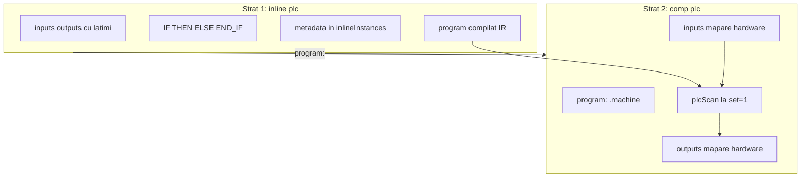
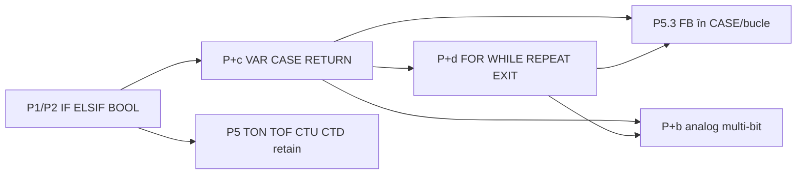
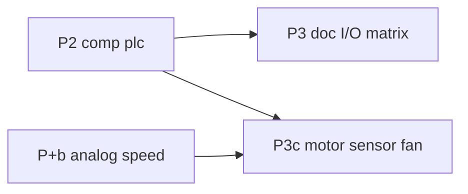
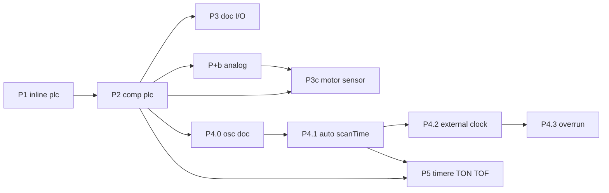
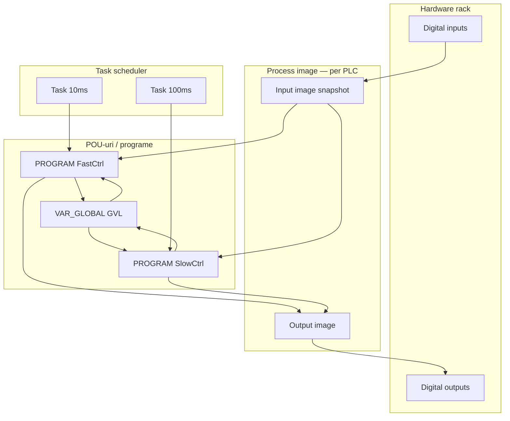

# Plan: `comp [plc]` — analiză și roadmap

Sursă idei: [comp_plc.txt](../my_ideas/comp_plc.txt)

Model plan: [comp_cache.plan.md](comp_cache.plan.md), [comp_cpu.plan.md](comp_cpu.plan.md)

---

## Filozofie de direcție (P-PHIL) — didactic implicit, opțiuni spre PLC real

**Aceasta este axa de produs pentru tot planul `inline [plc]` + `comp [plc]`.** Orice fază nouă (P+c, P+d, P+b, P6…) se judecă față de ea.

### Ce vrem

| Pol | Conținut |
|-----|----------|
| **Didactic** | Comportament **implicit simplu**, ușor de explica în clasă și în doc: reset la re-RUN, latch explicit, un scan = o trecere secvențială, erori clare la elaborare. |
| **Mai mult (opțional)** | **Atribute și moduri** pe `comp [plc]` (și extensii de limbaj când merită) care apropie comportamentul de un **PLC real IEC 61131-3 / ST** — fără a obliga utilizatorul să le folosească. |
| **IEC/ST ca reper** | Keyworduri, FB (`TON`/`CTU`…), scan cycle, outputs care rețin valoarea, `VAR` intern — nu inventăm un PLC paralel, **urmăm ST** unde e fezabil. |

### Reguli de design

1. **Default = didactic** — dacă nu configurezi nimic special, obții varianta ușor de înțeleles (ex. `retain: 0`, `scanTime: 0` event-driven, `VAR` reset la re-RUN).
2. **Opt-in = mai real** — utilizatorul **alege explicit** opțiuni (ex. `retain: 1`, `scanTime: N`, `strict: 1`, auto-scan, overrun) când vrea comportament mai apropiat de industrie.
3. **Nu keyword-uri de runtime în limbaj** când e mai clar pe componentă — ex. **RETAIN** pe `comp [plc]`, nu în `inline [plc]` (P-RET1).
4. **Creștere incrementală** — nu livrăm tot ST dintr-o dată; fiecare fază adaugă o fâșie autentică (IF → timere → contoare → VAR/CASE → bucle → analog).
5. **Strict la mapare și lățimi** — ca la PLC real: mismatch = eroare, nu „merge cu 0”.
6. **Două straturi** — program hardware-independent (`inline [plc]`) + runtime cu mapare și politici (`comp [plc]`), model **ASM + CPU**.

### Exemple: didactic vs opțional mai real

| Topic | Didactic (default) | Opțional mai real |
|-------|-------------------|-------------------|
| Re-RUN | Stare FB reset (`retain: 0`) | `retain: 1` — păstrează `timerState`/`counterState` în sesiune |
| Scan | `scanTime: 0` — declanșare manuală / osc | `scanTime: N` ms — auto-scan periodic |
| Execuție scan | Instant (`busy = 0`) | `scanDuration` + `busy` simulat |
| Overrun | `strict: 0` — stretch | `strict: 1` — `missed`, `overrunCount` |
| Memorie internă | `VAR` reset la re-RUN | (viitor: extindere `retain` sau P7 globals) |
| Limbaj | BOOL + IF + FB statements | P+c/d/b — ST extins (`CASE`, `FOR`, comparații analog) |

### Implicații pentru fazele următoare

- **P+c** (`VAR`, `CASE`, `RETURN`): memorie și control ST clasic; default simplu (VAR la 0, reset la re-RUN).
- **P+d** (`FOR`, `WHILE`, `REPEAT`/`UNTIL`, `EXIT`): bucle ST; limită iterații; **fără CONTINUE**; P5.3 FB în corp.
- **P+b**: analog multi-bit — extinde limbajul spre PLC real, nu doar panou 1-bit.
- **P6–P8**: task-uri, globals, rețea — opțional avansat, nu în calea exercițiilor de bază.

**Decizie închisă (P-PHIL1):** direcția produs = **didactic implicit + opțiuni explicite spre IEC/ST real**; nu un singur mod „industrial” forțat.

---

## Stare actuală (v0_3_2)

| Element | Status |
|---------|--------|
| `inline [plc]` | **Nu există** — parser: doar `asm`, `lut`, `protocol` |
| `comp [plc]` | **Nu există** |
| `button`, `motor`, `fan`, `sensor` | **Nu există** (schiță aspiratională) |
| Substituenți intrări | `key`, `switch`, `dip`, `slider`, `rotary` |
| Substituenți ieșiri | `led`, `bar`, `reg`, `clcd` (multi-bit — via wires) |
| `doc/plc.md` | **Lipsește** |

---

## Arhitectură confirmată: două straturi (ca ASM + CPU)

**Da — exact modelul `inline [asm]` + `comp [cpu]`.**



| | `inline [asm]` | `inline [plc]` |
|---|----------------|----------------|
| **Ce definește** | ISA: opcodes, consts, macros, micro | Simboluri I/O + **lățimi** + logică BOOL |
| **La declarare** | `parseIsaBody` → `inlineInstances` | `parsePlcBody` → `inlineInstances` |
| **Nu rulează singur** | Da — trebuie `comp [cpu]` | Da — trebuie `comp [plc]` |
| **Legătură** | `isa: .cpuisa` | `program: .machine` |
| **Execuție** | `cpuStep` / fetch-decode | `plcScan` / read-logic-write |

`inline [plc]` **nu** este script LogTscript obișnuit — este **sub-limbaj** cu metadata proprie (ca ASM are metadata opcode, PLC are metadata simbol + lățime + IR).

---

## Decizii închise (iterație plan)

| ID | Decizie |
|----|---------|
| **P-PHIL1** | **Filozofie de direcție:** didactic **implicit** (default simplu, ușor de explica) + **opțiuni explicite** pe `comp [plc]` / extensii limbaj pentru comportament **mai apropiat de PLC real IEC/ST** — vezi secțiunea [Filozofie de direcție](#filozofie-de-direcție-p-phil--didactic-implicit-opțiuni-spre-plc-real) | **închis** |
| **P-FIX1** | În toate exemplele/doc: **`motorWire -> .motor1` greșit** → **`.motor1 = motorWire`** (sau bloc `{ value, set }`) |
| **P-FIX2** | **`comp [plc]` canonic LogTscript** — **nu** pin `:on` pentru comandă motor; output = asignare directă / wire (confirmat) |
| **P-ARCH1** | Implementare: **P1 `inline [plc]`** apoi **P2 `comp [plc]`** |
| **P-ARCH2** | **P5** timere TON/TOF — fază activă; **P+b** analog — amânat |
| **P-W1** | Declarație simbol: **`START: 1`** sau **`START`** (alone) — ambele valide |
| **P-W2** | **P1/P2:** logică (`IF`, `AND`, `OR`, `NOT`, `XOR`) **doar pe simboluri 1 bit** (confirmat) |
| **P-W3** | Mapare `comp [plc]`: **lățime strictă** simbol ↔ wire/comp (confirmat) |
| **P-W4** | **`START` alone** = default **`1` bit**; explicit `START: 1` echivalent (confirmat) |
| **P-W5** | Simboluri `>1` bit declarabile în P1; **folosire în logică** doar din **P+b** (`IF TEMP > 50`, atribuiri multi-bit) |
| **P-MAP1** | Output → asignare directă `.led = val` / wire — **nu** pseudo-pin `:on` |
| **P-MAP2** | Input → wire sau `:get` componentă (resolver implicit) |
| **P-SCAN1** | **`scanTime` omis sau `0`:** mod **event-driven** — **fără** timer intern; scan la fiecare **`set = 1`** activ; execuție **instant** (`busy = 0`). **Nu** înseamnă „o singură execuție” — câte scan-uri declanșezi, atâtea rulează | **închis** |
| **P-SCAN2** | **`scanTime: N`** (N > 0, **ms**): mod **auto** — timer intern pe `comp [plc]`; scan periodic la fiecare **~N ms** fără `set` manual | **închis** |
| **P-SCAN3** | **Un scan** = read inputs → `executePlcScan` → write outputs → `scanCount++` (ca P2); indiferent de `scanTime` | **închis** |
| **P-SCAN4** | **Master clock:** `scanTime > 0` → ceas **intern**; `scanTime = 0` → trigger **extern** (`set` manual, `osc`, wave). **Nu** amestecăm ambele ca master fără regulă explicită | **închis** |
| **P-SCAN5** | **`busy`:** `0` când `scanTime = 0`; la **P4.1+** `busy = 1` pe durata execuției **simulate** a scan-ului (durată fixă configurabilă sau derivată) | **închis** |
| **P-SCAN6** | **`set` în timp ce `busy = 1`:** scan **ignorat** (nu queue — ca PLC real la overrun simplu); opțional pout **`skipped`** în P4.3 | **închis** |
| **P-SCAN7** | **Pattern osc extern** (fără timer PLC): `scanTime: 0` + `.ctrl:{ set = .clk:get }` + `on: raise` — documentat **P4.0/P4.2**, model DMA | **închis** |
| **P-SCAN8** | **Overrun/miss** (`strict:`): amânat **P4.3** — dacă durata scan depășește `scanTime`, cicluri ratate + contor | **închis** |
| **P-TMR1** | **TON / TOF** doar în **`inline [plc]`** — blocuri keyword în corpul programului; **fără** `comp [ton]` / `comp [tof]` separate | **închis** |
| **P-TMR2** | Timerele **nu** sunt I/O mapabil pe `comp [plc]`; rulează în **`executePlcScan`** cu stare persistentă între scan-uri | **închis** |
| **P-TMR3** | Avans timere la **granița de scan** (un tick TON/TOF per scan PLC) — nu timp real independent de PLC | **închis** |
| **P-TMR4** | **P5.1:** **TON** + **TOF** ✓; **P5.2:** **CTU** + **CTD** | **închis** |
| **P-TMR5** | **`PT` în scan-uri** (număr întreg de cicluri); doc: echivalent ms ≈ `PT × scanTime` când `scanTime > 0` | **închis** |
| **P-TMR6** | La **`scanTime: 0`**: `PT` = scan-uri la fiecare `set` activ (osc/manual) — **permis** | **închis** |
| **P-TMR7** | La **re-RUN**: stare timere **reset** când **`retain: 0`** (default); păstrare când **`retain: 1`** — **P5.2b** | **închis** |
| **P-TMR8** | **Ordine evaluare IEC/ST:** blocurile TON/TOF rulează **în ordinea din corp**; `Q` actualizat înainte ca statement-urile următoare să-l citească în **același scan** | **închis** |
| **P-TMR9** | **P5.1 (MVP plasare):** TON/TOF ca statements **top-level** și în corpul **`IF`/`THEN`/`ELSE`/`ELSIF`** | **închis** |
| **P-TMR13** | **P5.3:** plasare FB în `CASE` (**P+c**) și `FOR`/`WHILE`/`REPEAT` (**P+d**, P-PLC3-6 ✓) | **închis** |
| **P-TMR10** | **P5.1:** doar **`name.Q`** expus; **fără** `ET`, **fără** `R` (reset explicit) | **închis** |
| **P-TMR11** | **`PT` ≥ 1** — `PT = 0` → eroare parse | **închis** |
| **P-TMR12** | **`IN`** = expresie 1-bit completă; **`name.Q`** read-only (atribuire → eroare); **nume timer unic** (duplicat → eroare parse) | **închis** |
| **P-CTR1** | **P5.2:** **CTU** + **CTD** în **`inline [plc]`** — același model ca TON/TOF (fără `comp` separate) | **închis** |
| **P-CTR2** | Fără **`retain`** (default **`0`**): la re-RUN, **`timerState`** / **`counterState`** se **resetează**; cu **`retain: 1`** → **P5.2b** / **P-RET1…P-RET6** | **închis** |
| **P-CTR3** | **CTU:** `CTU name(CU := expr, R := expr, PV := n)` — sintaxă confirmată | **închis** |
| **P-CTR4** | **CTD:** `CTD name(CD := expr, LD := expr, PV := n)` — model IEC (load `LD`, nu `R`) | **închis** |
| **P-CTR5** | **`CU` / `CD`:** numără la **front rising 0→1** între scan-uri (IEC), nu la nivel `1` continuu | **închis** |
| **P-CTR6** | **CTU:** `R = 1` → `CV := 0`, `Q := 0` (prioritar, ignoră `CU` în același scan); altfel front `CU` → `CV++`; `Q := (CV >= PV)` | **închis** |
| **P-CTR7** | **CTD:** `LD = 1` → `CV := PV` (prioritar); altfel front `CD` → `CV--` dacă `CV > 0`; `Q := (CV <= 0)` | **închis** |
| **P-CTR8** | **`PV` ≥ 1** — `PV = 0` → eroare parse | **închis** |
| **P-CTR9** | Expunere **`name.Q`** (1-bit) și **`name.CV`** (întreg); **`.CV`** comparabil cu **literal numeric** în `IF` (`>=`, `<=`, `==`, `>`, `<`) — extensie minimă P5.2, nu deschide P+b complet | **închis** |
| **P-CTR10** | Plasare ca P5.1 (top-level + `IF`); **`counterState`** per `comp [plc]`; nume unice (fără conflict I/O / timere / contoare); **`.Q` / `.CV`** read-only | **închis** |
| **P-RET1** | **P5.2b:** **RETAIN** se declară ca atribut **`retain: 0/1`** pe **`comp [plc]`** (default **`0`**), nu ca keyword în limbajul `inline [plc]` | **închis** |
| **P-RET2** | **RETAIN** v1 este **global pe instanța `comp [plc]`** (nu selectiv pe timer/counter individual) | **închis** |
| **P-RET3** | Cu **RETAIN** activ se păstrează **toată starea internă relevantă** a timerelor și contoarelor (`et/q` la timere, `cv/q/edge-state` la contoare), nu doar `CV` | **închis** |
| **P-RET4** | Persistența **RETAIN** este doar la **re-RUN în aceeași sesiune**; **nu** implică salvare pe disc / reload complet / persistență între sesiuni | **închis** |
| **P-RET5** | Dacă se schimbă **programul PLC** (sursa / structura / numele instanțelor timer-coun­ter), starea **RETAIN** se **invalidează / resetează** | **închis** |
| **P-RET6** | **Default** rămâne **`retain: 0`**; comportamentul actual (reset stare la re-RUN) rămâne varianta didactică implicită | **închis** |
| **P-RET7** | **`retain`** acceptă strict **`0`** sau **`1`**; orice altă valoare → eroare elaborare, ex. `plc .ctrl: invalid retain value, expected 0 or 1` | **închis** |
| **P-RET8** | **`doc(comp.plc)`** și **`doc(.myPlc)`** afișează **`retain: 0/1`** (implicit **`0`** dacă lipsește) | **închis** |
| **P-VAR1** | Ordine program: **`inputs:` → `outputs:` → `VAR` → `CONST` → corp** | **închis** |
| **P-VAR2** | **`VAR` / `CONST` doar în header**, nu în corpul statements | **închis** |
| **P-VAR3** | **Un singur** bloc `VAR` și **un singur** bloc `CONST` per program | **închis** |
| **P-VAR4** | **Logică 1-bit** în P+c; declarare `name: N` permisă; **folosire N-bit în logică** → **P+b** | **închis** |
| **P-VAR5** | La **primul scan**, fiecare `VAR` pornește la **`0` / FALSE** | **închis** |
| **P-VAR6** | **Fără** init `name := val` în declarație `VAR` în P+c v1 | **închis** |
| **P-VAR7** | **`retain: 1` NU include `varState`** — reset la re-RUN; **`retainVar: 1`** → **P5.2c** | **închis** |
| **P-VAR8** | Schimbare program / fingerprint → **`varState` reset** (ca P-RET5) | **închis** |
| **P-VAR9** | Nume **`VAR` unice** — conflict cu `inputs`/`outputs`/FB → eroare parse | **închis** |
| **P-VAR10** | Convenție doc: lowercase în `VAR`, majuscule I/O — **nu** impusă în parser | **închis** |
| **P-VAR11** | **`CONST` în P+c**, minimal: 1-bit + **întregi** pentru `CASE` | **închis** |
| **P-VAR12** | **`CONST` read-only** — atribuire → eroare parse | **închis** |
| **P-CASE1** | Selector P+c: simbol **1-bit** sau **`.CV`** contor | **închis** |
| **P-CASE2** | Label-uri **`0:`**, **`1:`**, … + **`ELSE:`** opțional | **închis** |
| **P-CASE3** | **Prima potrivire**; fără fall-through IEC | **închis** |
| **P-CASE4** | FB în ramuri `CASE` — **`parseStmtList`** (P5.3 integrat în P+c) | **închis** |
| **P-CASE5** | **`CASE` / `IF` nesting** liber | **închis** |
| **P-CASE6** | **`CASE` selector multi-bit** (ex. `CASE TEMP OF`) → **P+b**, nu P+c | **închis** |
| **P-RET-ST1** | **`RETURN`** oprește restul corpului în scan; outputs deja scrise rămân (P-D7) | **închis** |
| **P-RET-ST2** | **`RETURN` fără expresie** — program PLC, nu funcție | **închis** |
| **P-RET-ST3** | Statements (inclusiv FB) **după `RETURN`** nu rulează în același scan | **închis** |
| **P-VAR-R1** | **`varState`** pe instanța **`comp [plc]`** (ca `timerState` / `counterState`) | **închis** |
| **P-VAR-R2** | Fingerprint program include simboluri **`VAR`** | **închis** |
| **P-VAR-R3** | **`doc(.ctrl)`** nu listează `varState` în v1; **`doc(.program)`** poate lista VAR declarate | **închis** |
| **P-PLC3-1** | P5.3 **nu standalone** — integrat în **P+c** (`CASE`) și **P+d** (bucle) | **închis** |
| **P-PLC3-2** | P5.3 scope FB: **TON, TOF, CTU, CTD** | **închis** |
| **P-PLC3-3** | **Nu** FB în expresii; doar **`name.Q`** / **`name.CV`** | **închis** |
| **P-PLC3-4** | FB **nu** în blocul `VAR` — doar declarații acolo | **închis** |
| **P-PLC3-5** | **`CASE`:** fiecare ramură `OF` = **`parseStmtList`**; FB permis | **închis** |
| **P-PLC3-6** | **`FOR`/`WHILE`/`REPEAT`:** corp = **`parseStmtList`**; FB apelat **N ori** dacă bucla iterează N — **ET/CV evoluează per iterație** în același scan | **închis** |
| **P-PLC3-7** | **`RETURN`** oprește execuția; FB după `RETURN` nu rulează | **închis** |
| **P-PLC3-8** | **`retain`** rămâne pe **`comp [plc]`** — P5.3 / P+c nu adaugă RETAIN în limbaj | **închis** |
| **P-PLC3-9** | Ordine: **P+c + P5.3 CASE** → **P+d + P5.3 bucle** → **P+b** | **închis** |
| **P-LOOP0** | **P+d** fază **unică** (fără P+d.x): `FOR` + `WHILE` + `REPEAT`/`UNTIL` + `EXIT` + P5.3; **fără `CONTINUE`** | **închis** |
| **P-LOOP1** | P+d **după P+c** — depinde de `VAR`, `RETURN`, `parseStmtList` | **închis** |
| **P-LOOP2** | **`CONTINUE` nu** în P+d (nu e ST clasic); skip restul iterației = `IF` nesting | **închis** |
| **P-LOOP3** | Condiții `WHILE` / `UNTIL` = expresie **1-bit**; multi-bit / comparații → **P+b** | **închis** |
| **P-LOOP-LIM1** | Limită max **65535** iterații per buclă (`FOR`/`WHILE`/`REPEAT`) | **închis** |
| **P-LOOP-LIM2** | Depășire limită → **eroare runtime** (nu tăiere silențioasă) | **închis** |
| **P-FOR1** | Sintaxă: **`FOR i := start TO end BY step DO`** … **`END_FOR`** | **închis** |
| **P-FOR2** | **`BY` opțional** — default **`1`** | **închis** |
| **P-FOR3** | `start`/`end`/`step` = **literal întreg** sau **`.CV`** sau simbol **`VAR`**; fără expresii generale → P+b | **închis** |
| **P-FOR4** | Variabila de control **declarată în `VAR`** | **închis** |
| **P-FOR5** | Bucla rulează **complet în același scan**; la final `i` = ultima valoare | **închis** |
| **P-FOR6** | **`step ≠ 0`** — altfel eroare parse | **închis** |
| **P-FOR7** | Direcție ST: `start<=end` cu `step>0`; `start>=end` cu `step<0`; altfel **0 iterații** | **închis** |
| **P-FOR8** | **`FOR` imbricat** permis | **închis** |
| **P-WHL1** | **`WHILE cond DO`** … **`END_WHILE`**; `cond` 1-bit | **închis** |
| **P-WHL2** | **`WHILE` imbricat** permis | **închis** |
| **P-REP1** | **`REPEAT`** … **`UNTIL cond`** … **`END_REPEAT`**; `cond` 1-bit; **≥1 iterație** | **închis** |
| **P-REP2** | **`REPEAT` imbricat** permis | **închis** |
| **P-EXIT1** | **`EXIT`** iese din bucla **cea mai interioară** (`FOR`/`WHILE`/`REPEAT`) | **închis** |
| **P-EXIT2** | **`EXIT` în afara buclei** → eroare parse | **închis** |
| **P-EXIT3** | **`RETURN` în buclă** oprește **tot** corpul scan (P-RET-ST1), nu doar bucla | **închis** |
| **P-IO1** | **Nu** există `comp [button]` — intrări digitale: **`key`**, **`switch`**, **`dip`** (confirmat) |
| **P-IO2** | **P2/P3:** ieșiri digitale 1-bit: **`led`**, **`reg`**, wires; **nu** mapare directă `comp [plc]` → `clcd` |
| **P-IO3** | **`clcd`:** doar prin **wires multi-bit** + logică LogTscript în afara PLC (`:get` / bloc `{ value, set }`) |
| **P-IO4** | **`motor`**, **`sensor`**, **`fan`**, alias **`button`** — **amânat P3c** (complexitate motor: viteză, tip, rotație) |
| **P-D4** | Operatori / control v1 | **P1/P2:** `IF/THEN/ELSE/ELSIF/END_IF`, `AND/OR/NOT/XOR`, `TRUE/FALSE`; **P+c/d:** restul ST |
| **P-D6** | Validare mapări: **eroare strictă** la elaborare `comp [plc]` | **închis** |
| **P-D7** | Output neasignat în scan: **păstrează ultima valoare** (ca PLC real) | **închis** |
| **P-D8** | Corp program: **listă secvențială** — atribuiri top-level + `IF`-uri multiple, o trecere per scan | **închis** |
| **P-D9** | `inputs` **read-only**; `outputs` **citibile** în expresii (valoare curentă din scan, ca ST) | **închis** |
| **P-MP-IO0** | P6: **mapă I/O comună** pe `comp [plc]` — un singur `inputs:` / `outputs:` pentru toate sloturile `program:` (model process image IEC) | **închis** |
| **P-MP-IO5** | P6: toate `inline [plc]` din `program:` declară **aceeași interfață** `inputs`/`outputs` (simboluri + lățimi identice) | **închis** |
| **P-MP-S4** | P6: **doar** atributele **`program:`** și **`scanTime:`** (singular) — **fără** `programs:` / `scanTimes:`; fiecare acceptă **una sau mai multe valori** în listă (ca `mems:`) | **închis** |
| **P-MP-S2** | P6: **nu** sintaxă array `program: [ … ]` | **respins / închis** |
| **P-MP-S3** | P6: **nu** bloc `tasks:` — slot index + liste | **respins / închis** |
| **P-MP-ORD** | Ordinea listei **`program:`** = ordinea execuției (P6.1 super-scan) | **închis** |
| **P-MP-OUT** | Conflict output același super-scan → **ultimul slot** din listă câștigă la write fizic | **închis** |
| **P-MP-SCAN1** | **`scanTime:`**: 1 valoare = **broadcast**; N valori = **per slot**; altfel **eroare elaborare** | **închis** |
| **P-MP-SCAN2** | `program: .a .b` + **`scanTime: 0`** (broadcast) → **P6.1** super-scan secvențial la același trigger | **închis** |
| **P-MP-SCAN3** | **`scanTime: N M …`** (N valori = N programe) → **P6.2** timere **independente** per slot | **închis** |
| **P-MP-SCAN4** | Broadcast **`scanTime: K`** (K>0) + N programe → **N timere paralele** la K ms, fiecare slot rulează **singur** (nu super-scan) | **închis** |
| **P-MP-ST1** | `timerState` / `counterState` / `varState` **per slot** (programRef) | **închis** |
| **P-MP-ST2** | **`retain`** / **`retainVar`** la **nivel componentă**; cache keyed by `(instanceId, slot, fingerprint)` | **închis** |
| **P-MP-ST3** | `retain` / `scanDuration` / `strict` **per slot** | **amânat P6.3** |
| **P-MP-CNT1** | P6.1: **un** `scanCount` pe componentă; P6.2: **`scanCount` per slot** în `doc()` (pout indexat opțional) | **închis** |
| **P-MP-ERR1** | `program:` cu **ref duplicat** (ex. `.a .a`) → eroare elaborare | **închis** |
| **P-MP-ERR2** | N programe fără **`scanTime:`** explicit → eroare elaborare | **închis** |
| **P-MP-P7** | P6.1 livrabil **fără P7**; comunicare între sloturi via outputs + ordine super-scan | **închis** |
| **P-MP-DEL** | Ordine livrare: **P6.0 → P6.1 → P6.4 → P6.2**; P6.3 opțional după | **închis** |

---

## P-D4 — Operatori și control (decizie închisă)

**Operatori booleeni:** `AND`, `OR`, `NOT`, `XOR` — standard IEC 61131-3 ST.

**Control flow de la P1 (nu amânat):**
- **`ELSIF`** — da, există în ST (`IF … THEN … ELSIF … THEN … ELSE … END_IF`); echivalent cu lanț `ELSE IF`, dar idiom ST/PLC.
- **`TRUE` / `FALSE`** — da, literali booleani ST; **`0` / `1`** rămân alias acceptați în context 1-bit.

**Decizie:** **`ELSIF` + `TRUE`/`FALSE` din prima implementare (P1)** — același parser cu `IF/ELSE`, cost mic, limbaj mai autentic.

**Nu în P1/P2:** `CASE`, `FOR`, `WHILE`, `VAR` — faze **P+c** / **P+d**.

---

## P-D7 / P-D8 / P-D9 — Semantica execuție scan (P1/P2, închis)

### P-D7 — Output neasignat

**Decizie:** output-ul **păstrează ultima valoare** dacă nu e atribuit în scan-ul curent (ca PLC real).

```logts
IF START THEN
  MOTOR = 1
END_IF
```

Când `START = 0`, `MOTOR` rămâne la valoarea anterioară (latch implicit fără `VAR`). Pentru logică combinațională strictă, programatorul folosește `ELSE MOTOR = 0` sau atribuire top-level.

La **primul scan** (fără istoric): output-urile pornesc la **`0` / `FALSE`**.

### P-D8 — Structura corpului

**Decizie:** corpul = **listă secvențială de statements** (ca ST / PLC real):

- atribuiri top-level (`MOTOR = START AND NOT STOP`)
- blocuri `IF … END_IF` (multiple, în ordine)
- **un** impuls `set = 1` = **o trecere** completă prin listă (fără bucle în P1/P2)

Ordinea contează: ultima atribuire la același simbol câștigă în acel scan.

### P-D9 — Read-only inputs, outputs citibile

| Simbol | Citire în expresie | Atribuire |
|--------|-------------------|-----------|
| **input** | da (valoare citită la începutul scan-ului) | **eroare** la parse |
| **output** | da (valoare curentă din scan — ce s-a scris deja) | da |
| **VAR** (P+c) | da | da (persistă între scan-uri; reset la re-RUN — P-VAR7) |
| **CONST** (P+c) | da | **eroare** la parse (P-VAR12) |

Eroare parse (ex.): `plc program: cannot assign to input START`.

---

## Lexicon — keyworduri `inline [plc]` (IEC 61131-3 ST-inspired)

Lista completă țintă vs ce implementăm per fază. Modelul ST (Structured Text) din IEC 61131-3 include aproape toate keywordurile enumerate de utilizator.

### Tabel master keyworduri

| Keyword | Rol (ST) | Fază plan |
|---------|----------|-----------|
| **`inputs:`** | Interfață intrări (mapate la `comp [plc]`) | **P1/P2** |
| **`outputs:`** | Interfață ieșiri | **P1/P2** |
| **`IF`** | Condiție | **P1/P2** |
| **`THEN`** | Ramură true | **P1/P2** |
| **`ELSE`** | Ramură false | **P1/P2** |
| **`ELSIF`** | Lanț else-if | **P1/P2** |
| **`END_IF`** | Închide `IF` | **P1/P2** |
| **`AND`**, **`OR`**, **`NOT`**, **`XOR`** | Operatori booleeni | **P1/P2** |
| **`TRUE`**, **`FALSE`** | Literali booleani | **P1/P2** |
| **`0`**, **`1`** | Literali booleani (alias) | **P1/P2** |
| **`=`** | Atribuire | **P1/P2** |
| **`VAR`** … **`END_VAR`** | Variabile **interne** (memorie între scan-uri) | **P+c** |
| **`CONST`** … **`END_CONST`** | Constante program | **P+c** |
| **`CASE`** … **`OF`** … **`END_CASE`** | Selecție multiplă | **P+c** |
| **`RETURN`** | Ieșire timpurie din corp program (sfârșit scan logic) | **P+c** |
| **`FOR`** … **`TO`** … **`BY`** … **`DO`** … **`END_FOR`** | Buclă numărată | **P+d** |
| **`WHILE`** … **`DO`** … **`END_WHILE`** | Buclă condiționată | **P+d** |
| **`REPEAT`** … **`UNTIL`** … **`END_REPEAT`** | Buclă post-test (≥1 iterație) | **P+d** |
| **`EXIT`** | Ieșire din bucla interioară | **P+d** |
| **`>`**, **`<`**, **`==`**, … | Comparații | **P+b** (analog) |
| **`TON`**, **`TOF`** | Timere on/off-delay | **P5.1** ✓ |
| **`CTU`**, **`CTD`** | Contoare up/down (IEC FB) | **P5.2** |
| **`>=`**, **`<=`**, **`==`**, … pe **`.CV`** | Comparații contor ↔ literal | **P5.2** (minim); restul analog → **P+b** |

**Nu în plan (ST are / nu e ST):** `CONTINUE` (nu e ST clasic — P-LOOP2); `VAR_INPUT`/`VAR_OUTPUT` separate — la noi `inputs:`/`outputs:` acoperă interfața.

### P1/P2 — nucleu (primul program rulabil)

```logts
inline [plc] .machine:
  inputs: { START, STOP: 1 }
  outputs: { MOTOR }
  IF START AND NOT STOP THEN
    MOTOR = TRUE
  ELSIF STOP THEN
    MOTOR = FALSE
  ELSE
    MOTOR = FALSE
  END_IF
  :
```

| Grup | Keyworduri |
|------|------------|
| Declarații | `inputs:`, `outputs:`, `{`, `}` |
| Condițional | `IF`, `THEN`, `ELSE`, `ELSIF`, `END_IF` |
| Booleans | `AND`, `OR`, `NOT`, `XOR`, `(`, `)` |
| Literali | `TRUE`, `FALSE`, `0`, `1` |
| Atribuire | `=` |

**Semantica scan (P-D7–P-D9):** un impuls `set` = o trecere secvențială prin corp; outputs păstrează valoarea dacă nu sunt atribuite; inputs read-only; outputs citibile în același scan.

### P+c — memorie internă + control (decizii închise: P-VAR, P-CASE, P-RET-ST)

**Fază unică** — **fără** sub-faze P+c.x. Aliniat **P-PHIL:** didactic implicit (VAR=0, reset la re-RUN) + limbaj **IEC/ST** autentic (VAR, CASE, RETURN).

**Scope P+c (implementare):**

| Feature | În P+c |
|---------|--------|
| `VAR` / `END_VAR` | ✓ logică 1-bit |
| `CONST` / `END_CONST` | ✓ minimal (1-bit + întregi pentru CASE) |
| `CASE` / `END_CASE` | ✓ selector 1-bit sau `.CV`; label-uri `0:`, `1:`… |
| `RETURN` | ✓ |
| P5.3 parțial | ✓ FB în ramuri `CASE` |
| `FOR` / `WHILE` | ✗ → **P+d** |
| `CASE TEMP OF` multi-bit, `IF TEMP > 50` | ✗ → **P+b** |
| `retain:1` pentru `VAR` | ✗ → **P5.2c** (viitor) |
| `VAR name := init` | ✗ → extensie viitoare (fără sub-fază P+c.x) |

**`VAR` / `END_VAR`** — variabile **nu** mapate la hardware; persistă **între scan-uri**; reset la **re-RUN** (P-VAR7):

```logts
VAR
  latch: 1
  step: 1
END_VAR

IF START AND NOT latch THEN
  latch = TRUE
END_IF
MOTOR = latch AND NOT STOP
```

**`CASE` — exemplu didactic:**

```logts
VAR
  step: 1
END_VAR
CASE step OF
  0:
    MOTOR = 0
  1:
    MOTOR = START AND NOT STOP
  ELSE
    MOTOR = 0
END_CASE
```

**`RETURN` — exemplu:**

```logts
IF NOT ENABLE THEN
  RETURN
END_IF
MOTOR = START
; liniile de mai jos nu rulează dacă ENABLE = 0
```

| Keyword | Reguli (închis) |
|---------|-----------------|
| `VAR` / `END_VAR` | Header după I/O; lățime `name: N` sau default 1; logică 1-bit în P+c |
| `CONST` / `END_CONST` | Read-only; întregi + 1-bit; multi-bit bogat → P+b |
| `CASE expr OF` … `END_CASE` | Selector 1-bit sau `.CV`; ramuri cu `parseStmtList`; FB permis |
| `RETURN` | Fără expresie; oprește corpul scan-ului curent |

**Diferență față de `inputs`/`outputs`:** `inputs`/`outputs` = interfață hardware (mapare obligatorie); `VAR` = relee interne M.

##### Livrabile P+c

| # | Task |
|---|------|
| 1 | **`plc-assembler.js`:** parse `VAR`/`CONST` header; `CASE`/`RETURN`; env + `varState` |
| 2 | **`plc-assembler.js`:** exec `CASE` (prima potrivire), `RETURN`; `parseStmtList` în ramuri + FB |
| 3 | **`plc.js`:** `varState` pe `comp [plc]`; fingerprint include VAR; reset la re-RUN / schimbare program |
| 4 | **`test_suite.js`:** latch VAR, CASE mode, RETURN early exit, FB în CASE, conflicte nume |
| 5 | **`plc-language.md` + `plc.md`:** secțiune P+c; exemple `logts-play` |

**Fișiere:** `plc-assembler.js`, `plc.js`, `plc-language.md`, `plc.md`, `test_suite.js`.

##### Extensii „mai real” — nu P+c.x (faze / runtime separate)

| ID viitor | Conținut | Unde |
|-----------|----------|------|
| **P5.2c** | **`retainVar: 0/1`** pe `comp [plc]` — păstrează **`varState`** la re-RUN | **done** |
| **P+c.b** *(opțional)* | Init **`VAR name := val`** la declarare | limbaj, dacă cerință didactică |
| **P+b** | `CASE` multi-bit, comparații analog, atribuiri N-bit | limbaj |
| **P7** | **`VAR_GLOBAL`** / memorie între programe | P+c + P6 |

### P+d — bucle (decizii închise: P-LOOP, P-FOR, P-WHL, P-REP, P-EXIT)

**Fază unică** — **fără** P+d.x. Aliniat **P-PHIL:** bucle ST autentice (`FOR`/`WHILE`/`REPEAT`/`EXIT`); **fără `CONTINUE`** (nu e ST clasic). Limită iterații = siguranță didactică.

**Scope P+d (implementare, după P+c):**

| Feature | În P+d |
|---------|--------|
| `FOR` / `TO` / `BY` / `DO` / `END_FOR` | ✓ |
| `WHILE` / `DO` / `END_WHILE` | ✓ condiție 1-bit |
| `REPEAT` / `UNTIL` / `END_REPEAT` | ✓ ≥1 iterație; condiție 1-bit |
| `EXIT` | ✓ din bucla interioară |
| P5.3 | ✓ FB în corpuri de buclă (N apeluri / scan) |
| `CONTINUE` | ✗ — nu e ST clasic (P-LOOP2) |
| `WHILE TEMP > 50` | ✗ → **P+b** |
| Limită iterații | ✓ 65535 + eroare runtime |

```logts
VAR
  i: 1
END_VAR

FOR i := 1 TO 3 BY 1 DO
  TON t(IN := 1, PT := 1)
  IF t.Q THEN EXIT END_IF
END_FOR

REPEAT
  MOTOR = START
UNTIL STOP
END_REPEAT

WHILE ENABLE DO
  MOTOR = 1
  IF STOP THEN EXIT END_IF
END_WHILE
```

| Keyword | Reguli (închis) |
|---------|-----------------|
| `FOR` | Control var în `VAR`; `BY` default 1; bounds = literal / `.CV` / `VAR` |
| `WHILE` | Cond 1-bit; 0+ iterații în același scan |
| `REPEAT`/`UNTIL` | Cond 1-bit pe `UNTIL`; ≥1 iterație |
| `EXIT` | Doar în buclă; iese din cea mai interioară |
| `RETURN` în buclă | Oprește **tot** corpul scan (nu doar bucla) |

**Contrast didactic:** `EXIT` = ieși din buclă; `RETURN` = ieși din restul programului în scan.

##### Livrabile P+d

| # | Task |
|---|------|
| 1 | **`plc-assembler.js`:** parse `FOR`/`WHILE`/`REPEAT`/`EXIT` |
| 2 | **`plc-assembler.js`:** exec bucle + limită 65535; `parseStmtList` în corp + FB |
| 3 | **`test_suite.js`:** FOR/WHILE/REPEAT, EXIT, FB N×, overrun limit, EXIT în afara buclei |
| 4 | **`plc-language.md` + `plc.md`:** bucle ST; contrast EXIT vs RETURN; fără CONTINUE |

**Fișiere:** `plc-assembler.js`, `plc-language.md`, `plc.md`, `test_suite.js`.

##### Extensii „mai real” — nu P+d.x

| ID viitor | Conținut | Unde |
|-----------|----------|------|
| **P+b** | `WHILE TEMP > 50`, bounds multi-bit | limbaj |
| *(opțional)* | `CONTINUE` ca extensie | **nu** în plan (P-LOOP2) |

### P+b — logică analog / multi-bit (după P+c/P+d)

**Scop:** folosirea simbolurilor **`>1` bit** în **corpul programului** — nu doar declarare și mapare (asta merge din P1/P2), ci **logică**:

```logts
inputs: { TEMP: 8, SETPOINT: 8 }
outputs: { HEATER, SPEED: 8 }

IF TEMP > SETPOINT THEN
  HEATER = 0
ELSIF TEMP < SETPOINT - 5 THEN
  HEATER = 1
END_IF

SPEED = TEMP
```

| Topic | P1/P2 (astăzi) | P+b |
|-------|----------------|-----|
| Declarare `TEMP: 8` în `inputs:`/`outputs:` | ✓ | — |
| Mapare `TEMP = .slider` pe `comp [plc]` | ✓ | — |
| **`IF TEMP > 50`** (comparație numerică) | ✗ | **P+b** |
| **`SPEED = TEMP`** (atribuire multi-bit) | ✗ | **P+b** |
| **`CASE TEMP OF`** cu valori multi-bit | ✗ (1-bit only) | **P+b** |
| **`WHILE LEVEL > 10 DO`** | ✗ | **P+b** |
| `.CV >= N` la contoare | ✓ P5.2 (minim) | restul comparații → P+b |

| Operator / feature | Fază |
|--------------------|------|
| **`>`**, **`<`**, **`>=`**, **`<=`**, **`==`**, **`!=`** pe simboluri N-bit | **P+b** |
| Literali numerici în comparații (`50`, nu doar `0`/`1`) | **P+b** |
| Atribuiri `OUT = IN`, `OUT = literal` pe lățimi >1 | **P+b** |
| Doc: `slider`, wires `8wire`, pattern senzori | **P+b** |

**Diferență față de P5.2:** P5.2 permite **`cnt.CV >= 3`** (contor ↔ literal). P+b generalizează la **orice simbol multi-bit** și **orice comparație**.

**Dependențe:** P1/P2 (declarare lățimi, mapare). **Recomandat după P+c/P+d** — `CASE`/`WHILE` devin utile cu comparații analogice; nu e blocant pentru P+c minim 1-bit.

**Nu în P+b (faze ulterioare):** `motor`/`sensor` componente dedicate (**P3c**); rețea (**P8**); globals (**P7**).

**Status:** **implementat** — decizii P-ABIT0…P-ABIT9 închise.

| ID | Decizie |
|----|---------|
| **P-ABIT0** | P+b fază unică (fără P+b.x) |
| **P-ABIT1** | N-bit = unsigned; comparații ca întreg |
| **P-ABIT2** | Nucleu: comparații + atribuiri copie/literal + aritmetică |
| **P-ABIT3** | Aritmetică: `+`, `-`, `*`, `/`, `MOD`; paranteze; precedență ST |
| **P-ABIT3b** | `/ 0` și `MOD 0` → eroare runtime |
| **P-ABIT4** | `VAR` multi-bit în logică; reset la re-RUN |
| **P-ABIT5** | `CASE` multi-bit cu label-uri întregi |
| **P-ABIT6** | `WHILE`/`UNTIL`/`FOR` bounds cu expresii numerice |
| **P-ABIT7** | Overflow la atribuire → truncare/wrap; width mismatch simbol↔simbol → eroare |
| **P-ABIT8** | Unificare `name.CV` cu comparații generale |
| **P-ABIT9** | Fără shift bitwise; fără signed/float |

**Nu în P+b (faze ulterioare):** `motor`/`sensor` componente dedicate (**P3c**); rețea (**P8**); globals (**P7**).

### Operatori și precedență (P1/P2+)

`NOT` > `AND` > `OR` > `XOR` — keyworduri **case-insensitive** (`if` = `IF`).

### Identificatori

Simboluri `START`, `MOTOR`, `latch` — nu pot fi keyworduri rezervate. Propunere: **majuscule** pentru I/O, minuscule permise în `VAR` (de confirmat la implementare).

### Comentarii

`;` până la newline (ca `inline [asm]`).

### Ce rămâne în LogTscript (nu keyword PLC)

`comp [plc]`, `program:`, mapări `= .start`, `on:`, `probe`, `show`.

### Diagramă faze limbaj



### `comp [plc]` — atribute (nu keyworduri în program)

| Atribut | Fază | Descriere |
|---------|------|-----------|
| `program:` | P2 | Referință `inline [plc]` |
| `inputs:` / `outputs:` | P2 | Mapări simbol → wire/comp |
| `on:` | P2 | Trigger property block (`set`) |
| `scanTime:` | **P4.1** | `0` sau omis = event-driven instant; `N` ms = auto-scan periodic |
| `scanDuration:` | **P4.1** (opțional) | Durată simulată execuție scan (ms); default mic (ex. 1) — cât ține `busy = 1` |
| `strict:` | **P4.3** | `0` (default) = întârzie următorul ciclu; `1` = overrun/miss explicit |

---

## P-D6 — Erori mapare (decizie închisă)

**Principiu:** **fail fast la elaborare** (`createDevice` pe `comp [plc]`) — nu la runtime în timpul scan-ului. Programul PLC nu pornește cu mapări incomplete sau inconsistente.

### Erori obligatorii (hard error)

| Verificare | Când | Mesaj (exemplu) |
|------------|------|-----------------|
| Simbol în `inline [plc]` **inputs/outputs** dar **lipsă** din `comp [plc]` mapare | elaborare | `plc .ctrl: input START declared in program but not mapped` |
| Cheie în `comp [plc]` `inputs:{ }` / `outputs:{ }` **necunoscută** în program | elaborare | `plc .ctrl: mapping STOP is not declared in program .machine` |
| Simbol folosit în corp (`IF`, atribuire) dar **nedeclarat** | parse `inline [plc]` | `plc program: unknown symbol ALARM` |
| Atribuire la simbol **input** | parse `inline [plc]` | `plc program: cannot assign to input START` |
| Lățime mapare ≠ lățime simbol | elaborare | `plc .ctrl: MOTOR width 1 does not match wire motorCmd (8 bits)` |
| `program:` lipsă sau ref invalid | elaborare | `plc requires program: inline [plc]` |
| Simbol multi-bit folosit în `IF`/`AND`/… (**P1/P2**) | parse | `plc program: IF requires 1-bit symbol, got TEMP (8 bits)` |

### Comportament la scan (runtime)

| Situație | Comportament |
|----------|--------------|
| Mapare validă la elaborare | scan normal |
| Citire input eșuată (comp șters?) | eroare runtime — nu ar trebui după elaborare reușită |
| **Nu** există fallback `simbol nemapat → 0` | evită „merge din greșeală” |

### Mapare parțială intenționată?

**Nu** în v1. Dacă vrei să lași `TEMP:8` pentru P+b dar să nu mapezi încă, **nu** declara simbolul în program până îl folosești — sau folosește program separat. Alternativ viitoare: atribut `optional:` pe simbol (nu în P1/P2).

### Simetrie inputs / outputs

- Fiecare simbol din declarația `inline [plc]` trebuie **exact o** intrare în maparea `comp [plc]` (aceeași categorie: input→inputs, output→outputs).
- Mapări **extra** (chei fără simbol în program) = **eroare** — prinde typo-uri (`STRAT` vs `START`).

---

## Clarificare: `on:` (atribut) vs semnal comandă motor

În LogTscript există **două lucruri diferite** care în schiță sunt amestecate:

### 1. Atributul `on:` pe componentă

**Ce este:** modul în care un **property block** (`.comp:{ ... }`) se declanșează.

```logts
comp [led] .motorLed:
  on: 1          # level-triggered: rulează cât set=1
  :

.motorLed:{ value = cmd, set = 1 }
```

| Valoare `on:` | Semnificație |
|---------------|--------------|
| `raise` (default) | Blocul rulează la front `0→1` pe `set` |
| `edge` | Front `1→0` |
| `on: 1` | Level: rulează cât `set` este `1` |

**Nu** înseamnă „motorul merge” — înseamnă **când** se aplică pinii din acel bloc.

### 2. Semnalul de comandă (ce vrea PLC-ul)

**Ce este:** valoarea logică `0`/`1` (sau multi-bit) care **pornește/oprește** actuatorul.

În schiță (greșit):
```logts
# Sketch sugerează intern:
MOTOR = 1  →  .motor1:on = 1   # NU — :on nu e pin comandă!
```

**Corect în LogTscript v1:**
```logts
# Mapare output MOTOR:1 → componentă
MOTOR = 1  →  .motorLed = 1
# sau wire
MOTOR = 1  →  motorWire = 1  →  .motorLed = motorWire
```

### Exemplu complet (corect)

```logts
inline [plc] .machine:
  inputs: { START: 1, STOP: 1 }
  outputs: { MOTOR: 1 }
  IF START AND NOT STOP THEN
    MOTOR = 1
  ELSE
    MOTOR = 0
  END_IF
  :

1wire motorCmd

comp [key] .start:
  on: 1
  :

comp [switch] .stop:
  on: 1
  :

comp [led] .motorLed:
  on: 1
  :

comp [plc] .ctrl:
  program: .machine
  inputs: {
    START = .start
    STOP = .stop
  }
  outputs: {
    MOTOR = motorCmd
  }
  on: 1
  :

# Logica INAFARA programului PLC (permis de schiță)
.motorLed = motorCmd

# Un scan = citește START/STOP, evaluează IF, scrie motorCmd
.ctrl:{ set = 1 }

probe(motorCmd)
show(motorCmd)
```

**Load & Run:** `motorCmd` = `1` când START activ și STOP inactiv.

**Notă:** `.ctrl` are `on: 1` (când se aplică scan-ul), `.motorLed` are `on: 1` (când se propagă `motorCmd` → LED). Sunt **două `on:` independente**.

---

## Lățimi I/O — recomandare didactică + extensibil

### Principiu

- **LogTscript** are wires cu lățimi arbitrare (`1wire`, `8wire`, …).
- **`inline [plc]`** declară simboluri cu **lățime fixă** (metadata, ca ASM declară `R4b`).
- **`comp [plc]`** mapează simbol → sursă cu **aceeași lățime**.

### Sintaxă declarație (în `inline [plc]`)

```logts
inline [plc] .machine:
  inputs: {
    START          # alone → 1 bit (P-W4)
    STOP: 1        # explicit → echivalent
    TEMP: 8        # declarat; logică în P+b
  }
  outputs: {
    MOTOR          # alone → 1 bit
    SPEED: 8       # P+b
  }
  ...
```

| Regulă | Detaliu |
|--------|---------|
| `NUME` fără `:N` | **`NUME: 1`** (default 1 bit) — **confirmat** |
| `NUME: N` | simbol cu lățime N biți |
| IF / AND / NOT (**P1/P2**) | doar simboluri **1 bit** — **confirmat** |
| Mapare `comp [plc]` | **lățime strictă** — **confirmat** |
| **P+b** | `IF TEMP > 50`, atribuiri multi-bit pe `SPEED: 8` etc. |

### Faze și lățimi

| Fază | Ce permitem |
|------|-------------|
| **P1/P2** | Declarații orice lățime; **logică** doar 1-bit; mapare strictă |
| **P+b** | `IF TEMP > 50`, `SPEED = TEMP`, senzori multi-bit |

### Substituenți (P2 — componente existente, fără `button`/`motor`)

Schița `comp_plc.txt` menționează `button`, `motor`, `fan`, `sensor` — **niciuna nu există în v0_3_2**. Pentru P1/P2 folosim ce avem:

| Rol didactic | Simbol PLC | Lățime | Substituent LogTscript | Mapare |
|--------------|------------|--------|------------------------|--------|
| Buton momentan | `START` | 1 | `comp [key]` | `START = .start` → `:get` |
| Comutator | `STOP`, `ENABLE` | 1 | `comp [switch]` | `STOP = .sw` |
| Intrări paralele | `SEL` | N | `comp [dip]` | `SEL = .dip` (lățime = `length`) |
| Indicator on/off | `MOTOR`, `ALARM` | 1 | `comp [led]` | `MOTOR = .led` sau `motorWire` |
| Stocare comandă | `CMD` | N | `comp [reg]` | `CMD = .reg` + bloc `set` |
| Port I/O | — | N | `comp [ioport]` | P+b doc |
| **Afișaj** | — | — | **`comp [clcd]`** | **nu direct** — vezi mai jos |

**Wires:** orice lățime; PLC mapează strict (`1wire` ↔ simbol `:1`, `8wire` ↔ `TEMP:8` în P+b).

### `comp [clcd]` și PLC (P3 — pattern wire, nu mapare directă)

`clcd` este **multi-bit** (`:get` display, simboluri touch, `touchReset`) — nu e un actuator 1-bit ca `led`.

**P2/P3:** PLC **nu** mapează direct `OUTPUT = .panel` pentru CLCD. Pattern recomandat:

```logts
# PLC comandă un singur bit (ex. ALARM)
1wire alarmCmd

comp [plc] .ctrl:
  outputs: { ALARM = alarmCmd }
  ...

# În afara PLC: alarmCmd → simbol/bit CLCD sau text
.panel:{ value = alarmCmd, set = 1 }   # sau logică mai bogată pe wires
```

Pentru text/status pe display: wires multi-bit (`8wire statusCode`) mapate în P+b sau logică script între PLC și `.panel:{ value, set }`. Documentăm pattern-ul în `plc.md` (secțiune P3), fără componentă nouă.

### P3 — Documentare I/O (fără componente noi obligatorii)

**Scop:** `plc.md` + tabel „ce există astăzi” — înlocuiește referințele greșite la `button.md` / `motor.md` din schiță.

- Matrice input: `key`, `switch`, `dip`, `slider` (P+b), `clcd` touch (via wires, avansat)
- Matrice output: `led`, `reg`, `bar`, `clcd` (via wires)
- Exemple `logts-play`: START/STOP/MOTOR cu substituenți reali
- **Nu** implementăm `comp [button]` ca alias — opțional foarte târziu în P3c

### P3c — Componente dedicate actuator/senzor (amânat)

Schița și cerința utilizator: **`motor`**, **`sensor`**, eventual **`fan`**, **`button`** (alias pedagogic).

**De ce amânat (nu P2/P3):**

| Componentă | Complexitate | Note design viitoare |
|------------|--------------|----------------------|
| **`button`** | Mică | Alias peste `key` — prioritate scăzută |
| **`fan`** | Medie | On/off + eventual viteză PWM (legat de P+b) |
| **`sensor`** | Medie–mare | Vizual diferit; digital 1-bit vs analog multi-bit (`TEMP:8`) |
| **`motor`** | **Mare** | Nu e doar 0/1: **viteză**, direcție, tip motor (DC servo, stepper, „rotire vizuală”), rampă, poziție — depinde de P+b și poate componentă vizuală separată |

**Propunere P3c (când se deschide faza):**
- Sub-faze: **P3c-digital** (motor on/off simplu, senzor digital) apoi **P3c-motion** (viteză, RPM, tipuri motor)
- Mapare PLC: simboluri cu lățime potrivită (`MOTOR:1` run, `SPEED:8` în P+b)
- Vizual: motor/sensor ca componente UI proprii (nu doar LED)
- Integrare PLC: același model `outputs:{ MOTOR = .m1 }` cu resolver pe componentă

**Legătură faze:** P3c după **P2** stabil; **P+b** pentru analog/viteză; **P5** pentru timere motor (TON pornire întârziată etc.)



---

## Îmbunătățiri schiță (comp_plc.txt)

| # | Acțiune | Status plan |
|---|---------|-------------|
| 1 | `->` → `=` | **P-FIX1** închis |
| 2 | Clarificare `on:` vs comandă | secțiune de mai sus + exemplu |
| 3 | Exemplu complet | secțiune de mai sus |
| 4 | Limitări v1 + faze P5/P+b | mai jos |
| 5 | Substituenți + lățimi | secțiune lățimi |
| 6 | Erori documentate | P2 teste |
| 7 | Legătură `on:raise` vs PLC | doc plc.md |

---

## Faze implementare



### P1 — `inline [plc]` (limbaj + metadata) — **în execuție**

**Fișiere:** `core/plc-assembler.js`, `parser.js`, `interpreter.js`, `doc/plc.md`

- Parse `inputs:{ SYM }` și `inputs:{ SYM: N }` (default width 1)
- Parse `IF / THEN / ELSE / ELSIF / END_IF`, `AND`, `OR`, `NOT`, `XOR`, `TRUE`/`FALSE`, atribuiri
- Compile → IR (AST statements) în `inlineInstances` (kind `plc`)
- `executePlcScan(inst, inputs, outputState)` — motor scan (folosit de teste + P2)
- Validare: simbol folosit ⊆ declarat; assign la input → eroare; IF pe multi-bit → eroare
- `doc(.machine)` / `doc(inline.plc)` via `formatPlcInstanceDoc`
- **Nu** acces hardware în P1 (dar `comp [plc]` minimal pentru exemple `logts-play` rulabile)

**Teste:** `comp-plc-lang` (ID-uri 2750+)

**Doc P1 (`doc/plc.md`):**
- Referință limbaj `inline [plc]` (keyworduri, precedență, P-D7–P-D9)
- Exemple `logts-play` verificate în test_suite:
  1. START/STOP/MOTOR — `doc(.machine)` după parse
  2. ELSIF + TRUE/FALSE
  3. Eroare assign la input (comentat sau secțiune erori)
- Pentru exemple **rulabile** cu Load & Run care demonstrează comportament I/O: include **`comp [plc]` minimal** (scan la `set=1`, mapări wire/comp) — altfel Load & Run nu poate arăta MOTOR=1

**Integrare scripturi:** `test_scripts.json`, `script_editor_v0_3_2.html`, `run_tests.html` — adaugă `plc-assembler.js` (+ `plc.js` dacă exemple complete)

### P2 — `comp [plc]` (runtime)

**Fișiere:** `core/components/plc.js`, `devices/plc-devices.js`

- `program: .machine`, `inputs:{ }`, `outputs:{ }`, `on:`
- `plcScan`: read map → exec IR → write map
- `.plc:{ set = 1 }` = un scan
- pouts: `scanCount` (opțional `busy=0`)

**Teste:** `comp-plc` — exemplu START/STOP/MOTOR, reutilizare program, wires, erori lățime

**Doc:** `doc/plc.md` + `logts-play`; actualizare [comp_plc.txt](../my_ideas/comp_plc.txt)

### P3 — Documentare matrice I/O (substituenți existenți)

Vezi secțiunea **Substituenți** și **clcd via wires** de mai sus. Actualizare `plc.md` + `comp_plc.txt` (fără `button.md` inexistent).

**Nu** implementare obligatorie de componente noi în P3.

### P3c — `motor`, `sensor`, `fan`, `button` (amânat)

Componente dedicate cu UI și semantică proprie. **Motor** nu e boolean simplu — necesită design pentru viteză, direcție, tip actuator, eventual animație rotație. **Sensor** — vizual + digital/analog. Detalii în secțiunea P3c de mai sus.

### P4 — `scanTime`, `busy`, cicluri PLC (decizii închise)

**Scop:** comportament didactic „PLC real” (ritm periodic, `busy` cu sens) + opțiuni avansate, în **sub-faze P4.0–P4.3**. Model paralel cu DMA (`instant` / `paced`) și osc (ceas extern).

#### Ce înseamnă `scanTime` (definiție)

**`scanTime`** = perioada țintă (în **ms**) între două **cicluri complete** de scan:

```text
read inputs → executePlcScan → write outputs
```

| Valoare | Mod | Comportament |
|---------|-----|--------------|
| **omis** sau **`0`** | **event-driven** | Fără timer intern. Scan la fiecare **`set = 1`** (sau front pe `set` cu `on: raise`). Execuție **instant** — `busy` rămâne `0`. **Nu** = „rulează o singură dată”; = „scanezi când declanșezi, cât de des vrei”. |
| **`N > 0`** (ms) | **auto** | Timer **intern** pe `comp [plc]`: scan periodic la ~**N ms**, fără `set` manual la fiecare pas. |

**Un scan** = întotdeauna o trecere read → logic → write + `scanCount++` (P-D8). Numărul de scan-uri = câte cicluri s-au completat (auto sau la `set`), nu o limită impusă de `scanTime: 0`.

#### Decizii P-SCAN (rezumat)

Vezi tabelul **P-SCAN1…P-SCAN8** din secțiunea decizii. Principii:

- **Master clock unic:** `scanTime > 0` → intern; `scanTime = 0` → extern (`set`, osc, wave).
- **Fără queue** de scan-uri la `busy` — scan cerut în `busy` → **ignorat** (opțional `skipped` în P4.3).
- **Ieșiri** în `busy`: păstrează ultima valoare scrisă (P-D7).
- **Unități:** milisecunde (aliniat cu familia `osc` / timp real didactic).

---

#### P4.0 — Documentare pattern osc (fără cod obligatoriu)

**Stare:** funcționează **deja** în P2/P3; se documentează explicit în `plc.md`.

```logts
comp [plc] .ctrl:
  scanTime: 0          ; sau omis
  on: raise
  :

comp [osc] .clk:
  freq: 10
  :

.ctrl:{ set = .clk:get }
```

- Un front de ceas = un scan (cu `on: raise`).
- Model identic DMA paced + osc ([dma.md](../v0_3_2/doc/dma.md)).
- **Teste:** exemple `logts-play` + 1–2 teste `comp-plc` (ID 2775+).

**Livrabile:** secțiune „External clock” în `plc.md`; fără modificare `plc.js` obligatorie.

---

#### P4.1 — Auto-scan + `busy` simulat (MVP P4)

**Fișiere:** `plc.js`, `plc-devices.js`, `osc-timing` sau timer intern (reutilizare pattern `osc`)

| Element | Spec |
|---------|------|
| **`scanTime: N`** | N ms; N > 0 pornește timer la RUN |
| **Auto-scan** | La fiecare perioadă: același `_plcScan` ca P2 |
| **`scanDuration:`** | Opțional; ms simulat cât `busy = 1` per scan (default ex. `1`) |
| **`busy`** | `1` în `[scanDuration]`; altfel `0` |
| **`scanTime: 0`** | Comportament P2 neschimbat |
| **Stop** | La re-RUN / destroy: oprește timer (ca `osc`) |

**Exemplu didactic:**

```logts
comp [plc] .ctrl:
  program: .machine
  scanTime: 200
  scanDuration: 2
  inputs: { START = .start }
  outputs: { MOTOR = .motorLed }
  on: 1
  :
```

Load & Run → ~5 scan-uri/s; `scanCount` crește; `busy` pulsează scurt.

**Teste:** `comp-plc` — auto-scan incrementează `scanCount`; `busy` pulse; `scanTime: 0` regresie P2.

**Doc:** `logts-play` verificat; `doc(.ctrl)` afișează `scanTime`, `busy`.

---

#### P4.2 — Mod external explicit + integrare wave

**Scop:** clarificare API și teste pentru scenarii sincronizate (CPU, DMA, PLC pe același osc).

| Element | Spec |
|---------|------|
| **Mod implicit** | `scanTime: 0` → **external** (nu pornește timer) |
| **`set` manual** | `.ctrl:{ set = 1 }` — un scan per evaluare (cu `on: 1` / `on: raise`) |
| **Osc / wave** | `.ctrl:{ set = .clk:get }` documentat ca pattern canonic |
| **Conflict** | Dacă `scanTime > 0` **și** `set` extern în același script: `set` manual poate forța scan suplimentar **doar dacă nu e busy** (P-SCAN6); timerul rămâne master pentru perioadă |

**Livrabile:** `plc.md` secțiune „Alegerea ceasului”; teste osc + PLC în același script.

---

#### P4.3 — Overrun / miss (opțional, avansat)

**Scop:** lecție „PLC nu e infinit de rapid” — când execuția (reală sau `scanDuration`) depășește `scanTime`.

| Atribut | `strict: 0` (default) | `strict: 1` |
|---------|----------------------|-------------|
| Execuție > `scanTime` | Următorul ciclu **întârzie** (stretch) | Ciclu **ratat** (miss) |
| Pout nou | — | **`overrunCount`** (16 bit) sau `missed` (1 bit) |
| `busy` | Ca P4.1 | `1` + flag miss la overlap |

**Nu:** queue de scan-uri — la PLC real se pierde ciclul, nu se face FIFO.

**Livrabile:** secțiune avansată `plc.md`; teste cu `scanTime` mic + `scanDuration` mare.

---

#### P4 — ordine implementare recomandată

```text
P4.0 (doc)  →  P4.1 (auto + busy)  →  P4.2 (teste osc)  →  P4.3 (strict, opțional)
```

**Legătură P5:** auto-scan la `scanTime > 0` pregătește terenul pentru timere TON/TOF în program (intrări citite la granița de scan).

### P5 — Timere TON / TOF (fază activă — decizii închise)

**Decizie:** timerele sunt **doar în limbajul `inline [plc]`** — keyworduri / blocuri, **nu** componente LogTscript separate pe panou.

#### De ce nu `comp [ton]`

| Aspect | `inline [plc]` | `comp [ton]` separat |
|--------|----------------|----------------------|
| Model IEC/ST | ✓ FB în program PLC | ✗ widget extern, necesită ceas + wiring |
| Stare între scan-uri | ✓ în `plc-assembler` / IR | duplicare cu runtime PLC |
| Didactic | un program, un scan | două lumi (PLC + timer chip) |

#### Unde rulează

- Parser + IR în **`plc-assembler.js`**
- Execuție în **`executePlcScan`** — la fiecare scan: eval statements + **tick blocuri TON/TOF**
- **Fără** mapare `inputs:`/`outputs:` pentru timere; **`Q`** citibil în expresii (ex. `delay1.Q`)

#### Sintaxă țintă (P5.1)

```logts
inline [plc] .machine:
  inputs: { START, STOP }
  outputs: { MOTOR }
  TON startDelay(IN := START, PT := 50)
  TOF coolOff(IN := STOP, PT := 30)
  IF startDelay.Q AND NOT coolOff.Q THEN
    MOTOR = 1
  ELSE
    MOTOR = 0
  END_IF
  :
```

| Element | Semnificație |
|---------|--------------|
| **`TON name(...)`** | On-delay — `Q = 1` după `PT` scan-uri cu `IN = 1` |
| **`TOF name(...)`** | Off-delay — `Q` rămâne 1 încă `PT` scan-uri după `IN = 0` |
| **`PT`** | Preset în **număr de scan-uri** (întreg ≥ 1) |
| **`IN`** | Expresie 1-bit (simbol input, output sau `.Q` altui timer) |
| **`name.Q`** | Ieșirea timerului în același scan |

#### Plasare în corp — IEC 61131-3 ST (P-TMR9, P-TMR13)

În **IEC/ST real**, apelurile FB (`TON`, `TOF`, …) sunt **statements**. Regula generală ST: pot sta **oriunde e permis un statement** în corpul programului (top-level, în ramuri `IF`, `CASE`, `FOR`, `WHILE`, etc.) — **nu** în expresii inline (`IF TON(...)`); se folosește `name.Q`.

**Țintă pe termen lung (P-TMR13):** urmăm această regulă **complet** — plasare liberă a TON/TOF în orice context statement din gramatică.

**P5.1 (MVP):** implementăm doar unde gramatica **P1/P2** permite statements astăzi:

| Locație | IEC/ST | LogTscript |
|---------|--------|------------|
| Top-level (secvențial, între `IF`-uri) | ✓ | **P5.1** ✓ |
| În `THEN` / `ELSE` / `ELSIF` | ✓ | **P5.1** ✓ |
| În `CASE` … `OF` | ✓ | **P5.3** (cu **P+c**) |
| În `FOR` / `WHILE` | ✓ | **P5.3** (cu **P+d**) |
| În expresii (`IF TON(...)` inline) | ✗ | ✗ — folosești `name.Q` |

**P5.3:** când **P+c** / **P+d** adaugă `CASE`, `FOR`, `WHILE`, parserul și execuția folosesc aceeași **`parseStmtList` / `plcExecStmt`** ca la `IF` — **TON/TOF/CTU/CTD** permise în aceleași locuri ca în ST, fără restricții artificiale suplimentare față de „oriunde e statement”. **Dependență:** gramatica **P+c**/**P+d** trebuie să existe; partea `IF` e deja **done** (P5.1/P5.2).

**Exemplu valid P5.1** (timer în `IF`, ca în ST):

```logts
IF ENABLE THEN
  TON stepDelay(IN := STEP, PT := 10)
  OUT = stepDelay.Q
ELSE
  OUT = 0
END_IF
```

**Nu** în `inputs:` / `outputs:` — timerele nu sunt pinuri I/O mapabile.

#### Semantica execuție (P-TMR8…P-TMR12)

- **Ordine:** la fiecare scan, statement-urile (inclusiv TON/TOF) rulează **în ordinea listei**; `Q` e vizibil imediat pentru ce urmează în același scan (IEC).
- **`PT`:** întreg **≥ 1**; `PT = 0` → eroare parse.
- **`IN`:** orice expresie 1-bit validă (`START AND NOT STOP`, alt `.Q`, …).
- **`name.Q`:** read-only; `startDelay.Q = 1` → eroare parse.
- **Nume:** fiecare instanță timer are identificator **unic** în program.
- **P5.1:** fără `ET`, fără `R`; reset doar la re-RUN (P-TMR7).

#### Sub-faze P5

| Fază | Conținut | Status |
|------|----------|--------|
| **P5.1** | **TON** + **TOF**; plasare top-level + `IF`; teste; doc `logts-play`; **`plc-language.md`** (referință limbaj) | **done** |
| **P5.2** | **CTU** + **CTD** (IEC/ST); `.Q` + `.CV`; comparații `CV` ↔ literal; teste; doc | **done** |
| **P5.2b** | **`retain: 0/1`** pe `comp [plc]` — stare timere/contoare la re-RUN | **done** |
| **P5.3** | Plasare completă IEC/ST pentru toate FB-urile în `CASE` / `FOR` / `WHILE` (cu **P+c** / **P+d**) | **următor** (decizii P-PLC3) |

#### P5.2 — Contoare CTU / CTD (decizii închise)

**Scope:** **CTU** + **CTD** în aceeași fază; **RETAIN** → **P5.2b** (nu în P5.2).

**Orientare:** didactic + apropiat de **IEC 61131-3** (function blocks), fără componente pe panou.

##### Sintaxă

```logts
CTU pieceCount(CU := SENSOR_PULSE, R := RESET, PV := 10)
CTD stepsLeft(CD := TICK, LD := LOAD, PV := 5)
IF pieceCount.Q THEN
  FULL = 1
ELSIF stepsLeft.CV <= 0 THEN
  DONE = 1
END_IF
```

| Bloc | Parametri | Rol IEC |
|------|-----------|---------|
| **CTU** | `CU`, `R`, `PV` | Count **up** — front pe `CU`; **reset** sincron pe `R` |
| **CTD** | `CD`, `LD`, `PV` | Count **down** — front pe `CD`; **load** preset pe `LD` |

##### Semantica execuție (per scan, ordine program)

**CTU** (prioritate ca la PLC real):

1. Dacă **`R = 1`** → `CV := 0`, `Q := 0` (nu procesa `CU` în același scan).
2. Altfel, dacă **`CU`** are **front 0→1** față de scan-ul anterior → `CV := CV + 1`.
3. **`Q := (CV >= PV)`**.

**CTD:**

1. Dacă **`LD = 1`** → `CV := PV` (reîncarcă preset; prioritar față de `CD` în același scan).
2. Altfel, dacă **`CD`** are **front 0→1** și **`CV > 0`** → `CV := CV - 1`.
3. **`Q := (CV <= 0)`** (țintă atinsă / sub zero).

**Stare:** `counterState` pe fiecare `comp [plc]` (`cv`, `q`, `prevCU`, `prevCD`) — independentă între două PLC-uri cu același program.

##### Ce e expus în program (P5.2)

| Membru | Tip | Utilizare |
|--------|-----|-----------|
| **`name.Q`** | 1-bit | `IF`, `AND`, atribuiri booleene |
| **`name.CV`** | întreg ≥ 0 | **`IF name.CV >= 10`**, `==`, `<=`, … cu **literal** (extensie minimă față de P1/P2) |

**Nu în P5.2:** `ET` la timere; RETAIN; comparații între simboluri multi-bit arbitrare (**P+b**).

##### Plasare

Identic **P5.1** / **P-TMR9:** top-level și în ramuri `IF`. **P5.3** extinde la `CASE`/`FOR`/`WHILE`.

#### P5.2b — `retain` pe `comp [plc]` (decizii închise: P-RET1…P-RET8)

**Filozofie:** didactic implicit (`retain: 0` = reset la re-RUN, ușor de explicat); opțional **`retain: 1`** pentru comportament mai apropiat de memorie reținută la PLC real — fără keyword în limbaj, fără persistență pe disc.

**Scope:** doar **starea internă** a blocurilor **TON / TOF / CTU / CTD** pe instanța `comp [plc]`. **Nu** include: `outputState`, `scanCount`, mapări I/O, simboluri program, **VAR** (P+c).

##### Sintaxă runtime

```logts
comp [plc] .ctrl:
  program: .counterProg
  retain: 0          ; default — reset stare FB la re-RUN
  inputs: { PULSE = .pulse, RESET = .reset }
  outputs: { FULL = .fullLed }
  on: 1
  :

comp [plc] .ctrlRetain:
  program: .counterProg
  retain: 1          ; păstrează timerState + counterState la re-RUN
  inputs: { PULSE = .pulse, RESET = .reset }
  outputs: { FULL = .fullLed2 }
  on: 1
  :
```

| Atribut | Valori | Default | Efect |
|---------|--------|---------|-------|
| **`retain:`** | **`0`** sau **`1`** | **`0`** | **`0`**: la re-RUN, `timerState` și `counterState` goale (comportament actual). **`1`**: la re-RUN în aceeași sesiune, starea FB supraviețuiește. |

**Nu** în P5.2b: `retain: N` cu N≠0/1 (→ eroare **P-RET7**); RETAIN per instanță FB; keyword `RETAIN` în `inline [plc]`; salvare între sesiuni / reload script.

##### Validare `retain` (P-RET7)

| Valoare | Rezultat |
|---------|----------|
| omis | **`0`** (default) |
| **`0`** | fără retenție la re-RUN |
| **`1`** | retenție `timerState` / `counterState` la re-RUN |
| **`2`**, **`-1`**, non-numeric | **eroare elaborare** — mesaj tip: `plc .ctrl: invalid retain value, expected 0 or 1` |

##### `doc()` — afișare `retain` (P-RET8)

| Comandă | Unde se actualizează | Ce afișează |
|---------|----------------------|-------------|
| **`doc(comp.plc)`** | `getDef()` attrs în **`plc.js`** + eventual **`formatPlcTypeDoc()`** | `retain: 0/1 (default 0)` în lista de atribute |
| **`doc(.myPlc)`** | **`PlcComponent.formatInstanceDoc()`** în **`plc.js`** | linie `retain: 0` sau `retain: 1` lângă `scanTime`, `program`, mapări |

Exemplu `doc(.ctrlRetain)` așteptat:

```text
.ctrlRetain (comp [plc])

program: .counterProg
retain: 1
scanTime: 0 ms (event-driven (external set/osc))
...
```

##### Ce se păstrează (`retain: 1`)

| Stare | Câmpuri | Note |
|-------|---------|------|
| **`timerState[name]`** | `et`, `q` | TON/TOF continuă de unde era |
| **`counterState[name]`** | `cv`, `q`, `prevPulse` | CTU/CTD + detecție front corectă după re-RUN |

**Nu se păstrează** (chiar cu `retain: 1`):

| Stare | La re-RUN |
|-------|-----------|
| **`outputState`** | reset la valori inițiale / primul scan recalculează |
| **`scanCount`** | reset **`0`** |
| **`busy`**, **`skipped`**, **`missed`**, **`overrunCount`** | reset conform politicii P4 existente |

##### Când se invalidează starea reținută

Chiar dacă `retain: 1`, starea FB se **șterge** când:

1. Se schimbă **`program:`** (alt `inline [plc]` sau același nume cu corp modificat)
2. Se schimbă **identitatea FB** în program (nume timer/counter adăugat, șters sau redenumit față de run-ul anterior)
3. **Reload complet** al scriptului / sesiune nouă / reconstrucție `comp [plc]`
4. Utilizatorul setează explicit **`retain: 0`** (dacă re-elaborează componenta)

**Implementare recomandată:** fingerprint program (hash sau listă ordonată nume FB + tip) stocat pe `comp`; la mismatch → reset `timerState` / `counterState` indiferent de `retain`.

##### Semantica re-RUN (aceeași sesiune, același program)

| `retain` | Înainte de re-RUN | După re-RUN |
|----------|-------------------|-------------|
| **`0`** | ex. `cnt.cv = 3` | `cnt.cv = 0`, `cnt.q = 0`, `prevPulse = 0` |
| **`1`** | ex. `cnt.cv = 3`, `cnt.q = 0` | aceleași valori; primul scan continuă logica IEC |

**Didactic:** exemplu paralel — două `comp [plc]` cu același `inline [plc]`, unul `retain: 0`, unul `retain: 1`; după câteva scan-uri + re-RUN, doar al doilea păstrează `CV`.

##### Livrabile P5.2b

| # | Task |
|---|------|
| 1 | **`plc.js`**: parse **`retain: 0/1`**; default `0`; invalid → eroare **P-RET7** |
| 2 | **`plc.js`**: la re-RUN, păstrare condiționată `timerState` / `counterState` |
| 3 | **`plc.js`**: invalidare stare la schimbare program / fingerprint FB |
| 4 | **`plc.js`**: **`doc(comp.plc)`** + **`doc(.myPlc)`** — afișare `retain` (**P-RET8**) |
| 5 | **`test_suite.js`**: CTU/TON cu `retain:0` vs `retain:1`; invalidare la schimbare program; test `retain:2` → eroare |
| 6 | **`test_suite.js`**: `doc(comp.plc)` / `doc(.ctrl)` conțin `retain` |
| 7 | **`plc.md`**: atribut în tabel, 2 exemple `logts-play` (cu/fără retain), comportament |
| 8 | **`plc-language.md`**: notă scurtă — RETAIN e runtime pe `comp [plc]`, nu keyword limbaj |

**Fișiere:** `plc.js`, `plc.md`, `plc-language.md`, `test_suite.js` (grup `comp-plc`).

#### P5.3 — Plasare completă IEC/ST (decizii deschise: P-PLC3)

**Filozofie (ca la P5.1/P5.2):** urmăm **IEC 61131-3 ST** — apelurile FB sunt **statements**, nu expresii. Programatorul citește **`name.Q`** / **`name.CV`**; **nu** `IF TON(...) THEN`. Limbaj **hardware-independent** (`inline [plc]`); runtime separat (`comp [plc]`). Un scan = o trecere secvențială; ordinea contează.

**Ce înseamnă P5.3 concret:** extinderea gramaticii astfel încât **TON / TOF / CTU / CTD** pot apărea în **orice context unde parserul acceptă deja statements** — nu doar top-level și `IF`, ci și:

| Context statement | Status astăzi | P5.3 |
|-------------------|---------------|------|
| Top-level secvențial | ✓ P5.1/P5.2 | — |
| `IF` / `THEN` / `ELSE` / `ELSIF` | ✓ P5.1/P5.2 | — |
| `CASE` … `OF` … `ELSE` | ✗ (nu există) | **P+c + P5.3** |
| `FOR` … `DO` | ✗ | **P+d + P5.3** |
| `WHILE` … `DO` | ✗ | **P+d + P5.3** |
| `REPEAT` … `UNTIL` | ✗ | **P+d + P5.3** |
| În expresii (`IF TON(...)`) | ✗ | **rămâne ✗** (ST) |

**Important:** P5.3 **nu e fază de limbaj nouă** — e **regula de plasare** aplicată când adăugăm **P+c** (`CASE`, `RETURN`) și **P+d** (`FOR`, `WHILE`, `REPEAT`). Implementarea naturală: **`parseStmtList()`** și **`plcExecStmt`** reutilizate în corpul `CASE` / `FOR` / `WHILE` / `REPEAT` (deja folosite în `IF`).

##### Decizii P-PLC3 (închise)

| ID | Propunere | Status |
|----|-----------|--------|
| **P-PLC3-1** | **P5.3 nu se livrează standalone** — vine **împreună** cu gramatica care deschide contextul: **P+c** (CASE) și **P+d** (FOR/WHILE/REPEAT) | **închis** |
| **P-PLC3-2** | Scope FB: **toate** FB-urile existente (**TON, TOF, CTU, CTD**) — nu doar timere | **închis** |
| **P-PLC3-3** | **Nu** FB în expresii; doar **`name.Q`**, **`name.CV`** — ca P5.1/P5.2 | **închis** |
| **P-PLC3-4** | FB **nu** în `VAR`/`END_VAR` — doar declarații în VAR; FB în corpul programului | **închis** |
| **P-PLC3-5** | **`CASE`:** o ramură `OF` = **`parseStmtList`**; FB permis în fiecare ramură + `ELSE` | **închis** |
| **P-PLC3-6** | **`FOR`/`WHILE`/`REPEAT`:** buclă rulează **complet într-un singur scan** (ST); FB din corp poate fi apelat **N ori** — **ET/CV evoluează per iterație** | **închis** |
| **P-PLC3-7** | **`RETURN`:** oprește execuția corpului; FB **după** `RETURN` nu rulează; FB **înainte** de `RETURN` au rulat deja | **închis** |
| **P-PLC3-8** | **`retain`** rămâne pe **`comp [plc]`** (P5.2b) — P5.3 nu adaugă RETAIN în limbaj | **închis** |
| **P-PLC3-9** | Ordine livrare: **P+c + P5.3 CASE** → **P+d + P5.3 bucle** → **P+b** | **închis** |

##### Exemplu țintă (CASE + FB)

```logts
CASE mode OF
  1:
    TON step(IN := TICK, PT := 5)
    OUT = step.Q
  2:
    CTU cnt(CU := TICK, R := RESET, PV := 3)
    OUT = cnt.Q
  ELSE
    OUT = 0
END_CASE
```

##### Exemplu didactic (FOR + FB — semantica P-PLC3-6)

```logts
FOR i := 1 TO 3 DO
  TON t(IN := 1, PT := 1)
END_FOR
; după buclă: t a fost apelat 3× în același scan — ET/Q conform IEC per apel secvențial
```

##### Livrabile P5.3

| # | Task |
|---|------|
| 1 | **P+c:** `CASE`/`RETURN` — parser + exec |
| 2 | **P+d:** `FOR`/`WHILE` — parser + exec + limită iterații |
| 3 | **`plc-assembler.js`:** `parseStmtList` în corp `CASE`/`FOR`/`WHILE` |
| 4 | **`plc-assembler.js`:** `plcExecStmt` recursiv în noile structuri |
| 5 | **Teste:** FB în `CASE`; FB în `FOR`/`WHILE`; `RETURN` oprește FB ulterior |
| 6 | **Doc:** `plc-language.md` tabel plasare; exemple `logts-play` |

**Fișiere:** `plc-assembler.js`, `plc-language.md`, `test_suite.js` (`comp-plc-lang`).

#### Dependențe P5

- **P4** (scan / `scanTime`) — recomandat pentru exemple didactice cu timp real
- **Nu** necesită **P+c `VAR`** — timerele au stare proprie în IR (separată de `VAR` din P+c)

**Fișiere:** `plc-assembler.js`, `plc.md`, `plc-language.md`, `test_suite.js` (grup `comp-plc-lang` / `comp-plc`)

### P+b — Analog / multi-bit (planificat, după P+c/P+d)

**Scope:** comparații numerice, atribuiri multi-bit, exemple `slider`/senzori — vezi secțiunea **P+b** în [Lexicon / roadmap](#p+b--logică-analog--multi-bit-după-pcpd).

| Livrabil | Detaliu |
|----------|---------|
| Parser | `IF expr op expr`, atribuiri N-bit, literali numerici |
| Exec | evaluare integer pe biți mapați |
| Doc | `plc-language.md`, `plc.md` — matrice slider, exemple `logts-play` |
| Teste | `comp-plc-lang` — comparații, atribuiri, width mismatch |

**Dependențe:** P1/P2; recomandat după P+c/P+d (CASE/WHILE bogate).

---

### P6 — Mai multe programe pe un `comp [plc]` (amânat)

**Motivație IEC:** un PLC real poate avea mai multe **POU** (programe) și, opțional, **task-uri ciclice** la perioade diferite (ex. 10 ms + 100 ms). În LogTscript, modelul de referință pentru **listă ordonată de referințe** este deja **`mems:`** pe `comp [dma]` — nu inventăm sintaxă nouă cu `[ ]`.

**Scop LogTscript:** un singur `comp [plc]` să ruleze **mai multe `inline [plc]`** fie **în secvență** (același trigger de scan), fie cu **perioade proprii** (opt-in, P6.2).

**Nu înlocuiește Example 4** (două `comp [plc]`, același program, mapări diferite) — acolo sunt **două PLC-uri logice** pe hardware diferit. P6 = **un PLC**, mai multe programe pe **aceeași mapă I/O**.

---

#### Cum e la un PLC real (IEC 61131-3) — I/O vs programe

La un PLC industrial, **hardware-ul I/O** și **programele** sunt straturi diferite:



| Concept IEC | Ce înseamnă |
|-------------|-------------|
| **I/O hardware** | Module fizice DI/DO/AI/AO pe rack — adrese `%IX`, `%QX` sau simboluri globale |
| **Process image** | La scan: **citești toate intrările** într-o imagine; **scrii toate ieșirile** din imagine — **una per PLC**, nu per program |
| **PROGRAM (POU)** | Unitate de logică (ST/LD/FBD); poate avea `VAR_INPUT` / `VAR_OUTPUT` locale, dar în practică accesează des **simboluri globale** și I/O mapate global |
| **VAR_GLOBAL (GVL)** | Variabile partajate între toate programele — **canalul principal** de comunicare între POU-uri |
| **TASK** | Scheduler: „rulează PROGRAM X la fiecare **N ms**”, cu **prioritate** dacă se suprapun |
| **M / flags interne** | Memorie internă (relee), nu pinuri — tot **partajată** sau în GVL |

**Ce nu face PLC-ul real (simplificat):**
- Nu pune de obicei **mapă hardware separată per program** — toate programele „ved” aceeași imagine I/O și aceleași globale.
- Un program cu **doar** `READY` și altul cu **doar** `MOTOR` ca interfețe izolate → în practică folosești **GVL** (`GVL.Ready`, `GVL.Motor`) sau simboluri I/O globale, nu două tabele de mapare hardware.

**Conflict ieșiri:** dacă două task-uri scriu aceeași ieșire fizică în același interval → **prioritate task** + ordine definită de vendor; pedagogic: **ultima execuție câștigă** înainte de write la hardware.

**Comparație LogTscript:**

| PLC real | LogTscript astăzi / P6 |
|----------|-------------------------|
| I/O hardware global | `comp [plc]` `inputs:` / `outputs:` — **o mapă** pe componentă |
| Un program, un scan simplu | `program: .machine` |
| Mai multe POU, același I/O | P6 `program: .a .b` + mapă comună |
| GVL / M între programe | **P7** (`VAR_GLOBAL`) — mai autentic IEC decât interfețe diferite per program |
| Task 10 ms vs 100 ms | P6.2 `scanTime: 10, 100` (virgule; spațiu unește literele 0/1 în tokenizer) |
| Două linii fizice diferite | Example 4 — **două** `comp [plc]` |

**Concluzie pentru P6:** mapă I/O **comună** nu e ciudată — e **mai aproape de PLC real** decât mapă per program. Regula P-MP-IO5 (interfață `inline` identică) e o **simplificare LogTscript** pentru elaborare strictă; IEC permite interfețe POU diferite, dar comunicarea reală trece prin **globale**, nu prin mapări hardware duplicate.

---

#### Sintaxă — `program:` și `scanTime:` (singular, valori multiple)

**Decizie P-MP-S4 (închisă):** nu există `programs:` / `scanTimes:` — extindem atributele **existente** ca la `mems:` pe DMA: **listă ordonată** pe același nume de atribut.

```logts
; un program (comportament actual P2/P4 — neschimbat)
comp [plc] .ctrl:
  program: .machine
  scanTime: 0
  :

; mai multe programe, același trigger secvențial (P6.1)
comp [plc] .ctrl:
  program: .init .main
  scanTime: 0
  inputs: { START = .start, STOP = .stop }
  outputs: { MOTOR = .motorLed, READY = .readyLed }
  on: 1
  :

; mai multe programe, perioade diferite per slot (P6.2)
comp [plc] .ctrl:
  program: .fastProg .slowProg
  scanTime: 10, 100
  inputs: { START = .start }
  outputs: { MOTOR = .motorLed }
  on: 1
  :
```

| Atribut | Formă | Regulă |
|---------|-------|--------|
| **`program:`** | `.a` sau `.a .b .c` | Listă ordonată de `inline [plc]` — ca `mems: .rom .ram` ([dma.md](../v0_3_2/doc/dma.md)) |
| **`scanTime:`** | `0` sau `10 100 …` | Listă de **ms** (non-negative integers), aliniată la sloturi |
| **Un singur program** | `program: .machine` | Comportament **identic** cu P2/P4 (retrocompat) |
| **Un singur `scanTime:`** | `scanTime: 200` | Comportament **identic** cu P4.1 (retrocompat) |

**Respins:** `programs:`, `scanTimes:`, `program: [ … ]` — plural separat sau array.

**Aliniere `scanTime:` ↔ slot `program:`:**

| `program:` | `scanTime:` | Comportament |
|------------|-------------|--------------|
| 1 ref | 1 valoare | **P2/P4** — un program, o politică scan (neschimbat) |
| N refs | **1 valoare** | **Broadcast** — aceeași perioadă/trigger pentru **toate** sloturile |
| N refs | **N valori** | **Per slot** — slot *i* folosește `scanTime[i]` |
| N refs | M valori, M≠1 și M≠N | **eroare elaborare** |

**Moduri (P-MP-SCAN2…4 — închise):**

| Config | Mod |
|--------|-----|
| N programe + **`scanTime: 0`** (broadcast) | **P6.1** — super-scan secvențial la același trigger |
| N programe + **`scanTime: K`** (broadcast, K>0) | **P6.2** — N timere **paralele** la K ms; fiecare slot rulează **doar programul lui** |
| N programe + **`scanTime: t1 t2 …`** (N valori) | **P6.2** — timere **independente** per slot |

**`doc(.ctrl)`** — tabel slot (ca `doc(.dma)`):

```text
program:
  [1] .init     scanTime: 0 ms
  [2] .main     scanTime: 0 ms
```

Identificare runtime: **index 1-based** + nume `inline` (`.init`) — **fără** labeluri `fast`/`slow` în sintaxă.

#### Ordinea contează?

**Da** — la fel ca sloturile DMA:

| Mod | Ordinea listei `program:` |
|-----|---------------------------|
| **P6.1 secvențial** | La fiecare super-scan: rulează **slot 1**, apoi **slot 2**, … în ordinea listei |
| **P6.2 multi-rate** | Fiecare slot are **timer propriu**; ordinea în listă = ordine în `doc` / mesaje eroare; **nu** definește prioritate între task-uri paralele |

Dacă două programe atribuie **același output** în același super-scan (P6.1), **ultimul slot din listă câștigă** la scriere fizică — documentat explicit (predictibil, didactic).

---

#### „Toate au același input și output?” — de ce nu e ciudat

Observația e validă: **o singură mapă** `inputs:` / `outputs:` pe componentă (ca astăzi) înseamnă **o imagine I/O hardware** partajată — exact ca un PLC real cu mai multe POUs pe același rack.

**Regulă P-MP-IO5 (elaboration) — închisă:** toate programele din `program:` trebuie să declare **aceeași listă** de simboluri `inputs:` și `outputs:` cu **aceleași lățimi** (interfață identică). Corpul fiecărui program poate folosi doar o parte, dar declarația trebuie să coincidă.

**Mapă I/O comună (P-MP-IO0) — închisă:** un singur `inputs:` / `outputs:` pe componentă; **nu** mapă per slot/program.

Motiv:
- elimină ambiguitatea la mapare;
- explică clar: „mai multe bucăți de cod, **aceeași fațadă** I/O”;
- comunicare între programe în P6.1 fără P7: prin **outputs citibile în același super-scan** (`.init` scrie `READY`, `.main` citește `READY` în scanul următor din listă) sau prin **ordinea** atribuirilor.

**Dacă interfețele diferă** (ex. `.init` doar `READY`, `.main` doar `MOTOR`) → nu P6.1; folosești **Example 4** (două `comp [plc]`) sau aștepți **P7** (globals).

---

#### Sub-faze P6.0 – P6.4 (fără bloc `tasks:`)

##### P6.0 — Decizii + doc pattern (fără cod obligatoriu)

- Închide tabelele P-MP* de mai jos.
- Secțiune în `plc.md`: Example 4 vs `program: .a .b` vs P7.

##### P6.1 — Secvențial (MVP)

Un trigger (`set`, osc, sau `scanTime` al componentei) → **toate sloturile în ordine** → un `scanCount++`.

```text
read inputs (o dată)
→ executePlcScan(slot 1)
→ executePlcScan(slot 2)
→ …
→ write outputs (o dată)
→ scanCount++
```

- `on:` / `retain` / `retainVar` la **nivel componentă** (P-MP-ST2); `timerState` / `counterState` / `varState` — **per slot** (P-MP-ST1).
- **`scanCount++`** o dată per super-scan (P-MP-CNT1).

##### P6.2 — Multi-rate (opt-in IEC)

**Fără** atribute plural sau bloc `tasks:` — doar **`program:`** + **`scanTime:`** cu liste paralele.

```logts
comp [plc] .ctrl:
  program: .fastProg .slowProg
  scanTime: 10, 100
  inputs: { START = .start }
  outputs: { MOTOR = .motorLed }
  on: 1
  :
```

| `scanTime:` | Comportament |
|-------------|--------------|
| **o valoare** | Broadcast — toate sloturile aceeași perioadă |
| **N valori** (= N programe) | Slot *i* → timer la `scanTime[i]` ms |
| lungime invalidă | **eroare elaborare** |

**Pouts (P-MP-CNT1):** `scanCount` **per slot** în `doc()`; `busy` agregat pe componentă.

##### P6.3 — Retain / strict per slot (amânat — P-MP-ST3)

`retain`, `scanDuration`, `strict` **per slot** — **nu** în P6.1/P6.2; politici globale pe componentă (P-MP-ST2).

##### P6.4 — Doc + `logts-play` + teste

Exemple: pipeline `program: .init .main`; două perioade `scanTime: 10, 100`.

---

#### Decizii P-MP* — **închise** (confirmare user)

| ID | Decizie | Status |
|----|---------|--------|
| **P-MP-IO0** | Mapă I/O **comună** | **închis** |
| **P-MP-IO5** | Interfață **identică** între programe | **închis** |
| **P-MP-S4** | **`program:`** / **`scanTime:`** singular, valori multiple | **închis** |
| **P-MP-S2** | Nu array `[ … ]` | respins |
| **P-MP-S3** | Nu bloc `tasks:` | respins |
| **P-MP-ORD** | Ordinea listei = execuție (P6.1) | **închis** |
| **P-MP-OUT** | Conflict output → ultimul slot câștigă | **închis** |
| **P-MP-SCAN1** | 1 `scanTime` = broadcast; N = per slot | **închis** |
| **P-MP-SCAN2** | broadcast `0` → P6.1 super-scan | **închis** |
| **P-MP-SCAN3** | N valori `scanTime` → P6.2 independent | **închis** |
| **P-MP-SCAN4** | broadcast K>0 → N timere paralele | **închis** |
| **P-MP-ST1** | FB/VAR state per slot | **închis** |
| **P-MP-ST2** | retain/retainVar pe componentă, cache per slot | **închis** |
| **P-MP-ST3** | retain/strict per slot | **amânat P6.3** |
| **P-MP-CNT1** | scanCount: unul (P6.1) / per slot doc (P6.2) | **închis** |
| **P-MP-ERR1** | ref duplicat în `program:` → eroare | **închis** |
| **P-MP-ERR2** | N programe fără `scanTime:` → eroare | **închis** |
| **P-MP-P7** | P6.1 fără P7 | **închis** |
| **P-MP-DEL** | Livrare: P6.0 → P6.1 → P6.4 → P6.2 | **închis** |

**Dependențe:** P+c (`VAR`); P7 separat; P6.2 după P6.1 + P6.4.

---

### P7 — Memorie partajată între programe (amânat)

**Motivație IEC:** programe pe același PLC comunică prin:
- **`VAR_GLOBAL` / GVL** — variabile globale declarate o dată, accesibile din orice program
- **Zone M (memorie internă)** — flags/registre interne, echivalent cu releu intern (nu hardware)
- **Instanțe FB reutilizate** — același bloc de date (instanță) apelat din programe diferite

**Scop LogTscript:**
- Declarare `var_global:` (sau bloc dedicat) — simbol vizibil în mai multe `inline [plc]`
- Acces din program: citire/scriere ca orice simbol intern
- Nu mapabil pe `inputs:`/`outputs:` hardware — memoria internă nu are pin extern

**Decizii de luat la deschidere:**
- Scope: global per script sau per `comp [plc]`?
- Sintaxă: bloc `VAR_GLOBAL` în `inline [plc]`, sau atribut `globals:` pe `comp [plc]`?
- Lățimi: 1 bit (flag M) sau multi-bit (P+b)?
- Sincronizare (dacă P6 tasks): ultima scriere câștigă sau ordine definită?

**Dependențe:** P+c (`VAR` intern) ca precursor — globals = extensie a mecanismului VAR.

---

### P8 — Comunicare inter-PLC prin rețea (amânat)

**Motivație IEC:** comunicarea între PLC-uri fizice se face prin **fieldbus** (PROFINET, EtherCAT, Modbus, CANopen) sau **rețele industriale** — nu prin memorie partajată directă.

**LogTscript are deja:**
- `comp [network]` + `sock` + **packets** — comunicare între scripturi (modele existente)
- Baza pentru un **fieldbus didactic** PLC-to-PLC

**Scop:** un `comp [plc]` să poată **publica / consuma** variabile prin rețea:

```logts
; PLC A — publică
comp [plc] .ctrlA:
  program: .machineA
  publish: { MOTOR = plcBus.motor }   ; trimite pe rețea

; PLC B — consumă
comp [plc] .ctrlB:
  program: .machineB
  subscribe: { EXT_MOTOR = plcBus.motor }  ; primește de pe rețea
```

**Decizii de luat la deschidere:**
- Folosim `comp [network]` existent sau model nou `plc-bus`?
- Sincronizare cu scan: citire la start scan / scriere la final scan (ca I/O image)?
- Lățimi: 1 bit (digital) sau multi-bit (analog, P+b)?
- Latență: didactic instant (ca wires) sau simulat async (mai realist)?
- Vizibilitate: `publish`/`subscribe` vs `inputs:`/`outputs:` de rețea (nu hardware)?

**Dependențe:** `comp [network]` + `sock` (existente), P+b (pentru analog), P7 (globals — opțional pentru cache local).

---

## Decizii deschise

**P4 (scanTime / busy / cicluri):** **închis** — P-SCAN1…P-SCAN8, sub-faze P4.0–P4.3.

**P5.1 (TON/TOF):** **done**.

**P5.2 (CTU/CTD):** **done** — P-CTR1…P-CTR10.

**P5.2b (`retain`):** **done** — P-RET1…P-RET8.

**P+c (`VAR` / `CONST` / `CASE` / `RETURN`):** decizii **închise** — P-VAR1…P-VAR-R3, P-CASE1…P-CASE6, P-RET-ST1…P-RET-ST3; **următor pas de implementare**.

**P+d (`FOR` / `WHILE` / `REPEAT` / `EXIT`):** **done**.

**P+b (logică multi-bit / analog):** **done** — P-ABIT0…P-ABIT9.

**P5.3 (plasare IEC):** **închis** — CASE (P+c) + bucle (P+d, P-PLC3-6).

**P5.2c (`retainVar`):** **done** — P-RET-VAR0…P-RET-VAR5.

**P6 (decizii):** **închis** — P-MP-IO0…P-MP-DEL (implementare P6.0→P6.1→P6.4→P6.2; P6.3/P-MP-ST3 amânat).

**Încă deschise / amânate:** P3c, **P6 implementare**, **P7**, **P8**.

**Următorul pas recomandat:** **P6.0** (doc) apoi **P6.1** implementare — sau **P3c** dacă prioritate actuators.

---

## Fișiere cheie referință

| Rol | Cale |
|-----|------|
| Inline ASM model | [asm-assembler.js](../v0_3_2/core/asm-assembler.js), [interpreter.js](../v0_3_2/core/interpreter.js) `execInline` |
| CPU binding | [cpu.js](../v0_3_2/core/components/cpu.js) `isa:` |
| LED output pattern | [led.js](../v0_3_2/core/components/led.js) |
| Conditional logic fără PLC | [conditional-assignment.md](../v0_3_2/doc/conditional-assignment.md) |
| Doc model | [cache.md](../v0_3_2/doc/cache.md) |

---

## Estimare efort

| Fază | Efort relativ |
|------|----------------|
| P1 inline + lățimi | ~80% din cache A |
| P2 comp + mapare | ~40% |
| P4.0 doc osc | ~5% |
| P4.1 auto-scan + busy | ~30% P2 |
| P4.2 external + teste osc | ~15% P2 |
| P4.3 overrun (opțional) | ~20% P4.1 |
| P5.1 / P5.2 | ~50% P1 fiecare |
| P5.2b retain | ~15% P2 |
| P+b | ~50% P1 |

**Risc principal:** parser limbaj PLC (IF/THEN); maparea lățimi e mecanică dacă e strictă de la început.
