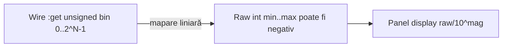

# Plan: `comp [sensor]` universal

## Decizie de produs (închisă aici)

- **Un tip** `comp [sensor]`, nu tipuri separate per fizică.
- **Componentă de input LogTscript de sine stătătoare** — nu e legată de PLC. Se folosește ca `key` / `switch` / `slider`: citire `.s:get` / `.s`, wires, script, alte comps. **PLC e doar un consumator opțional** via `inputs: { … = .s }`.
- **Interactiv + script**: utilizatorul simulează pe panel; scriptul poate forța valoarea (`set`/`data`) — ca [`slider.js`](../v0_3_2/core/components/slider.js).
- **Fără `button`** (P-ACT4): `key` / `switch` / `dip` / touch `clcd` rămân pentru butoane/comutatoare clasice; `sensor` e pentru semnale tip senzor (digital sau analog cu scară).
- **Fără API PLC nou** (când e folosit cu PLC): același `:get` din [`plc.js`](../v0_3_2/core/components/plc.js).
- **`slider` rămâne** control generic numeric; `sensor` = semantică didactică (`kind`, unități, icon) + același tip de I/O.
- **`min` / `max` / `unit` / `default` / `mag` / `step`** setabile; lipsă → defaults din profil (`mag: 0`, fără `step` = continuum pe `length`).
- Panel analog = model slider: `orientation`, `reversed`, `size`.
- **UI/temă:** clase **`.sensor-*` noi** (copiază regulile slider/switch, **fără** reuse pe DOM); accent `#6dff9c`; `kind` default `proximity`; `inverted` = storage.

Aliniere P-PHIL: zero config = profil didactic; atribute explicite pentru scară/UI.

### Utilizare generală (în afara PLC)

```logts
comp [sensor] .temp:
  kind: temperature
  :

comp [sensor] .prox:
  kind: proximity
  :

8wire t = .temp:get
1wire p = .prox:get

# sau în expresii / alte componente
show(.temp:get)
.led = .prox:get
```

Documentația: [`sensor.md`](../v0_3_2/doc/sensor.md) ca pagină de componentă input (pattern `slider.md` / `key.md`); [`plc.md`](../v0_3_2/doc/plc.md) doar adaugă rânduri în matricea I/O — **nu** prezintă senzorul ca feature exclusiv PLC.

## Taxonomie `kind` (v1)

### Digitale (lățime default **1**)

| `kind` | Rol | UI |
|--------|-----|-----|
| `proximity` | prezență | badge + click toggle |
| `motion` | PIR | icon diferit |
| `limit` | endstop | idem |
| `beam` | barieră optică | idem |
| `float` | nivel on/off | idem |

### Analogice (lățime default **8**)

| `kind` | Rol | UI |
|--------|-----|-----|
| `temperature` | temperatură (+ Kelvin) | track tip slider + readout eng |
| `humidity` | umiditate | idem |
| `light` | lumină | idem |
| `pressure` | presiune | idem |
| `distance` | distanță | idem |

`kind` necunoscut → eroare elaborare.

## Lățime biți și legătura la wire (`length`, nu `depth`)

În LogTscript, **lățimea valorii pe panel-input** (slider, dip, led multi-bit) se declară cu **`length`**.  
**`depth`** e altceva: lățimea cuvântului la **`reg` / `mem` / ALU** etc. — **nu** o folosim pe `sensor`.

### Model (închis, ca `slider`)

| | |
|--|--|
| Atribut | **`length`** = număr de biți ai pout-ului `:get` |
| Wire | `Nwire x = .s:get` cu **`N = length`** (altfel mismatch la asignare / propagare) |
| Valoare pe wire | **index de treaptă** unsigned `0 … 2^length−1`, **nu** neapărat întregul raw `min…max` |
| Mapare | treapta → raw liniar pe `[min, max]`; panel aplică apoi `mag` |

De ce nu stocăm raw-ul direct pe wire: `min` poate fi **negativ** (temperatură); wire-urile sunt binar unsigned. Modelul slider evită signed pe bus.

### Defaults

| Mod | `length` default |
|-----|------------------|
| Digital (`proximity`, …) | **`1`** → `1wire` |
| Analog (`temperature`, …) | **`8`** → `8wire` |

Override: `length: 4` etc. Interval v1 ca la slider: **`1…8`** (în afară → eroare elaborare).

### Exemple

```logts
comp [sensor] .prox:
  kind: proximity          # length 1
  :

1wire p = .prox:get

comp [sensor] .temp:
  kind: temperature        # length 8
  :

8wire t = .temp:get

comp [sensor] .coarse:
  kind: distance
  length: 4                # 16 trepte pe min..max
  min: 0
  max: 400
  mag: 2
  :

4wire d = .coarse:get
```

### Valori negative (temperatură, presiune vid, etc.)

**Problema:** `Nwire` / `:get` sunt **binar unsigned**. Nu punem `-40` ca biți pe wire.

**Soluția (închisă):** două straturi —



1. **Wire** = treaptă `0 … 2^length−1` (mereu ≥ 0).
2. **Raw** = `min + (bin / binMax) * (max − min)` — aici **`min` poate fi negativ** (ex. `-40…125`).
3. **Panel** = `raw / 10^mag` (poate arăta `-20`, `-0.50` dacă `mag>0`, etc.).

| Ce vezi | Exemplu `min:-40 max:125 length:8` |
|---------|-------------------------------------|
| Panel la start `default:20` | afișaj **20** (sau **20.00** dacă `mag:2` pe altă scară) |
| `:get` / `8wire` | binarul treptei pentru raw≈20 (între `00000000`=−40 și `11111111`=125) |
| `show(.temp:get)` | **binarul treptei**, nu `−40` în zecimal signed |

**Comparații în script / PLC:** pe binarul treptei (sau pe un wire derivat), nu pe grade Celsius cu semn. Pentru praguri didactice: calculezi treapta echivalentă sau compari după ce mapezi — doc va arăta un exemplu (ex. „peste 20°C” ≈ treapta care corespunde raw 20).

**`default` negativ:** permis dacă `default ≥ min` (ex. `default: -10` cu `min: -40`). Se convertește la treapta inițială pe wire.

**`mag` cu raw negativ:** `display = raw / 10^mag` (ex. raw `-40`, `mag: 1` → panel **`-4.0`**). Semnul rămâne pe raw/display; wire unsigned neschimbat.

**Digital:** fără scară negativă — doar `0`/`1` (eventual `inverted`).

### `step` (opțional, analog) — salt pe scara raw

**Context:** `slider` **nu** are atribut `step` (treptele = mereu `2^length`). `rotary` are **`states`** (număr de poziții). Pe `sensor` adăugăm **`step`** = increment pe **raw** (înainte de `mag`) — natural pentru °C, %, cm.

| | Fără `step` (default) | Cu `step: S` |
|--|----------------------|--------------|
| Model | ca **slider**: `2^length` trepte pe `[min,max]` | ca **rotary** pe scară: raw ∈ `{ min, min+S, min+2S, … }` |
| Wire | index treaptă `0…2^length−1` | index `k` al saltului (`0…K`) |
| Panel drag | continuum pe track → quantize la treaptă | snap la multipli de `S` |

**Reguli (închise):**

- `step` = întreg **`≥ 1`**, în unități **raw** (nu display). Lipsă → comportament tip slider.
- **`(max − min)` trebuie divizibil cu `step`** — altfel eroare elaborare (`max` e mereu atins).
- Număr poziții: `K + 1` unde `K = (max − min) / step`.
- Wire stochează **`k`** (0…K), nu raw-ul cu semn.
- **`length`:** `2^length ≥ K+1` (altfel eroare). Dacă `step` e setat și `length` lipsește → **`length = ceil(log₂(K+1))`** (ca rotary din `states`), minim 1.
- `default` pe scară: `(default − min) % step === 0`.
- Digital: `step` **interzis** (eroare dacă e prezent).

```logts
comp [sensor] .temp:
  kind: temperature
  min: -40
  max: 120
  step: 5                 # -40, -35, …, 120
  default: 20
  :                       # length auto din nr. poziții

comp [sensor] .rh:
  kind: humidity
  step: 10                # 0,10,…,100
  length: 4               # trebuie 2^4 >= 11
  :
```

**Față de rotary:** `states` = număr poziții abstract; la sensor **`step` + min/max`** definesc pozițiile pe scară. `for:` opțional pe indexul `k`.

## Scară inginerească (`min` / `max` / `unit` / `default` / `mag`)

`raw = min + (bin / binMax) * (max − min)`  
`bin = round((raw − min) / (max − min) * binMax)`

**Afișaj panel** (și etichetele capetelor track):

`display = raw / 10^mag`  
(echivalent: `raw * 10^(-mag)`)

| `mag` | Efect | Exemplu raw → panel |
|-------|--------|---------------------|
| **`> 0`** | împarte (punct zecimal spre stânga) | `0…400`, `mag: 2` → **`0.00…4.00`** |
| **`0`** | 1:1 | `20` → **`20`** |
| **`< 0`** | înmulțește (punct spre dreapta) | `1…4`, `mag: -2` → **`100…400`** |

Format panel: dacă `mag > 0` → `mag` zecimale; dacă `mag ≤ 0` → **întreg** (fără zecimale).

- **`mag`**: întreg (poate fi **negativ**), default **`0`**. Deplasare zecimală la afișaj, nu atribut separat de „digits”.
- Validare: `mag` în interval rezonabil didactic, ex. **`-6 … 6`** (în afară → eroare elaborare).
- Setabile: **`min`**, **`max`**, **`unit`**, **`default`** (raw întreg), **`mag`**, **`step`**.
- Nimic setat → tabela profil (`mag: 0`).
- `default` ∈ `[min, max]` (raw); altfel eroare elaborare.
- `max > min` obligatoriu.
- **PLC / wires / `show` pe `:get`:** tot **binarul**. Panelul singur arată `display`.

### De ce `mag`, nu altceva

| Candidat | Notă |
|----------|------|
| **`mag`** | **ales** — scurt, clar „ordin / deplasare zecimală” |
| `scale` / `exp` | ok, dar mai ambiguu (`scale:2` ≠ factor 2) |
| `dp` | sugerează doar „cifre după virgulă”, nu ordinul de mărime pe care îl vrei |

### Defaults per `kind` (când atributele lipsesc)

| `kind` | `unit` | `min` | `max` | `default` | `mag` | Validare |
|--------|--------|-------|-------|-----------|-------|----------|
| `temperature` | `C` | `-40` | `125` | `20` | `0` | `unit` ∈ {`C`,`K`}; dacă `K`: **233…398**, `default` **293**, **`min≥0`** |
| `humidity` | `%` | `0` | `100` | `50` | `0` | `0≤min<max≤100` |
| `light` | `lux` | `0` | `1000` | `200` | `0` | `min≥0` |
| `pressure` | `bar` | `0` | `10` | `1` | `0` | `min` negativ permis; pentru zecimale de bar: `mag: 2` + `min`/`max` raw (ex. `0`…`1000` → afișaj `0.00`…`10.00`) |
| `distance` | `cm` | `0` | `400` | `100` | `0` | `min≥0`; `unit` ∈ {`cm`,`mm`,`m`,`in`} |

Schimbarea `unit` **nu** convertește automat `min`/`max`/`default`. Fără Fahrenheit v1.

```logts
comp [sensor] .temp::                 # profil: C -40..125, default 20, mag 0

comp [sensor] .distFine:
  kind: distance
  min: 0
  max: 400
  mag: 2                              # panel 0.00 .. 4.00
  default: 100                        # afișaj 1.00
  :

comp [sensor] .span:
  kind: distance
  unit: 'mm'
  min: 100
  max: 40000
  mag: 2                              # panel 1.00 .. 400.00
  :

comp [sensor] .coarse:
  kind: distance
  min: 1
  max: 4
  mag: -2                             # panel 100 .. 400
  :
```

## Panel analog = model slider (drag, H/V, invers, size)

Atribute aliniate la [`slider.md`](../v0_3_2/doc/slider.md) / [`slider-widget.js`](../v0_3_2/devices/slider-widget.js):

| Atribut | Valori | Rol |
|---------|--------|-----|
| `orientation` | `0` / `1` | orizontal / vertical |
| `reversed` | flag | inversează **maparea** pe track (ca slider; pointerul la fel) |
| `size` | `1…20` (def. `10`) | lungime track ~48…242px — finețe drag |

Digital: click toggle; `orientation` / `reversed` / `size` **nu** se aplică.

`inverted` = **doar digital** (inversează bitul). Analog folosește **`reversed`**, nu un al doilea sinonim.

### `text` / `nl` (ca componentele existente)

| Atribut | Tip | Default | Rol |
|---------|-----|---------|-----|
| **`text`** | string | `''` | Etichetă pe panel (ca slider/rotary/switch) — **nu** introducem `label` ca atribut LogTscript; în widget JS, `addSensor({ label: text, … })` ca la `addSlider` |
| **`nl`** | flag | off | Newline după control pe panel (ca slider/rotary/key/switch) |

### Eveniment JS

**Nu** modelul `key` (`onPress` / `onRelease`).

#### Digital 1-bit — ca `switch` / `dip`

Același pattern ca [`switch.js`](../v0_3_2/core/components/switch.js) / [`dip.js`](../v0_3_2/core/components/dip.js):

```js
// ca switch:
const onChange = (checked) => {
  ctx.scheduleComponentOutputChange(name, checked ? '1' : '0');
};
// sau widget digital care trimite deja '0'/'1':
const onChange = (binValue) => {
  ctx.scheduleComponentOutputChange(name, binValue); // '0' | '1'
};
addSensor({ id, label: text, nl, kind, onChange, /* digital UI */ });
```

- Toggle pe panel → **`onChange`** → `scheduleComponentOutputChange` → propagare wires (identic switch).
- Cu `inverted`: **invertăm la scrierea în storage** (wire / `:get` văd deja bitul invertat). UI arată starea fizică a toggle-ului mapată astfel încât storage = valoare logică invertită față de click „on” vizual dacă e nevoie — regula unică: **storage = valoare citită de script**.

#### Analog — ca `slider` / `rotary`

```js
const onChange = (binValue) => {
  // pad/truncate la length
  ctx.scheduleComponentOutputChange(name, value);
};
```

Drag / schimbare treaptă → `onChange(bin)` → același `scheduleComponentOutputChange`.

**Nu confunda** cu atributul LogTscript **`on:`** (`raise` / `edge` / `1`) — acela controlează **când se aplică blocul de proprietăți** `{ set, data }`, nu evenimentul de UI.

### Span inginerești mare vs drag

Thumb-ul mapează **ratio 0…1 → `binMax` trepte** (`2^length−1`), **nu** un pas per unitate eng.

- `max−min` mare + `length` mic → **rezoluție groasă** (salt eng mare), track-ul rămâne la fel de trasibil.
- Track scurt (`size` mic) + multe trepte → greu de nimerit valoarea → crești `size`, îngustezi `min`/`max`, sau mărești `length`.

**Nu** plafonăm artificial `max−min` în runtime. Doc: recomandare didactică `(max−min)/binMax` rezonabil + `size≥10` când span-ul e larg.

## Atribute (rezumat)

### Universale

| Atribut | Rol |
|---------|-----|
| `kind` | default **`proximity`** (confirmat); listă închisă |
| `text` | etichetă panel (ca slider); **nu** atribut `label` în LogTscript |
| `color` / `nl` | accent; newline după control (flag) |
| `length` | width wire / `:get` (**nu** `depth`); default profil `1` sau `8`; v1: `1…8` |
| `inverted` | digital: invert la **scriere storage** (confirmat) |
| `on` | trigger bloc proprietăți (`raise`/`edge`/`1`) — separat de UI `onChange` |

### Analog (fallback profil dacă lipsesc)

| Atribut | Rol |
|---------|-----|
| `unit` / `min` / `max` / `default` / `mag` / `step` | scară raw + start + afișaj + salt opțional |
| `orientation` / `reversed` / `size` | ca slider |
| `for` | etichete pe trepte binare (opțional) |

## Contract I/O (input LogTscript)

Același contract ca celelalte input-uri panel:

| Mod | Pins | Pout | Interacțiune |
|-----|------|------|--------------|
| Digital | `set`, `data` | `get:1` | click toggle |
| Analog | `set`, `data` | `get:N` | drag track (H/V, reversed) |

Citire: `.s:get` / `.s` → wire, `show`, alte comps. Forțare: `.s:{ data = …, set = 1 }`.

**Cu PLC (opțional):**

```logts
comp [plc] .ctrl:
  inputs: { PROX = .prox, TEMP = .temp }
```

## Temă / stil panel

**Decizie închisă:** `comp [sensor]` **reutilizează tematica vizuală existentă** a panelului — nu inventăm o paletă / tipografie / limbaj vizual nou.

### Referințe de stil

| Sursă | Ce reutilizăm |
|-------|----------------|
| [`script_editor_v0_3_2.html`](../v0_3_2/script_editor_v0_3_2.html) — `.slider-*`, `.switch-*` | layout wrapper, label, track/thumb, value readout |
| [`slider-widget.js`](../v0_3_2/devices/slider-widget.js) / [`renderers.js`](../v0_3_2/devices/renderers.js) | pattern mount + clase |
| Accent default panel | **`#6dff9c`** (ca slider, rotary, dip, key stroke, bar) |
| Atribut `color:` | override hex ca la celelalte comps (`^…` / `#…`) |

### Reguli UI (**închise**)

- **Clase CSS noi** `.sensor-*` — **nu** reutilizăm `.slider-*` / `.switch-*` pe DOM; copiem aceleași reguli vizuale (dimensiuni, `--sensor-color` default `#6dff9c`, shadow `color-mix`, font label/value) în reguli dedicate.
- **Analog:** track/thumb pe model slider, dar clase `.sensor-track`, `.sensor-thumb`, etc.
- **Digital:** toggle pe model switch, clase `.sensor-digital-*` (sau echivalent), plus icon minimal per `kind`.
- **Label / value:** stil oglindit după `.slider-label` / `.slider-value`, pe clase sensor.
- **`nl` / `text`:** același comportament de layout ca slider/switch.
- Fără temă dark/purple nouă, fără card-uri ornate.
- **`kind` lipsă** → default **`proximity`** (**confirmat**).
- **`inverted`** → invert la **scriere storage** (**confirmat**).

### Ce e permis să diferă

- Icon / glyph scurt per `kind` (proximity vs temperature).
- Readout inginerești (`20 C`, `1.00`) lângă track — același font ca `.slider-value`.

## UI device

- [`devices/sensor-widget.js`](../v0_3_2/devices/sensor-widget.js): `addSensor` / `setSensor`.
- API widget: `{ id, label, nl, color, kind, onChange, … }` — `label` vine din atributul **`text`**.
- Digital badge vs analog track tip slider + readout `eng`/`unit` — **stil = tema panel existentă** (vezi [Temă / stil panel](#temă--stil-panel)).
- Schimbare valoare → **`onChange`** → `scheduleComponentOutputChange`:
  - digital 1-bit: **ca switch/dip** (`'0'`/`'1'`)
  - analog: **ca slider/rotary** (bin pe `length`)

## Livrare

| Sub-fază | Conținut |
|----------|----------|
| **S0** | Sync P-ACT2 + profile în [`comp_plc.plan.md`](comp_plc.plan.md) |
| **S1** | Digital 5 kinds + teste **fără PLC** (get, toggle, wire) + doc parțial; suite verde |
| **S2** | Analog + min/max/unit/default/mag/**step** + orientation/reversed/size; teste input general; suite verde |
| **S3** | `sensor.md` complet + catalog + `interactive-components.md`; apoi rânduri opționale în `plc.md` + 1–2 `logts-play` PLC; suite verde |

Apoi P3c poate continua cu **motor** / **fan**.

## Fișiere

- `v0_3_2/core/components/sensor.js` — `KIND_PROFILES`, validări, createDevice/applyProperties
- `v0_3_2/devices/sensor-widget.js` — UI (digital + track tip slider)
- `v0_3_2/core/components/index.js` — register
- Docs + teste + HTML bundles

## Ce nu facem în v1

- Float / unități în limbajul PLC
- Simulare fizică autonomă
- `kind` liber / Fahrenheit
- Alias `button` / unificare cu `slider`
- Paletă / stil UI nou (în afara temei panel slider/switch existente)
