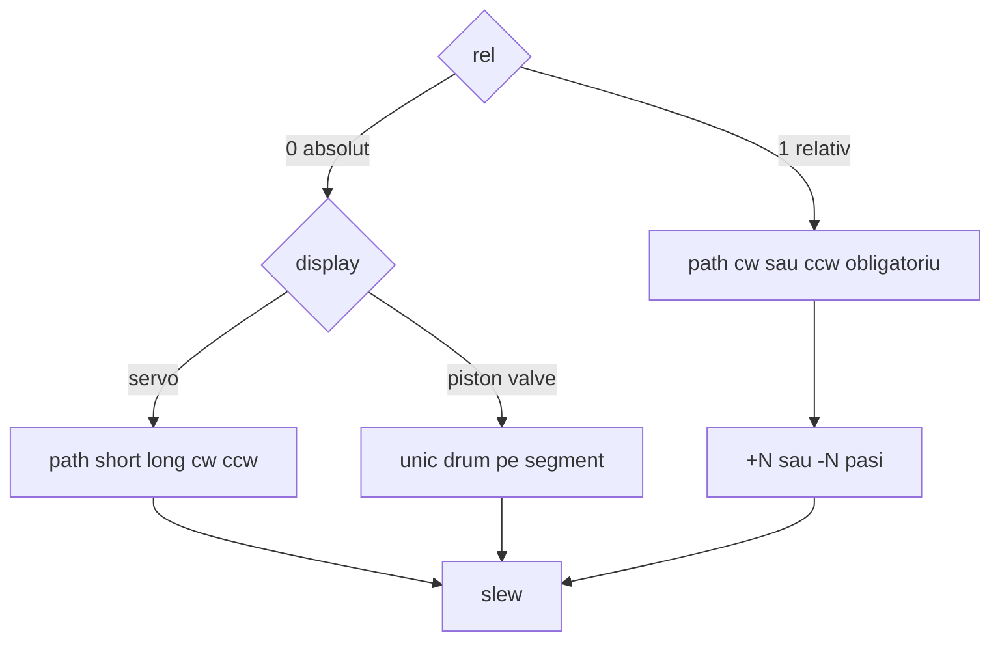

# Plan: `display` pe `comp [servo]`

## Decizie (închisă)

**`display`** = skin + **tip de cinematică pe panel**. Contractul pe wire rămâne **pași** (`value` / `:get`); `speed` / `rate` / `:moving` la fel.

Valori v1:

| `display` | Tip | Aspect | Drum curent → țintă (absolut) |
|-----------|-----|--------|-------------------------------|
| `servo` (**default**) | **rotary** | horn pe bază | pe cerc / cursă unghiulară: pot exista **două arce** (`path`: short/long/cw/ccw), mai ales la span 360° |
| `piston` | **linear** | cilindru + tijă | **un singur drum** pe segmentul A→B (retractat↔extins) |
| `valve` | **linear** (deschis/închis) | corp + obturator | **un singur drum** pe segmentul închis→deschis |

```logts
comp [servo] .arm:
  display: servo
  minAngle: 0
  maxAngle: 360
  path: short
  :

comp [servo] .cyl:
  display: piston
  length: 8
  minAngle: 0
  maxAngle: 100
  speed: 10
  :

comp [servo] .v1:
  display: valve
  length: 1
  :
```

### Rotary vs non-rotary — `path` / `rel` (închis)

Absolut vs relativ rămân **două operații** pe toate display-urile:

1. **`rel = 0`** — du-te la țintă absolută
2. **`rel = 1`** — ±N pași față de curent (**încă necesar pe piston / valve**)



| | `display: servo` (rotary) | `display: piston` / `valve` (linear) |
|--|---------------------------|--------------------------------------|
| Absolut → țintă | 1 sau **2** arce (wrap 360°); `path` short/long/cw/ccw | **un singur drum**; `path` short/long **ignorat** la animație |
| Relativ `rel = 1` | `path` **cw / ccw** → +Δ / −Δ | **la fel**: `path` **cw / ccw** → +Δ / −Δ pe axă |
| După relativ | wrap dacă span 360 | **clamp** pe `0…vmax` |

Pe linear, `cw` / `ccw` = **sens pe segment** (+ / −), nu arc pe cerc. Pinul rămâne `path` (contract I/O neschimbat).

```logts
# piston absolut — un drum
.cyl:{ value = cmd, set = 1 }

# piston relativ +14 / −14
.cyl:{ value = 00001110, path = 10, rel = 1, set = 1 }
.cyl:{ value = 00001110, path = 11, rel = 1, set = 1 }
```

**Regulă implementare:**
- absolut + rotary → `resolveTravelSteps` (path full)
- absolut + linear → `travel = |to − from|` (ignore short/long)
- relativ (orice display) → `applyRelative` existent (`cw` +, `ccw` −); linear: clamp

Doc: pe piston/valve, la absolut `path` e nefolosit; la `rel = 1` e **obligatoriu cw/ccw**.

### Mapare `minAngle` / `maxAngle`

Nume istoric (de la unghi). Pe toate display-urile: `v=0` → capăt A, `v=vmax` → capăt B.

- `servo`: A/B în grade pe panel
- `piston`: A = retractat, B = extins (cursă didactică)
- `valve`: A = închis, B = deschis

**`reversed`:** inversează A↔B pe mapare.

**`:moving`:** neschimbat.

## Implementare

### Core — [`v0_3_2/core/components/servo.js`](../../v0_3_2/core/components/servo.js)

- `DISPLAYS = { servo, piston, valve }`; default `servo`
- `isRotaryDisplay(d)` / `travelStepsForMove(…, display)` — branch rotary vs linear
- `literalAttrs: ['path', 'display']`; `getDef` + `addServo({ display })`

### Widget — [`v0_3_2/devices/servo-widget.js`](../../v0_3_2/devices/servo-widget.js) + CSS

- Glyphuri: horn / piston / valve
- Animație: rotate (servo) | translate tijă (piston) | deschidere obturator (valve)
- Durată slew din travel (rotary vs linear) + `speed`/`rate`; `:moving` ca acum

### Doc + teste

- [`v0_3_2/doc/servo.md`](../../v0_3_2/doc/servo.md): `display`, tabel rotary vs linear / `path`; ≥3 `logts-play` (inclusiv relativ pe piston)
- Teste: travel linear ignoră short/long; relativ cw/ccw pe piston; rotary short≠long pe 360; suite verde
- Notă în [comp_servo_universal.plan.md](comp_servo_universal.plan.md)

## Ce nu facem

- `comp [piston]` / `comp [valve]` separate
- Wrap „circular” pe piston/valve
- Eroare hard dacă `path` e setat pe linear la absolut (accept + ignore; doc clar)
- Float / PWM / skinuri extra (clamp/gate rămân backlog, nu v1)
