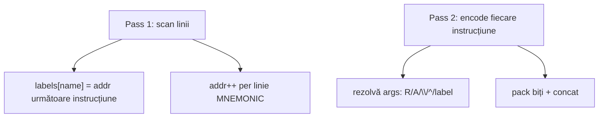

# Plan: bloc `asm` — Instruction Set Architecture

## Obiectiv

1. **`asm [type] .instance:`** — blueprint ISA (mnemonici + layout biți)
2. **`.my_isa { ... }`** — expresie → **string binar** (blob), oriunde în `evalExpr`; **`mem.js` neschimbat**

```logts
asm [mini-cpu] .my_isa:
  NOP   : 0000 + 4b
  LOAD  : 0001 + R2b + A2b
  JMP   : 0101 + A2b              # salt absolut la adresă (label → index slot)
  BEQ   : 0100 + S4b              # salt relativ signed (label → offset PC+1)
  :

comp [mem] .prog:
  depth: 8
  length: 16
  = .my_isa {
      NOP
      LOAD R1 A3
      loop:
        NOP
        JMP loop3
      NOP
      NOP
      loop2:
        ADD R1 R1 \1
      loop3:
        LOAD R1 A4
        BEQ loop
  }
  :
```

**Argumente:** **fără virgulă obligatorie** — separare prin spații/linii noi: `LOAD R1 A3` = `LOAD R1, A3`. Virgula opțională.

**Program:** **multi-line** în `{ }`; o instrucțiune per linie (sau mai multe pe linie separate prin `;` opțional).

---

## Model expresie (neschimbat)

- `evalAsmProgram` → `{ value: blob, bitWidth: N }`
- `mem` primește string-ul final (ca `^hex`)
- Validări `wordWidth === mem.depth`, `instructionCount <= mem.length` — în **interpreter**, nu în mem

---

## 1. Definire ISA — câmpuri biți

| Token | Semnificație |
|-------|----------------|
| `0000` | literal fix (lungime = biți) |
| `4b` | imediat **unsigned** 0..15 |
| `S4b` | imediat **signed** -8..+7 (two's complement la pack) |
| `R2b` | registru `Rn`, unsigned |
| `RS2b` | registru signed (simetrie) |
| `A2b` | adresă `An`, unsigned — label → **adresă absolută** |
| `AS2b` | adresă signed (simetrie) |

Toate mnemonicele: același `wordWidth` (sumă segmente); altfel eroare la parse `asm`.

---

## 2. Assembler two-pass — labels și forward references



### Pass 1 — colectare adrese

| Linie | Efect |
|-------|--------|
| `loop:` | `labels['loop'] = nextInstructionAddr` (eticheta **nu** consumă slot) |
| `NOP` / `LOAD R1 A3` | `nextInstructionAddr++` după linie |
| `# comment` / gol | ignorat |

**Forward references permise:** `JMP loop3` înainte ca `loop3:` să apară — Pass 1 înregistrează tot tabelul de labeluri înainte de Pass 2.

**Exemplu user:**

```logts
= .my_isa {
  loop:
    NOP              # addr 0
    JMP loop3        # addr 1 — loop3 definit mai jos
  NOP                # addr 2
  NOP                # addr 3
  loop2:
    ADD R1 R1 \1     # addr 4
  loop3:
    LOAD R1 A4       # addr 5
}
```

### Pass 2 — rezolvare argumente

| Câmp | Argument | Rezolvare |
|------|----------|-----------|
| `R2b` | `R1` | strip `R` → `01` padded 2b |
| `A2b` | `A4` sau `loop` | `A4` → `100`; label → `labels['loop']` absolut |
| `4b` | `\5`, `^a`, label | decimal/hex; label în `Nb` → **adresă absolută** |
| `S4b` | `\-3`, label | literal signed; label → **offset relativ** |

### Offset relativ (câmp `S` + label)

```
offset = targetLabelAddr - (currentInstructionAddr + 1)
```

Exemplu BEQ înapoi:

```logts
= .my_isa {
  loop_start:      # label → addr 0
    NOP             # addr 0
    NOP             # addr 1
    BEQ loop_start  # addr 2  → offset = 0 - (2+1) = -3
}
```

**Pack -3 în S4b:** `3` → `0011` → invert `1100` → +1 → **`1101`**  
Instrucțiune: `0100` + `1101` → `01001101`

### Erori label / signed

| Eroare | Mesaj exemplu |
|--------|----------------|
| Label nedefinit | `Undefined label 'loop3' at line N` |
| Offset prea mare | `Relative jump offset (-21) is out of bounds for a signed 4b field (Must be between -8 and +7).` |
| Prefix greșit | `'LOAD' expects Register prefix (R) for argument 1, but found '\2'.` |
| Overflow unsigned | `Argument 3 (\18) exceeds the maximum value allowed for a 4b field (max 15).` |

Toate cu linie sursă + `^^^` sub tokenul problematic.

---

## 3. Sintaxă program — args și linii

**Separare argumente:**
- Tokenizare după whitespace în corpul `{ }` (raw parse, nu tokenizer global `\`→BIN)
- `LOAD R1 A3` → 3 tokeni: mnemonic + arg1 + arg2
- Virgula `,` opțională: `LOAD R1, A3` echivalent
- `;` la sfârșit de linie sau între instrucțiuni pe aceeași linie — separator opțional, ignorat

**Formate argument:**
- `R1`, `A3` — prefix obligatoriu
- `\5`, `\255` — decimal (în bloc program = index, nu BIN tokenizer)
- `^a`, `^Ff` — hex
- `loop`, `loop3` — label (rezolvare după tip câmp)

---

## 4. Parser & interpreter (fișiere)

| Fișier | Rol |
|--------|-----|
| [`core/asm-assembler.js`](v0_3_2/core/asm-assembler.js) | **nou** — logică pură two-pass |
| [`core/parser.js`](v0_3_2/core/parser.js) | `asm`, `parseAsmProgramRaw`, atom `asmProgram` |
| [`core/interpreter.js`](v0_3_2/core/interpreter.js) | `asmInstances`, `evalAsmProgram`, `execAsm`, `execComp` resolve |
| [`core/tokenizer.js`](v0_3_2/core/tokenizer.js) | keyword `asm` |
| [`core/components/mem.js`](v0_3_2/core/components/mem.js) | **nu se modifică** |

---

## 5. `doc()` — obligatoriu

### `doc(asm)` / `doc(asm.mini-cpu)`

Listă instanțe + template tip (ca `doc(comp.lut)`).

### `doc(.my_isa)` — afișează ce s-a definit

`AsmInstance.formatInstanceDoc(alias, inst)` (pattern [`LutComponent.formatInstanceDoc`](v0_3_2/core/components/lut.js)):

```text
.my_isa (asm [mini-cpu])
  wordWidth: 8
  opcodes:
    NOP   : 0000 + 4b
    LOAD  : 0001 + R2b + A2b
    JMP   : 0101 + A2b
    BEQ   : 0100 + S4b
```

Extindere [`getDocLines`](v0_3_2/core/interpreter.js): când `name` e `asm.*` și `alias` e instanță reală `.my_isa` → `formatInstanceDoc`, nu template generic.

**Test:** `doc(.my_isa)` conține `NOP`, `LOAD`, `R2b`, `S4b`.

---

## 6. Teste obligatorii (grup `asm`, id 883+)

Toate în [`test_suite_ported.js`](v0_3_2/test_suite_ported.js) + [`test_manifest.js`](v0_3_2/test_manifest.js).

### Parse & ISA

| Id | Scenariu |
|----|----------|
| 883 | parse `asm` — mnemonici + segmente |
| 884 | `wordWidth` uniform; mnemonic duplicat → eroare |

### Assemble de bază

| Id | Scenariu |
|----|----------|
| 885 | `NOP` singur → biți așteptați |
| 886 | `LOAD R1 A3` **fără virgulă** |
| 887 | program **multi-line** în `{ }` |
| 888 | `48w myProg = .my_isa { }` → blob |

### Labels

| Id | Scenariu |
|----|----------|
| 889 | `loop:` + `JMP loop` — salt înapoi (absolut pe `A2b`) |
| 890 | **forward ref:** `JMP loop3` înainte de `loop3:` |
| 891 | label multiplu: `loop` / `loop2` / `loop3` (exemplul user) |

### Signed relative (`S4b`)

| Id | Scenariu |
|----|----------|
| 892 | `BEQ loop_start` — offset -3 → `1101` în câmp S4b |
| 893 | literal `\-3` direct în S4b |
| 894 | offset -21 pe S4b → eroare bounds |

### Erori pedagogice

| Id | Scenariu |
|----|----------|
| 895 | prefix: `ADD \2 R1 \5` |
| 896 | overflow: `\18` pe `4b` |
| 897 | label nedefinit: `JMP nowhere` |
| 898 | wire width mismatch: `50w` vs program 48b |

### mem & runtime (fără modificări mem.js)

| Id | Scenariu |
|----|----------|
| 899 | `comp [mem] = .my_isa { }` multi-line → sloturi corecte |
| 900 | `comp [mem] = myProg` (wire blob) |
| 901 | `.prog = .my_isa { }` runtime |
| 902 | `wordWidth !== mem.depth` → eroare interpreter |
| 903 | `instructionCount > mem.length` → eroare |

### doc

| Id | Scenariu |
|----|----------|
| 904 | `doc(asm)` listează instanțe |
| 905 | `doc(.my_isa)` conține opcodes definite (`NOP`, `S4b`, etc.) |

### propagare (legacy + wave unde relevant)

| Id | Scenariu |
|----|----------|
| 906 | `.prog = .my_isa { }` wave |

Rulare: `node _run_suite_node.js`.

---

## 7. Documentație [`doc/asm.md`](v0_3_2/doc/asm.md)

Secțiuni obligatorii (EN, `logts-play`):
- ISA definition (`+`, `Nb`, `RNb`, `ANb`, `S4b`, …)
- Program syntax: **no comma required**, multi-line
- **Labels** — two-pass, forward refs, exemple `JMP loop3`
- **Signed branches** — `BEQ : … + S4b`, formula offset, two's complement, eroare bounds
- **Binary expression** — `Nw wire = .my_isa { }`, mem primește blob
- **`doc(.my_isa)`** — exemplu output
- Errors table
- mini-cpu demo **neschimbat**; marcare E1 în `future-component-ideas.md`

---

## Ordine implementare

1. `asm-assembler.js` (two-pass, signed, labels forward, args whitespace)
2. Parser `asm` + `parseAsmProgramRaw` + atom `asmProgram`
3. Interpreter: `asmInstances`, `evalAsmProgram`, `execComp`, `formatInstanceDoc`
4. `doc()` + `doc/asm.md`
5. Teste 883–906+ + manifest + `_gen_doc_data.js`

---

## Riscuri / note

| Subiect | Decizie |
|---------|---------|
| **mem.js** | Zero modificări |
| Virgulă args | Opțională; whitespace suficient |
| Label pe linie singură | `name:` fără instrucțiune pe aceeași linie |
| `JMP` absolut vs `BEQ` relativ | Depinde de câmp ISA (`A2b` vs `S4b`), nu de mnemonic |
| `JMP loop` pe `A2b` | Label → adresă absolută slot |
| `BEQ loop` pe `S4b` | Label → offset relativ PC+1 |
| chip/board body | `asm` top-level only v1 |
