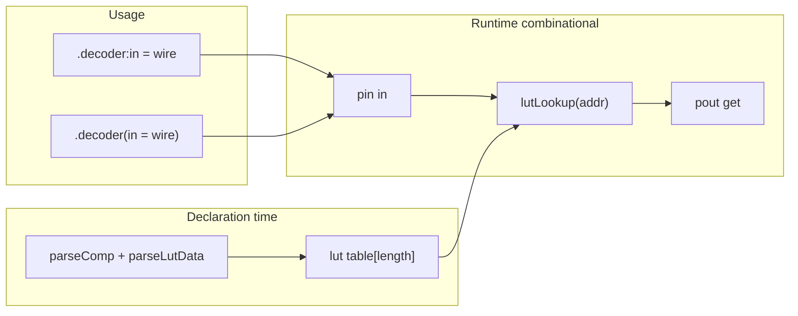

# Plan: componenta `comp [lut]` (combinational lookup table)

## Obiectiv

LUT zero-delay: când intrarea se schimbă, ieșirea se actualizează **în același pas** de propagare (ca `ADD()` / `MUX()`, nu ca `mem` cu property blocks).

```logts
comp [lut] .decoder:
  depth: 4
  length: 16
  fillwith: 0110
  = data {
    0         : 0001    # addr binary
    \1 - \5   : 0010    # addr decimal range
    ^a - ^f   : 1111    # addr hex range (^a = 10)
  }
  :
```

Adrese nemapate → `fillwith` (dacă declarat) sau `0`.repeat(`depth`) — același default ca atributul `fillwith` când lipsește. Adrese `>= length` → eroare la parse/init.

**Citire:** pout **`get`** (nu `out`). **Fără panel UI** în v1 (doar logic, ca divider/adder).

---

## Arhitectură



| Layer | Fișier | Rol |
|-------|--------|-----|
| Device store | [`devices/lut-devices.js`](v0_3_2/devices/lut-devices.js) (nou) | `addLut`, `setLutIn`, `getLutOut`, tabel intern |
| Component | [`core/components/lut.js`](v0_3_2/core/components/lut.js) (nou) | `getDef`, `createDevice`, `handleImmediateAssignment`, `evalGetProperty` |
| Registry | [`core/components/index.js`](v0_3_2/core/components/index.js) | `registry.register(LutComponent)` |
| Parser | [`core/parser.js`](v0_3_2/core/parser.js) | `= data { ... }`, range `addr - addr : value`, invocare `.comp(arg = expr)` |
| Interpreter | [`core/interpreter.js`](v0_3_2/core/interpreter.js) | eval invocare inline, propagare la schimbare `in` |
| Tests | [`test_suite_ported.js`](v0_3_2/test_suite_ported.js), [`test_manifest.js`](v0_3_2/test_manifest.js) | init, range, default zero, A+B usage, probe |
| Doc | [`doc/lut.md`](v0_3_2/doc/lut.md) | sintaxă + exemple `logts-play` |

Bundle doc: `node _gen_doc_data.js` (auto-include `lut.md`). Opțional: intrare în [`ui/doc-viewer.js`](v0_3_2/ui/doc-viewer.js) `DOC_SECTIONS` (Storage sau Arithmetic devices) + link în [`doc/components.md`](v0_3_2/doc/components.md).

---

## 1. Model componentă `lut`

**Atribute**

| Attr | Default | Rol |
|------|---------|-----|
| `depth` | 4 | Lățime **valoare** (biți după `:` și pe pout `get`) — `fillwith` și valorile din `data` trebuie să aibă exact `depth` biți |
| `length` | 16 | Număr **sloturi** (index adresă `0..length-1`); pin `in` are `ceil(log2(length))` biți |
| `fillwith` | `0`.repeat(`depth`) | Valoare binară pentru sloturile **nemapate** în `data { }`. Atribut opțional; dacă lipsește, efectiv `000…0` la `depth` biți |

**Porturi** (fără `set` — nu e clocked)

| Port | Direcție | Rol |
|------|----------|-----|
| `in` | pin | Adresă binară (width derivat din `length`) |
| `get` | pout | Valoare tabel la adresă (width `depth`) — **singura** ieșire |

**Probe:** `probe(.decoder)` / `probe(.decoder:get)` (ca adder/divider). **Nu** există `out`.

**Init:** `initialValue` devine obiect structurat din parser, ex.:

```js
{ kind: 'lutData', entries: [
  { from: 0, to: 0, value: '0001' },
  { from: 1, to: 5, value: '0010' },
  { from: 10, to: 15, value: '1111' },
]}
```

`createDevice`:

1. `defaultValue = attributes.fillwith` sau `'0'.repeat(depth)` (echivalent explicit `fillwith: 0000` la `depth: 4`).
2. Umple `table[0..length-1]` cu `defaultValue`.
3. Aplică entries din `data { }` (range inclusiv) — suprascriu default-ul pe sloturile mapate.
4. Persistă pe `comp`: `lutTable`, `lutEntries` (sursă), `fillwithValue` — pentru `doc(.inst)`.
5. Validează: `fillwith` și fiecare `value` din `data` au exact `depth` biți (eroare dacă prea lat).

---

## 2. Parser: atribut `fillwith` + bloc `= data { ... }`

**`fillwith`** — atribut în corpul `comp`: literal **binar**, exact `depth` biți, ex. `fillwith: 0110`. Dacă lipsește → `0`.repeat(`depth`).

### Adresare în `data { }`

Parser dedicat în [`parseComp()`](v0_3_2/core/parser.js) — **nu** tokenizer global (`\2` pe fire → BIN `"10"`; în `data` → index decimal 2).

| Format | Exemplu | Semnificație |
|--------|---------|--------------|
| **Binar** | `0`, `010`, `1001`, `011` | Index slot = `parseInt(bits, 2)` (`010` → slot 2) |
| **Decimal** | `\2`, `\50`, `\100` | Index zecimal |
| **Hexadecimal** | `^2`, `^a`, `^Ff` | Index hex (`^Ff` → 255) |

**Range:** `addrStart - addrEnd` (inclusiv). Formate amestecate permise:

```logts
= data {
  010       : 0001
  \1 - \5   : 0010
  ^a - ^f   : 1111
  \50 - \55 : 0101
}
```

**Constrângeri:**

- **Adresă:** index `0 .. length-1`; `>= length` → eroare la parse.
- **Valoare** (după `:`): literal **binar**, exact **`depth` biți** (la `depth: 4` → `0001`, nu `01`).
- **Runtime `in`:** lățime `addrBits = max(1, ceil(log2(length)))`.

**Gramatică:**

```
= data { lutEntry ( , lutEntry )* }
lutEntry := lutAddress ( '-' lutAddress )? ':' BIN_VALUE
lutAddress := BIN_INDEX | '\' DEC_INDEX | '^' HEX_INDEX
```

Erori: range invers; adresă `>= length`; valoare / `fillwith` ≠ `depth` biți; overlap → **ultima intrare câștigă**.

---

## 3. Runtime combinational

Urmează pattern-ul [`adder.js`](v0_3_2/core/components/adder.js) + [`divider.js`](v0_3_2/core/components/divider.js) (computed `:get` fără `comp.ref`):

- **`handleImmediateAssignment(comp, 'in', value, ctx)`** — `setLutIn(id, paddedAddress)`; declanșează `_emitComputedComponentProbes` pentru `.decoder` / `.decoder:get`.
- **`evalGetProperty(comp, 'get', ...)`** — `getLutOut(id)`; pad la `depth`.
- **Fără** `applyProperties` / `on: raise` / property blocks pentru citire.

**Lățime pin `in`:** `addrBits = Math.max(1, Math.ceil(Math.log2(length)))` sau `length` e putere a lui 2 → `log2(length)` biți. Documentat în `lut.md`.

**Propagare:** când un wire conectat la `.decoder:in` se schimbă, [`signal-propagation.js`](v0_3_2/core/signal-propagation.js) trebuie să re-evalueze dependenții — verificat deja pentru `componentConnections` + computed components; adăugare LUT în același flux ca divider `:mod` (teste probe 836+ ca model).

---

## 4. Metoda B — structural (existent parțial)

```logts
.decoder:in = .my_counter:get
4wire current_state = .decoder:get
```

- `.decoder:in = expr` → assignment pe pin → `handleImmediateAssignment`.
- `.decoder:get` în RHS → `evalGetProperty` (ca `.div:mod`, `.add:get`).

Fără property blocks `:{ at = … }`.

---

## 5. Metoda A — invocare inline (sintaxă nouă)

```logts
4wire current_state = .decoder(in = current_index)
```

**Parser** — extindere [`atom()`](v0_3_2/core/parser.js):

- După `.decoder`, dacă urmează `(`, parse `compInvoke`: lista `name = expr` (un singur arg `in` pentru LUT; extensibil).
- AST: `{ compInvoke: { var: '.decoder', args: { in: exprParts } } }`.

**Interpreter** — în evaluare assignment / `evalExpr`:

1. Evaluează `expr` pentru `in`.
2. Apelează `handleImmediateAssignment` pe componentă.
3. Returnează valoarea `get` ca rezultat RHS (width `depth`).

Restricție v1: LUT invocable: `in` → `get`. Eroare dacă componentă necunoscută sau argument invalid.

---

## 6. Teste (obligatorii)

Toate în [`test_suite_ported.js`](v0_3_2/test_suite_ported.js) + intrări în [`test_manifest.js`](v0_3_2/test_manifest.js) (grup `lut`).

| Test | Scenariu |
|------|----------|
| init + default | `data { 0:0001, \1-\5:0010 }`, `length:16`, fără `fillwith` → slot 6–9 = `0000` |
| fillwith | `fillwith: 0110` + același `data` → slot 6–9 = `0110` |
| addr binary | `010 : 1000` → slot 2; `1001 : 1010` → slot 9 |
| addr decimal | `\50 : 1111` pe `length: 64` |
| addr hex | `^a : 1111`, `^Ff` pe `length: 256` (sau `length: 256` minim) |
| hex range | `^a - ^f : 1111` pe `length: 16` |
| mixed range | `010 - \5 : 0010` echivalent slots 2–5 |
| method B | `.lut:in` + `.lut:get`; legacy + wave |
| method A | `4wire y = .lut(in = addr)` |
| probe | `probe(.lut:get)` initialised/changed |
| doc type | `doc(comp.lut)` conține `data {`, `fillwith`, `Xpout get` |
| doc inst | `doc(.decoder)` conține `map:` + valorile mapate + `fill:` |
| errors | adresă `>= length`; valoare 5 biți la `depth:4`; `fillwith` prea lat; range invers; `data` lipsă |

Rulare: `node _run_suite_node.js` (sau runner existent) — toate testele lut verzi înainte de merge.

---

## 7. Documentație — [`doc/lut.md`](v0_3_2/doc/lut.md) (livrabil obligatoriu)

Fișier nou, engleză (ca restul doc-urilor), cu exemple `logts-play` runnable.

**Conținut minim:**

1. **Overview** — combinational, zero-delay; vs `mem` (secvențial, property blocks)
2. **Declaration** — `comp [lut]`, atribute `depth`, `length`, `fillwith`
3. **Address formats** în `data { }`:
   - binary: `010`, `1001`
   - decimal: `\2`, `\50`, `\100`
   - hex: `^2`, `^Ff`
   - ranges cu `-`
   - values: binary, exact `depth` bits
4. **Example complet** — spec-ul `decoder` din plan (cu `fillwith: 0110`)
5. **Usage** — Metoda A (inline) și B (structural) cu **`get`**
6. **`probe`**, **`doc(comp.lut)`**, **`doc(.inst)`** — cu exemplu output așteptat pentru instanță
7. **No panel UI**
8. **Errors** — tabel mesaje frecvente
9. **Related** — link la `mem`, `debug`, `future-component-ideas` B2

**După scriere:** `node _gen_doc_data.js` (auto-include). Actualizare:

- [`doc/components.md`](v0_3_2/doc/components.md) — rând `lut` în index
- [`doc/doc-function.md`](v0_3_2/doc/doc-function.md) — `doc(comp.lut)` în tabel
- opțional [`ui/doc-viewer.js`](v0_3_2/ui/doc-viewer.js) `DOC_SECTIONS` (Arithmetic sau Storage)

---

## 8. `doc()` — tip vs instanță

### `doc(comp.lut)` — sintaxă tip

Extindere [`formatCompDef`](v0_3_2/core/interpreter.js) / `getDef()` în [`lut.js`](v0_3_2/core/components/lut.js):

- Afișează șablonul complet (nu tabelul unei instanțe concrete)
- `initValue` în `getDef`: `data { ... }` (placeholder sau text generic)
- Atribute: `depth`, `length`, `fillwith` (cu mențiune default `000…0`)
- Pini: `Xpin in`, `Xpout get` — **fără** `set`, **fără** property block pentru citire

Exemplu output așteptat:

```text
comp [lut] .name:
  depth: integer
  length: integer
  fillwith: Xbit
  = data { addr : value, addr-addr : value, ... }
  :{
    Xpin in
    Xpout get
  }
```

### `doc(.decoder)` — instanță + valori mapate

Flux existent: `doc(.decoder)` → `name = comp.lut`, `alias = .decoder` ([`exec` doc](v0_3_2/core/interpreter.js) ~2064).

**Nou:** când `comp.type === 'lut'` și `alias` e instanță reală, nu apela doar `formatCompDef` generic — folosește **`LutComponent.formatInstanceDoc(comp)`** (sau ramură în `getDocLines`):

1. Header: `.decoder (comp [lut])`
2. Atribute efective: `depth`, `length`, `fillwith` (valoare rezolvată, inclusiv default zero)
3. Secțiune **`map:`** — fiecare intrare din `data { }` ca la sursă (păstrează range-urile):
   ```text
   map:
     0       -> 0001
     1-5     -> 0010
     10-15   -> 1111
   ```
4. Secțiune **`fill:`** (sau notă inline) — adrese nemapate explicit, ex. `6-9 -> 0110 (fillwith)`
5. Opțional compact: `table:` cu câte o linie per adresă `[n]=value` dacă `length <= 16` (util pentru studenți)

Date din `comp.lutEntries` + `comp.lutTable` / `fillwithValue` setate la `createDevice`.

Test: declară `.decoder`, `doc(.decoder)` — output conține `0001`, `0010`, range `1-5`, `fillwith` pentru slot 6.

---

## Riscuri / decizii

| Subiect | Decizie |
|---------|---------|
| Ieșire | Doar **`get`** (pout); nu există `out` |
| Overlap entries | Ultima intrare din `data` câștigă |
| `fillwith` default | `0`.repeat(`depth`) când atributul lipsește |
| `fillwith` vs `depth` | Exact `depth` biți (validare la parse) |
| Panel UI | **Nu** — v1 logic-only (fără widget Devices) |
| `doc(comp.lut)` | Sintaxă tip + `data { }` |
| `doc(.inst)` | Sintaxă instanță + mapări + zone fillwith |
| `comp [lut]` shortname | Opțional `?` sau fără — evită conflicte; propun **fără** shortname în v1 |
| Board/chip body | LUT permis în `board`/`chip` body; pin `in` de la fire interne |
| `depth` vs adresă | `depth` limitează **valorile** (output); adresele sunt limitate de **`length`**, nu de `depth` |

---

## Ordine implementare

1. `lut-devices.js` + `lut.js` + registry
2. Parser `data { }` + teste init
3. Metoda B + propagare + probe tests
4. Parser/interpreter Metoda A + teste
5. Teste complete (§6) + `doc/lut.md` (§7) + `doc(comp.lut)` / `doc(.inst)` + `components.md` + manifest + `_gen_doc_data.js`
