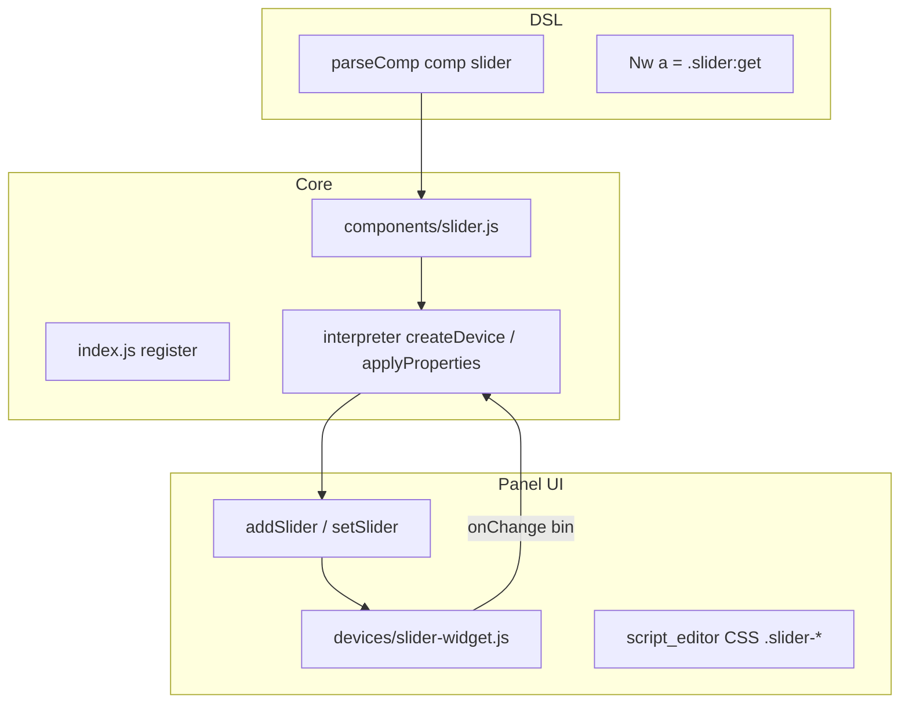

# Plan: componenta `comp [slider]`

## Obiectiv

Implementare **C1 Slider** din [`future-component-ideas.md`](v0_3_2/doc/future-component-ideas.md): un singur widget pentru valori scalare pe `Nwire`, alternativă UX la `comp [rotary]` și mai prietenos decât `comp [dip]` cu `length: 8` pentru lab-uri ALU / operand / prag / viteză.

**Nu** este walking-bit (un singur `1` care se plimbă). **Nu** permite pattern-uri arbitrare pe biți (asta rămâne DIP).

---

## Decizii confirmate

| Subiect | Decizie |
|---------|---------|
| Lățime output | Atribut **`length`** (ca `dip` / `bar`) — `Nwire` direct |
| Interval valori | Strict **`0 … 2^length − 1`** — fără `min`, `max`, `states` |
| Encoding output | Index ca **binar** `padStart(length, '0')` (ca rotary) |
| Lățime din număr de trepte | Dacă e nevoie intern, **`bitIndexWidth`** (`Math.clz32`) — **nu** `Math.log2` / `Math.ceil` |
| `show` / `peek` / `probe` | **Binar** — **nu** modificăm pipeline-ul debug |
| Afișaj panel (UI) | **Decimal** — index stare `parseInt(bin, 2)`; dacă există `for[state]` → eticheta respectivă (pattern identic cu rotary `.knob-value`) |
| `orientation: 0` | Orizontal — min **stânga**, max **dreapta** |
| `orientation: 1` | Vertical — min **jos**, max **sus** |
| `reversed` | Flag bool — inversează capetele track-ului (min/max swap) |
| UI | Track întunecat + thumb colorabil; temă ca [`script_editor_v0_3_2.html`](v0_3_2/script_editor_v0_3_2.html) (`.dip`, `.switch`, rotary) |
| Propagare | `scheduleComponentOutputChange` la schimbare — wave + legacy (ca dip/rotary) |
| Property block | `set` + `data` ca rotary — drive extern al poziției |

---

## Sintaxă țintă

```logts
comp [slider] .operand:
  length: 8
  text: 'A'
  color: ^6dff9c
  orientation: 0
  reversed
  for: ['0','1','2','3']
  nl
  :

8wire a = .operand:get
```

Minimal:

```logts
comp [slider] .v::
```

---

## Atribute

| Atribut | Tip | Default | Descriere |
|---------|-----|---------|-----------|
| `length` | integer | `4` | Lățime output în biți (`Nwire`) |
| `text` | string | `''` | Label panel (max 5 char afișat, ca dip) |
| `color` | hex | `#6dff9c` | Culoare thumb + accent |
| `orientation` | `0` / `1` | `0` | `0` orizontal, `1` vertical |
| `reversed` | flag | off | Inversează min/max pe track |
| `for` | array | — | Etichete opționale per index stare (0…max); afișate în `.slider-value` în locul decimalului |
| `nl` | flag | off | Linie nouă după control |

**Trepte:** `stepCount = 1 << length` (max 256 când `length: 8`).

---

## Arhitectură



### Mapare poziție thumb

```javascript
// ratio ∈ [0, 1] din drag sau click
const max = (1 << length) - 1;
const r = reversed ? (1 - ratio) : ratio;
const state = Math.round(r * max);
const bin = state.toString(2).padStart(length, '0');
```

Drag „analog” cu snap discret — model ca [`RotaryKnob`](v0_3_2/devices/rotary-knob.js) (`analog: true`).

---

## Fișiere

| Fișier | Acțiune |
|--------|---------|
| [`v0_3_2/core/components/slider.js`](v0_3_2/core/components/slider.js) | **Nou** — `SliderComponent` |
| [`v0_3_2/core/components/index.js`](v0_3_2/core/components/index.js) | `registry.register(SliderComponent)` |
| [`v0_3_2/devices/slider-widget.js`](v0_3_2/devices/slider-widget.js) | **Nou** — `addSlider`, `setSlider` |
| [`v0_3_2/script_editor_v0_3_2.html`](v0_3_2/script_editor_v0_3_2.html) | CSS `.slider-wrapper` / `.slider-track` / `.slider-thumb`; `<script src="devices/slider-widget.js">` |
| [`v0_3_2/run_tests.html`](v0_3_2/run_tests.html) | Include slider-widget.js |
| [`v0_3_2/_run_suite_node.js`](v0_3_2/_run_suite_node.js) | Include slider-widget.js (dacă lipsește din bundle test) |
| [`v0_3_2/test_suite.js`](v0_3_2/test_suite.js) | Teste **1206–1218** |
| [`v0_3_2/doc/slider.md`](v0_3_2/doc/slider.md) | **Nou** — `logts-play` |
| [`v0_3_2/doc/components.md`](v0_3_2/doc/components.md) | Rând `slider` |
| [`v0_3_2/doc/interactive-components.md`](v0_3_2/doc/interactive-components.md) | Secțiune slider |
| [`v0_3_2/doc/future-component-ideas.md`](v0_3_2/doc/future-component-ideas.md) | Marchează C1 ca planificat / link plan |

**Referințe de copiat pattern:**

- Componentă: [`dip.js`](v0_3_2/core/components/dip.js) (`length`, `getWidthBits`), [`rotary.js`](v0_3_2/core/components/rotary.js) (`onChange`, `set`/`data`, `for`)
- UI: [`renderers.js`](v0_3_2/devices/renderers.js) `addDipSwitch`, [`rotary-knob.js`](v0_3_2/devices/rotary-knob.js) drag + snap
- Orientare: [`ledBar.js`](v0_3_2/core/components/ledBar.js) `orientation: 0|1`

### Contract `SliderComponent`

```javascript
static get type() { return 'slider'; }
getWidthBits(attrs) { return parseInt(attrs.length, 10) || 4; }
getDef() {
  return {
    attrs: [
      { name: 'length', value: 'integer' },
      { name: 'text', value: 'string' },
      { name: 'color', value: 'string' },
      { name: 'orientation', value: '0/1' },
      { name: 'reversed', value: null },
      { name: 'for', type: 'array', value: 'string' },
      { name: 'nl', value: null },
    ],
    initValue: 'Xbit',
    pins: [{ bits: '1', name: 'set' }, { bits: 'X', name: 'data' }],
    pouts: [{ bits: 'X', name: 'get' }],
    returns: 'Xbit',
  };
}
```

`updateDisplayValue` → `setSlider(id, bin)` pentru property block / propagare inversă.

---

## UI (temă existentă)

Layout panel — **același pattern ca rotary** (`knob-wrapper`):

```
[label 5ch] [track + thumb] [value decimal/for]
```

Clase CSS:

```
.slider-wrapper     — inline-flex, align-items center, ca .knob-wrapper / .dip-wrapper
.slider-label       — 5ch monospace #bdbdbd (ca .knob-label)
.slider-track       — #1a1a1a, inset #2a2a2a, border-radius 6px
.slider-thumb       — --slider-color (default #6dff9c), glow subtil la :active
.slider-value       — ca .knob-value: monospace 0.75rem, min-width 3ch, color = attr color
.slider-vertical    — flex-direction column pe track; drag pe Y
```

### Afișaj valoare (ca rotary)

Referință: [`rotary-knob.js`](v0_3_2/devices/rotary-knob.js) — `addRotaryKnob` / `setRotaryKnob`.

```javascript
function formatSliderDisplay(stateNum, forLabels) {
  return (forLabels[stateNum] !== undefined)
    ? forLabels[stateNum]
    : stateNum.toString();  // decimal, nu bin
}
```

- La `onChange(bin)` și `setSlider(id, bin)`: `stateNum = parseInt(bin, 2)` → actualizează `.slider-value`
- Păstrăm `window.sliderValues` Map (ca `rotaryKnobValues`) pentru `setSlider` fără referință directă la DOM
- **Nu** afișăm bin în panel — doar decimal sau etichetă `for`

Dimensiuni orientative: track orizontal ~120–160px pentru `length` ≤ 8; vertical înălțime similară.

Interacțiuni v1: drag thumb, click pe track (jump), touch. Opțional v2: săgeți keyboard.

---

## Estimare efort

| Fază | Lucru | Ore |
|------|-------|-----|
| **F1** Core `slider.js` + registry | getDef, createDevice, evalGetProperty, applyProperties, updateDisplayValue | 3–4 |
| **F2** UI widget + CSS | slider-widget.js, HTML/CSS, setSlider | 4–5 |
| **F3** Teste 1206–1218 | parse, wire, reversed, orientation, wave propagation | 3–4 |
| **F4** Doc + manifest | slider.md, components.md, _gen_doc_data.js | 2 |
| **Total** | | **12–15 ore** |

---

## Faza 1 — Core

- `getWidthBits` ← `length`
- `createDevice`: `storeValue` initial bin, `addSlider({ id, length, text, color, orientation, reversed, forLabels, onChange, nl })`
- `onChange(bin)` → `scheduleComponentOutputChange`
- `applyProperties`: `set`/`data` ca [`rotary.js`](v0_3_2/core/components/rotary.js) — `setSlider` la trigger
- Helper intern: `stepCount = 1 << length`; validare `length` 1…8 (max 256 trepte, aliniat la limite boolean analysis / UX)

---

## Faza 2 — UI

- Clasă sau funcții în `slider-widget.js`
- Mapare drag axis: orizontal → `clientX`, vertical → `clientY` (jos=min, sus=max; `reversed` inversează)
- Element `.slider-value` lângă track — `formatSliderDisplay(stateNum, forLabels)` (identic rotary)
- `onChange`: actualizează thumb + `.slider-value`, apoi callback bin către interpreter
- `setSlider(id, bin)`: actualizează thumb + `.slider-value` fără re-trigger onChange loop

---

## Faza 3 — Teste (ID **1206–1218**, grup `slider`)

| ID | Titlu |
|----|-------|
| 1206 | `doc(comp.slider)` / registry `getWidthBits` length 8 |
| 1207 | parse minimal `comp [slider] .v::` |
| 1208 | `length: 3` — 8 trepte, wire `000`/`111` |
| 1209 | drag / setSlider — valoare pe `:get` |
| 1210 | `orientation: 1` vertical — parse + smoke |
| 1211 | `reversed` — capete inversate (același bin la capăt opus) |
| 1212 | `for:` labels — `.slider-value` arată eticheta; fără `for` → decimal `stateNum` |
| 1213 | property block `set`/`data` drive |
| 1214 | propagare wire wave la schimbare slider |
| 1215 | propagare legacy |
| 1216 | `show(.slider)` — bin în output |
| 1217 | `length: 8` — 256 trepte, valoare max `11111111` |
| 1218 | doc smoke script din slider.md |

După: `node v0_3_2/_gen_manifest.js` + `node v0_3_2/_run_suite_node.js`.

---

## Faza 4 — Documentație

- [`slider.md`](v0_3_2/doc/slider.md): sintaxă, atribute, orientare, `reversed`, afișaj panel decimal/`for`, exemple `logts-play`, comparație rotary/dip
- Actualizare [`components.md`](v0_3_2/doc/components.md), [`interactive-components.md`](v0_3_2/doc/interactive-components.md)
- [`future-component-ideas.md`](v0_3_2/doc/future-component-ideas.md): link la acest plan
- `node v0_3_2/_gen_doc_data.js`

---

## Non-goals (v1)

- `min` / `max` / `states` (rotary rămâne pentru `states` ≠ 2^bits)
- Walking-bit / one-hot
- Afișaj decimal în `show` / `peek` / `probe` (rămân binare)
- Refactor `rotary.js` să folosească `bitIndexWidth` (plan separat opțional)

---

## Ordine implementare

1. F1 core + registry (teste 1206–1208 fără UI real mock onChange)
2. F2 UI + CSS (1209–1212)
3. F3 propagare + show (1214–1216)
4. F4 doc + manifest
