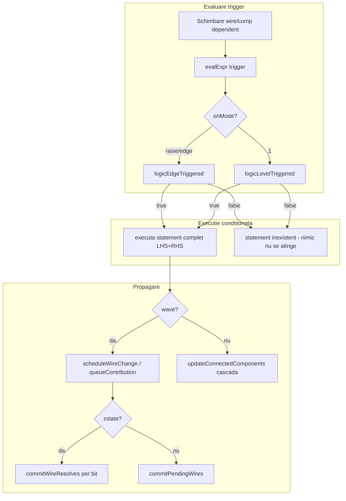

# Plan: Conditional Assignment (`on:`)

## Ce am gasit in cod

### `on:` exista deja, dar NU ca statement

Astazi `on:` apare in **trei contexte distincte**, niciunul egal cu feature-ul propus:

| Context | Unde | Rol |
|---------|------|-----|
| Metadata def | `pcb +[...]`, `chip +[...]`, `board +[...]` | `on: raise/edge/1` pe pinul `exec:` |
| Atribut componenta | `comp [mem] .m: on: raise` | Mod trigger pentru property blocks |
| Property block | `.mem:{ set = flag, adr = x, data = d }` | Bloc multi-asignare legat de componenta |

**Nu exista** `parseOnStatement()` — `on: 1` la nivel de program esueaza cu `Invalid statement starting with 'on'` in [`parser.js`](v0_3_2/core/parser.js) (`stmt()` ~L1338).

### Infrastructura reutilizabila

Logica de trigger este deja centralizata in [`logic-value.js`](v0_3_2/core/logic-value.js):

```103:116:v0_3_2/core/logic-value.js
function logicEdgeTriggered(prevBit, newBit, onMode) {
  // raise/rising → 0→1
  // edge/falling → 1→0
  // Z/X nu declanseaza
}
function logicLevelTriggered(newBit, newValue, prevValue, setDependsOnTilde) {
  // LSB=1 + valoare schimbata (sau ~ dependency)
}
```

Aceeasi logica e folosita in [`signal-propagation.js`](v0_3_2/core/signal-propagation.js) (~L1086) si [`interpreter.js`](v0_3_2/core/interpreter.js) (~L8083) pentru property blocks.

### Writable LUT — cazul de utilizare principal

Operatiile `.lut:clear()`, `.lut:add()`, `.lut:set()` exista si returneaza `1wire` success ([`interpreter.js`](v0_3_2/core/interpreter.js) ~L1160+, teste `lut-writable` 2044–2059). Astazi ruleaza **imediat** la elaborare:

```logts
1wire _ = .huff:clear()   # mereu executat
```

Conditional assignment rezolva exact problema: **intregul statement de asignare nu exista** cat timp conditia trigger nu e indeplinita.

---

## Model semantic (confirmat)

Un `on:{ trigger, assignment }` nu este „o asignare care uneori sare peste RHS". Este **un statement care exista in program doar cand conditia modului e indeplinita** — la fel pentru **`on:raise`**, **`on:edge`** si **`on:1`**.

Regula unica: `shouldExecute === false` → statement **inexistent** (nici LHS, nici RHS, zero efecte). `shouldExecute === true` → statement **existent**, asignare completa.

| Mod | Statement **nu exista** cand | Statement **exista** cand |
|-----|------------------------------|---------------------------|
| `on:raise` | fara tranzitie `0→1` pe LSB trigger (inclusiv trigger mentinut la `1` fara nou front) | LSB trigger face `0→1` |
| `on:edge` | fara tranzitie `1→0` pe LSB trigger (inclusiv trigger mentinut la `0`) | LSB trigger face `1→0` |
| `on:1` | LSB trigger nu e `1`, sau valoarea trigger n-a schimbat | LSB=`1` **si** valoare schimbata |

Exemple:

```logts
on:raise {
    clearFlag,
    ok = .huff:clear()
}
// clearFlag=0 sau 1→1 (fara front) → statement inexistent, LUT intact

on:edge {
    writeClock,
    updated = .huff:set(key, value)
}
// writeClock=1 sau 0→0 (fara coborare) → statement inexistent
// writeClock 1→0 → statement exista, set ruleaza

on:1 {
    receivedPackage,
    processPackage = 1
}
// receivedPackage=0 → statement inexistent
// receivedPackage devine 1 → statement exista, processPackage = 1
```

Implementare: la `shouldExecute === false`, **nu se intra deloc** in calea de assignment (`execWireStatement` / handler `.comp:pin` etc.) — pentru **orice** mod `on:`.

---

## Directia se intelege — cu cateva ajustari de documentatie

Cerinta este coerenta cu modelul LogTScript (fiecare operatie runtime produce o valoare pe wire). Sintaxa propusa:

```logts
on:<mode> {
    trigger,
    assignment
}
```

se deosebeste clar de:
- **component `on:`** (atribut pe `comp`/`pcb`)
- **property block** `.comp:{ ... }` (multi-statement, legat de componenta)
- **wire init** `1wire s : 1` (`:` fara `on`)

### Restrictii cerute (confirmate)

Corpul `on:{ }` accepta **exact o asignare**, nu definitii:

| Valid | Invalid |
|-------|---------|
| `ok = .lut:clear()` | `.lut:clear()` (fara destinatie wire) |
| `.mem:set = myFlag` | `pcb +[x]:` / `comp [...]` / `chip` / `board` / `def` |
| `.adder:a = aValue` | `a = ...` urmat de `b = ...` |
| `processPackage = 1` | orice non-assignment statement |

### Decizie confirmata: semantica `on:1`

**Aliniere cu codul existent**: `on:1` = LSB al trigger-ului este `1` **si** valoarea trigger-ului s-a schimbat fata de pasul anterior (`logicLevelTriggered`). Documentatia propusa trebuie **corectata** — nu este level-sensitive pur.

### Moduri `on:` — aceleasi valori, acelasi comportament ca la componente

Valorile canonice sunt **`raise` / `edge` / `1`** (fara `0` — vezi decizia de mai jos).

Conditional assignment **nu introduce moduri noi** — reutilizeaza direct `logicEdgeTriggered` / `logicLevelTriggered` din [`logic-value.js`](v0_3_2/core/logic-value.js).

| Mod (public) | Comportament (identic property blocks / exec PCB) |
|--------------|---------------------------------------------------|
| `on:raise` | Rising edge: ultimul bit al trigger `0 → 1` |
| `on:edge` | Falling edge: ultimul bit al trigger `1 → 0` |
| `on:1` | Level: LSB=`1` **si** valoarea trigger s-a schimbat (`logicLevelTriggered`) |

**Aliasuri interne** (acceptate la parse, nu promovate in doc): `rising`≡`raise`, `falling`≡`edge`, `level`≡`1`. Literal `on:1` acceptat (BIN/DEC).

### Decizie: eliminare `on:0`

`on:0` era documentat la componente (`raise/edge/1/0`) dar **nu exista in runtime** (`onMode === '0'` absent din interpreter). **Se elimina** din:
- conditional assignment (parse error la `on:0`)
- documentatie componente: [`pcb.md`](v0_3_2/doc/pcb.md), [`board.md`](v0_3_2/doc/board.md), [`mem.md`](v0_3_2/doc/mem.md), [`led.md`](v0_3_2/doc/led.md), [`doc-function.md`](v0_3_2/doc/doc-function.md)
- [`alu.js`](v0_3_2/core/components/alu.js) atribut doc: `0/1/raise/edge` → `1/raise/edge`

**Workaround:** pentru trigger pe frontiera `0`, foloseste expresia inversata in conditional assignment:
```logts
on:raise {
    !zeroFlag,
    ok = .lut:clear()
}
```

### Clarificari confirmate

1. **`on:edge`** — numele oficial; falling `1→0`. Fara alias `falling` in doc.

2. **Trigger bit** — ultimul bit (LSB) al valorii evaluate.

3. **Z/X pe trigger** — confirmat: nu declanseaza edge; pentru `on:1`, LSB strict `1`.

4. **Prima rulare RUN** — **identic cu property blocks** ([`interpreter.js`](v0_3_2/core/interpreter.js) ~L7766–7789):

| Context | `on:raise` / `on:edge` | `on:1` |
|---------|------------------------|--------|
| Top-level (inregistrat) | **Nu** executa la primul RUN; `lastTriggerValue` = valoare initiala trigger; asteapta tranzitie | Executa la primul RUN **daca** LSB=`1` la init |
| Corp PCB/chip/board | Parse error (doar `on:1` permis in corp) | Executa daca LSB=`1` (fara edge tracking) |

Conditional assignment copiaza aceasta logica la inregistrare (`shouldExecuteFirstRun`).

5. **Destinatii permise** — confirmat: wire, `.comp:pin`, `.comp:set`, `^.global:pin`, slice, `=` / `:=` / `=:` / bus enable.

6. **Ambiguitate lexicala `on`** — confirmat: handler contextual la `on:` + mode + `{`; `on` ca variabila valid in expresii.

---

## Impact wave / legacy / ZSTATE



### Wave (default editor)

- Conditional assignments se **inregistreaza** (ca `wireStatements` + `componentPropertyBlocks`), nu ruleaza la fiecare propagare.
- La trigger activ: executa asignarea prin calea existenta (`execWireStatement` / assignment handler), respectand `deferWirePropagation()`.
- Guard `executedThisPropagate`: max 1 executie per statement per iteratie wave (evita bucle).
- Integrare in bucla `propagate()` din [`signal-propagation.js`](v0_3_2/core/signal-propagation.js): re-evaluare la schimbare dependinte trigger.

### Legacy

- Aceeasi semantica trigger; diferenta: cascada imediata dupa asignare.
- Ordinea programului conteaza mai mult la feedback combinatorial.
- Teste obligatorii in **ambele** moduri (pattern existent in test manifest: grupuri duplicate `pcb` / `pcb (wave)`).

### MODE ZSTATE

- Necesita wave — deja verificat la activare ([`zstate.md`](v0_3_2/doc/zstate.md)).
- Cand trigger inactiv: statement inexistent — wire destinatie pastreaza valoarea (inclusiv `Z` daca nu a fost scris).
- Cand trigger activ: asignarea intra in coada de contributii; conflicte multi-driver → `X` per bit.
- Trigger cu bit `Z`/`X`: nu declanseaza (consistent cu edge helpers).

### Corp PCB / chip / board

Property blocks din corp folosesc **doar gating level** (edge dezactivat in corp). Recomandare pentru conditional assignment in corp:

- **`on:1`**: permis, LSB=1 suficient (fara edge tracking in corp) — aliniat cu [`interpreter.js`](v0_3_2/core/interpreter.js) ~L7767.
- **`on:raise` / `on:edge` in corp**: parse error — doar `on:1` permis in corp.

---

## Arhitectura implementare

### 1. Parser — [`parser.js`](v0_3_2/core/parser.js)

- Adauga `parseConditionalAssignment()`:
  - `on` (ID) + `:` + mode — ID (`raise`|`edge`|`1` + aliasuri) sau literal `1`; **parse error la `on:0`**
  - `{` + `expr` (trigger) + `,` + **exact un** assignment statement + `}`
- Validare parse-time:
  - al doilea element trebuie sa fie `{ assignment: ... }` sau echivalent (nu `comp`, `pcb`, `def`, `var`, property block `{...}`)
  - respinge `.lut:clear()` fara `=`
  - respinge virgula + al doilea statement
- Inregistreaza in `stmt()` **inainte** de `peekNextIsAssign()`:
  ```js
  if (this.c.type === 'ID' && this.c.value === 'on' && this.peekOnConditional()) {
    return this.parseConditionalAssignment();
  }
  ```
- AST propus:
  ```js
  { conditionalAssignment: { onMode, triggerExpr, assignment, line, col } }
  ```

### 2. Interpreter — [`interpreter.js`](v0_3_2/core/interpreter.js)

- Array nou: `conditionalAssignments[]` cu:
  - `onMode`, `triggerExpr`, `assignment` (statement ref)
  - `dependencies`, `wireDependencies` (din `collectExprDependencies` pe trigger)
  - `lastTriggerValue` (string, pentru edge/level)
  - `stmtIndex` (identificator unic)
- La `execStatement()` / elaborare: inregistreaza blocul; first-run identic property blocks (`shouldExecuteFirstRun` per tabelul de mai sus).
- Functie `evalConditionalAssignments(changedWires, changedComps)`:
  - evalueaza **doar** trigger-ul
  - apeleaza `logicEdgeTriggered` / `logicLevelTriggered`
  - daca `shouldExecute`: executa **intregul** statement de asignare (aceeasi cale ca assignment normal — LHS + RHS)
  - daca nu: **statement inexistent** — zero efecte (nici wire destinatie, nici `.comp:pin`, nici mutatii LUT/mem)
- Apelata din:
  - `updateConnectedComponents` / wave `propagate()` (langa property block handling in [`signal-propagation.js`](v0_3_2/core/signal-propagation.js))
  - `NEXT(~)` re-evaluare (daca trigger depinde de `~`)

### 3. Signal propagation — [`signal-propagation.js`](v0_3_2/core/signal-propagation.js)

- Hook in bucla de re-evaluare (~L1086 si ~L2032) pentru conditional assignments, paralel cu `componentPropertyBlocks`.
- Respecta `executedThisPropagate` / `executedBlocks` pattern.

### 4. Validare scope corp

- Extinde `validateChipBodyStatement` / `validateBoardBodyStatement` (si echivalent PCB daca exista) pentru a respinge `conditionalAssignment` cu `on:raise`/`on:edge` in corp.

### 5. Documentatie

- Fisier nou: [`doc/conditional-assignment.md`](v0_3_2/doc/conditional-assignment.md) — moduri `raise`/`edge`/`1`; workaround `!flag` pentru trigger inversat
- **Curatare `on:0`**: `pcb.md`, `board.md`, `mem.md`, `led.md`, `doc-function.md` → `raise/edge/1`; `alu.js` atribut `on`
- Cross-ref in [`lut.md`](v0_3_2/doc/lut.md), [`assignment-operators.md`](v0_3_2/doc/assignment-operators.md), [`signal-propagation.md`](v0_3_2/doc/signal-propagation.md)
- Regenerare `doc-data_generated.js`

### 6. Teste — [`test_suite.js`](v0_3_2/tests/test_suite.js)

Grup nou `conditional-assignment`:

| Test | Ce verifica |
|------|-------------|
| Parse valid | `on:raise { flag, ok = .lut:clear() }` |
| Parse invalid | fara `=`, doua asignari, `pcb`/`comp` in corp, `on:0` |
| `on:raise` | LUT nemodificat pana la 0→1; `ok=1` la clear |
| `on:edge` | declanseaza la 1→0 |
| `on:1` | LSB=1 + schimbare; nu re-declanseaza la valoare identica |
| First run | `on:raise`/`on:edge` nu ruleaza la RUN initial; `on:1` da daca LSB=1 |
| `!flag` trigger | `on:raise { !zeroFlag, ... }` echivalent logic cu vechiul `on:0` |
| `.mem:set = flag` | trigger pe pin set, fara property block |
| Wave + legacy | acelasi rezultat pe circuit simplu |
| ZSTATE | trigger inactiv → wire nemodificat; activ → write normal |

---

## Riscuri si mitigari

| Risc | Mitigare |
|------|----------|
| Statement executat partial cand trigger fals (corupe LUT, scrie wire gresit) | `shouldExecute` gate pe **intregul** assignment — nici LHS, nici RHS; statement tratat ca inexistent |
| Confuzie cu property blocks | Doc: „standalone statement, nu inlocuieste `.comp:{ }`" |
| Oscilatii wave la `on:1` + feedback | Reutilizeaza `executedThisPropagate`; teste feedback |
| `on` ca nume variabila | Handler contextual doar la `on:` + `{` |
| Performanta (multe on: statements) | Acelasi model ca property blocks; indexare pe dependinte |

---

## Ordine implementare recomandata

1. Parser + validari corp + teste parse (+ respingere `on:0`)
2. Inregistrare runtime + first-run ca property blocks + teste legacy
3. Integrare wave propagation + teste wave
4. Teste ZSTATE
5. Documentatie + regenerare doc viewer
