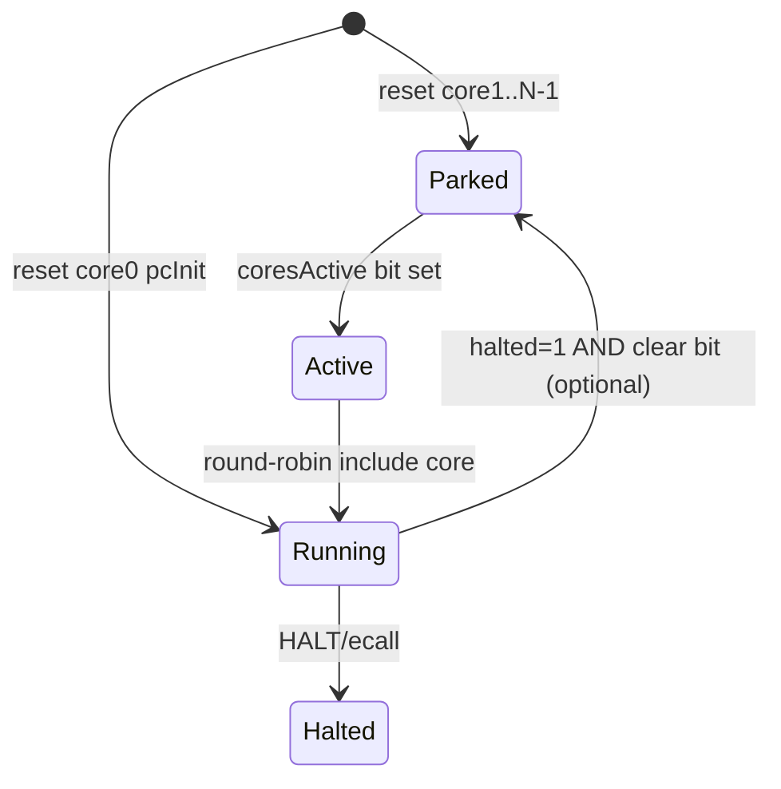
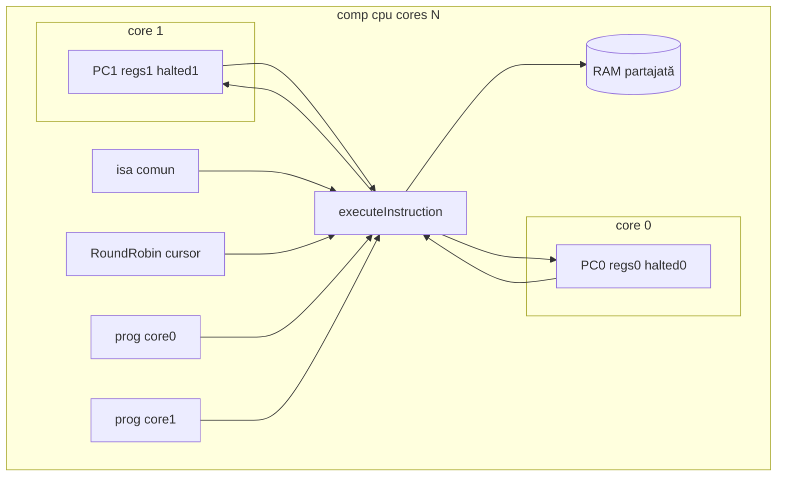

# Plan: `comp [cpu]` multi-core MVP

## Context

- Azi: **1 `comp [cpu]` = 1 core** — un PC, un set de registre, un flux `set`/`run` ([`cpu-devices.js`](../v0_3_2/devices/cpu-devices.js), [`doc/cpu.md`](../v0_3_2/doc/cpu.md)).
- Alternativa existentă: **N componente** `comp [cpu]` + **`ram = .shared`** — SMP la nivel de board, fără API unificat.
- **Nu** confundăm cu **1+x.8 multi-set** (ISA diferită per instrucțiune) — multi-core = **aceeași ISA**, **mai multe PC-uri**.

Pe silicon real (ARM, x86):

- La reset rulează **doar un core „bootstrap”** (BSP / core0).
- Celelalte core-uri stau **parcare** (WFE / wait-for-SIPI) până când core0 le **trezește** (mailbox, IPI, scriere în registru SO).
- Apoi un **scheduler OS** (sau firmware) alternează/firele pe core-uri; hardware-ul poate rula **în paralel**; simulatorul MVP folosește **round-robin** (determinist, didactic).

---

## Obiectiv MVP

| Feature | MVP | Amânat |
|---------|-----|--------|
| `cores: N` (N=1…8) | ✅ | N>8 |
| **RAM partajată** (un singur spațiu date) | ✅ | — |
| **Prog** partajat + `pcInit` **sau** **prog separat per core** | ✅ ambele (Faza A) | — |
| **Boot**: doar core0 activ | ✅ | — |
| **Wake** alte core-uri | `coresActive` / `wakeCore` (property) | wake din program via MMIO (Faza B) |
| **Scheduling** | round-robin la `set`/`run` | affinity, priority |
| **Atomics** hardware | ❌ | LDREX/STREX, LOCK CMPXCHG |
| **IRQ** per core | global (ca azi) sau doar core0 | IPI, per-core IE |
| Execuție paralelă reală | ❌ (interleaved RR) | — |

---

## Decizii (D-MC)

| ID | Regulă |
|----|--------|
| **D-MC1** | `cores` implicit **1** — comportament identic cu CPU actual (backward compat). |
| **D-MC2** | Toate core-urile partajează **același `isa:`** și **aceeași RAM** (`ram:` intern sau `ram = .shared`). |
| **D-MC3a** | **`prog` partajat:** același blob pentru toate core-urile; **`pcInit`** per core (listă `0, 8, …`) — index instrucțiune sau byte offset (D32). |
| **D-MC3b** | **`prog` per core (Faza A):** sub-blocuri `core0:`, `core1:`, … cu init `=` propriu (wire/asm); fiecare core are **`progCodeTable`** / fetch separat; **`pcInit`** implicit 0 dacă lipsește. |
| **D-MC3c** | Indiferent de D-MC3a/b: **core1…N-1 nu execută** până la **wake** (`coresActive` + `wakeCore`) — prog încărcat, dar parcat. |
| **D-MC4** | La **reset**: core0 → `pcInit[0]`, `halted=0`; core-urile 1…N-1 → `halted=1`, **neincluse** în scheduling până la wake. |
| **D-MC5** | **`coresActive`**: bitmask pe N biți (valoare **binară LogTscript**, fără prefix `0b` — ex. `011` = core0+core1); bit `i`=1 ⇒ core `i` participă la round-robin; la reset doar bit0=1 → **`coresActive = 1`** sau **`01`**. |
| **D-MC6** | **`set`**: execută **exact 1 instrucțiune** pe **următorul core activ** în ordine round-robin (sari peste halted/inactive). |
| **D-MC7** | **`run`**: repetă D-MC6 până la **`maxSteps` instrucțiuni totale** (sumă pe toate core-urile) sau toate core-urile active sunt `halted`. |
| **D-MC8** | **Fără atomics**: două core-uri pot scrie aceeași celulă RAM în aceeași „rundă” didactică — **documentat**; cooperarea se face prin convenții software (vezi mai jos). |

---

## Ce înseamnă „RAM partajată” și „fără atomics”

**RAM partajată:** toate core-urile citesc/scriu în **același** array (intern sau `comp [mem]` legat). Variabile globale, cozi, flag-uri de sincronizare — la **aceeași adresă** pentru toate core-urile.

**Fără atomics (MVP):** pe hardware real, instrucțiuni ca `lock cmpxchg` / `ldrex`/`strex` garantează că doar un core modifică un word la un moment dat. **Nu le implementăm în MVP.**

Consecință didactică acceptată:

```text
Core0: load flag → 0
Core1: load flag → 0    (amândoi văd 0)
Core0: store flag ← 1
Core1: store flag ← 1   (race — pe silicon cu OS corect ar trebui protecție)
```

Pentru **demo MVP**, programele cooperează prin:

- **Sloturi separate** per core (core0 scrie la `0x100`, core1 citește de la `0x200`).
- **Protocol turn-based** (core0 scrie, apoi wake core1; core1 consumă — scheduling RR face secvența deterministă).
- **Lock software simplu** (spin pe `while [lock] != 0`) — funcționează **dacă** nu intercalezi instrucțiuni „în mijlocul” secțiunii critice (RR face secvența previzibilă, nu o garanție ca pe silicon).

**Faza B (opțional):** mailbox la adresă fixă în RAM + hook în executor la `store` → setează `coresActive` (simulare „SVC wake secondary core”).

---

## Model boot + wake (ca pe real, simplificat)



### Reset (power-on)

| Core | PC | halted | coresActive bit |
|------|-----|--------|-----------------|
| 0 | `pcInit[0]` | 0 | 1 |
| 1…N-1 | `pcInit[i]` sau 0 | 1 | 0 |

Core-urile parcate **nu consumă** pași round-robin.

### Wake (core0 pornește worker-ii)

**Varianta A — property block (MVP, simplu):**

```logts
.mp:{ coresActive = 011, wakeCore = 1 }
```

- **`coresActive = 011`** — literal binar LogTscript (nu `0b011`): biții 0 și 1 setați → core0 + core1 eligibile pentru scheduling.
- **`wakeCore = 1`** — index zecimal al core-ului de deblocat: `halted ← 0`; PC rămâne `pcInit[1]` sau 0 (prog per-core / partajat).

**Varianta B — din program (faza B):**

- Regiune MMIO (via `mmap =`) la adresa magică `0xFFFF0000`: scriere `1 << coreId` → wake.
- Sau convenție RAM: `[0x00]` = command, `[0x04]` = core mask — CPU device poll la fiecare step (costisitor; amânat).

---

## Sintaxă propusă

### Valori binare (`coresActive`)

LogTscript folosește **șiruri binare** la assign pe property-uri pe biți (ca la mem/reg), **fără** prefix C `0b`:

| `cores: N` | Doar core0 | Core0 + core1 |
|------------|------------|-----------------|
| 2 | `coresActive = 1` sau `01` | `coresActive = 011` |
| 4 | `coresActive = 1` | `coresActive = 011` (primele 2 core-uri) |

Lățimea efectivă = min(`cores`, biți în literal); biți superiori ignorați.

### Declarație — variantă A: prog partajat + `pcInit`

```logts
inline [asm] .rv:
  set: riscv32
  :

comp [mem] .shared:
  depth: 32
  length: 64
  :

comp [cpu] .mp:
  cores: 2
  isa: .rv
  registers: 8
  pcInit: 0, 16          # core0 @ instr 0, core1 @ instr 16 (byte offset sau index — vezi D32)
  on: 1
  maxSteps: 200
  ram = .shared
  prog:
    depth: 8
    length: 128
    = .rv {
      # --- core0 bootstrap (instr 0…)
      addi x1, x0, 1
      sw   x1, 0(x0)       # flag la RAM[0]
      # wake core1 (property extern sau faza B mailbox)
      ecall                # halt core0 sau loop
    halt0:
      j halt0

      .org 64              # sau index instr 16 pentru core1
      # --- core1 worker
    worker:
      lw   x2, 0(x0)
      addi x2, x2, 10
      sw   x2, 4(x0)
      ecall
    halt1:
      j halt1
    }
  :
```

### Declarație — variantă B: prog separat per core (Faza A)

Fiecare core are **propriul** blob; **wake obligatoriu** pentru core1+ (prog e încărcat la init, dar core-ul rămâne parcat).

```logts
inline [asm] .rv:
  set: riscv32
  :

32wire boot = .rv {
  addi x1, x0, 42
  sw x1, 0(x0)
  ecall
boot_loop:
  j boot_loop
}

32wire worker = .rv {
  lw x2, 0(x0)
  addi x2, x2, 1
  sw x2, 4(x0)
  ecall
worker_loop:
  j worker_loop
}

comp [mem] .shared:
  depth: 32
  length: 16
  :

comp [cpu] .mp:
  cores: 2
  isa: .rv
  registers: 8
  on: 1
  maxSteps: 20
  ram = .shared
  prog:
    depth: 8
    length: 32
    core0:
      = boot
    core1:
      = worker
  :
```

- **`core0:` / `core1:`** — sub-blocuri în `prog:` (similar `ram:` / `prog:` nested existente).
- La **reset**: ambele programe sunt în memorie; rulează **doar core0** până la wake.
- Extern (chip sau script test): `.mp:{ coresActive = 011, wakeCore = 1, run = 1 }`.

**Reguli implementare prog per-core:**

- Fiecare `coreK` are `progMemId` / tabel instrucțiuni propriu (sau slice în același device cu metadata separată).
- Fetch la `cpuStepCore(c, K)` citește din prog-ul core-ului `K`.
- Dacă lipsește `coreK:` pentru K>0 → eroare la parse sau core permanent parcat (decizie: **eroare** dacă `cores: N` și lipsește `coreK`).

### Property / pini noi

| Pin / property | Rol |
|----------------|-----|
| `coresActive` | Bitmask core-uri eligibile pentru scheduling |
| `wakeCore` | Index core de deblocat (`halted ← 0`) |
| `parkCore` | Index core de parcat (`halted ← 1`, bit cleared) |
| `coreN:pc`, `coreN:r0`, … | Peek per core (N = 0…cores-1) |
| `coreN:halted` | Stare halt per core |

Trace (când `trace` activ):

```text
# [c0] step pc=0 instr=… halted=0
# [c1] step pc=16 instr=… halted=0
```

### `cores: 1` (default)

Fără `cores` sau `cores: 1` → structură internă identică cu azi; API `r0`, `pc` fără prefix `core0:`.

---

## Arhitectură internă



### Modificări fișiere

| Fișier | Schimbări |
|--------|-----------|
| [`devices/cpu-devices.js`](../v0_3_2/devices/cpu-devices.js) | `cores[]` în loc de câmpuri flat; `cpuStepMulti`, `cpuRunMulti`; `coresActive`, `rrIndex` |
| [`core/components/cpu.js`](../v0_3_2/core/components/cpu.js) | parse `cores`, `pcInit` list; property `coreN:*`; `applyProperties` wake/park |
| [`doc/cpu.md`](../v0_3_2/doc/cpu.md) | secțiune Multi-core + exemple logts-play |
| [`tests/test_suite.js`](../v0_3_2/tests/test_suite.js) | grup `cpu-multicore` |

**Nu** schimbăm asm-set-urile — același executor `riscv32` / `x86-32` / etc., apelat cu context `c.activeCore`.

---

## Scheduling round-robin (detaliu)

Pseudocod:

```text
function cpuStepMulti(c):
  if all active cores halted: return
  for attempt in 0..cores-1:
    i = (c.rrIndex + attempt) % c.coreCount
    if !coresActive[i]: continue
    if c.cores[i].halted: continue
    c.activeCore = i
    cpuStepCore(c, i)      # fetch/decode/exec ca azi
    c.rrIndex = (i + 1) % c.coreCount
    return
```

`cpuRunMulti`: buclă `cpuStepMulti` până la `maxSteps` total sau stall global.

**Determinism:** ordinea RR e fixă → teste reproducibile (avantaj didactic față de paralelism real).

---

## Faze implementare

### Faza A — MVP (livrabile)

1. **Schema + parse** — `cores: N`, `pcInit: v0, v1, …`; **`prog:`** cu `=` unic (partajat) **sau** `core0:`/`core1:`/`…` (separat).
2. **Device state** — array `cores[i].{ pc, regs, halted, progRef?, progCodeTable?, … }`; `coresActive`, `rrIndex`.
3. **Exec** — refactor `cpuStep` → `cpuStepCore(c, coreIdx)`; wrapper multi când `coreCount > 1`.
4. **Reset** — D-MC4; `onReset` extins: `coreRegs`, `corePc` opțional.
5. **Properties** — `coresActive`, `wakeCore`, `parkCore`; `evalGetProperty` pentru `core0:r0` etc.
6. **Trace** — prefix `[cN]`.
7. **Teste** (ids noi, ex. 3400+):
   - 2 core, prog **partajat** + `pcInit`, doar core0 până la `wakeCore`.
   - 2 core, prog **separat** (`core0:`/`core1:`), wake apoi RR.
   - Producer core0 / consumer core1 pe RAM partajată.
   - Round-robin: 4× `set` alternează c0/c1 în trace.
   - `cores: 1` backward compat (prog fără sub-blocuri `coreK`).
8. **Doc** — `logts-play` Load + Load & Run; sintaxă `coresActive = 011` (nu `0b`).

### Faza B — wake din program (opțional)

- MMIO mailbox sau monitor la store în adresă configurabilă → setează `coresActive` / `wakeCore` fără property block extern.
- IRQ routing per core.

### Faza C — amânat

- Atomics (LDREX/STREX, x86 LOCK).
- IPI între core-uri.
- Paralelism OS-thread (non-determinist).
- `cores > 8`.

---

## Exemplu didactic — Load & Run (prog separat per core)

**Scenariu:** core0 scrie 42 în RAM; wake core1; core1 incrementează în celula vecină; RR interleaved.

```logts-play
inline [asm] .rv:
  set: riscv32
  :

32wire boot = .rv {
  addi x1, x0, 42
  sw x1, 0(x0)
  ecall
b: j b
}

32wire worker = .rv {
  lw x2, 0(x0)
  addi x2, x2, 1
  sw x2, 4(x0)
  ecall
w: j w
}

comp [mem] .shared:
  depth: 32
  length: 16
  :

comp [cpu] .mp:
  cores: 2
  isa: .rv
  registers: 8
  on: 1
  maxSteps: 20
  ram = .shared
  prog:
    depth: 8
    length: 32
    core0:
      = boot
    core1:
      = worker
  :

.mp:{ coresActive = 011, wakeCore = 1, run = 1 }
show(.shared:get; 0)
show(.shared:get; 4)
```

**Load & Run:** celula 0 = 42, celula 1 = 43; trace `[c0]` / `[c1]`. Wake-ul poate fi și din script/chip separat înainte de `run`.

---

## Teste de acceptanță MVP

| # | Verifică |
|---|----------|
| T1 | `cores` absent ≡ `cores: 1`; teste CPU existente trec fără modificări |
| T2 | Reset: `coresActive = 1`, doar core0 nu halted |
| T3 | `wakeCore = 1` + `coresActive = 011` → core1 execută la următorul `set`/`run` |
| T3b | Prog separat `core0:`/`core1:` — core1 parcat până la wake, apoi fetch din `worker` |
| T4 | RR: 2 core active, 4 steps → 2 instrucțiuni per core (dacă nu halt) |
| T5 | RAM partajată: scriere core0, citire core1 → aceeași valoare |
| T6 | `maxSteps` contorizează instrucțiuni **totale**, nu per core |
| T7 | Trace conține `[c0]` și `[c1]` |
| T8 | riscv32 + x86-32 smoke (același mecanism, ISA diferită — 2 teste) |

---

## Relație cu alte planuri

| Plan | Relație |
|------|---------|
| [`comp_cpu.plan.md`](comp_cpu.plan.md) | Extinde device-ul existent, nu tip nou |
| [`asm_sets.plan.md`](asm_sets.plan.md) | Independent; **nu** 1+x.8 multi-set |
| [`comp_mmap.plan.md`](comp_mmap.plan.md) | RAM partajată via `ram =` sau mmap comun |
| **1+x.2b** Thumb mixt | Orthogonal |

---

## Checklist final (bife plan)

- [ ] D-MC1…MC8 confirmate
- [ ] Faza A implementată
- [ ] Teste 3400+ verzi
- [ ] `doc/cpu.md` + doc-data
- [ ] Faza B (wake MMIO) — opțional / amânat
- [ ] Atomics — amânat explicit

---

## Rezumat pentru user

- **Multi-core** = un singur `comp [cpu]` cu **`cores: N`**, **aceeași ISA**, **RAM comună**.
- **Boot realist simplificat:** doar **core0** rulează; restul **parcare** până la **`coresActive = 011`** (sau `01` / `1`) + **`wakeCore`** — sintaxă **binară LogTscript**, fără `0b`.
- **Prog Faza A:** partajat + `pcInit` **sau** **`core0:` / `core1:`** separate; wake obligatoriu pentru core1+.
- **Scheduler MVP:** **round-robin** la fiecare `set`/`run` — determinist, nu paralel hardware.
- **Fără atomics** = nu avem instrucțiuni speciale anti-race; cooperezi prin design (sloturi separate, wake explicit, secvențe previzibile RR).
- **Nu e livrat azi** — acest fișier e planul MVP; implementarea e Faza A.
