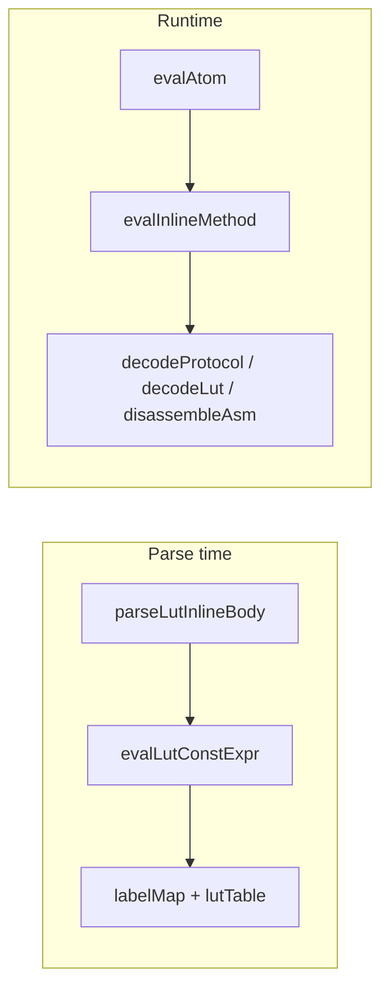

# Plan: DECODE + LUT Labels + Expresii constante

## Context

Versiunea activă: [`v0_3_2`](v0_3_2). Pipeline: `tokenizer.js` → `parser.js` → `interpreter.js` + module dedicate (`protocol-assembler.js`, `asm-assembler.js`, `lut.js`).

**Ce există deja:**
- Encode protocol (`generateProtocol`) și assemble ASM (`assembleProgram`)
- LUT lookup forward (`.decoder(in=addr)`)
- Sintaxa `.inst:prop` în parser, dar **fără** `(` după property
- `inlineInstances` Map cu structuri parse per kind

**Ce lipsește:** decode/disassemble, label-uri LUT, `isValid()`, expresii `| & !` la parse-time, afișare simbolică în `probe()` / `show()`.

**Decizii confirmate:**
- Label-uri: **ambele** sintaxe (`labels { }` și flat `RED = 00`); blocul `data { }` este **opțional**
- Suport atât `inline [lut]` cât și `comp [lut]` pentru labels, `isValid()`, `decode()`
- **`probe()` și `show()`** pentru LUT trebuie să afișeze nu doar valoarea binară, ci și **numele label-ului** și **expresia sursă** când există (ex. `LOAD = ACCLOAD | MEMREAD`)



---

## Faza 1 — Infrastructură parser: metode inline `.inst:method(args)`

**Fișier:** [`v0_3_2/core/parser.js`](v0_3_2/core/parser.js) (~L2198)

Extinde `atom()` după `.inst:ID`:
- Dacă urmează `(`, parsează ca `{ inlineMethod: { var, method, args[] } }` (similar `call()`)
- Metode rezervate: `decode`, `isValid` — au prioritate față de label-uri când urmează `(`
- Fără `(` → rămâne property access (label sau component property)

**Fișier:** [`v0_3_2/core/interpreter.js`](v0_3_2/core/interpreter.js)

- `evalInlineMethod(ctx, inst, method, args)` — dispatch pe `inst.kind`
- Flag `evalContext: 'expr' | 'show' | 'doc'` propagat din `_execShowImmediate`, `getDocLines`, assignment
- Validare ASM: în context `expr` + assignment → `ASM decode produces text and cannot be assigned to wires`

---

## Faza 2 — LUT Labels + expresii constante

### Modul nou: `lut-labels.js`

Responsabilități (parse-time, fără runtime):
- Validare nume label: `^[A-Za-z][A-Za-z0-9]*$`, unic în LUT
- Parser + evaluator expresii constante dedicate (în `lut-labels.js`, **nu** reutilizează `parser.js` `expr()` — acolo `+` e concatenare)
- Referințe: label local, literal binar, `.otherLut:LABEL` extern
- Rezultat: `{ bits, exprAst, exprSource }` — valoarea calculată + AST păstrat pentru doc/show/probe
- **`exprSource` păstrează sintaxa originală din sursă** — operatori infix `|`, `&`, `!` (ex. `ACCLOAD | MEMREAD`, `ALL & !WRITE`); **nu** se normalizează la `OR()`, `AND()`, `NOT()`
- La serializare din AST (dacă e necesar): `formatLutExprSource(ast)` emite exclusiv `|`, `&`, `!` + paranteze + nume label — niciodată forme funcționale
- Helper runtime: `formatLutSymbolic(inst, bits, opts)` — formatează `FETCH (001)` sau `001 [FETCH]`
- Helper runtime: `resolveLabelsForValue(inst, bits)` — reverse lookup nume label(e) pentru o valoare (pentru fire runtime)
- Erori: `Duplicate label`, `Unknown label`, `Label width mismatch`, `Cannot resolve '.x:LABEL'`, `Unbalanced parentheses in LUT expression`

### Gramatică expresii constante LUT

Operandi:
- literal binar (`00000001`)
- label local (`ACCLOAD`, definit anterior în același LUT)
- referință externă (`.flags:OVERFLOW`)

Operatori (doar aceștia):
- `|` bitwise OR — **lanțuri permise:** `A | B | C` (asociativ stânga)
- `&` bitwise AND — **lanțuri permise:** `A & B & C`
- `!` bitwise NOT — unar, prefix (`!WRITE`)
- `(...)` paranteze — grupare arbitrară

**Precedență** (de la cea mai mare la cea mai mică):
1. `!` (unary)
2. `&`
3. `|`

Exemple echivalente la evaluare:

| Expresie sursă | Semnificație |
|----------------|--------------|
| `A \| B \| C` | `(A \| B) \| C` |
| `(A \| B \| C) & D` | `((A \| B) \| C) & D` |
| `ALL & !WRITE` | `ALL & (!WRITE)` |
| `A \| B & C` | `A \| (B & C)` — `&` leagă mai strâns decât `\|` |

**`exprSource`:** textul exact din sursă (inclusiv paranteze și spații semnificative); probe/show/doc îl afișează neschimbat când e disponibil.

**Evaluare:** la parse-time, pe biți de lățime `depth`; toți operanzii trebuie să aibă aceeași lățime.

**Implementare parser** (`parseLutConstExpr` în `lut-labels.js`):
- Recursive descent: `exprOr` → `exprAnd` → `exprUnary` → `exprPrimary`
- `exprOr`: `exprAnd` (`|` `exprAnd`)*
- `exprAnd`: `exprUnary` (`&` `exprUnary`)*
- `exprUnary`: `!` exprUnary | exprPrimary
- `exprPrimary`: `(` exprOr `)` | binary | labelRef | externalRef

### Extindere parser LUT body

**Fișier:** [`v0_3_2/core/parser.js`](v0_3_2/core/parser.js) — refactor `parseLutInlineBody()`:

| Secțiune body | Sintaxă | Obligatoriu |
|---------------|---------|-------------|
| Atribute | `depth:`, `length:`, `fillwith:` | Nu (infer din labels) |
| Labels bloc | `labels { RED = 00 }` | Nu |
| Labels flat | `RED = 00` | Nu |
| Data | `data { KEY : VALUE }` | **Nu** (poate lipsi) |

**Reguli:**
- LUT labels-only (fără `data {}`) = tabel de constante; `length`/`lutTable` opționale
- `depth` inferat din lățimea comună a label-urilor dacă nu e explicit
- În `data {}`: chei/valori pot fi binar, label sau expresie (doar partea dreaptă)
- Rezolvare în 2 pași la `execInline` / `finalizeCompInfo`: (1) labels simple, (2) expresii + data entries

**Stocare pe instanță** (`inlineInstances` + `comp` info):

```js
{
  labelMap: { RED: { bits: '00', exprSource: null } },
  labelExprs: { LOAD: 'ACCLOAD | MEMREAD' },  // text sursă original | & ! — pentru doc/show/probe
  lutEntries, lutTable, ...
}
```

### Acces label: `.instance:LABEL`

**Fișier:** [`v0_3_2/core/interpreter.js`](v0_3_2/core/interpreter.js) — `evalAtom()`:

1. Verifică `inlineInstances.get(a.var)?.labelMap[a.property]`
2. Verifică `components.get(a.var)` via `LutComponent.evalGetProperty` extins
3. Dacă nu e label și nu e metodă cu `(` → eroare `Unknown label`

**Rezolvare args în metode:** bare `RED` în `.traffic:isValid(RED, GREEN)` → caută în labelMap-ul instanței callee; acceptă și `.traffic:RED`.

**Metadate simbolice pe rezultat eval** — `evalAtom` / `evalInlineLutInvoke` returnează opțional:

```js
{
  value: '00001001',
  bitWidth: 8,
  symbolicMeta: {
    labelName: 'LOAD',           // când acces direct .ctrl:LOAD
    exprSource: 'ACCLOAD | MEMREAD',  // când label definit prin expresie
    lutRef: '.ctrl'              // instanța sursă
  }
}
```

### Faza 2b — Afișare simbolică: `show()`, `probe()`, `doc()`

#### Regulă operatori în afișare (probe / show / doc)

Expresiile constante LUT se afișează **întotdeauna** cu operatorii din definiție:

| În sursă LUT | Afișare probe/show/doc | **Interzis** |
|--------------|------------------------|--------------|
| `A \| B` | `ACCLOAD \| MEMREAD` | `OR(ACCLOAD, MEMREAD)` |
| `A \| B \| C` | `A \| B \| C` | `OR(A, OR(B, C))` |
| `(A \| B \| C) & D` | `(A \| B \| C) & D` | `AND(OR(...), D)` |
| `A & B` | `ALL & !WRITE` | `AND(ALL, NOT(WRITE))` |
| `!A` | `!WRITE` | `NOT(WRITE)` |

- Prioritate: `exprSource` literal din parse (textul scris de utilizator)
- Fallback din AST: doar prin `formatLutExprSource()` cu `|`, `&`, `!`
- Aceeași regulă pentru `doc()`, `show()`, `probe()` — format unificat

#### Format afișare (convenție)

| Context | Exemplu output |
|---------|----------------|
| Label constant | `FETCH (001)` sau `.state:FETCH = 001` |
| Label cu expresie | `LOAD = ACCLOAD \| MEMREAD → 00001001` |
| Label cu NOT | `USER = ALL & !WRITE → 1101` |
| Wire cu valoare LUT | `# state = 001 (FETCH) - changed` |
| LUT lookup | `# next = 10 (GREEN) - changed` |

Implementare comună: `lut-labels.js` → `formatLutDisplayValue(inst, bits, meta)` folosit de show, probe, doc.

#### `show()` — [`interpreter.js`](v0_3_2/core/interpreter.js) `_execShowImmediate`

- Dacă `part.symbolicMeta` prezent → append label/expr la valueStr
- `show(.state:FETCH)` → `FETCH (001)` (nu doar `001`)
- `show(.ctrl:LOAD)` → `LOAD = ACCLOAD | MEMREAD` + valoare pe linie separată sau `LOAD (ACCLOAD | MEMREAD) = 00001001`

#### `probe()` — extindere infrastructură existentă

**Fișier:** [`interpreter.js`](v0_3_2/core/interpreter.js)

1. **`_resolveProbeExpr`** — cazuri noi înainte de component fallback:
   - `.lut:LABEL` (inline `inlineInstances` sau comp cu `labelMap`) → `kind: 'lutLabel'`, constantă
   - `.lut` / `.lut:get` (comp) → `kind: 'componentComputed'` (existent, verificat)
   - `.lut(in=addr)` / `.lut(0011)` (inline invoke) → `kind: 'lutInvoke'` cu re-eval la fiecare schimbare adresă

2. **`_emitProbeTarget`** — când `target.symbolicMeta` sau `target.lutInst`:
   ```text
   # .ctrl:LOAD = 00001001 (LOAD = ACCLOAD | MEMREAD) - initialised
   # .flags:USER = 1101 (USER = ALL & !WRITE) - initialised
   # state = 001 (FETCH) - changed
   ```
   Păstrează formatul existent `# name = value (ref) - reason`, adaugă paranteze simbolice. Expresiile folosesc **`|`, `&`, `!`** — nu `OR`/`AND`/`NOT`.

3. **Fire cu context LUT** — opțional: dacă wire e alimentat din `.lut:LABEL` sau lookup LUT, stochează `wire._lutSymbolicHint` la assignment pentru probe pe `probe(state)` fără prefix LUT.

4. **`_emitComputedComponentProbes`** — deja există pentru comp LUT `:get`; extinde cu `symbolicMeta` din label reverse lookup pe valoarea curentă.

#### `doc()` — deja în Faza 6

- Label cu expresie: `LOAD = ACCLOAD | MEMREAD` + linia `00000011` dedesubt (conform spec doc user)

### Suport `comp [lut]`

**Fișier:** [`v0_3_2/core/components/lut.js`](v0_3_2/core/components/lut.js):
- `finalizeCompInfo` / `createDevice`: același parser de body/initializer
- `evalGetProperty`: label lookup + `decode`/`isValid` când urmează `inlineMethod`
- `getSupportedProperties`: extins cu label names dinamice (sau rutare generică în interpreter)

---

## Faza 3 — LUT `isValid()` și `decode()`

**Fișier nou:** `v0_3_2/core/lut-decode.js`

### `isValid(key, value)` → `1bit`
- Verifică existența mapării exacte `key → value` în `lutEntries`/`lutTable`
- Args: wire runtime sau label/constantă rezolvată
- Eroare: `isValid() expects two arguments`

### `decode(value [, matchIndex])` → biți (lățime = addr width)
- Reverse lookup: parcurge entries, colectează chei cu `value` egal
- `matchIndex` default 0; eroare dacă depășește numărul de potriviri
- Erori: `LUT decode failed: value X does not exist`, `match index N exceeds available matches (M)`
- Input poate fi label (ex. `GREEN` → `10`)

**Return format:** `{ value: keyBits, bitWidth: addrWidth }` — compatibil cu multi-assign existent în `execWireStmt` (split pe `decls`).

---

## Faza 4 — Protocol `:decode(channels...)`

**Fișier:** [`v0_3_2/core/protocol-assembler.js`](v0_3_2/core/protocol-assembler.js)

Funcție nouă `decodeProtocol(inst, channelBits[])` — simetrică cu `generateProtocol`:

| Segment encode | Decode |
|----------------|--------|
| `literal` | verifică biți, consumă |
| `param Nb` | extrage N biți → output param |
| `reverse(param)` | extrage N biți, reverse → output param |
| `parityEven/Odd` | verifică paritate pe param anterior |
| `clock Nb` | verifică undă `01`/`10` per `clockType` |
| `repeat bit Nb` | verifică N biți identici |

**Output:** concatenare valori parametri (doar `param`/`reverse`) în ordinea apariției pe canale — compatibil cu:

```logts
7bit address, 1bit rw, ... = .i2c:decode(sdaBits, sclBits)
```

**Validări:**
- `Expected N protocol channels but received M`
- `Protocol output width mismatch`
- `Protocol decode failed: expected start bit '0' but received '1'`
- `Protocol decode failed: expected clock waveform`

---

## Faza 5 — ASM `:decode(instruction)` (text only)

**Fișier:** [`v0_3_2/core/asm-assembler.js`](v0_3_2/core/asm-assembler.js)

Funcție `disassembleInstruction(isa, bits)`:
- Match opcode pe literal segments
- Decode câmpuri `R`, `A`, `S?Nb` → text `LOAD R1 A3`
- Eroare dacă niciun opcode nu se potrivește

**Restricții runtime:**
- Returnează `{ value: text, isText: true }` — nu poate fi concatenat în fire
- Permis doar în `show()` și `doc()` (flag context)
- `show(.cpu:decode(00010111))` → `LOAD R1 A3`

---

## Faza 6 — Documentație (`doc()`)

Actualizări în:
- [`v0_3_2/core/components/lut.js`](v0_3_2/core/components/lut.js) — `formatInlineInstanceDoc`: secțiuni `labels:`, `data:` cu `->`, expresii cu valoare calculată
- [`v0_3_2/core/protocol-assembler.js`](v0_3_2/core/protocol-assembler.js) — `parameters:`, `channels:`, `decode: supported`
- [`v0_3_2/core/asm-assembler.js`](v0_3_2/core/asm-assembler.js) — `decode: disassembler only`, `valid contexts: show(), doc()`

**Doc static nou/actualizat:**
- [`v0_3_2/doc/decode.md`](v0_3_2/doc/decode.md) — decode protocol/LUT/ASM
- Actualizare [`v0_3_2/doc/lut.md`](v0_3_2/doc/lut.md) — labels, isValid, expresii, probe/show simbolic
- Actualizare [`v0_3_2/doc/debug.md`](v0_3_2/doc/debug.md) — secțiune `probe()` pentru LUT labels, lookup, format output simbolic
- Entry în [`v0_3_2/doc/doc-index.json`](v0_3_2/doc/doc-index.json)
- Rulare `_gen_doc_data.js` pentru UI viewer

---

## Faza 7 — Teste

**Fișier:** [`v0_3_2/test_suite_ported.js`](v0_3_2/test_suite_ported.js)

Grupuri noi (ID-uri după 914+):

| Grup | Cazuri cheie |
|------|--------------|
| `lut-labels` | labels-only, flat + bloc, `.flag:ZERO`, `A \| B \| C`, `(A \| B \| C) & D`, referințe externe |
| `lut-show` | `show(.state:FETCH)` → `FETCH (001)`; `show(.ctrl:LOAD)` → `LOAD = ACCLOAD \| MEMREAD` (nu OR) |
| `lut-probe` | `probe(.ctrl:LOAD)` cu `ACCLOAD \| MEMREAD`; `probe(.flags:USER)` cu `ALL & !WRITE`; label reverse pe wire |
| `lut-isvalid` | tranziții valide/invalide, wires runtime |
| `lut-decode` | unique + ambiguous + matchIndex + labels |
| `protocol-decode` | UART, I2C multi-channel, erori start bit / clock |
| `asm-decode` | show() output, eroare la assignment |
| `doc` | doc(.traffic) cu labels+expr, doc(.uart8n1), doc(.cpu) |

---

## Ordine implementare recomandată

Implementare incrementală — fiecare fază adaugă teste care trec înainte de următoarea:

1. `lut-labels.js` + parser body + `evalAtom` label access + `symbolicMeta`
2. `show()` + `probe()` simbolic LUT (înainte sau împreună cu label access)
3. `isValid()` (folosește labelMap + lutTable)
4. LUT `decode()`
5. Parser `inlineMethod` + protocol `decodeProtocol`
6. ASM `disassembleInstruction` + restricție context
7. `comp [lut]` parity (labels, probe, show)
8. doc (lut.md, debug.md, decode.md) + teste finale

## Exclus din scope (explicit)

- `:canDecode()` — menționat pentru viitor, nu acum
- Panel UI pentru labels
- Operator `^` (XOR) în expresii LUT — doar `|`, `&`, `!` conform secțiunii „LUT Constant Expressions”

## Fișiere principale modificate

| Fișier | Schimbări |
|--------|-----------|
| `v0_3_2/core/parser.js` | `inlineMethod`, `parseLutInlineBody` refactor |
| `v0_3_2/core/interpreter.js` | `evalInlineMethod`, label access, probe/show simbolic, eval context |
| `v0_3_2/core/lut-labels.js` | **nou** — parse + eval expresii + `formatLutSymbolic` |
| `v0_3_2/core/lut-decode.js` | **nou** — isValid + decode LUT |
| `v0_3_2/core/protocol-assembler.js` | `decodeProtocol` |
| `v0_3_2/core/asm-assembler.js` | `disassembleInstruction` |
| `v0_3_2/core/components/lut.js` | labels pe comp, doc format |
| `v0_3_2/doc/decode.md`, `v0_3_2/doc/lut.md`, `v0_3_2/doc/debug.md` | documentație |
| `v0_3_2/test_suite_ported.js` | teste noi |
