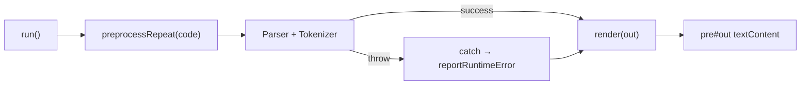

# Afișare erori cu locație — recomandare și plan

## Starea actuală

- Editor: **CodeMirror 5** în [`v0_3_2/ui/app.js`](v0_3_2/ui/app.js) — doar numere de linie (`#555`), **fără** markere de eroare.
- Output: `<pre id="out">` + `render(lines)` cu `textContent` — text plain, fără culori.
- Locațiile sunt în mesaj (`35:5`, `at : 35:5`) dar **nu** sunt folosite vizual.
- Singurul precedent pentru caret: [`formatAsmError`](v0_3_2/core/asm-assembler.js) (ASM), cu `^^^` fix (3 caractere).



## Recomandarea mea (sinteză)

| Zonă | Recomandare | De ce |
|------|-------------|-------|
| **Output** | Mesaj `Error:` roșu + linie sursă + rând caret `^`×N | Aliniere perfectă în monospace; pattern deja validat la ASM |
| **Output container** | Înlocuire `<pre>` → `<div class="output-panel">` cu rânduri `<div class="output-line">` | Permite HTML/stiluri ulterior, păstrează `white-space: pre` per rând |
| **Editor** | Număr linie roșu în gutter + underline roșu pe token | Standard IDE, mai clar decât `^` în editor editabil |
| **Token lipsă / spațiu** | Coloană 1-char evidențiată (roz) + opțional tokenul anterior în roz deschis | `^` singur sub spațiu e corect în Output; în editor un underline pe „nimic” nu se vede |

**Nu** schimbăm textul mesajelor de eroare existente — doar adăugăm context vizual dedesubt.

---

## Partea 1 — Utilitar comun de formatare

Fișier nou: [`v0_3_2/core/error-format.js`](v0_3_2/core/error-format.js)

### 1.1 Extragere locație din mesaj (regex, fără refactor masiv parser)

```javascript
// Ultima apariție line:col (evită false positive din "00:0" din data {})
const LOC_RE = /(?:at\s+)?(?:\S*:\s*)?(\d+):(\d+)/g;
```

Funcții exportate:
- `parseErrorLocation(message)` → `{ line, col } | null`
- `inferSpanLength(message, lineText, col)` → număr de `^`
  - `got ID=foo` / `got SYM==` → lungimea valorii după `=`
  - `'token'` între ghilimele în mesaj → `token.length`
  - pe linia sursă la `col` (1-based): token `\S+` sau `1` dacă e spațiu/EOL
- `buildCaretLine(col, spanLen)` → `' '.repeat(col-1) + '^'.repeat(spanLen)`
- `formatErrorSnippet(source, line, col, spanLen)` → `{ sourceLine, caretLine }`

Refactor minor: [`formatAsmError`](v0_3_2/core/asm-assembler.js) să apeleze `buildCaretLine(col, 3)` sau `inferSpanLength` — un singur algoritm.

### 1.2 Sursa pentru linia afișată

În `run()` se folosește deja:

```212:214:v0_3_2/ui/app.js
  const processedCode = preprocessRepeat(code.value);
  const _registry = ...
  const p = new Parser(new Tokenizer(processedCode), _registry);
```

**Snippet-ul din Output trebuie luat din `processedCode`**, nu din editor — altfel caret-ul nu se aliniază.

**Limitare de documentat:** dacă `repeat` expandează blocuri, numărul liniei din eroare poate să nu coincidă cu editorul; snippet-ul rămâne corect pentru codul efectiv parsat.

---

## Partea 2 — Output panel (cerința ta)

### 2.1 HTML/CSS — [`script_editor_v0_3_2.html`](v0_3_2/script_editor_v0_3_2.html)

Înlocuire:
```html
<pre id="out"></pre>
```
cu:
```html
<div id="out" class="output-panel"></div>
```

CSS nou (păstrează aspectul actual):
```css
.output-panel {
  background: #000;
  padding: 10px;
  max-height: 260px;
  overflow: auto;
  font-family: monospace;
  font-size: inherit;
}
.output-line { white-space: pre; min-height: 1em; }
.output-line--error { color: #f55; }
.output-line--source { color: #ccc; }
.output-line--caret { color: #f55; }
```

### 2.2 Refactor `render()` — [`v0_3_2/ui/app.js`](v0_3_2/ui/app.js)

- `render(lines)` construiește DOM: fiecare string → `<div class="output-line">` (escape HTML).
- `renderError(err, processedSource)` (nou):
  1. Prima linie: `Error: ` + mesaj (clasă `--error`) — **text neschimbat**
  2. Dacă `parseErrorLocation` reușește: două rânduri `--source` + `--caret`
  3. Dacă mesajul ASM conține deja `\n` + caret (legacy), normalizăm la același format DOM

Apeluri de actualizat:
- `catch` din `run()` / `sendCmd()` — pasează `processedCode` (salvat în variabilă în scope-ul `try`)
- `reportRuntimeError` — callback `onRuntimeError(err, out, meta)` sau apel `highlightEditorError` din `app.js` (UI rămâne în app, nu în core)

### 2.3 Exemplu vizual țintă

```
Error: Syntax error at : 35:5, expected ..., got ID=222     ← roșu
5wire e = AND(OR(1,  222 ))                                 ← gri
                                   ^^^                       ← roșu
```

Pentru spațiu/lipsă token (ex. virgulă lipsă la col 18):
```
Error: ... at 35:18 ...
5wire e = AND(OR(1, 222))
                 ^
```
(un singur `^` când `spanLen === 1` la poziție fără token)

---

## Partea 3 — Editor CodeMirror

Fișier nou sau secțiune în [`v0_3_2/ui/app.js`](v0_3_2/ui/app.js): `error-markers.js` (logică mică).

### 3.1 La eroare (după `run` catch / `onRuntimeError`)

```javascript
function highlightEditorError(line, col, spanLen, lineText, isMissing) {
  clearErrorMarkers();
  const l = line - 1, ch = col - 1;
  cmEditor.addLineClass(l, 'gutter', 'cm-error-linenumber');
  if (isMissing) {
    // coloană 1-char (chiar spațiu)
    cmEditor.markText({line:l, ch}, {line:l, ch:ch+1}, {className: 'cm-error-missing-col'});
    // token anterior pentru context
    const prev = findPrevTokenRange(lineText, col);
    if (prev) cmEditor.markText(prev.from, prev.to, {className: 'cm-error-context-token'});
  } else {
    cmEditor.markText({line:l, ch}, {line:l, ch:ch+spanLen}, {className: 'cm-error-token'});
  }
  cmEditor.scrollIntoView({line:l, ch}, 100);
}
```

`isMissing` heuristici: mesaj conține `expected` + (`got EOF` / lipsește `got TYPE=`), sau la `col` nu există token `\S+`.

### 3.2 CSS editor — [`script_editor_v0_3_2.html`](v0_3_2/script_editor_v0_3_2.html)

```css
.CodeMirror .cm-error-linenumber { color: #f55 !important; font-weight: bold; }
.CodeMirror .cm-error-token {
  background: rgba(255, 60, 60, 0.25);
  border-bottom: 2px solid #f55;
}
.CodeMirror .cm-error-missing-col {
  background: rgba(255, 120, 150, 0.45);
  outline: 1px solid #f88;
}
.CodeMirror .cm-error-context-token {
  background: rgba(255, 160, 180, 0.2);
}
```

### 3.3 Curățare markere — de ce e separat de golirea Output-ului

`run()` golește doar **panoul Output** (`#out`). Markerele din **editor** (CodeMirror `markText`, `addLineClass` pe gutter) sunt un strat UI complet diferit — nu sunt copii ale textului din Output și **nu se șterg** când golim `#out`.

| Acțiune | Ce curăță |
|---------|-----------|
| `out.textContent = ''` / `render([])` | Textul din panoul de jos |
| `clearErrorMarkers()` | Underline roșu, număr linie roșu, markText în CodeMirror |

**De ce la începutul `run()`:** scenariul „Run cu eroare → corectez codul → Run cu succes”. Fără `clearErrorMarkers()`, highlight-ul roșu din editor rămâne vizibil chiar dacă Output-ul arată doar rezultatul OK.

**De ce la `cmEditor.on('change')`:** utilizatorul editează după eroare — markerele vechi devin înșelătoare înainte de următorul Run.

**Notă:** `highlightEditorError` apelează deja `clearErrorMarkers()` înainte de markere noi; apelul de la începutul `run()` e pentru cazul **fără** eroare nouă (run reușit) și pentru a curăța markerele **înainte** de execuție.

### 3.4 Notă despre mapare editor ↔ processedCode

Highlight în editor folosește **aceeași linie:col** (best-effort). Funcționează corect când `preprocessRepeat` nu schimbă numărul de linii (cazul obișnuit fără `repeat` masiv). Pentru scripturi cu `repeat`, snippet-ul din Output e sursa de adevăr; editorul poate evidenția linia greșită — acceptabil ca fază 1, mapare inversă = fază viitoare.

---

## Partea 4 — Îmbunătățire opțională (fază 2, nu obligatorie acum)

Pentru span și `isMissing` mai precise, fără a schimba mesajele:

- La throw în parser/tokenizer, atașare opțională pe `Error`:
  ```javascript
  const e = new Error(`Syntax error at ...`);
  e.scriptLoc = { line: this.c.line, col: this.c.col, len: this.c.value?.length ?? 0 };
  throw e;
  ```
- `renderError` preferă `err.scriptLoc` față de regex.

Modificări punctuale în [`parser.js`](v0_3_2/core/parser.js) / [`tokenizer.js`](v0_3_2/core/tokenizer.js) — doar în `eat()` și locurile frecvente, nu toate sutele de throw-uri dintr-o dată.

---

## Fișiere atinse (rezumat)

| Fișier | Schimbare |
|--------|-----------|
| [`v0_3_2/core/error-format.js`](v0_3_2/core/error-format.js) | **nou** — parse locație, caret, snippet |
| [`v0_3_2/core/asm-assembler.js`](v0_3_2/core/asm-assembler.js) | refactor `formatAsmError` → utilitar comun |
| [`v0_3_2/ui/app.js`](v0_3_2/ui/app.js) | `render` DOM, `renderError`, `highlightEditorError`, wire în `run` |
| [`v0_3_2/script_editor_v0_3_2.html`](v0_3_2/script_editor_v0_3_2.html) | `<div#out>`, CSS output + editor errors |
| [`v0_3_2/core/interpreter.js`](v0_3_2/core/interpreter.js) | minimal: callback extins (opțional) |

---

## Testare

- Eroare sintaxă cu token invalid (`222`) → 3 caret-uri, underline 3 chars în editor
- Eroare la spațiu / token lipsă → 1 caret, coloană roz în editor
- Eroare runtime cu `at 12:3` (wire duplicate) → snippet + gutter
- Eroare ASM existentă → același aspect, caret dinamic dacă refactorizăm `formatAsmError`
- Run reușit → markere editor șterse, output normal fără stil error
- [`test_suite.js`](v0_3_2/test_suite.js): assert pe `out.find(l => l.startsWith('Error:'))` — adaptare dacă Output nu mai e textContent direct (citire `.textContent` pe `#out` sau helper `getOutputText()`)

---

## Ordine implementare recomandată

1. `error-format.js` + teste unitare mici pe parse/caret
2. Output panel (`div` + `renderError`) — valoare imediată
3. Editor markers + CSS
4. (Opțional) `err.scriptLoc` în parser pentru cazuri ambigue
