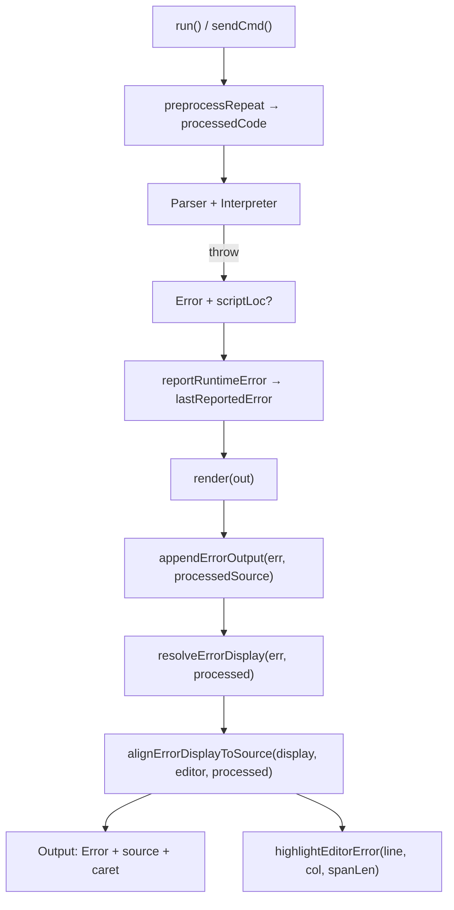

# Afișare erori cu locație — plan (implementat)

## Scop

Îmbunătățirea feedback-ului la erori în editorul v0_3_2:

- **Output:** `Error: …` (roșu) + linia sursă + rând caret `^`×N (monospace)
- **Editor:** număr linie roșu în gutter + underline pe token (sau coloană roz la token lipsă)
- **Mesajele de eroare** rămân neschimbate (engleză, text existent)
- **Teste:** grup `error-display` (1388–1395), validare fără DOM

---

## Starea inițială (înainte)

| Zonă | Problemă |
|------|----------|
| Output | `<pre id="out">` plain text, fără culori |
| Editor | CodeMirror fără markere de eroare |
| Locație | `line:col` doar în mesaj, nefolosit vizual |
| ASM | Singur precedent: `formatAsmError` cu `^^^` fix |

---

## Arhitectură (implementată)



### Sursa de adevăr pentru snippet

- **Output caret:** din `processedCode` (codul efectiv parsat)
- **Editor highlight:** aceeași `line:col` după `alignErrorDisplayToSource` (mapare editor ↔ processed când diferă, ex. linie goală la început)

---

## Fișiere

| Fișier | Rol |
|--------|-----|
| [`v0_3_2/core/error-format.js`](v0_3_2/core/error-format.js) | Utilitar central: locație, span, caret, `resolveErrorDisplay`, `alignErrorDisplayToSource`, `scriptError` |
| [`v0_3_2/core/asm-assembler.js`](v0_3_2/core/asm-assembler.js) | `formatAsmError` → `buildCaretLine` / utilitar comun |
| [`v0_3_2/core/parser.js`](v0_3_2/core/parser.js) | `tokenStartCol()`; `var()` salvează `stmtLine`/`stmtCol` la începutul statement-ului; declarații cu `line`/`col` |
| [`v0_3_2/core/interpreter.js`](v0_3_2/core/interpreter.js) | `_throwRuntime` / `reportRuntimeError` + `scriptLoc`; `lastReportedError` pentru re-render |
| [`v0_3_2/ui/app.js`](v0_3_2/ui/app.js) | `appendErrorOutput`, `finalizeErrorDisplay`, `highlightEditorError`, `clearErrorMarkers`, `getEditorSource`, wire în `run`/`sendCmd`/`onRuntimeError` |
| [`v0_3_2/ui/script_editor_v0_3_2.html`](v0_3_2/ui/script_editor_v0_3_2.html) | `<div id="out" class="output-panel">`, CSS output + editor errors, script `error-format.js` |
| [`v0_3_2/test_suite.js`](v0_3_2/test_suite.js) | `buildErrorPresentation`, `assertErrorDisplay`, teste 1388–1395 |

---

## `error-format.js` — API principal

### Locație

- `parseErrorLocation(message)` — ultima apariție `line:col` din mesaj (regex)
- `err.scriptLoc` — preferat față de regex când există (`{ line, col, len? }`)
- `scriptError(message, line, col, len)` — factory pentru erori cu locație

### Span și caret

- `inferSpanLength(message, lineText, col)` — din mesaj (`got ID=…`, token între `'…'`) sau token de pe linie
- `buildCaretLine(col, spanLen)` — spații + `^`×N
- `snapCaretToToken(message, sourceLine, reportedCol, spanLen)` — tokenizer col adesea **end-exclusive**; detectează start / mijloc / end of token
- `findTokenSpanOnLine(lineText, tokenText, reportedCol)` — candidați pe linie, alege după proximitate față de col raportat

### Cazuri speciale

| Caz | Tratament |
|-----|-----------|
| Bit mismatch (`Expected N bits, got M`) | `findWireAssignNearLine` + `findAssignRhsSpan` pe RHS; **ignoră** `scriptLoc.len` când egal cu `got` bit count (era confuzie 12 biți vs span caret) |
| Token din mesaj (`'aaaaasd'`, `Undefined foo`) | `parseErrorAnchor` + `findSymbolInSource` |
| ASM embedded `\n` + caret | `splitEmbeddedErrorMessage` — normalizează la același format DOM |
| Editor ≠ processed (linie goală leading) | `alignErrorDisplayToSource` — `lineNumberForText` după conținut linie |
| Token lipsă / spațiu | `isMissingTokenError` → coloană 1-char roz + token anterior context |

### Export

`resolveErrorDisplay(err, processedSource, context?)` → `{ message, loc, sourceLine, caretLine, spanLen, isMissing }`

---

## UI — Output panel

### HTML/CSS

```html
<div id="out" class="output-panel"></div>
```

```css
.output-line--error  { color: #f55; }
.output-line--source { color: #ccc; }
.output-line--caret  { color: #f55; }
```

### `appendErrorOutput(err, processedSource)`

1. `resolveErrorDisplay(err, processed)`
2. `finalizeErrorDisplay` → aliniere la `getEditorSource()`
3. Trei rânduri DOM: mesaj, sursă, caret
4. `applyErrorEditorHighlight(display)`

### `render(out)` + `lastReportedError`

După `showVars()` / re-render output, eroarea nu se pierde: dacă `globalInterp.lastReportedError` există, se reapelează `appendErrorOutput` cu sursa procesată.

---

## UI — Editor CodeMirror

### `highlightEditorError(line, col, spanLen, lineText, isMissing)`

- Gutter: `cm-error-linenumber` (roșu, bold)
- Token valid: `cm-error-token` (underline + fundal roșu translucid)
- Lipsă: `cm-error-missing-col` + opțional `cm-error-context-token` pe tokenul anterior

### Curățare markere

| Moment | Motiv |
|--------|-------|
| Început `run()` | Run reușit după eroare — fără highlight vechi |
| `cmEditor.on('change')` | Editare după eroare — markere înșelătoare |
| Înainte de markere noi | `clearErrorMarkers()` în `highlightEditorError` |

`clearErrorMarkers()` este separat de golirea `#out` — straturi UI diferite.

---

## Parser / interpreter — `scriptLoc`

### Parser (`var()` și declarații)

- La începutul statement-ului: `stmtLine = this.c.line`, `stmtCol = tokenStartCol(this.c)`
- Erorile de assign folosesc poziția statement-ului, nu poziția după expresie (fix: eroare pe linia următoare)

### Interpreter

- `_throwRuntime(msg, scriptLoc?)` atașează `err.scriptLoc`
- `reportRuntimeError` salvează în `lastReportedError`

---

## Exemplu vizual țintă

```
Error: Expected 8 bits, got 12 bits.
8wire value = 11111100 + ^F
              ^^^^^^^^^^^^^
```

Editor: linia wire, underline pe `11111100 + ^F`, gutter roșu.

Parse invalid token:

```
Error: Invalid statement starting with 'aaaaasd' (ID) at : 1:8
aaaaasd
^^^^^^^
```

---

## Teste — grup `error-display` (1388–1395)

**Convenție:** titluri test, etichete `h.assert` și mesaje așteptate — **doar engleză**.

### Helperi (`test_suite.js`)

```javascript
buildErrorPresentation(err, runSource, editorSource)
// → { display, editor: { line, col, spanLen }, outputLines }

assertErrorDisplay(h, session, {
  name: 'wave propagation',   // prefix: "wave propagation: message"
  source: '...',
  editorSource: '...',          // optional — align test
  action: 'run' | 'parse',
  expect: { message, line, col, spanLen, sourceLine, caretLine, scriptLocLine?, outputLines? }
})
```

### Teste

| ID | Titlu | Ce verifică |
|----|-------|-------------|
| 1388 | bit mismatch - wire + hex RHS (wave) | mesaj, caret RHS 13 chars, wave propagation |
| 1389 | bit mismatch - wire + hex RHS (legacy) | idem, legacy propagation |
| 1390 | invalid statement - token caret snap | `aaaaasd` — caret sub token, nu la EOL |
| 1391 | strict assign - short literal | `3wire q = 1` |
| 1392 | strict assign - binary literal too long | `4wire q = 11111` |
| 1393 | editor align - leading blank line | editor cu `\n` înainte — linia editor corectă |
| 1394 | multiline script - bit mismatch on wire line | script CLCD + wire — linia 8 |
| 1395 | scriptError - hook and output bundle | `scriptError()` direct, hook line/col, 3 output lines |

Rulare: `node _run_suite_node.js` — **838/838** pass.

Manifest: `node _gen_manifest.js` → grup `error-display`, range `1388–1395`.

---

## Limitări cunoscute

1. **`repeat` masiv** — numărul liniei din editor poate să nu coincidă cu processed; snippet Output rămâne corect pentru codul parsat.
2. **`scriptLoc.len`** — uneori bit count, nu span caret; ignorat la bit-mismatch când `len === got`.
3. **Duplicare logică** — `buildErrorPresentation` în teste mirror-uiește fluxul din `app.js` (opțional: extract modul comun).
4. **Fază viitoare** — `scriptLoc` pe mai multe throw-uri parser/tokenizer pentru acuratețe maximă.

---

## Verificare manuală

- [ ] Eroare sintaxă token invalid → caret sub token, underline în editor
- [ ] Eroare la spațiu / virgulă lipsă → 1 caret, coloană roz
- [ ] `8wire value = 11111100 + ^F` → linia corectă, caret pe RHS
- [ ] Run reușit după eroare → markere șterse
- [ ] `showVars()` după eroare runtime → output păstrează snippet + caret
- [ ] Eroare ASM → același format DOM (caret din `formatAsmError`)

---

## Ordine implementare (istoric)

1. `error-format.js` + refactor ASM
2. Output panel DOM + `appendErrorOutput`
3. Editor markers + CSS
4. `scriptLoc` parser/interpreter + fix caret alignment
5. `lastReportedError` + `alignErrorDisplayToSource`
6. Grup test `error-display` + manifest + engleză titluri/etichete
