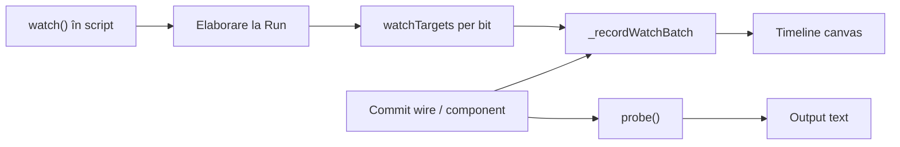

# Evaluare `watch()` / Timeline și recomandări

## Verdict scurt

**Da — e un tool bun** pentru scopul lui: debug vizual în [script_editor_v0_3_2.html](v0_3_2/script_editor_v0_3_2.html), complementar `probe()` din [debug.md](v0_3_2/doc/debug.md).

Pentru fluxul tipic (oscilator + switch, CPU pe `NEXT`, comparare biți pe același pas) acoperă ce lipsea: relații temporale între semnale, nu doar linii text în Output.

**Ce îl face solid acum:**
- Aceeași sintaxă ca `probe()` — curbă de învățare mică
- Expansiune corectă pe biți (`watch(o)` → `o.0`…`o.3`, `watch(.o:counter)`)
- Distincție wire vs proprietate componentă (cazul osc + AND)
- Rânduri sincronizate + dedupe canale
- Hook-uri pe aceleași commit-uri ca `probe` (inclusiv `osc` în mod wave)
- Teste dedicate **1176–1187** în [test_suite.js](v0_3_2/test_suite.js)

**Pentru moment nu e nevoie de funcționalități noi** dacă obiectivul e „logic analyzer în editor pentru cursuri / debug”. Mai jos sunt recomandări **opționale**, ordonate după valoare.

---

## 1. Motive per eveniment — ce ar putea afișa

Astăzi `_recordWatchBatch` din [interpreter.js](v0_3_2/core/interpreter.js) trimite doar `seq`, `cycle`, `state`, `valueStr` — **fără `reason`**, deși infrastructura probe deja calculează motive în `_emitProbeTarget`.

### A. Reutilizare directă din `probe` (recomandat primul pas)

Aceleași trei motive documentate pentru `probe`:

| Motiv | Când | Util pe Timeline |
|-------|------|------------------|
| **`initialised`** | Prima eșantionare pentru canal | Marchează baseline după Run; separă „stare inițială” de tranziții reale |
| **`changed`** | Valoare nouă după ce canalul a fost văzut | Majoritatea evenimentelor (switch, assignment, osc tick, settle wave) |
| **`edge committed`** | `REG(data, clk, clr)` la frontiera descendentă a `clk`, sau bloc `on: raise/edge/...` | Esențial la debug latch — vezi *de ce* `q` s-a schimbat doar la release pe key |

**Unde le afișați (UX):**
- **La nivel de rând** (un motiv per batch): suficient dacă toate canalele din rând provin din același commit (de obicei da)
- **Tooltip / bandă la click** pe rând: `#seq`, `cycle`, motiv, opțional lista `label = value`
- **Culoare subtilă** pe marginea rândului: verde = `initialised`, alb = `changed`, violet = `edge committed` (aliniat cu highlight-ul de edge existent)

Implementare minimă: propagare `reason` din `_emitProbeTarget` / `_recordWatchBatch` (același `target.seen` + `probeReasonContext` deja folosit la probe).

### B. Motive suplimentare utile doar pentru Timeline (opțional, fază 2)

Probe nu le are explicit; ar ajuta la interpretarea trace-ului vizual:

| Motiv propus | Când | De ce merită |
|--------------|------|--------------|
| **`seed`** | Primul rând după `seedWatchTimeline()` post-Run | Diferențiază „snapshot după elaborare” de evenimente runtime; explică de ce apare un rând imediat după Run |
| **`next`** | După `NEXT(~)` / buton **Next** | Corelează tranziții cu pasul de simulare (CPU, REG pe `~`) |
| **`osc tick`** | Timer real `osc` / `~` | Separă timp real de pași `NEXT`; util când `watch(.o:counter)` rulează continuu |
| **`ui`** | Toggle switch / key / DIP din Devices | Știi că nu a venit din script ci din panou |
| **`settle`** | Final batch propagare Wave | Explică al doilea rând la Run (test **815**: `initialised` apoi `changed` la settle) — probe deja arată asta în text; pe Timeline ar fi mai clar cu etichetă |

**Ce aș evita** la început: motive prea granulare (`assignment`, `property block`, `chip exec`) — zgomot fără beneficiu clar față de `changed` + tooltip cu `cycle`.

### C. Ce *nu* e critic

- Motiv **per canal** diferit în același rând (rar; un singur motiv per batch e OK)
- Simboluri LUT ca la probe (`_probeSymbolicSuffix`) — mai util în Output decât pe bare HIGH/LOW

---

## 2. Alte recomandări (prioritate)

### Prioritate medie — UX fără schimbări de limbaj

1. **Inspect la click pe rând** — `valueStr` e deja în [timeline-analyzer.js](v0_3_2/ui/timeline-analyzer.js) dar nu se desenează; la hover/click: `seq`, `cycle`, motiv, valori per coloană
2. **Zoom** când sunt multe canale (ex. 12+ coloane) — `columnWidth` devine foarte îngust; slider înălțime rând sau scroll orizontal
3. **Indicator trunchiere** — la `MAX_HISTORY = 1500` un mic „…older events dropped”
4. **Corectare doc minoră** — [editorUI.md](v0_3_2/doc/editorUI.md) spune că Timeline „se deschide automat”; în practică panelul e vizibil by default în HTML, nu e legat de prezența `watch()` în script

### Prioritate joasă — paritate / polish

5. **`watch(.sw)` pe DIP 4-bit** — un canal colapsat vs `watch(4wire)` expandat pe biți; fie documentezi intenția, fie expandezi `.comp:get` la biți ca la wire-uri
6. **Slice pe componentă** — `probe(.dip.0)` încă lipsește; la fel pentru `watch` ([debug.md](v0_3_2/doc/debug.md) ~186)
7. **Export CSV/JSON** — pentru teme / rapoarte; `probe` rămâne mai simplu pentru copy-paste text
8. **Axă timp real (ms)** — doar pentru `osc`; axa actuală (ordine evenimente + `cycle`) e corectă pentru logică digitală discretă
9. **Teste UI** — acum doar `watchRecorder` mock; un test headless pe `ingest` + dimensiuni rând ar prinde regresii de randare

### Ce nu aș face acum

- Layout orizontal Saleae-style (vertical e OK, inclusiv pe mobil — vezi prototipul [logic_analyze_time4.html](v0_3_2/logic_analyze_time4.html))
- `watch` în `run_tests.html` (fără DOM)
- Trigger condiționat / comparare Wave vs Legacy side-by-side — complex, cazuri de nișă

---

## 3. Concluzie practică

| Întrebare | Răspuns |
|-----------|---------|
| E tool bun? | **Da** — umple un gol real față de `probe`, bine integrat, testat |
| Mai e nevoie de ceva obligatoriu? | **Nu** pentru utilizare curentă |
| Primul upgrade util dacă revii la el | **Motive probe** (`initialised` / `changed` / `edge committed`) + **click-to-inspect** pe rând |
| Al doilea | `seed` / `next` / `osc tick` + zoom la multe canale |

Flux recomandat pentru utilizator astăzi: `watch()` pentru relații vizuale, `probe()` când vrei log textual cu motiv și ref (`# a = 1 (&2) - changed`).
