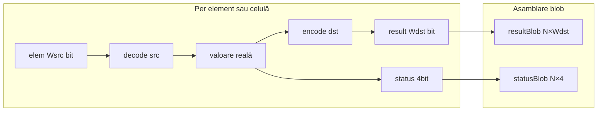

# Faza 5 — NFORMAT `; vector` / `; matrix`

Plan părinte: [`numeric_format_display_literals_nformat.plan.md`](numeric_format_display_literals_nformat.plan.md).  
NFORMAT scalar (Faza 4): [`builtin-NFORMAT.md`](../v0_3_2/doc/builtin-NFORMAT.md).

---

## Decizii confirmate (design lock)

| Subiect | Decizie |
|---------|---------|
| **Domeniu conversii** | Orice pereche `src` / `to_dst` permisă la scalar (inclusiv lățimi diferite, ex. `q4p4` → `fp16`) |
| **Siguranță** | Nu restricție same-width — **`4bit status` per element** marchează overflow/underflow/inexact/nan |
| **Tag-uri formă** | `; vector` și `; matrix` (mutual exclusive între ele) |
| **Formate** | Aceleași ca scalar: `signed`, `q4p4`, `q8p8`, `fp16`, `bf16` + `to_*` |
| **`to_signed`** | `Wdst` = lățimea elementului sursă (aceeași pentru toate elementele/celulele) |

---

## Semnături țintă

```
NFORMAT(Wsrc·wire[n] a ; <src> to_<dst> vector) -> Wdst·wire[n] result, 4wire[n] status
NFORMAT(Wsrc·wire[n,m] a ; <src> to_<dst> matrix) -> Wdst·wire[n,m] result, 4wire[n,m] status
```

| Destinație | `Wdst` |
|------------|--------|
| `to_q4p4` | 8 |
| `to_q8p8` / `to_fp16` / `to_bf16` | 16 |
| `to_signed` | lățimea elementului operand |

Forma tensorului (`n` sau `n,m`) se păstrează; utilizatorul declară ținta la `Wdst`.

---

## Mecanism (confirmat din cod)

- La atribuire se validează **doar totalul de biți** ([`enforceStrictWireDeclTotal`](../v0_3_2/core/interpreter.js)); lățimea de element a țintei e autoritativă. Output cu lățime diferită (ex. `16wire[n]` din `8wire[n]`) funcționează ca precedentul `LSHIFT ; vector`.
- `result` (`Wdst`) și `status` (4bit) se întorc ca **valori separate** prin [`_returnBuiltinVectorPair`](../v0_3_2/core/interpreter.js); fiecare țintă e validată independent.
- [`convertFormat(bits, width, src, dst)`](../v0_3_2/core/numeric-formats.js) e deja per-element — se reutilizează neschimbat.



---

## Modificări

### 1. [`numeric-formats.js`](../v0_3_2/core/numeric-formats.js)

Extinde `parseNformatCallTags` să accepte `vector` / `matrix` (mutual exclusive), returnând `{ src, dst, vector, matrix }`. `convertFormat` rămâne neschimbat.

### 2. [`vector-reduce.js`](../v0_3_2/core/vector-reduce.js)

Funcție nouă `nformatVectorTagged(args, getWire, fnName, src, dst, evalFns, convertFn)` după modelul `reverseVectorTagged` (`requireVectorTaggedUnaryOperand`): pentru fiecare index `i`, `convertFn(elemBits, W, src, dst)` → colectează `results` și `statuses`; return `{ resultBlob, statusBlob }`.

### 3. [`matrix-reduce.js`](../v0_3_2/core/matrix-reduce.js)

Funcție nouă `nformatMatrixTagged(...)` după modelul `reverseMatrixTagged` + `forEachMatrixCell`, colectând `resultBlob` și `statusBlob` per celulă (row-major). Prima operație matrix cu `statusBlob`.

### 4. [`interpreter.js`](../v0_3_2/core/interpreter.js)

În handler `BUILTIN: NFORMAT`:

- `nformatSpec.vector` → `VR.nformatVectorTagged(...)` → `_returnBuiltinVectorPair`
- `nformatSpec.matrix` → `MR.nformatMatrixTagged(...)` → `_returnBuiltinVectorPair`
- altfel calea scalară existentă

`BUILTIN_DOC.NFORMAT`: +2 semnături `; vector` și `; matrix`.

### 5. Teste [`test_suite.js`](../v0_3_2/tests/test_suite.js)

Grup `builtin-nformat`, id-uri după 2038:

| Test | Scenariu |
|------|----------|
| vector same-width | `q4p4 to_signed`, 8→8, status `0000` |
| vector width-change | `q4p4 to_fp16`, 8→16, `16wire[n] r` |
| vector inexact | `q8p8 to_bf16`, status bit2 pe element afectat |
| matrix | conversie + status per celulă |
| eroare | `; vector matrix` mutual exclusive |
| doc | BUILTIN_DOC count + linii vector/matrix |

### 6. Documentație

- [`builtin-NFORMAT.md`](../v0_3_2/doc/builtin-NFORMAT.md) — secțiuni `; vector` / `; matrix` + exemple `logts-play`
- [`arithmetic.md`](../v0_3_2/doc/arithmetic.md) — notă NFORMAT vector/matrix
- [`builtin-tagged-index.md`](../v0_3_2/doc/builtin-tagged-index.md) — NFORMAT: `vector`=yes, `matrix`=yes

### 7. Plan părinte

[`numeric_format_display_literals_nformat.plan.md`](numeric_format_display_literals_nformat.plan.md) — `p5-future` → completed după implementare.

---

## Exemple țintă

```logts-play
8wire[4] v = \7 \-1 \3 \0;q4p4
8wire[4] r, 4wire[4] st = NFORMAT(v; q4p4 to_signed vector)
show(r; signed)
show(st)
```

```logts-play
8wire[2] v = \7 \-1;q4p4
16wire[2] r, 4wire[2] st = NFORMAT(v; q4p4 to_fp16 vector)
show(r; fp16)
show(st)
```

```logts-play
8wire[2,2] m = \1 \2 \3 \4;q4p4
16wire[2,2] r, 4wire[2,2] st = NFORMAT(m; q4p4 to_fp16 matrix)
show(st)
```

---

## Verificare finală

```bash
cd v0_3_2
node node/_run_test_suite_node.js
node node/_gen_test_manifest.js
node node/_gen_doc_data.js
```

---

## Note

- Nu se adaugă NFORMAT în `BUILTIN_VECTOR_TAG_FUNCS` / `BUILTIN_MATRIX_TAG_FUNCS` — parsing propriu via `parseNformatCallTags`.
- Fără inferență de formă: forma vine din declarația țintei; se validează totalul de biți (ca la toate op-urile tagged).
- Same-width **nu** garantează conversie exactă (ex. `q8p8 to_bf16` poate fi `inexact`); statusul e sursa de adevăr.
