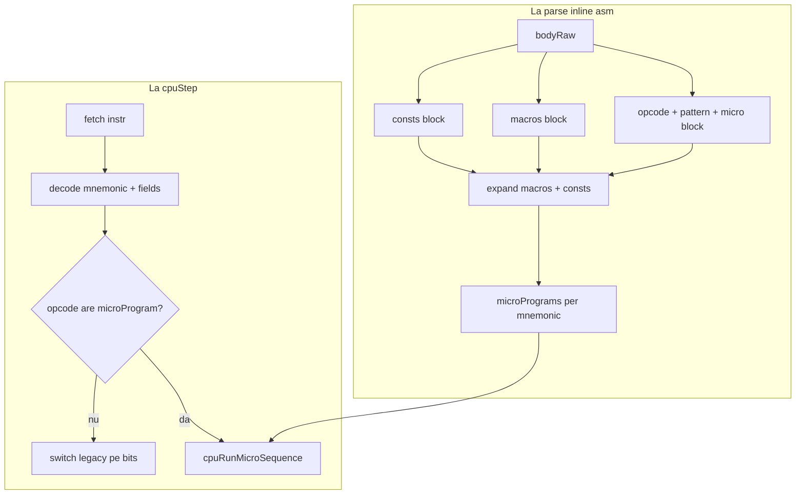

# Faza 7: Inline ASM — consts, macros, micro-instrucțiuni

Plan detaliat pentru extinderea `inline [asm]` și integrarea cu `comp [cpu]`. Relaționat: [comp_cpu.plan.md](comp_cpu.plan.md) (fazele 1–6).

## Decizii confirmate

| Decizie | Alegere |
|---------|---------|
| Granularitate `set` | Secvența micro **completă** per impuls (comportament actual: 1 LOAD = 1 `set`) |
| Compatibilitate | **Dual per opcode**: opcode fără `{ micro }` → switch legacy; opcode cu `{ micro }` → motor micro |
| Registre | `R0`..`Rn` în micro/consts; `R` / `A` = operanzi decodați din instrucțiune |
| PC advance | Runtime: `pcTouched`; **static la parse:** `pcEffect` per opcode în `doc(.cpuisa)` |
| Spațiu adrese | `consts` definesc harta (`ALUOUT = ^33`); transfer pe adrese, fără magie JS globală |

## Arhitectură



## 7a — Parser ISA extins

**Fișier principal:** [asm-assembler.js](../v0_3_2/core/asm-assembler.js)

Refactor `parseIsaBody()` pentru a scana corpul ISA în ordine:

1. **`consts:{ ... }`** (opțional) — `NAME = value` (literal binar sau `^adresă`)
2. **`macros:{ ... }`** (opțional) — `Name param1:{ body }`; tipuri `reg:reg` parsate, nevalidate în MVP
3. **Mnemonici** — pattern pe aceeași linie sau următoarea; bloc `{ micro }` opțional

**Rezultat `parseIsaBody`:**

```js
{
  opcodes: { LOAD: { segments, wordWidth, microRaw?, microProgram?, pcEffect? }, ... },
  consts: { PC: '^02', ADD: '000', ... },
  macros: { INC: { params: ['reg'], bodyRaw }, ... },
  wordWidth, opcodeOrder,
  hasAnyMicro: boolean
}
```

**`execInline`** în [interpreter.js](../v0_3_2/core/interpreter.js) — stochează `consts`, `macros`, metadata micro în `inlineInstances`.

## 7b — Expandare consts + macros (assemble-time)

Funcții noi în `asm-assembler.js`:

- `parseMicroBody(raw)` — `dst < src`, apeluri macro, `READ`/`WRITE`
- `substituteConsts`, `expandMacros` (limită adâncime, fără recursivitate)
- `buildMicroProgram` → micro-op AST
- **`pcEffect`** static per opcode: `autoInc` | `seq` | `halt`

Opcode-uri legacy: tabel fix (LOAD→`autoInc`, JMP→`seq`, HALT→`halt`).

## 7c — Motor micro (runtime)

**Fișier:** [cpu-devices.js](../v0_3_2/devices/cpu-devices.js)

### Model adrese din `consts`

```logts
consts:{
    PC      = ^02
    R0      = ^20
    MAR     = ^10
    MDR     = ^11
    ALUA    = ^30
    ALUB    = ^31
    ALUOP   = ^32
    ALUOUT  = ^33
    ADD     = 000
}
```

- **CPU contained:** register file la adrese + alias-uri (`R0`→`c.regs[0]`, `PC`→`c.pc`)
- **Board/MMDA viitor:** aceleași adrese pe fire reale
- **ALUOUT:** handler la adresa `^33` — citește ALUA/ALUB/ALUOP; ADD/SUB modulo `regDepth`

### Simboluri la execuție

| Simbol | Sursă |
|--------|-------|
| `R0`..`Rn` | registre arhitecturale |
| `R` | operand `R2b` din instrucțiune |
| `A` | operand `A2b` / `A4b` |
| nume `consts` | adresă `^xx` sau literal op |

### Micro-op-uri MVP

| Op | Semnificație |
|----|--------------|
| `dst < src` | transfer |
| `READ` | mem[MAR] → MDR (consts) |
| `WRITE` | MDR → mem[MAR] |

### PC: `pcTouched` + `pcEffect`

La final: dacă `!pcTouched` și `pcEffect === 'autoInc'` → `pc++`.

## 7d — Integrare CPU + mod dual per opcode

[cpu.js](../v0_3_2/core/components/cpu.js): `isaRef` → `addCpu()`.

```js
if (op && op.microProgram) {
  cpuStepMicro(c, ctx, mnemonic, op.microProgram, fields);
  return;
}
// switch legacy
```

**Extindere hibridă `.cpuisa`:**

```logts
inline [asm] .cpuisa:
consts:{ PC = ^02, R0 = ^20, MAR = ^10, MDR = ^11, ALUOUT = ^33, ... }
macros:{ INC reg:{ ... } }

  LOAD  : 0001 + R2b + A2b          # legacy
  STORE : 0010 + R2b + A2b          # legacy

  FOO:                              # opcode NOU — micro
  1011 + R2b
  {
    INC PC
    R < ALUOUT
  }
:
```

## 7e — Documentație și teste

- [asm-microcode.md](../v0_3_2/doc/asm-microcode.md) sau secțiune în [asm.md](../v0_3_2/doc/asm.md)
- Template `consts` în [cpu.md](../v0_3_2/doc/cpu.md)
- **`doc(.cpuisa)`** — toate consts + macros + opcodes cu `legacy|micro` și `pcEffect`
- Teste 2692–2698 în [test_suite.js](../v0_3_2/tests/test_suite.js)
- Exemple `logts-play` (opcode FOO micro pe `.cpuisa` hibrid)

## Sub-faze

| Sub-fază | Conținut |
|----------|----------|
| **7a** | Parser `consts`, `macros`, micro blocks |
| **7b** | Expandare, `pcEffect`, teste unitare parse |
| **7c** | Motor micro pe adrese, READ/WRITE/ALUOUT |
| **7d** | `isaRef`, dual per opcode, demo FOO |
| **7e** | Doc, `doc(.cpuisa)`, teste E2E |
| **7f** | (viitor) JMP/BEQ/IRQ pe micro |

## Limitări MVP (rezumat)

- 1 `set` = secvență micro completă (fără uPC vizibil; faza 8?)
- ALU: doar ADD/SUB
- IRQ/JMP/BEQ: rămân pe switch în MVP; micro pe opcode-uri **noi**
- Fără moștenire `consts` între ISA-uri
- Macro: fără recursivitate, condiții, variadic
- `reg:reg` parsat, nevalidat

Vezi secțiunea **FAQ limitări** din versiunea completă a planului (conversație / Cursor plan) pentru explicații detaliate.

## Explicit nu (faza 7)

- Rescrierea automată a tuturor opcode-urilor `.cpuisa_irq` pe micro
- Înlocuirea mini-cpu-v2 board
- Microcod editabil la runtime
- Multi-cycle vizibil per micro-op (faza 8)

## Ordine implementare

1. Parser `consts` / `macros` / micro blocks
2. Expandare + teste unitare + `pcEffect`
3. `cpuRunMicroSequence` + decode câmpuri
4. `isaRef` + dual per opcode
5. `.cpuisa` hibrid + `doc(.cpuisa)`
6. Doc + teste E2E
