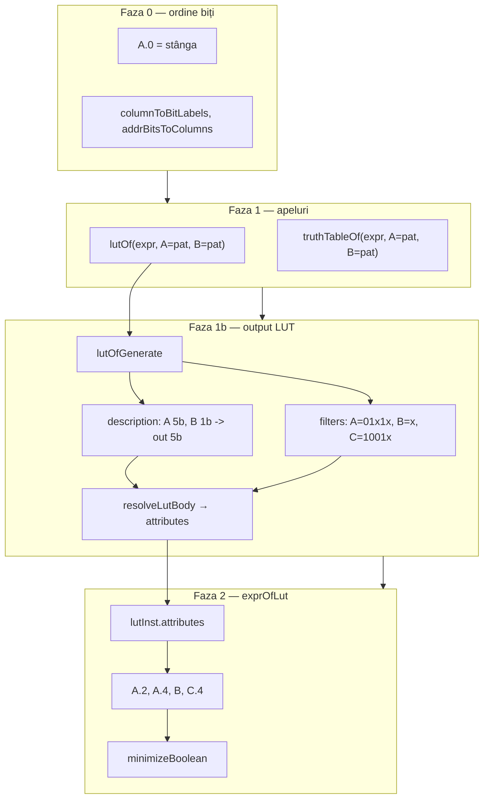

# Plan: Filtre cu virgulă + exprOfLut din atribute LUT

## Context

- Implementarea cu adrese full-width revertată; diff în [`v0_3_2/patches/`](v0_3_2/patches/).
- `lutOf` cu filtre: adrese secvențiale, `length` = număr rânduri.
- **Metadata filtre/header: atribute LUT `description:` / `filters:` — nu comentarii `#`.** Parserul LUT ignoră `#` (doar note umane); `exprOfLut` nu parsează niciodată comentarii.



---

## Faza 0 — Poziționare biți (convenția bitRange)

**Regulă:** index 0 în pattern = `A.0` (stânga), ca `substring` / `a.0-3` în limbaj.

| Pattern `A=01x1x` (5b) | Biți variabili |
|------------------------|----------------|
| index 2, 4 = x | `A.2`, `A.4` |

Cu `B=x`, `C=1001x` → **`A.2`, `A.4`, `B`, `C.4`** (4b → `length: 16`).

**Fix în [`boolean-lut.js`](v0_3_2/core/boolean-lut.js):**

- `columnToBitLabels`: `for (b = 0; b < w; b++)` / `for (b = start; b <= end; b++)`
- `addrBitsToColumns`: append biți (nu prepend) — `env[col][0]` = `.0`
- `expandExprOfLutVars`: aceeași ordine stânga→dreapta
- Doc: scoate „MSB first per variable” din [`boolean-lut.md`](v0_3_2/doc/boolean-lut.md)

---

## Faza 1 — Virgulă în apeluri `lutOf` / `truthTableOf`

```logts-play
lutOf(OR(AND(A, B), NOT(C)), A=01x1x, B=x, C=1001x)
truthTableOf(OR(AND(A, B), NOT(C)), A=01x1x, B=x, C=1001x)
```

**[`parser.js`](v0_3_2/core/parser.js):** `parseBooleanAnalysisFilters` cere `,` între asignări; `parseTruthPattern` oprește la `,` sau `)`.

---

## Faza 1b — Atribute `description:` / `filters:` (în loc de `#`)

### Output `lutOf` (cu filtre)

```text
inline [lut] .generated:
  description: A 5b, B 1b, C 5b -> out 5b
  filters: A=01x1x, B=x, C=1001x

  depth: 5
  length: 16
  data {
    0000 : …
    …
  }
:
```

**Fără filtre** (doar header coloane, pentru round-trip viitor):

```text
  description: A 1b, B 1b -> out 1b
```

(linia `filters:` omisă)

### Reguli

| Atribut | Conținut | Cine îl citește |
|---------|----------|-----------------|
| `description:` | Text header coloane + `-> out Nb` (ca fostul `# A 5b, …`) | `exprOfLut` (auto columns) |
| `filters:` | Asignări `Col=pattern` separate prin `,` | `exprOfLut` (biți variabili `x`) |
| `# …` | Note umane opționale | **ignorat** — niciodată citit de tooling |

### Modificări cod

**[`boolean-lut.js`](v0_3_2/core/boolean-lut.js)** — `lutOfGenerate`:

```javascript
inner.push(`description: ${columns.map(c => c.header).join(', ')} -> out ${outWidth}b`);
if (filters && filters.length > 0) {
  inner.push(`filters: ${filters.map(f => `${filterSpecKey(f)}=${f.pattern}`).join(', ')}`);
}
// șterge formatFilterComment / liniile #
```

**[`lut-labels.js`](v0_3_2/core/lut-labels.js)** — în bucla `key: val` din `resolveLutBody`:

```javascript
if (key === 'description' || key === 'filters') {
  attributes[key] = val;
  continue;
}
```

**[`parser.js`](v0_3_2/core/parser.js)** — `parseLutInlineBody` fallback: aceleași chei string.

**[`interpreter.js`](v0_3_2/core/interpreter.js):** `attributes` deja propagate în `inlineInstances` — fără schimbare structurală.

### Parsare valoare `filters:`

Funcție partajată `parseFiltersAttributeString(s)` în `boolean-lut.js`:

- Split pe `,` (cu trim)
- Fiecare segment `Col=pattern` → `{ name, bitRange?, pattern }`
- Reutilizează `parseLutDescriptionString` pentru `description:` (parse header coloane)

---

## Faza 2 — `exprOfLut` din atribute

```logts-play
5wire A
1wire B
5wire C
lutOf(OR(AND(A, B), NOT(C)), A=01x1x, B=x, C=1001x)
exprOfLut(.generated)
```

**Sursă date:** `lutInst.attributes.description` + `lutInst.attributes.filters` (nu `bodyRaw`, nu `#`).

`exprOfLutGenerate(lutInst, varSpecs, widthResolver)`:

```
dacă varSpecs.length > 0 → cale manuală (existentă)
altfel dacă attributes.filters:
  columns ← parseDescription(attributes.description)
  filterMap ← parseFiltersAttributeString(attributes.filters)
  labels ← varyingBitLabels(columns, filterMap)
  envs ← replayFilteredEnvs(columns, filterMap)
  verifică envs.length === lutInst.length
  QM pe labels + table
altfel → eroare: exprOfLut: supply variables or LUT with filters: attribute
```

Biți variabili (poziții `x`), ordine coloane din `description:`:

| Pattern | Variabili |
|---------|-----------|
| `A=01x1x` | `A.2`, `A.4` |
| `B=x` | `B` |
| `C=1001x` | `C.4` |

---

## Teste

| ID | Scop |
|----|------|
| **1138–1145** | virgule în apeluri; `1143` asertează `filters:` nu `#` |
| **1147** | respinge filtre fără virgulă în apel |
| **1148** | `lutOf` + `exprOfLut(.generated)` — 2 linii |
| **1149** | expresia conține `A.2`, `A.4`, `C.4` |
| **1150** | manual `A.2, A.4, B, C.4` = auto |
| **1151** | fără `filters:` + fără varSpecs → eroare |
| **1152** | varSpecs incompatibile → eroare |
| **1153** | LUT cu `# fake` în body — `exprOfLut` ignoră, folosește doar `filters:` |

---

## Ordine implementare

1. Faza 0 — ordine biți
2. Faza 1 — virgulă apeluri
3. Faza 1b — `description:` / `filters:` în output + parser attributes
4. Faza 2 — `exprOfLut` auto

## Fișiere

| Fișier | Faze |
|--------|------|
| [`boolean-lut.js`](v0_3_2/core/boolean-lut.js) | 0, 1b, 2 |
| [`parser.js`](v0_3_2/core/parser.js) | 1, 1b |
| [`lut-labels.js`](v0_3_2/core/lut-labels.js) | 1b |
| [`test_suite_ported.js`](v0_3_2/test_suite_ported.js) | toate |
| [`boolean-lut.md`](v0_3_2/doc/boolean-lut.md), [`boolean-analysis.md`](v0_3_2/doc/boolean-analysis.md) | toate |
