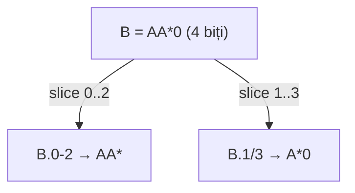

# Filtre wire compacte + erori cu locație

**Status:** ✅ implementat — regresie **968/968** verzi.

## Problema actuală

Pentru `lutOf(XOR(B.0, B.1), B=*A)` sau `lutOf(XOR(B.0-2, B.1/3), B=AA*0)`:

- [`discoverLutOfInputs`](v0_3_2/core/boolean-lut.js) creează coloane cu chei din `columnKey()` — ex. `B.0`, `B.1` sau `B.0-2`, `B.1/3`.
- Filtrul compact `B=…` produce cheia `B` (fără `bitRange`) în `filterSpecKey()`.
- [`validateAndBuildFilterMap`](v0_3_2/core/boolean-lut.js) face lookup exact → `lutOf: unknown filter column 'B'`.

**Eroare fără caret/highlight:** statement-urile boolean nu au `line`/`col` în AST; filtrele nu stochează poziții. [`reportRuntimeError`](v0_3_2/core/interpreter.js) nu poate atașa `scriptLoc`.

---

## Regula de mapare (toate tipurile `bitRange`)

Convenție existentă: **index pattern `i` = bit `.i`** (leftmost = `.0`), aceeași ordine ca în `columnKey` / `parseColumnRefString`.

Filtrul compact `Wire=pattern` are **`pattern.length` = lățimea wire declarată** (`widthResolver(Wire)`). Pentru fiecare coloană descoperită cu `atom.var === Wire`, subșirul pattern-ului este:

| Formă în expresie | Cheie coloană | Biți acoperiți | Subșir din `pattern` |
|-------------------|---------------|----------------|----------------------|
| `B` (wire întreg) | `B` | `0 … wireW-1` | întreg `pattern` |
| `B.i` | `B.i` | bit `i` | `pattern[i]` (lungime 1) |
| `B.start-end` | `B.start-end` | `start … end` | `pattern.slice(start, end + 1)` |
| `B.start/len` | `B.start/len` | `start … start+len-1` | `pattern.slice(start, start + len)` |

### Exemplu utilizator

```logts
4wire B
lutOf(XOR(B.0-2, B.1/3), B=AA*0)
```

Pattern pe wire (4 biți): `A A * 0` la pozițiile 0,1,2,3.

| Coloană | Lățime | Subșir filtru |
|---------|--------|---------------|
| `B.0-2` | 3b | `AA*` (poziții 0–2) |
| `B.1/3` | 3b | `A*0` (poziții 1–3) |

Echivalent explicit (nu obligatoriu de scris):

```logts
lutOf(XOR(B.0-2, B.1/3), B.0-2=AA*, B.1/3=A*0)
```

**Suprapuneri:** dacă două coloane din expresie acoperă același bit (ex. `B.0-2` și `B.1/3` pe biții 1,2), valorile provin din aceleași poziții ale pattern-ului părinte — sunt consistente by construction. Nu e nevoie de validare suplimentară de conflict între slice-uri suprapuse.

**Biți nefolosiți în expresie:** pozițiile din pattern pentru biții absenți din LUT sunt ignorate (ex. `4wire B`, doar `B.0` în expr, `B=AA*0` → doar `B.0=A`).



---

## 1. Expandare filtru părinte → coloane descoperite

**Fișier principal:** [`v0_3_2/core/boolean-lut.js`](v0_3_2/core/boolean-lut.js)

Extinde `validateAndBuildFilterMap(columns, filters, contextName, widthResolver)`.

### Algoritm (per filtru `f`)

1. **Match direct** — `colByKey.has(filterSpecKey(f))` → validare existentă (lungime pattern = `col.width`).
2. **Expandare wire** — `f.bitRange == null` și există coloane cu `column.atom.var === f.name`:
   - `wireW = widthResolver(f.name)`; lipsă → eroare cu `scriptLoc` pe numele filtrului.
   - `pattern.length === wireW`; altfel eroare pe span-ul pattern-ului.
   - Pentru **fiecare** coloană descoperită cu același `var`: `sub = patternSubstringForColumn(pattern, column.atom)`; validare caractere; `map.set(column.key, sub)`.
3. **Conflict** — expandare + filtru explicit pe aceeași cheie → `duplicate filter for '…'`.
4. **Nici direct, nici expandabil** — `unknown filter column 'B' (discovered: B.0-2, B.1/3)`.

### Helper `patternSubstringForColumn(parentPattern, atom)`

Reutilizează aceeași logică de span ca `columnWidth` / `parseColumnRefString`:

```javascript
function bitSpan(atom) {
  if (!atom.bitRange) return { start: 0, width: parentPattern.length };
  const br = atom.bitRange;
  const end = br.end ?? br.start;
  const width = br.isLength && br.len != null ? br.len : end - br.start + 1;
  return { start: br.start, width };
}
// return parentPattern.slice(start, start + width)
```

**Round-trip LUT:** `formatFiltersAttribute` păstrează forma sursă (`B=AA*0`). La `exprOfLut`, `parseFiltersAttributeString` + același expand cu `widthResolver`.

**Fără schimbări la** `enumerateFilteredEnvs`.

---

## 2. Locație erori (parser + boolean-lut)

### Parser — [`v0_3_2/core/parser.js`](v0_3_2/core/parser.js)

- `line`/`col` pe statement-uri `lutOf`, `truthTableOf`, `simplify`, `exprOfLut`.
- Pe fiecare filtru: `line`, `col`, `nameLen`, `patternLine`, `patternCol`, `patternLen`.

### boolean-lut — `throwFilterError(msg, f, { highlight: 'column' | 'pattern' })` → `err.scriptLoc`.

---

## 3. Teste noi (după 1525)

| ID | Grup | Scenariu |
|----|------|----------|
| 1526 | `bool-filt` | `2wire B`, `lutOf(XOR(B.0,B.1), B=*A)` → `length: 8` |
| 1527 | `bool-filt` | `truthTableOf` același script → 8 rânduri |
| 1528 | `bool-filt` | **`4wire B`, `lutOf(XOR(B.0-2, B.1/3), B=AA*0)`** — expandare multi-bit; verificare `length` sau echipollentă cu filtre explicite |
| 1529 | `bool-filt` | `lutOf` → `exprOfLut(.generated)` round-trip cu `B=AA*0` |
| 1530 | `bool-filt` | `4wire B`, doar `B.0` în expr, `B=AA*0` → expandare parțială (`B.0=A`) |
| 1531 | `bool-filt` | `B=*A` + `B.0=0` → duplicate filter |
| 1532 | `error-display` | coloană inexistentă / wire lipsă → caret pe numele filtrului |
| 1533 | `error-display` | `2wire B`, `B=*` (pattern prea scurt) → caret pe pattern |

Regenerare manifest + regresie completă.

---

## 4. Documentație

În [`boolean-lut.md`](v0_3_2/doc/boolean-lut.md) și [`boolean-analysis.md`](v0_3_2/doc/boolean-analysis.md):

- Sintaxa compactă `Wire=pattern` pentru **orice** coloană descoperită: `B`, `B.i`, `B.a-b`, `B.a/len`.
- Tabel mapare + exemplul `B=AA*0` cu `B.0-2` și `B.1/3`.
- Forma explicită per coloană rămâne validă.

---

## Fișiere atinse

| Fișier | Modificare |
|--------|------------|
| [`boolean-lut.js`](v0_3_2/core/boolean-lut.js) | `patternSubstringForColumn`, expandare, `throwFilterError` |
| [`boolean-analysis.js`](v0_3_2/core/boolean-analysis.js) | `widthResolver` la validare |
| [`parser.js`](v0_3_2/core/parser.js) | locații statement + filtre |
| [`test_suite.js`](v0_3_2/test_suite.js) | teste 1526–1533 |
| doc boolean-lut / boolean-analysis | sintaxă compactă multi-bit |
