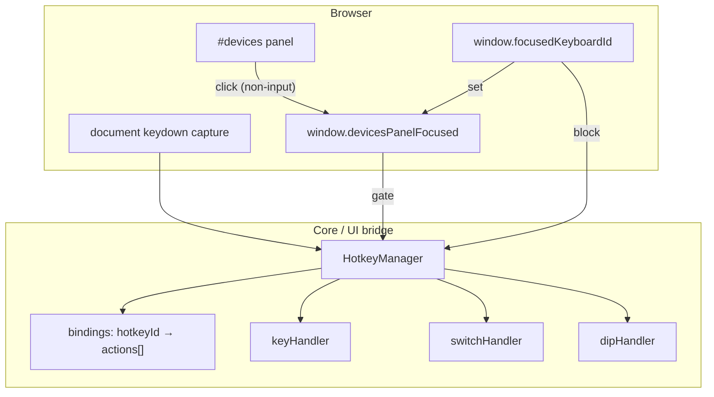
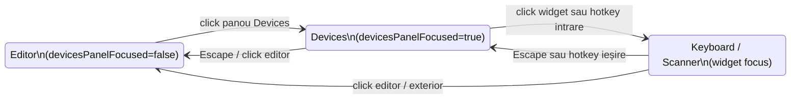

# Plan: hotkey pe componente input (`comp key` / `switch` / `dip`)

> **Continuare decizii:** [inline_logic2.plan.md](inline_logic2.plan.md) — ultima decizie **D1076✅** (F107); acest plan pornește de la **D1077**.  
> **Continuare faze:** plan 2 la **F107✅** → **F108✅** → următoarea **F109 (1+j)** CLCD touch hotkey.  
> **Teste:** F108 **4609–4638**; F109 draft alocare **4650+**.  
> **Pattern existent:** focus keyboard (`window.focusedKeyboardId`) — [comp_keyboard.plan.md](comp_keyboard.plan.md); `colorFor.N` pe dip — model pentru `hotkeyFor.N`.

---

## Legenda

| Marcaj | Semnificație |
| ------ | ------------ |
| **(recommended)** | Opțiunea recomandată de analiză |
| **(change)** | Alternativă validă; diferă de sketch user sau direcția implicită |
| **(ready-to-implement)** | Faza poate începe după confirmarea deciziilor ei |
| **(completed)** | Decizie luată / fază implementată |
| **1+a … 1+z** | Faze **amânate** — vezi [Backlog faze amânate](#backlog-faze-amânate-1a--1z) |
| ✅ | Backlog **promovat / livrat** |
| ❌ | Backlog **respins** definitiv |
| 🟠✗ | Backlog **închis** — alternativa nu se face |
| ⏳ | Backlog **deschis** — încă amânat |
| ⏸ | Backlog **pause** — idee, fără promovare fază |

**Notă:** itemii **3+x** rămân în [inline_logic2.plan.md](inline_logic2.plan.md). Acest plan folosește **1+x** pentru amânări proprii (convenție backlog post-MVP din plan 1).

---

## Reguli planului

1. **Continuitate decizii:** **D1–D1076** importate implicit din plan 1 + plan 2; breaking → decizie nouă **D1077+**.
2. **Numerotare faze:** **F108, F108a …** (extinde numerotarea plan 2).
3. **Numerotare decizii:** **D1077, D1078, …** — confirmare în scris de la user; până atunci **draft**.
4. **Backlog amânat:** ID **1+a, 1+b, …** — tabel master mai jos.
5. **Implementare:** pattern legacy + wave în `tests/test_suite.js`; doc EN în `v0_3_2/doc/`; `node _run_test_suite_node.js -q` + `_verify_doc_examples.js` la done.
6. **Fără întrebări în chat pentru draft:** opțiunile stau în tabel + detaliu sub tabel; user confirmă **A/B/C** în scris.
7. **Principiu dispatch:** hotkey apelează **aceleași callback-uri** ca click-ul din panoul Devices (nu logică paralelă).

---

## Stare la handoff (post-F107)

| Existent azi | Relevant F108 |
| ------------ | ------------- |
| `comp [key]` — `keyHandler: { onPress, onRelease }` pe `compInfo` | Hotkey reutilizează handler |
| `comp [switch]` — `onChange` doar în closure UI (`renderers.js`) | **Lipsă** handler pe `compInfo` — trebuie expus |
| `comp [dip]` — `onChange(index, checked)` doar în closure | **Lipsă** handler pe `compInfo` — trebuie expus |
| `comp [keyboard]` — `window.focusedKeyboardId`, taste doar când focusat | Gate: keyboard focus **dezactivează** hotkey-urile Devices |
| `colorFor.N` pe dip — parser array indexed | Model sintaxă **`hotkeyFor.N`** |
| **Nu există** manager hotkey / `hotkey:` attribute | **F108** — feature nou |
| **Nu există** focus explicit pe panoul Devices | **F108b** — `devicesPanelFocused` (draft) |
| Test helpers: `triggerKeyPress`, `triggerKeyboardKey` | Lipsă `triggerHotkey` — **F108e** |

**Teste:** ID max **4608**.

---

## Mapare decizii → faze

| Fază | Decizii | Status |
| ---- | ------- | ------ |
| **F108** Hotkey comps + focus stack (**1+a**) | **D1077–D1113✅** | **✅ completed** |
| **F108a–F108f, F108e** | — | **✅ completed** (teste 4609–4638, doc ui-focus-hotkeys.md) |
| **F109** CLCD touch hotkey (**1+j**) | **D1114–D1118✅** | **✅ completed** |
| **F108a** Parser `hotkey` + `hotkeyFor` | D1078, D1079, D1080, D1081, D1106 | ✅ |
| **F108b** HotkeyManager + focus Devices | D1083–D1087, D1100–D1101, D1105, D1092 | ✅ |
| **F108c** Handlers + bindings comp | D1088–D1091, D1096 | ✅ |
| **F108d** Browser `keydown` + sync panel | D1094, D1095 | ✅ |
| **F108f** Focus hotkey keyboard/scanner | D1103, D1104, D1107, D1108 | ✅ |
| **F108e** Teste + doc | D1097, D1098, D1099 | ✅ |

---

## Backlog faze amânate (1+a … 1+z)

Tabel master — itemi **amânați** pentru hotkey / input panel. **Stare:** ⏳ deschis · ✅ promovat/livrat · ⏸ pause.

| Stare | ID | Subiect | Detaliu | Fază draft | Legat de |
| ----- | -- | ------- | ------- | ---------- | -------- |
| ✅ | **1+a** | Hotkey MVP `key` / `switch` / `dip` | `hotkey:` + `hotkeyFor.N`; manager + focus Devices | **F108** | key.js, switch.js, dip.js |
| ⏸ | **1+b** | Badge vizual hotkey în panou | Hint lângă label (`[1]`) — UX, nu logică | — | renderers, panel-key |
| ⏸ | **1+c** | Modificatori (`Ctrl+1`, `Shift+A`) | Combos multi-key | — | D1080 extins |
| ⏸ | **1+i** | Numpad + `event.code` names | `"Numpad1"`, `"ArrowUp"`, … — distinct de `"1"` | — | D1080 |
| ⏸ | **1+d** | Hotkey pe alte input-uri | `slider`, `rotary`, `sensor` — **nu** keyboard/scanner (→ F108f) | — | interactive-components |
| ⏸ | **1+e** | `hotkeyFor` wire-backed | `hotkey: myKeyWire` dinamic (ca `colorFor` wire) | — | color_wire_refs |
| ⏸ | **1+f** | Repeat / key hold | Auto-repeat cât ține tasta | — | panel-key type 0 |
| ⏸ | **1+g** | Conflict la load | Eroare parse dacă același hotkey pe același switch dip | — | D1081 |
| ⏸ | **1+h** | *(slot liber)* | — | — | — |
| ⏳ | **1+j** | Hotkey pe **`comp [clcd]`** touch symbols | `hotkey` în symbol block + `touchType` 1/2/3 | **F109✅** | clcd.js, [clcd_touch.plan.md](clcd_touch.plan.md) |

**Ordine recomandată (actualizat 2026-08-28):** **F108✅** → **F109 (1+j)** → **1+b** / **1+c** / **1+d** la cerere.

---

## Faza 108 — Hotkey pe componente input **(1+a — draft)**

> **Extinde:** [key.md](../../v0_3_2/doc/key.md), [switch](../../v0_3_2/doc/), [dip.md](../../v0_3_2/doc/dip.md), [interactive-components.md](../../v0_3_2/doc/interactive-components.md).  
> **Status:** **(ready-to-implement)** — **D1077–D1113✅** user 2026-08-28.

### Analiză direcție (cerință user + codebase)

**Ce se dorește:**

```logts
comp [key] .btn:
  hotkey: "1"
  :

comp [switch] .en:
  hotkey: "2"
  :

comp [dip] .addr:
  length: 4
  hotkeyFor.0: "3"
  hotkeyFor.1: "4"
  :

comp [keyboard] .kbd:
  focuskey: "F2"
  :

comp [scanner] .scan:
  focuskey: "F3"
  :
```

| Cerință user | Interpretare analiză |
| ------------ | -------------------- |
| Același **`hotkey`** pe acțiune | **Permis** — ordine script; **`type: 1`** max unul (**D1113**) |
| **`focuskey`** keyboard/scanner | **Separat** de `hotkey`; **unic global** (**D1111**); **⊥ hotkey** (**D1112**) |
| Dispatch = evenimente existente la click | **Coerent** — trebuie apelat același `onPress`/`onRelease`/`onChange` ca UI-ul |
| Manager hotkey în spate | Registru central: `hotkeyId → [ { comp, action, meta } ]` |
| Focus Devices pentru hotkey | Panoul Devices „activ” — altfel taste merg în editor / alte widget-uri |
| Keyboard focusat → Devices nefocusat → hotkey comps off | Aliniat cu `window.focusedKeyboardId` existent |

**Potrivire cu codebase:**

| Componentă | Handler azi | Panel | Gaps |
| ---------- | ----------- | ----- | ---- |
| `key` | `compInfo.keyHandler` ✅ | `panel-key.js` `press()`/`release()` | Hotkey trebuie să respecte `type` 0/1/2 |
| `switch` | doar closure `onChange` ❌ | `renderers.js` checkbox `change` | Trebuie `switchHandler` pe `compInfo` |
| `dip` | doar closure `onChange(i,…)` ❌ | `renderers.js` per-bit checkbox | Trebuie `dipHandler` pe `compInfo` |
| `keyboard` | `keyboardHandler.onKey` | focus propriu | Blochează hotkey Devices când focusat |

**Lacune / posibile erori în cerință:**

| # | Observație | Impact | Propunere |
| - | ---------- | ------ | --------- |
| 1 | **`switch`/`dip` fără handler pe `compInfo`** | Hotkey + teste headless nu pot reutiliza click path | **D1096** — expunere handler (recommended) |
| 2 | **`key` type 0** — panel face auto-`release` după ~150ms | Hotkey `"1"` pe type 0: press scurt sau toggle? | **D1088** — mirror panel `press()` |
| 3 | **`hotkeyFor.X`** — index 0-based (engine) vs label UI `i+1` | Confuzie user (`hotkeyFor.1` = al doilea switch?) | **D1091** — 0-based ca `colorFor` + doc |
| 4 | **Focus doar „click pe Devices”** | Click pe switch tot în Devices — OK; dar editor CodeMirror rămâne focus DOM | **D1084** — focus Devices explicit, nu `document.hasFocus()` |
| 5 | **Scanner** are `<input>` focusabil (ca keyboard) | User a menționat doar keyboard | **D1086=A✅** — același gate ca keyboard |
| 6 | **Taste digit în editor** vs hotkey | Fără gate Devices, `"1"` ar declanșa comp + se scrie în editor | Gate obligatoriu **D1083** |
| 7 | **Duplicate hotkey pe același dip index** | Parse error sau ultimul câștigă? | **D1081** — eroare la parse (recommended) |
| 8 | **Multiple keyboard-uri** | Doar unul focusat (`focusedKeyboardId`) | Confirmat user — **D1085=A** |

**Verdict analiză:** direcția e **coerentă** cu arhitectura interactivă existentă. MVP = registru central + focus gate + expunere handler switch/dip. Risc principal: **semantica key `type`** și **conflict focus** editor/scanner — decizii **D1086–D1088**.

### Problemă (stare azi post-F107)

| Situație | Comportament azi |
| -------- | ---------------- |
| `hotkey: "1"` în script | **Parse error** / atribut necunoscut |
| Apăsare `1` cu simulare RUN | Nimic (fără listener global pentru comps) |
| `comp [switch]` + tastă | Doar click checkbox în panou |
| `comp [dip]` bit 2 + tastă | Doar click pe switch-ul din panou |
| Keyboard focusat + tastă | Merge la `keyboard.onKey`; rest ignorat |
| Test headless switch/dip | **Nu există** `triggerSwitch` / `triggerDip` — doar `setComp` |

### Sintaxă țintă (MVP F108)

```logts
comp [key] .k:
  hotkey: "a"          % un singur hotkey per comp (key/switch)
  type: 1
  :

comp [switch] .s:
  hotkey: "F1"         % string literal; normalizare → vezi D1080
  :

comp [dip] .d:
  length: 8
  hotkeyFor.0: "1"     % index 0-based — bit 0
  hotkeyFor.3: "4"
  :
```

| Regulă | MVP |
| ------ | --- |
| Tip **`hotkey`** / **`hotkeyFor.N`** | string literal quoted — `key` / `switch` / `dip` |
| Tip **`focuskey`** | string literal quoted — **`keyboard`** / **`scanner`** only |
| **`hotkey` ⊥ `focuskey`** | aceeași tastă → parse error (**D1112**) |
| Match `"1"` vs Numpad | **Nu** alias — **1+i** |
| Wire / expresie | **Nu** MVP → **1+e** |
| Modificatori | **Nu** MVP → **1+c** |

### Arhitectură țintă (draft)



**Fișiere draft (F108):**

| Fișier | Rol |
| ------ | --- |
| `v0_3_2/core/hotkey-manager.js` *(nou)* | Registru, normalize, dispatch, lifecycle RUN/stop |
| `v0_3_2/core/components/key.js` | Parse attr; register binding; optional panel hint |
| `v0_3_2/core/components/switch.js` | `switchHandler` + register |
| `v0_3_2/core/components/dip.js` | `dipHandler` + `hotkeyFor` register |
| `v0_3_2/devices/device-maps.js` sau `ui/panels.js` | Focus Devices pe click; class CSS focus |
| `v0_3_2/ui/script_editor*.css` sau inline | Border `#devicesPanel` când focus (**D1101**) |
| `v0_3_2/devices/panel-keyboard.js` | La focus keyboard → `devicesPanelFocused = false` |
| `v0_3_2/core/interpreter.js` | Wire `switchHandler`/`dipHandler` pe `compInfo` (mirror key) |
| `v0_3_2/tests/test_session.js` | `triggerHotkey(key, opts)` + `setDevicesFocus(bool)` |

---

### Decizii confirmate **D1077–D1113** **(user 2026-08-28)**

| ID | Subiect | Decizie |
| -- | ------- | ------- |
| **D1077** | Scope MVP | **A ✅** — `key`, `switch`, `dip` (acțiune) + **`keyboard`**, **`scanner`** (focus-nav, F108f) |
| **D1078** | Atribut `hotkey` | **A ✅** — string literal quoted obligatoriu |
| **D1079** | Atribut `hotkeyFor` | **A ✅** — indexed array ca `colorFor` |
| **D1080** | Match hotkey | **A ✅** — fără alias Numpad; `"1"` ≠ Numpad |
| **D1081** | Duplicate același target | **A ✅** — parse error |
| **D1082** | Duplicate cross-comp | **A ✅** — permis pe **`hotkey`**; reguli **D1113** pentru `type: 1` |
| **D1083** | Gate focus Devices | **A ✅** |
| **D1084** | Activare focus Devices | **A ✅** — click panou; **click keyboard/scanner neschimbat** (vezi detaliu) |
| **D1085** | Keyboard focusat | **A ✅** — blochează hotkey comps |
| **D1086** | Scanner focus | **A ✅** |
| **D1087** | Defocus editor | **A ✅** — D1100 |
| **D1088** | Hotkey → `key` | **A ✅** |
| **D1089** | Hotkey → `switch` | **A ✅** — toggle |
| **D1090** | Hotkey → `dip` | **A ✅** — toggle bit |
| **D1091** | Index `hotkeyFor.N` | **A ✅** — 0-based |
| **D1092** | Locație manager | **A ✅** — `hotkey-manager.js` + `runCtx.hotkeyManager` per RUN |
| **D1093** | Înregistrare bindings | **A ✅** — la `createDevice` |
| **D1094** | Eveniment browser | **A ✅** — `keydown` |
| **D1095** | `preventDefault` | **A ✅** — doar când hotkey/focus-nav/Escape built-in **handled** (analiză) |
| **D1096** | Handler `compInfo` | **A ✅** — `switchHandler`, `dipHandler` (+ `focusHandler` keyboard/scanner) |
| **D1097** | Teste headless | **A ✅** — API simulare key events (analiză) |
| **D1098** | Sync UI | **A ✅** |
| **D1099** | Doc + test IDs | **A ✅** — teste **4609+** |
| **D1100** | Defocus Devices | **A ✅** |
| **D1101** | Border panou Devices | **A ✅** |
| **D1102** | Escape Devices→editor | **A ✅** — sub D1105 |
| **D1103** | Attr focus keyboard/scanner | **B ✅** — **`focuskey:`** (nu `hotkey`) — user 2026-08-28 |
| **D1104** | Toggle `focuskey` | **A ✅** — intrare/ieșire focus widget |
| **D1110** | Duplicate faze (vechi) | **🟠✗ închis** — înlocuit de **D1111–D1113** |
| **D1111** | `focuskey` unic global | **A ✅** — parse error la duplicat |
| **D1112** | `hotkey` ⊥ `focuskey` | **A ✅** — aceeași tastă → parse error cross-namespace |
| **D1113** | Același `hotkey` + **`type: 1`** | **A ✅** — max un hold; al doilea → parse error |
| **D1105** | Escape 3 niveluri | **A ✅** — built-in; click keyboard/scanner păstrat |
| **D1106** | `hotkey: "Escape"` în script | **B ✅** — **interzis peste tot**; Escape **doar built-in** engine |
| **D1107** | Prioritate intercept | **A ✅** |
| **D1108** | `focusedScannerId` | **A ✅** |
| **D1109** | Hotkey `key` **`type: 1`** hold | **A ✅** — `keydown` → press; `keyup` → release (ca mouse hold) |
| **D1110** | Același hotkey — faze (vechi) | **🟠✗** — înlocuit **D1111–D1113** | — |

---

### D1077 — Scope MVP

| Opțiune | Descriere |
| ------- | --------- |
| **A (recommended)** | **`key`**, **`switch`**, **`dip`** (acțiune sim) + **`keyboard`**, **`scanner`** (focus-nav F108f) |
| **B (change)** | Extinde la toate input-urile din [interactive-components.md](../../v0_3_2/doc/interactive-components.md) — scope mult mai mare → **1+d** |

---

### D1078 — Sintaxă `hotkey`

| Opțiune | Exemplu | Pro |
| ------- | ------- | --- |
| **A (recommended)** | `hotkey: "2"` | Simplu; un binding per comp; duplicate cross-comp via **D1082** |
| **B (change)** | `hotkeys: "1", "2"` sau repetare attr | Mai multe taste per comp — MVP overkill |

---

### D1079 — Sintaxă `hotkeyFor`

| Opțiune | Exemplu | Pro / Contra |
| ------- | ------- | ------------ |
| **A (recommended)** | `hotkeyFor.0: "a"` `hotkeyFor.1: "b"` | Identic parser `colorFor`; deja documentat pentru dip |
| **B (change)** | block `hotkeyFor { 0: "a" }` | Mai verbos; necesită extensie parser nouă |

---

### D1080 — Identitate hotkey (match) **(A ✅ user 2026-08-28)**

**Parse:** valoarea din ghilimele — **obligatoriu quoted**; `hotkey: 1` fără ghilimele → parse error.

**Match MVP (fără alias cross-key):**

| Script | Match la `keydown` |
| ------ | ------------------ |
| `hotkey: "1"` | `event.code === 'Digit1'` **sau** (`event.key === '1'` && `event.code` începe cu `Digit`) — **nu** `Numpad1` |
| `hotkey: "a"` | `event.key === 'a'` \|\| `event.key === 'A'` (litere: case-insensitive pe `event.key`) |
| `hotkey: "f1"` | `event.key === 'F1'` (funcții — case exact pe `event.key`) |

**Explicit respins MVP:** `Digit1`→`1`, `Numpad1`→`1`, orice alias între rând principal și Numpad.

**Amânat **1+i**:** taste Numpad și `event.code` simbolice — ex. `hotkey: "Numpad1"`, `hotkey: "ArrowUp"` — mapare 1:1 la `event.code`; sintaxă și listă documentată acolo.

---

### D1081 — Duplicate pe același target **(A ✅)**

| Opțiune | Comportament |
| ------- | ------------ |
| **A (recommended)** | `hotkeyFor.2: "a"` + `hotkeyFor.2: "b"` → **parse error** cu locație |
| **B (change)** | Ultimul câștigă — silent; mai greu de debug |

---

### D1082 — Același **`hotkey`** pe acțiune (`key` / `switch` / `dip`) **(A ✅ + D1113)**

| Regulă | Comportament |
| ------ | ------------ |
| Duplicate permis | Da — pe **`hotkey`** only (nu pe **`focuskey`** — **D1111**) |
| Ordine | Ordinea **definiției în script** / `createDevice` |
| **`type: 1` hold** | **Un singur** hold per tastă — **D1113**; restul → **parse error** la a doua comp `type: 1` |
| Dispatch `keydown` | **(1)** toate comps **≠ type 1** în ordine; **(2)** apoi **prima** (și singura) comp **`type: 1`** → `press()` |
| Dispatch `keyup` | Doar comp-ul **`type: 1`** înregistrată → `release()`; gata |

**Exemplu user** — toate `hotkey: "1"`:

```
.d1 → .k1 → .s1(type0) → .s5(type2) → .s6(type0) → .s7(type2) → .k2 → .k3 → .d2   [keydown faza 1]
→ .s2(type1) press                                                                    [keydown faza 2]
.s3 .s4 .s8 — nu există (parse error la load dacă type 1 duplicate)
keyup "1" → .s2 release only
```

**Notă:** `switch` / `dip` nu au `type` — intră mereu în **faza 1**.

---

### D1111 — **`focuskey`** — unic global **(A ✅ user 2026-08-28)**

Atribut separat **`focuskey:`** pe **`comp [keyboard]`** și **`comp [scanner]`** — **nu** `hotkey:`.

| Regulă | MVP |
| ------ | --- |
| Unicitate | **Globală** per run — o tastă = un singur keyboard/scanner |
| Duplicat | **Parse error** la a **doua** comp care înregistrează aceeași tastă |

**Mesaj eroare (draft):**

```
This key "F2" is already used by comp [keyboard] .k1
```

**Implementare:** registry global la `createDevice` (ordine script); eroarea citează comp-ul **deja înregistrat** + comp-ul curent.

---

### D1112 — **`hotkey`** vs **`focuskey`** — mutual exclusive **(A ✅ user 2026-08-28)**

Aceeași tastă **nu** poate apărea în ambele namespace-uri.

| Situație | Rezultat |
| -------- | -------- |
| `.d1` cu `hotkey: "F2"` apoi `.kbd` cu `focuskey: "F2"` | **Parse error** la `.kbd` |
| `.kbd` cu `focuskey: "F2"` apoi `.d1` cu `hotkey: "F2"` | **Parse error** la `.d1` |

**Mesaj (draft):**

```
This key "F2" is already used by comp [dip] .d1
```

(sau `comp [keyboard] .k1` dacă focuskey a fost primul)

**Beneficiu:** elimină mix-ul haotic din vechiul D1110 — taste separate pentru simulare vs focus widget.

---

### D1113 — Același **`hotkey`**, mai multe **`type: 1`** **(A ✅ user confirmat 2026-08-28)**

| Opțiune | Comportament |
| ------- | ------------ |
| **A ✅** | La **parse/register**: a **doua** comp **`key` `type: 1`** cu același `hotkey` → **parse error** (confirmat explicit user) |
| **B (change)** | Silent ignore — respins |

**Mesaj (draft):**

```
This key "1" is already used with hold type by comp [key] .s2 (has type 1)
```

**Runtime dispatch** (după ce parse a trecut — max un `type: 1` per tastă):

| Fază | `keydown` | `keyup` |
| ---- | --------- | ------- |
| **1** — non-hold | `dip`, `switch`, `key` type **0** / **2** — toate, ordine script | — |
| **2** — hold | singura comp `type: **1**` → `press()` | `release()` |

**`type: 0`** în faza 1: flash auto-release ~150ms (**D1088**). **`type: 2`**: toggle.

---

### D1110 — *(închis — înlocuit de D1111–D1113)*

Vechiul draft (faze focus/acțiune mixte, duplicate focus-nav) este **înlocuit** de:

- **`focuskey`** separat + unic (**D1111**)
- registry mutual **`hotkey` ⊥ `focuskey`** (**D1112**)
- pipeline **`type: 1`** + parse error hold duplicate (**D1113**)

---

### D1083–D1087 — Model focus + defocus

**Stare:**

```
window.devicesPanelFocused: boolean   // gate hotkey comps (nu focuskey gate — focuskey toggle de pe Devices)
window.focusedKeyboardId: string|null
window.focusedScannerId: string|null
```

| Eveniment | `devicesPanelFocused` | Hotkey comps |
| --------- | --------------------- | ------------ |
| RUN / Load | `false` (default) | off |
| Click `#devices` (zona ne-input text) | `true` | on |
| Click switch / key / dip în panou | `true` (focus Devices) | on |
| Click **keyboard** panel | **`focusedKeyboardId` set** — **comportament existent păstrat**; `devicesPanelFocused=false` | off |
| Click **scanner** input / panel | **`focusedScannerId` set** — **comportament existent păstrat**; `devicesPanelFocused=false` | off |
| **Defocus** — vezi **D1100** | `false` | off |
| Stop sim / cleanup | `false` | off |

| ID | Status | Conținut |
| -- | ------ | -------- |
| **D1083** | draft **A** | Gate explicit — hotkey comps doar cu Devices focus |
| **D1084** | **A ✅** | Click panou Devices / switch/key/dip → Devices focus; **click keyboard/scanner = focus widget ca azi** — nu înlocuim click-ul |
| **D1085** | draft **A** | Keyboard focus → off |
| **D1086** | **A ✅** | Scanner input focus → off (ca keyboard) |
| **D1087** | **A ✅** | Defocus — **D1100** |

---

### D1100 — Defocus Devices **(A ✅ user 2026-08-28)**

**Problemă:** cu Devices focusat, taste nu mai ajung în editor; user trebuie să poată reveni la editare sau la meniul browserului.

| Mecanism | Acțiune |
| -------- | ------- |
| **(1)** Click editor CodeMirror / script | `devicesPanelFocused = false` |
| **(2)** Click în afara `#devices` / `#devicesPanel` | `devicesPanelFocused = false` |
| **(3)** Tasta **Escape** | defocus Devices — reguli **D1102** |

- După defocus → taste merg normal în editor / browser.
- Hotkey comps **off** până la următorul click pe Devices.
- Click pe switch/key/dip **păstrează** focus Devices.

---

### D1101 — Indicator vizual focus Devices **(A ✅ user 2026-08-28)**

| Opțiune | Descriere |
| ------- | --------- |
| **A ✅** | Când `devicesPanelFocused === true` → class CSS pe container panou (ex. `#devicesPanel` sau `#devices`): **`devices-hotkey-focus`** — **border** accent (ex. `2px solid` culoare theme / `#2ecc71` ca keyboard `focusColor`) |
| **B (change)** | Fără indicator vizual — doar logic gate |

**Implementare draft:** toggle class la set focus; CSS în stylesheet editor; la defocus / Stop → class removed.

**Distinct** de focus keyboard/scanner (border pe widget individual) — aici border pe **întregul panou Devices**.

---

### D1102 — Escape (referință) **→ revizuit de D1105**

Decizia **D1102=A✅** rămâne valabilă pentru stratul **Devices → editor**. Comportamentul când **keyboard/scanner** sunt focusate este definit în **D1105** (user 2026-08-28).

---

### D1084 — Click vs focus **(A ✅ — clarificare user 2026-08-28)**

**Regulă:** nu stricăm focus-ul existent la click pe keyboard/scanner.

| Acțiune user | Rezultat |
| ------------ | -------- |
| Click pe **keyboard** (ca azi) | Widget keyboard focusat (`focusedKeyboardId`); **nu** forțăm Devices focus |
| Click pe **scanner** (ca azi) | Input scanner focusat (`focusedScannerId`); **nu** forțăm Devices focus |
| Click pe **switch / key / dip** | `devicesPanelFocused=true` + acțiune UI normală |
| Click pe **zona goală** a panoului Devices | `devicesPanelFocused=true` |

Hotkey-urile comps (`key`/`switch`/`dip`) merg **doar** când `devicesPanelFocused` și **fără** keyboard/scanner focusat.

---

### D1105 — Escape — model **3 niveluri** **(A ✅ user 2026-08-28)**

**Da, are sens** — focusul devine un stivuit clar:



| Strat activ | Escape |
| ----------- | ------ |
| **Devices** focus (`devicesPanelFocused`, fără keyboard/scanner) | **Defocus Devices** → editor (**D1100**) |
| **Keyboard** focus (`focusedKeyboardId`) | **Unfocus keyboard** → **`devicesPanelFocused=true`** (border panou ON) |
| **Scanner** focus (`focusedScannerId` — **D1108**) | **Unfocus scanner** → **`devicesPanelFocused=true`** |

**Flux user (keyboard / scanner):**

1. Click keyboard → focus keyboard (neschimbat)
2. **Escape** → unfocus keyboard → **Devices focus** (border panou ON)
3. **Escape** din nou → **Devices defocus** → editor

Același flux pentru **scanner**.

**Built-in:** Escape implementat în engine / HotkeyManager — **nu** apare în script ca `hotkey:` (**D1106**).

**Nu emite simulare:** Escape **nu** trece prin `keyboard.onKey` / `:get`.

---

### D1103 — **`focuskey`** pe keyboard / scanner **(B ✅ user 2026-08-28)**

**Nu** `hotkey:` — atribut dedicat **`focuskey:`** pe **`comp [keyboard]`** / **`comp [scanner]`**.

- Semantica = **focus navigation** toggle (**D1104**)
- **Nu** emite `:get` / commit
- Unicitate + mutual exclusion → **D1111**, **D1112**

---

### D1104 — Toggle **`focuskey`** **(A ✅)**

```logts
comp [keyboard] .kbd:
  focuskey: "F2"
  :

comp [scanner] .scan:
  focuskey: "F3"
  :
```

| Stare | Apasă `F2` |
| ----- | ---------- |
| Devices focus | Focus `.kbd` |
| `.kbd` deja focus | Unfocus `.kbd` → Devices focus |

Gate: **`focuskey`** activ când user poate naviga din Devices (nu când editor focus); la fel ca hotkey comps — **nu** merge cu keyboard alt widget deja focusat pe altă tastă.

---

### D1106 — `hotkey: "Escape"` în script **(B ✅ user 2026-08-28)**

User: Escape **nu** e un hotkey configurabil — ar fi confuz („Escape = focus keyboard” ❌). Escape = **comportament fix** navigare focus.

| Regulă | MVP |
| ------ | --- |
| `hotkey: "Escape"` / `focuskey: "Escape"` pe **orice** comp | **Parse error** |
| Ieșire keyboard/scanner → Devices | **Built-in** `keydown` Escape în HotkeyManager (**D1105**) |
| Devices → editor | **Built-in** Escape când `devicesPanelFocused` fără widget text focus |

**Clarificare:** user **nu** scrie Escape în script; engine îl tratează mereu ca navigare focus, indiferent de bindings.

---

### D1107 — Prioritate intercept **(A ✅)**

Când keyboard/scanner e focusat, taste obișnui merg la input. Focus-hotkey trebuie interceptat **înainte**:

| Opțiune | Ordine listener |
| ------- | --------------- |
| **A (recommended)** | HotkeyManager (focus-nav bindings) → dacă match, **stop**; altfel keyboard `onKey` / scanner input |
| **B (change)** | Focus-hotkey merge doar când Devices focus (intrare); ieșire doar Escape built-in |

User vrea **intrare și ieșire** cu același hotkey → **A** obligatoriu.

---

### D1108 — `focusedScannerId` **(A ✅)**

| Opțiune | Descriere |
| ------- | --------- |
| **A (recommended)** | `window.focusedScannerId` — setat la focus input scanner, cleared la blur; simetric cu `focusedKeyboardId`; gate hotkey comps + D1105 |
| **B (change)** | Detectare doar via `document.activeElement` — fără id global |

**Implementare:** `scanner-widget.js` — focus/blur handlers; unfocus API ca `PanelKeyboard.unfocus()`.

---

### D1102 ( istoric ) — Escape vs keyboard / scanner

**Stare codebase azi:**

| Widget | Escape azi |
| ------ | ---------- |
| **`comp [keyboard]`** | **Ignorat** — nu emite simulare |
| **`comp [scanner]`** | **Neutilizat** |

**→ Propunere user (validă):** refolosim Escape pentru **ieșire la Devices** (**D1105**), nu pentru editor direct.

**Reguli finale (D1105=A ✅ + D1106=B ✅):**

| Context | Escape |
| ------- | ------ |
| `devicesPanelFocused === true`, fără widget text | Defocus Devices → editor |
| `focusedKeyboardId != null` | Unfocus keyboard → **Devices focus** |
| `focusedScannerId != null` | Unfocus scanner → **Devices focus** |
| `hotkey: "Escape"` în script | **Parse error** (orice comp) |

---

### D1088 — Hotkey pe `comp [key]` **(A ✅)** — respectă **`type` 0/1/2**

Hotkey apelează **aceeași cale** ca click-ul: `PanelKey.press()` / `release()` (sau wrapper comun `simulateHotkey`) + sync UI via `panelKeys` — **nu** apel direct ocolind `type`.

| `type` | Panel (doc) | Hotkey (F108) |
| ------ | ----------- | ------------- |
| **0** | Click scurt → `:get` 1, auto-release ~150ms → 0 | **`keydown`** → `press()` (timer auto-release inclus); **`keyup` ignorat** |
| **1** | Ține apăsat → 1; la release → 0 | **`keydown`** → `press()`; **`keyup`** (aceeași tastă binding) → `release()` — **D1109** |
| **2** | Toggle latch; release nu schimbă output | **`keydown`** → `press()` (toggle); **`keyup` ignorat** (`release()` e no-op ca la panel) |

**Implementare:** refactor mic — `PanelKey.simulatePress()` / `simulateRelease()` folosit de panel **și** HotkeyManager; `keyHandler` rămâne sursa logică `:get`.

**Teste:** **4613** type 0 pulse; **4613b** type 1 hold keydown/keyup; **4613c** type 2 toggle (wave).

---

### D1109 — `type: 1` hold la hotkey **(A ✅ — analiză 2026-08-28)**

Aliniat cu documentația „Hold until mouse/touch up”: fără `keyup` → release, hotkey pe type 1 s-ar comporta ca type 0 (doar flash), ceea ce **contrazice** semantica hold.

| Eveniment | Acțiune |
| --------- | ------- |
| `keydown` hotkey match | `press()` → `:get = 1` |
| `keyup` aceeași tastă (binding) | `release()` → `:get = 0` |
| `keyup` altă tastă | ignorat |

**Notă:** ține evidența tastei „held” per binding type 1; repeat `keydown` (OS key repeat) ignorat ca la keyboard panel.

---

### D1089 — Hotkey pe `comp [switch]` **(A ✅ — toggle)**

| Opțiune | Descriere |
| ------- | --------- |
| **A (recommended)** | Citește valoare curentă `:get`, apelează `onChange(!val)`, `setSwitch` UI dacă există |
| **B (change)** | `onChange(true)` mereu — nu e toggle |

---

### D1090 — Hotkey pe `comp [dip]` **(A ✅ — toggle bit)**

| Opțiune | Descriere |
| ------- | --------- |
| **A (recommended)** | Toggle bit `i`: `onChange(i, !bit_i)`, `setDip(id, i, …)` |
| **B (change)** | Setează bit la `1` mereu |

---

### D1091 — Index `hotkeyFor` **(A ✅ user 2026-08-28)**

| Regulă | Exemplu `length: 4` |
| ------ | ------------------- |
| **0-based**, identic **`colorFor.N`** | `hotkeyFor.0` … `hotkeyFor.3` valid; `hotkeyFor.4` → parse error |

**Doc:** index = poziție bit 0-based; eticheta UI pe switch arată `i+1`.

---

### D1092 — HotkeyManager lifecycle **(A ✅ — analiză 2026-08-28)**

`runCtx.hotkeyManager` creat la **RUN**, `clear()` la Stop — aliniat cu multi-instance ([multi-instance_editor_ui.plan.md](multi-instance_editor_ui.plan.md)) și test sessions izolate.

```js
register({ hotkey, compName, kind, dipIndex?, invoke, mode: 'action'|'focus' })
dispatch(normalizedKey, event)  // built-in Escape D1105
clear()
```

---

### D1095 — `preventDefault` **(A ✅ — analiză 2026-08-28)**

| Situație | `preventDefault` + `stopPropagation` |
| -------- | -------------------------------------- |
| Comp hotkey handled (`devicesPanelFocused`) | **Da** |
| Focus-nav hotkey handled (keyboard/scanner toggle) | **Da** |
| Built-in Escape handled (D1105) | **Da** |
| Niciun binding / gate off | **Nu** — tasta merge la editor / browser |

---

### D1096 — Handlers pe `compInfo` **(A ✅ — analiză 2026-08-28)**

| Comp | `compInfo` |
| ---- | ---------- |
| `switch` | `switchHandler: { toggle, onChange }` |
| `dip` | `dipHandler: { toggleBit(i), onChange }` |
| `keyboard` / `scanner` | `focusHandler: { focus, unfocus, toggleFocus }` — reutilizat de hotkey focus-nav + teste |

---

### D1097 — API teste headless **(A ✅ — analiză + user 2026-08-28)**

UI cu key events reale = test manual browser. Suite headless = **metode pe `test_session`** care apelează același path ca listener-ul document:

| Metodă | Rol |
| ------ | --- |
| `triggerHotkeyDown(opts)` | `{ key, code?, … }` → dispatch **`hotkey`** bindings (faze D1113) |
| `triggerFocusKeyDown(opts)` | dispatch **`focuskey`** toggle |
| `triggerEscape()` | Shorthand Escape — focus stack D1105 |
| `setDevicesFocus(on)` | Setează `devicesPanelFocused` + class border (fără DOM opțional în Node) |
| `getDevicesFocus()` | Citește gate focus |
| `triggerFocusHotkey(compName)` | Invoke direct focus toggle pe keyboard/scanner (debug/regresie) |

Pattern: ca `triggerKeyPress` / `triggerKeyboardKey` existente — **force** bypass gate doar când `opts.force === true`.

| ID | Titlu draft |
| -- | ----------- |
| **4609** | parser — `hotkey` pe key |
| **4610** | parser — `hotkeyFor.0` pe dip |
| **4611** | parse error — `hotkeyFor` out of range |
| **4612** | parse error — duplicate `hotkeyFor.1` |
| **4612a** | parse error — duplicate `focuskey` |
| **4612b** | parse error — `hotkey` + `focuskey` same key |
| **4612c** | parse error — second `type: 1` same hotkey |
| **4613** | hotkey mix order — faza 1 + hold `.s2` |
| **4614** | hotkey switch — toggle |
| **4615** | hotkey dip bit — toggle |
| **4616** | same hotkey two comps — both fire |
| **4617** | gate — no focus → noop |
| **4618** | gate — keyboard focused → noop |
| **4619** | gate — scanner input focused → noop |
| **4620** | defocus — click editor → hotkey off |
| **4621** | defocus — Escape → hotkey off + border off |
| **4622** | `"1"` nu match Numpad1 |
| **4623** | D1101 — class border când devices focus |
| **4624** | Escape cu keyboard focus — exit → Devices focus |
| **4625** | `focuskey` F2 toggle keyboard focus |
| **4626** | `focuskey` F3 toggle scanner focus |
| **4627** | parse error — `hotkey: "Escape"` |
| **4628** | Escape: keyboard → Devices → editor |
| **4629+** | legacy + wave mirror |

---

### Subfaze implementare

| Subfază | Livrabil | Teste |
| ------- | -------- | ----- |
| **F108a** | Parser: `hotkey` string attr; `hotkeyFor` array pe dip `getDef` | 4609–4612 |
| **F108b** | `hotkey-manager.js`; `devicesPanelFocused`; border D1101; focus stack | 4617–4625 |
| **F108c** | `switchHandler`/`dipHandler`; register la create; dispatch → handlers | 4613–4616 |
| **F108d** | `document` keydown listener (RUN only); preventDefault; UI sync | regresie browser |
| **F108f** | `focuskey` keyboard/scanner; registry unic; Escape built-in | 4624–4628 |
| **F108e** | doc EN + `triggerHotkey` + `_verify_doc_examples` | full suite |

### Criterii done

- [ ] **D1077–D1113✅**
- [ ] Teste **4609+** legacy + wave
- [ ] Doc `key.md`, `dip.md`, `interactive-components.md` — secțiune hotkey
- [ ] Fără regresie keyboard focus (1609 pocket calc)
- [ ] Cleanup la Stop — manager gol, listener removed

---

## Riscuri / neclarități

| Topic | ID | Notă |
| ----- | -- | ---- |
| Scope comps | **D1077** | MVP key/switch/dip |
| Focus vs editor | **D1083–D1087** | Gate Devices obligatoriu |
| Duplicate cross-comp + type | **D1113✅** | Faza 1 + un hold; parse error al 2-lea type 1 |
| focuskey / hotkey | **D1111–D1112✅** | Namespace separat |
| switch/dip handler gap | **D1096✅** | Blocker implementare curată |
| Normalizare taste | **D1080✅** | `"1"` ≠ Numpad; Numpad → **1+i** |
| Defocus Devices | **D1100–D1105✅** | Editor / exterior / Escape 3 niveluri |
| Focus vizual | **D1101✅** | Border panou Devices |
| Focus keyboard/scanner | **D1103–D1104✅** | `focuskey` + Escape built-in |
| Scanner focus | **D1086✅** | Blocare ca keyboard |
| UX hint taste | **1+b** | Amânat |
| Modificatori | **1+c** | Amânat |
| CLCD touch hotkey | **1+j** | `touchType` 1/2/3; per symbol `bitOut` |

---

## Faza 109 — CLCD touch hotkey **(1+j — next)**

> **Promovat:** user 2026-08-28 — următoarea fază după **F108✅**.  
> **Extinde:** [clcd.md](../../v0_3_2/doc/clcd.md), [clcd_touch.plan.md](clcd_touch.plan.md), **F108** HotkeyManager.  
> **Status:** **(ready-to-implement)** — **D1114–D1118✅** user 2026-08-28.

*(Conținut tehnic identic cu secțiunea [1+j](#faza-amânată-1j--clcd-touch-hotkey-draft) de mai jos.)*

---

## Faza amânată **1+j** — CLCD touch hotkey **(draft → F109)**

> **Cerință user 2026-08-28:** hotkey pe simboluri CLCD cu `touch:` + `touchType` (0/1/2 user memory → de fapt **`touchType` 1/2/3** în doc/code).  
> **Extinde:** [clcd.md](../../v0_3_2/doc/clcd.md), [clcd_touch.plan.md](clcd_touch.plan.md), **F108** HotkeyManager.  
> **Status:** ⏳ **F109 (ready-to-implement)** — **D1114–D1118✅** user 2026-08-28.

### Mapare `touchType` CLCD vs `type` `comp [key]`

Numerotarea **diferă** — la implementare nu copiem literal `type` din key:

| `comp [key]` `type` | CLCD `touchType` | Comportament panel / `:out` |
| ------------------- | ---------------- | --------------------------- |
| **0** — flash ~150ms | **2** — pulse | `1` la press, `0` imediat (același step sim) |
| **1** — hold press/release | **1** — momentary | `1` la press, `0` la release (**da — onPress + onRelease**) |
| **2** — toggle latch | **3** — latch | toggle la press; release nu schimbă |

**Ai dreptate pentru hold:** CLCD **`touchType: 1`** = același model **`onPress` / `onRelease`** ca `key` **`type: 1`** ([clcd.js](../../v0_3_2/core/components/clcd.js) `_applyTouchPress` / `_applyTouchRelease`).

**Necesită `touch: 1`** pe comp — fără touch, hotkey pe simbol nu are sens.

### Sketch sintaxă (draft)

Per simbol cu `bitOut` — indexed ca dip `hotkeyFor`, dar pe **`bitOut`**:

```logts
comp [clcd] .panel:
  touch: 1
  wifi = { x: 10, y: 10, bitOut: 0, touchType: 1, hotkey: "w" }
  power = { x: 40, y: 10, bitOut: 1, touchType: 3, hotkey: "p" }
  :
```

**Alternativă (change):** `hotkeyFor.0: "w"` la nivel comp (parallel `colorFor` pe dip) — **D1114**.

### Dispatch (draft — aliniat F108)

| `touchType` | `keydown` | `keyup` |
| ----------- | --------- | ------- |
| **1** | `_applyTouchPress` pe simbolul hit (synthetic hit list) | `_applyTouchRelease` |
| **2** | press + pulse auto-release (ca panel) | ignorat |
| **3** | toggle latch (press only) | ignorat |

**Fără coordonate mouse:** hotkey simulează hit pe simbolul cu `bitOut` / `hotkey` dat — reutilizează `touchHandler.onPress`/`onRelease` cu hit synthetic (pattern `triggerClcdTouch` din test_session).

### Reguli duplicate (draft — extinde D1113)

| Situație | Propunere draft |
| -------- | --------------- |
| Același `hotkey`, același CLCD, **două simboluri `touchType: 1`** | **Parse error** (ca D1113) |
| Același `hotkey`, **simboluri `touchType` 2/3** pe același CLCD | **Toate** fire în ordinea definiției simboluri (ca D1082 faza 1) |
| Același `hotkey`, **touchType 1 + touchType 3** mix | Faza 1: 2/3; faza 2: primul `touchType: 1` only |
| `hotkey` pe CLCD vs `focuskey` | **D1112** — mutual exclusive global |
| `hotkey` CLCD vs `hotkey` key/switch/dip | **Permis** cross-comp (**D1082**) cu pipeline F108 |

### Decizii **D1114–D1118**

| ID | Subiect | Decizie |
| -- | ------- | ------- |
| **D1114** | Unde stă attr hotkey | **A ✅** — în block simbol `{ … hotkey: "w" }` (user 2026-08-28) |
| **D1115** | Gate Devices | **A ✅** — hotkey CLCD rulează doar când `devicesPanelFocused === true`; blocat când keyboard/scanner widget focusat (user 2026-08-28) |
| **D1116** | `touchType: 1` duplicate hotkey | **A ✅** — parse error (extinde **D1113**; user 2026-08-28) |
| **D1117** | Handler | **A ✅** — reutilizează `comp.touchHandler` + synthetic hit pe `bitOut` |
| **D1118** | Teste | **A ✅** — `triggerClcdHotkey(comp, bitOut, phase)` + suite **4650+** |

### Criterii done (F109)

- [x] **D1114–D1118✅**
- [x] Doc [clcd.md](../../v0_3_2/doc/clcd.md) — secțiune hotkey touch
- [x] Teste **4650–4663** legacy + wave
- [x] Regresie touch mouse neschimbat

---

| Data | Eveniment |
| ---- | --------- |
| 2026-08-28 | Creat **hotkey_on_comps.plan.md** — analiză direcție; **F108** draft; **D1077–D1099** draft; backlog **1+a …** |
| 2026-08-28 | User confirmă **D1080, D1081, D1086, D1088–D1091**; **D1100** defocus draft; backlog **1+i** Numpad |
| 2026-08-28 | **D1100–D1102✅** defocus + Escape priority; **D1101✅** border panou Devices |
| 2026-08-28 | User: **D1103–D1106** draft — hotkey toggle focus keyboard/scanner; **D1105** Escape 3 niveluri; subfază **F108f** |
| 2026-08-28 | **D1077–D1113✅** — F108 **(ready-to-implement)**; `focuskey`; D1113 hold parse error |
| 2026-08-28 | **D1113✅** confirmat explicit — al doilea `key` `type: 1` cu același `hotkey` → parse error |
| 2026-08-28 | Backlog **1+j** — CLCD touch hotkey; mapare `touchType` 1/2/3 vs key `type` 0/1/2 |
| 2026-08-28 | **F108✅** livrat (4609–4638, ui-focus-hotkeys.md) |
| 2026-08-28 | User: următoarea fază **F109 (1+j)** CLCD touch hotkey — nu **1+b** |
| 2026-08-28 | **D1114–D1118✅** — F109 **(ready-to-implement)**; D1114 symbol block; D1115 gate Devices; D1116 hold parse error |
