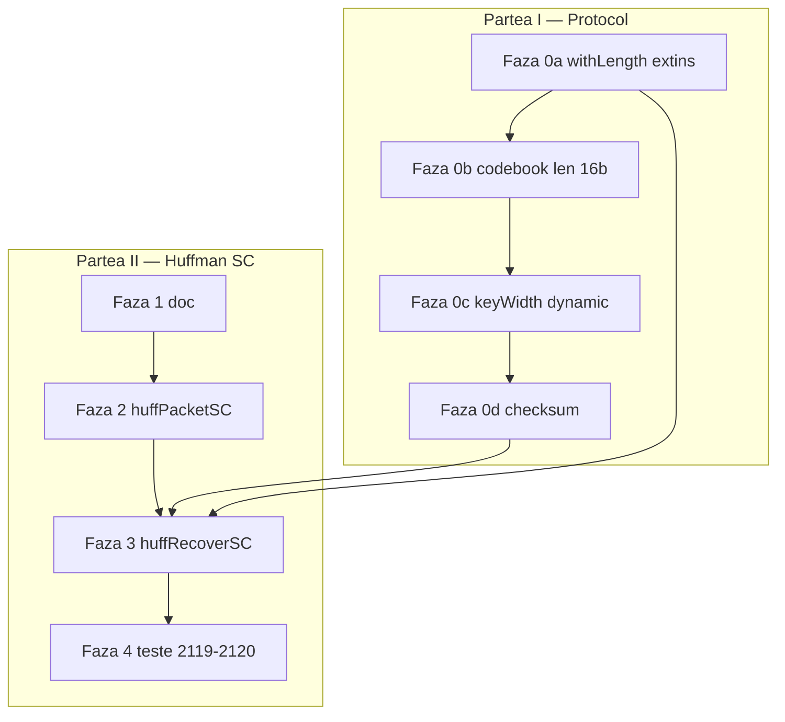

# Huffman v2 — packet self-contained

Plan în două părți: **(I) extinderi protocol** (Faza 0a → 0d), apoi **(II) implementare Huffman SC**.

---

## Politică decode — definitiv

| Mecanism | Folosire |
|----------|----------|
| `:decode()` | Doar protocoale simple (UART etc.) — **niciodată** extins la `withLength`, `expand`, `collapse`, parse ierarhic |
| **Protocol recover separat** | `.huffRecoverSC { data = packet }` — același model ca `.huffRecover` actual |

Transformarea inversă = protocol dedicat, nu `:decode()`. Decizie investigată și finală.

---

## Layout packet SC (fără `version`)

```
┌──────────┬────────────┬─────────────────────┬──────────────┬──────────┐
│  HEADER  │ cbLen 16b  │      CODEBOOK       │   PAYLOAD    │ checksum │
│  24 bit  │ (Faza 0b)  │  variabil (nSym×)   │  8 + L bit   │ (0d)     │
└──────────┴────────────┴─────────────────────┴──────────────┴──────────┘
```

### HEADER (24 bit)

| Câmp | Lățime | Valoare |
|------|--------|---------|
| `magic` | 8b | `01001000` (`'H'`) |
| `keyWidth` | 8b | lățime token (ex. 8) |
| `nSym` | 8b | 1…255 intrări codebook |

### CODEBOOK (compact, ordine `sym` crescător)

Per intrare: `sym 8b` + `cwLen 8b` + `codeword cwLen bit` (MSB-first).

**Faza 0b:** prefix `lengthOf(codebookBody) 16b` înainte de corpul codebook (simetric encode/decode).

### PAYLOAD

`payloadLen 8b` + `encoded` (`payloadLen` bit) — ca `.huffPacket` actual.

### CHECKSUM (Faza 0d)

Câmp final pe wire — algoritm de ales (ex. CRC-16); scope: biți de la `magic` până la sfârșitul payload-ului (fără câmpul checksum).

---

## Partea I — Extinderi protocol (înainte de Huffman SC complet)

Ordine de livrare: **0a → 0b → 0c → 0d**.

### Faza 0a — extindere `withLength`

Baza pentru parse ierarhic fără primitiv separat de repetare.

| Pas | Sintaxă | Semnificație |
|-----|---------|--------------|
| **1** | `withLength(rest, cwLen b)` | lățime din câmp parsat (codeword variabil) |
| **2** | `withLength(data, 16b, entry)` | prefix 16b → sub-stream; parse `def entry` repetat până sub-stream gol |
| **3** | `magic 8b`, `keyWidth 8b`, `nSym 8b`… | cursor de parsare secvențial pe `data` în protocol recover |

**Validare `nSym`:** după parse codebook, număr intrări = `nSym` din header (altfel eroare).

**Encode simetric (parțial azi):** segmente în ordine = concatenare automată; `lengthOf(def) Nb` + body = cadru length-prefix.

**Fișiere engine:** [protocol-assembler.js](../v0_3_2/core/protocol-assembler.js), doc [protocol.md](../v0_3_2/doc/protocol.md).

Model țintă recover (`.huffRecoverSC`):

```logts
def entry:
  sym 8b
  cwLen 8b
  withLength(rest, cwLen b)

def codebook:
  withLength(stream, 16b, entry)

out:
  magic 8b
  keyWidth 8b
  nSym 8b
  codebook
  collapse(withLength(stream, 8b), .huff, keyWidth b)
```

Side-effect: populare `.huff` din intrările parse (`.huff:add` per entry sau primitiv dedicat — de detaliat la implementare).

---

### Faza 0b — cadru `lengthOf(codebook) 16b`

- La **encode:** `def codebook: lengthOf(codebookBody) 16b` + `codebookBody ~b`
- La **recover:** `withLength(stream, 16b, entry)` (Faza 0a, pas 2)
- Simplifică slicing: `rest = packet.(24+16+codebookLen)/…` fără sumă manuală `cwLen`

Actualizează layout-ul SC în doc cu `cbLen 16b` explicit.

---

### Faza 0c — `keyWidth` dinamic în `expand` / `collapse`

Azi: `expand(tokens, .huff, 8b)` — literal fix.

Țintă: `expand(tokens, .huff, keyWidth b)` unde `keyWidth` e parametru/câmp parsat din header.

Aplică simetric la `.huffPacketSC` (encode) și `.huffRecoverSC` (recover).

---

### Faza 0d — `checksum` (encode) + `validateChecksum` (recover)

**Faza 0d este fază separată** (soră cu 0a, 0b, 0c) — nu e inclusă în Faza 0a.

**Encode** — generator nou (poate fi implementat **independent** de parse cursor):

```logts
checksum(crc16, body)
```

`body` = def referit sau secvență (header + codebook + payload); append câmp checksum la `out:`.

**Recover** — generator simetric (protocol separat, **nu** `:decode()`):

```logts
validateChecksum(crc16, data)
```

Recalculează hash pe aceeași zonă, compară cu câmpul din packet; eșec clar dacă diferă.

**Dependențe:**

| Generator | Depinde de |
|-----------|------------|
| `checksum()` encode | **nimic** din 0a–0c — la invoke știi deja body-ul complet |
| `validateChecksum()` recover | **Faza 0a** (parse cursor secvențial, pas 3) — trebuie să parcurgi packet-ul ca să știi unde e body vs. câmp checksum |

**Nu** depinde de Faza 0c (`keyWidth` dinamic) — 0c e pentru `expand`/`collapse`, nu pentru checksum.

Dacă `validateChecksum` e blocant fără Faza 0a gata: livrăm **doar `checksum()` encode** în 0d și **amânăm `validateChecksum`** — nu blocăm Huffman SC.

---

## Partea II — Implementare Huffman SC

### Faza 1 — documentație

1. [huffman-v2.md](../v0_3_2/doc/huffman-v2.md) — secțiune „Packet self-contained (SC)”: layout, exemplu `'aacb'`, diagrame encode/recover
2. [protocol.md](../v0_3_2/doc/protocol.md) — secțiune Faza 0a–0d (fără `concat`, fără `:decode()` extins)

### Faza 2 — encode + helpers (interim dacă Faza 0a incompletă)

În [test_suite.js](../v0_3_2/tests/test_suite.js):

- `huffBuildCodebookWire(entries)` — sym + cwLen + codeword
- `inline [protocol] .huffPacketSC` — header + `lengthOf(codebook) 16b` + `codebook ~b` + payload (+ checksum după 0d)
- Script după FSM existent construiește `codebook ~b` din `.huff:entries(sortKeys)`

**Interim fără Faza 0a:** decode via script slice + `.huff:add` + `.huffRecover` pe payload.

### Faza 3 — recover protocol separat

- `inline [protocol] .huffRecoverSC` — parse header, load codebook, `collapse` payload
- Depinde de **Faza 0a** (parse cursor + `withLength` extins)
- Opțional **Faza 0d** `validateChecksum` — **după Faza 0a** (parse cursor); `checksum()` encode poate exista mai devreme

**Nu** folosim `:decode()` pe `.huffPacketSC`.

### Faza 4 — teste

- **2119** — encode SC + codebook wire corect
- **2120** — round-trip: instanță decoder **fără** `.huff` preset → `.huffRecoverSC` reconstruiește sursa

---

## Diagramă flux



---

## Ce NU intră în plan

- `concat()` în protocol — renunțat; segmentele listate se concatenează deja
- `times` / `loop` generic — acoperit de Faza 0a (`withLength` + `def`)
- Extindere `:decode()` — exclus definitiv pentru cazuri complexe
- Codebook fix 32b/intrare — deprioritizat; rămânem pe variabil compact

---

## Decizie codebook

**Variabil** (sym + cwLen + codeword): spec finală; parse declarativ după Faza 0a; interim script slice până atunci.

---

## Legături

- FSM Huffman v2: [huffman_v2_fsm.plan.md](huffman_v2_fsm.plan.md)
- Protocol extensions v2: [protocol_extensions_v2.plan.md](protocol_extensions_v2.plan.md)
