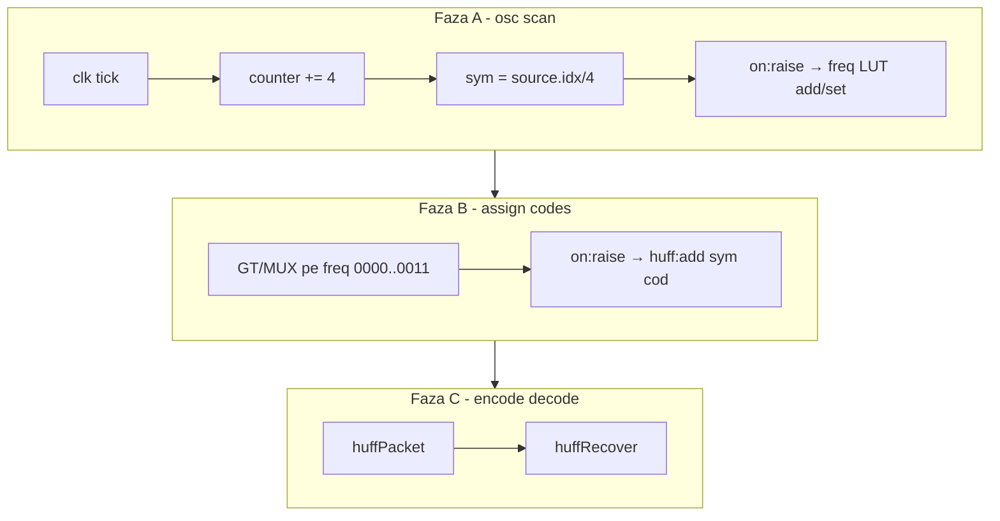

# Plan: Huffman v2 — simulator digital, fără shortcut-uri

## Principiu (decizie utilizator)

- **Nu** `buildFrom`, **nu** builtin Huffman, **nu** cheat-uri domain-specific.
- Tot ce se poate face cu **limbajul de simulator digital** existent: wires, `comp`, `inline [lut] writable`, `on:` conditional assignment, `expand`/`collapse`, protocol, built-in-uri (`ADD`, `MUX`, `GT`, …), `osc`, `counter`, slice dinamic.
- Unde **nu** putem: documentăm gap-ul explicit și propunem **extensie generică** (componentă, metodă LUT, builtin reutilizabil) — nu Huffman în engine.

[`conditional-assignment.md`](v0_3_2/doc/conditional-assignment.md) — **livrat** (2060–2075). [`huffman.md`](v0_3_2/doc/huffman.md) — v1 static.

---

## Ordine lucrări

| # | Lucru |
|---|---|
| **0b** | **`:keys` / `:values` / `:entries`** + builtin **`SORT`** (+ curățare doc multi-`;`) |
| **0c** | **`keyAt(i)` / `valueAt(i)`** (acces singular) |
| **0d** | **`removeAt(idx)`**, **`peekMin`/`peekMax`**, **`popMin`/`popMax`** (+ tag-uri format numeric) — **coadă min pe LUT** pentru Huffman N-general |
| **0z** | **NEXT în wave** = comportament osc — **ultimul pas înainte de Huffman** |
| **1** | Huffman: freq scan + `SORT(.freq:entries)` + coduri + round-trip |
| **2** | Teste + `huffman-v2.md` complet |
| **Later** | Mod `signal` (backlog) |

---

## Reguli implementare — teste + documentație (DECIS)

**După fiecare fază** (0b, 0c, 0d, 0z, 1, 2), înainte de a trece la următoarea:

### 1. Teste — suite completă verde

| Pas | Comandă (din `v0_3_2/`) |
|-----|-------------------------|
| Regen manifest (dacă s-au adăugat teste noi) | `node node/_gen_test_manifest.js` |
| **Toate testele** | `node node/_run_test_suite_node.js` |

- **Criteriu:** exit code 0, **toate** testele cu success — nu doar grupul nou.
- Dacă un test vechi cade: fix înainte de faza următoare (regresie).
- Teste noi în [`tests/test_suite.js`](v0_3_2/tests/test_suite.js); ID-uri documentate în manifest generat.

### 2. Documentație — pagini existente actualizate

Nu doar fișiere noi: **actualizăm paginile existente** cu ce s-a schimbat (semnături, runnable, note).

| Fază | Fișiere doc de actualizat |
|------|---------------------------|
| **0b** | [`lut.md`](v0_3_2/doc/lut.md) — secțiune writable: `:keys`, `:values`, `:entries` · **nou** [`builtin-SORT.md`](v0_3_2/doc/builtin-SORT.md) · [`builtin-tagged-index.md`](v0_3_2/doc/builtin-tagged-index.md) — index SORT · [`builtin-ARGMAX.md`](v0_3_2/doc/builtin-ARGMAX.md) · [`builtin-ARGMIN.md`](v0_3_2/doc/builtin-ARGMIN.md) — **șters** `; row; index` → `; row index` · [`matrix-reduction.md`](v0_3_2/doc/matrix-reduction.md) · [`vector-reduction.md`](v0_3_2/doc/vector-reduction.md) — exemple tag-uri |
| **0c** | [`lut.md`](v0_3_2/doc/lut.md) — `:keyAt`, `:valueAt` + runnable |
| **0d** | [`lut.md`](v0_3_2/doc/lut.md) — `removeAt`, `peekMin`/`Max`, `popMin`/`Max`, tag-uri format pe apel metodă · notă parser `callTags` pe `inlineMethod` dacă e cazul |
| **0z** | [`signal-propagation.md`](v0_3_2/doc/signal-propagation.md) — NEXT ≈ osc în wave |
| **1–2** | **nou** [`huffman-v2.md`](v0_3_2/doc/huffman-v2.md) · [`huffman.md`](v0_3_2/doc/huffman.md) — link scurt către v2 · cross-ref [`conditional-assignment.md`](v0_3_2/doc/conditional-assignment.md), counter, osc unde e relevant |

După modificări doc: regen [`doc-index.json`](v0_3_2/doc/doc-index.json) / manifest doc (pipeline proiect) ca paginile noi să apară în viewer.

### 3. Checklist per fază (template)

- [ ] Cod implementat
- [ ] Teste noi în `test_suite.js` (+ regen manifest dacă e cazul)
- [ ] **`node node/_run_test_suite_node.js` — toate verzi**
- [ ] Paginile doc din tabelul fazei actualizate (nu doar plan intern)
- [ ] `BUILTIN_DOC` / `doc(NAME)` actualizat în interpreter unde e cazul (ex. SORT)

---

## Faza 0b — LUT export bulk + builtin `SORT` (DECIS)

**Scop:** sortare frecvențe Huffman fără alfabet fix, fără `ARGSORT` în v1.

### API LUT (writable)

| Metodă | Return | Note |
|--------|--------|------|
| `.lut:keys` | `addrWidth wire[N]` | cheile din `lutEntryList`, ordine inserție |
| `.lut:values` | `depth wire[N]` | valorile (lățime fixă `depth`; `variableDepth` = max width) |
| `.lut:entries` | `addrWidth wire[N,2]` | col **0** = cheie, col **1** = valoare |

- Sursă: **`lutEntryList`** (ca `add`/`set`), nu slot-uri `fillwith`.
- `size()=0` → vectori lungime 0 / matrice `[0,2]` (de definit în teste).
- Duplicate keys: fiecare intrare din listă apare (util la `freq` cu `set` pe aceeași cheie = o singură intrare).

### Reguli tag-uri la apel (canonic)

Un singur **`;`** separă argumentele de tag-uri. După `;`, tag-urile sunt **spațiu-separate**, în **orice ordine**:

| Formă | Semnificație |
|-------|----------------|
| `tag` | tag bool = 1 (ex. `desc`, `index`) |
| `tag=N` | tag cu valoare numerică (int, de obicei decimal la apel) |

**Interzis:** `; tag1 ; tag2` — al doilea `;` e eroare de parse (`Extra ';' between tags'`). Corect: `; tag1 tag2`.

Referințe: [`user-functions.md` — Tag overloads](v0_3_2/doc/user-functions.md), `parser.js` → `parseFuncTags()`.

### Curățare doc sintaxă multi-`;` (împreună cu SORT)

**Același pas de implementare ca builtin `SORT`** — nu task separat. Șterge / înlocuiește toate aparițiile `; tag1 ; tag2` (ex. `; row; index`) cu tag-uri spațiu-separate (ex. `; row index`).

| Fișier | Ce se corectează |
|--------|------------------|
| [`builtin-ARGMAX.md`](v0_3_2/doc/builtin-ARGMAX.md) | semnături + exemple: `; row index`, `; col index` (nu `; row; index`) |
| [`builtin-ARGMIN.md`](v0_3_2/doc/builtin-ARGMIN.md) | idem |
| [`matrix-reduction.md`](v0_3_2/doc/matrix-reduction.md) | exemple `ARGMAX(m; row index)` |
| [`vector-reduction.md`](v0_3_2/doc/vector-reduction.md) | idem |

Regula de aur în aceste pagini: **un singur `;` per apel**; tag-urile după el sunt separate prin spațiu. `builtin-SORT.md` (nou) documentează de la început regula corectă (`col=1`, `desc col=1`, etc.).

### Builtin `SORT` — sintaxă (DECIS)

La ARGMAX/SUM, `row` / `col` sunt tag-uri **bool** (reducere pe axă). La SORT, `col` / `row` sunt tag-uri **cu valoare** = indexul coloanei/rândului cheie:

```
SORT(Wbit[n] vector) -> Wbit[n]
SORT(Wbit[n] vector; desc) -> Wbit[n]

SORT(Wbit[r,c] matrix; col=k) -> Wbit[r,c]   # reordonează RÂNDURILE după coloana k
SORT(Wbit[r,c] matrix; row=k) -> Wbit[r,c]   # reordonează COLOANELE după rândul k
SORT(...; col=k desc)                          # ordinea tag-urilor e liberă
```

Exemple apel:

```logts
SORT(entries; col=1)           # asc (implicit) pe coloana 1 (frecvențe)
SORT(entries; desc col=1)      # echivalent — tag-uri în orice ordine
SORT(entries; row=0)             # reordonează coloanele după rândul 0
SORT(vector; desc)
```

- `col=k` / `row=k` — **mutual exclusive**; matricea necesită exact unul.
- `k` = int nenegativ (literal decimal în tag, ex. `col=1`).
- `desc` = tag bool; fără `desc` → **asc** unsigned (implicit).
- **Stabil** la egalitate; compare unsigned pe coloana/rândul cheie.
- **Nu** `ARGSORT` în v1; **nu** `keysAt`/`valuesAt` în v1.

**Invalid:** `SORT(matrix; 0 col)` — `0` nu e nume de tag; folosește `col=0`. `SORT(matrix; col 1)` — `1` singur nu e tag; folosește `col=1`.

### Acces coloane după sort (important)

Pe matrice `[N,2]`:

| Intenție | Sintaxă corectă |
|----------|-----------------|
| coloana cheilor | `sorted::0` |
| coloana valorilor | `sorted::1` |
| rândul 0 (cheie+valoare pereche) | `sorted:0` |

`matrix:0` = **rând** 0, nu coloana 0 — vezi [wire-vectors.md — indexing 2D](v0_3_2/doc/wire-vectors.md#indexing-2d).

### Pipeline Huffman (Pas 4)

```logts
8wire[n,2] e = .freq:entries
8wire[n,2] byFreq = SORT(e; col=1)            # asc — cele mai mici frecvențe primele (merge Huffman)
4wire[n] syms = byFreq::0
8wire[n] cnts = byFreq::1
```

Pentru „cel mai frecvent” direct: `SORT(e; col=1 desc)` + primul rând `byFreq:0` sau `ARGMAX` pe `byFreq::1`.

### Fișiere

| Fișier | Schimbare |
|--------|-----------|
| [`lut-writable.js`](v0_3_2/core/lut-writable.js) | `lutKeys`, `lutValues`, `lutEntries` |
| [`interpreter.js`](v0_3_2/core/interpreter.js) | dispatch `:keys`/`:values`/`:entries`; builtin `SORT` |
| [`lut.md`](v0_3_2/doc/lut.md) | secțiune export + runnable |
| **nou** [`builtin-SORT.md`](v0_3_2/doc/builtin-SORT.md) | semnături `col=k` / `row=k` / `desc`; reguli tag-uri |
| [`builtin-ARGMAX.md`](v0_3_2/doc/builtin-ARGMAX.md) | **șterge** sintaxa `; row; index` → `; row index` |
| [`builtin-ARGMIN.md`](v0_3_2/doc/builtin-ARGMIN.md) | **șterge** sintaxa multi-`;` (ca ARGMAX) |
| [`matrix-reduction.md`](v0_3_2/doc/matrix-reduction.md) | **șterge** sintaxa multi-`;` în exemple |
| [`vector-reduction.md`](v0_3_2/doc/vector-reduction.md) | **șterge** sintaxa multi-`;` în exemple |
| [`tests/test_suite.js`](v0_3_2/tests/test_suite.js) | lut export ~2076+; SORT ~2085+ |

### Teste minime

| Test | Verifică |
|------|----------|
| `add`×3 → `:keys`, `:values`, `:entries` | ordine + shape `[3,2]` |
| `SORT(entries; col=1)` | rânduri după col 1 asc |
| `SORT(entries; desc col=1)` | desc; ordine tag-uri liberă |
| `SORT(entries; row=0)` | reordonează coloane după rând 0 |
| egalități pe col 1 | sort stabil |
| `SORT(vector)` | vector simplu |
| `col=k` / `row=k` out of range | eroare |

### Backlog (nu v1)

| API | Motiv |
|-----|-------|
| `ARGSORT(vector)` | frumos generic; Huffman acoperit cu `SORT` + `::0` |
| `.lut:keysAt(idxVec)` / `valuesAt` | `SORT` + slice sau viitor `GATHER` |

---

## Faza 0c — Writable LUT: `keyAt(i)` / `valueAt(i)` (DECIS)

**Scop:** parcurgere runtime a intrărilor din `lutEntryList` (ordine de inserție), fără alfabet fix hardcodat.

### API propus

| Metodă | Semnătură | Return |
|--------|-----------|--------|
| `.lut:keyAt(i)` | `i` = index **0 … size()-1** | cheia intrării `i` (lățime addr) |
| `.lut:valueAt(i)` | idem | valoarea intrării `i` (depth sau variableDepth) |

```logts
4wire i = \0
4wire n = .freq:size()
4wire key = .freq:keyAt(i)
8wire val = .freq:valueAt(i)
```

- Sursă de adevăr: **`lutEntryList`** (aceeași ordine ca `add`/`set`), nu scan `lutTable` pe slot-uri goale.
- **`i` out of range** (`i >= size()` sau negativ): **eroare runtime** (consistent cu alte LUT ops invalide).
- Doar pe **`writable`** LUT; read-only → eroare „not writable” (ca celelalte mutații).
- Duplicate keys: `keyAt`/`valueAt` pe index — fiecare intrare din listă e vizibilă (util dacă lista are duplicate).

### Fișiere

| Fișier | Schimbare |
|--------|-----------|
| [`lut-writable.js`](v0_3_2/core/lut-writable.js) | `lutKeyAt`, `lutValueAt` |
| [`interpreter.js`](v0_3_2/core/interpreter.js) | dispatch `:keyAt` / `:valueAt` |
| [`lut.md`](v0_3_2/doc/lut.md) | secțiune Writable API + runnable |
| [`tests/test_suite.js`](v0_3_2/tests/test_suite.js) | grup `lut-writable` — keyAt/valueAt, bounds, după add/set |

### Teste minime (ID ~2076+, înainte de huffman-wave)

| Test | Verifică |
|------|----------|
| `keyAt(0)` / `valueAt(0)` după `add` | cheie/valoare corecte |
| două `add` → `keyAt(0)`, `keyAt(1)` | ordine listă |
| `set` înlocuiește → `valueAt` actualizat | sync listă |
| `i >= size()` | eroare |
| read-only LUT `:keyAt` | eroare not writable |

### Utilizare Huffman (Pas 4)

După scan frecvențe, **iterare pe `.freq`** cu `comp [counter]` sau `loop`+`NEXT`+index:

```logts
# conceptual — i de la 0 la size-1 la fiecare pas
4wire sym = .freq:keyAt(i)
8wire cnt = .freq:valueAt(i)
# → ARGMAX / GT / merge Huffman pe perechi (cnt), nu doar 4 nibele fixe
```

**Notă:** iterarea indexului `i` tot necesită counter/osc — `keyAt`/`valueAt` rezolvă accesul la index, nu bucla.

---

## Faza 0d — Writable LUT: `removeAt`, `peekMin`/`Max`, `popMin`/`Max` (DECIS)

**Scop:** simulare **min-priority** pe `lutEntryList` fără `comp [priorityqueue]` — suficient pentru merge Huffman N-general (osc + `on:raise`).

### API

| Metodă | Efect | Return |
|--------|-------|--------|
| `.lut:removeAt(i)` | elimină intrarea la index `i` | `1wire` ack (`0`) |
| `.lut:peekMin` | **nu** mută lista | **cheie** + **valoare** (dual assign) |
| `.lut:peekMax` | idem | cheie + valoare |
| `.lut:popMin` | elimină intrarea min | **cheie** + **valoare** (dual assign) |
| `.lut:popMax` | elimină intrarea max | cheie + valoare |

**Fără index la `peek*` / `pop*`:** după `popMin`, intrarea e scoasă — orice index ar fi fost **invalid** (lista se scurtează, indicii se shift-uiesc). Pentru Huffman ai nevoie de **simbol + frecvență**, nu de poziție în listă.

Diferența `peek` vs `pop`: ambele returnează **key + value**; doar `pop*` mută lista (`size` scade). `removeAt(i)` rămâne pentru cazuri unde știi indexul din altă sursă (ex. după `SORT` + logică pe rânduri), nu ca follow-up la `pop`.

- Compară pe câmpul **valoare** (`entry.value`), nu pe cheie — pentru `.freq` = frecvențe.
- **Egalități:** câștigă **indexul cel mai mic** (stabil, ca `ARGMAX`).
- Listă goală / `peek`/`pop` pe `size()==0` → **eroare runtime**.
- `i` out of range la `removeAt` → eroare (ca `keyAt`).
- `pop*` / `removeAt` declanșează `_notifyWritableLutMutation` (ca `remove`).
- Doar **`writable`** LUT.

### Tag-uri format numeric (compare)

Același set ca built-in-urile aritmetice — **un singur** tag format per apel, după `)`:

```logts
4wire sym, 8wire cnt = .freq:peekMin(; q4p4)   # citește min, lista neschimbată
4wire sym, 8wire cnt = .freq:popMin(; signed)  # scoate min; key+value înainte de remove
4wire a, 8wire b = .freq:popMin(; s8)
4wire c, 8wire d = .freq:popMin()              # unsigned implicit
```

Tag-uri acceptate (ca `GT`/`ARGMAX`): `signed`, `s4`…`s64`, `q4p4`, `q8p8`, `fp16`, `bf16` — mutually exclusive.

**Notă implementare:** astăzi `inlineMethod` **nu** parsează `callTags` după `)` — extindere **`parser.js`** + `evalInlineMethod` transmite tag-urile la `lutPeekMin` / `lutPopMin` (reutilizează `parseBuiltinCallTags` / compare din `numeric-formats.js`).

Sintaxă canonică: `.lut:popMin(; q4p4)` — **nu** `.lut:popMin(q4p4)` (în paranteză e doar pentru argumente poziționale; formatul e tag).

### Huffman N-general — pattern cu `popMin`

LUT `.nodes` writable (cheie = id nod / simbol, valoare = frecvență):

```logts
# după scan: copiere .freq → .nodes (add per intrare)
# la fiecare osc / on:raise cât timp .nodes:size() >= 2:
4wire k1, 8wire f1 = .nodes:popMin()
4wire k2, 8wire f2 = .nodes:popMin()
8wire fParent = ADD(f1, f2)
_ = .nodes:add(parentKey, fParent)   # parentKey = alocat din counter
```

**Rămâne în script:** alocare `parentKey`, reconstrucție arbore pentru coduri (LUT auxiliar părinte-copil sau pași finiți). `popMin` rezolvă **extract-min repetat**; nu înlocuiește întregul Pas 5 (atribuire biți 0/1).

#### `parentKey` + două LUT-uri (DECIS — fără `depth: 8[2]`)

| Concept | Rol |
|---------|-----|
| **`parentKey`** | **cheia** noului nod intern (din `counter`) — `add(parentKey, …)` |
| **valoarea** | blob flat la `depth` scalar; concat `parentKey + bit` la `set` |

**Nu implementăm `depth: 8[n]` / tensor pe LUT** în acest plan — Huffman merge cu `depth` scalar + slice/concat. Motive: `set` înlocuiește tot blob-ul, `decode`/`hasValue` pe match integral, `parseInt("8[2]")` periculos fără parser dedicat, `exprOfLut` nu se potrivește.

| LUT | `depth` | cheie → valoare | Rol |
|-----|---------|-----------------|-----|
| `.heap` | `8` | nod → **frecvență** | `popMin` / merge |
| `.links` | **`16`** flat | nod → **`parent(8b) ‖ bit(8b)`** | `[parent, bit]`; nu `popMin` |

La fiecare merge (după `popMin`×2):

```logts
4wire k1, 8wire f1 = .heap:popMin()
4wire k2, 8wire f2 = .heap:popMin()
8wire fParent = ADD(f1, f2)
4wire parentKey = ...   # counter / id nou
_ = .heap:add(parentKey, fParent)
_ = .links:set(k1, parentKey + 0)    # bit 0 către părinte
_ = .links:set(k2, parentKey + 1)    # bit 1
```

**`[parent, bit]` vs `[left, right]`** (DECIS — preferăm **parent, bit** pe copil):

| Reprezentare | Unde se scrie | Potrivit pentru |
|--------------|---------------|-----------------|
| `[left, right]` pe **părinte** | `set(parentKey, k1 + k2)` | parcurgere top-down (rădăcină → frunză) |
| **`[parent, bit]` pe copil A** | `set(k1, parentKey + bit)` | **generare cod** — urci de la simbol la rădăcină, concat biți |

Pentru **`.huff:add(sym, codeword)`** urcarea: `.links:get(sym)` → slice parent (`.0/8`) → repetă. `bit` = câmpul low (`.8/8` sau al doilea octet din concat).

---

### Fișiere

| Fișier | Schimbare |
|--------|-----------|
| [`lut-writable.js`](v0_3_2/core/lut-writable.js) | `lutRemoveAt`, `lutPeekMin/Max`, `lutPopMin/Max`, helper compare cu format tag |
| [`parser.js`](v0_3_2/core/parser.js) | `callTags` pe apel `inlineMethod` după `)` |
| [`interpreter.js`](v0_3_2/core/interpreter.js) | dispatch + dual return `popMin`/`popMax`; mutators în `_exprReferencesWritableLutInst` |
| [`lut.md`](v0_3_2/doc/lut.md) | secțiune min/max + runnable Huffman merge |
| [`tests/test_suite.js`](v0_3_2/tests/test_suite.js) | ~2095+ removeAt, peek, pop, tags, empty, ties |

### Teste minime

| Test | Verifică |
|------|----------|
| `peekMin` pe 3 intrări | key + value corecte; `size` neschimbat |
| egalitate valori | intrarea cu index mic câștigă (tie-break intern) |
| `popMin` | scoate intrarea; `size` scade |
| dual assign `k, v = popMin()` | cheie + valoare (nu index) |
| `popMin(; signed)` | compare signed |
| `removeAt(1)` | ordine listă |
| `popMin` pe listă goală | eroare |

### Backlog redus

| Înainte | După 0d |
|---------|---------|
| `comp [priorityqueue]` obligatoriu pentru N-general | **opțional** — `popMin` pe LUT acoperă extract-min |
| `ARGSORT` | rămâne backlog; `SORT` + `popMin` suficient pentru merge |

---

## Faza 0z — NEXT ca osc în wave (DECIS — imediat înainte de Huffman)

**Poziție:** după **0b** (LUT+SORT) și **0c** (keyAt/valueAt), **înainte** de pipeline Huffman. Demo-ul wave (osc + counter + `on:raise` + scan frecvențe) beneficiază de NEXT≈osc pentru multi-step stabil.

La `NEXT(~)` / `doNext()` / `toggleSEC()`: **nu** `_recomputeAllWires = true`; cascade parțial din `~` (ca `scheduleComponentOutputChange` la osc).

| Fișier | Schimbare |
|---|---|
| [`signal-propagation.js`](v0_3_2/core/signal-propagation.js) | `onNextCycle()` wave: fără full recompute |
| [`interpreter.js`](v0_3_2/core/interpreter.js) | Closure dependențe `~` la NEXT |
| [`signal-propagation.md`](v0_3_2/doc/signal-propagation.md) | Documentare comportament |

Teste: REG/NEXT wave (704, 811), cpu4 (866, 1062), wire fără `~` nemodificat la NEXT, legacy neschimbat.

---

## Pipeline Huffman — pas cu pas (ce avem / ce lipsește)

### Pas 1 — Sursă necomprimată

| | |
|---|---|
| **Ce** | `200wire source = <literal>`, tokeni `keyWidth 4b` |
| **Status** | **OK** — wire literals |
| **Extensie** | — |

---

### Pas 2 — Parcurgere sursă (cursor)

| | |
|---|---|
| **Ce** | Index pe biți, avans +4, oprire la lungime |
| **Status** | **OK** cu `comp [counter]` + `comp [osc]` + property block / conditional pe front osc |
| **Pattern** | `source.(idx)/4` — slice dinamic confirmat |
| **Extensie** | Faza 0z (NEXT≈osc) îmbunătățește multi-step wave; osc deja OK |

```logts
comp [osc] .clk: ...
comp [counter] .idx: depth: 8, on: 1, :
.idx:{ data = ADD(.idx:get, 4); write = 0; set = .clk:get; dir = 0 }
4wire sym = source.(.idx:get)/4
1wire atEnd = GT(.idx:get, endIdx)   # sau EQ după ultimul pas
```

---

### Pas 3 — Numărare frecvențe

| | |
|---|---|
| **Ce** | LUT `.freq`: cheie = simbol, valoare = contor apariții |
| **Status** | **OK** — pattern simplu cu un singur `set` + `ADD` (confirmat în `lutSet`: cheie lipsă → append) |

**LUT frecvențe (fără `prefixFree`):**

```logts
inline [lut] .freq:
  writable
  depth: 8
  length: 16
  fillwith: 00000000
  :
```

**Increment la fiecare tick osc** (un singur conditional, fără `add` separat):

```logts
on:raise {
  AND(.clk:get, NOT(atEnd)),
  _ = .freq:set(sym, ADD(.freq:get(sym), \1;8))
}
```

**De ce merge:**

| Apel | `get(sym)` | `ADD(..., 1)` | `set` |
|------|------------|---------------|-------|
| Prima apariție | `fillwith` = `00000000` | `00000001` | **append** intrare nouă (`lutSet` L285–286) |
| Apariții următoare | contorul curent | +1 | **replace** prima potrivire |

Nu e nevoie de `hasKey` + `add` + `set` în două branch-uri — dacă `fillwith` e zero pe toți biții.

**Atenții la implementare/test:**

- `fillwith` trebuie să fie **zero numeric** (nu cod Huffman); `.freq` **nu** are `prefixFree`
- Lățime contor (`depth: 8`) ≥ `ADD` fără overflow pe literalul ales
- În `on:raise`, RHS se evaluează integral înainte de `set` — OK
- După `set`, wire-uri ca `show(.freq:get(sym))` — prefer direct probe (pattern conditional-assignment.md); sau așteptare settle wave

**Gap redus:** nu mai e nevoie de `.lut:increment` decât dacă testele arată stale reads în același tick — de verificat în Faza 1 teste.

---

### Pas 4 — Care sunt cele mai frecvente chei?

| | |
|---|---|
| **Ce** | Din `.freq`, ordonăm / extragem simboluri după frecvență |
| **Status** | **OK** cu **`:entries` + `SORT`** (Faza 0b); varianta A (4 nibele + ARGMAX) rămâne fallback demo mic |

#### Varianta principală — `entries` + `SORT` (DECIS)

```logts
8wire[n,2] e = .freq:entries
8wire[n,2] sorted = SORT(e; col=1)         # asc pe frecvențe (col 1)
4wire[n] syms = sorted::0
8wire[n] cnts = sorted::1
```

Merge Huffman: consumă din cap (`sorted:0` pereche minimă) sau re-`SORT` după fiecare combinare.

#### Varianta A — alfabet cunoscut (4 nibele) — demo v2 simplu

După scan, citești fiecare contor direct (cheia e fixă în script):

```logts
8wire f0 = .freq:get(0000)
8wire f1 = .freq:get(0001)
8wire f2 = .freq:get(0010)
8wire f3 = .freq:get(0011)

8wire[4] counts = f0 + f1 + f2 + f3

4wire maxIdx = ARGMAX(counts; index)
1wire[4] maxHot = ARGMAX(counts)
```

| Built-in | Ce îți dă |
|----------|-----------|
| `ARGMAX(counts; index)` | **indexul** elementului cu frecvența maximă (`0`…`3`) |
| `ARGMAX(counts)` | **one-hot** — bit `1` la poziția câștigătoare |
| `MAX(counts)` | valoarea maximă (nu cheia) |

**Mapare index → simbol** (cheie nibble) cu `MUX` / `DECODE` / mini-LUT:

```logts
4wire topSym = MUX(maxIdx.0-1, 0000, 0001, 0010, 0011)
```

**Egalități:** `ARGMAX` — la egalitate câștigă **indexul cel mai mic** (documentat în builtin-ARGMAX).

#### Varianta B — al doilea / al treilea cel mai frecvent (pentru merge Huffman)

Pentru arbore Huffman trebuie repetat „extrage minim/maxim două câte două”:

| Abordare | În limbaj? |
|----------|------------|
| Rețea `GT`/`MUX` pentru 4 simboluri — compară toate perechile, află min1, min2 | **DA** — multe wires, dar finit |
| `ARGMAX` → zeroează câștigătorul → `ARGMAX` din nou | **PARȚIAL** — trebuie „mask” pe vector (AND cu NOT one-hot); **de prototipat** |
| Buclă `while` peste intrări LUT | **NU** |

#### Varianta C — alfabet dinamic (după Faza 0b `entries` + `SORT`)

| Ce avem | Cu `:entries` + `SORT` |
|---------|-------------------------|
| `.freq:entries` | matrice `[N,2]` cheie \| frecvență |
| `SORT(e; col=1)` | ordine după frecvență; `sorted::0` = simboluri |
| `keyAt`/`valueAt` | acces punctual la index (Faza 0c), fără sort |

```logts
8wire[n,2] sorted = SORT(.freq:entries; col=1)
4wire[n] syms = sorted::0
```

**Varianta A** (4 nibele fixe + `get`) rămâne validă ca demo simplu; **varianta C** e calea principală după Faza 0b.

#### Rezumat practic pentru v2

1. Scan → `.freq` cu `set`+`ADD`
2. `.freq:entries` → `SORT(...; col=1)` → `syms = sorted::0`
3. Merge Huffman / coduri din ordinea sortată (sau rețea `GT`+`MUX` pentru 4 simboluri)
4. Pas 5 (coduri Huffman) — rețea finită sau pași osc pe lista sortată

---

### Pas 5 — Construire arbore Huffman din frecvențe

| | |
|---|---|
| **Ce** | Merge repetat cele 2 noduri minime → arbore → lungimi cod |
| **Status** | **PARȚIAL** — `SORT` ordonează; **0d `popMin`** acoperă extract-min repetat; **GAP** rămâne reconstrucție arbore + coduri |

**Ce avem:** `GT`, `LT`, `MIN`, `MUX`, `ADD`, counter, **`SORT`**, `:entries`, **`popMin`/`peekMin`** (Faza 0d) — **nu** avem:
- sortare runtime → **rezolvat** (Faza 0b `SORT`)
- extract-min repetat din set variabil → **rezolvat** (Faza 0d `popMin` pe `.nodes`)
- coadă de priorități dedicată → **nu e obligatorie** dacă `popMin` pe LUT e suficient
- buclă `while` runtime → tot **NU**; merge pe **osc + `on:raise` + `size()`**
- atribuire automată coduri din arbore → tot în script (LUT auxiliar / pași finiți)

**Pentru demo v2 (alfabet 4 simboluri, frecvențe runtime):**

Realizabil **în script** ca rețea combinatională / secvență de pași osc:
- Compară `freq(a)`…`freq(d)` cu `GT`/`MUX`
- Ordine descrescătoare frecvențe → atribuie coduri scurte manual cu `MUX` (arbore Huffman pentru 4 noduri = logică finită, multe linii dar **corect în limbaj**)
- Sau: **două faze osc** — faza A freq, faza B „assign codes” cu counter pe pași de merge simulat

**Pentru alfabet arbitrar N (după Faza 0d):**

| Opțiune | Tip | Acceptabil? |
|---|---|---|
| `buildFrom` / `HUFFMAN_BUILD` | Cheat Huffman | **NU** (respins) |
| **`.nodes:popMin` + `add` în buclă osc** | Extensie LUT generică | **DA — Faza 0d** |
| `comp [priorityqueue]` | Componentă separată | backlog — redundant dacă `popMin` e suficient |
| Builtin `SORT` | Generic | **Faza 0b** |

**Decizie plan:** demo v2 poate folosi **4 simboluri** (rețea finită) **sau** **N-general** cu `popMin` pe osc; documentăm ambele în `huffman-v2.md`.

---

### Pas 6 — Atribuire coduri prefixFree în `.huff`

| | |
|---|---|
| **Ce** | `.huff:add(sym, cod)` sau `set` cu coduri din pas 5 |
| **Status** | **OK** — writable + `prefixFree` revalidare la `add`/`set` |
| **Control** | `on:raise { gate, _ = .huff:add(sym, cod) }` |
| **Gap** | Codurile trebuie **calculate în pas 5**; nu `add` automat din frecvențe |

---

### Pas 7 — Encode

| | |
|---|---|
| **Ce** | `.huffPacket { tokens = source }` → `expand` + `lengthOf` |
| **Status** | **OK** — există (test 1086, huffman.md) |
| **Condiție** | `.huff` complet și prefixFree înainte de `expand` |

---

### Pas 8 — Decode + round-trip

| | |
|---|---|
| **Ce** | `.huffRecover` + `withLength` |
| **Status** | **OK** |
| **Verificare** | `recovered === source`, `packet =:` padding |

---

## Arhitectură demo v2 (integral limbaj)



**Trei LUT-uri writable (Huffman N-general):**
- `.freq` — cheie=simbol, `depth: 8` contor scan
- `.heap` — cheie=nod, `depth: 8` frecvență (`popMin`)
- `.links` — cheie=nod, **`depth: 16`** `[parent‖bit]`
- `.huff` — `prefixFree` coduri finale

---

## Faza 1 — Teste (ID ~2076+, după 2060–2075 conditional)

| Grup | Teste |
|---|---|
| `huffman-wave-freq` | osc scan; freq corecte pe literal cunoscut |
| `huffman-wave-codes` | după assign manual/MUX; prefixFree valid |
| `huffman-wave` | round-trip 128–200 biți |
| `huffman-wave-padding` | `packet =:` |

CI: tick osc simulat (`session.setComp`, pattern 611), nu sleep real.

---

## Faza 2 — `huffman-v2.md`

1. Principiu: **fără magic Huffman în engine**
2. Tabel gap-uri (secțiunea de mai sus, user-facing)
3. Faza A: osc + counter + `on:` + `.freq`
4. Faza B: atribuire coduri (MUX/compare pentru 4 simboluri)
5. Faza C: packet + recover + show
6. Runnable `logts-play wave` — Load / Load & Run
7. `SORT(.freq:entries)` + slice `::0` (Faza 0b)
8. Ce lipsește încă pentru Huffman N-general (priority queue, …)
8. Related: conditional-assignment, counter, osc, lut, protocol, huffman v1

---

## Extensii generice — backlog (nu Huffman-specific)

| Extensie | Status |
|---|---|
| **`.lut:keys` / `:values` / `:entries` + `SORT`** | **ÎN PLAN — Faza 0b** (înainte de Huffman) |
| **`.lut:keyAt(i)` / `valueAt(i)`** | **ÎN PLAN — Faza 0c** |
| **`.lut:removeAt` / `peekMin`/`Max` / `popMin`/`Max`** | **ÎN PLAN — Faza 0d** (Huffman N-general) |
| **NEXT≈osc în wave** | **ÎN PLAN — Faza 0z** (imediat înainte de Huffman) |
| `ARGSORT` / `keysAt` / `valuesAt` | backlog generic |
| `comp [priorityqueue]` | backlog — probabil redundant cu `popMin` |
| Mod `signal` | după Huffman |
| `.lut:increment` | doar dacă freq `set`+`ADD` e fragil la test |
| `comp [priorityqueue]` | backlog — `popMin` (0d) acoperă merge |
| `comp [lut]` writable + `on:` | opțional |

---

## Out of scope

- `buildFrom`, `HUFFMAN_*` builtin
- **`depth: 8[2]` / tensor depth pe LUT** — nu în acest plan; Huffman folosește `depth: 8` + `depth: 16` flat
- Board UI dedicat
- Mod `signal` înainte de Huffman (Faza 0z NEXT≈osc e OK — e pregătire wave, nu mod signal complet)

---

## Criteriu „gata”

**Per fază:** suite completă verde + doc pagini existente actualizate (vezi secțiunea „Reguli implementare”).

- [ ] **Faza 0b:** implementat + **toate testele** + doc: `lut.md`, `builtin-SORT.md`, `builtin-ARGMAX.md`, `builtin-ARGMIN.md`, `matrix-reduction.md`, `vector-reduction.md`, `builtin-tagged-index.md`
- [ ] **Faza 0c:** implementat + **toate testele** + doc: `lut.md` (`keyAt`/`valueAt`)
- [ ] **Faza 0d:** implementat + **toate testele** + doc: `lut.md` (min/max/removeAt)
- [ ] **Faza 0z:** implementat + **toate testele** + doc: `signal-propagation.md`
- [ ] Frecvențe măsurate runtime din `source` (osc + `on:` + `.freq`) — **toate testele** verzi
- [ ] Coduri în `.huff` produse **din script** — **toate testele** verzi
- [ ] Round-trip `source` → `packet` → `recovered` pe wave — **toate testele** verzi
- [ ] `huffman-v2.md` + actualizări `huffman.md`; doc-index regen
- [ ] Gap-uri N-general documentate cu propuneri generice
