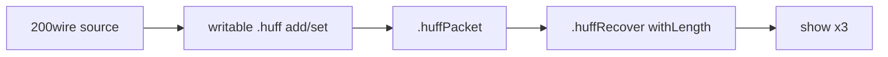
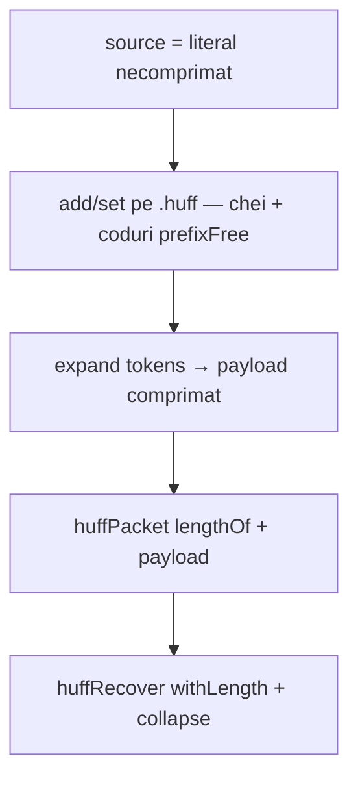

# Plan: Huffman v2 — compresie/decompresie wave

## Obiectiv

Document **nou** [`v0_3_2/doc/huffman-v2.md`](v0_3_2/doc/huffman-v2.md) cu exemplu **complet**, runnable (`logts-play wave` → butoane **Load** și **Load & Run** în doc viewer), care acoperă:

1. Sursă lungă (`128wire` / `200wire`) — literal binar fix
2. Construire codebook **`writable` + `prefixFree`** cu `add` / `set`
3. **Encode** — `.huffPacket` (`expand` + `lengthOf` + payload)
4. **Decode** — `.huffRecover` (`withLength` + `collapse`) — padding pe wire ignorat
5. **`show(source)`**, **`show(packet)`**, **`show(recovered)`** — verificare vizuală round-trip

[`huffman.md`](v0_3_2/doc/huffman.md) rămâne documentul **v1** (codebook static, exemple mici). **Nu** se duplică conținutul v1; doar un paragraf + link către v2.

---

## Ce există deja

| Componentă | Fișier |
|---|---|
| Pipeline encode/decode | [`huffman.md`](v0_3_2/doc/huffman.md), [`protocol.md`](v0_3_2/doc/protocol.md) |
| Writable LUT API | [`lut.md`](v0_3_2/doc/lut.md), [`lut-writable.js`](v0_3_2/core/lut-writable.js) |
| `expand` / `collapse` | [`protocol-assembler.js`](v0_3_2/core/protocol-assembler.js) |
| Test round-trip static | test **1086** (legacy, fără writable) |

**Lipsește:** test wave writable+protocol; document v2 cu script lung complet.



---

## Construire codebook — fără cursor runtime (decizie design)

**Nu** implementăm un cursor în script care parcurge datele comprimate și adaugă intrări în LUT pe măsură ce le „descoperă”. Motive:

| Întrebare | Răspuns |
|---|---|
| Datele sursă sunt deja comprimate? | **Nu** — `source` e flux de **tokeni fixi** (nibele 4b), necomprimați |
| Când se construiește codebook-ul? | **Înainte** de `expand` — ordine obligatorie Huffman |
| Cine are cursor la decode? | **`collapse`** (motor) — potrivire greedy prefix-free stânga→dreapta; nu scriptul |
| Cum știm ce chei să punem în LUT? | Alfabet **mic și cunoscut** (ex. 4 nibele); codurile sunt **pre-calculate offline** |

### Flux în script (v2)



### Ce API folosim (și ce nu)

- **`hasKey` / `countKey`** — utile pentru *verificare* („am deja simbolul 0001?”), nu pentru descoperire automată din stream
- **`get(key)`** — lookup encode; cheie lipsă → `fillwith`, **nu** adaugă în LUT
- **Nu există** `addIfMissing`, scan frecvențe, sau arbore Huffman în limbaj (out of scope)

### Variantă demo (aleasă)

1. Alegem literal `source` cu pattern repetitiv (ex. doar `0000`, `0001`, `0010`, `0011`)
2. Numărăm frecvențele **offline** (în afara scriptului / la scrierea doc)
3. Atribuim coduri prefixFree manual (Huffman „de hârtie”)
4. În script: secvență explicită `1wire _ = .huff:add(cheie, cod)` pentru fiecare simbol
5. Apoi `packet =: .huffPacket { tokens = source }`

Exemplu conceptual (alfabet fix, 4 intrări):

```logts
1wire _ = .huff:add(0000, 0)      # cel mai frecvent → cod scurt
1wire _ = .huff:add(0001, 10)
1wire _ = .huff:add(0010, 110)
1wire _ = .huff:add(0011, 111)
```

### Alternative (nu în scope v2)

| Abordare | De ce nu acum |
|---|---|
| Loop preprocessor peste poziții din `source`, slice nibble, `hasKey` + `add` | Tot trebuie să **generezi codul** la fiecare `add`; fără Huffman automat e verbose și fragil |
| Scan stream comprimat cu cursor | Imposibil la encode — comprimarea necesită codebook deja complet |
| Built-in frecvențe → Huffman | Feature nou engine; amânat explicit |

**În `huffman-v2.md`:** secțiune scurtă „De ce nu scanăm datele” + tabel frecvențe offline + bloc `add` explicit.

---

## Structură propusă — `huffman-v2.md`

### 1. Introducere
- Diferență față de [huffman.md](huffman.md): v1 = tabel static la parse; **v2 = tabel construit la runtime** + date lungi + **wave**
- Cerințe: propagation **wave** (bloc `logts-play wave`)

### 2. Arhitectură (tabel `.huff` / `.huffPacket` / `.huffRecover`)

### 3. Date sursă (~200 biți)
- Pattern repetitiv, 4 simboluri nibble (`keyWidth 4b`)
- Tabel frecvențe / motivație coduri scurte pentru simboluri frecvente

### 4. Construire codebook (`writable` + `prefixFree`)
- Snippet `add`/`set` cu coduri pre-calculate offline
- Notă: nu e algoritm Huffman automat în limbaj

### 5. Framing variabil
- `lengthOf(encoded) 8b` + payload
- `withLength(data, 8b)` la decode
- `Nwire packet =:` — wire mai lat, padding ignorat

### 6. Runnable — script complet (Load / Load & Run)

Un singur bloc **`logts-play wave`** cu **tot** scriptul (inline LUT + protocol + wires + mutații + show):

```logts-play wave
inline [lut] .huff:
  writable
  prefixFree
  length: 16
  :

1wire _ = .huff:add(...)
...

inline [protocol] .huffPacket:
  ...
inline [protocol] .huffRecover:
  ...

200wire source = <literal>
200wire packet =: .huffPacket { tokens = source }
200wire recovered = .huffRecover { data = packet }

show(source)
show(packet)
show(recovered)
```

### 7. Trace biți (tabel)
- `|source|`, length field, payload comprimat, `|packet|`, `|recovered|`, egalitate

### 8. Limitări / related
- Link [lut.md writable](lut.md), [protocol.md](protocol.md), [signal-propagation.md](signal-propagation.md) wave
- Test suite ID (după implementare)

---

## Faza 1 — Teste (obligatoriu înainte de doc)

**Fișier:** [`tests/test_suite.js`](v0_3_2/tests/test_suite.js) — grup `huffman-wave` (ID ~2060+)

| Test | `propagation: 'wave'` |
|---|---|
| writable `add` → `expand` pe tokens scurți | da |
| round-trip 128–200 biți, `recovered === source` | da |
| `packet =:` cu wire mai lat decât frame | da |

Scriptul din test = sursa de adevăr pentru literalul și codurile din `huffman-v2.md`.

---

## Faza 2 — Fișier nou `huffman-v2.md`

**Creare:** [`v0_3_2/doc/huffman-v2.md`](v0_3_2/doc/huffman-v2.md)

**Actualizări minime cross-link:**
- [`huffman.md`](v0_3_2/doc/huffman.md) — paragraf „Pentru writable + wave + date lungi → [huffman-v2.md](huffman-v2.md)”
- [`lut.md`](v0_3_2/doc/lut.md) — link v2 lângă secțiunea writable (opțional, 1 linie)
- [`doc-index.json`](v0_3_2/doc/doc-index.json) — intrare nouă:
  ```json
  { "file": "huffman-v2.md", "label": "Huffman v2 (writable wave)", "searchExtra": "writable prefixFree wave expand collapse huffPacket huffRecover lengthOf withLength compression decompression long data add set" }
  ```

**Regenerare:** `node node/_gen_doc_data.js` (actualizează și [`ui/doc-viewer.js`](v0_3_2/ui/doc-viewer.js) DOC_SECTIONS)

**Nu** modificăm masiv `huffman.md` — conținutul principal merge în v2.

---

## Faza 3 — Opțional

- [`files/huffman-v2-demo.logts`](v0_3_2/files/) — copie script pentru editor (dacă există pattern `files/` pentru alte demo-uri)

---

## Out of scope

- Algoritm Huffman din frecvențe
- Board / UI panel
- `comp [lut]` writable
- Multi-LUT
- Modificări `huffman.md` v1 (în afară de link)

---

## Efort estimativ

| Fază | Efort |
|---|---|
| Teste + design literal/codebook | ~2–3 h |
| `huffman-v2.md` complet + index + regen | ~1–2 h |
| Fix engine (dacă test eșuează) | 0–1 h |

**Total:** ~3–5 h

---

## Ordine implementare

1. Design literal + coduri → test wave verde
2. Scriere `huffman-v2.md` (script = test)
3. `doc-index.json` + regen + link-uri din v1
4. (Opțional) `files/huffman-v2-demo.logts`
