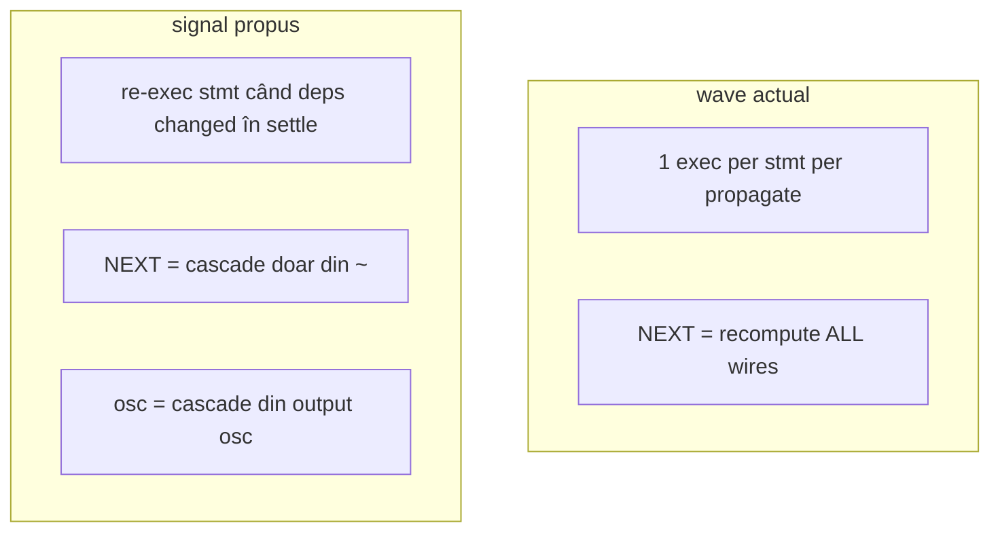
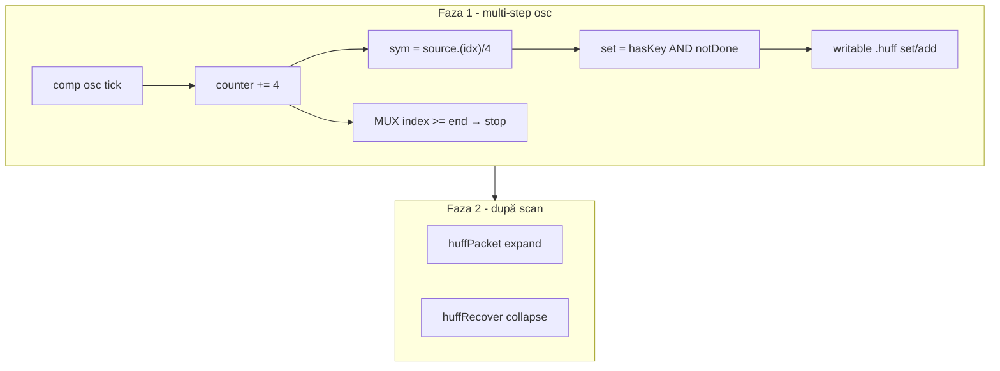

# Plan: Huffman v2 — compresie/decompresie wave (două variante)

## Obiectiv

Document **nou** [`v0_3_2/doc/huffman-v2.md`](v0_3_2/doc/huffman-v2.md) cu exemple **complete** (`logts-play wave` → **Load** / **Load & Run**), acoperind encode/decode pe date lungi (~128–200 biți) cu `inline [lut] writable` + `.huffPacket` / `.huffRecover`.

**Preferință utilizator:** varianta **B — `comp [osc]`** ca clock pentru scan multi-step (nu doar NEXT manual).

[`huffman.md`](v0_3_2/doc/huffman.md) rămâne v1 (codebook static); v2 documentează ambele abordări de construire codebook.

---

## Faza 0 — Mod propagare `signal` / `sim` (ÎNAINTE de Faza 1)

**Motivație:** Wave actual e un compromis între settle combinațional și execuție secvențială. Pentru demo Huffman osc + counter + feedback, utilizatorul dorește comportament de **simulator digital de semnale**, nu „rulează fiecare statement o dată per RUN/NEXT”.

### Problema actuală (wave)

| Mecanism | Comportament | Efect |
|---|---|---|
| `executedThisPropagate` | Fiecare wire statement max **1× per `propagate()`** (inclusiv inner `maxWaves`) | Blochează re-evaluare combinațională în același settle |
| `onNextCycle` → `_recomputeAllWires = true` | La **NEXT**, **toate** statement-urile se re-evaluează | Simulează limbaj secvențial, nu osc parțial |
| osc tick | `propagate()` nou, **doar lanț dependent** | Comportament dorit pentru clock |

Doc confirmă: self-referential `a = NOT(a)` → „one update per user action” ([signal-propagation.md](v0_3_2/doc/signal-propagation.md)).

### Ce NU recomandăm

- **Eliminarea globală a guard-ului din `wave`** — rupe stabilitatea, ~1500+ teste, risc runaway fără cap (`maxWaves` există dar nu e suficient semantic).
- **Buton simplu „off guard”** fără mod separat — utilizatorii fără feedback loops ar primi comportament imprevizibil.

### Recomandare: mod nou **`signal`** (sau `sim` / `electric`)

**Nu modificăm `wave` existent** (backward compat). Adăugăm a **3-a strategie** lângă `wave` și `legacy`:

Infrastructură deja pregătită:
- [`createSignalPropagationStrategy(kind)`](v0_3_2/core/components/index.js) — extinde cu `'signal'`
- Editor: [`togglePropagationMode()`](v0_3_2/ui/app.js) — cycle `wave` → `legacy` → `signal`
- Opțional script: `MODE SIGNAL` (parallel cu `MODE ZSTATE`)

#### Semantica propusă `signal`

**1. Settle combinațional (per RUN / per eveniment UI / per osc tick)**

- Inner loop `maxWaves`: statement-urile **pot re-rula** când un input din dependency graph s-a schimbat (fără `executedThisPropagate` permanent, sau reset per wave când deps changed).
- Convergență la fixed-point sau oprire la `maxWaves` + warning/debug.
- `a = NOT(a)` → oscilație detectată / o singură toggle (documentat), nu loop infinit.

**2. NEXT în mod `signal`**

- **Fără** `_recomputeAllWires = true`.
- Comportament ca **osc**: declanșează doar **closure-ul de dependență** pornind de la `~`:
  - property blocks cu `set = ~` sau `set` depinde de `~`;
  - wire statements care referă `~` sau wires/componente atinse de aceste block-uri.
- `REG(..., ~, ...)` — latch la NEXT, ca acum, dar fără re-evaluarea întregului program.

**3. osc / switch / dip**

- Identic cu wave actual: `scheduleComponentOutputChange` → `propagate()` cu semantica `signal` settle.

### Fișiere Faza 0

| Fișier | Schimbare |
|---|---|
| [`core/signal-propagation.js`](v0_3_2/core/signal-propagation.js) | `SignalPropagationStrategy` (sau subclass `SignalSimPropagationStrategy`) |
| [`core/components/index.js`](v0_3_2/core/components/index.js) | `createSignalPropagationStrategy('signal')` |
| [`core/interpreter.js`](v0_3_2/core/interpreter.js) | `postExecNext` — branch pe mod; closure ~ |
| [`ui/app.js`](v0_3_2/ui/app.js) + [`script_editor_v0_3_2.html`](v0_3_2/script_editor_v0_3_2.html) | Toggle 3 moduri |
| [`doc/signal-propagation.md`](v0_3_2/doc/signal-propagation.md) | Secțiune `signal` vs `wave` vs `legacy` |
| [`doc/modes.md`](v0_3_2/doc/modes.md) | Opțional `MODE SIGNAL` |
| [`tests/test_suite.js`](v0_3_2/tests/test_suite.js) | Grup `signal-propagation` — feedback, NEXT selective, osc |

### Teste Faza 0 (minim)

| Test | Verifică |
|---|---|
| Combinational chain A→B→C | re-evaluare completă într-un settle |
| `a = NOT(a)` | comportament stabil/documentat (nu hang) |
| NEXT `signal` | **nu** re-evaluează wire fără legătură cu `~` |
| NEXT `signal` | **da** re-evaluează closure `~` + REG latch |
| osc tick + counter | același pattern ca varianta B Huffman |
| Regresie `wave` / `legacy` | neschimbate |

### Efort Faza 0

| Task | Efort |
|---|---|
| Design + doc semantica | ~1–2 h |
| `SignalPropagationStrategy` + dependency re-exec | ~4–8 h |
| NEXT selective (~ closure) | ~2–4 h |
| UI toggle + teste | ~2–3 h |
| **Total Faza 0** | **~9–17 h** |

### Legătură cu Huffman v2

- Varianta **B (osc scan)** devine naturală pe mod **`signal`** după Faza 0.
- Până atunci, varianta B poate fi prototipată pe **`wave` + osc** (funcțional dar NEXT diferit).
- Varianta **A** rămâne pe `wave` sau `legacy` fără Faza 0.

---

## Două variante de construire codebook

### Varianta A — statică (Load & Run instant)

**Scop:** demo simplu, round-trip Huffman complet într-un singur RUN.

| Aspect | Detalii |
|---|---|
| Codebook | Coduri prefixFree **pre-calculate offline** (Huffman manual) |
| Script | Secvență explicită `1wire _ = .huff:add(cheie, cod)` înainte de `expand` |
| Propagare | Wave; fără NEXT / osc obligatoriu |
| UX | Load & Run → `show(source/packet/recovered)` imediat |

**Limitări:** nu demonstrează scan runtime; codurile sunt fixe în script.

---

### Varianta B — multi-step cu osc (PREFERATĂ)

**Scop:** demonstrează cursor runtime, slice dinamic, dedup condiționat — pedagogic pentru „construiesc tabel din date”.

| Aspect | Detalii |
|---|---|
| Clock | **`comp [osc]`** — fiecare tick 0↔1 = `propagate()` nou (`executedThisPropagate` resetat) |
| Cursor | **`comp [counter]`** — index pe biți; increment +4 la fiecare front osc |
| Citire simbol | **`source.(counterVal)/4`** — slice dinamic confirmat în parser/interpreter |
| Dedup | Property block cu **`set = gate`** (edge): `hasKey(sym)==0 AND index<end` → `inline [lut]:set(key, value)` |
| Stop | **MUX**: când `index >= lungime_date` → `set = 0` (oprește increment / add) |
| Encode | După scan complet: `huffPacket` / `huffRecover` (faza 2 — manual NEXT sau osc oprit + flag `done`) |

**Alternativă la osc:** `NEXT(~)` / `doNext()` / `toggleSEC()` (setInterval) — re-evaluează **toate** wire-urile (`_recomputeAllWires`); documentat ca opțiune, dar **osc e preferat**.

**Ce NU rezolvă nici varianta B:**
- Nu generează coduri Huffman din frecvențe (fără arbore în limbaj)
- Scanarea poate construi **dicționar simboluri** (key→value fix sau key→key), nu codebook optim
- Nu e instant: necesită N tick-uri osc (sau N NEXT) pentru N/4 simboluri
- `comp [lut]` writable + `:add` **nu există încă** — folosim **`inline [lut] writable`** + `:set` / `:add` în wire sau gate pe property block pe alt component

**Mecanism verificat în cod:**
- `executedThisPropagate` = per apel `propagate()`, nu permanent
- osc: `scheduleComponentOutputChange` → `propagate()` (lanț dependent)
- NEXT: `postExecNext` → `_recomputeAllWires` → toate wire-urile o dată per pas
- Property block `set` = edge `0→1` = gate condiționat real

---

## Comparație variante

| | **A — static add** | **B — osc scan (preferat)** |
|---|---|---|
| Load & Run instant | da | parțial (setup; scan = timp real osc) |
| Slice dinamic `.(idx)/4` | nu e nevoie | da |
| Dedup `hasKey` + gate | nu e nevoie | da |
| Round-trip Huffman | da | da (după faza 2) |
| Complexitate doc/test | mică | mare |
| Valoare pedagogică | pipeline encode/decode | + cursor, wave multi-step, osc |

**Implementare doc:** ambele secțiuni în `huffman-v2.md`; teste separate; varianta B ca exemplu principal dacă testele trec.

---

## Pipeline comun (ambele variante)

1. Sursă `200wire source` — literal necomprimat, `keyWidth 4b`
2. `inline [lut] .huff` — `writable`, `prefixFree`
3. `.huffPacket` — `expand` + `lengthOf` + payload
4. `.huffRecover` — `withLength` + `collapse`
5. `show(source)`, `show(packet)`, `show(recovered)`

---

## Structură `huffman-v2.md`

1. Intro — v1 vs v2; wave obligatoriu
2. **Varianta A** — add explicit, tabel frecvențe offline, script complet `logts-play wave`
3. **Varianta B (osc)** — arhitectură counter+osc+MUX; explicație propagare multi-step; script complet
4. Framing `lengthOf` / `withLength` / `packet =:`
5. Trace biți (tabel compresie)
6. Limitări — fără Huffman automat; B construiește alfabet, nu arbore
7. Related — [lut.md](lut.md), [counter.md](counter.md), [oscillator.md](oscillator.md), [signal-propagation.md](signal-propagation.md)

---

## Faza 1 — Teste

**Fișier:** [`tests/test_suite.js`](v0_3_2/tests/test_suite.js)

### Grup `huffman-wave` (~2060+) — varianta A + pipeline comun

| Test | Verifică |
|---|---|
| writable `add` → `expand` | da |
| round-trip 128–200 biți | da |
| `packet =:` padding | da |
| `propagation: 'wave'` | da |

### Grup `huffman-wave-osc` (~2070+) — varianta B

| Test | Verifică |
|---|---|
| osc tick → counter increment | da |
| `source.(idx)/4` slice la index variabil | da |
| `set` gated — nu dublează cheie existentă | da |
| MUX stop la `index >= end` | da |
| după N tick-uri simulate → encode round-trip | da (dacă coduri fixe pre-mapate) |

Testele osc pot folosi `session.setComp` / tick manual (pattern test **611**), nu timp real în CI.

---

## Faza 2 — `huffman-v2.md` + index

- [`v0_3_2/doc/huffman-v2.md`](v0_3_2/doc/huffman-v2.md) — ambele variante
- [`doc-index.json`](v0_3_2/doc/doc-index.json) — `searchExtra`: osc, counter, slice dinamic, multi-step
- Link scurt din [`huffman.md`](v0_3_2/doc/huffman.md)
- Regen: `node node/_gen_doc_data.js`, `node node/_gen_test_manifest.js`

---

## Out of scope

- Algoritm Huffman din frecvențe
- `comp [lut]` writable (doar inline acum)
- Board UI dedicat
- Buclă combinațională infinită într-un singur settle (feedback wave fără osc/NEXT)

---

## Ordine implementare

0. **Faza 0** — mod `signal` (design → strategie → teste → doc → UI toggle)
1. Test varianta A (round-trip) — baseline pe `wave`
2. Prototip + test varianta B (osc scan) — pe `signal` dacă Faza 0 gata, altfel `wave`
3. `huffman-v2.md` — A + B (B prominent, osc preferat; mențiune mod `signal`)
4. doc-index + regen

---

## Efort estimativ

| Fază | Efort |
|---|---|
| **Faza 0 signal mode** | ~9–17 h |
| Teste A + literal/codebook | ~2 h |
| Teste B osc scan | ~3–4 h |
| Doc ambele variante | ~2 h |
| **Total (cu Faza 0)** | ~16–25 h |
