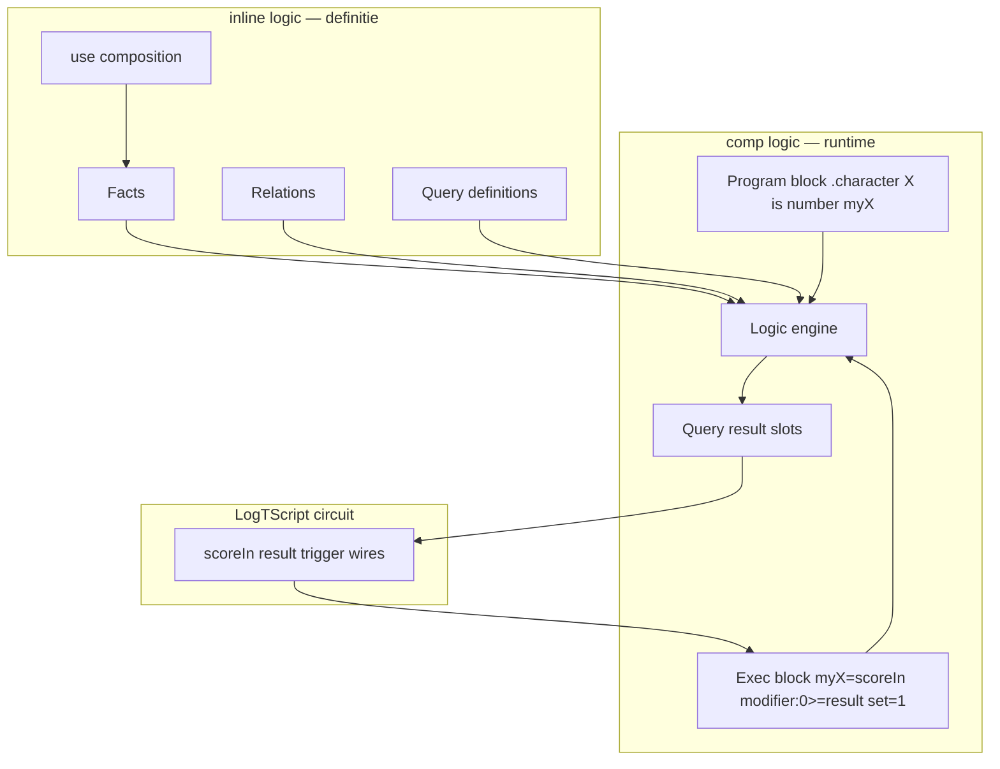
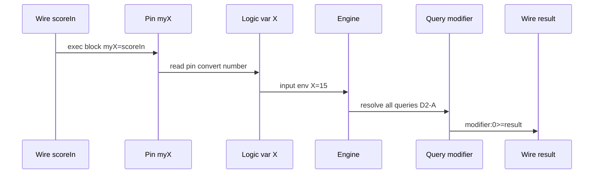
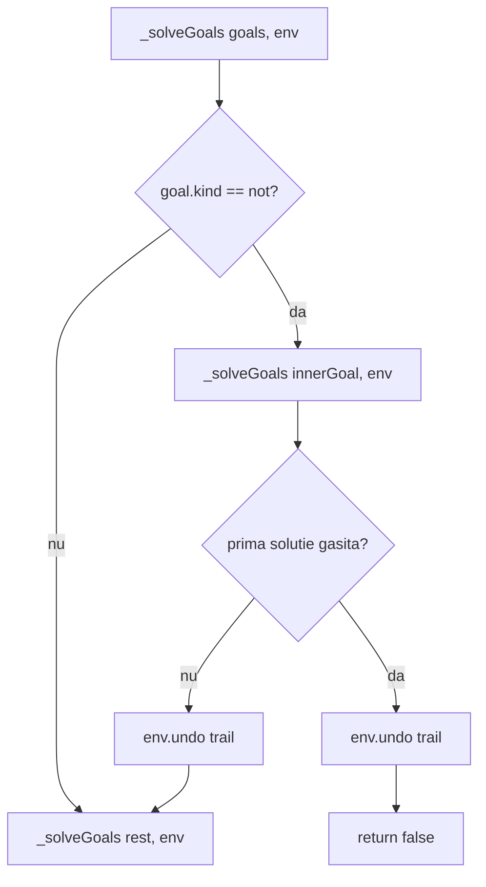
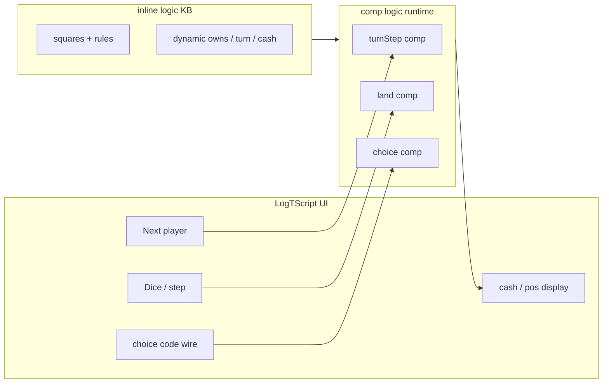

# Plan: `inline [logic]` + `comp [logic]` — motor relațional declarativ

## Legenda


| Marcaj                   | Semnificație                                                                          |
| ------------------------ | ------------------------------------------------------------------------------------- |
| **(recommended)**        | Opțiunea recomandată de analiză                                                       |
| **(change)**             | Alternativă validă, dar diferă de sketch / preferință arhitecturală                   |
| **(ready-to-implement)** | Faza poate începe după ce deciziile ei sunt confirmate                                |
| **(completed)**          | Decizie luată / implementată                                                          |
| **1+a … 1+v**            | Item backlog post-MVP — vezi [Backlog post-MVP](#backlog-post-mvp) (final plan)       |
| **2+a … 2+h**            | Faze **amânate** post-F21 — vezi [Backlog faze amânate](#backlog-faze-amânate-2a--2h) |
| ✅                        | Backlog **promovat / livrat** (fază completed)                                        |
| ❌                        | Backlog **respins** definitiv                                                         |
| 🟠✗                      | Backlog **închis** — alternativa nu se face; livrat altfel                            |
| ⏳                        | Backlog **deschis** — încă amânat                                                     |
| ⏸                        | Backlog **pause** — nu se promovează fază; rămâne idee în backlog                     |


---

## Context — analogii cu module existente

Sketch v2 clarifică: **logic ≠ protocol ≠ asm**, dar **logic ≈ asm** ca separare inline/comp.


|                      | **Protocol**           | **ASM**                   | **Logic (sketch v2)**                           |
| -------------------- | ---------------------- | ------------------------- | ----------------------------------------------- |
| **inline**           | Rețetă: input → output | Definiție ISA / opcodes   | Spațiu de cunoștințe: facts, relations, queries |
| **Execuție inline?** | Da (invoke `{ }`)      | Nu (doar definiție)       | **Nu** — definiția nu rulează                   |
| **comp**             | —                      | `comp [cpu]` execută prog | `comp [logic]` execută query-uri                |
| **Legătură cu fire** | args invoke            | pin/pout CPU              | program block + exec block + `query:N >= wire`  |
| **Model**            | Transformare           | Cod mașină                | Rezolvare declarativă                           |





**Ce există azi** în `[v0_3_2](../v0_3_2)`:

- Inline-uri: `asm`, `lut`, `protocol`, `plc`.
- Pattern `inline [plc]` **+** `comp [plc]` — cel mai apropiat ca exec pe componentă (`[plc.md](../v0_3_2/doc/plc.md)`).
- Pattern `inline [asm]` **+** `comp [cpu]` — cel mai apropiat ca „inline = definiție, comp = runtime” (`[asm.md](../v0_3_2/doc/asm.md)`).
- Property blocks pe **componente** — `.characterLogic:{ … set = 1 }` funcționează fără extindere inline-native.

---

## Obiectiv

1. `inline [logic]` — parsează facts, relations (`<-`), queries (`query name:`), opțional `use .module`; **nu se execută**.
2. `comp [logic]` — leagă o definiție logică prin **program block** (`.character { … }`), primește inputs externe, rulează query-uri la `set = 1`, expune rezultate spre fire LogTScript.
3. **Motor** — unificare, backtracking, aritmetică (`+ - * /`), comparații Prolog-style (`>=`, `=<`, `=:=`, `=\=`), termeni simbolici (`john`, `chevy`).

---

## D1 — REZOLVAT **(completed)**


|              |                                                                                                |
| ------------ | ---------------------------------------------------------------------------------------------- |
| **Decizie**  | **Two-layer ASM-like:** `inline [logic]` (definiție) + `comp [logic]` (runtime)                |
| **Respinge** | Inline-native (sketch v1: `.people:johnOwns:0` direct pe inline)                               |
| **Respinge** | Model protocol (inline ca rețetă input→output)                                                 |
| **Motiv**    | Feedback user: logic = lume de facts/relations; query-urile se fac în componentă, ca asm + cpu |


**Exemplu canonic (sketch v2):**

```logts
inline [logic] .character:

    modifier2(X, -4) <- X >= 1, X =< 2
    modifier2(X,  0) <- X >= 9, X =< 12
    modifier2(X,  2) <- X >= 15, X =< 16

    query modifier:
        modifier2(X, Y)

:

comp [logic] .characterLogic:
    on: raise

    .character {
        X is number myX
    }

:

8wire scoreIn = \15
8wire result = \0
1wire trigger = 0

.characterLogic:{
    myX = scoreIn
    modifier:0 >= result
    set = trigger
}
; scoreIn=15 → pin myX → logic X=15 → modifier2(15,Y) → Y=2 → result=2
```

---

## D2 — REZOLVAT **(completed)**


|                  |                                                                                                                                                                                     |
| ---------------- | ----------------------------------------------------------------------------------------------------------------------------------------------------------------------------------- |
| **Decizie MVP**  | **A** — la fiecare `set = 1`, rulează **toate** query-urile declarate în inline (după merge `use`)                                                                                  |
| **Amânat → F18** | **C** — listă explicită `query = modifier, johnOwns` — vezi **Faza 18** (1+l)                                                                                                       |
| **Motiv user**   | MVP simplu; când multe query-uri încetinesc exec-ul, specificarea explicită **nu e redundantă** — e optimizare intenționată, nu duplicare inutilă a redirect-urilor `modifier:0 >=` |


**MVP:**

```logts
; inline declară: query modifier, query backup, query audit, …
.characterLogic:{ myX = scoreIn, modifier:0 >= result, set = trigger }
; → toate query-urile se rezolvă; exec block citește doar modifier:0
```

**Faza 18 (1+l / D2-C):**

```logts
.characterLogic:{
    query = modifier
    myX = scoreIn
    modifier:0 >= result
    set = 1
}
; → doar query modifier — mai rapid când inline are multe query-uri

.characterLogic:{
    query none
    logic { + status(box1, ok) }
    mutationFailed >= failed
    set = trigger
}
; → zero query-uri — doar mutații + pout meta (linie standalone, fără =)
```

---

## D3 — REZOLVAT **(completed)**


|                                 |                                                                                                             |
| ------------------------------- | ----------------------------------------------------------------------------------------------------------- |
| **Decizie**                     | **A** — program block + exec block, cu **pin-uri comp** distincte de variabile logică și de fire LogTScript |
| **Corecție față de draft plan** | Exec block: `myX = scoreIn` (pin ← wire), **NU** `X = myX` (var logică ← pin)                               |


### Modelul în trei straturi

```text
LogTScript wire     comp [logic] pin     logic variable (motor)
─────────────────   ─────────────────   ───────────────────────
scoreIn (N bit)  →  myX              →  X   (is number)
nameWire (ASCII) →  myName           →  Name (is text)
aliveWire (1 bit)→  myAlive          →  Alive (is bool)
```


| Strat                | Nume exemplu               | Rol                                                              |
| -------------------- | -------------------------- | ---------------------------------------------------------------- |
| **Wire LogTScript**  | `scoreIn`, `nameWire`      | Semnal în circuit — sursa reală                                  |
| **Pin comp**         | `myX`, `myName`, `myAlive` | Interfața externă a `comp [logic]` — declarat în program block   |
| **Variabilă logică** | `X`, `Name`, `Alive`       | Folosită în facts/relations/queries — **nu** apare în exec block |


### Program block (declarație în `comp [logic]`)

```logts
comp [logic] .characterLogic:

    .character {
        X is number myX
        Name is text myName
        Alive is bool myAlive
    }

:
```

- `X is number myX` — variabila logică **X**, interpretată ca **number**, expusă pe pinul comp **myX**.
- Valid **doar** în body-ul `comp [logic]` — nu e expresie LogTScript normală.

### Exec block (property block — wiring runtime)

```logts
8wire scoreIn = \15
8wire nameWire = "Alice"
1wire aliveWire = 1
8wire result = \0
1wire trigger = 0

.characterLogic:{
    myX = scoreIn
    myName = nameWire
    myAlive = aliveWire
    modifier:0 >= result
    set = trigger
}
```

- `myX = scoreIn` — assign LogTScript standard: valoarea wire-ului **scoreIn** alimentează pinul **myX** al componentei.
- La trigger, comp citește pin **myX** → convertește (number) → leagă variabila logică **X** → rezolvă query-uri.
- `modifier:0 >= result` — redirect rezultat query → wire (simetric: output pin/slot → wire).

### De ce nu e ca PLC (D3-B) — tabel comparativ


|                                | **PLC**                                      | **Logic (D3-A)**                                                      |
| ------------------------------ | -------------------------------------------- | --------------------------------------------------------------------- |
| **Unde se mapează**            | `comp` header: `inputs: { START = startIn }` | **Program block**: `X is number myX`; **exec block**: `myX = scoreIn` |
| **Ce e** `startIn` **/** `myX` | Wire LogTScript                              | **Pin comp** (myX) ← wire în exec block                               |
| **Ce intră în motor**          | Simbol PLC `START`                           | Variabilă logică `X` (via pin + tip)                                  |
| **Tip la frontieră**           | Width simbol                                 | `number` **/** `text` **/** `bool` explicit                           |


PLC mapează **simbol program → wire** la elaborare. Logic mapează **var logică → pin comp** la elaborare (program block), apoi **pin → wire** la runtime (exec block) — două pași, dar pin-ul comp e entitatea intermediară clară.

### Flux la trigger




---

---

## Rezumat decizii D4–D19 **(completed)**


| ID      | Decizie        | Notă                                                                                                             |
| ------- | -------------- | ---------------------------------------------------------------------------------------------------------------- |
| **D4**  | **A**          | Exec blocks multiple — slot-uri partajate, last-write-wins                                                       |
| **D5**  | **A**          | Backtracking DFS Prolog-like                                                                                     |
| **D6**  | **A**          | Operatori logică dedicati (`>=`, `=<`, `=:=`, aritmetică)                                                        |
| **D7**  | **A** MVP      | Redirect `query:N >= wire`; **B** POUT declarate → **1+k** (low priority, probabil never)                        |
| **D8**  | **A**          | Convenție **Prolog standard** — vezi [Prolog naming](#conventie-prolog-d8-d9-d18)                                |
| **D9**  | **A**          | Clauze multiple = **OR**, ca Prolog                                                                              |
| **D10** | **A**          | Ordinea soluțiilor = discovery order (backtracking)                                                              |
| **D11** | **comp** `on:` | `on: raise` / `edge` / `1` în **definiția** `comp [logic]`; exec block respectă același model ca alte componente |
| **D12** | **amânat 1+f** | MVP: max 1 var liberă per query (nespecificat explicit — păstrăm default plan)                                   |
| **D13** | **A**          | Parser principal = `logic-assembler.js` pentru `inline [logic]`; program block = parse auxiliar mic în comp      |
| **D14** | **A**          | MVP: **number + bool + text** — conversie la frontieră pin/wire                                                  |
| **D15** | **A**          | **Atom table** (symbol→id) + integers — performanță unificare/index                                              |
| **D16** | **A**          | `use` merge **facts + relations**; **queries nu se importă**; module folosite n-au queries „vizibile” prin use   |
| **D17** | **A**          | `=` bind/calc vs `=:=` test numeric — Prolog                                                                     |
| **D18** | **A**          | Facts + rules același predicate — **ca Prolog** (clauze OR)                                                      |
| **D19** | **→ F18**      | `query = …` — **Faza 18** (cu D2-C)                                                                              |


### Convenție Prolog (D8, D9, D18)

În **Prolog standard** (ISO/SWI):


| Sintaxă                           | Rol                             | Exemplu                                             |
| --------------------------------- | ------------------------------- | --------------------------------------------------- |
| **Uppercase** sau `_` start       | Variabilă                       | `X`, `Person`, `_`                                  |
| **lowercase** identificator       | Atom (constantă simbolică)      | `john`, `chevy`, `might`                            |
| **Quote**                         | Atom arbitrar                   | `'John Doe'`, `'X'`                                 |
| **Număr**                         | Integer/float                   | `15`, `-4`                                          |
| **Fapt + reguli** același functor | **Clauze alternative (OR)**     | `parent(tom, bob).` + `parent(X,Y) :- mother(X,Y).` |
| **Ordinea clauzelor**             | Prima potrivire în backtracking | discovery order                                     |


**D8 decis:** adoptăm convenția Prolog (**A**) — `owns(john, chevy)` + `owns(Person, Vehicle)`.

**D8 / D9 / D18:** confirmat explicit user — **ca Prolog** (convenție vars/atoms, OR clauze, facts+rules același predicate).

---

## Decizii de luat — tabel rezumat

> **D1–D32:** D25–D29 **confirmed** (Faza 8). **D30–D32 confirmed** (Faza 9). **Fazele 0–8 (completed).** **Faza 9 (ready-to-implement).**


| ID      | Subiect                | Decizia ta                                                                 |
| ------- | ---------------------- | -------------------------------------------------------------------------- |
| **D1**  | Model runtime          | **Two-layer ASM** **(completed)**                                          |
| **D2**  | Query-uri la `set = 1` | **A** MVP; **C** → **Faza 18** **(completed)**                             |
| **D3**  | Inputs program + exec  | **A** pin ← wire **(completed)**                                           |
| **D4**  | Blocuri exec multiple  | **A** last-write-wins **(completed)**                                      |
| **D5**  | Algoritm rezolvare     | **A** backtracking **(completed)**                                         |
| **D6**  | Sintaxă constrângeri   | **A** Prolog-style **(completed)**                                         |
| **D7**  | Rezultate query        | **A** redirect; B → 1+k **(completed)**                                    |
| **D8**  | Variabile vs atomi     | **A** convenție Prolog **(completed, confirmat user)**                     |
| **D9**  | Clauze multiple        | **A** OR ca Prolog **(completed, confirmat user)**                         |
| **D10** | Ordinea soluțiilor     | **A** discovery **(completed)**                                            |
| **D11** | `on:` trigger          | `on:` **pe comp** (raise/edge/1) **(completed)**                           |
| **D12** | Multi-var query        | **F3:** 1 var; **F5:** 2 vars matrix/vector; **>2** eroare **(completed)** |
| **D13** | Parser                 | **A** logic-assembler inline; aux program block **(completed)**            |
| **D14** | Tipuri frontieră       | **A** number+bool+text MVP **(completed)**                                 |
| **D15** | Reprezentare internă   | **A** atom table **(completed)**                                           |
| **D16** | `use`                  | **A** merge facts/relations; fără queries import **(completed)**           |
| **D17** | `=` vs `=:=`           | **A** **(completed)**                                                      |
| **D18** | Facts + rules mixte    | **A** ca Prolog **(completed, confirmat user)**                            |
| **D19** | `query = …`            | **→ Faza 18** (D95–D99)                                                    |


---

## Decizii de luat — detaliu per ID

### D2 — Ce query-uri rulează la `set = 1` **(completed: A MVP; C → Faza 18)**

**Decizie luată:** MVP = **A**. Post-MVP = **C** (query explicit), nu **B** (infer din redirect).


| Opțiune | Status              | Pe scurt                                     |
| ------- | ------------------- | -------------------------------------------- |
| **A**   | **MVP (completed)** | Toate query-urile din definiție              |
| **B**   | respins / nefolosit | Doar query-uri referite în `modifier:N >=`   |
| **C**   | **→ Faza 18**       | Listă explicită `query = modifier, johnOwns` |


#### A — Toate query-urile (MVP)

La fiecare exec, rezolvă **fiecare** `query name:` din inline. Rezultatele în slot-uri interne; exec block citește ce redirecționează.

- **Pro:** simplu, predictibil, toate slot-urile fresh.
- **Contra:** cost când sunt multe query-uri — motiv pentru **C** amânat.

#### C — Explicit `query = …` (**Faza 18**, **1+l**)

```logts
.characterLogic:{
    query = modifier, audit
    myX = scoreIn
    modifier:0 >= result
    set = 1
}
```

- **Pro:** optimizare când A e prea lent — **util chiar dacă** există deja `modifier:0 >=` (A rulează tot, C limitează munca motorului).
- **Nu e redundant** cu redirect-urile: redirect = unde scrii output; `query =` = ce calculezi.

---

### D3 — Legarea inputs: program block + exec block **(completed: A — pin comp ← wire)**

**Decizie luată:** program block leagă **var logică → pin comp**; exec block leagă **pin comp → wire LogTScript**.


| Opțiune | Status                                                                  |
| ------- | ----------------------------------------------------------------------- |
| **A**   | **(completed)** — vezi secțiunea [D3 REZOLVAT](#d3--rezolvat-completed) |
| **B**   | respins — map PLC în header; `myX` acolo e wire, nu pin                 |
| **C**   | respins — prea rigid                                                    |


#### Exec block corect (confirmed user)

```logts
.characterLogic:{
    myX = scoreIn
    myName = nameWire
    myAlive = aliveWire
    modifier:0 >= result
    set = 1
}
```

#### Greșeală de evitat (draft anterior)

```logts
; GREȘIT — X e variabilă logică, nu pin comp
.characterLogic:{ X = myX, ... }

; GREȘIT — confundă pin cu wire de același nume fără model clar
8wire myX = \15
.characterLogic:{ myX = myX, ... }
```

Folosește nume wire distincte (`scoreIn`, `nameWire`) sau pin comp (`myX`) assignat explicit la wire.

#### B — Map stil PLC **(change)** — de ce diferă

```logts
comp [logic] .characterLogic:
    program: .character
    inputs: { X = scoreIn }
:
```

Aici `scoreIn` e **wire** mapat direct la simbol — **fără pin intermediar** `myX`. Logic D3-A preferă pin comp explicit + tip (`is number`) în program block.

---

### D4 — Blocuri exec multiple **(completed: A)**

**Decizie:** slot-uri query partajate; ultima exec reușită suprascrie (last-write-wins).

---

### D5 — Algoritm rezolvare MVP **(completed: A)**

**Decizie:** backtracking DFS Prolog-like; limite `maxSolutions` / `maxDepth` documentate.

---

### D6 — Sintaxă constrângeri / aritmetică **(completed: A)**

**Decizie:** operatori în `logic-assembler.js` — nu builtins LogTScript `GT`/`GE`.


| Operator logic       | Semnificație                            |
| -------------------- | --------------------------------------- |
| `>=`, `=<`, `>`, `<` | comparație numerică                     |
| `=:=` / `=\=`        | egalitate / inegalitate numerică (test) |
| `=`                  | bind / calcul aritmetic                 |
| `+`, `-`, `*`, `/`   | aritmetică                              |


---

### D7 — Expunere rezultate query **(completed: A MVP; B → 1+k low priority)**

**Decizie MVP:** redirect în exec block — `modifier:0 >= result`, `isJohnOwner >= flagWire`.

**Sub-decizie D7a (completed):** boolean query → `queryName >= wire` (1 bit).

**Amânat 1+k:** POUT declarate explicit în header comp — **probabil never** (user); păstrăm în listă low priority pentru probe/debug dacă apare nevoie.

---

### D8 — Variabile vs atomi simbolici **(completed: A — Prolog standard)**

**Regula Prolog:** identificator care **începe cu literă mare** (sau `_`) = **variabilă**; **lowercase** = **atom** (constantă simbolică); numere = integer.

```logts
owns(john, chevy)       ; atoms ground
owns(Person, Vehicle)   ; vars în query/rule
attribute(might)        ; atom (might e constantă, nu Might)
```

**Excepție Prolog:** atom cu majuscule → quote: `'John'`. MVP: **fără quote** inițial; atoms lowercase only (sketch v2).

**Implementare:** lexer în `logic-assembler.js` — `plcTokenize`-style, clasificare var/atom/number.

---

### D9 — Clauze multiple aceeași relație **(completed: A — OR ca Prolog)**

În Prolog, mai multe clauze cu același functor/arity sunt **alternative (OR)** — motorul le încearcă pe rând cu backtracking.

```logts
parent(tom, bob)                    ; fact
parent(X, Y) <- mother(X, Y)        ; rule — OR cu factul de mai sus
```

Aplicat la logic: `modifier2(1,-4)` + `modifier2(X,0) <- …` = același predicate `modifier2/2`.

---

### D10 — Ordinea soluțiilor **(completed: A)**

**Decizie:** discovery order — ordinea backtracking-ului (clauze + ordinea facts), ca Prolog.

---

### D11 — `on:` pentru exec blocks **(completed: pe definiția comp)**

**Decizie:** atribut `on:` în header-ul `comp [logic]` — aceleași valori ca alte componente: `raise` / `edge` / `1` (level). Exec block folosește același mecanism property-block ca PLC/chip.

```logts
comp [logic] .characterLogic:
    on: raise
    .character {
        X is number myX
    }
:
```


| `on:`            | Comportament                                              |
| ---------------- | --------------------------------------------------------- |
| `raise` / `edge` | Exec la front `0→1` pe `set`                              |
| `1` / `level`    | Exec cât timp `set=1` (Load & Run imediat dacă trigger=1) |


- **Nu** pe `inline [logic]` — inline nu execută.
- Property block `.characterLogic:{ … set = trigger }` respectă `on:` de pe comp (ca `[plc.md](../v0_3_2/doc/plc.md)`).

---

### D12 — Query output: index, vector, matrix **(Faza 3 MVP + Faza 5)**


| Vars libere | Fază  | Redirect exec block (`>=`)                                            |
| ----------- | ----- | --------------------------------------------------------------------- |
| **0** (`_`) | 3     | `queryName >= wire` (boolean 1 bit)                                   |
| **1**       | 3     | `queryName:N >= wire`; **5:** + `queryName >= vector`                 |
| **2**       | **5** | `queryName >= matrix`; `queryName:r`, `queryName::c`, `queryName:r:c` |
| **≥3**      | —     | **eroare** elaborare                                                  |


**Layout matrix (2 vars):** **rând** = soluție (discovery order); **coloană** = variabilă liberă (ordinea în query, stânga→dreapta).

```text
query allPairs: owns(X, Y)
Soluții → matrix [rows, 2]:
  row0: john, chevy
  row1: john, ford
  row2: mary, bike
```

#### Faza 3 — 1 var: index per soluție

```logts
query johnOwns:
    owns(john, X)

.peopleLogic:{
    johnOwns:0 >= firstCar
    johnOwns:1 >= secondCar
    set = trigger
}
```

#### Faza 5 — 1 var: vector bulk

```logts
8wire[4] allCars = \0

.peopleLogic:{
    johnOwns >= allCars
    set = trigger
}
```

`johnOwns >= allCars` — întreg vectorul soluțiilor (rows ≤ `elementCount` declarat).

#### Faza 5 — 2 vars: matrix + slice (**similitudine** `[wire-vectors.md](../v0_3_2/doc/wire-vectors.md)`)


| Redirect                 | Țintă              | Conținut                                |
| ------------------------ | ------------------ | --------------------------------------- |
| `allPairs >= pairMatrix` | `16wire[R,2]`      | matrix completă                         |
| `allPairs:0 >= row0`     | `16wire[2]` vector | **rând** 0 (`:r` = rând, ca LogTScript) |
| `allPairs::0 >= col0`    | `16wire[R]` vector | **coloană** 0 (`::c` = coloană)         |
| `allPairs:0:1 >= cell`   | `16wire` scalar    | celula `(0,1)`                          |


```logts
query allPairs:
    owns(X, Y)

16wire[10, 2] pairMatrix = \0
16wire[2] row0 = \0
16wire[10] colX = \0

.pairsLogic:{
    allPairs >= pairMatrix
    allPairs:0 >= row0
    allPairs::0 >= colX
    set = trigger
}
```

> Indexare **aliniată LogTScript:** `:r` = rând, `::c` = coloană (`wire-vectors.md` [— Indexing 2D](../v0_3_2/doc/wire-vectors.md#indexing-2d)).

#### ≥3 vars — eroare permanentă

```text
query fullRecord: something(X, Y, Z, T)
→ elaboration error: more than two free variables
```

**Fazele 1–4:** max **1** var liberă. **Faza 5:** max **2**. Motorul Prolog poate rezolva N vars; limita e la **interfața redirect**.

---

### D12a — Vector/matrix fill, truncate, count **(Faza 5 — completed decizie)**

**Principiu:** redirect `query >= vector|matrix` **nu** folosește operatorii `:=` / `=:` ai init-ului wire (`=`, `:=`, `=:` rămân doar pentru assign LogTScript). Pack/fill la redirect are **o singură regulă fixă**, indiferent cum a fost declarat wire-ul.

#### Pack layout (fix)


| Regulă             | Comportament                                                                           |
| ------------------ | -------------------------------------------------------------------------------------- |
| **Ordine soluții** | Discovery order → element `:0`**,** `:1`**, …** (stânga→dreapta în listă)              |
| **Underfill**      | Sloturi `:k` … `:N−1` (coadă) = **fill**                                               |
| **Overflow**       | k > N (vector) sau k > R (matrix) → **truncate** primele N/R rânduri — **fără eroare** |
| **0 soluții**      | **Tot buffer-ul** = fill (vector sau matrix)                                           |


Analogie: soluțiile ocupă **prefixul** din stânga; padding-ul e **la dreapta** (tail) — ca „valori la stânga, zerouri la dreapta” pe listă, **nu** legat de `wire =:` la declarare.

```text
8wire[4] allCars — john are chevy, ford (k=2):

  :0      :1      :2      :3
 chevy   ford    FILL    FILL
```

#### Valoare fill (sentinel)


| Sursă                                                               | Fill per slot nefolosit                                             |
| ------------------------------------------------------------------- | ------------------------------------------------------------------- |
| **Elaborare:** init literal pe declarație (`\0`, `0000…`, `\FF`, …) | Acel pattern **per element** (capturat la parse, nu recitit la RUN) |
| **Fără init** / init strict `=` blob complet                        | `\0` pe `elementWidth`                                              |


**Respinge:** fill derivat din `:`/`:=`/`=:` la init; fill din valoarea **runtime** a wire-ului (wire poate fi modificat între RUN-uri).

#### Count redirect


| Țintă               | `query:count >= wire`        | `query:width >= wire`                       |
| ------------------- | ---------------------------- | ------------------------------------------- |
| **Vector** (1 var)  | k = soluții scrise (0…N)     | —                                           |
| **Matrix** (2 vars) | k = **rânduri** scrise (0…R) | C = cols (= 2) — **constantă** la elaborare |


**Respinge:** `query:0:count` pentru „număr coloane” — cols e fix din query; slice coloană `::c` are lungime utilă = k (același `:count`).

```logts
8wire[10] allCars = 00000000000000000000000000000000   # strict =, 32 bit — OK
8wire[10] allCars := \0                                 # idem fill \0 per element la elaborare
8wire numRows = \0

.peopleLogic:{
    johnOwns >= allCars
    johnOwns:count >= numRows
    set = trigger
}
```

---

### D12b — Encoding celule (atom → ASCII, nu hash) **(Faza 5 — completed decizie)**

**Problema hash (MVP Fazele 1–4):** `logicTermToWireValue` cu `bindType number` hash-uiește atomii la redirect scalar (`johnOwns:0 >= firstCar`) — **round-trip imposibil** (`firstCar` / `table:0:0` → `myX` → `X = john`).

**Decizie F5 (confirmată):** **toate** redirect-urile care scriu termeni `atom` pe wire — scalar `:N >=`, vector bulk, matrix, slice, celulă — folosesc **ASCII +** `\0` **padding**, **nu hash**. `number` rămâne binary unsigned pe lățimea celulei/wire-ului.

#### Lățime uniformă (constraint LogTScript)


| Construct                  | Regulă                                                                                            |
| -------------------------- | ------------------------------------------------------------------------------------------------- |
| `Wwire[N]` / `Wwire[R,C]`  | **Un singur** `elementWidth` **(= W)** pentru toate celulele — nu există coloane cu biți diferiți |
| **Schema variable matrix** | Variabil **număr rânduri/coloane** (`8[1-3,2]`) — **nu** lățimi diferite per celulă               |
| **Declarare**              | User alege W suficient (ex. `32wire[5,2]` → 4 caractere ASCII / număr până la 32 bit per celulă)  |


**Elaborare (lint opțional):** max lungime atom din inline vs `W` (caractere × 8 ≤ W); warning/error dacă `"john"` nu încape.

#### Encoding per coloană / celulă (la scriere redirect)


| Termen soluție | Encoding în celulă de W biți                                         |
| -------------- | -------------------------------------------------------------------- |
| `atom`         | **ASCII**, octet per caracter, **padding** `\0` la dreapta în celulă |
| `number`       | **Unsigned binary** pe W biți                                        |
| **Fill slot**  | `\0` pe întreaga celulă (D12a)                                       |


Exemplu `32wire[5,2] table` — query `age(X,Y)`:

```text
row  col0 (X)              col1 (Y)
 0   "john\0\0\0\0" (32b)   \25 (32b)
 1   "mary\0\0\0\0"         \30
 2   "joe\0\0\0\0\0"        \22
```

#### Citire înapoi (round-trip)


| Direcție       | Regulă                                                                  |
| -------------- | ----------------------------------------------------------------------- |
| **Pin** `text` | `logicPinToInputValue`**:** oprește la octet `0` → `"joe"` ≡ atom `joe` |
| **Wire → pin** | `myX = table:0:0` → pin; program block `X is text myX`                  |
| **Prolog**     | `age(john,25)` din facts ≡ X citit `"john"` după trim `\0`              |


**Respinge:** hash pe orice redirect logic atom→wire; celule cu W diferit per coloană pe tensor simplu; W auto la runtime.

**F5 aliniază MVP:** teste **3504** (`firstCar`) hash → ASCII; doc `comp-logic.md` actualizat — **fără** limbaj „breaking change” față de user (feature încă neadoptat).

---

### D13 — Parser: inline vs comp **(completed: A — logic-assembler pentru inline)**

**Clarificare user:** parserul principal este al `inline [logic]`, nu al comp.


| Modul                                                        | Ce parsează                                                                                   |
| ------------------------------------------------------------ | --------------------------------------------------------------------------------------------- |
| `logic-assembler.js`                                         | **Tot body-ul** `inline [logic]`**:** facts, relations, queries, `use`, operatori, aritmetică |
| `logic-comp-bind.js` (sau secțiune în `components/logic.js`) | **Doar program block** din `comp [logic]`: `.character { X is number myX }`                   |


`comp [logic]` **nu** are un al doilea limbaj logic — doar binding syntax (program block) + reutilizează AST-ul inline deja parsat din `inlineInstances`.

---

### D14 — Tipuri la frontieră **(completed: A — number + bool + text MVP)**

**Decizie:** toate trei tipurile în MVP; conversie la citire pin (comp → motor).


| Tip program block | Wire LogTScript → valoare logică                                        |
| ----------------- | ----------------------------------------------------------------------- |
| `number`          | binary unsigned → integer (width pin)                                   |
| `bool`            | `0` → false, altfel true (1 bit efectiv)                                |
| `text`            | binary → string ASCII (width pin; padding/zero trim ca LogTScript text) |


**Respinge C** (binary opaque) — contrazice `is number` / `is text` / `is bool`.

**D14a (decis):** text = **ASCII pe width wire** — aceleași convenții ca assign string/ascii în LogTScript.

**D14b (Faza 5+ — completed):** lățime pin **variabilă de la wire** la assign (`myX = wire`), nu fixă la elaborare.


| Tip pin  | Default elaborare | La assign   | Min | Max     |
| -------- | ----------------- | ----------- | --- | ------- |
| `number` | 64 biți (zero)    | lățime wire | 8   | **64**  |
| `text`   | 8 biți (gol)      | lățime wire | 8   | **256** |
| `bool`   | 1 bit             | 1 bit       | 1   | 1       |


Decode: `number` → unsigned binary; `text` → ASCII, oprire la `\0` → atom; inputEnv internează atomii pin (`logicPrepareInputEnv`) pentru unificare cu facts.

---

### D15 — Reprezentare internă termeni **(completed: A — atom table)**

**Decizie:** **atom table** (interned symbols, `Map<string, atomId>`) + **integers** pentru numere.


| Term        | Reprezentare              | Performanță                           |
| ----------- | ------------------------- | ------------------------------------- |
| Atom `john` | `atomId` (small int)      | unificare O(1), index predicate rapid |
| Number `15` | JS number / int32         | comparații aritmetice native          |
| Var `X`     | binding env slot          | backtracking cu trail                 |
| Anon `_`    | fresh slot per occurrence | Prolog semantics                      |


**Respinge B** (bit-strings) — lent la unificare/index. **Respinge C** (string compare) — același motiv.

Index facts: `Map<predicate/arity, Clause[]>` cu termeni ca atomId/number.

---

### D16 — Composiție `use .module` **(completed: A — merge facts/relations; fără queries)**

**Decizie:**

- `use .vehicles` — **merge facts + relations** din `.vehicles` în namespace-ul curent.
- **Queries din modulele used NU se importă** — nu există caz „query prin use”.
- Fiecare `inline [logic]` definește **propriile** query-uri; `comp [logic]` leagă program block la **un** inline (direct sau merged).

```logts
inline [logic] .vehicles:
    car(10)
    wheeled(X) <- car(X)
    ; fără query aici — doar knowledge
:

inline [logic] .world:
    use .vehicles
    query available:
        wheeled(X)
:
```

**Lint (F15 / 1+g):** `use .mod` strict — ciclu sau revisit → eroare elaborare (lanț); `use once .mod` — skip dacă modul deja merged (analog PHP `#include_once`).

---

### D17 — `=` vs `=:=` **(completed: A)**

**Decizie:** semantică Prolog — `=` bind/calc/unify; `=:=` test numeric după eval.

---

### D18 — Facts ground + rules mixte **(completed: A — ca Prolog)**

**În Prolog:** facts (`modifier2(1,-4).`) și rules (`modifier2(X,0) :- …`) cu **același functor/arity** sunt **clauze ale aceluiași predicate**. La apel `modifier2(15, Y)`, motorul:

1. Încearcă fact ground — match dacă există.
2. Dacă nu (sau backtrack), încearcă rules — unifică head, execută body.
3. **OR** între toate clauzele — prima soluție găsită nu exclude celelalte la backtracking.

**Decizie logic:** identic — `modifier2(1,-4)` fact + `modifier2(X,0) <- …` rule în același namespace.

---

### D19 — `query = …` în exec block **(→ Faza 18 — același scope ca D2-C)**

Legat de **D2 completed**: MVP folosește **A** (toate query-urile). **D19 = C** livrat în **Faza 18**.

```logts
.characterLogic:{
    query = modifier, audit
    myX = scoreIn
    modifier:0 >= result
    set = 1
}
```


| Opțiune | Status                                         |
| ------- | ---------------------------------------------- |
| **C**   | **→ Faza 18** — `query = …` explicit (D95–D99) |
| **B**   | respins — obligatoriu prea strict              |


---

## Decizii Faza 7 — negație `\+` (D20–D24)

> **Sursă:** item **1+c** promovat din backlog post-MVP.  
> **Stare:** **D20=A, D21=A, D23=A (confirmed).** **D22=A** — confirmat după clarificare output (vezi secțiunea D22). **D24=A (confirmed)** — folosește `maxDepth` existent; tuning avansat → **Faza 8 / 1+d**.

### Rezumat D20–D24


| ID      | Subiect                  | Decizie                                                                                           |
| ------- | ------------------------ | ------------------------------------------------------------------------------------------------- |
| **D20** | Sintaxă negație          | **A (confirmed)** — `\+ goal`                                                                     |
| **D21** | Unde e permis            | **A (confirmed)** — body + query                                                                  |
| **D22** | Query multi-goal         | **A (confirmed)** — comma = AND; output = soluții vars libere, **nu** vector de booleeni per goal |
| **D23** | Semantica NAF            | **A (confirmed)** — Prolog NAF                                                                    |
| **D24** | Depth / soluții în negat | **A (confirmed)** — inner respectă `maxDepth` (256); oprește la prima soluție inner               |


---

### D20 — Sintaxă negație **(completed: A)**

**Decizie țintă:** operator prefix `\+` în `[logic-assembler.js](../v0_3_2/core/logic-assembler.js)`, ca Prolog.

```logts
eligible(X) <- person(X), \+ banned(X)

query noAgeForJohn:
    \+ age(john, _)
```


| Opțiune                             | Pro                                    | Contra                                                |
| ----------------------------------- | -------------------------------------- | ----------------------------------------------------- |
| **A —** `\+ goal` **(recommended)** | Familiar Prolog; aliniat cu sketch 1+c | Tokenizer nou (`\` + `+`); atenție la `=\\=` existent |
| **B —** `not goal`                  | Lizibil fără escape                    | Nu e Prolog; `not` ar putea confunda cu atom          |
| **C —** `!goal`                     | Scurt                                  | Coliziune semantică cu negare LogTScript built-in `!` |


**Implementare tokenizer (A):** în `logicTokenize`, înainte de `OP '+'`, recunoaște `\` + `+` → token `NOT` / valoare `\\+`.

**AST:** `{ kind: 'not', goal: <BodyGoal> }` — recursiv (suportă `\+ \+ goal`).

---

### D21 — Unde e permis `\+` **(completed: A)**


| Opțiune                            | Scope                                                                 |
| ---------------------------------- | --------------------------------------------------------------------- |
| **A — body + query (recommended)** | `parseBodyGoal` + goals în `query` (vezi D22)                         |
| **B — doar body**                  | Negație doar după `<-`; query-uri boolean doar via predicate auxiliar |


**Fără schimbări comp:** redirect boolean (`query >= wire`) funcționează deja când query are **0** vars libere — ex. `query ok: \+ age(peter, _)`.

---

### D22 — Query multi-goal **(completed: A)**

**Ce înseamnă** `person(X), \+ age(X, _)` **— NU e output „11” / două booleeni**

Virgula = **AND** (ca în body de regulă). Motorul caută **o singură legare pentru X** care satisface **ambele** goals în secvență:

1. `person(X)` — găsește un X care e persoană
2. `\+ age(X, _)` — **același X**: nu se poate demonstra că are vârstă

`_` e variabilă anonimă — **nu** apare la output.

**Vars libere la output:** doar `X` (1 var). Goals intermediare / negația **nu** produc biți separați pe wire.

**Soluții (discovery order):**


| X încercat | person(X) | age(X, _)              | Rezultat                   |
| ---------- | --------- | ---------------------- | -------------------------- |
| john       | ok        | eșuează (john are age) | respins                    |
| mary       | ok        | eșuează                | respins                    |
| peter      | ok        | reușește               | **soluție** `{ X: peter }` |


Dacă ar exista mai mulți oameni fără vârstă → **mai multe soluții**, fiecare cu câte un `X`.

**Ce merge pe wire (comp redirect) — același model ca azi:**


| Redirect                                    | Ce primești                                                                   |
| ------------------------------------------- | ----------------------------------------------------------------------------- |
| `personWithoutAge >= flag` (0 vars)         | **1 bit:** `1` dacă există ≥1 soluție, altfel `0` — **nu** `"11"`             |
| `personWithoutAge:0 >= who` (1 var, scalar) | **Valoarea lui X** din soluția 0 — atom `peter` → ASCII pe wire (ex. `8wire`) |
| `personWithoutAge >= vector` (1 var)        | **Vector de X-uri** — câte un slot per soluție: `[peter, …]` encoded          |
| `personWithoutAge:1 >= who2`                | A doua soluție X (dacă există)                                                |


**Contrast — query cu 0 vars (boolean pur):**

```logts
query johnHasNoAge:
    \+ age(john, _)
```

→ 0 vars libere → `johnHasNoAge >= flag` = `0` (john are age), un singur bit.

**Problemă actuală:** parserul acceptă la `query` **un singur** compound:

```123:124:v0_3_2/core/logic-assembler.js
        const goal = this.parseCompound();
        queries.push({ name: qName, goal });
```

Pattern canonical Prolog **nu compilează** azi:

```logts
query personWithoutAge:
    person(X), \+ age(X, _)
```


| Opțiune                            | Schimbare                                                                         | Pro                     | Contra                                          |
| ---------------------------------- | --------------------------------------------------------------------------------- | ----------------------- | ----------------------------------------------- |
| **A — extend query (recommended)** | `queries.push({ name, goals: parseBodyGoals() })`; migrare `q.goal` → `q.goals[]` | Direct, ca body regulă  | Mic breaking change intern (3–4 fișiere)        |
| **B — un singur compound**         | Fără schimbare query                                                              | Minim diff              | Nu acoperă exemplul user fără predicate wrapper |
| **C — wrapper predicate (change)** | `noAge(X) <- person(X), \+ age(X, _)` + `query q: noAge(X)`                       | Query syntax neschimbat | Verbozitate; predicate „artificial”             |


**Impact D22-A:**


| Fișier                                                      | Change                                                                                                                   |
| ----------------------------------------------------------- | ------------------------------------------------------------------------------------------------------------------------ |
| `[logic-assembler.js](../v0_3_2/core/logic-assembler.js)`   | `parseProgram` query → `parseBodyGoals()`; `logicListFreeVarsInGoal` → walk pe toate goals; `logicFormatGoal` / validate |
| `[logic-engine.js](../v0_3_2/core/logic-engine.js)`         | `solveQuery(goals[])` → `_solveGoals(goals, …)`                                                                          |
| `[components/logic.js](../v0_3_2/core/components/logic.js)` | free-var count pe `q.goals`                                                                                              |


---

### D23 — Semantica negation as failure **(completed: A)**

**Definiție (A — recommended):** `\+ G` reușește ⟺ `_solveGoals([G], env, …)` nu produce **nicio** soluție. Nu e negare logică clasică — e test procedural (ca SWI-Prolog).

**Algoritm engine (schimbare în** `_solveGoals`**):**

```javascript
if (g0.kind === 'not') {
  const trail = env.trailLength();
  let found = false;
  this._solveGoals([g0.goal], env, depth + 1, () => { found = true; return false; });
  env.undo(trail);           // obligatoriu — nu propagă legări din inner
  if (found) return false;
  return this._solveGoals(rest, env, depth + 1, onSuccess);
}
```


| Opțiune                          | Comportament                                                                        |
| -------------------------------- | ----------------------------------------------------------------------------------- |
| **A — NAF Prolog (recommended)** | Ca mai sus; documentăm caveat-uri vars libere în negat                              |
| **B — safe negation (change)**   | Înainte de inner solve, verifică vars din `G` sunt ground; altfel `fail` sau eroare |
| **C — static ground**            | Respinge la parse dacă negated goal conține vars                                    |


**Exemplu referință (user):**

```logts
person(john). person(mary). person(peter).
age(john, 25). age(mary, 30).
; query: person(X), \+ age(X, _)  →  X = peter
```

---

### D24 — `maxDepth` / `maxSolutions` în negat **(completed: A)**


| Opțiune           | Comportament                                                                  |
| ----------------- | ----------------------------------------------------------------------------- |
| **A (confirmed)** | Inner solve respectă `maxDepth` (256 azi); oprește la **prima** soluție inner |
| **B**             | Inner fără limită depth — risc stack/recursiv infinit în negat                |
| **C**             | Inner caută toate soluțiile — inutil pentru NAF, mai lent                     |


**Ce există deja (Faza 2):** `LogicEngine.maxDepth = 256`, `maxSolutions = 64`. Faza 7 doar **aplică** aceleași limite în branch-ul `not` — fără API nou.

**Faza 8 / 1+d (amânat — după F7):** recursivitate + depth tuning avansat:

- `maxDepth` / `maxSolutions` configurabile per comp sau inline
- mesaje eroare clare când depth depășit (nu doar `fail` silent)
- lint recursivitate / documentare pattern-uri sigure
- interacțiune **1+i** cut + depth

**Recomandare:** **1+d NU blochează Faza 7.** NAF are nevoie doar să contorizeze depth la inner solve (D24-A). Tuning-ul poate fi **Faza 8** imediat după `\+`.

**Legat de amânate:** **1+i** (cut în negat) — post-F7.

---

## Decizii Faza 8 — depth tuning (D25–D29)

> **Sursă:** item **1+d** promovat din backlog.  
> **Stare:** **D25=A, D26=A, D27=A1, D28=A, D29=A (confirmed).**

### Rezumat D25–D29


| ID      | Subiect                  | Decizie                                                                                              |
| ------- | ------------------------ | ---------------------------------------------------------------------------------------------------- |
| **D25** | Unde se configurează     | **A (confirmed)** — atribute pe `comp [logic]`: `maxDepth:`, `maxSolutions:`                         |
| **D26** | Ce limite                | **A (confirmed)** — ambele                                                                           |
| **D27** | Observabilitate depășire | **A1 (confirmed)** — pout comp-level `truncated`, `depthExceeded` (OR pe toate query-urile din pass) |
| **D28** | Recursivitate            | **A (confirmed)** — runtime only + doc; **fără** lint/respingere (ca Prolog)                         |
| **D29** | Default                  | **A (confirmed)** — **256** / **64** (ca azi)                                                        |


**Amânat (D27):** **A2** flag per query (`johnOwns:truncated >= wire`) — post-F8 dacă e nevoie.

---

### D25 — Unde se configurează **(completed: A)**

```logts
comp [logic] .peopleLogic:
    on: 1
    maxDepth: 128
    maxSolutions: 16

    .people { }
:
```


| Opțiune         | Status        |
| --------------- | ------------- |
| **A — pe comp** | **confirmed** |
| B — pe inline   | amânat        |
| C — exec block  | amânat        |


---

### D26 — Ce limite **(completed: A)**


| Limită         | Rol                                                        |
| -------------- | ---------------------------------------------------------- |
| `maxDepth`     | Plafon pași goal în `_solveGoals` (inclusiv inner la `\+`) |
| `maxSolutions` | Plafon soluții colectate per query                         |


Transmis la engine via `executeLogicQueries(..., { maxDepth, maxSolutions })`.

---

### D27 — Pout-uri observabilitate **(completed: A1)**

**Sintaxă exec block** — la fel ca query redirect: `pout >= wire`, nu `wire = pout`:

```logts
comp [logic] .peopleLogic:
    on: 1
    maxSolutions: 2
    .people { }
:

8wire car0 = 0
8wire car1 = 0
1wire wasTruncated = 0
1wire trigger = 1

.peopleLogic:{
    johnOwns:0 >= car0
    johnOwns:1 >= car1
    truncated >= wasTruncated
    set = trigger
}
```

`truncated`**:** `1` dacă **orice** query din pass a avut mai multe soluții decât `maxSolutions` (lista tăiată).

`depthExceeded`**:**

```logts
comp [logic] .graphLogic:
    on: 1
    maxDepth: 5
    .graph { }
:

1wire hitDepth = 0
8wire dest = 0
1wire trigger = 1

.graphLogic:{
    reach:0 >= dest
    depthExceeded >= hitDepth
    set = trigger
}
```

`depthExceeded`**:** `1` dacă **orice** query a lovit `maxDepth` (fail silent pe ramura respectivă).


| Pout            | Biți | Semnificație pass curent                         |
| --------------- | ---- | ------------------------------------------------ |
| `truncated`     | 1    | OR — cel puțin un query capped la `maxSolutions` |
| `depthExceeded` | 1    | OR — cel puțin un query a atins `maxDepth`       |
| `execCount`     | 16   | (existent) număr solve passes                    |


**Notă:** cu mai multe query-uri nu se știe **care** a declanșat flag-ul — doar că s-a întâmplat. Per-query → **A2** amânat.

Comportament la depășire: **fail silent** pe goal (Prolog-like) + flag pentru UI/debug — **nu** eroare runtime.

---

### D28 — Recursivitate **(completed: A)**


| Opțiune                | Comportament                             | Prolog?                                                  |
| ---------------------- | ---------------------------------------- | -------------------------------------------------------- |
| **A — runtime only**   | Reguli recursive permise; limite D25–D27 | **Da** (SWI: `call_with_depth_limit`, fără lint compile) |
| B — lint warning       | Avertisment direct self-recursion        | Mai strict                                               |
| C — respinge recursive | Elaboration error                        | Mult mai strict                                          |


**Exemplu valid (ca Prolog):**

```logts
path(X, Y) <- edge(X, Y)
path(X, Z) <- edge(X, Y), path(Y, Z)
```

**Occurs check** (ex. `X = f(X)`) — **out of scope** F8; alt subiect.

---

### D29 — Default **(completed: A)**


| Parametru      | Default | Dacă omis pe comp |
| -------------- | ------- | ----------------- |
| `maxDepth`     | **256** | engine default    |
| `maxSolutions` | **64**  | engine default    |


---

> **Backlog post-MVP (**`1+a` **…** `1+v`**):** tabel complet — [Backlog post-MVP](#backlog-post-mvp). **Faze amânate (**`2+a` **…** `2+h`**):** — [Backlog faze amânate](#backlog-faze-amânate-2a--2h).

---

## Mapare decizii → faze


| Fază                                                    | Decizii                                                                                              | Status                                            |
| ------------------------------------------------------- | ---------------------------------------------------------------------------------------------------- | ------------------------------------------------- |
| **Faza 0**                                              | D1–D19 **(completed)**; D12/D19 amânate                                                              | **(completed)**                                   |
| **Faza 1** parse inline                                 | D8, D9, D12, D16, D18                                                                                | **(completed)**                                   |
| **Faza 2** engine                                       | D5, D6, D15, D17                                                                                     | **(completed)**                                   |
| **Faza 3** comp runtime                                 | D2–D4, D7, D11, D13, D14                                                                             | **(completed)**                                   |
| **Faza 4** docs/tests                                   | —                                                                                                    | **(completed)**                                   |
| **Faza 5** matrix/vector output                         | 2 vars max, redirect ca `[wire-vectors.md](../v0_3_2/doc/wire-vectors.md)` + extensii pin/round-trip | **(completed)**                                   |
| **Faza 6** Allow/NotAllow                               | `inline.type{logic}`, `comp.type{logic}`                                                             | **(completed)**                                   |
| **Faza 7** Negation `\+`                                | D20–D24                                                                                              | **(completed)**                                   |
| **Faza 8** Depth tuning                                 | D25–D29                                                                                              | **(completed)**                                   |
| **Faza 9** Inline query invoke `.world:query({ })`      | D30–D32                                                                                              | **(completed)**                                   |
| **Faza 10** Result policies (1+b)                       | D34–D38                                                                                              | **(completed)** — teste 3554–3558, doc logts-play |
| **Faza 11** Runtime mutation (1+e)                      | D40–D49                                                                                              | **(completed)**                                   |
| **Faza 12** Constraints                                 | D50–D59                                                                                              | **(completed)**                                   |
| **Faza 13** Scale & perf (1+q)                          | D60–D68                                                                                              | **(completed)**                                   |
| **Faza 14** Mutation Signal Trace (`logic-mut`)         | D69–D76                                                                                              | **(completed)**                                   |
| **Faza 15** Composiție `use` / `use once` (1+g)         | D77–D81                                                                                              | **(completed)**                                   |
| **Faza 16** Filter **Logic** Signal Trace (1+t)         | D82–D85                                                                                              | **(completed)**                                   |
| **Faza 17** `comp [logic] data:` static + seed (1+r)    | D88–D94                                                                                              | **(completed)**                                   |
| **Faza 18** `query = …` explicit (1+l)                  | D95–D99                                                                                              | **(completed)**                                   |
| **Faza 19** constraint-as-query helper (1+u)            | D100–D106                                                                                            | **(completed)**                                   |
| **Faza 20a** `use .mod as alias` (prefixed import)      | D107–D116                                                                                            | **(completed)**                                   |
| **Faza 20b** scope blocks nested `{ }`                  | **2+a**                                                                                              | **(deferred)**                                    |
| **Faza 20c** reguli calificate + body relativ la import | **2+b**                                                                                              | **(deferred)** — draft în plan                    |
| **Faza 21** builtin `show/N`                            | D117–D127                                                                                            | **(completed)**                                   |
| **Faza 22** Liste Prolog                                | D128–D142                                                                                            | **(completed)**                                   |
| **Faza 23** builtin `nth0` / `nth1`                     | D143–D146                                                                                            | **(completed)**                                   |
| **Faza 24** Cut `!` (**1+i** promovat)                  | D147–D151                                                                                            | **(completed)**                                   |
| **Faza 26** `is/2` evaluare aritmetică                  | D152–D159                                                                                            | **(completed)**                                   |
| **Faza 27** Builtins listă + doc `logic-builtins.md`    | D160–D169                                                                                            | **(completed)**                                   |
| **Faza 29** Query N vars + `;sel(i,j)` redirect         | D170–D181                                                                                            | **(completed)**                                   |
| **Faza 25** Liste tipate pe wire (**2+c**)              | D182–D199 (extinde D59, D32, D140)                                                                   | **(completed)**                                   |
| **Faza 30** Doc tutorial mini-monopoly                  | D200–D210 (doc-only — pattern comp+logic+wires+UI)                                                   | **(doc-only — pending)**                          |
| **Faza 31** Query `;sel(i)` vector 1 coloană            | D217–D227 — extinde F29; `_` interzis la sel                                                         | **(completed)**                                   |
| **Faza 32** Doc logic values + type predicates          | D228–D247 — doc + engine; `logic-value-types.md`                                                     | **(completed)**                                   |
| **Faza 33** Mutation **each** expansion                 | D248–D260 — `text|number|bool [list] each wire` (postfix F25); zip rows; broadcast fără `each`       | **(completed)**                                   |
| **Faza 34** Builtins random integer (**2+h**)           | D211–D216, D261–D266 — `random_between/3`, `set_random/1`, `randomSeed:` comp; fără float                              | **(completed)**        |
| **Faza 35** Builtins listă suplimentare (**2+g**)       | **F35a…F35j** — catalog complet 2+g în 10 subfaze echilibrate (~2–4 zile/subfază)                                     | **(ready — F35a următoarea)** |


---

## Faze de implementare

### Rezumat livrare MVP **(2026-08-19)**


| Fază      | Livrat                                                                                                                                      |
| --------- | ------------------------------------------------------------------------------------------------------------------------------------------- |
| **1**     | `[logic-assembler.js](../v0_3_2/core/logic-assembler.js)`, whitelist parser, `execInline`, `INLINE_KINDS`                                   |
| **2**     | `[logic-engine.js](../v0_3_2/core/logic-engine.js)` — backtracking, atom table, `executeLogicQueries`                                       |
| **3**     | `[components/logic.js](../v0_3_2/core/components/logic.js)`, program block în comp header, redirect `query:N >=`, `query >=` boolean        |
| **4**     | `[doc/inline-logic.md](../v0_3_2/doc/inline-logic.md)`, `[doc/comp-logic.md](../v0_3_2/doc/comp-logic.md)`, teste **3500–3505**, doc-viewer |
| **6**     | `[allow-notallow.md](../v0_3_2/doc/allow-notallow.md)`, teste **3506–3507**                                                                 |
| **5**     | F5 vector/matrix, **3512–3520**, pin limits, round-trip                                                                                     |
| **7–10**  | `\+` NAF, depth tuning, `.world:query`, `;unique`/ `;last` — teste **3536–3558**                                                            |
| **11–14** | **F11–F14 completed** — runtime mutation, constraints, indexing, logic-mut Signal Trace                                                     |


**Teste:** 2780/2780 (post-F14).

**Notă:** `logic-comp-bind.js` planificat separat → integrat în `logic-assembler.js` (`parseLogicProgramBlock`) + `components/logic.js`.

---

### Faza 0 — Spec **(completed)**

Toate deciziile D1–D19 confirmate. **Fazele 0–15 (completed).** Itemi amânați: [Backlog post-MVP](#backlog-post-mvp).

---

### Faza 1 — `inline [logic]` parse + registry **(completed)**


| Fișier                                                            | Rol                                                                                                                             |
| ----------------------------------------------------------------- | ------------------------------------------------------------------------------------------------------------------------------- |
| `[logic-assembler.js](../v0_3_2/core/logic-assembler.js)`         | **Parser principal inline:** facts, relations, queries, `use`, operatori Prolog, var/atom; `parseLogicProgramBlock` pentru comp |
| `[policy-type-modules.js](../v0_3_2/core/policy-type-modules.js)` | `'logic'` în `INLINE_KINDS`                                                                                                     |
| `[parser.js](../v0_3_2/core/parser.js)`                           | Whitelist `inline [logic]`; program block `.module { }` în comp header                                                          |
| `[interpreter.js](../v0_3_2/core/interpreter.js)`                 | `execInline` → `inlineInstances`; `doc(inline.logic)`                                                                           |


**Validare D16:** parse acceptă `query` în orice inline; la `use` merge doar facts/relations — queries din module used rămân neexportate.

**Validare D12:** la elaborare comp, max **2** vars de output per query (vars din program block excluse). **(completed — Faza 5)**

---

### Faza 2 — `logic-engine.js` **(completed)**

- Atom table (D15) + integers.
- Index clauses per `predicate/arity` (D18).
- Backtracking DFS (D5); OR între clauze (D9).
- Eval operatori logic (D6); `=` vs `=:=` (D17).
- Discovery order solutions (D10).
- `executeLogicQueries(def, inputEnv)` — toate query-urile (D2-A).

---

### Faza 3 — `comp [logic]` **(completed)**


| Fișier                                                      | Rol                                                                        |
| ----------------------------------------------------------- | -------------------------------------------------------------------------- |
| `[components/logic.js](../v0_3_2/core/components/logic.js)` | Elaborare (`earlyReturn`), pin storage, `on:`, exec, redirect              |
| `[parser.js](../v0_3_2/core/parser.js)`                     | Property block: `logicQuery>` (`query:N >=`), `pout>` (boolean `query >=`) |
| `[interpreter.js](../v0_3_2/core/interpreter.js)`           | Property block: pin←wire, `_logicRedirects`, trigger la `set`              |


Flux:

1. Elaborare: program block → pin-uri + tip + vars logică; `on:` pe comp (D11).
2. Exec block: `myX = scoreIn` → la `set` (per `on:`) → resolve toate query-urile → `modifier:0 >= result` (D7).

---

### Faza 4 — Docs + teste **(completed)**

- `[doc/inline-logic.md](../v0_3_2/doc/inline-logic.md)` — definiție inline, sintaxă Prolog, diferențe față de Prolog, exemple `logts-play`.
- `[doc/comp-logic.md](../v0_3_2/doc/comp-logic.md)` — pipeline runtime, program/exec block, redirect, exemple `logts-play`.
- Teste **3500–3511**, **3512–3520** (`logic`): parse, engine, comp, wave redirect, F5 vector/matrix/`::c`, round-trip, pin width limits.
- `doc(inline.logic)`, `doc(comp.logic)`; secțiuni în doc-viewer.

---

### Faza 5 — Matrix / vector query output **(completed)**

**Scop:** 2 vars libere max; redirect aliniat cu `[wire-vectors.md](../v0_3_2/doc/wire-vectors.md)`. **>2 vars** → eroare. **Fill/truncate/count:** D12a. **Encoding ASCII:** D12b (inclusiv scalar `:N >=` MVP — același encoding, fără hash).


| Vars libere | Redirect nou          | Validare țintă wire                        |
| ----------- | --------------------- | ------------------------------------------ |
| **1**       | `query >= vector`     | `Wwire[N]` — soluții ≤ N                   |
| **1**       | `query:count >= wire` | scalar — k soluții scrise                  |
| **2**       | `query >= matrix`     | `Wwire[R,C]` — rânduri ≤ R, C = nr. vars   |
| **2**       | `query:r >= vector`   | rând `r` — width `C×W`                     |
| **2**       | `query::c >= vector`  | coloană `c` — width `R×W` (k celule utile) |
| **2**       | `query:r:c >= scalar` | celulă `(r,c)`                             |
| **2**       | `query:count >= wire` | k rânduri scrise                           |
| **2**       | `query:width >= wire` | C cols (constante elaborare)               |


**Implementat (core):**


| Fișier                                              | Ce                                                                          |
| --------------------------------------------------- | --------------------------------------------------------------------------- |
| `[parser.js](../v0_3_2/core/parser.js)`             | `tryParseLogicQueryRedirect`: `>=`, `:N`, `:r:c`, `::c`, `:count`, `:width` |
| `[logic-engine.js](../v0_3_2/core/logic-engine.js)` | Pack vector/matrix/row/col; atom→ASCII; `logicPrepareInputEnv`              |
| `[logic.js](../v0_3_2/core/components/logic.js)`    | `_applyRedirects` extins; tensor 1D `[N]` = vector; max 2 vars              |
| `[interpreter.js](../v0_3_2/core/interpreter.js)`   | `_captureLogicElementFill` la declarare wire                                |


**Teste F5:** **3512–3516** (vector bulk, matrix, cell, ASCII show, column slice `::c`); **3504** actualizat ASCII; **3517–3520** (round-trip text, pin width text/number).

**Exemple** `logts-play`**:** `[doc/comp-logic.md](../v0_3_2/doc/comp-logic.md)` — vector, matrix, `::c`, round-trip.

#### Faza 5+ — extensii pin frontieră + round-trip **(completed)**


| Topic                         | Decizie / implementare                                                                                                                                                                    |
| ----------------------------- | ----------------------------------------------------------------------------------------------------------------------------------------------------------------------------------------- |
| **Slice coloană** `::c`       | `allAges::0 >= col0` — pack coloană variabilă liberă; test **3516**                                                                                                                       |
| **Round-trip pin** `text`     | wire (ASCII redirect) → `myX = wire` → pin → motor (`logicPinToInputValue` + internare atom); pattern **două comp-uri** (fetch fără pin legat + lookup cu `X is text myX`); test **3517** |
| **Pin** `text` **— limită**   | Lățime de la wire la assign; min 8, **max 256** biți (D14b); test **3518** (`myWickedLongName` pe `160wire`)                                                                              |
| **Pin** `number` **— limită** | Default elaborare **64** biți; la assign lățime wire, min 8, **max 64** biți (D14b); teste **3519**, **3520**                                                                             |


**Notă round-trip:** comp cu `X is text myX` legat dar pin gol (`\0…`) constrânge query-urile la prima rulare — separă fetch (program block gol) de lookup (pin populat din wire).

**Legat de 1+b:** filtrare/policies (`;unique`, cap rows) — amânat post-F5.

---

### Faza 6 — Allow / NotAllow pentru `logic` **(completed)**

**Scop:** expune tipurile noi în sistemul de policy Allow/NotAllow, aliniat cu pattern-ul existent (`inline.type{asm protocol}`, `comp.type{reg}`, …) — vezi `[allow-notallow.md](../v0_3_2/doc/allow-notallow.md)`.

**Prerequisite (Fazele 1 + 3):**

- `'logic'` în `INLINE_KINDS` din `[policy-type-modules.js](../v0_3_2/core/policy-type-modules.js)` — `resolveTypeToken` pentru `inline.type{logic}`.
- `comp [logic]` înregistrat în `componentRegistry` — `resolveCompTypeToken` recunoaște `logic` pentru `comp.type{logic}`.

**Implementare Faza 6:**


| Fișier                                                            | Rol                                                                                                    |
| ----------------------------------------------------------------- | ------------------------------------------------------------------------------------------------------ |
| `[allow-notallow.md](../v0_3_2/doc/allow-notallow.md)`            | Secțiune nouă + exemple: `inline.type{logic}`, `comp.type{logic}`; combinații `Allow NONE …`           |
| `[policy-type-modules.js](../v0_3_2/core/policy-type-modules.js)` | Verificare finală: `logic` listat în `doc(inline.type)` / mesaje eroare neutre                         |
| `[interpreter.js](../v0_3_2/core/interpreter.js)`                 | Policy check la `execInline` (inline) și la instanțiere/exec comp (logic) — același pattern ca asm/plc |
| `[test_suite.js](../v0_3_2/tests/test_suite.js)` + manifest       | Grup `allow-notallow`: teste noi                                                                       |


**Token-uri policy:**


| Token                         | Allow                             | NotAllow                   |
| ----------------------------- | --------------------------------- | -------------------------- |
| `inline.type{logic}`          | permite doar `inline [logic]`     | blochează `inline [logic]` |
| `comp.type{logic}`            | permite doar `comp [logic]`       | blochează `comp [logic]`   |
| `inline` / `comp` (categorie) | toate inline/comp, inclusiv logic | blochează tot modulul      |


**Exemple țintă:**

```logts
NotAllow inline.type{logic}
inline [logic] .x:    # eroare la execInline / parse policy

Allow NONE comp.type{logic}
comp [logic] .ok:      # permis
comp [reg] .bad:       # blocat
```

**Mesaje eroare (neutre, ca restul policy):**

- `Inline kind 'logic' is not allowed (NotAllow policy)`
- `Component type 'logic' is not allowed (NotAllow policy)`

**Teste minime:**

1. `NotAllow inline.type{logic}` → `inline [logic] .t:` eșuează; `inline [asm] .a:` merge.
2. `NotAllow comp.type{logic}` → `comp [logic] .t:` eșuează; `comp [reg] .r:` merge.
3. `Allow NONE inline.type{logic} comp.type{logic}` → doar logic permis pe ambele module.
4. `doc(Allow)` / `doc(inline.type)` listează `logic` după înregistrare.

**Notă:** wiring-ul (`INLINE_KINDS`, registry comp) a fost făcut în Fazele 1/3; Faza 6 a adăugat doc + teste policy (**3506–3507**).

---

### Faza 7 — Negation `\+` **(completed)**

**Scop:** extinde motorul D5-A cu **negation as failure** (`\+ goal`), promovat din **1+c**. Permite query-uri de tip „cine nu are X?” și filtrare în body de regulă.

**Prerequisite:** Fazele 1–2 (parser + engine); Faza 3 (redirect boolean 0 vars deja funcțional).

**Decizii de confirmat:** **D20–D24** (tabel + secțiuni de mai sus).

#### Ce lipsește azi


| Layer                              | Stare actuală               | Faza 7                      |
| ---------------------------------- | --------------------------- | --------------------------- |
| Tokenizer                          | `\` folosit doar în `=\\=`  | Token `\+`                  |
| `parseBodyGoal`                    | call / cmp / unify          | Branch `not`                |
| `query`                            | un singur `parseCompound()` | **D22:** `parseBodyGoals()` |
| `_solveGoals`                      | call, cmp, unify            | Branch `not` + undo trail   |
| `logicInternGoal` / free-vars walk | fără `not`                  | Recursiv pe inner goal      |
| Docs                               | „Not built-in — use facts”  | Secțiune NAF + exemple      |
| Teste                              | —                           | **3521+**                   |


#### Fișiere de modificat


| Fișier                                                      | Rol                                                                             |
| ----------------------------------------------------------- | ------------------------------------------------------------------------------- |
| `[logic-assembler.js](../v0_3_2/core/logic-assembler.js)`   | Token `\\+`; AST `kind:'not'`; query → `goals[]`; format/validate/free-vars     |
| `[logic-engine.js](../v0_3_2/core/logic-engine.js)`         | NAF în `_solveGoals`; `logicInternGoal(not)`; `logicCollectFreeVarsInGoal(not)` |
| `[components/logic.js](../v0_3_2/core/components/logic.js)` | Elaborare: free vars din `q.goals` (dacă D22-A)                                 |
| `[doc/inline-logic.md](../v0_3_2/doc/inline-logic.md)`      | Sintaxă `\\+`, semantica NAF, diferențe Prolog, query multi-goal                |
| `[doc/comp-logic.md](../v0_3_2/doc/comp-logic.md)`          | Exemplu comp: boolean + vector „person fără age”                                |
| `[test_suite.js](../v0_3_2/tests/test_suite.js)`            | Grup `logic` **3536–3539**                                                      |


**Fără schimbări:** `[parser.js](../v0_3_2/core/parser.js)` redirect, `[components/logic.js](../v0_3_2/core/components/logic.js)` `_applyRedirects` — negația e transparentă la runtime comp.

#### Flux NAF (mermaid)




#### Exemplu țintă inline + comp

```logts
inline [logic] .world:

    person(john)
    person(mary)
    person(peter)

    age(john, 25)
    age(mary, 30)

    query personWithoutAge:
        person(X), \+ age(X, _)

    query johnHasNoAge:
        \+ age(john, _)

:

comp [logic] .worldLogic:
    on: 1
    .world { }
:

8wire who = \0
1wire flag = 0
1wire trigger = 1

.worldLogic:{
    personWithoutAge:0 >= who
    johnHasNoAge >= flag
    set = trigger
}
; who = ASCII peter (primul index); flag = 0 (john are age)
```

#### Teste minime propuse


| ID       | Scop                                                                                 |
| -------- | ------------------------------------------------------------------------------------ |
| **3521** | Engine unit: `executeLogicQueries` — `\\+ age(peter, _)` → soluție booleană (0 vars) |
| **3522** | Engine: `\\+ age(john, _)` → **zero** soluții (john are age)                         |
| **3523** | Regulă: `eligible(X) <- person(X), \\+ banned(X)`                                    |
| **3524** | Comp boolean redirect: `johnHasNoAge >= flag`                                        |
| **3525** | Comp scalar/vector: `personWithoutAge:0 >= who` → `peter`                            |


#### Criterii done

- [x] ~~D20–D24 confirmate~~ **(completed)**
- [x] Parser + engine + internare AST `not`
- [x] Query multi-goal (D22-A)
- [x] Teste **3536–3539**; suite **2701/2701**
- [x] Doc inline-logic + comp-logic

**Amânate legate (nu F7):** **1+i** cut, **1+b** filtrare soluții după NAF.

---

### Faza 8 — Depth tuning + pout observabilitate **(completed)**

**Scop:** promovat din **1+d** — limite configurabile pe comp, pout `truncated` / `depthExceeded`, doc recursivitate Prolog-like.

**Decizii:** **D25–D29 confirmed** (vezi secțiuni de mai sus).

#### Ce lipsește azi


| Layer                         | Stare                      | Faza 8                                       |
| ----------------------------- | -------------------------- | -------------------------------------------- |
| `maxDepth` / `maxSolutions`   | hardcodat 256/64 în engine | citit din atribute `comp [logic]`            |
| `executeLogicQueries` options | doar `maxSolutions`        | + `maxDepth`                                 |
| Pout-uri comp                 | doar `execCount`           | + `truncated`, `depthExceeded` (1 bit)       |
| Exec redirect                 | query → wire               | `truncated >= wire`, `depthExceeded >= wire` |
| Doc                           | absent                     | limite + exemple `logts-play`                |


#### Fișiere de modificat


| Fișier                                                      | Change                                                                            |
| ----------------------------------------------------------- | --------------------------------------------------------------------------------- |
| `[components/logic.js](../v0_3_2/core/components/logic.js)` | Parse `maxDepth`/`maxSolutions`; pout defs; set flags după exec; redirect pout    |
| `[logic-engine.js](../v0_3_2/core/logic-engine.js)`         | Raportează `truncated`/`depthExceeded` per query sau callback; options `maxDepth` |
| `[parser.js](../v0_3_2/core/parser.js)`                     | Recunoaște redirect `truncated >=`, `depthExceeded >=` (ca query pout)            |
| `[doc/comp-logic.md](../v0_3_2/doc/comp-logic.md)`          | Atribute, pout, exemple Load & Run                                                |
| `[doc/inline-logic.md](../v0_3_2/doc/inline-logic.md)`      | Secțiune limite engine + recursivitate                                            |
| `[test_suite.js](../v0_3_2/tests/test_suite.js)`            | **3540+** truncated, depthExceeded, defaults                                      |


#### Exemplu țintă (exec block — sintaxă corectă)

```logts
comp [logic] .peopleLogic:
    on: 1
    maxSolutions: 2
    .people { }
:

.peopleLogic:{
    johnOwns:0 >= car0
    johnOwns:1 >= car1
    truncated >= wasTruncated
    depthExceeded >= hitDepth
    set = trigger
}
```

#### Criterii done

- [x] Atribute `maxDepth` / `maxSolutions` pe comp (default D29)
- [x] Pout `truncated`, `depthExceeded` + redirect în exec block
- [x] Teste **3540–3543** + doc + manifest

**Amânat post-F8:** D27 **A2** (flag per query), D28 **B** (lint warning).

---

## Decizii Faza 9 — inline query invoke (D30–D32)

> **Sursă:** item **1+h** promovat din backlog.  
> **Stare:** **D30=A, D31=A, D32=A (confirmed).**

### Rezumat D30–D32


| ID      | Subiect             | Decizie                                                                                                                  |
| ------- | ------------------- | ------------------------------------------------------------------------------------------------------------------------ |
| **D30** | Return expresie     | **A (confirmed)** — aceeași formă/encoding ca redirect comp (D12/D12a/D12b); LHS wire fixează scalar vs vector vs matrix |
| **D31** | Conținut bloc `{ }` | **A (confirmed)** — goals Prolog (body query), **nu** nume query / selector redirect                                     |
| **D32** | Input trailing      | **A (confirmed)** — `, Var=expr` opțional; decode number/text/bool ca pin boundary comp                                  |


### D31 — Bloc = goals Prolog **(confirmed)**

**Exemple canonice:**

```logts
1wire y = .world:query({ owns(john, X) }, X=car)

8wire[10] y = .world:query({ owns(john, _) })
```


| În `{ }`          | Semnificație                                                        |
| ----------------- | ------------------------------------------------------------------- |
| `goal1, goal2, …` | Gramatică ca body `query` / regulă — comma = AND, `\+`, `=:=`, etc. |
| `_`               | Poziție colectată la bulk output (vector/matrix)                    |
| **Respins**       | `{ queryName }`, `{ queryName:0 }`, `.world:available(...)`         |


### D32 — Binding-uri `Var=expr` **(confirmed)**

`, X=car, Item=itemWire` — variabile Prolog legate **înainte** de solve (fără comp / program block).

### D30 — Return **(confirmed)**


| Vars libere (după goals + bind) | LHS                    | Return                                                                                  |
| ------------------------------- | ---------------------- | --------------------------------------------------------------------------------------- |
| **0**                           | scalar / `1wire`       | `1` / `0`                                                                               |
| **1** (inclusiv `_`)            | `8wire[N]`             | vector soluții                                                                          |
| **2**                           | `32wire[R,C]`          | matrix soluții                                                                          |
| **1** + scalar (fără `[N]`)     | `8wire` / `40wire` / … | prima soluție pe lățimea wire-ului (ASCII + pad) **(completed — teste 3550–3553, doc)** |


**D33 (recommended):** `maxDepth` / `maxSolutions` — default engine (**256** / **64**, D29) la invoke inline; fără atribute pe inline (spre deosebire de comp F8).

---

### Faza 9 — Inline query invoke `.world:query({ })` **(completed)**

**Scop:** promovat din **1+h** — apel expresie `.inline:query({ goals }, Var=wire, …)` pe `inline [logic]`, fără `comp [logic]`.

#### Livrat


| Fișier                                                         | Change                                                                  |
| -------------------------------------------------------------- | ----------------------------------------------------------------------- |
| `[parser.js](../v0_3_2/core/parser.js)`                        | `.logic:query({ … } [, Var=expr …])` — bloc goals + binding-uri         |
| `[logic-assembler.js](../v0_3_2/core/logic-assembler.js)`      | `parseLogicGoalsBlock(raw)`                                             |
| `[logic-engine.js](../v0_3_2/core/logic-engine.js)`            | `executeLogicGoals`, `logicEncodeInlineQueryResult`, `_` → collect      |
| `[interpreter.js](../v0_3_2/core/interpreter.js)`              | `evalLogicInlineQuery`, `_inlineLogicAssignWire`, `_logicShapeFromDecl` |
| `[logic.js](../v0_3_2/core/components/logic.js)`               | export `logicWireShape`                                                 |
| `[doc/logic-query-exec.md](../v0_3_2/doc/logic-query-exec.md)` | Pagină nouă + exemple `logts-play` Load & Run                           |
| `[test_suite.js](../v0_3_2/tests/test_suite.js)`               | **3544–3547**, **3548–3549** (limits), **3550–3553** (scalar width)     |


#### Criterii done

- [x] Parser + `evalInlineMethod` logic `query`
- [x] `executeLogicGoals` + encode partajat cu comp redirect
- [x] Teste **3544–3553**; suite verde
- [x] Doc `logic-query-exec.md` — scalar width + vector cell width + manifest

**Post-F9 (completed):** scalar `8wire`/`40wire`/… fără `[N]` → prima soluție pe lățimea wire-ului; `40wire[N]` pentru nume atom complete. ~~Atribute~~ `maxDepth` ~~pe inline~~ **(done — per-call options)**.

---

## Decizii Faza 10 — result policies (D34–D38)

> **Sursă:** item **1+b** promovat din backlog post-MVP.  
> **Stare:** **D34–D37 confirmed**, **D38=A (confirmed)**. Gata de implementare.

### Context — ce există deja (fără policies)


| Nevoie                   | Acoperire azi                                                                                       |
| ------------------------ | --------------------------------------------------------------------------------------------------- |
| Prima soluție scalar     | `query:0 >= wire`, `40wire = .world:query({ … })` (F5/F9)                                           |
| Toate soluțiile (prefix) | `query >= vector` — discovery order, truncate la N (D12a); **fără** `;unique` = toate (până la cap) |
| Număr soluții            | `query:count >= wire`                                                                               |
| Cap colectare            | `maxSolutions` pe comp / per-call la `:query` (F8/F9)                                               |


**Lacuna 1+b:** dedupe (`;unique`), cap listă orientat (`;first`), ultima soluție discovery (`;last`).

---

### D34 — Sintaxă **(confirmed: A)**

**Redirect comp** — policy ca **suffix pe nume query**, înainte de `>=`:

```logts
johnOwns;unique >= allCars
johnOwns;last >= lastCar
```

**Inline** `:query` — policy **după binding-uri** (trailing), nu imediat după `{ }`:

```logts
40wire[4] cars = .world:query({ owns(john, _) }, X=car, Y=year;unique)
1wire ok = .world:query({ owns(john, X) }, X=car;unique)
```


| Formă                                      | Verdict                                |
| ------------------------------------------ | -------------------------------------- |
| `.world:query({ … };unique, X=val)`        | **Respins** — ciudat; policy după args |
| `.world:query({ … }, X=val, Y=val;unique)` | **Confirmed**                          |
| `johnOwns;unique >= wire`                  | **Confirmed**                          |


Aliniat cu `SORT(m; col=2)` — `;` introduce modiferi trailing.

---

### D35 — `;unique` **(confirmed: A)**


| Regulă              | Comportament                                                                                                     |
| ------------------- | ---------------------------------------------------------------------------------------------------------------- |
| **Vector** (1 var)  | Dedupe după valoarea encodată a var-ului liber (tuple 1-coloană)                                                 |
| **Matrix** (2 vars) | Dedupe după **întreg rândul** (tuple ambele cols) — același `(X,Y)` pe rânduri diferite → **o singură** păstrată |
| **Ordine**          | Păstrează **prima** apariție în discovery order (D10)                                                            |
| `:count`            | Numără soluțiile **după** dedupe                                                                                 |


**Duplicate pe rânduri diferite — da, se poate:** același binding poate proveni din căi de demonstrație diferite (clauze/fapte duplicate, reguli overlap). `;unique` comprimă lista înainte de pack pe wire.

---

### D36 — `;first` / `;last` **(confirmed parțial)**

#### `;first`


| Context             | Semnificație                                                                                                                                                                                   |
| ------------------- | ---------------------------------------------------------------------------------------------------------------------------------------------------------------------------------------------- |
| **Scalar**          | Redundant cu `maxSolutions=\1` / `:0 >=` — **nu e focus MVP**                                                                                                                                  |
| **Vector / matrix** | **Nu e redundant** — limitează **pack-ul** la prima soluție în buffer (slot `:0` / rând 0), chiar dacă motorul a colectat mai multe; util când vrei listă dar doar primul element semnificativ |


#### `;last`


| Regulă                                  | Comportament                                                                                                                                                              |
| --------------------------------------- | ------------------------------------------------------------------------------------------------------------------------------------------------------------------------- |
| **Semantica**                           | Ultima soluție în **discovery order** (ordinea backtracking Prolog), **nu** sortare arbitrară                                                                             |
| **vs MySQL** `ORDER BY id DESC LIMIT 1` | **Nu** există „găsim ultima direct” fără enumerare — motorul explorează în ordine fixă; `;last` = colectează (până la `maxSolutions` / epuizare) → ia **ultimul** element |
| **Optimizare viitoare**                 | Index / ordine inversă pe facts — **out of scope** F10; eventual notă 1+b+                                                                                                |


**MVP F10:** `;unique` obligatoriu; `;first` + `;last` dacă timp — prioritate `;unique`, apoi `;last`.

---

### D37 — `;all` **(confirmed: respins)**

**Fără policy** = deja „all” în limitele D12a / `maxSolutions`:

- vector: prefix soluții + fill tail
- truncate silent dacă k > N slots (comp: pout `truncated`)

`;all` **nu se implementează** — lipsește `;unique` ⇒ nu dedupe; colectare normală.

---

### D38 — Unde se aplică **(confirmed: A)**

**Ambele** — același post-procesor după `executeLogicGoals`:

- redirect `query;policy >= wire` în exec block comp
- trailing `;policy` pe `.inline:query({ }, …;policy)`

---

### Exemple țintă

```logts
inline [logic] .world:

    owns(john, chevy)
    owns(john, chevy)    # duplicate fact — demo ;unique
    owns(john, ford)

:

40wire[4] uniq = .world:query({ owns(john, _) };unique)

40wire car = 01100011'01101000'01100101'01110110'01111001
1wire ok = .world:query({ owns(john, X) }, X=car;unique)

comp [logic] .peopleLogic:
    on: 1
    .people { }
:

8wire[4] allCars = 00000000
1wire trigger = 1

.peopleLogic:{
    johnOwns;unique >= allCars
    johnOwns;last >= lastCar
    set = trigger
}
```

---

### Criterii done

- [x] Parser `;unique` / `;first` / `;last` — redirect + inline query (trailing după bindings)
- [x] `logicApplyResultPolicy(solutions, policy, freeVars)` — dedupe tuple, first/last pack rules
- [x] Teste **3554–3558** — duplicate facts + `;unique`; matrix duplicate rows; `:count` după dedupe; `;last` cu 3 soluții
- [x] Doc `comp-logic.md` + `logic-query-exec.md`

**Amânat post-F10:** `;unique` + NAF; sort key invers (non-discovery `last`).

---

## Analiză sketch — runtime mutation + constraints

**Sursă:** `[.cursor/my_ideas/logic_runtime_mutation_n_constraint](../my_ideas/logic_runtime_mutation_n_constraint)`

### Direcție ( ce se dorește )


| Layer               | Rol                                                                                               |
| ------------------- | ------------------------------------------------------------------------------------------------- |
| `inline [logic]`    | Facts **statice**, reguli, queries, `constraint` (F12) — **definiție**, nemodificată la runtime   |
| `comp [logic]`      | KB runtime = static + **dynamic fact store**; tranzacții `logic { + / - }`; pout `mutationFailed` |
| **F12 constraints** | Reguli de **validare** pe **starea propusă** după tranzacție — nu produc soluții alternative      |


Model țintă: **RULES = program**, **FACTS = date runtime**, **CONSTRAINTS = gardă la tranziții**.

### Aliniere cu ce există (F0–F10)


| Sketch                        | Stare azi   | Notă                                                     |
| ----------------------------- | ----------- | -------------------------------------------------------- |
| Exec block + `set`            | ✅ F3        | Mutations intră în același property block                |
| Query + redirect              | ✅ F3/F5/F10 | După mutație, query-urile văd starea nouă                |
| Wire → atom (pin/query)       | ✅ D12b, F9  | Reutilizabil la args `+ allowed(destWire, boxWire)`      |
| Atoms unquoted `john`         | ✅ D8        | Sketch folosește `"zone2"` — **neconcordanță** → D42/D59 |
| `truncated` / `depthExceeded` | ✅ F8        | `mutationFailed` = al treilea pout de status tranzacție  |


### Posibile erori / neclarități în sketch


| #   | Problemă                                                   | Impact                      | Decizie propusă                    |
| --- | ---------------------------------------------------------- | --------------------------- | ---------------------------------- |
| 1   | Wire refs tipate `text c1` vs atoms bare                   | Parser mutation / D59       | **D42, D59 confirmed**             |
| 2   | `- fact` absent = success sau fail?                        | Semantica tranzacției       | **D44**                            |
| 3   | Poți `-` un fact **static** din inline?                    | Model overlay               | **D45**                            |
| 4   | Ordinea `logic {}` vs query vs `set`                       | Pipeline exec pass          | **D48**                            |
| 5   | Constraint pe predicate vs pe **delta**                    | Performanță / corectitudine | **D54**                            |
| 6   | `capacityAvailable/1` — relation helper sau built-in?      | F12 expressivitate          | **D57**                            |
| 7   | Nota veche 1+e (`assert` în reguli) vs sketch (`logic {}`) | Scope F11                   | **D40** — sketch **(recommended)** |


### Recomandare ordine

1. **Faza 11** — store dinamic + tranzacții (fără constraints sau cu validare minimă hardcoded)
2. **Faza 12** — keyword `constraint` + validare pe stare propusă
3. F11 **poate** merge live cu „constraint pass gol” până la F12 — **D58**

---

## Decizii Faza 11 — runtime mutation (D40–D49)

> **Sursă:** item **1+e** promovat; sketch **runtime mutation**.  
> **Stare:** **D40–D49 confirmed.** F11 **(ready-to-implement)** — mod `data: overlay` implicit.

### Rezumat decizii F11


| ID  | Decizie                                                                 |
| --- | ----------------------------------------------------------------------- |
| D40 | **A** — `logic { + / - }`; doc ≈ assert/retract                         |
| D41 | **A** — overlay default; **1+r** → `static` / `seed` (~~copy~~ respins) |
| D42 | **A** — wire + literal                                                  |
| D43 | **A** — `+` idempotent                                                  |
| D44 | **A** — `-` absent = success                                            |
| D45 | **A** — tombstone                                                       |
| D46 | **A** — atomic                                                          |
| D47 | **A** — pout ultima tranzacție                                          |
| D48 | **A** — mutate(+F12 validate)→query→redirect                            |
| D49 | **A** — comp-only; **1+m** low priority                                 |


---


| Capabilitate                | F0–F10                                                     |
| --------------------------- | ---------------------------------------------------------- |
| Facts la runtime            | Doar static din `inline [logic]`                           |
| World state între `set`-uri | Nu — fiecare solve = aceeași KB                            |
| Move atomic `inside`-       | Nu — doar simulare manuală prin fire                       |
| Eroare tranziție            | `truncated`/`depthExceeded` = search limits, **nu** commit |


---

### D40 — Unde trăiește mutația (sintaxă) **(confirmed: A)**


| Opțiune                                                                 | Descriere                                              | Pro                                                            | Contra                                                           |
| ----------------------------------------------------------------------- | ------------------------------------------------------ | -------------------------------------------------------------- | ---------------------------------------------------------------- |
| **A —** `logic { + / - }` **în exec block (recommended)**               | Sketch: `.myLogic:{ logic { + … - … } set = trigger }` | Aliniat cu comp=circuit; atomic block clar; separă def de date | Nu e Prolog clasic                                               |
| **B —** `assert` **/** `retract` **ca goals în** `<-` **body (change)** | Nota veche 1+e / Prolog                                | Expresiv în reguli                                             | Amestecă side-effects în backtracking; ordine soluții nedefinită |
| **C — ambele**                                                          | Exec block + goals                                     | Flexibilitate maximă                                           | Două modele, cost implementare + doc                             |


**Decizie:** **A** — mutația trăiește **doar** în exec block comp, sintaxă `logic { + fact(...) - fact(...) }`.

**Documentație (obligatoriu la F11):** în `[comp-logic.md](../v0_3_2/doc/comp-logic.md)` și `[inline-logic.md](../v0_3_2/doc/inline-logic.md)`, explică explicit analogia Prolog:


| LogTScript (F11) | Prolog clasic   | Semnificație                                                               |
| ---------------- | --------------- | -------------------------------------------------------------------------- |
| `+ fact(...)`    | `assert(fact)`  | Adaugă un fapt în KB **runtime** (dynamic store)                           |
| `- fact(...)`    | `retract(fact)` | Elimină un fapt din KB **runtime** (dynamic sau ascunde static — vezi D45) |


**Nu** implementăm `assert`/`retract` ca goals în reguli în F11 — doar `+`**/**`-` în exec block. Prolog rămâne referința conceptuală în doc.

**1+n** amânat (assert/retract în `<-` body).

---

### D41 — Model static + dynamic **(confirmed: A — overlay default)**

**Decizie:** **A** — overlay pe comp. F11 implementează **doar** acest mod; atribut comp `data: overlay` implicit (poate fi omis).

**Amânat 1+r:** `data: static` (fără `+/-`), `data: seed` (ex-D41-C) — vezi backlog **1+r**; `data: copy` **respins**; impact **D44/D45/D48** decis la **1+r** pentru **seed/static**.

La fiecare `set` pe comp, motorul construiește KB-ul pentru query/solve/mutation validate:

#### **A — overlay pe comp (confirmed, default)**

```text
inline [logic]     →  facts STATICE (read-only, shared între instanțe)
comp [logic]       →  dynamic store (Set separat: + adăugări, - retrageri overlay)
query/solve        →  KB efectiv = static ∖ tombstones ∔ dynamic
```


| Aspect            | Comportament                                                         |
| ----------------- | -------------------------------------------------------------------- |
| **Inline**        | `owns(john, chevy).` rămâne **nemodificat** în fișier și în registry |
| **Instanță comp** | `.whLogic` și `.whLogic2` au **dynamic store-uri separate**          |
| **Prima mutație** | **Nu** copiază tot staticul — doar adaugă/șterge în overlay          |
| **Memorie**       | Mică dacă puține mutații; static partajat                            |
| `use`             | Static din module `use`-d merge ca azi; overlay per comp             |


**Exemplu:** inline are `container(c1).`. Comp A face `+ container(c2)`. Query pe A vede `c1` (static) + `c2` (dynamic). Comp B fără mutații vede doar `c1`.

#### **B — copy-on-write la primul** `+` ❌ **respins (nu 1+r)**

```text
load comp  →  pointer la static (read-only)
primul `+` →  CLONE entire static KB → mutable copy on comp
mutații    →  editezi copia locală
```


| Aspect            | Comportament                                         |
| ----------------- | ---------------------------------------------------- |
| **Prima mutație** | Cost **O(n)** — copiezi **toate** facts static       |
| **După clone**    | Un singur index; `+`/`-` ca pe o KB clasică          |
| **Memorie**       | Duplică tot staticul per comp care mută măcar o dată |


**Decizie user (2026-08-20):** **nu implementăm** — beneficiu mic față de **overlay** / **seed**; complexitate la index delta + `use`. Rămâne doar ca referință istorică (ex-D41-B).

#### **C — doar dynamic; inline = schema / seed** → **1+r** (`data: seed`)

```text
init comp   →  COPY facts inline → dynamic store (one-time seed)
inline      →  „template” — nu participă direct la solve după init
mutații     →  doar pe dynamic store
```


| Aspect               | Comportament                                                                                       |
| -------------------- | -------------------------------------------------------------------------------------------------- |
| **Init**             | Toate facts din inline devin dynamic la crearea comp                                               |
| **Inline după init** | Nu mai citești static la fiecare solve — doar store-ul comp                                        |
| **Sharing**          | Două comp-uri cu același inline au **seed identic** la init (același run), apoi diverg independent |
| **Rerulare**         | Orice edit inline → **rerun** — fără persistență; nu există sync live inline↔comp                  |


**Când are sens:** vrei mental model „comp = bază de date; inline = DDL + seed”.

**Recomandare analiză:** **A** — aliniat sketch (inline imutabil, dynamic separat), eficient pentru simulări cu mult static și puține mutații. **Confirmat.**

---

### D42 — Argumente mutation: wire vs literal **(confirmed: A)**

Sketch:

```logts
logic { + allowed(myDestWire, myBoxWire) }   # wire → valoare la run
logic { + allowed("zone2", "container7") }   # literal text
logic { + age("john", 25) }                  # literal numeric
```


| Opțiune                                                  | Descriere                                                       | Pro                    | Contra                                              |
| -------------------------------------------------------- | --------------------------------------------------------------- | ---------------------- | --------------------------------------------------- |
| **A — wire prefix tipat + literal atom (confirmed D59)** | Wire: `text`/`bool`/`number` + nume; literal: atom/number logic | Tip explicit la decode | Migrare F11 tests                                   |
| **B — doar wire în MVP**                                 | Orice arg = expr LogTScript                                     | Un parser path         | Verbose: `+ allowed(destWire, boxWire)` obligatoriu |
| **C — doar literals logic în MVP (change)**              | Fără wire direct în `+`                                         | Parser simplu          | Pierde legătura cu fire fără pins                   |


**Decizie:** **A** — wire (decode ca F9) + literals logic în args mutation.

---

### D43 — `+` duplicat (idempotent) **(confirmed: A)**

Sketch: dynamic facts = **set**; al doilea `+ allowed(z,c)` **nu** dublează.


| Opțiune                                   | Verdict sketch                 |
| ----------------------------------------- | ------------------------------ |
| **A — idempotent, success (recommended)** | Aliniat sketch                 |
| **B — fail tranzacție**                   | `mutationFailed=1` la duplicat |


**Decizie:** **A** — al doilea `+` același fact = **success**, fără duplicat în store.

---

### D44 — `-` când factul lipsește **(confirmed: A)**

Sketch (secțiune „Removing Facts”): eșecul rezervat pentru operații **illegal** conform regulilor runtime (inclusiv **F12 constraints**) — **nu** pentru „absent”.


| Opțiune                                                              | Descriere                                                                 |
| -------------------------------------------------------------------- | ------------------------------------------------------------------------- |
| **A — success silent dacă absent (confirmed)**                       | `-` = „asigură absent” — scoate din dynamic sau tombstone pe static (D45) |
| **B — fail tranzacție**                                              | Prolog `retract` strict                                                   |
| **C — fail doar dacă** `-` **țintește static fără overlay (change)** | Respins — înlocuit de **A + D45 tombstone**                               |


**Decizie:** **A** — un singur comportament: `- fact` → fact absent din KB efectiv.

#### Notă opțiune C (respinsă, păstrată pentru istoric)

**C** spune: comportamentul lui `-` depinde de **unde** era factul:


| Situație                                                 | `- fact` cu **C**                       |
| -------------------------------------------------------- | --------------------------------------- |
| Fact în **dynamic store**                                | Success — îl scoți (ca A)               |
| Fact **absent** complet (nici static, nici dynamic)      | Success silent (ca A)                   |
| Fact există **doar static** (din inline), fără tombstone | **FAIL** → `mutationFailed=1`, rollback |


**De ce există C:** forțează o distincție explicită — **nu poți „șterge” un fact static** cu `-` simplu; trebuie fie **D45-A tombstone**, fie accepti că static e permanent (D45-A2).

**Cu A (recommended):** `- fact` = „vreau ca `fact` să **nu** fie în KB efectiv” — indiferent de sursă: scoate din dynamic **sau** adaugă tombstone pe static (D45). **Un singur comportament** pentru user.

**Cu C:** user trebuie să știe că `- owns(john,chevy)` **eșuează** dacă `chevy` vine doar din inline, până nu implementezi tombstone — mesaj/semantica mai rigidă.

**Cu C:** user trebuie să știe că `- owns(john,chevy)` **eșuează** dacă `chevy` vine doar din inline, până nu implementezi tombstone — mesaj/semantica mai rigidă. **Nu folosim C** — **A + D45** acoperă cazul.

---

### D45 — Retragere facts **statice** inline **(confirmed: A)**

Facts din `inline [logic]` sunt **definiție** — nu le modifici în fișier la runtime. Întrebarea: poate `-` să **ascundă** un fact static **pentru instanța asta de comp**?

#### **A — overlay: dynamic + tombstone (confirmed)**

Trei liste la merge (KB efectiv):

```text
KB_efectiv = (static_facts ∖ tombstones) ∪ dynamic_adds
```


| Structură        | Rol                                                                  |
| ---------------- | -------------------------------------------------------------------- |
| **static_facts** | Din inline (+ `use`), read-only shared                               |
| **dynamic_adds** | Facts adăugate cu `+`                                                |
| **tombstones**   | Facts **retrase** cu `-` — inclusiv cele care existau doar în static |


**Ce e „tombstone”:** nu ștergi din inline; marchezi pe comp *„tratează* `owns(john,chevy)` *ca absent”*. La query, motorul **sare** peste acel fact static.

**Exemplu:**

```logts
inline: owns(john, chevy). owns(john, ford).

# comp init — KB: chevy, ford

logic { - owns(john, chevy) }   # tombstone pe chevy

# KB efectiv: ford only (chevy ascuns pentru instanța asta)
# alt comp .peopleLogic2 fără mutație — încă vede chevy
```

**„Opțional” în draft anterior** = mecanismul tombstone e **parte din A**, nu feature separat de activat/dezactivat. Fără tombstone, A nu poate retrage static — rămâne doar A2.

#### **A2 — static permanent;** `-` **doar pe dynamic**


| `- target`       | Rezultat                                                           |
| ---------------- | ------------------------------------------------------------------ |
| Fact în dynamic  | Removed                                                            |
| Fact doar static | **Ignorat** (success silent) sau **no-op** — static rămâne vizibil |


**Limitare:** nu poți dezactiva un fact seed din inline (ex. `allowed(zone1,c1)` inițial) fără să schimbi inline.

#### **B — copie mutabilă a întregului static**

La init (sau la prima mutație), comp **clonează** toate facts static într-o KB locală. `-` șterge fizic din copie.


| Pro                        | Contra                                             |
| -------------------------- | -------------------------------------------------- |
| Un singur store după clone | Memorie duplicată; pierde sharing static read-only |


**Decizie:** **A** — tombstone + dynamic; `-` pe static = adaugă tombstone, nu modifică inline.

---

### D46 — Atomicitate tranzacție **(confirmed: A)**


| Opțiune                                                        | Descriere                                    |
| -------------------------------------------------------------- | -------------------------------------------- |
| **A — all-or-nothing per** `logic { }` **block (recommended)** | Sketch: COMMIT / ROLLBACK pe întreg block-ul |
| **B — o operație = o tranzacție**                              | Mai simplu                                   |


**Decizie:** **A** — tot `logic { }` = o tranzacție; COMMIT sau ROLLBACK integral.

**F12:** validarea constraints rulează pe **starea finală propusă**, nu pas-cu-pas — **D54**.

---

### D47 — Pout `mutationFailed` **(confirmed: A)**


| Opțiune                                                              | Descriere                                                              |
| -------------------------------------------------------------------- | ---------------------------------------------------------------------- |
| **A — 1 bit, ultima tranzacție din ultimul exec pass (recommended)** | Paralel `truncated`/`depthExceeded`; redirect `mutationFailed >= wire` |
| **B — latch până la clear explicit**                                 |                                                                        |
| **C — per** `logic {}` **block în același pass**                     | Rar util                                                               |


Valori: `0` = success, `1` = rollback (sketch).

**Decizie:** **A** — 1 bit, ultima tranzacție din ultimul exec pass; redirect `mutationFailed >= wire`.

---

### D48 — Ordine în exec pass **(confirmed: A — cu sub-pipeline F12)**

#### Analiză: Faza 11 + Faza 12 (sketch constraints)

Sketch mutation + constraints (flux conceptual):

```text
current state
      ↓
temporary state  ← aplică TOATE +/- din logic { }
      ↓
validate constraints (F12, D53: stare finală propusă)
      ↓
   valid? ──no──→ ROLLBACK → mutationFailed=1
      │
     yes
      ↓
   COMMIT → dynamic store + tombstones actualizate
      ↓
   queries (KB = stare commit-uită)
      ↓
   redirects (query + mutationFailed + truncated…)
```

**Concluzie analiză:** **D48-A** rămâne corect — query-urile rulează **după** commit/rollback. Dacă rollback, KB = starea anterioară (neschimbată); query-urile văd tot **starea commit-uită** (identică cu pre-mutation). `mutationFailed` reflectă eșecul tranzacției.

**F12 nu schimbă ordinea macro** — inserează **validare în interiorul** fazei de mutație (pas 3–4), **înainte** de query. Aliniat sketch: *„validate constraints → COMMIT”* then queries on new world.

#### Pipeline exec pass **(confirmed: A)**

```text
1. program block (pins) — wire → pin
2. eval args logic { } — wire → termeni mutation
3. mutation phase:
   a. build proposed KB (overlay apply all +/-)
   b. [F12 când activ] validateConstraints(proposed)  — D52-A (commit), D53-A, D54-A
   b-init. [F12] validateConstraints(static KB) la elaboration — D52-A
   c. COMMIT sau ROLLBACK → mutationFailed (D47)
4. solve toate query-urile (D2-A) pe KB commit-uită
5. redirects (query + pout)
6. set consume
```


| Opțiune                                                  | Descriere                                    | Pro                                                                    | Contra                                                             |
| -------------------------------------------------------- | -------------------------------------------- | ---------------------------------------------------------------------- | ------------------------------------------------------------------ |
| **A — mutate(+validate F12)→query→redirect (confirmed)** | Sketch + F12                                 | Derived knowledge post-commit; `mutationFailed` disponibil la redirect | —                                                                  |
| **B — query→mutate→redirect (change)**                   | Query pe stare **pre-mutation** același pass | Citești vechea lume înainte de move                                    | Regulile derivate contradictorii cu commit; anti-sketch            |
| **C — trigger separat** `mutate = wire` **(change)**     | Mutations decouple de `set`                  | Control hardware                                                       | Sintaxă extra; 2 trigger-e                                         |
| **D — ordinea liniilor din exec block (change)**         | Proprietățile rulează în ordinea scrierii    | Flexibil                                                               | Fragil; diferă de D2-A „toate query-urile”; greu de testat         |
| **E — skip query dacă mutationFailed=1 (change)**        | Optimizare                                   | Economie solve                                                         | Query-urile pe stare veche pot fi tot utile (ex. „de ce a eșuat?”) |
| **F — validate constraints și după query (change)**      | Double-check                                 | Paranoia                                                               | Contrazice D52-A; cost dublu                                       |


**Decizie:** **A** — macro-order fix; F12 = sub-pas în mutation phase. **Confirmat explicit.**

**Notă F11 fără F12 (D58-A):** pas **3b** absent (no-op pass); **3c** commit direct după apply.

**Ordine sursă exec block:** liniile `logic {}`, `mutationFailed >=`, `johnOwns >=`, `set =` — **nu** impun ordine de execuție; pipeline-ul de mai sus e **semantic**, ca la query-redirects azi.

---

### D49 — Inline mutation (`.world:mutate`) **(confirmed: A)**


| Opțiune                                    | Descriere                                           |
| ------------------------------------------ | --------------------------------------------------- |
| **A — comp-only (confirmed)**              | Paralel F9: mutația = responsabilitate runtime comp |
| **B — și invoke inline expresie (change)** | `.warehouse:mutate({ + inside(box, c1) })`          |


**Decizie:** **A** — **1+m** amânat, **low priority** (puțin probabil).

---

## Faza 11 — runtime mutation **(done)**

**Scop:** `comp [logic]` menține **dynamic facts** (mod `data: overlay`, implicit); exec block acceptă `logic { + fact(...) - fact(...) }`; tranzacții **atomice**; pout `mutationFailed`. Pipeline exec: **D48-A**.

```logts
comp [logic] .whLogic:
    data: overlay    # default F11 — omis = overlay
    on: 1
    .warehouse { }
:
```


| Fișier                                                    | Modificări                                                                            |
| --------------------------------------------------------- | ------------------------------------------------------------------------------------- |
| `[logic-assembler.js](../v0_3_2/core/logic-assembler.js)` | (minimal) reprezentare fact term pentru serialize                                     |
| `[parser.js](../v0_3_2/core/parser.js)`                   | parse `logic { }` în property block; `+`/`-` statements                               |
| `[logic-engine.js](../v0_3_2/core/logic-engine.js)`       | `LogicDynamicStore`, merge static+dynamic, apply transaction                          |
| `[logic.js](../v0_3_2/core/components/logic.js)`          | store per comp, exec pass pipeline D48, pout `mutationFailed`                         |
| `[doc/comp-logic.md](../v0_3_2/doc/comp-logic.md)`        | runtime mutation + analogie `+`**≈assert /** `-`**≈retract** + exemple **logts-play** |
| `[doc/logic-runtime.md](../v0_3_2/doc/logic-runtime.md)`  | pagină dedicată static/dynamic/tombstone/mutations + exemple **logts-play**           |
| `[doc/inline-logic.md](../v0_3_2/doc/inline-logic.md)`    | static vs dynamic; link logic-runtime                                                 |
| `[test_suite.js](../v0_3_2/tests/test_suite.js)`          | **3559+**                                                                             |


### Teste țintă (3559+)


| ID        | Titlu                                                       |
| --------- | ----------------------------------------------------------- |
| 3559      | parse `logic { + fact - fact }`                             |
| 3560      | `+` persistă între două `set`-uri; query vede fact nou      |
| 3561      | tranzacție atomică move `- inside + inside`                 |
| 3562      | rollback parțial — `mutationFailed=1`, stare neschimbată    |
| 3563      | `+` idempotent (D43)                                        |
| 3564      | `-` absent silent (D44)                                     |
| 3565      | args din wire (text) + literal                              |
| 3566      | `mutationFailed >= wire` redirect                           |
| 3567–3575 | perechi **wave** (move, non-ground, wire arg, tombstone, …) |


### Criterii done

- [x] Decizii **D40–D49** confirmate
- [x] Parser `logic { }` + eval args
- [x] Dynamic store + union la solve (overlay)
- [x] Tranzacție atomică + `mutationFailed` + pipeline D48-A
- [x] Teste **3559–3575** (legacy + wave); suite verde **2737/2737**
- [x] Doc **logts-play** — `[logic-runtime.md](../v0_3_2/doc/logic-runtime.md)`, `[comp-logic.md](../v0_3_2/doc/comp-logic.md)`

**Amânat post-F11:** **1+r** (`data: static/seed`), **1+m**, **1+n**, **1+o**, **1+q**.

---

## Decizii Faza 12 — constraints (D50–D59)

> **Sursă:** partea a II-a din sketch **constraints**.  
> **Stare:** **D50–D59 confirmed** — validare în **sub-pipeline mutation** (D48-A pas 3b) + **init** pe KB static (D52-A).

### Rezumat decizii F12


| ID      | Decizie | Notă                                                                                                          |
| ------- | ------- | ------------------------------------------------------------------------------------------------------------- |
| **D50** | **A**   | `constraint Head <= Body` în inline — `<=` (nu `<-`) marchează semantică diferită de relations                |
| **D51** | **A**   | Roluri separate: același predicate poate fi fact + constraint + relation                                      |
| **D52** | **A**   | La **commit** tranzacție **și la init** pe KB static — aceeași funcție; elaboration error vs `mutationFailed` |
| **D53** | **A**   | Validare pe **starea propusă completă** după toate `+`/`-`                                                    |
| **D54** | **A**   | Invocare pe **delta+** / predicate atinse; body evaluat pe **întreaga proposed KB** (nu A2)                   |
| **D55** | **A**   | Eșec → ROLLBACK → `mutationFailed=1`                                                                          |
| **D56** | **A**   | Același engine ca query, pe KB propusă (aliniat D54)                                                          |
| **D57** | **A**   | Helpers (`capacityAvailable/1`) = relations obișnuite în inline                                               |
| **D58** | **A**   | F11 livrat fără constraints; F12 = gardă opțională                                                            |
| **D59** | **A**   | Atoms **unquoted**; wire în mutation = prefix `text` **/** `bool` **/** `number` + nume wire (fără ghilimele) |


**Legătură D48:** constraints **nu** schimbă ordinea macro mutate→query→redirect; rulează **în interiorul** mutation phase, pe **starea propusă** (D53), **înainte** de COMMIT.

**Legătură D50↔D51:** neck `<=` vs `<-` face vizual separarea rolurilor — același `inside/2` poate avea clauze **relation** cu `<-` și declarații **constraint** cu `<=`.

### Context

**Relație** (OR între clauze, neck `<-`):

```logts
canMove(X, Y) <- vehicle(X), road(Y)
canMove(X, Y) <- robot(X), corridor(Y)
```

**Constraint** (AND între declarații același predicate, neck `<=`):

```logts
constraint inside(X, Y) <= object(X), container(Y)
constraint inside(X, Y) <= allowed(X, Y)
```

Ambele trebuie să reușească pentru ca un fact `inside/2` din **starea propusă** să fie legal.

---

### D50 — Keyword și parse **(confirmed: A —** `<=` **neck)**


| Opțiune                                                          | Descriere                                                                         |
| ---------------------------------------------------------------- | --------------------------------------------------------------------------------- |
| **A —** `constraint Head <= Body` **în inline body (confirmed)** | Keyword `constraint` + neck `<=` (semantica validare, distinct de `<-` relations) |
| **B — prefix** `:- constraint` **(change)**                      |                                                                                   |
| **C — attribute pe predicate (change)**                          | `@constraint inside/2`                                                            |
| ~~sketch~~ `<-`                                                  | **Schimbat** față de sketch inițial — `<-` rămâne doar pentru rules/relations     |


**Decizie:** **A** — `constraint inside(O, C) <= object(O), container(C).`

---

### D51 — Același predicate: relation **și** constraint **(confirmed: A)**

Exemplu: `inside/2` poate fi **fact** runtime, **constraint** de validare, și **head** de regulă derivată.


| Opțiune                                       | Descriere                                                                                |
| --------------------------------------------- | ---------------------------------------------------------------------------------------- |
| **A — da, roluri separate (confirmed)**       | Constraint validează **facts** `inside(...)` propuse; regulile derivate cu `<-` separate |
| **B — predicate fie constraint fie relation** | Mutual exclusive                                                                         |


**Decizie:** **A** — susținut de D50 (`<=` vs `<-`).

---

### D52 — Când rulează constraints **(confirmed: A — commit + init)**


| Opțiune                                                      | Descriere                                                                                                |
| ------------------------------------------------------------ | -------------------------------------------------------------------------------------------------------- |
| **A — la commit tranzacție + la init KB static (confirmed)** | Aceeași `validateConstraints(proposedKB, delta)`; init = proposed = static∖tombstones∪adds (overlay gol) |
| **B — și la fiecare query (change)**                         | Redundant — query read-only pe KB deja commit-uită → **1+p**                                             |
| **C — opțional flag comp** `validateOnQuery:` **(change)**   |                                                                                                          |


| Moment                 | KB                                      | Eșec                                        |
| ---------------------- | --------------------------------------- | ------------------------------------------- |
| **Init / elaboration** | facts static din inline (+ merge `use`) | **Elaboration error** — inline inconsistent |
| **Commit mutation**    | proposed după toate `+`/`-`             | **ROLLBACK** + `mutationFailed=1`           |


**Decizie:** **A** — fără fază separată F12b; init folosește aceeași funcție.

---

### D53 — Scope validare: stare propusă completă **(confirmed: A)**

Sketch: `- inside(b,c1) + inside(b,c2)` — constraints pe **starea finală**, nu pe delta intermediară.


| Opțiune                                                | Descriere                         |
| ------------------------------------------------------ | --------------------------------- |
| **A — full proposed state după toate +/- (confirmed)** | Uniqueness, capacity, move atomic |
| **B — per operație (change)**                          | Move atomic eșuează incorect      |


**Decizie:** **A**.

---

### D54 — Ce facts verificăm **(confirmed: A — body pe proposed KB completă)**


| Opțiune                                                                                   | Descriere                                         | Pro | Contra                                                     |
| ----------------------------------------------------------------------------------------- | ------------------------------------------------- | --- | ---------------------------------------------------------- |
| **A — invocare pe delta+ / predicate atinse; body vede întreaga proposed KB (confirmed)** | Echilibru corect capacity/uniqueness fără scan A2 |     | Implementare trebuie să paseze proposed KB la engine (D56) |
| **A2 — revalidare globală a tuturor facts predicate mutat (change)**                      | Simplu O(n)                                       |     | **Respins** pentru F12 — optimizare **1+q** dacă e nevoie  |
| **B — doar facts nou adăugate (change)**                                                  |                                                   |     | Pierde cross-fact                                          |


**La init (D52):** validare pe **toate** facts static supuse constraints (echivalent scan complet o singură dată).

**Decizie:** **A** — nu A2; `capacityAvailable(C)` numără `inside(_, C)` în **întreaga** proposed KB când validează un singur fact din delta+.

---

### D55 — Eșec constraint → rollback **(confirmed: A)**


| Opțiune                                                             | Descriere                  |
| ------------------------------------------------------------------- | -------------------------- |
| **A — CONSTRAINT FAILED → ROLLBACK → mutationFailed=1 (confirmed)** | Sketch                     |
| **B — warning, commit parțial (change)**                            | Respins de atomicitate D46 |


**Decizie:** **A**.

---

### D56 — Constraint body: ce goals permise **(confirmed: A)**

`capacityAvailable(Container)` — apelează relații pe **starea propusă** (D54).


| Opțiune                                                                 | Descriere                   |
| ----------------------------------------------------------------------- | --------------------------- |
| **A — același engine ca query, pe KB temporară / proposed (confirmed)** | `\+`, arithmetic, relations |
| **B — subset declarativ (change)**                                      |                             |
| **C — fără NAF în constraints (change)**                                | Evită fragile negation      |


**Legat F7:** NAF în constraint body — permis la A; audit dur **1+p** dacă apar cazuri fragile.

**Decizie:** **A** — aliniat D54 (body consultă proposed KB completă).

---

### D57 — Helpers derivate (`capacityAvailable/1`) **(confirmed: A)**


| Opțiune                                                                  | Descriere                             |
| ------------------------------------------------------------------------ | ------------------------------------- |
| **A — relation obișnuită în inline, apelată din constraint (confirmed)** | User-defined; evaluată pe proposed KB |
| **B — built-in library (change)**                                        |                                       |
| **C — aggregate syntax amânat (change)**                                 | **1+q** viitor                        |


**Decizie:** **A**.

---

### D58 — F11 fără F12 **(confirmed: A)**


| Opțiune                                                                           | Descriere                          |
| --------------------------------------------------------------------------------- | ---------------------------------- |
| **A — da: F11 livrabil fără constraints; F12 adaugă gardă opțională (confirmed)** | Pas 3b no-op când zero constraints |
| **B — F11 necesită minim** `constraint` **gol (change)**                          | **Respins** — F11 deja livrat      |


**Decizie:** **A**.

---

### D59 — Atoms vs wire refs în mutation **(confirmed: A — typed wire prefix)**

**Problemă:** un wire LogTScript nu poartă tip logic (text/number/bool) — lățimea wire-ului nu fixează decode-ul. Ghilimele vs unquoted nu rezolvă conversia.

**Soluție:** în `logic { }`, argumentele fact-ului follow:


| Formă                      | Semnificație                                                                                    |
| -------------------------- | ----------------------------------------------------------------------------------------------- |
| `box1` (identifier simplu) | **Atom** logic (ca inline facts)                                                                |
| `text c1`                  | Wire `c1` — decode **ASCII → atom** (ca pin `text`)                                             |
| `number scoreIn`           | Wire — decode **unsigned binary → integer**                                                     |
| `bool flag`                | Wire — decode **1 bit → 0/1** (atom `false`/`true` sau number — aliniat `logicPinToInputValue`) |
| `42`                       | Literal number (lexer existent)                                                                 |


**Keywords rezervate** doar în context mutation args: `text`, `bool`, `number` urmate de nume wire. Atomul literal `text` rămâne posibil ca termen simplu (un singur ID).

**Fără ghilimele** — inline facts și mutation atoms rămân unquoted; sketch `"zone2"` **nu** e sintaxă LogTScript.

```logts
8wire container2 = ...
40wire box1wire  = ...
8wire scoreIn    = 00001111

.whLogic:{
    logic {
        + inside(box1, text container2)    /* wire → atom din bits */
        + level(box1, number scoreIn)
        + active(box1, bool flag)
        - inside(box1, text container2)   /* retract același fact ground */
    }
    /* atom fix, fără wire: */
    logic { + status(box1, ok) }
}
```

**Erori:**


| Situație                             | Rezultat                                                                |
| ------------------------------------ | ----------------------------------------------------------------------- |
| `text missingWire` — wire inexistent | **Eroare** la eval mutation (înainte de ground check)                   |
| `text c1` — wire există              | Decode cu `logicPinToInputValue(bits, bindType)` — același path ca pins |
| `container2` fără prefix             | **Atom** `container2`, chiar dacă există wire homonim                   |


**Schimbare față de F11:** F11 folosea wire-if-exists-else-atom pe identifier simplu; **F12** necesită prefix tipat pentru wire. Migrare teste/doc F11 la F12.


| Opțiune                                                                              | Descriere                                                    |
| ------------------------------------------------------------------------------------ | ------------------------------------------------------------ |
| **A — prefix** `text`**/**`bool`**/**`number` **+ wire; bare ID = atom (confirmed)** | Tip explicit + zero conflicte nume                           |
| ~~A prior~~                                                                          | `"atom"` quoted + unquoted = wire obligatoriu — **înlocuit** |
| **B — ghilimele + infer tip (change)**                                               |                                                              |
| **C — doar atoms unquoted F11 (change)**                                             |                                                              |


**Decizie:** **A** — typed wire prefix; aliniat vocabulary program block (`X is text myX`).

**Legătură D42:** la eval mutation, wire → termeni ground folosește **bind type explicit** din prefix (nu `logicInferBindType` pe lățime).

---

## Faza 12 — constraints **(done)**

**Scop:** `constraint Name(...) <= Body` în `inline [logic]`; validare la **init** (KB static) și la **commit** mutation (stare propusă); eșec init → elaboration error; eșec commit → rollback + `mutationFailed`.

### Fișiere țintă


| Fișier                                                    | Modificări                                                                           |
| --------------------------------------------------------- | ------------------------------------------------------------------------------------ |
| `[logic-assembler.js](../v0_3_2/core/logic-assembler.js)` | parse `constraint` + neck `<=`; parse mutation wire refs `text`/`bool`/`number` + ID |
| `[logic-engine.js](../v0_3_2/core/logic-engine.js)`       | `validateConstraints(proposedKB, delta)` pe engine cu proposed clauses               |
| `[logic.js](../v0_3_2/core/components/logic.js)`          | hook init + post-apply pre-commit; D59 typed wire resolve în mutation                |
| `[doc/inline-logic.md](../v0_3_2/doc/inline-logic.md)`    | constraints (`<=`) vs relations (`<-`); OR vs AND                                    |
| `[doc/logic-runtime.md](../v0_3_2/doc/logic-runtime.md)`  | validate → commit; `text`/`number`/`bool` wire refs în mutation                      |
| `[doc/comp-logic.md](../v0_3_2/doc/comp-logic.md)`        | flux mutation → validate → commit                                                    |
| `[test_suite.js](../v0_3_2/tests/test_suite.js)`          | **3576+** (3567–3575 = F11 wave)                                                     |


### Teste țintă (3576+)


| ID        | Titlu                                                                    |
| --------- | ------------------------------------------------------------------------ |
| 3576      | parse `constraint inside(X,Y) <= ...`                                    |
| 3577      | init: inline static invalid → elaboration error                          |
| 3578      | `+ inside("box1","c1")` success când object+container există             |
| 3579      | constraint fail → rollback + `mutationFailed=1`                          |
| 3580      | multiple constraints same predicate (AND)                                |
| 3581      | move atomic `- inside + inside` cu constraint uniqueness                 |
| 3582      | capacity — a treia `+ inside` respinsă                                   |
| 3583      | constraint body folosește relație helper pe stare propusă                |
| 3584      | D59: `text unknownWire` → eroare; bare `c1` = atom chiar cu wire homonim |
| 3585      | D59: `number scoreIn` decode corect în mutation                          |
| 3586–3593 | perechi **wave** pentru 3578–3585                                        |


### Exemplu țintă (consolidat)

```logts
inline [logic] .warehouse:

    object(box1)
    container(c1)
    container(c2)

    constraint inside(Object, Container) <=
        object(Object),
        container(Container)

    constraint inside(Object, Container) <=
        singleLocation(Object)

:

comp [logic] .whLogic:
    on: 1
    .warehouse { }
:

1wire failed = 0
1wire trigger = 1

.whLogic:{
    logic {
        - inside(box1, c1)
        + inside(box1, c2)
    }
    mutationFailed >= failed
    set = trigger
}
```

### Criterii done

- [x] Decizii **D50–D59** confirmate
- [x] Parser `constraint` + `<=` + mutation wire refs `text`/`bool`/`number`
- [x] D59: bare ID = atom; wire doar cu prefix tipat
- [x] Validare proposed KB (D53–D54) + init static (D52)
- [x] Integrare rollback F11 (D55)
- [x] Teste **3576–3593** legacy + wave; suite verde **2755/2755**
- [x] Doc **logts-play** — `[logic-constraints.md](../v0_3_2/doc/logic-constraints.md)`, updates runtime/comp/inline

**Amânat post-F12:** constraints la query (**1+p**).

---

## Decizii Faza 13 — scale & perf (1+q) (D60–D68)

> **Sursă:** backlog **1+q** — index dynamic facts, aggregates constraints (ex-D57-C), optimizări D54.  
> **Stare:** **D60–D68 confirmed** — F13 **(completed)**.

### Rezumat decizii F13


| ID      | Decizie | Notă                                                                                            |
| ------- | ------- | ----------------------------------------------------------------------------------------------- |
| **D60** | **A**   | Index + `count/2`                                                                               |
| **D61** | **A**   | Index pe KB **efectivă** per comp; **B** (static/dynamic separat) — follow-up dacă static uriaș |
| **D62** | **B**   | Attribute `indexRebuild: full` (default) `                                                      |
| **D63** | **A**   | `count(Goals, N)` — nu B (ordine ISO), nu C                                                     |
| **D64** | **A**   | Număr soluții; înlocuiește pattern `badTriple`                                                  |
| **D65** | **A**   | N output sau ground; vars din head legate în G                                                  |
| **D66** | **A**   | Engine primește index pre-built + rules                                                         |
| **D67** | **A**   | Helper-e vechi rămân valide                                                                     |
| **D68** | **B**   | `indexFacts: 1` implicit; `0` = fără index; `indexRebuild` ignorat când `0`                     |


---

### Rezumat problemă (context)


| Situație azi (F12)         | Limită                                                                   |
| -------------------------- | ------------------------------------------------------------------------ |
| `logicBuildRuntimeClauses` | Scan liniar static + filtru tombstone + concat adds                      |
| `LogicEngine` index        | Re-internare clauses la fiecare solve/validate                           |
| Constraints capacity       | Helper relations + NAF + multiple `inside/2` goals (`badTriple`)         |
| D54-A                      | Corect funcțional; body scanează KB propusă — O(n) pe predicate populate |


**Scop F13:** aceeași semantica wave=legacy, **fără breaking changes** — doar structuri de date + `count/2` (MVP aggregate).

---

### D60 — Scope F13 **(confirmed: A)**


| Opțiune                                         | Livrabil                                                                                |
| ----------------------------------------------- | --------------------------------------------------------------------------------------- |
| **A — index +** `count/2` **(recommended)**     | Index facts efective per comp + built-in `count(Goal, N)` în body constraint/rule/query |
| **B — doar index**                              | Perf merge/lookup; constraints rămân relation helpers                                   |
| **C — doar** `count/2`                          | Aggregates fără index persistent                                                        |
| **D — index + count + revalidare A2 opțională** | Flag intern când predicate are >N facts                                                 |


**Decizie:** **A**.

---

### D61 — Ce indexăm **(confirmed: A — B amânat ca optimizare)**


| Opțiune                                            | Descriere                                                                       |
| -------------------------------------------------- | ------------------------------------------------------------------------------- |
| **A — index pe KB efectivă per comp (confirmed)**  | Un singur `Map<predicate/arity, FactClause[]>` după merge static∖tombstone∪adds |
| **B — index separat static + dynamic (follow-up)** | Static index o dată (per inline merge); la commit doar patch adds/tombstones    |
| **C — index global pe inline (respins)**           | Dynamic e per comp                                                              |


**De ce A acum (și nu B):**

- **Rebuild la commit** = O(n) pe facts **efective** — pentru sim/warehouse (zeci–sute facts) e neglijabil (microsecunde).
- **B** devine util când **static e foarte mare** (mii+) și mutațiile sunt **mici** (1–2 facts) — atunci patch incremental bate full rebuild.
- **Tombstone** deranjează B: trebuie ținut per comp un `Set` de keys static ascunse + merge la citire; A absorbă asta natural în rebuild efectiv.
- **C** e greșit: două comp-uri pe același inline au dynamic store diferit.

**Decizie:** **A** pentru F13 MVP. **B** documentat ca optimizare viitoare (poate fuziona cu D62 `delta`).

---

### D62 — Strategie rebuild index `indexRebuild:` **(confirmed: B — user alege full  delta)**


| Opțiune                                                 | Descriere                         |
| ------------------------------------------------------- | --------------------------------- |
| **A — mereu full rebuild (respins ca singură opțiune)** | Simplu dar fără control user      |
| **B — attribute comp** `indexRebuild:` **(confirmed)**  | `full` (default) sau `delta`      |
| **C — threshold automat (amânat)**                      | Hybrid intern — neimplementat F13 |


**Attribute comp (F13):**

```logts
comp [logic] .whLogic:
    on: 1
    indexFacts: 1        # default 1 — omit = activ; 0 = fără index (path F12)
    indexRebuild: full    # default full — sau delta
    .warehouse { }
```


| `indexFacts` | `indexRebuild` | Comportament                                                                               |
| ------------ | -------------- | ------------------------------------------------------------------------------------------ |
| `0`          | *(ignorat)*    | Fără index persistent; merge liniar F12                                                    |
| `1` / omis   | `full` / omis  | La **init** + la **commit**: rebuild O(n) din KB efectivă                                  |
| `1` / omis   | `delta`        | **Init:** mereu **full** (index gol). **Commit reușit:** patch O(delta) din ops tranzacție |


**Reguli:**

- `indexRebuild` **ignorat complet** când `indexFacts: 0` (user: confirmat).
- **Init / elaboration:** primul build index = **întotdeauna full** (index gol → scan KB efectivă). Atributele `indexFacts` / `indexRebuild` sunt fixate la elaborare; fiecare **Run** re-elaborează tot scriptul — **fără persistență** între Run-uri, deci nu există „index lipsă” la runtime după init reușit.
- **KB statică** nu se modifică în timpul unui Run — singura cale de schimbare e `logic { + / - }` (mutations). Delta controlează doar patch post-commit pe ops tranzacție.
- **Validare proposed (pre-commit):** index **ephemeral** rebuild **full** pe KB propusă (o dată per pass) — nu folosește `indexRebuild` persistent; simplifică corectitudinea D53/D54.
- **Valori acceptate:** `full`, `delta` (alias documentat opțional: `incremental` = `delta` — de decis la implementare dacă acceptăm sinonim).

**Exemplu** `indexRebuild: delta` **— commit move:**

```logts
logic { - inside(box1, c1); + inside(box1, c2) }
```

Patch pe `comp.factIndex` (fără rescan static):

1. Remove key `inside/2` → `box1,c1` (tombstone / dynamic remove).
2. Add key `inside/2` → `box1,c2`.
3. Lăsă neatinse celelalte facts indexate.

**Delta idempotentă (obligatoriu — aliniat cu store):**

Store-ul acceptă ops duplicate fără eroare; delta trebuie același comportament:

```logts
logic { - inside(box1, c1); - inside(box1, c1); - inside(box1, c1) }   /* no-op după primul remove */
logic { + inside(box1, c1); + inside(box1, c1); + inside(box1, c1) }   /* no-op după primul add */
```


| Op      | Stare index înainte              | Acțiune delta                   |
| ------- | -------------------------------- | ------------------------------- |
| `- key` | key prezent (static sau dynamic) | Remove / hide din index efectiv |
| `- key` | key absent (deja tombstoned)     | **No-op** — nu e inconsistență  |
| `+ key` | key absent                       | Insert                          |
| `+ key` | key deja prezent efectiv         | **No-op** (replace echivalent)  |


Ops aplicate **în ordinea tranzacției** (aceeași ca `logicApplyMutationTransaction`).

**Eroare la inconsistență reală — fără fallback silent la full rebuild:**

- **Nu** facem fallback la full rebuild când delta detectează o problemă — full rebuild ar reuși mereu și **ascunde bug-uri** în path-ul delta.
- **Nu** există warning-uri în logTscript — doar `Error` (throw), ca restul engine-ului.
- Delta **throw** când indexul nu poate reflecta legal starea post-commit — ex.: structură index coruptă, bucket invalid, post-patch sanity check eșuează (index ≠ scan liniar pe KB efectivă).
- **Nu** e inconsistență: remove/add idempotent pe key deja absent/prezent — store acceptă, delta no-op.
- Eroarea delta **≠** `mutationFailed` — apare **după** commit store reușit; e bug intern F13 de reparat, nu respingere mutation user.

**Decizie:** **B** — `indexRebuild: full` default; `delta` opt-in; delta strictă, idempotentă, **fail loud**.

---

### D63 — Sintaxă `count/2` **(confirmed: A)**


| Opțiune                                                          | Exemplu                                                                                                                                            |
| ---------------------------------------------------------------- | -------------------------------------------------------------------------------------------------------------------------------------------------- |
| **A — goal** `count(Goals, N)` **comma-separated (recommended)** | `count(inside(_, C), N), N < Max`                                                                                                                  |
| **B —** `count(N, Goal)` **ordine ISO (respins)**                | Prolog libraries (`bagof`/`aggregate`) folosesc uneori Count-first — **noi** rămânem goal-first ca restul body-ului (`object(O), container(C), …`) |
| **C — keyword** `aggregate …` **(respins)**                      | Prea mult syntax                                                                                                                                   |


**Legătura cu constraint:** body-ul `constraint … <= …` e o **listă de goals** legate prin virgulă (AND), ca la reguli. `count/2` e **un goal** în lanț — la fel ca `object(O)` sau `N =< Max`:

```logts
constraint inside(O, C) <=
    object(O),           /* goal 1 — leagă O,C din head */
    container(C),        /* goal 2 */
    capacity(C, Max),    /* goal 3 */
    count(inside(_, C), N),  /* goal 4 — N := câte inside(_,C) în KB propusă */
    N =< Max             /* goal 5 — cmp arithmetic */
```

**Decizie:** **A**.

---

### D64 — Semantica `count/2` **(confirmed: A)**


| Opțiune                                                       | Descriere                                                   |
| ------------------------------------------------------------- | ----------------------------------------------------------- |
| **A — număr soluții pentru Goal pe KB curentă (recommended)** | `count(inside(_, c1), N)` → N=2 dacă două soluții distincte |
| **B — doar ground facts matching head pattern**               | Echivalent pentru facts pure, diferă la rules               |
| **C — distinct pe primul arg liber**                          | Optimizare viitoare                                         |


**Ce era** `badTriple` **(F12, test 3582):**

```logts
badTriple(C) <-
    inside(box1, C),
    inside(box2, C),
    inside(box3, C)

slotAvailable(C) <- capacity(C, Max), \+ badTriple(C)
```

- `badTriple(C)` reușește dacă există **trei binding-uri** care satisfac cele 3 goals (backtracking) → „cel puțin 3 obiecte în C”.
- `slotAvailable` reușește când **nu** poți proba badTriple → cel mult 2 obiecte (pentru box1..box3 fixe).
- **Limitări:** hardcodat pe box1/2/3; predicate extra; NAF fragil; nu generalizează la `capacity(c1, 47)`.

**Cu D64-A (**`count/2`**):**

```logts
count(inside(_, C), N), N =< Max
```

- **N** = număr soluții `inside(_, C)` pe KB propusă (2 obiecte → N=2).
- Același rezultat ca badTriple pentru capacity 2, dar **generic** pentru orice Max.

**Decizie:** **A**.

---

### D65 — `count/2` și variabile **(confirmed: A)**


| Opțiune                                                            | Descriere                                                                   |
| ------------------------------------------------------------------ | --------------------------------------------------------------------------- |
| **A — N trebuie ground sau variabilă liberă output (recommended)** | `count(G, N)` leagă N; G poate conține vars deja legate din constraint head |
| **B — N trebuie mereu liber**                                      |                                                                             |
| **C — count în cmp chain:** `N =< Max`                             | N number term; engine evaluează cmp după count                              |


**Decizie:** **A**.

---

### D66 — Index folosit de engine **(confirmed: A)**


| Opțiune                                                                          | Descriere                                  |
| -------------------------------------------------------------------------------- | ------------------------------------------ |
| **A —** `LogicEngine` **primește index pre-built + clauses rules (recommended)** | Facts din index; rules din clauses cu body |
| **B — doar fast path merge în** `logicBuildRuntimeClauses`                       | Index nu ajunge la solve                   |
| **C — cache** `LogicEngine` **per comp între passes**                            | Invalidare la commit                       |


**Decizie:** **A**.

---

### D67 — Compatibilitate **(confirmed: A)**


| Opțiune                                                          | Descriere                                          |
| ---------------------------------------------------------------- | -------------------------------------------------- |
| **A — zero breaking: helper-e vechi rămân valide (recommended)** | Doc recomandă `count/2`; teste noi + păstrare 3582 |
| **B — deprecate helpers în doc-only**                            |                                                    |


**Wave = legacy:** obligatoriu teste perechi 3594+.

---

### D68 — Attribute comp `indexFacts` **(confirmed: B — cu D62** `indexRebuild`**)**


| Opțiune                                          | Descriere                                                   |
| ------------------------------------------------ | ----------------------------------------------------------- |
| **A — mereu activ (respins ca singură opțiune)** |                                                             |
| **B —** `indexFacts:` **pe comp (confirmed)**    | `1` / omis = index ON; `0` = fallback F12 (debug, A/B perf) |


```logts
comp [logic] .whLogic:
    on: 1
    indexFacts: 1        # default — omit = 1
    indexRebuild: full    # default — omit = full; delta = patch la commit
    .warehouse { }
```


| `indexFacts` | Comportament                                      |
| ------------ | ------------------------------------------------- |
| `1` / omis   | Index activ; `indexRebuild` aplicat (D62)         |
| `0`          | Fără index — path F12; `indexRebuild` **ignorat** |


**Decizie:** **B** — pereche `indexFacts` + `indexRebuild`; ambele default **on/full**.

---

## Faza 13 — scale & perf (1+q) **(completed — D60–D68)**

**Scop:** index facts efective per `comp [logic]`; `count(Goal, N)` în engine; constraints capacity/uniqueness simplificate; perf merge/validate/query identic semantic.

### Fișiere țintă


| Fișier                                                           | Modificări                                                                          |
| ---------------------------------------------------------------- | ----------------------------------------------------------------------------------- |
| `[logic-engine.js](../v0_3_2/core/logic-engine.js)`              | `logicBuildFactIndex`, `count/2` goal, engine ctor din index+facts                  |
| `[logic-assembler.js](../v0_3_2/core/logic-assembler.js)`        | parse `count(` goal (dacă nu e deja ca compound)                                    |
| `[logic.js](../v0_3_2/core/components/logic.js)`                 | `indexFacts:`, `indexRebuild:`; rebuild full/delta; pasează index la validate/query |
| `[doc/logic-constraints.md](../v0_3_2/doc/logic-constraints.md)` | secțiune `count/2`, exemple capacity                                                |
| `[doc/logic-runtime.md](../v0_3_2/doc/logic-runtime.md)`         | notă index intern (fără syntax user)                                                |
| `[test_suite.js](../v0_3_2/tests/test_suite.js)`                 | **3594+**                                                                           |


### Teste țintă (3594+)


| ID        | Titlu                                                                  |
| --------- | ---------------------------------------------------------------------- |
| 3594      | parse / eval `count(inside(_, c1), N)`                                 |
| 3595      | constraint capacity cu `count/2` — al 3-lea `+ inside` respins         |
| 3596      | index: după move atomic, count corect pe proposed + committed          |
| 3597      | helper `badTriple` vs `count/2` — același rezultat                     |
| 3598      | `indexRebuild: delta` — același KB ca `full` după move (corectitudine) |
| 3599      | delta idempotent: triple `-` / triple `+` același key — fără eroare    |
| 3600      | `indexFacts: 0` — ignore `indexRebuild`; path F12                      |
| 3601–3608 | perechi **wave** pentru 3595–3600                                      |


### Exemplu țintă (capacity cu count)

```logts
inline [logic] .warehouse:

    capacity(c1, 2)

    constraint inside(O, C) <=
        object(O),
        container(C),
        capacity(C, Max),
        count(inside(_, C), N),
        N =< Max

:

.whLogic:{
    logic { + inside(box3, c1) }
    mutationFailed >= failed
    set = trigger
}
```

### Criterii done

- [x] Decizii **D60–D68** confirmate
- [x] `indexFacts:` + `indexRebuild: full|delta`; delta idempotentă; **Error** la inconsistență (fără fallback full)
- [x] `count/2` în engine (constraint + rule + query)
- [x] Teste **3594–3606** legacy + wave; suite verde (**2768**)
- [x] Doc `[logic-indexing.md](../v0_3_2/doc/logic-indexing.md)` + updates logts-play

**Rămâne backlog (nu F13):** **1+p** (validate at query); revalidare A2 globală (doar dacă D60-D); **1+r** independent.

---

## Decizii Faza 14 — mutation Signal Trace (`logic-mut`) (D69–D76)

> **Sursă:** debug UX — `mutationFailed` e doar 1 bit; user vrea motiv + vizibilitate în **Signal Trace** (Win → Signal Trace).  
> **Stare:** **D69–D76 confirmed** — F14 **(completed)**.

### Rezumat decizii F14


| ID      | Decizie | Notă                                                                                     |
| ------- | ------- | ---------------------------------------------------------------------------------------- |
| **D69** | **A**   | Linii `logic-mut` în Signal Trace (model `lut-mut` / `phz spawn`) — **nu** panel nou     |
| **D70** | **A**   | `try` + `commit` / `rollback` — ambele outcome-uri trace-uite                            |
| **D71** | **A**   | `commit (N ops, M net)` — ca MySQL *affected rows*; **rollback fără ops/net**            |
| **D72** | **A**   | Constraint fail: `inside/2 #K` — ordinal 1-based în inline (duplicate head)              |
| **D73** | **A**   | `try` truncat (max **4** ops inline) + `... (+N)` + expand `[+]`                         |
| **D74** | **A**   | `try` afișează valori **rezolvate** (wire → literal), **fără** prefix `text`/`number`    |
| **D75** | **A**   | **Zero** linii dacă exec block **fără** `logic { }`                                      |
| **D76** | **A**   | Engine returnează **motiv structurat** (intern); `mutationFailed` **neschimbat** (1 bit) |


---

### D69 — Unde afișăm **(confirmed: A — Signal Trace)**


| Opțiune                                          | Descriere                                                           |
| ------------------------------------------------ | ------------------------------------------------------------------- |
| **A — Signal Trace** `logic-mut` **(confirmed)** | `_emitWaveListen` / `emitWaveListenLine`; L2, filter **Components** |
| **B — pout** `mutationReason` **text**           | Scriptabil dar API extra — **amânat** (poate follow-up după F14)    |
| **C — Output** `show()` **buffer**               | Ca CPU trace:get — respins ca MVP                                   |


**Prefix linie:** același ca restul panelului — `[step N]` (legacy) / `[wave N]` (wave).

**Activare:** doar când **Signal Trace ON** + exec pass conține `logic { }`.

**Decizie:** **A**.

---

### D70 — Ce trace-uit **(confirmed: A — try + outcome)**


| Outcome        | Linii                                           |
| -------------- | ----------------------------------------------- |
| **Success**    | `try { … }` apoi `commit (N ops, M net)`        |
| **Fail**       | `try { … }` apoi `rollback — <code>: <message>` |
| **Fără block** | *(nimic — D75)*                                 |


**Exemple confirmate:**

```text
[step 2] logic-mut .whLogic: try { + inside(box3, "c1") }
[step 2] logic-mut .whLogic: rollback — constraint inside/2 #2 failed on + inside(box3, "c1")
```

```text
[step 2] logic-mut .whLogic: try { - inside(box1, "c1"); + inside(box1, "c2") }
[step 2] logic-mut .whLogic: commit (2 ops, 2 net)
```

**Decizie:** **A** — trace la **success și fail**.

---

### D71 — **`ops` vs `net` pe commit **(confirmed: A)**


| Term  | Semnificație                                                                                    |
| ----- | ----------------------------------------------------------------------------------------------- |
| `ops` | Număr operații în tranzacție (lungime listă parse / collect)                                    |
| `net` | Operații care **nu** au fost no-op la apply (în ordine, aliniat cu store + idempotență F11/F13) |


**Exemple:**


| Tranzacție                    | ops | net | Linie commit            |
| ----------------------------- | --- | --- | ----------------------- |
| `- a; - a; - a` (același key) | 3   | 1   | `commit (3 ops, 1 net)` |
| `+ x; + x; + x` (același key) | 3   | 1   | `commit (3 ops, 1 net)` |
| `- a; + b` (move)             | 2   | 2   | `commit (2 ops, 2 net)` |
| 3× retract key deja absent    | 3   | 0   | `commit (3 ops, 0 net)` |


**Rollback:** **nu** afișează `(ops, net)` — doar cod + mesaj.

**Implementare net:** simulare apply pe copie store sau flag per op la apply — același contract ca delta idempotent.

**Decizie:** **A**.

---

### D72 — Constraint fail — care constraint **(confirmed: A — ordinal** `#K`**)**

Când există **mai multe** `constraint inside(O,C) <= …` (AND, head identic), trace indică **ordinal 1-based** în ordinea din `inline [logic]`:

```text
rollback — constraint inside/2 #2 failed on + inside(box3, "c1")
```


| Opțiune                                     | Descriere                           |
| ------------------------------------------- | ----------------------------------- |
| **A —** `#K` **ordinal inline (confirmed)** | Stabil, diferențiază duplicate head |
| **B — line number la parse**                | Follow-up opțional: `#2 (line 14)`  |
| **C — hash body**                           | Prea obscur pentru user             |


**Engine:** `logicValidateConstraintsForFacts` / `logicValidateFactConstraints` returnează `{ ok, code, fact, constraintIndex, constraintHead, failKind }` — folosit pentru trace; `mutationFailed` rămâne 0/1.

**Expand L3 /** `[+]` (opțional F14): snippet body al constraint-ului eșuat.

**Debug constraint ca query** — promovat **Faza 19** (`1+u`); vezi **D100–D106**.

**Decizie:** **A**.

---

### D73 — Truncare `try` + expand `[+]` **(confirmed: A)**


| Regulă                  | Valoare                                 |
| ----------------------- | --------------------------------------- |
| Max ops inline în `try` | **4**                                   |
| Peste limită            | `try { op1; op2; op3; op4; ... (+16) }` |
| Expand panel            | `[+]` — listă completă ops (ca PHZ)     |


Rollback/commit nu re-listează toate ops — rezumat + fact respins / mesaj.

**Decizie:** **A**.

---

### D74 — Valori rezolvate în `try` **(confirmed: A — fără prefix tip)**

După `_collectMutationOps`, facts sunt **ground**. Trace afișează **valoarea efectivă**, nu numele wire-ului:


| Sursă mutation           | Afișare       |
| ------------------------ | ------------- |
| atom `box3`              | `box3`        |
| `text w` → `"warehouse"` | `"warehouse"` |
| `number w` → 34          | `34`          |
| `bool w` → 1             | `1`           |


**Fără** prefix `text` / `number` / `bool` — tipul e evident din literal.

```text
try { + inside(box3, "c1") }
try { + level(box1, 15) }
```

**Decizie:** **A**.

---

### D75 — Fără `logic { }` **(confirmed: A)**


| Exec block                     | Trace                                                                                    |
| ------------------------------ | ---------------------------------------------------------------------------------------- |
| **Fără** `logic { }`           | **Zero** linii `logic-mut`                                                               |
| **Cu** `logic { }` (chiar gol) | `try` + outcome (edge: parse gol → fără try sau `try { }` minimal — implementare decide) |


**Decizie:** **A** — nu poluăm trace când nu s-a încercat mutation.

---

### D76 — API intern motiv **(confirmed: A)**


| Opțiune                                        | Descriere            |
| ---------------------------------------------- | -------------------- |
| **A — rezultat structurat intern (confirmed)** | `{ ok, code: 'parse' |
| **B — schimbă** `mutationFailed` **în enum**   | Breaking — respins   |


**Coduri rollback:**


| Code         | Mesaj exemplu                                           |
| ------------ | ------------------------------------------------------- |
| `parse`      | `wire 'missingWire' not found`                          |
| `ground`     | `non-ground fact in + inside(X, c1)`                    |
| `constraint` | `constraint inside/2 #2 failed on + inside(box3, "c1")` |
| `store`      | `apply transaction failed` (rar)                        |


**Decizie:** **A** — fără breaking changes pe pout.

---

## Faza 14 — mutation Signal Trace (`logic-mut`) **(completed — D69–D76)**

**Scop:** la fiecare pass cu `logic { + / - }`, Signal Trace arată **try**, apoi **commit (ops, net)** sau **rollback — motiv** (inclusiv constraint `#K`); valori wire rezolvate în `try`; wave = legacy. **Doc:** pagină dedicată `[signal-trace.md](../v0_3_2/doc/signal-trace.md)` (mutare din `debug.md` + secțiune `logic-mut`).

### Fișiere țintă


| Fișier                                                                                                                           | Modificări                                                                                     |
| -------------------------------------------------------------------------------------------------------------------------------- | ---------------------------------------------------------------------------------------------- |
| `[logic.js](../v0_3_2/core/components/logic.js)`                                                                                 | `_applyMutations` → motiv structurat; emit `logic-mut` via strategy; format ops pentru trace   |
| `[logic-engine.js](../v0_3_2/core/logic-engine.js)`                                                                              | validate return structurat; helper `logicFormatFactForTrace`; op **net** count                 |
| `[signal-propagation.js](../v0_3_2/core/signal-propagation.js)`                                                                  | kind `logic-mut` → filter Components (dacă nu mapează deja `component`)                        |
| `[doc/signal-trace.md](../v0_3_2/doc/signal-trace.md)`                                                                           | **pagină dedicată** — vezi [Documentație F14](#documentație-f14)                               |
| `[doc/debug.md](../v0_3_2/doc/debug.md)`                                                                                         | mută secțiunea Signal Trace → stub scurt + link `signal-trace.md`                              |
| `[doc/logic-runtime.md](../v0_3_2/doc/logic-runtime.md)`                                                                         | link `signal-trace.md#logic-mut`                                                               |
| `[doc/phz.md](../v0_3_2/doc/phz.md)`, `[doc/sock.md](../v0_3_2/doc/sock.md)`, `[doc/huffman-v2.md](../v0_3_2/doc/huffman-v2.md)` | cross-link → `signal-trace.md` (nu doar `debug.md`)                                            |
| `[ui/doc-viewer.js](../v0_3_2/ui/doc-viewer.js)`                                                                                 | intrare **Signal Trace (UI panel)** — searchPrimary L1 L2 L3 wave legacy lut-mut phz logic-mut |
| `[test_suite.js](../v0_3_2/tests/test_suite.js)`                                                                                 | **3607+** (grup `wave-debug` / `logic`)                                                        |


### Documentație F14

**Livrabil:** `[doc/signal-trace.md](../v0_3_2/doc/signal-trace.md)` — pagină dedicată (nu secțiune îngropată în `debug.md`).


| Acțiune              | Detaliu                                                                                                                                                                                                                                  |
| -------------------- | ---------------------------------------------------------------------------------------------------------------------------------------------------------------------------------------------------------------------------------------- |
| **Mutare**           | Conținutul actual § Signal Trace din `[debug.md](../v0_3_2/doc/debug.md)` → `signal-trace.md` (controls, L1–L3, Fmt, Filter, wave/legacy, line catalog PHZ/lut-mut, value formatting)                                                    |
| **Stub în debug.md** | 3–5 rânduri: ce e panelul, Win → Signal Trace, link **[signal-trace.md](signal-trace.md)** — păstrează anchor `#signal-trace-ui-panel` sau redirect text                                                                                 |
| **Extindere logic**  | Secțiune `logic-mut`: contract try / commit `(N ops, M net)` / rollback `#K`; truncare + `[+]`; valori rezolvate (inclusiv exemplu wire `text`/`number` în `try`); zero linii fără `logic { }`; **logts-play** success + constraint fail |
| **vs alte tool-uri** | Tabel scurt: Signal Trace vs `probe` vs `watch` vs `show` (mutat/rezumat din debug)                                                                                                                                                      |
| **Cross-linkuri**    | `phz.md`, `sock.md`, `huffman-v2.md`, `logic-runtime.md`, `logic-indexing.md` → `signal-trace.md`; Wave debug patterns din debug rămân în debug cu link la signal-trace                                                                  |
| **doc-viewer**       | Label + searchPrimary/Extra pentru discoverability                                                                                                                                                                                       |
| **Regen**            | `node node/_gen_doc_data.js` după fișiere doc                                                                                                                                                                                            |


**Nu în F14 doc:** filter UI dedicat **Logic** (rămâne **Components**); `mutationReason` pout.

### Contract linii (MVP)

```text
logic-mut .<comp>: try { <ops, max 4, valori rezolvate> [; ... (+N)] }
logic-mut .<comp>: commit (<ops> ops, <net> net)
logic-mut .<comp>: rollback — <code>: <message>
```

### Teste țintă (3607+)


| ID        | Titlu                                                                   |
| --------- | ----------------------------------------------------------------------- |
| 3607      | success — `commit (2 ops, 2 net)` move; trace conține `try` + `commit`  |
| 3608      | fail constraint — rollback cu `inside/2 #2`; `mutationFailed=1`         |
| 3609      | `try` truncare 5+ ops + expand `[+]` (smoke UI sau parse trace payload) |
| 3610      | wire `text`/`number` — valori rezolvate în `try` (`"c1"`, `15`)         |
| 3611      | triple `-` same key — `commit (3 ops, 1 net)`                           |
| 3612      | exec fără `logic { }` — **zero** linii `logic-mut`                      |
| 3613–3618 | perechi **wave** pentru 3607–3612                                       |


### Criterii done

- [x] Decizii **D69–D76** confirmate
- [x] Linii `logic-mut` L2, Signal Trace ON, wave = legacy
- [x] `try` truncat + `[+]`; valori rezolvate fără prefix tip
- [x] `commit (N ops, M net)`; rollback cu `#K` la constraint
- [x] Fără `logic { }` → zero linii
- [x] Teste **3607–3618** legacy + wave; suite verde (**2780**)
- [x] Doc `[signal-trace.md](../v0_3_2/doc/signal-trace.md)` — pagină dedicată; mutare din debug.md; secțiune `logic-mut`; logts-play; cross-linkuri + doc-viewer

**Backlog (nu F14):** `mutationReason` text pout (**1+s**); constraint-as-query helper (**1+u**); `#K (line L)` la parse (**1+v** — pause); ~~filter **Logic** dedicat~~ → **Faza 16**.

---

## Decizii Faza 15 — `use` strict + `use once` (D77–D81) **(1+g)**

> **Sursă:** D16 merge `use` e livrat; lipsește lint circular + control user strict vs skip.  
> **Stare:** **D77–D81 confirmed** — F15 **(completed)**.

### Rezumat decizii F15


| ID      | Decizie | Notă                                                                                                                               |
| ------- | ------- | ---------------------------------------------------------------------------------------------------------------------------------- |
| **D77** | **A**   | `use .mod` — strict: target deja `merged` sau pe `visiting` → **o singură** eroare (D80); **stop** elaborare                       |
| **D78** | **A**   | `use once .mod` — modifier `once`: dacă `.mod` deja `merged` (sau pe `visiting`) → **skip** silențios                              |
| **D79** | **A**   | Modul lipsă / non-`[logic]` → **eroare** la `use` și `use once` (ca PHP `require`)                                                 |
| **D80** | **A**   | Mesaj unic: `Cannot reuse inline logic .vehicles` + lanț `via .world → .vehicles → .world`; **highlight** linia `use` care a eșuat |
| **D81** | **A**   | Un singur keyword `use` + modifier opțional `once`; `uses[]`: `{ ref, mode, line }`                                                |


**Syntax (confirmat):**

```logts
use .vehicles           ; strict (default)
use once .vehicles      ; idempotent skip
```

**Analogie PHP:**


| PHP                               | Logic                                           |
| --------------------------------- | ----------------------------------------------- |
| `#include` / `#require`           | `use .mod` — obligatoriu; revisit/ciclu → fatal |
| `#include_once` / `#require_once` | `use once .mod` — idempotent; revisit → skip    |


**Respinge:** keyword separat `use-once` / `try-use` — modifier `once` după `use`.

---

### D77 — `use` strict **(confirmed: A)**

La `logicResolveMerged(root)` root-ul (ex. `.world`) intră în setul `merged` **înainte** de procesarea liniilor `use` / `use once`.

Două seturi în merge:


| Set        | Semnificație                                                              |
| ---------- | ------------------------------------------------------------------------- |
| `visiting` | Modul **deschis** — merge în curs (DFS); dependențele lui încă se rezolvă |
| `merged`   | Modul **închis** — clauzele lui sunt deja în KB                           |


**Revisit** = ținta `use .mod` e deja în `merged` (modul fully merged). Exemple:

- `use .self` pe același inline (root deja merged)
- `use .vehicles` de două ori în același fișier (a doua linie = revisit strict)
- muchie **back-edge** într-un graf acyclic dar cu `use` strict spre un strămoș deja merged

**Ciclu** = ținta `use .mod` e pe stiva `visiting` dar **nu** încă în `merged` — re-intrare în lanț **înainte** de finish. Exemple:

- `.a` `use .b`, `.b` `use .a`
- `.a` `use .a` dacă root **nu** e considerat merged la prima muchie *(notă: cu root pre-merged, self strict lovește revisit, nu ciclu — ambele → eroare)*


| Situație                                      | `use .mod`                                                  |
| --------------------------------------------- | ----------------------------------------------------------- |
| `.mod` nou (nu în `merged`, nu în `visiting`) | merge facts + rules + constraints; recursiv pe `uses`       |
| `.mod` în `merged` sau pe `visiting`          | **Error** — mesaj unic D80; **stop** (fără runtime parțial) |


**Intern:** algoritmul distinge **revisit** (`merged`) vs **ciclu** (`visiting` fără `merged`) — **userul vede același mesaj**; lanțul explică contextul.

**Pre-producție:** inline/comp logic **nu sunt în producție** — nu există breaking-change policy; `use` devine strict, `use once` = escape explicit.

---

### D78 — `use once` **(confirmed: A)**

Modifier `once` imediat după `use` (fără keyword nou).


| Situație             | `use once .mod`                         |
| -------------------- | --------------------------------------- |
| `.mod` în `merged`   | **skip** — fără eroare, fără re-merge   |
| `.mod` în `visiting` | **skip** — taie ciclul fără eroare      |
| `.mod` nou           | merge ca la `use` strict, apoi `merged` |


**Caz tipic:** `.a` `use once .b`, `.b` `use once .a` → KB = clauze `.a` + `.b`, o singură dată.

**Mix:** `.a` `use .b`, `.b` `use .a` → **eroare** (muchie strictă închide ciclul).

---

### D79 — Referință invalidă **(confirmed: A)**

Ambele forme: `logic use .x must reference inline [logic]` (mesaj existent).

---

### D80 — Mesaj eroare + highlight **(confirmed: A)**

**O singură formă** — indiferent dacă detectarea internă e revisit sau ciclu:

```text
logic program line 5: Cannot reuse inline logic .vehicles
  via .world → .vehicles → .world
```


| Parte            | Conținut                                                                                               |
| ---------------- | ------------------------------------------------------------------------------------------------------ |
| **Prefix linie** | `logic program line N:` — linia `use` strict care a eșuat (editor highlight, ca restul erorilor logic) |
| **Mesaj**        | `Cannot reuse inline logic .mod` — `.mod` = ținta liniei care a eșuat                                  |
| **Lanț**         | `via .root → … → .mod` — traseul DFS până la muchia fatală                                             |


**Exemple:**

```logts
inline [logic] .world:
    use .vehicles
    use .vehicles          ; line 5 — a doua linie strictă
:
```

```text
logic program line 5: Cannot reuse inline logic .vehicles
  via .world → .vehicles
```

```logts
inline [logic] .a:
    use .b
:
inline [logic] .b:
    use .a                  ; line 3 — muchia fatală când comp pe .a
:
```

```text
logic program line 3: Cannot reuse inline logic .a
  via .a → .b → .a
```

**Stop joc:** eroarea oprește elaborarea/rularea; nu contează ce s-a merged înainte — user corectează și **run** din nou.

**Implementare:** `uses[]` păstrează `line` la parse; `logicResolveMerged` aruncă cu `logicError(msg, useLine)` (`[logic-assembler.js](../v0_3_2/core/logic-assembler.js)` — același pattern ca constraint/query errors).

---

### D81 — Parser + model **(confirmed: A)**

- **Un** keyword `use`; după el, opțional modifier `once`, apoi `.mod`.
- Gramatică: `use ('once')? DOT ID` → `uses: [{ ref: '.vehicles', mode: 'strict' | 'once', line: N }]`.
- `formatLogicInstanceDoc` / `doc()` — afișează `use .x` vs `use once .x`.
- `logicResolveMerged` — singur choke point (comp elaboration + `.world:query({ })`); propagă `line` la eroare.

**Fără F15:** `maxUseDepth` — amânat (backlog separat dacă apare nevoia).

---

### Implementare F15


| Layer   | Fișier                                                      | Acțiune                                                                                                     |
| ------- | ----------------------------------------------------------- | ----------------------------------------------------------------------------------------------------------- |
| Parse   | `[logic-assembler.js](../v0_3_2/core/logic-assembler.js)`   | modifier `once`; `uses[]` cu `line` + `mode`; `logicResolveMerged`; eroare D80 + highlight                  |
| Runtime | `[components/logic.js](../v0_3_2/core/components/logic.js)` | (fără schimbări API — merge via `logicResolveMerged`)                                                       |
| Invoke  | `[interpreter.js](../v0_3_2/core/interpreter.js)`           | același merge path                                                                                          |
| Teste   | `[test_suite.js](../v0_3_2/tests/test_suite.js)`            | **3620+** — DAG valid, strict duplicate/cycle (mesaj D80 + **line**), `use once` OK, editor highlight smoke |
| Doc     | `[inline-logic.md](../v0_3_2/doc/inline-logic.md)`          | secțiune `use` **/** `use once` + exemple eroare                                                            |


### Migrare teste / doc (audit pre-F15)

La trecerea la `use` **strict**, orice exemplu sau test care **depindea** de skip-ul vechi trebuie `use once`.

**Audit (2026-08-20):**


| Zona                                                                                                                                                     | `use` găsit                          | Multiple / ciclu | Acțiune                      |
| -------------------------------------------------------------------------------------------------------------------------------------------------------- | ------------------------------------ | ---------------- | ---------------------------- |
| `[test_suite.js](../v0_3_2/tests/test_suite.js)`                                                                                                         | **0** linii `use .…` în inline logic | —                | nimic de migrat              |
| `[inline-logic.md](../v0_3_2/doc/inline-logic.md)`                                                                                                       | 1× `use .vehicles` (compoziție)      | nu               | **OK** — single strict `use` |
| `[comp-logic.md](../v0_3_2/doc/comp-logic.md)`, `[logic-runtime.md](../v0_3_2/doc/logic-runtime.md)`, `[signal-trace.md](../v0_3_2/doc/signal-trace.md)` | fără `use` în body                   | —                | nimic                        |
| `[doc-data_generated.js](../v0_3_2/ui/doc-data_generated.js)`                                                                                            | mirror inline-logic                  | nu               | regen după update doc        |


**La implementare F15:** rerulează grep `^\s+use \.` + `use once` pe `v0_3_2/`; teste noi **3620+** acoperă explicit duplicate/cycle/`use once`.

### Criterii done

- [x] Decizii **D77–D81** implementate
- [x] `use` strict → mesaj `Cannot reuse inline logic .mod` + lanț `via …`; highlight linie `use`
- [x] `use once` → skip idempotent
- [x] Modul invalid → eroare la ambele
- [x] Audit teste/doc — nimic de migrat (2026-08-20)
- [x] Teste **3620–3635** legacy + wave; suite verde (**2797**)
- [x] Doc `inline-logic.md` + `doc-data_generated.js` regen

**Backlog (nu F15):** `maxUseDepth`; lint `use` duplicate strict în același inline (opțional).

---

## Decizii Faza 16 — Filter **Logic** Signal Trace (D82–D85) **(1+t)**

> **Sursă:** F14 livrează `logic-mut` sub filter **Components** (și apare și la **Wires**); user vrea izolare dedicată pentru debug mutații logic.  
> **Stare:** **D82–D85 confirmed** — F16 **(completed)**.

### Rezumat decizii F16


| ID      | Decizie | Notă                                                                                                          |
| ------- | ------- | ------------------------------------------------------------------------------------------------------------- |
| **D82** | **A**   | Filter **Logic** = doar `kind === 'logic-mut'` (deocamdata); viitor `logic-`* — reevaluăm când apare          |
| **D83** | **A**   | `logic-mut` **doar** în filter **Logic**; **scos** din **Components** și **Wires**                            |
| **D84** | **A**   | `traceCategory: 'logic'` pentru `logic-mut` (`_inferTraceCategory` + `signal-propagation.js`)                 |
| **D85** | **A**   | **Out of scope F16:** **1+s** (`mutationReason` pout), **1+u** (constraint-as-query helper) — backlog separat |


---

### D82 — Scope filter **Logic** **(confirmed: A — doar** `logic-mut`**)**


| Opțiune                                  | Descriere                                                                |
| ---------------------------------------- | ------------------------------------------------------------------------ |
| **A —** `logic-mut` **only (confirmed)** | Filter afișează exclusiv linii `kind === 'logic-mut'`                    |
| **B — orice** `logic-`* **viitor**       | Categorie extensibilă — **amânat**; reevaluare când apare alt trace kind |


**Decizie:** **A** — suficient pentru MVP post-F14; extinderea la B se face când există un al doilea kind concret.

---

### D83 — Retragere din **Components** / **Wires** **(confirmed: A)**


| Filter            | Înainte (F14)       | După F16             |
| ----------------- | ------------------- | -------------------- |
| **Wires**         | include `logic-mut` | **fără** `logic-mut` |
| **Components**    | include `logic-mut` | **fără** `logic-mut` |
| **Logic** *(nou)* | —                   | **doar** `logic-mut` |


**Decizie:** **A** — scopul filterului Logic e să nu mai cauți mutații printre commit/prop/connect/lut-mut.

---

### D84 — Model categorie `logic` **(confirmed: A)**


| Layer                                                              | Schimbare                                                                                                                               |
| ------------------------------------------------------------------ | --------------------------------------------------------------------------------------------------------------------------------------- |
| `[wave-listen-panel.js](../v0_3_2/ui/wave-listen-panel.js)`        | `'logic'` în `SIGNAL_TRACE_FILTER_OPTIONS`; `_inferTraceCategory` → `'logic'` pentru `logic-mut`; branch `waveListenEntryMatchesFilter` |
| `[signal-propagation.js](../v0_3_2/core/signal-propagation.js)`    | `logic-mut` → `traceCategory: 'logic'` (nu `'component'`)                                                                               |
| `[script_editor_v0_3_2.html](../v0_3_2/script_editor_v0_3_2.html)` | `<option value="logic">Logic</option>` în Filter ▾                                                                                      |


**Persistență:** același key `prog/signalTraceFilter`; valoare nouă `'logic'`.

**Decizie:** **A**.

---

### D85 — Ce **nu** intră în F16 **(confirmed: A)**


| Backlog | Motiv amânare                                             |
| ------- | --------------------------------------------------------- |
| **1+s** | `mutationReason` text pout — API scriptabil separat       |
| **1+u** | constraint-as-query helper — workflow debug, nu filter UI |


**Decizie:** **A** — F16 = doar filter toolbar + mapare categorie + doc.

---

### Implementare F16


| Layer       | Fișier                                                             | Acțiune                                                                        |
| ----------- | ------------------------------------------------------------------ | ------------------------------------------------------------------------------ |
| UI          | `[wave-listen-panel.js](../v0_3_2/ui/wave-listen-panel.js)`        | filter `'logic'`; `_inferTraceCategory`; `waveListenEntryMatchesFilter` — D83  |
| Propagation | `[signal-propagation.js](../v0_3_2/core/signal-propagation.js)`    | `logic-mut` → category `'logic'`                                               |
| HTML        | `[script_editor_v0_3_2.html](../v0_3_2/script_editor_v0_3_2.html)` | option Logic în select                                                         |
| Doc         | `[signal-trace.md](../v0_3_2/doc/signal-trace.md)`                 | tabel Filter + coloană **Logic**; `logic-mut` nu mai sub Components            |
| Teste       | `[test_suite.js](../v0_3_2/tests/test_suite.js)`                   | **3636+** — filter Logic izolează `logic-mut`; Components/Wires fără logic-mut |


### Criterii done

- [x] Decizii **D82–D85** implementate
- [x] Filter **Logic** în toolbar; persist `prog/signalTraceFilter`
- [x] `logic-mut` exclus din Wires + Components; vizibil doar la Logic (+ All)
- [x] Doc `signal-trace.md` + `doc-data_generated.js` regen
- [x] Teste **3636–3637**; suite verde (**2799**)

**Backlog (nu F16):** **1+s**, **1+u**; extindere D82-B când apare alt `logic-`* kind.

---

## Decizii Faza 17 — `comp [logic] data:` static + seed (D88–D94) **(1+r)**

> **Sursă:** F11 livrează `data: overlay` implicit; user confirmă **fără** `copy` (D88); scope **1+r** = `static` + `seed`.  
> **Stare:** **D88–D94 confirmed** — F17 **(completed)**.

### Rezumat decizii F17


| ID      | Decizie | Notă                                                                                     |
| ------- | ------- | ---------------------------------------------------------------------------------------- |
| **D88** | **A**   | `data: copy` **respins** — scope: overlay (F11) + **static** + **seed**                  |
| **D89** | **A**   | `data: static` + `logic { }` în exec → **elaboration error**                             |
| **D90** | **A**   | `data: seed`: la init copie **toate ground facts** din `merged.clauses` → `dynamicStore` |
| **D91** | **A**   | `seed` **solve**: **facts** din dynamic; **rules + constraints** din `merged` (nemutate) |
| **D92** | **A**   | `seed` **init**: validate constraints pe KB seeded (ca init static overlay)              |
| **D93** | **A**   | `seed` **mutation**: `-` = delete dynamic; **fără tombstone**; `+`/`-` pe store mutabil  |
| **D94** | **A**   | Attribute `data: overlay                                                                 |


---

### D89 — `data: static` + `logic { }` **(confirmed: A — elaboration error)**


| Opțiune                               | Descriere                                                                                             |
| ------------------------------------- | ----------------------------------------------------------------------------------------------------- |
| **A — elaboration error (confirmed)** | Comp cu `data: static` + exec block conține `logic { … }` → **Error** la elaborare (ca query invalid) |
| **B — runtime no-op**                 | Pass rulează; `mutationFailed=1`; store neschimbat — **respins**                                      |


**Motiv A:** fail-fast; comp read-only e explicit; fără logic-mut noise în trace.

**Decizie:** **A** — confirmat explicit (2026-08-20).

---

### D90 — **`seed`: ce se copiază la init **(confirmed: A)**


| Opțiune                                     | Descriere                                                                                                 |
| ------------------------------------------- | --------------------------------------------------------------------------------------------------------- |
| **A — ground facts din merged (confirmed)** | `logicCollectStaticGroundFacts(merged.clauses)` → `dynamicStore.adds` — **tot** (include facts din `use`) |
| **B — doar facts din modul root program**   | Exclude facts din module `use`-d — **respins**                                                            |


**Decizie:** **A** — copiem **tot** ground facts din merge (inclusiv `use`); confirmat explicit (2026-08-20).

---

### D91 — **`seed`: KB la solve/mutation **(confirmed: A)**


| Layer                   | `overlay` (F11)               | `seed` (F17)                           |
| ----------------------- | ----------------------------- | -------------------------------------- |
| **Facts**               | static ∖ tombstones ∪ dynamic | **doar dynamic** (post-seed + mutații) |
| **Rules / constraints** | din `merged.clauses`          | din `merged.clauses` (read-only)       |


**Implementare:** variantă `logicBuildRuntimeClauses(..., { dataMode: 'seed' })` sau echivalent — **fără** path static facts la runtime.

**Decizie:** **A**.

---

### D92 — **`seed`: constraints la init **(confirmed: A)**

După seed, rulează `logicValidateStaticKnowledge` (sau echivalent) pe clauses = rules + seeded facts — **elaboration error** dacă invalid (D52 init).

**Decizie:** **A**.

---

### D93 — **`seed`: semantica `-` / index **(confirmed: A)**


|                       | `overlay`                           | `seed`                                         |
| --------------------- | ----------------------------------- | ---------------------------------------------- |
| `-`                   | tombstone static sau delete dynamic | **delete** din `dynamicStore` (fără tombstone) |
| `indexRebuild: delta` | patch tombstone + adds              | patch **add/remove** simplu pe dynamic         |


Aliniat D44-A: `-` absent = success silent.

**Decizie:** **A**.

---

### D94 — Parse attribute `data:` **(confirmed: A)**

```logts
comp [logic] .whLogic:
    data: overlay    # default — omit = overlay (F11)
    data: static     # read-only — D89
    data: seed       # seed la init — D90–D93
```


| Valoare invalidă | Rezultat                  |
| ---------------- | ------------------------- |
| `data: copy`     | **Error** — respins (D88) |
| alt string       | **Error** elaboration     |


**Decizie:** **A**.

---

### Implementare F17


| Layer   | Fișier                                                                                               | Acțiune                                                                                      |
| ------- | ---------------------------------------------------------------------------------------------------- | -------------------------------------------------------------------------------------------- |
| Parse   | `[parser.js](../v0_3_2/core/parser.js)` / comp attrs                                                 | `data:` pe `comp [logic]` — D94                                                              |
| Engine  | `[logic-engine.js](../v0_3_2/core/logic-engine.js)`                                                  | `logicBuildRuntimeClauses` mode seed; seed init helper; static fără mutation path            |
| Runtime | `[logic.js](../v0_3_2/core/components/logic.js)`                                                     | `dataMode` pe comp; seed la init; static → skip `_applyMutations` + D89 elaboration          |
| Teste   | `[test_suite.js](../v0_3_2/tests/test_suite.js)`                                                     | **3638+** — static query; static+logic error; seed init+solve; seed mutate; index delta seed |
| Doc     | `[comp-logic.md](../v0_3_2/doc/comp-logic.md)`, `[logic-runtime.md](../v0_3_2/doc/logic-runtime.md)` | secțiune `data:` (EN)                                                                        |


### Criterii done

- [x] **D88–D94** confirmate + implementate
- [x] `data: static` — query/solve OK; `logic { }` → elaboration error (D89)
- [x] `data: seed` — seed init + constraints (D90–D92); mutate `-`/`+` (D93)
- [x] `overlay` implicit neschimbat (regresie zero)
- [x] Teste **3638–3650**; doc EN; suite verde (2812/2812)

**Backlog (nu F17):** **1+p**, **1+s**, **1+o** (persistență).

---

## Decizii Faza 18 — `query = …` explicit (D95–D99) **(1+l)**

> **Sursă:** D2 **A** livrat MVP (toate query-urile); D2-C / D19 amânat ca **1+l** — optimizare când inline are multe query-uri.  
> **Stare:** **D95–D99 confirmed** — F18 **(completed)**.

### Rezumat decizii F18


| ID      | Decizie | Notă                                                                                                          |
| ------- | ------- | ------------------------------------------------------------------------------------------------------------- |
| **D95** | **A**   | `query = name, …` — subset; **omit** = toate; linie `query none` = zero query-uri (NU assignment)             |
| **D96** | **A**   | Redirect la query **neinclus** sau cu `query none` → **elaboration error**                                    |
| **D97** | **A**   | Nume **necunoscut**, listă **goală**, `query none` **+** `query =` în același block → **elaboration error**   |
| **D98** | **A**   | Scope **per exec block**                                                                                      |
| **D99** | **A**   | **Duplicate** în listă → **elaboration error** (ex. `query 'a' duplicated`); ordinea exec = ordinea din listă |


---

### D95 — Sintaxă: omit / listă / zero query-uri **(confirmed: A — user 2026-08-20, rev. sintaxă** `query none`**)**


| Opțiune                                                     | Descriere                                                                                                                   |
| ----------------------------------------------------------- | --------------------------------------------------------------------------------------------------------------------------- |
| **A — omit /** `query =` **/** `query none` **(confirmed)** | **Omit** → toate. `query = a, b` → subset (doar nume query). `query none` → zero query-uri — **linie standalone**, fără `=` |
| **B — infer din redirect**                                  | Doar query-urile cu redirect — **respins** (D2-B)                                                                           |


Trei moduri — **mutual exclusive** în același exec block:


| Sintaxă                   | Query-uri rulate                                 |
| ------------------------- | ------------------------------------------------ |
| *(omit)*                  | **Toate** din inline merged                      |
| `query = modifier, audit` | Doar **modifier**, **audit** (ordinea din listă) |
| `query none`              | **Niciunul** — pass fără solve query             |


**Zero query-uri — de ce nu** `query = none`**:** implică fals că poți scrie `query = none, modifier`. Respins.

**Sintaxă zero (confirmed):** linie `query none` — modifier după keyword `query`, **fără assignment**:

```logts
.whLogic:{
    query none
    logic { + inside(box2, c1) }
    mutationFailed >= failed
    set = trigger
}
```


| Formă            | Status                                 |
| ---------------- | -------------------------------------- |
| `query none`     | **confirmed** — zero query-uri         |
| `query none = …` | **respins** — nu e assignment          |
| `query = none`   | **respins** — implică mix cu alte nume |


```logts
.characterLogic:{
    query = modifier, audit
    myX = scoreIn
    modifier:0 >= result
    set = trigger
}
```

**Decizie:** **A** — confirmat; zero query-uri via `query none` (rev. 2026-08-20).

---

### D96 — Redirect fără query în listă **(confirmed: A — user 2026-08-20)**

Exec block cu `query = audit` dar `modifier:0 >= result`:


| Opțiune                               | Descriere                                                                                                                                         |
| ------------------------------------- | ------------------------------------------------------------------------------------------------------------------------------------------------- |
| **A — elaboration error (confirmed)** | Orice redirect `logicQuery>` care citește un query **neinclus** în `query =` → **Error**. Cu linia `query none`, orice redirect query → **Error** |
| **B — auto-run la redirect**          | Infer query din redirect — **respins** (D2-B)                                                                                                     |
| **C — stale / zero**                  | Redirect citește slot neactualizat — **respins** (surpriză la runtime)                                                                            |


**Motiv A:** fail-fast; lista explicită e contract complet; aliniat D89 (static + logic).

**Decizie:** **A** — confirmat explicit (2026-08-20).

---

### D97 — Nume invalid / listă goală **(confirmed: A — user 2026-08-20)**


| Caz                                                | Rezultat                                        |
| -------------------------------------------------- | ----------------------------------------------- |
| `query = unknownName`                              | **Error** — query inexistent în merged inline   |
| `query =` (fără nume după `=`)                     | **Error** — listă goală; folosește `query none` |
| `query none` + `query = modifier` în același block | **Error** — mutual exclusive                    |
| `query none = …`                                   | **Error** — nu e assignment                     |


**Decizie:** **A** — confirmat explicit (2026-08-20).

---

### D98 — Scope per exec block **(confirmed: A — user 2026-08-20)**


| Opțiune                            | Descriere                                                                                                                     |
| ---------------------------------- | ----------------------------------------------------------------------------------------------------------------------------- |
| **A — per exec block (confirmed)** | Fiecare property block `.logic:{ … }` are propria listă (sau omit → all). Blocuri diferite pe același comp pot filtra diferit |
| **B — per component global**       | O singură listă pe comp — **respins** (prea rigid)                                                                            |


**Decizie:** **A** — confirmat explicit (2026-08-20).

---

### D99 — Duplicate și ordine **(confirmed: A — user 2026-08-20)**


| Aspect        | Comportament                                                                                                                            |
| ------------- | --------------------------------------------------------------------------------------------------------------------------------------- |
| **Duplicate** | `query = a, b, a` → **elaboration error** — mesaj tip `logic .comp: query 'a' duplicated` (nu dedupe)                                   |
| **Ordine**    | Exec în ordinea din listă (nu ordinea din inline)                                                                                       |
| **Pout meta** | `truncated`, `depthExceeded`, `execCount`, `mutationFailed` — **neschimbate**; la `query none`, `truncated`/`depthExceeded` rămân **0** |


**Decizie:** **A** — confirmat explicit (2026-08-20).

---

### Implementare F18


| Layer       | Fișier                                              | Acțiune                                                                  |
| ----------- | --------------------------------------------------- | ------------------------------------------------------------------------ |
| Parse       | `[parser.js](../v0_3_2/core/parser.js)`             | `query = name, …` și linie `query none` (fără `=`) în exec block         |
| Runtime     | `[logic.js](../v0_3_2/core/components/logic.js)`    | Filtrare query set; flag `queryNone` per block; validare D96–D99         |
| Engine      | `[logic-engine.js](../v0_3_2/core/logic-engine.js)` | `executeLogicQueries` — subset opțional sau skip all (`query none`)      |
| Elaboration | `[interpreter.js](../v0_3_2/core/interpreter.js)`   | Redirect vs listă (D96); `query none` + `query =` mutual exclusive (D97) |
| Teste       | `[test_suite.js](../v0_3_2/tests/test_suite.js)`    | **3651+** — omit=all; subset; `query none`; errors; legacy+wave          |
| Doc         | `[comp-logic.md](../v0_3_2/doc/comp-logic.md)`      | `query =` + `query none` (EN) + `logts-play`                             |


### Criterii done

- [x] **D95–D99** confirmate + implementate
- [x] `query =` subset; **omit** = all; linie `query none` = zero
- [x] `query none` mutual exclusive cu `query =` (D97)
- [x] Redirect neinclus / cu `query none` → elaboration error (D96)
- [x] Nume invalid / listă goală / duplicate → elaboration error (D97, D99)
- [x] Per exec block (D98)
- [x] Teste **3651–3663** legacy + wave; doc EN; suite verde (2825/2825)

**Backlog (nu F18):** **1+p**, **1+s**, **1+o**, …

---

## Decizii Faza 19 — constraint-as-query helper (D100–D106) **(1+u)**

> **Sursă:** F12/F14 — constraints la init + commit; trace `rollback — constraint #K` (D72). **1+u** = helper scriptabil de debug, **nu** filter UI (D85), **nu** `mutationReason` (1+s).  
> **Stare:** **D100–D106 implemented** — F19 **complete** (2026-08-20).

### Rezumat decizii F19


| ID       | Decizie | Notă                                                                                                                     |
| -------- | ------- | ------------------------------------------------------------------------------------------------------------------------ |
| **D100** | **A**   | Metodă pe `comp [logic]` — `.whLogic:check({ … })`                                                                       |
| **D101** | **A**   | Simulare tranzacție `{ + / - }` pe KB curentă (D53)                                                                      |
| **D102** | **A**   | Sintaxă `check({ + fact, - fact })` — același parser ca `logic { }`                                                      |
| **D103** | **A**   | Rezultat **boolean** 1/0                                                                                                 |
| **D104** | **A**   | **Separate** de **1+p**                                                                                                  |
| **D105** | **A**   | `data:` comp-ului — același runtime KB ca solve; `data: static` **+ ops** → **elaboration error** (ca D89 / `logic { }`) |
| **D106** | **A**   | Bloc **gol** → **error**; **non-ground** (variabile) → **error**; **wire refs** ca `logic { }` pe **comp**               |


### Problema


| Azi                         | Limită                                                                 |
| --------------------------- | ---------------------------------------------------------------------- |
| Mutare cu `logic { + / - }` | Eșec → `mutationFailed=1` + trace L2 — trebuie **commit trial**        |
| `.world:query({ … })`       | Solve goals — **nu** validează constraints; KB **static** inline       |
| `query` pe comp             | Citește soluții — **nu** răspunde „ar trece tranzacția X constraints?” |


**Scop F19:** invoke **read-only** care rulează **aceeași validare** ca la mutation commit (D52–D54), pe **KB efectivă** a comp-ului, **fără** COMMIT / **fără** `mutationFailed`.

---

### D100 — Invoke pe **comp** vs **inline** **(confirmed: A — user 2026-08-20)**


| Opțiune                                | Descriere                                                                   |
| -------------------------------------- | --------------------------------------------------------------------------- |
| **A — comp** `[logic]` **(confirmed)** | `.whLogic:check({ … })` — vede **runtime KB** (overlay/seed/static per F17) |
| **B — inline** `.world:check`          | Doar KB static merged — **respins**                                         |
| **C — ambele**                         | Duplicare API — **respins**                                                 |


**Decizie:** **A**.

---

### D101 — Ce validează **check** **(confirmed: A — user 2026-08-20)**


| Opțiune                                   | Descriere                                                                                                                   |
| ----------------------------------------- | --------------------------------------------------------------------------------------------------------------------------- |
| **A — tranzacție simulată (recommended)** | Args `{ + fact, - fact, … }` → build **proposed KB** (D53) → `validateConstraintsForFacts` pe delta+ — **fără** apply store |
| **B — un singur fact ground**             | Doar `check({ inside(box2, c1) })` fără `-` — subset al A                                                                   |
| **C — scan KB completă**                  | „E legală starea **acum**?” — suprapune **1+p**, nu helper tranzacție                                                       |


**Motiv A:** răspunde la „dacă aș face **acest** `logic { }`, trec constraints?” — workflow din D72 fără rollback real.

**Decizie:** **A**.

---

### D102 — Sintaxă **(confirmed: A — user 2026-08-20)**

Model: extinde pattern F9 `inlineMethod`, dar pe **GREF comp** (ca `getWire` / property), nu pe inline.


| Opțiune                                      | Descriere                                                           |
| -------------------------------------------- | ------------------------------------------------------------------- |
| **A —** `check({ + / - })` **(recommended)** | Paralel cu body `logic { }` — aceleași ops, același parser mutation |
| **B —** `checkConstraint(inside/2, …)`       | API per constraint declarat — prea rigid                            |
| **C —** `wouldMutate({ … })`                 | Nume alternativ — prefer `check` (scurt, aliniat validare)          |


Sketch:

```logts
16wire containerNameWire = "c2"

1wire ok = .whLogic:check({
    + inside(box1, text containerNameWire)
})

.whLogic:{
    logic { + inside(box2, c1) }
    set = trigger
}
; ok=1 → mutația ar trece; ok=0 → aceleași constraints ca rollback
```

**Decizie:** **A**.

---

### D103 — Tip rezultat **(confirmed: A — user 2026-08-20)**


| Opțiune                        | Descriere                                                                                                 |
| ------------------------------ | --------------------------------------------------------------------------------------------------------- |
| **A — boolean (recommended)**  | `1wire ok = .whLogic:check({ … })` — **1** pass, **0** fail constraint; bloc gol / non-ground → **error** |
| **B — text cu mesaj** `#K`     | `40wire msg = .whLogic:checkMsg({ … })` — duplică trace                                                   |
| **C — structurat pe wire lat** | Prea greu pentru v1                                                                                       |


**Motiv A:** ca `.world:query` boolean; motiv eșec → Signal Trace / viitor **1+s** (`mutationReason`), nu F19.

**Follow-up opțional (nu F19):** metodă `checkDetail` — doar dacă user cere explicit.

**Decizie:** **A**.

---

### D104 — **1+p** vs **1+u** **(confirmed: A — user 2026-08-20)**


| Item              | Focus                                                                        |
| ----------------- | ---------------------------------------------------------------------------- |
| **1+u (F19)**     | **Simulare** tranzacție `{ ± }` — „ar trece **dacă** aș muta?”               |
| **1+p (backlog)** | Validare **stare curentă** la query pass / flag opt-in — „**e** legal acum?” |


| Opțiune                        | Descriere                                                     |
| ------------------------------ | ------------------------------------------------------------- |
| **A — separate (recommended)** | F19 livrează **check**; **1+p** rămâne backlog distinct       |
| **B — merge în F19**           | `check({})` fără ops = legalitate KB curentă — conflă cu D106 |


**Decizie:** **A** — separate.

---

### D105 — `data:` **modes** **(confirmed: A — user 2026-08-20)**


| Mode        | **check** folosește                                     |
| ----------- | ------------------------------------------------------- |
| **overlay** | static ∖ tombstones ∪ dynamic + ops simulate            |
| **seed**    | dynamic + ops                                           |
| **static**  | static clauses + ops **respins**? (static fără mutații) |


| Opțiune                                        | Descriere                                                           |
| ---------------------------------------------- | ------------------------------------------------------------------- |
| **A — same runtime KB as solve (recommended)** | `logicBuildRuntimeClauses` + store simulate — identic mutation path |
| **B — check ignoră data:**                     | Surpriză — **respins**                                              |


| **static** | `check({ + / - })` → **elaboration error** — **aceeași eroare** ca `logic { }` în exec (D89) |

**Decizie:** **A** — `check` folosește `data:` declarat pe comp; overlay/seed ca la solve.

---

### D106 — Ops, ground, wire refs **(confirmed: A — rev. user 2026-08-20)**


| Caz                                       | Rezultat `check`                                                      |
| ----------------------------------------- | --------------------------------------------------------------------- |
| `check({})` **gol** — zero ops            | **Error** — „check requires at least one op” (nu returna **1**)       |
| `+ inside(box1, X)` — variabilă Prolog    | **Error** — non-ground fact (nu boolean **0**)                        |
| `+ inside(box2, text containerNameWire)`  | **OK** — wire ref; rezolvat la eval ca în `logic { }` → apoi validate |
| `+ inside(box2, ghost)` + constraint fail | `0` — boolean fail (constraints), nu throw                            |
| zero constraints în inline                | `1` — pass trivial                                                    |


#### Invoke pe **comp**, nu pe **inline**

**D100:** API-ul e pe `comp [logic]`, **nu** `.world:check`:

```logts
; CORECT — vede runtime KB (overlay/seed)
1wire ok = .whLogic:check({
    + inside(box1, text containerNameWire)
})

; GREȘIT — .world e inline [logic]; query/check pe inline = static only (F9)
; 1wire ok = .world:check({ ... })
```

**Wire refs** (`text w`, `number w`, `bool w`, bare id = atom): **identic** cu `logic { }` — la eval se citește wire-ul, fact devine **ground**, apoi rulează validarea constraints.

#### Ce înseamnă **fact non-ground**

Un fact **ground** = complet instanțiat, **fără variabile Prolog**:


| Fact                   | Ground?                                             |
| ---------------------- | --------------------------------------------------- |
| `inside(box1, c1)`     | **Da**                                              |
| `inside(box1, X)`      | **Nu** — `X` variabilă → **Error** la `check`       |
| `inside(box1, text w)` | **Da** după resolve wire → ex. `inside(box1, "c2")` |


**Non-ground ≠ wire ref.** Test **3562**: `logic { + inside(box1, X) }` → `mutationFailed=1`; la `check` același caz → **Error** (fail-fast la eval).

**Decizie:** **A** — rev. user: bloc gol + non-ground = **error**; constraint fail = boolean **0**; wire refs pe `.whLogic:check`.

---

### Implementare F19


| Layer   | Fișier                                                                                                       | Acțiune                                                         |
| ------- | ------------------------------------------------------------------------------------------------------------ | --------------------------------------------------------------- |
| Parse   | `[parser.js](../v0_3_2/core/parser.js)`                                                                      | `.comp:check({ + / - })` — reuse mutation op parse              |
| Engine  | `[logic-engine.js](../v0_3_2/core/logic-engine.js)`                                                          | `logicSimulateCheckTransaction(compKB, ops, constraints, opts)` |
| Runtime | `[logic.js](../v0_3_2/core/components/logic.js)` + `[interpreter.js](../v0_3_2/core/interpreter.js)`         | `evalLogicCompCheck` — effective KB + simulate                  |
| Teste   | `[test_suite.js](../v0_3_2/tests/test_suite.js)`                                                             | **3664+** — pass/fail; fail=#K; static error; legacy+wave       |
| Doc     | `[logic-constraints.md](../v0_3_2/doc/logic-constraints.md)`, `[comp-logic.md](../v0_3_2/doc/comp-logic.md)` | secțiune **check** + `logts-play`                               |


### Criterii done

- [x] **D100–D106** confirmate + implementate
- [x] `.whLogic:check({ ± })` — read-only; același validator ca commit
- [x] Rezultat boolean la constraint fail; **error** la `{}` gol sau fact non-ground
- [x] **Nu** modifică store; **nu** setează `mutationFailed`
- [x] `data: static` + check cu ops → error (D105)
- [x] Teste **3664–3677** — pass, fail **0**, empty→error, non-ground→error, wire ref, static error; legacy + wave; doc EN; suite verde (**2839/2839**)

**Backlog (nu F19):** **1+p**, **1+s**, **1+o**, …

---

## Decizii Faza 20a — `use .mod as alias` (prefixed import) **(D107–D116)**

> **Sursă:** organizare KB la scară mare — izolare la import fără merge plat; extinde F15.  
> **Stare:** **D107–D116 implemented** — F20a **complete** (2026-08-21).  
> **F20b** (blocuri nested `a { b { } }`) — **amânat → 2+a**.

### Rezumat decizii F20a


| ID       | Decizie    | Notă                                                                                                                     |
| -------- | ---------- | ------------------------------------------------------------------------------------------------------------------------ |
| **D107** | **A**      | Syntax `use [once] .mod as alias` — un singur keyword `use`                                                              |
| **D108** | **A**      | Prefix **predicate** (facts, rules, constraints importate); **nu** atomii argument                                       |
| **D109** | **A**      | Rezolvă modul importat complet (inclusiv `use … as` interne), **apoi** prefix `alias.` la graniță; prefixe **stivuite**  |
| **D110** | **A rev.** | `alias.predicatePath(args)` — un alias local + cale predicate (poate conține `.` din importuri imbricate); nu scope F20b |
| **D111** | **A**      | **O singură** importare per `.mod` per rezolvare — a doua linie nu adaugă alt prefix                                     |
| **D112** | **A**      | Mix permis: `use .shared` (plat) + `use .veh as veh` (module diferite)                                                   |
| **D113** | **A**      | Alias unic per modul; **duplicate** `as c` (module diferite) → elaboration error                                         |
| **D114** | **A**      | Mutations / `check` / `.world:query` — aceleași predicate calificate                                                     |
| **D115** | **A**      | `use once … as` — skip F15; **nu** re-prefix cu al doilea alias (vezi D111)                                              |
| **D116** | **A**      | `use .mod` fără `as` neschimbat; F20a opt-in; fără breaking                                                              |


### D107 — Syntax **(confirmed: A — user 2026-08-20)**

```logts
use .vehicles as veh
use once .vehicles as veh
```


| Form                     | Comportament                                                             |
| ------------------------ | ------------------------------------------------------------------------ |
| `use .mod`               | Neschimbat (F15) — merge **plat**                                        |
| `use .mod as alias`      | Import **cu prefix** — predicate importate devin `alias.predicate/arity` |
| `use once .mod as alias` | F15 skip + prefix la primul merge                                        |


**Respinge:** keyword `import`; `use as alias .mod` (ordine inversă).

---

### D108 — Ce se prefixează **(confirmed: A — user 2026-08-20)**


| Prefixat                                                                | Neprefixat                                   |
| ----------------------------------------------------------------------- | -------------------------------------------- |
| Predicate în facts / rules / constraints din modul importat (după D109) | Atomii din argumente (`box1`, `car`, `john`) |
| Constraint head + body din import                                       | **Queries** — rămân neimportate (ca F15)     |


```logts
; .vehicles: wheeled(car)
; .world:
use .vehicles as veh
query hasCar:
    veh.wheeled(car)     ; OK
; wheeled(car)           ; FAIL — nu există unprefixed din import
```

---

### D109 — Momentul prefixării + lanț `as` imbricat **(confirmed: A — user 2026-08-20; rev. lanț 2026-08-21)**

1. `logicResolveMerged(.mod)` — rezolvare completă a modulului importat (inclusiv `use` / `use once` **și** `use … as` **interne**).
2. Prefix `alias.` pe **toate** clauzele + constraints rezultate (inclusiv predicate deja prefixate în submodule).
3. Concat la modulul curent. Clauze **proprii** ale modulului curent — fără prefix.

**Prefixe stivuite (flatten la merge):** fiecare graniță `as` **prepend** un segment; nu e scope live imbricat (F20b), ci **nume predicate compus**:


| Modul                          | După rezolvare                 |
| ------------------------------ | ------------------------------ |
| `.vehConstr`                   | `carWheel/2`, …                |
| `.veh` + `use .vehConstr as c` | `c.carWheel/2`, `car/1`, …     |
| `.world` + `use .veh as v`     | `v.c.carWheel/2`, `v.car/1`, … |


**Nu** re-prefixăm clauzele **proprii** ale submodulelor la export — doar clauzele **returnate** de `logicResolveMerged(child)` primesc `alias.` la granița părintelui.

---

### D111 + D115 — O modul, un prefix; `use once` + al doilea `as` **(confirmed — user 2026-08-20)**

**Regulă:** per rezolvare, `.mod` contribuie **cel mult o dată** (F15 `merged`). Al doilea `use` / `use once` spre același `.mod` **nu** aplică un al doilea alias.


| Linii                                          | Rezultat                                                         |
| ---------------------------------------------- | ---------------------------------------------------------------- |
| `use once .veh as v` apoi `use once .veh as w` | Primul: merge cu `v.`; al doilea: **skip** (F78) — **fără** `w.` |
| `veh.wheeled(car)` / `v.car()`                 | **OK** (predicate prefixate `v.`)                                |
| `w.car()`                                      | **FAIL** — `w.`* nu există                                       |
| `use .veh as v` apoi `use .veh as w` (strict)  | **Error** D80 — reuse strict                                     |


```logts
inline [logic] .veh:
    car(toyota)
:

inline [logic] .world:
    use once .veh as v
    use once .veh as w

    query q1:
        v.car(X)          ; OK

    query q2:
        w.car(X)          ; FAIL — w nu a fost prefixat
:
```

**Strict vs once:** același `.mod` nu poate primi **două prefixe diferite**; `use once` face al doilea rând **silent skip**, nu re-import.

---

### D110 — Referințe calificate + predicate cu puncte **(confirmed: A rev. — user 2026-08-21)**

**Revizie față de draft „un singur dot”:** lanțurile `use … as` produc predicate `v.c.carWheel`, nu doar `veh.wheeled`.


| Regulă          | Detaliu                                                                              |
| --------------- | ------------------------------------------------------------------------------------ |
| **Formă apel**  | `alias.predicatePath(args)`                                                          |
| `alias`         | Singurul alias declarat în modulul **curent** (`use … as alias`)                     |
| `predicatePath` | Restul numelui predicate — **poate conține** `.` (segmente din importuri ancestrale) |
| **Necalificat** | Doar predicate **locale** modul curent (fără prefix din import)                      |


**Nu** e path relativ F20b: `c` din `v.c.carWheel` **nu** e alias în `.world` — e parte din numele flatten-uit `v.c.carWheel/2`.


| Modul                              | Apel valid                                                                           |
| ---------------------------------- | ------------------------------------------------------------------------------------ |
| `.vehConstr`                       | `carWheel(toyota, 2)`                                                                |
| `.veh` (are `use .vehConstr as c`) | `c.carWheel(toyota, 2)` — **nu** `carWheel` unprefixed din constr                    |
| `.world` (are `use .veh as v`)     | `v.c.carWheel(toyota, 2)`, `v.car(toyota)` — **nu** `c.carWheel` (c nu e alias aici) |


**Parser:** primul segment înainte de `.` = alias (dacă există `use … as`); restul = predicate path atom (un singur nume predicate cu puncte interne).

**Distinct F20b:** F20b ar adăuga scope **sintactic** în același fișier (`warehouse { inside(...) }` relativ); F20a doar **nume compuse** din lanț de importuri.

#### Exemplu țintă — lanț `.vehConstr → .veh → .world`

```logts
inline [logic] .vehConstr:

    carWheel(X, Y) <- wheel(X), axle(Y)

    constraint carWheel(X, Y) <= wheel(X), axle(Y)

:

inline [logic] .veh:

    use once .vehConstr as c

    car(toyota)

:

inline [logic] .world:

    use once .veh as v

    query wheelOk:
        v.c.carWheel(toyota, 2)

:
```

După merge în `.world`: KB conține `v.car/1`, `v.c.carWheel/2` (+ constraints prefixate la fel). `v.c.carWheel(toyota, 2)` — OK.

---

### D112 — Mix plat + prefixed **(confirmed: A — implicit F20a)**

```logts
use .shared           ; plat — predicate globale
use .vehicles as veh  ; izolat sub veh.*
```

Interzis: `use .vehicles` + `use .vehicles as veh` (a doua = reuse / conflict F15).

---

### D113 — Alias unic per modul **(confirmed: A — rev. user 2026-08-21)**


| Regulă                                                     | Detaliu                                                                                                                        |
| ---------------------------------------------------------- | ------------------------------------------------------------------------------------------------------------------------------ |
| **Formă alias**                                            | Atom lowercase (`veh`, `c`, `wh`) — fără `.`                                                                                   |
| **Un alias = o singură linie** `use … as`                  | Același alias pe **module diferite** → **elaboration error**                                                                   |
| **Alias necunoscut** în goal → elaboration / resolve error |                                                                                                                                |
| **Conflict cu predicate local**                            | Dacă modulul curent definește deja predicate care ar coliziona cu prefixul alias (implementare: alias rezervat la primul `as`) |


**Alias already used** — indiferent de modul țintă:

```logts
inline [logic] .world:

    use once .veh as c
    use once .vehConstr as c    ; ERROR — alias 'c' already used

    query bad:
        c.car(toyota)            ; ambiguu / invalid — nu se ajunge aici
:
```


| Linii                      | Rezultat                                                             |
| -------------------------- | -------------------------------------------------------------------- |
| `use once .veh as c`       | OK — prefix `c.*` din `.veh`                                         |
| `use once .vehConstr as c` | **Error** — `c` deja legat de primul import                          |
| Remediere                  | Alias diferit: `use once .vehConstr as vc` → apel `vc.carWheel(...)` |


**Mesaj (sketch):** `logic program line N: alias 'c' already used (first use line M)`.

**Distinct D111:** D111 = același **modul** (`.veh`) importat de două ori; D113 = același **alias** pe **module diferite**.

```logts
; D111 — același modul, alias diferit sau același (a doua linie skip/error pe .veh)
use once .veh as v
use once .veh as w          ; skip (once) sau error (strict) — nu e conflict de alias

; D113 — module diferite, același alias
use once .veh as c
use once .vehConstr as c    ; ERROR alias deja folosit
```

---

### D114 — Runtime **(confirmed: A — implicit F20a)**

```logts
logic { + veh.inside(box2, c1) }
.whLogic:check({ + veh.inside(box2, text w) })
1wire ok = .world:query({ veh.wheeled(X) })
```

---

### D116 — Compatibilitate **(confirmed: A)**

- `use .mod` fără `as` = comportament F15 neschimbat.
- Inline/comp logic **pre-producție** — F20a opt-in.

---

### Implementare F20a (plan)


| Layer  | Fișier                                                    | Acțiune                                                                                                    |
| ------ | --------------------------------------------------------- | ---------------------------------------------------------------------------------------------------------- |
| Parse  | `[logic-assembler.js](../v0_3_2/core/logic-assembler.js)` | `use [once] .mod as alias`; `alias.predicate` în compound                                                  |
| Merge  | `logicResolveMerged`                                      | branch `as` → resolve child → prefix predicates                                                            |
| Engine | `[logic-engine.js](../v0_3_2/core/logic-engine.js)`       | predicate `veh.wheeled` în atom table (dacă e nevoie)                                                      |
| Teste  | `[test_suite.js](../v0_3_2/tests/test_suite.js)`          | **3678+** — prefix OK, unprefixed fail, **lanț v.c.**, duplicate alias, mix plat+as, use once double-as, … |
| Doc    | `[inline-logic.md](../v0_3_2/doc/inline-logic.md)`        | secțiune `use … as` + logts-play                                                                           |


### Criterii done F20a

- [x] **D107–D116** implementate
- [x] `use .mod as alias` — prefix la graniță; lanț imbricat → `v.c.predicate`; `use .mod` neschimbat
- [x] Duplicate alias → elaboration error (D113)
- [x] `use once .mod as v` + `use once .mod as w` (același modul) → doar `v.*` (D111)
- [x] Teste **3678–3687** — incl. lanț `v.c.carWheel`, duplicate alias; legacy + wave; doc EN; suite verde (**2849/2849**)

**Amânat (2+a / F20b):** blocuri nested `warehouse { … }`, path relativ în bloc.

**Amânat (2+b / F20c):** reguli noi sub prefix importat + rezolvare relativă în body — vezi mai jos.

---

### F20c / **2+b** (backlog) — reguli calificate + scope relativ în body **(nu F20a)**

> **Întrebare user 2026-08-21:** în `.world`, după `use .veh as v`, poate exista:

```logts
> v.c.carSize(X, Y) <- \+ carWheel(X, Y), ...
> 

```

> Două idei: (1) **definire** predicate noi sub `v.c.`; (2) în body, `carWheel` rezolvat relativ la scope-ul `v.c` (fără prefix complet).

**Verdict:** **prea complex pentru F20a** — amânăm ca **2+b / F20c** (sau subset în **2+a / F20b** dacă blocurile nested acoperă acel caz).


| Idee                             | Ce înseamnă                                               | F20a             |
| -------------------------------- | --------------------------------------------------------- | ---------------- |
| **A — Apel calificat**           | `v.c.carWheel(X, Y)` în query/fact                        | **Da**           |
| **B — Regulă cu head calificat** | `v.c.carSize(X, Y) <- …` definită în `.world`             | **Nu** — backlog |
| **C — Body relativ la prefix**   | în regula de mai sus, `carWheel` → `v.c.carWheel` automat | **Nu** — backlog |


#### Opțiuni (când implementăm F20c / F20b)


| Opțiune                                         | Descriere                                                                                         | Pro / contra                                                          |
| ----------------------------------------------- | ------------------------------------------------------------------------------------------------- | --------------------------------------------------------------------- |
| **1 — Full qualify în F20a (recommended acum)** | Reguli **locale** doar unprefixed; body cu prefix complet: `carSize(X,Y) <- \+ v.c.carWheel(X,Y)` | Simplu, zero scope magic; verbos                                      |
| **2 — Head calificat, body tot explicit**       | Permite `v.c.carSize <- …` dar body tot `v.c.carWheel`                                            | Organizare fără scope relativ; medium                                 |
| **3 — Scope relativ (propunerea ta)**           | Head `v.c.carSize`, body `carWheel` → `v.c.carWheel`                                              | Ergonomic; necesită context scope la parse/eval; confuzii cross-alias |
| **4 — Extinde în modul sursă**                  | `carSize` definit în `.vehConstr` sau `.veh`, nu în `.world`                                      | Prolog-clasic; fără syntax nou                                        |
| **5 — F20b block**                              | `v.c { carSize(X,Y) <- \+ carWheel(X,Y) }`                                                        | Scope vizual; o faza dedicată                                         |


**Recomandare F20a:** doar **opțiunea 1**. Exemplu acceptat în `.world`:

```logts
inline [logic] .world:
    use once .veh as v

    ; regulă locală — head necalificat
    carSize(X, Y) <- \+ v.c.carWheel(X, Y), ...

    query ok:
        carSize(toyota, 2)
```

Sau mută `carSize` în `.veh` / `.vehConstr` dacă aparține domeniului vehicul.

**Decizie F20c (draft, neconfirmată):** TBD — B+C vs F20b block vs respinge head calificat.

---

## Exemplu țintă complet (sketch v2, D1 completed)

```logts
inline [logic] .people:

    owns(john, chevy)
    owns(john, ford)
    owns(mary, bike)

    query isJohnOwner:
        owns(john, _)

    query johnOwns:
        owns(john, X)

:

inline [logic] .character:

    modifier2(1, -4)
    modifier2(X,  0) <- X >= 9,  X =< 12
    modifier2(X,  2) <- X >= 15, X =< 16

    query modifier:
        modifier2(X, Y)

:

comp [logic] .characterLogic:
    on: raise

    .character {
        X is number myX
    }

:

comp [logic] .peopleLogic:
    on: raise

    .people {
    }

:

8wire scoreIn = \15
8wire result = \0
8wire firstCar = \0
1wire trigger = 0

.characterLogic:{
    myX = scoreIn
    modifier:0 >= result
    set = trigger
}

.peopleLogic:{
    johnOwns:0 >= firstCar
    set = trigger
}
```

---

## Decizii Faza 21 — builtin `show/N` (D117–D127) **(completed)**

> **Scop:** predicat builtin `show(T1, …, TN)` în motorul logic — output termeni Prolog-style; distinct de statement-ul logTscript `show(wire)`.


| ID       | Decizie                                                 |
| -------- | ------------------------------------------------------- |
| **D117** | `show/N` rezervat, **N ≥ 1**                            |
| **D118** | Întotdeauna reușește (side-effect)                      |
| **D119** | Format Prolog; fără tag-uri wire                        |
| **D120** | Print la fiecare succes pe ramură (backtracking Prolog) |
| **D121** | Query, reguli, constraints, `.world:query`              |
| **D122** | Output → `interp.out` via `onShowLine`                  |
| **D123** | Head user `show(...)` → eroare reserved                 |
| **D124** | Max **32** args; peste → parse error                    |
| **D125** | `show/0` → parse error                                  |
| **D126** | Compound / atom / number / var ca args                  |
| **D127** | String literals `"..."` în termeni logic                |


**Fișiere:** `logic-assembler.js`, `logic-engine.js`, `logic.js`, `interpreter.js`  
**Teste:** **3688–3698** legacy+wave  
**Doc:** `inline-logic.md`, `logic-indexing.md`

---

## Decizii Faza 22 — Liste Prolog (D128–D142) **(completed)**

> **Scop:** termeni **listă** Prolog-like — literale `[a, b, c]`, listă goală `[]`, cons `[H|T]` (și `[A, B, …|Rest]`), unificare + traversare recursivă în reguli/query.  
> **Nu include:** `nth0`/`nth1` (→ **F23** **completed**), cut `!` (→ **F24** **completed**), dif-list/lazy/char-list (→ **2+e**), liste pe wire (→ **2+c**), builtins `member`/`append`/… (→ **F27**, ex-**2+d**).  
> **User confirmări:** 2026-08-21. **Livrat:** 2026-08-21.

### Rezumat decizii **(confirmed)**


| ID       | Subiect                    | Decizie                                                                                                                                                                                                           |
| -------- | -------------------------- | ----------------------------------------------------------------------------------------------------------------------------------------------------------------------------------------------------------------- |
| **D128** | **Sintaxă listă literală** | **A (confirmed)** — `[T1, T2, …, Tn]`                                                                                                                                                                             |
| **D129** | **Listă goală**            | **A (confirmed)** — `[]`                                                                                                                                                                                          |
| **D130** | **Cons / pipe**            | **A (confirmed)** — token **`                                                                                                                                                                                     |
| **D131** | **Reprezentare engine**    | **A (confirmed)** — literal ground desugar → **lanț cons** `[a                                                                                                                                                    |
| **D132** | **Unificare**              | **A (confirmed)** — Prolog standard + **occurs-check**; vezi [D132 — explicație](#d132--unificare-explicație)                                                                                                     |
| **D133** | **Imbricare**              | **A (confirmed)** — liste imbricate permise                                                                                                                                                                       |
| **D134** | **Limită lungime literal** | **A (confirmed)** — max **1024** elemente într-un literal `[…]`; parse/elaboration error peste cap                                                                                                                |
| **D135** | `show/N`                   | **A (confirmed)** — afișare `[a, b, c]` (round-trip ground)                                                                                                                                                       |
| **D136** | **Out of scope F22**       | **A (confirmed)** — dif-list, lazy, char-list; vezi [D136 — explicație](#d136--out-of-scope-explicație)                                                                                                           |
| **D137** | **Builtins listă**         | **A (confirmed)** — `nth` **→ F23** **(completed)**; `member`**/**`append`**/**`length`**/**`reverse`**/**`sort` **builtin** → **F27** (promovat din **2+d**); reguli user + exemple doc rămân valide până la F27 |
| **D138** | **Cut în F22**             | **A (confirmed)** — **fără cut**; traversare cu backtracking normal; `!` **→ F24** (nimic de decis suplimentar)                                                                                                   |
| **D139** | **Unde e permis**          | **A (confirmed)** — facts, reguli, query, constraints, `.world:query`, `.world:check`, mutation ground                                                                                                            |
| **D140** | **Wire / redirect listă**  | **Amânat → F25** — superseded de **D182–D199** (liste tipate + binding explicit)                                                                                                                                  |
| **D141** | **Scope tokenizer**        | **A (confirmed)** — `[` `]` `                                                                                                                                                                                     |
| **D142** | **Teste & livrare**        | **A (confirmed)** — implementare: teste **3699+** legacy+wave, doc logts-play, sketch Monopoly fără cut; **nu e decizie user** — checklist dev                                                                    |


### D132 — Unificare (explicație)

**Unificare listă** = aceleași reguli ca în Prolog:


| Situație           | Rezultat            |
| ------------------ | ------------------- |
| `[] = []`          | succes              |
| `[] = [a           | _]`                 |
| `[H                | T] = [1, 2, 3]`     |
| `X = [john, mary]` | leagă variabila `X` |
| `[A,B              | C] = [1,2,3]`       |


**Occurs-check:** `X = [X|_]` → **eșec** (lista ar conține pe X în mod infinit — ca la compound). Fără asta, motorul ar accepta structuri imposibile.

### D136 — Out of scope (explicație)


| Concept                | Ce e                        | De ce nu în F22                                                         |
| ---------------------- | --------------------------- | ----------------------------------------------------------------------- |
| **Dif-list**           | `[H                         | T]-Tail` — listă cu „coadă deschisă” la ambele capete                   |
| **Lazy list**          | Elemente generate la demand | Model execution diferit; out of scope                                   |
| **String = char list** | `"abc"` ≡ `[97,98,99]`      | Avem `"..."` string literals (F21); nu convertim automat string ↔ listă |


### D131 — Reprezentare internă (decizie implementare)

La **intern/parse**, literal `[a, b, c]` devine **lanț cons** (nu array paralel):

```text
[a, b, c]  →  [a | [b | [c | []]]]
```

- `[]` — listă nil (kind dedicat)
- `[H|T]` — cons cell `{ head: H, tail: T }`
- **Afișare / show:** ground list → formă `[a, b, c]` (round-trip lizibil)
- **Unificare:** un singur algoritm pe nil + cons (ca Prolog)

### Sketch sintaxă **(confirmed)**

```logts
inline [logic] .monopoly:

    proprietati([
        prop(mediterranean, rents(2, 10, 30, 90, 160, 250), 50, 50),
        prop(boardwalk, rents(50, 200, 600, 1400, 1700, 2000), 200, 200)
    ])

    member(X, [X | _]) <- X = X
    member(X, [_ | T]) <- member(X, T)

    query firstProp:
        proprietati([prop(N, _, _, _) | _]),
        show(N)

:
```

### Fișiere (plan)


| Fișier                                                    | Schimbări                                                  |
| --------------------------------------------------------- | ---------------------------------------------------------- |
| `[logic-assembler.js](../v0_3_2/core/logic-assembler.js)` | Token `[` `]` `                                            |
| `[logic-engine.js](../v0_3_2/core/logic-engine.js)`       | `kind:'list'`, intern, unify, deref, resolve, occurs-check |
| `[logic-assembler.js](../v0_3_2/core/logic-assembler.js)` | `logicFormatTerm` / fingerprint liste                      |
| `[inline-logic.md](../v0_3_2/doc/inline-logic.md)`        | Secțiune liste; actualizează „Differences from Prolog”     |


**Blocuri unde tokenizer logic (D141) se aplică:**


| Bloc         | Exemplu                                |
| ------------ | -------------------------------------- |
| Modul inline | `inline [logic] .world: … :`           |
| Exec comp    | `.whLogic:{ logic { + fact([a,b]) } }` |
| Query ad-hoc | `.world:query({ member(X, [john        |
| Check ad-hoc | `.world:check({ … liste … })`          |


**Fișiere:** `[logic-assembler.js](../v0_3_2/core/logic-assembler.js)`, `[logic-engine.js](../v0_3_2/core/logic-engine.js)`, `[components/logic.js](../v0_3_2/core/components/logic.js)`  
**Teste:** **3699–3716** legacy+wave (inclusiv sketch Monopoly, occurs-check, cap 1024)  
**Doc:** `[inline-logic.md](../v0_3_2/doc/inline-logic.md)` — secțiune **Prolog lists**, exemple logts-play Load & Load & Run  
**Suite:** **2878/2878**

**Notă implementare:** `logicRenameApartClause` per apel `_solveCall` (suffix unic) — evită coliziune variabile head/body la recursivitate (ex. `member/2` cu `T` în `[H|T]`).

---

## Decizii Faza 23 — builtin `nth0` / `nth1` (D143–D146) **(completed)**

> **Scop:** indexare în listă — înlocuiește clauze manuale tip `extrage_chirie/3` când chiriile sunt `[…]`.  
> **Dependență:** **F22** (liste) **(completed)**.  
> **User confirmări:** 2026-08-21 — **D143 da · D144 da · D145 da · D146 da**. **Livrat:** 2026-08-21.

### Rezumat decizii **(confirmed)**


| ID       | Subiect                 | Decizie                                                                                                                                    |
| -------- | ----------------------- | ------------------------------------------------------------------------------------------------------------------------------------------ |
| **D143** | **Predicate rezervate** | **A (confirmed)** — `nth0(I, List, Elem)`, `nth1(I, List, Elem)` — builtin; user **nu** le poate redefine ca head (ca `show/N`, `count/2`) |
| **D144** | **Indexing**            | **A (confirmed)** — `nth0` = index **0-based**; `nth1` = **1-based** (SWI)                                                                 |
| **D145** | **Out of range**        | **A (confirmed)** — index ground în afara listei → goal **eșuează** (ca Prolog), **fără** exception runtime                                |
| **D146** | **Moduri**              | **A (confirmed)** — `I` **variabilă** → generează poziții (backtracking); `List`**/**`Elem` ca Prolog (unificare)                          |


**Out of scope F23 (implicit):** index negativ, index non-integer, `append/3`/`member/2` builtin (→ **F27**), liste pe wire (→ **2+c**).

**Unde se aplică (ca alte builtins):** query, reguli, constraints, `.world:query`, `.world:check` — același scope ca **D139** / `show/N`.

**Fișiere:** `[logic-assembler.js](../v0_3_2/core/logic-assembler.js)`, `[logic-engine.js](../v0_3_2/core/logic-engine.js)`  
**Teste:** **3717–3728** legacy+wave (reserved head, rent `nth1`, 0/1-based, out of range, var index, `.world:query`)  
**Doc:** `[inline-logic.md](../v0_3_2/doc/inline-logic.md)` — secțiune **Built-in nth0/3 and nth1/3**, exemple logts-play; `[logic-indexing.md](../v0_3_2/doc/logic-indexing.md)` — quick reference  
**Suite:** **2890/2890**

**Exemplu:**

```logts
rents_list([2, 10, 30, 90, 160, 250])
chirie(N, L, C) <- nth1(N, L, C)
```

---

## Decizii Faza 24 — Cut `!` (D147–D151) **(completed)**

> **Sursă:** backlog **1+i** **promovat → Faza 24**.  
> **Dependență:** **F22** (liste) **(completed)**; **F23** **(completed)**.  
> **Scop:** commit Prolog — oprește backtracking în choice point-urile create de la intrarea în clauza curentă.  
> **User confirmări:** 2026-08-21 — **D147 ok · D148 ok · D149 ok (A) · D150 ok · D151 ok**. **Livrat:** 2026-08-21.

### Rezumat decizii **(confirmed)**


| ID       | Subiect             | Decizie                                                                                                                                                                                                                                      |
| -------- | ------------------- | -------------------------------------------------------------------------------------------------------------------------------------------------------------------------------------------------------------------------------------------- |
| **D147** | **Sintaxă**         | **A (confirmed)** — goal dedicat `!` — token (ca `\`)                                                                                                                                                                                        |
| **D148** | **Semantica**       | **A (confirmed)** — după succes la `!`, nu se mai backtrack în alternativele **clauzei curente**; goals **anterioare** în același body rămân                                                                                                 |
| **D149** | `\+` **+ cut**      | **A (confirmed)** — `!` **interzis în interiorul oricărui** `\+ (…)` la MVP → **elaboration error** la parse/validate. Comportament ISO/SWI **inner cut contorizat** pentru `\+ (Goal, !)` → **amânat** **[2+f](#2f--cut-în-naf-local-cut)** |
| **D150** | **Builtins**        | **A (confirmed)** — `show`, `count`, `nth0`/`nth1` neschimbate; cut după ele taie ramuri, **nu** anulează side-effecte deja produse                                                                                                          |
| **D151** | **Teste & livrare** | **A (confirmed)** — teste **3746+** legacy+wave: commit pe traversare listă, interacțiune `maxDepth`, parse error `!` în `\+`; **fără** `!` în constraint body la MVP (permis query/reguli); doc EN + logts-play                             |


**Out of scope F24 (→ 2+f):** `\+ (p(X), !)` cu **local cut** în NAF — la MVP doar **eroare elaborare** (D149-A).

**Note plan vechi (F7/F8):** interacțiune **cut + depth** — acoperită de D151 + `maxDepth` existent.

**Suite curentă (post-F24):** teste **3746–3759** legacy+wave — **2921/2921** passed.

**Fișiere:** `[logic-assembler.js](../v0_3_2/core/logic-assembler.js)`, `[logic-engine.js](../v0_3_2/core/logic-engine.js)`  
**Teste:** **3746–3759** — parse, neg/constraint errors, first color, list member, show side-effect, alternate clause block, engine query, maxDepth  
**Doc:** `[inline-logic.md](../v0_3_2/doc/inline-logic.md)` — secțiune **Cut —** `!`, exemple logts-play Load & Load & Run

---

## Decizii Faza 26 — `is/2` evaluare aritmetică (D152–D159) **(completed)**

> **Notă:** **Faza 25** rămâne rezervată pentru **liste pe wire** (**2+c**, D140). `is/2` este **Faza 26** — feature mic, independent. **Fără F26b** — forma compound `is(M, Expr)` intră în aceeași fază.  
> **Dependență:** aritmetică existentă (`logicEvalNumber`, cmp `=:=`) — **Fazele 2+**; recomandat după **F24** **(completed)**.  
> **Scop:** builtin Prolog `is/2` în body-uri (reguli, query, constraints) — evaluare **obligatorie** a expresiei numerice înainte de legare. Două forme de apel echivalente: `Left is Right` (infix) și `is(Left, Right)` (compound).

### De ce nu e suficient `=` azi


| Situație               | `M = N + 1` (azi)                                  | Prolog `M is N + 1`                 |
| ---------------------- | -------------------------------------------------- | ----------------------------------- |
| `N` liber              | `M` **primește structura** `{+, N, 1}` (unificare) | **Eșec** — expresia nu e evaluabilă |
| `N` ground `5`         | `M = 6` (dacă ambele părți evaluează)              | `M = 6`                             |
| `M` deja `7`, expr `6` | unificare / eșec după caz                          | **Eșec** (valori diferite)          |
| RHS atom/listă         | poate unifica structuri                            | **Eșec** — nu e expresie numerică   |


Azi `=` = unificare generală + shortcut numeric când **ambele** părți sunt evaluabile. `is` = doar **evaluate-and-bind** pe integer (ca SWI/SICStus).

**Fără conflict** cu program block comp: `X is number scoreIn` rămâne pe alt parser (`.module { … }`), nu în body goal.

> **User confirmări:** 2026-08-21 — **D152 A · D153 A · D154 A · D155 A · D156 A · D157 A · D158 A · D159 A**.  
> **User confirmări (2):** 2026-08-21 — **F26 include infix + compound** `is/2` **în body** (ca `show/N`); **head** `is/2` **rezervat**; **doc obligatorie** diferență builtin vs operator vs program block; **fără F26b**.

### Rezumat decizii **(confirmed)**


| ID       | Subiect                | Decizie                                                                                               |
| -------- | ---------------------- | ----------------------------------------------------------------------------------------------------- |
| **D152** | **Sintaxă**            | **A (confirmed)** — infix `Left is Right` **și** compound `is(Left, Right)` în body (același builtin) |
| **D153** | **RHS**                | **A (confirmed)** — `logicEvalNumber`; neevaluabil → goal **fail**                                    |
| **D154** | **LHS**                | **A (confirmed)** — var bind; number ground test; `_` discard                                         |
| **D155** | **Coexistență cu** `=` | **A (confirmed)** — `=` **neschimbat**; doc `is` vs `=`                                               |
| **D156** | **Unde**               | **A (confirmed)** — reguli, query, constraints, `.world:query`, `.world:check`                        |
| **D157** | **Out of scope**       | **A (confirmed)** — MVP minimal; **head** `is/2` **rezervat**; `call(is/2)` **meta-call** deferred    |
| **D158** | **Teste & livrare**    | **A (confirmed)** — **3760+** legacy+wave + doc logts-play                                            |
| **D159** | **Erori parse**        | **A (confirmed)** — elaboration pentru `is` malformat; `is/2` **head respins**                        |


### Documentație obligatorie — trei sensuri ale cuvântului `is`

> **La livrare F26**, secțiune EN în `v0_3_2/doc/inline-logic.md` — **obligatoriu** clarifică cele trei contexte. Titlu propus: `Arithmetic is/2` **(builtin) vs other uses of** `is`.


| Context                                   | Sintaxă exemplu                         | Ce face                                                         | User poate defini?                                                       |
| ----------------------------------------- | --------------------------------------- | --------------------------------------------------------------- | ------------------------------------------------------------------------ |
| **A — Builtin evaluare aritmetică (F26)** | `M is N + 1` sau `is(M, N + 1)`         | Evaluează **RHS** la integer; leagă/testează **LHS**            | **Nu** — head `is/2` rezervat; engine interceptează apelul (ca `show/N`) |
| **B — Unificare / structuri (existent)**  | `M = N + 1`                             | **Unificare** — cu N liber leagă structură `{+, N, 1}`          | N/A (operator `=`)                                                       |
| **C — Program block comp (existent)**     | `.module { X is number scoreIn }`       | Declarație tip pin — **alt parser**, **alt sens**               | N/A (syntax comp, nu logic body)                                         |
| **D — Atom / predicate user (permis)**    | `flag(is).`, `is(1).`, `marker(is, 1).` | Termeni obișnuiți — `is` ca atom sau functor **≠ arity 2 eval** | `is/1`, `is/3`, … — **da**; `is/2` head — **nu**                         |


**Mesaj central doc (EN, draft):**

> `is/2` is a **reserved builtin** for arithmetic evaluation in rule/query/constraint bodies. Write `M is Expr` (preferred) or `is(M, Expr)` — both invoke the same evaluator. You **cannot** define facts or rules whose head is `is/2`. This is **not** the same as `=` (unification) or `Var is type pin` in a program block (component wiring).

**Tabel comparativ doc —** `=` **vs** `is/2` **vs** `=:=`**:**


| Goal           | N liber în expr        | Rezultat tipic                     |
| -------------- | ---------------------- | ---------------------------------- |
| `M = N + 1`    | M ← structură `+(N,1)` | Unificare                          |
| `M is N + 1`   | **fail**               | Evaluare aritmetică                |
| `is(M, N + 1)` | **fail**               | Același builtin ca rândul anterior |
| `M =:= N + 1`  | fail (dacă N liber)    | Test numeric ground                |
| `7 is 3 + 4`   | —                      | **ok** (test)                      |
| `7 is 3 + 3`   | —                      | **fail**                           |


**Anti-pattern doc (EN):**

```logts
; WRONG — use is for arithmetic, not =
step(N) <- M = N + 1, step(M)     ; M gets structure when N free

; RIGHT
step(N) <- M is N + 1, step(M)    ; fails if N free; binds integer when N ground
```

**Disambiguare program block vs logic body (doc + plan):**

```
.comp [logic] myMod {
    .module {
        scoreIn is number pin    ; C — comp pin declaration (unchanged)
    }
    step(N) <- M is N + 1        ; A — logic builtin is/2
}
```

### Notă — poți defini `is/2` ca regulă în Prolog?

**Nu (SWI / ISO-style).** `is/2` nu e un predicate obișnuit pe care userul îl definește cu `<-` / `:-`:


| Formă                        | Ce e                                                      |
| ---------------------------- | --------------------------------------------------------- |
| `M is Expr`                  | Operator infix → **evaluare aritmetică builtin** (system) |
| `is(X, Y)` ca goal compound  | Tot **builtin** — **nu** clauze user                      |
| `is(X, Y) :- ...`            | **Interzis / ignorat** — nu poți redefini                 |
| `foo(is)`, `flag(is)`        | Atom `is` în termeni — **ok**                             |
| `is/1`, `is/3` … (head user) | Alte arități — **ok** în multe Prolog-uri (rar folosit)   |


**La noi (F26, aliniat Prolog):** rezervăm `is/2` ca head de fact/regulă/constraint (ca `show/N`, `nth0/3`) — parse error. **Builtin-ul există la apel** (infix sau compound), nu la definire user. `is/1`, `is/3`, atom `is` — permise.

---

### D152 — Sintaxă `is` **(completed: A + compound confirmat)**

**Decizie țintă:** două forme echivalente în body (reguli, query, constraints):

1. **Infix (preferat):** `Left is Right` → `{ kind: 'is', left, right }`
2. **Compound (Prolog):** `is(Left, Right)` → engine interceptează `call` ****`is/2` → aceeași logică ca (1)

```logts
step(N) <- M is N + 1, M =< 100, step(M)
step2(N) <- is(M, N + 1), M =< 100, step2(M)   ; echivalent

query q:
    Total is 10 + 5
query q2:
    is(Total, 10 + 5)                             ; echivalent
```


| Opțiune                                      | Pro                                          | Contra                                                  |
| -------------------------------------------- | -------------------------------------------- | ------------------------------------------------------- |
| **A — infix + compound builtin (confirmed)** | Match SWI; `show/N` pattern deja în codebase | Două surface syntax — doc obligatoriu                   |
| **B — doar infix**                           | Parser simplu                                | `is(M, Expr)` ar căuta reguli user inexistente — confuz |
| **C — doar compound**                        | Fără keyword infix                           | Nu e sintaxa Prolog uzuală                              |


**Disambiguare (confirmed):**

- **Program block** comp: `Var is type pin` — parser separat (neschimbat).
- **Body infix:** după `parseTerm()` stânga, dacă urmează token `is`, parsează `parseExpr()` dreapta → `{ kind: 'is', left, right }`.
- **Body compound:** `{ kind: 'call', predicate: 'is', args: [left, right] }` — engine branch în `_solveCall` (ca `show`, `nth0`).
- Atom `is` în termeni: `foo(is)`, `bar(is, 1)` — rămân valide.

**Implementare:** infix la parser; compound la engine intercept — **aceeași funcție** `_solveIs`.

---

### D153 — RHS (expresia din dreapta) **(completed: A)**

**Comportament Prolog:** RHS trebuie **evaluat complet** la un număr **înainte** de legare; expresia nu poate lăsa variabile libere.


| Opțiune                                                  | Comportament când RHS nu e evaluabil          | Pro                                            | Contra                                                     |
| -------------------------------------------------------- | --------------------------------------------- | ---------------------------------------------- | ---------------------------------------------------------- |
| **A — goal eșuează (recommended)**                       | `M is N + 1`, N liber → **fail** (ca Prolog)  | Semantics corecte; predictibil la backtracking | Fără mesaj explicit (doar fail)                            |
| **B — elaboration error** dacă RHS conține vars la parse | Respinge `M is N + 1` la compile dacă N e var | Erori timpurii                                 | Prolog permite sintaxa — vars pot deveni ground mai târziu |
| **C — exception runtime**                                | `logicError('instantiation error in is/2')`   | Mesaj clar                                     | Nu e pattern-ul engine (fail silent ca Prolog)             |


**Evaluare (A):** refolosește `logicEvalNumber(right, env, table)` — returnează `null` → goal **fail** pentru: var liberă, `/0`, atom, listă, compound.


| RHS exemplu      | Rezultat (A)      |
| ---------------- | ----------------- |
| `5 + 3`          | `8`               |
| `N + 1`, N=4     | `5`               |
| `N + 1`, N liber | **fail**          |
| `foo` (atom)     | **fail**          |
| `[]`             | **fail**          |
| `10 / 0`         | **fail** (`null`) |


**Out of scope implicit:** float, `*`*, mod — integer trunc ca azi (`/` → `Math.trunc`).

---

### D154 — LHS (termenul din stânga) **(completed: A)**


| Opțiune                               | Comportament                                                                                                           | Pro                                                          | Contra                                             |
| ------------------------------------- | ---------------------------------------------------------------------------------------------------------------------- | ------------------------------------------------------------ | -------------------------------------------------- |
| **A — Prolog standard (recommended)** | **Var** → bind la valoarea calculată; **number ground** → trebuie egal cu RHS evaluat; `_` → succes, valoarea ignorată | Match SWI; test ground util (`7 is 3+4` ok, `7 is 3+3` fail) | —                                                  |
| **B — doar variabilă**                | Respinge LHS ground la parse                                                                                           | Simplu                                                       | `Score is 10 + 5` ground — pattern uzual în Prolog |
| **C — orice term unificabil**         | LHS compound/listă — unificare cu numărul                                                                              | Flexibil                                                     | Nu e `is` Prolog; confuzie cu `=`                  |


**Detaliu A:**

```logts
; ok
M is 5 + 3          → M = 8
7 is 3 + 4          → ok (test)
_ is 99             → ok

; fail
7 is 3 + 3          → fail (7 ≠ 6)
M is N + 1          → fail (RHS neevaluabil) — indiferent de M
```

**Var deja legată:** dacă `M` e deja `8` și `M is 5 + 3` → **ok**; dacă `M` e `9` → **fail** (ca unificare ground incompatible).

---

### D155 — Coexistență cu `=` **(completed: A)**


| Opțiune                                                 | Comportament                                                                               | Pro                                          | Contra                                                                             |
| ------------------------------------------------------- | ------------------------------------------------------------------------------------------ | -------------------------------------------- | ---------------------------------------------------------------------------------- |
| **A —** `=` **neschimbat +** `is` **nou (recommended)** | `=` = unificare (+ shortcut numeric când ambele evaluabile); `is` = doar evaluate-and-bind | **Fără breaking changes**; Prolog are ambele | Două operatori — doc obligatoriu                                                   |
| **B — schimbă** `=`                                     | `=` devine strict unificare; aritmetica doar via `is`                                      | Un singur mod pentru numere                  | **Breaking:** `M = N + 1` nu mai leagă structură — dar nici nu mai face ce credeai |
| **C —** `is` **alias intern la** `=`                    | Parser desugar `is` → același AST ca `=`                                                   | Implementare minimă                          | **Nu** e Prolog — N liber ar lega structură                                        |


**Ghid doc (A):**


| Intenție                            | Folosește     |
| ----------------------------------- | ------------- |
| Unificare termeni, liste, structuri | `=`           |
| Calcule integer, index increment    | `is`          |
| Test numeric ground                 | `=:=` / `=\=` |


---

### D156 — Unde e permis `is` **(completed: A)**


| Opțiune                             | Scope                                                               | Pro                                                         | Contra                                             |
| ----------------------------------- | ------------------------------------------------------------------- | ----------------------------------------------------------- | -------------------------------------------------- |
| **A — ca cmp / show (recommended)** | Reguli `<-`, query, constraint body, `.world:query`, `.world:check` | Consistent Faza 12+; util în constraints (`N is Count + 1`) | —                                                  |
| **B — doar reguli + query**         | Fără constraints                                                    | Evită NAF + `is` interacțiuni                               | Constraints cu aritmetică devin verbose            |
| **C — include mutation heads**      | `+ level(box, N is Score + 1)`                                      | Expressiv                                                   | Mutation = ground facts; expr cu vars — incoherent |


**Notă program block:** `.module { X is number pin }` — ** în afara scope-ului** (parser comp, D152-A).

---

### D157 — Out of scope **(completed: A)**


| Opțiune                                  | Ce exclude                                                              | Pro                        | Contra                               |
| ---------------------------------------- | ----------------------------------------------------------------------- | -------------------------- | ------------------------------------ |
| **A — minimal Prolog MVP (recommended)** | float; `is` **în mutation**; `is` **ca head**; redefinire program block | Faza mică, livrabilă rapid | —                                    |
| **B — allow float în** `is`              | Extinde `logicEvalNumber`                                               | Viitor                     | Nu există float în logic azi         |
| **C —** `call(is/2)` **meta-call**       | `call(is(X, Y))`                                                        | Flexibil                   | Overkill MVP — **deferred post-F26** |


**Lista out of scope (A):**

- Float / rational
- `is` în `logic { + / - }` mutation (facts ground)
- **Head** `is/2` (fact / regulă / constraint) — **rezervat** ca `show/N` (Prolog: builtin, neredefinibil)
- `call(is/2)` meta-call — deferred
- Modificarea sensului `Var is type pin` din program block

**În scope F26 (confirmed):** apel compound `is(M, Expr)` în body — builtin engine, **nu** F26b.

---

### D158 — Teste, exemple & livrare **(completed: A + compound)**


| Opțiune                               | Suite                                                                      | Pro                  | Contra                   |
| ------------------------------------- | -------------------------------------------------------------------------- | -------------------- | ------------------------ |
| **A — 3760+ legacy+wave (confirmed)** | Parse infix + compound; fail; bind; constraint; regresie `=`; doc examples | Paritate legacy/wave | ~14–18 teste             |
| **B — doar engine unit**              | Fără comp redirect                                                         | Rapid                | Nu prinde wiring comp    |
| **C — doar legacy**                   | Fără wave                                                                  | Mai puțin efort      | Risc diferențe propagare |


**Checklist teste (A):**


| ID        | Scenariu                                                |
| --------- | ------------------------------------------------------- |
| 3760      | parse `M is N + 1` → AST `kind: 'is'`                   |
| 3761      | `M is N + 1`, N liber → fail                            |
| 3762–3763 | `step/1` recursiv cu `M is N + 1` (legacy/wave)         |
| 3764–3765 | `7 is 3 + 4` ok / `7 is 3 + 3` fail                     |
| 3766–3767 | constraint cu `N is Base + 1` (legacy/wave)             |
| 3768      | `M = N + 1` N liber → structură (regresie `=`)          |
| 3769–3770 | `.world:query({ X is 10 + 5 })` (legacy/wave)           |
| 3771      | parse error: `is(X, Y) <- ...` head rezervat            |
| 3772      | `is(M, 5 + 3)` bind M=8 (compound = infix)              |
| 3773–3774 | `step2/1` cu `is(M, N+1)` recursiv (legacy/wave)        |
| 3775      | `is(M, N + 1)` N liber → fail                           |
| 3776      | fact `is(1).` ok — `is/1` user, nu builtin              |
| 3777      | doc smoke: secțiunea `is/2` există în `inline-logic.md` |


**Exemple logts-play obligatorii (doc EN, Load & Load & Run):**

**Exemplu 1 — infix vs** `=` **(anti-pattern):**

```logts
demo(0).
demo(N) <- M is N + 1, M =< 5, demo(M).

query bad:
    X = Y + 1

query good:
    demo(0)
```

**Exemplu 2 — compound echivalent + constraint:**

```logts
level(box, 0).
level(box, N) <= N is Base + 1, level(box, Base).

query q:
    is(Total, 10 + 5), level(box, Total)
```

**Doc EN (checklist livrare):**

- [ ] Secțiune `Arithmetic is/2` — tabel A/B/C/D (builtin vs `=` vs program block vs atom)
- [ ] Tabel `=` **vs** `is/2` **vs** `=:=`
- [ ] Mențiune explicită: `is(M, Expr)` = același builtin ca `M is Expr`
- [ ] Mențiune: **head** `is/2` **rezervat** — nu poți defini `is(X,Y) <- ...`
- [ ] 2× **logts-play** Load & Load & Run (exemplele de mai sus)
- [ ] **Fără** referințe la faze viitoare în doc

---

### D159 — Erori parse / validate **(completed: A)**


| Opțiune                                    | Comportament                                                         | Pro                   | Contra               |
| ------------------------------------------ | -------------------------------------------------------------------- | --------------------- | -------------------- |
| **A — elaboration la parse (recommended)** | `is` fără RHS; `is` la început de goal; `is` ca fact head (`is(1).`) | Fail fast, mesaj clar | —                    |
| **B — doar runtime fail**                  | Acceptă orice, engine fail                                           | Parser simplu         | UX slab              |
| **C — warning + fail**                     | Warning pentru `is` ambiguu                                          | —                     | Zgomot inutil la MVP |


**Erori (A):**


| Sursă invalidă                  | Mesaj (draft)                                                |
| ------------------------------- | ------------------------------------------------------------ |
| `query q: is 5`                 | `expected term before is`                                    |
| `query q: M is`                 | `expected expression after is`                               |
| `is(X, Y) <- ...`               | `'is/2' is reserved — cannot define is as fact or rule head` |
| `5 is M` LHS non-var/non-number | **fail la runtime** (D154), nu parse                         |
| fact `flag(is).`                | **ok** — atom `is` ca argument                               |
| fact `is(1).`                   | **ok** — `is/1`, nu operator `is/2`                          |


**Goal compound** `is(A, B)`**:** tratare ca **operator/eval builtin** ( echivalent `A is B` ) — **nu** apel la regulă user (Prolog-style). User **nu** poate defini `is/2` head.

---

### Sketch implementare **(confirmed scope)**


| Layer         | Schimbare                                                                                     |
| ------------- | --------------------------------------------------------------------------------------------- |
| **Assembler** | `LOGIC_BUILTIN_IS_PRED = 'is'`; `is/2` în `LOGIC_BUILTIN_RESERVED_HEADS` (ca `show`, `nth0`)  |
| **Parser**    | Infix: `{ kind: 'is', left, right }` în `parseBodyGoal` după `parseTerm` + `is` + `parseExpr` |
| **Engine**    | `_solveIs(left, right, env)` — eval RHS via `logicEvalNumber`; bind/check LHS (D154)          |
| **Engine**    | `_solveCall`: intercept `predicate === 'is' && arity === 2` → `_solveIs` (compound form)      |
| **Engine**    | `_solveGoals`: branch `goal.kind === 'is'` → `_solveIs` (infix form)                          |
| **Validate**  | `logicInternGoal` pentru `kind: 'is'`; mesaje head rezervat                                   |
| **Doc EN**    | Secțiune completă (tabel A/B/C/D, `=` vs `is`, 2× logts-play) — vezi D158 checklist           |
| **Teste**     | 3760–3777 legacy+wave                                                                         |


**Estimare:** mică (~1 fază), fără breaking changes; **fără F26b**.

**Exemplu țintă:**

```logts
step(0)
step(N) <- M is N + 1, M =< 100, step(M)

query q:
    step(20)
```

---

## Decizii Faza 27 — builtins bibliotecă listă + doc dedicată (D160–D169) **(confirmed — ready-to-implement)**

> **User confirmări:** 2026-08-21 — **D160 A · D161 A · D162 A · D163 A · D164 B · D165 B · D166 A · D167 A · D168 A · D169 A**.  
> **Notă D167:** păstrăm teste cu predicate user `userMember/2` (fost pattern F22 `member`) — acoperire builtin vs user-defined.

> **Sursă:** backlog **2+d** **promovat → Faza 27**.  
> **User:** 2026-08-21 — promovare **2+d** ca fază următoare; scope extins: `length/2`, `reverse/2`, `sort/2` (pe lângă `member/2`, `append/3` din plan original).  
> **User (2026-08-21, doc):** pagină dedicată `logic-builtins.md` — tabel master **toate** builtins logic (existente F13/F21/F23/F26 + noile F27); sub tabel, secțiune per builtin (sintaxă, comportament, exemple); migrare/restructurare conținut din `inline-logic.md` și `logic-indexing.md`.  
> **Dependență:** **F22** (liste) **(completed)**; **F23** (`nth0`/`nth1`) **(completed)**; **F26** (`is/2`) **(completed)** — util pentru `length` / indexări.  
> **Scop:** predicate Prolog uzuale pentru liste — **builtin engine**, head **rezervat** (pattern `show/N`, `nth0/3`, `is/2`); **catalog unic documentat** pentru toate builtins logic.

### Catalog builtins F27 **(propus — de confirmat la implementare)**


| Builtin     | Aritate | Semantica Prolog (țintă)                          | Moduri principale                                                                                |
| ----------- | ------- | ------------------------------------------------- | ------------------------------------------------------------------------------------------------ |
| `member/2`  | 2       | `member(X, List)` — X în List                     | X variabilă → backtracking pe elemente; List parțial ground                                      |
| `append/3`  | 3       | `append(L1, L2, L3)` — L3 = L1++L2                | orice argument variabil (decompune / concatenează)                                               |
| `length/2`  | 2       | `length(List, N)` — N = număr elemente            | List ground → N; N ground → listă de variabile (ca SWI) **sau** fail dacă List liber (vezi D163) |
| `reverse/2` | 2       | `reverse(List, Rev)` — ordine inversă             | List ground → Rev; Rev variabilă → bind                                                          |
| `sort/2`    | 2       | `sort(List, Sorted)` — sortare **standard order** | List ground → Sorted; fără `keysort` / `msort` la MVP                                            |


**Nu în F27 (→ backlog [2+g](#2g--builtins-listă-suplimentare-post-f27)):** restul bibliotecii Prolog pentru liste — vezi catalog complet acolo.

### Rezumat decizii **(confirmed)**


| ID       | Subiect                  | Decizie                                                                                 |
| -------- | ------------------------ | --------------------------------------------------------------------------------------- |
| **D160** | **Predicate rezervate**  | **A (confirmed)** — head rezervat strict (5 predicate+arity)                            |
| **D161** | **Unde / scope**         | **A (confirmed)** — ca `nth0`/`is`: reguli, query, constraints, `.world:query`/`.check` |
| **D162** | `member/2`               | **A (confirmed)** — SWI backtracking full                                               |
| **D163** | `append/3`               | **A (confirmed)** — concat + decompunere Prolog                                         |
| **D164** | `length/2`               | **B (confirmed)** — SWI generativ: `length(L, N)` cu N ground → listă de N elemente     |
| **D165** | `reverse/2`              | **B (confirmed)** — bidirectional: `reverse(L, Rev)` ambele direcții                    |
| **D166** | `sort/2`                 | **A (confirmed)** — ordine standard `@<` (spec normativă mai jos)                       |
| **D167** | **Migrare / user rules** | **A (confirmed)** — head `member/2` rezervat; teste `userMember/2` user                 |
| **D168** | **Teste & livrare**      | **A (confirmed)** — 3778+ legacy+wave + `userMember` + logts-play                       |
| **D169** | **Doc pagină dedicată**  | **A (confirmed)** — `logic-builtins.md` + migrare doc existent                          |


---

### D160 — Predicate rezervate **(completed: A)**

**Pattern implementare (ca F23/F26):**

```javascript
LOGIC_BUILTIN_MEMBER_PRED = 'member';   // arity 2
LOGIC_BUILTIN_APPEND_PRED = 'append';   // arity 3
LOGIC_BUILTIN_LENGTH_PRED = 'length'; // arity 2
LOGIC_BUILTIN_REVERSE_PRED = 'reverse'; // arity 2
LOGIC_BUILTIN_SORT_PRED = 'sort';       // arity 2
```

Verificare head: `logicIsReservedPredicateHead` — predicate + arity fixă (nu `show/N` variabil).


| Opțiune                                 | Comportament                                                 | Pro                                    | Contra                                         |
| --------------------------------------- | ------------------------------------------------------------ | -------------------------------------- | ---------------------------------------------- |
| **A — rezervare strictă (recommended)** | User **nu** poate `member(X,Y) <- …` (etc.) — parse error    | Un singur semantics; match `nth0`/`is` | KB cu reguli user `member/2` → **parse error** |
| **B — warning la parse**                | Permite head user + warning elaboration                      | Migrare soft                           | Două semantics posibile — confuz               |
| **C — fără rezervare**                  | User poate redefini `member/2` — apelul merge la reguli user | Zero breaking la head                  | **Nu** e model builtin; contradict D137/F27    |


**Migrare (A):** doc — șterge clauzele user `member/2` din F22; apelul rămâne identic sintactic.

---

### D161 — Unde e permis **(completed: A)**


| Opțiune                            | Scope                                                          | Pro                                        | Contra                                |
| ---------------------------------- | -------------------------------------------------------------- | ------------------------------------------ | ------------------------------------- |
| **A — ca nth0 / is (recommended)** | Reguli, query, constraint body, `.world:query`, `.world:check` | Consistent F12+ / F23 / F26                | —                                     |
| **B — doar query + reguli**        | Fără constraints                                               | Evită validate constraint + list traversal | Constraints cu `member` devin verbose |
| **C — exclude mutation**           | Ca A, dar nu documentăm mutation heads                         | Clar ground-only mutation                  | Liste deja permise în mutation F22    |


**Notă:** mutation heads cu liste ground — **neschimbat** (F22); builtins in **body** only (ca `nth0`).

---

### D162 — `member/2` **(completed: A)**

```logts
colors([red, green, blue])
query q:
    member(C, colors([red, green, blue])), show(C)
; soluții: red, green, blue
```


| Opțiune                          | Comportament                        | Pro                             | Contra                     |
| -------------------------------- | ----------------------------------- | ------------------------------- | -------------------------- |
| **A — Prolog SWI (recommended)** | Backtracking pe toate elemente; `[H | T]`; List variabilă unificabilă | Identic doc F22 user rules |
| **B — doar List ground**         | Fail dacă List e variabilă nelegată | Implementare simplă             | Pierde mod Prolog          |
| **C — prima soluție doar**       | Fără backtracking (determinist)     | Rapid                           | **Nu** e `member/2` Prolog |


**Non-list** (atom, number ca List): **fail** (toate opțiunile).

---

### D163 — `append/3` **(completed: A)**


| Opțiune                           | Comportament                                              | Pro             | Contra                       |
| --------------------------------- | --------------------------------------------------------- | --------------- | ---------------------------- |
| **A — Prolog full (recommended)** | Concat + decompunere + backtracking pe split-uri          | Standard Prolog | Cod mai lung                 |
| **B — doar concatenare**          | Doar `append(L1,L2,L3)` cu L3 variabilă; fără decompunere | Simplu          | `append(L1,L2,[a,b,c])` fail |
| **C — doar ground**               | Toate args ground sau fail                                | Foarte simplu   | Pierde mod Prolog            |


**Exemple (A):**


| Apel                      | Rezultat                 |
| ------------------------- | ------------------------ |
| `append([a,b], [c], L3)`  | `L3 = [a,b,c]`           |
| `append(L1, L2, [a,b,c])` | decompune (backtracking) |
| `append([a], L2, [a,b])`  | `L2 = [b]`               |


**Occurs-check** la unificare L3: **da** (A/C).

---

### D164 — `length/2` **(completed: B)**

#### A vs B — diferența esențială


| Situație                       | **A — MVP subset**                  | **B — SWI generativ (confirmed)**                              |
| ------------------------------ | ----------------------------------- | -------------------------------------------------------------- |
| `length([a,b,c], N)`           | `N = 3` ✓                           | `N = 3` ✓                                                      |
| `length([a,b], 3)`             | **fail** (lungimi diferite)         | **fail** ✓                                                     |
| `length(L, 3)` — **L liber**   | **fail** — nu poți genera listă     | **ok** — `L = [_,_,_]` (3 elemente anonime)                    |
| `length(L, N)` — ambele libere | fail (A) / backtracking (B parțial) | backtracking pe N (SWI) — optional MVP: fail dacă prea complex |
| Utilitate                      | doar „cât e lista?”                 | și „dă-mi o listă cu N elemente” (placeholder)                 |


**Exemplu B:**

```logts
query q:
    length(L, 3),
    append(L, [tail], Long),
    show(Long)
; L = [_,_,_]  →  Long = [_,_,_,tail]  (variabile anonime distincte în cons chain)
```

**Implementare B:** construiește cons chain cu `_` × N când `List` e variabilă nelegată și `N` e integer ground ≥ 0; `N = 0` → `[]`. Când `List` e ground → numără și testează/unifică `N`.


| Opțiune                           | Comportament                                   | Pro                              | Contra                 |
| --------------------------------- | ---------------------------------------------- | -------------------------------- | ---------------------- |
| **A — MVP subset**                | List ground ↔ N; List liber → **fail**         | Simplu                           | Nu generativ           |
| **B — SWI generativ (confirmed)** | + `length(L, N)` cu N ground → listă N anonimi | Prolog complet; util cu `append` | ~30 linii extra engine |
| **C — doar forward**              | Doar `length(List, N)` List ground             | Minimal                          | `length(L,3)` fail     |


Traversare **cons** (nu dif-list). `N` integer; `N < 0` → **fail**.

---

### D165 — `reverse/2` **(completed: B)**


| Opțiune                              | Comportament                                                               | Pro                    | Contra              |
| ------------------------------------ | -------------------------------------------------------------------------- | ---------------------- | ------------------- |
| **A — forward ground (recommended)** | `reverse([a,b,c], R)` → `[c,b,a]`; R variabilă; **List liber → fail**      | Acoperă Monopoly / doc | Nu bidirectional    |
| **B — bidirectional (confirmed)**    | `reverse([a,b,c], R)` → `[c,b,a]` **și** `reverse(L, [c,b,a])` → `[a,b,c]` | Prolog pur             | Mai mult cod engine |
| **C — doar ground ambele**           | Fail dacă List sau Rev liber                                               | Minimal                | Pierde bind pe R    |


---

### D166 — `sort/2` **(completed: A — spec normativă)**

**Moduri apel (MVP):**


| Argument | Cerință                                                         | Rezultat                                           |
| -------- | --------------------------------------------------------------- | -------------------------------------------------- |
| `List`   | listă **ground** (fără variabile nelegate în elemente sau tail) | sortare pe copie                                   |
| `List`   | non-list sau conține var nelegată                               | **fail**                                           |
| `Sorted` | variabilă                                                       | unifică cu lista sortată                           |
| `Sorted` | listă ground                                                    | trebuie să unifice cu rezultatul (altfel **fail**) |


**Algoritm:** sortare totală (SWI `sort/2`, **nu** `msort/2` — **instabilă**; duplicate **păstrate**, ordinea egalelor poate schimba).

Helper engine: `logicCompareTerms(a, b)` → `< 0` dacă `a @< b`, `0` dacă egal, `> 0` dacă `a @> b`.

#### Ordinea termenilor `@<` (normativ)

**1. Clase de tip** (rank crescător — termeni din clase diferite):

```text
number  <  atom  <  list  <  compound
```

- Literal string `"hello"` (atom cu flag trace) = **atom** — compară pe `name`.
- **Variabile** în elementele sortate: **interzise** (List trebuie ground) — nu intră în `@<` la sort.
- **Float** — out of scope (ca restul logic).

**2.** `number` **vs** `number`**:** comparare **numerică integer** (`value`).

**3.** `atom` **vs** `atom`**:** lexicografic pe `name` (ordine UTF-16 code unit, ca `String` JS `<`).

**4.** `list` **vs** `list`**:** comparare **structurală element-cu-element**:

- Parcurge capetele în paralel cu `logicCompareTerms`.
- Primul element diferit decide ordinea.
- Dacă prefixul comun e egal: **lista mai scurtă @< lista mai lungă**.
- `[]` @< orice listă nevidă.

**5.** `compound` **vs** `compound`**:**

1. Compară `predicate` (functor) lexicografic.
2. Dacă egal → compară `arity` (numeric).
3. Dacă egal → compară `args` stânga-dreapta cu `logicCompareTerms`.

#### Exemple normative


| Apel                         | `Sorted` așteptat | Notă                              |
| ---------------------------- | ----------------- | --------------------------------- |
| `sort([3, 1, 2], S)`         | `[1, 2, 3]`       | numere                            |
| `sort([c, a, b], S)`         | `[a, b, c]`       | atomi                             |
| `sort([1, a, 2], S)`         | `[1, 2, a]`       | **number** înainte de **atom**    |
| `sort([b, a, a], S)`         | `[a, a, b]`       | duplicate păstrate                |
| `sort([[b, a], [a]], S)`     | `[[a], [b, a]]`   | liste imbricate — `@<` structural |
| `sort([f(2), f(1)], S)`      | `[f(1), f(2)]`    | compound — args                   |
| `sort([3, 1, 2], [1, 2, 3])` | success           | test ground ambele                |
| `sort([3, 1, 2], [1, 3, 2])` | **fail**          | Sorted ground greșit              |


**Nu în F27 (→ [2+g](#2g--builtins-listă-suplimentare-post-f27)):** `keysort/2`, `msort/2`, sort descrescător, sort pe cheie.


| Opțiune                            | Comportament                                            | Pro                                   | Contra                           |
| ---------------------------------- | ------------------------------------------------------- | ------------------------------------- | -------------------------------- |
| **A — standard order (confirmed)** | Ca mai sus — `@<` pe termeni ground; duplicate păstrate | Acoperă mix number/atom/list/compound | Nu `keysort`/`msort`             |
| **B — doar numere**                | Fail dacă listă conține atomi/liste                     | Foarte simplu                         | Limitat                          |
| **C — doar atomi**                 | Fail dacă conține numere                                | Rar util                              | Limitat                          |
| **D — stable sort (**`msort`**)**  | Păstrează ordinea egalelor                              | Prolog stabil                         | Overlap cu **2+g**; mai mult cod |


**List liber → fail** (toate opțiunile).

---

### D167 — Migrare & doc față de F22 **(completed: A + userMember tests)**


| Opțiune                                 | Comportament                                                                                          | Pro                          | Contra                     |
| --------------------------------------- | ----------------------------------------------------------------------------------------------------- | ---------------------------- | -------------------------- |
| **A — head rezervat + doc (confirmed)** | Parse error pe `member/2` head; doc: builtin `member`; **user rules → alt nume** (ex. `userMember/2`) | Clar; separă builtin vs user | Edit KB cu head `member/2` |
| **B — păstrează ambele**                | Builtin vs reguli user                                                                                | Migrare zero                 | Confuz                     |
| **C — rename builtin**                  | `list_member/2`                                                                                       | Zero conflict                | Nu e Prolog                |


**Teste user-defined (D167 — user request):** păstrăm acoperire F22-style cu predicate `userMember/2`:

```logts
userMember(X, [X | _]) <- X = X
userMember(X, [_ | T]) <- userMember(X, T)

query viaUser:
    userMember(C, [red, green]), show(C)

query viaBuiltin:
    member(C, [red, green]), show(C)
```

Ambele coexistă: `member/2` = builtin; `userMember/2` = reguli user (head **permis**).

---

### D168 — Teste & livrare **(completed: A)**


| Opțiune                                 | Suite                                                       | Pro                  | Contra                   |
| --------------------------------------- | ----------------------------------------------------------- | -------------------- | ------------------------ |
| **A — 3778+ legacy+wave (recommended)** | Toate 5 builtins + reserved + `.world:query` + regresie F22 | Paritate wave/legacy | ~12–14 teste             |
| **B — doar engine unit**                | Fără comp redirect                                          | Rapid                | Nu prinde wiring         |
| **C — doar legacy**                     | Fără wave                                                   | Mai puțin efort      | Risc diferențe propagare |


**Checklist teste (A):**


| ID        | Scenariu                                                                        |
| --------- | ------------------------------------------------------------------------------- |
| 3778      | parse error: `member(X,Y) <- …` head rezervat                                   |
| 3779–3780 | `member(C, [a,b,c])` backtracking + show (legacy/wave)                          |
| 3781      | `append([a],[b,c], R)` → `[a,b,c]`                                              |
| 3782–3783 | `append/3` decompunere (legacy/wave)                                            |
| 3784      | `length([a,b,c], 3)` ok / `length([a,b], 3)` fail                               |
| 3784b     | `length(L, 3)` generativ — L = listă 3 anonimi (D164-B)                         |
| 3785      | `reverse([1,2,3], [3,2,1])`                                                     |
| 3785b     | `reverse(L, [3,2,1])` → L = `[1,2,3]` (D165-B)                                  |
| 3786      | `sort([3,1,2], [1,2,3])`                                                        |
| 3786b     | `sort([1, a, 2], S)` → `[1, 2, a]` (number atom — D166)                         |
| 3787      | `sort([c,a,b], Sorted)` lexicografic                                            |
| 3787b     | `sort([[b,a], [a]], S)` — sort liste imbricate (D166 structural)                |
| 3788      | `.world:query({ member(X, [red,green]), show(X) })` (legacy/wave)               |
| 3789      | regresie: user `marker/1` încă permis (arity ≠ rezervate)                       |
| 3790–3791 | `userMember/2` user rules + show (legacy/wave) — distinct de builtin `member/2` |
| 3792      | parse error: `member(X,Y) <- …` dar `userMember(X,Y) <- …` **ok**               |


**Exemple logts-play (doc EN):**

1. **member + show** — înlocuiește user rules din F22 (Load & Run).
2. **append + length + sort** — pipeline simplu pe listă ground.
3. **sort mixed + nested** — demonstrează D166 (`[1, a, 2]`, liste imbricate).

**Doc EN checklist (D169 — pagină dedicată):**

- [ ] Fișier nou `v0_3_2/doc/logic-builtins.md` — EN, același stil ca restul doc logic
- [ ] **Tabel master** (toate builtins logic rezervate):


| Builtin     | Arity | Head rezervat | Side effects       | Rezumat                                       |
| ----------- | ----- | ------------- | ------------------ | --------------------------------------------- |
| `show/N`    | 1–32  | da            | da (output buffer) | print termeni logic                           |
| `count/2`   | 2     | nu¹           | nu                 | număr soluții la Goal                         |
| `nth0/3`    | 3     | da            | nu                 | index listă 0-based                           |
| `nth1/3`    | 3     | da            | nu                 | index listă 1-based                           |
| `is/2`      | 2     | da            | nu                 | eval aritmetică integer (+ infix `M is Expr`) |
| `member/2`  | 2     | da            | nu                 | apartenență listă + backtracking              |
| `append/3`  | 3     | da            | nu                 | concat / decompunere listă                    |
| `length/2`  | 2     | da            | nu                 | lungime / generativ (D164-B)                  |
| `reverse/2` | 2     | da            | nu                 | inversare bidirectional (D165-B)              |
| `sort/2`    | 2     | da            | nu                 | sortare `@<` standard (D166)                  |


¹ `count/2` — nume comun permis ca predicate user la alte arități; doar `count/2` e interceptat engine (ca acum).

- [ ] **Sub tabel:** secțiune `## show/N`, `## count/2`, … — fiecare cu: sintaxă, head rezervat (da/nu), scope (D161), comportament, erori/fail, 1–2 `logts-play` Load & Load & Run
- [ ] `sort/2`**:** include tabelul ordine `@<` din D166 (normativ)
- [ ] `is/2`**:** mențiune infix + compound; link înapoi la contrast `=` vs `is` în inline-logic (sau sub-secțiune scurtă aici + detaliu acolo)
- [ ] **Notă separată** (nu în tabel master): `!` cut și `\+` — goal operators, nu predicate builtin → rămân în [inline-logic.md](inline-logic.md)
- [ ] **Migrare** `inline-logic.md`**:**
  - Quick reference → link `logic-builtins.md`
  - Secțiunile lungi `Built-in show/N`, `nth0/nth1`, `Arithmetic is/2` → scurtate la 2–4 rânduri + link ancoră; exemple migrate în `logic-builtins.md`
  - Păstrează în inline-logic: sintaxă generală Prolog, liste, cut, negation, `=` vs `is` (overview) — nu duplicăm tot
- [ ] **Migrare** `logic-indexing.md`**:** Quick reference builtins → link `logic-builtins.md`; secțiunea `count/2` — rezumat + link (detaliu + exemple în builtins); păstrează focus pe `indexFacts` / `indexRebuild`
- [ ] `doc-index.json`**:** intrare `logic-builtins.md` în grup Logic (lângă inline-logic)
- [ ] Link-uri înapoi actualizate: `logic-constraints.md`, `logic-runtime.md`, `comp-logic.md` (dacă referă show/count/nth)
- [ ] Mențiune F22: exemplul user `member/2` → builtin; `userMember/2` ca pattern user-defined
- [ ] **Fără** referințe la faze viitoare în doc EN

### D169 — Pagină dedicată builtins **(completed: A)**


| Opțiune                                     | Comportament                                                     | Pro                                                  | Contra                                  |
| ------------------------------------------- | ---------------------------------------------------------------- | ---------------------------------------------------- | --------------------------------------- |
| **A —** `logic-builtins.md` **(confirmed)** | Catalog unic: tabel + secțiuni per builtin; migrare doc existent | O singură sursă de adevăr; ușor de extins la **2+g** | Edit mai multe fișiere doc              |
| **B — secțiune mare în inline-logic**       | Tot în același fișier                                            | Un singur fișier                                     | inline-logic deja lung; greu de navigat |
| **C — câte o pagină per builtin**           | Ca `builtin-ADD.md`                                              | Granular                                             | Overkill pentru ~10 predicate logic     |


**Structură țintă** `logic-builtins.md`**:**

```markdown
# Logic built-ins

Intro + link inline-logic / comp-logic

## Quick reference (master table)
| Builtin | Arity | … |

## show/N
(sintaxă, comportament, exemple logts-play)

## count/2
…

## nth0/3 · nth1/3
…

## is/2
…

## member/2 · append/3 · length/2 · reverse/2 · sort/2
(F27 — secțiuni noi)

## Related (not built-in predicates)
! cut · \+ negation · = unification
```

**Ordine secțiuni:** cronologic / utilitate — show → count → nth → is → liste (member…sort).

### Sketch implementare


| Layer         | Schimbare                                                                                                  |
| ------------- | ---------------------------------------------------------------------------------------------------------- |
| **Assembler** | `logicIsReservedPredicateHead` — predicate+arity pentru cele 5 builtins; mesaje `'member/2' is reserved` … |
| **Engine**    | `_solveMember`, `_solveAppend`, `_solveLength`, `_solveReverse`, `_solveSort` — helpers pe cons list       |
| **Engine**    | `_solveCall` intercept per predicate+arity (ca `nth0`, `is/2`)                                             |
| **Engine**    | `logicCompareTerms` / `logicSortList` pentru D166 (spec `@<` normativă)                                    |
| **Doc**       | `logic-builtins.md` (nou) — tabel master + secțiuni per builtin (existente + F27)                          |
| **Doc**       | `inline-logic.md` — restructurare: linkuri + stub-uri scurte; exemple migrate                              |
| **Doc**       | `logic-indexing.md` — `count/2` detail → link builtins; păstrează indexing                                 |
| **Doc**       | `doc-index.json` — intrare logic-builtins                                                                  |
| **Teste**     | 3778–3792+ legacy+wave (inclusiv 3786b, 3787b sort D166)                                                   |


**Estimare:** medie (~1 fază); fără breaking la termeni liste / unificare; **breaking soft** doar dacă user avea **head** cu același nume+arity (parse error).

**Exemplu țintă (post-F27):**

```logts
colors([red, green, blue])

query allColors:
    member(C, colors([red, green, blue])),
    show(C)

query sorted:
    sort([3, 1, 2], S),
    show(S)
```

---

## Decizii Faza 29 — query N variabile + `;sel(i,j)` **(confirmed — D179–D181 ready)**

> **User confirmări:** 2026-08-21 — **D170 cap 16 · D171 A · D172 A · D173 A · D174 A · D175 A · D176 C · D177 A · D178 A**.  
> **Notă breaking:** inline/comp logic **nu sunt în producție** — extinderea N>2 + sel **nu** e tratată ca breaking change (D174).

### Context — problema


| Azi (F5)                                              | După F29                                                     |
| ----------------------------------------------------- | ------------------------------------------------------------ |
| `query q: p(X,Y,Z,K)` → **elaboration error** (max 2) | **Permis** — `N` vars libere (ordin: stânga→dreapta în goal) |
| `q >= table` cu `32wire[R,2]` — 2 cols = 2 vars       | `q;sel(0,2) >= table` — 2 cols = **subset** din N            |
| `;unique` pe tuple 2-var                              | `;sel` **apoi** `;unique` pe tuple **proiectat** 2-var       |
| `q::2 >= col` — doar dacă ≤2 vars total               | `q::2 >= col` — orice `c ∈ [0, N)`                           |


**Motiv wire:** LogTScript are tensor **2D** `[R,C]` — nu există matrix `[R,N]` cu `N>2` pe același wire fără selector.

### Pipeline redirect (propus)

```text
1. solve query          → soluții { X, Y, Z, K, … }
2. ;sel(i,j) [dacă bulk matrix / row 2-col]  → proiectează la 2 cols
3. ;unique | ;first | ;last                  → policy pe datele post-sel
4. >= wire | :r | ::c | :r:c | :count        → pack / slice
```

### Rezumat decizii


| ID       | Subiect                   | Decizie                                                                    | Status                   |
| -------- | ------------------------- | -------------------------------------------------------------------------- | ------------------------ |
| **D170** | **Plafon N vars**         | **A — cap 16** — `1 ≤ N ≤ 16` la elaboration; peste → error                | **(completed)**          |
| **D171** | **Sintaxă** `;sel(i,j)`   | **A** — indici **0-based** (primul arg = col **0**)                        | **(completed)**          |
| **D172** | **Ordinea modifierilor**  | **A** — `;sel` **→** `;unique`**/**`;first`**/**`;last` **→ redirect**     | **(completed)**          |
| **D173** | `;sel` **obligatoriu**    | **A** — `>= matrix` cu **N>2** fără `;sel` → error                         | **(completed)**          |
| **D174** | **Compat F5 (N=2)**       | **A** — `;sel(0,1)` **implicit**; fără breaking (neproducție)              | **(completed)**          |
| **D175** | `::c` **/** `:r:c`        | **A** — index **cols query originale** (0-based)                           | **(completed)**          |
| **D176** | **Row slice** `:r`        | **C — ambele:** `:r` fără sel → vector `[N]`; `;sel(i,j):r` → vector `[2]` | **(completed)**          |
| **D177** | `:width`                  | **A** — returnează **N** (cols logice query)                               | **(completed)**          |
| **D178** | **Policies după sel**     | **A** — dedupe pe tuple **proiectat** (explicație mai jos)                 | **(completed)**          |
| **D179** | **Validare** `;sel`       | **A** — 2 indici int, `0 ≤ i,j < N`, `i ≠ j`                               | **(ready — implicit A)** |
| **D180** | `.world:query` **inline** | **A** — trailing `;sel(0,2);unique`                                        | **(ready — implicit A)** |
| **D181** | **Teste & livrare**       | **A** — 3800+ legacy+wave                                                  | **(ready — implicit A)** |


---

### D170 — Plafon N variabile libere **(completed — cap 16)**

Variabilele libere = vars din goal **minus** vars legate în program block (ca F5).


| Opțiune                   | Comportament                                 | Pro                                                  | Contra                        |
| ------------------------- | -------------------------------------------- | ---------------------------------------------------- | ----------------------------- |
| **A — cap elaboration ✅** | `1 ≤ N ≤ 16` — peste cap → elaboration error | Wire/docs predictibile; aliniat cap matrix rezonabil | Artificial pentru Prolog pur  |
| **B — fără cap**          | Orice N — doar `;sel` limitează pack 2D      | Flexibil                                             | Vector `[N]` huge; teste greu |
| **C — păstrăm max 2**     | Status quo                                   | Zero muncă                                           | **Nu** rezolvă cererea user   |


**Decizie:** **A — max 16** vars libere la elaboration.

**Notă:** ordinea cols = ordinea apariției în goal (stânga→dreapta, 0-based: primul var = col **0**).

---

### D171 — Sintaxă `;sel(i,j)` **(completed — A, 0-based)**

**Comp redirect** — lanț modifieri pe nume query, **înainte** de `:selector` / `>=`:

```logts
allCarInfos;sel(0,2);unique >= table    ; cols 0=X și 2=Z (0-based)
allCarInfos;sel(1,3);last >= pairWire   ; cols 1=Y și 3=K
allCarInfos;unique >= table             ; error dacă N>2 fără sel
```


| Opțiune                   | Formă                                        | Pro             | Contra       |
| ------------------------- | -------------------------------------------- | --------------- | ------------ |
| **A —** `;sel(i,j)` **✅** | Scurt, aliniat `;unique`; **i,j ∈ [0, N-1]** | Lizibil în exec | —            |
| **B —** `;select(i,j)`    | Explicit                                     | Doc clar        | Mai lung     |
| **C — ambele**            | Alias                                        | Migrare ușoară  | Parser dublu |


**Decizie:** **A** — `;sel(i,j)`; primul argument = coloana **0** (nu 1).

**Parse:** `;sel` + `(` + int + `,` + int + `)` — similar trailing policy din F10.

---

### D172 — Ordinea modifierilor **(completed — A)**

Ordine canonică (stânga → dreapta):

```text
queryName [ ;sel(i,j) ] [ ;unique | ;first | ;last ] [ :selector ] >= wire
```


| Opțiune                           | Ordine                                             | Pro                            | Contra                |
| --------------------------------- | -------------------------------------------------- | ------------------------------ | --------------------- |
| **A — sel → policy → redirect ✅** | Proiecție 2D, apoi dedupe/limit pe tuple proiectat | Natural semantic (user intent) | —                     |
| **B — policy → sel**              | Dedupe pe N-tuple apoi proiectează                 | —                              | **Nu** e ce vrea user |
| **C — sel doar pe** `>=`          | `;unique` fără sel pe `:count`                     | —                              | Inconsistent          |


**Decizie:** **A**.

`:count` **/** `:width`**:** policy se aplică **înainte** de count (ca F10) — **neschimbat**.

---

### D173 — Când e obligatoriu `;sel` **(completed — A)**


| Redirect                    | N vars            | `;sel`                                      |
| --------------------------- | ----------------- | ------------------------------------------- |
| `>= matrix` ****`wire[R,2]` | **>2**            | **obligatoriu**                             |
| `>= matrix` ****`wire[R,2]` | **=2**            | opțional (implicit `0,1`)                   |
| `::c >= vector`             | orice N≥1         | **nu** (1 col direct)                       |
| `:r:c >= scalar`            | orice             | **nu**                                      |
| `:r >= vector`              | **>2, fără sel**  | **nu** — pack rând complet `[N]` (D176-C)   |
| `:r >= vector`              | **>2, cu** `;sel` | **da** — pack rând proiectat `[2]` (D176-C) |
| `:r >= vector`              | **=2**            | opțional sel (implicit `0,1` → `[2]`)       |
| **0 vars boolean** `>=`     | 0                 | —                                           |


**Decizie:** **A** — matrix bulk fără sel când N>2 → **elaboration error**.

---

### D174 — Compatibilitate F5 (N=2) **(completed — A)**


| Opțiune                       | Comportament                                  | Pro           | Contra  |
| ----------------------------- | --------------------------------------------- | ------------- | ------- |
| **A — implicit 0,1 ✅**        | `allAges >= table` cu 2 vars — **neschimbat** | Zero breaking | —       |
| **B — sel obligatoriu mereu** | Chiar la N=2                                  | Explicit      | Verbose |


**Decizie:** **A** — `;sel(0,1)` implicit la N=2.

**Breaking:** eliminarea erorii `maximum 2` **nu** e breaking — extindere. Inline/comp logic **nu sunt în producție**; redirect-urile existente cu 2 vars rămân valide.

---

### D175 — Index coloană pentru `::c` și `:r:c` **(completed — A, 0-based original)**

Query: `carInfo(X, Y, Z, K)` → cols **0=X, 1=Y, 2=Z, 3=K** (0-based).


| Opțiune                  | `allCarInfos::2 >= colZ`                           | Pro               | Contra                          |
| ------------------------ | -------------------------------------------------- | ----------------- | ------------------------------- |
| **A — index original ✅** | Col **2** = Z indiferent de `;sel` pe alt redirect | Consistent mental | —                               |
| **B — index post-sel**   | Doar pe redirecturile cu sel                       | —                 | `::2` ambiguu între redirecturi |


**Decizie:** **A** — `::c` și `:r:c` folosesc **spațiul cols query originale** (0-based), nu indicii post-`;sel`.

---

### D176 — Row slice `:r >= vector` cu N>2 **(completed — C, ambele)**

**Decizie:** **C** — dual path:

- **Fără** `;sel`**:** `:r >= vector` pack **toate N cols** din soluția r → wire `ewire[N]`.
- **Cu** `;sel(i,j)` **pe lanț:** `;sel(i,j):r >= vector` pack **2 cols proiectate** → wire `ewire[2]`.

**Setup** — query `carInfo(X,Y,Z,K)` (N=4):


| r   | X      | Y    | Z    | K     |
| --- | ------ | ---- | ---- | ----- |
| 0   | toyota | red  | 2020 | sedan |
| 1   | ford   | blue | 2018 | truck |


**Path A (fără sel) — rând complet** `[N]`**:**

```logts
allCarInfos:0 >= rowAll       ; wire [4] = [toyota, red, 2020, sedan]
allCarInfos:1 >= row1         ; wire [4] = [ford, blue, 2018, truck]
```

**Path B (cu sel) — rând proiectat** `[2]`**:**

```logts
allCarInfos;sel(0,2):0 >= rowXZ   ; wire [2] = [toyota, 2020]
allCarInfos;sel(1,3):1 >= rowYK   ; wire [2] = [blue, truck]
```

**N=2:** ambele path-uri coincid — `:0 >= v` = vector `[2]` (implicit cols 0,1).

**Regulă implementare:** sel pe lanț **schimbă** shape-ul `:r` (N vs 2); **nu** e error `:r` fără sel la N>2 (spre deosebire de matrix bulk D173).

---

incepe implementarea

sa adaugi exemple cu butoane load si load and run

sa scrii documentatie cu comportamentul/ functionalitatile noi si exemple care sa mearga conform

trebuie sa existe si teste pe wave nu doar legacy, am observat diferente la rulari intre wave si legacy, au fost corectate dar posibil ca din nou sa apara rezultate diferite, si asta nu este ok, rezultatele trebuie sa fie aceleasi intre wave si legacy

sa te asiguri ca toate testele trec cu success.

nu scrii in documentatie despre fazele amanate sau faze viitoare, scrii in engleza, si nu exista breaking changes. inline logic si comp logic nu sunt in productie inca.

— `:width` **(completed — A)**


| Opțiune              | Valoare                                    | Pro                       | Contra                |
| -------------------- | ------------------------------------------ | ------------------------- | --------------------- |
| **A — N original ✅** | `:width` = număr vars libere query (ex. 4) | Planificare buffer / cols | —                     |
| **B — 2 după sel**   | Doar pe lanț cu sel                        | —                         | Inconsistent fără sel |


**Decizie:** **A** — `:width` = **N** logic al query-ului, indiferent de `;sel`.

**Exemplu:** `allCarInfos:width >= nCols` → `4` pentru `carInfo(X,Y,Z,K)`.

---

### D178 — Policies după proiecție **(completed — A, explicație)**

**Regulă:** policy (`;unique`, `;first`, `;last`) rulează **după** `;sel`, pe tuple-urile **proiectate** la 2 coloane.

**Pipeline:** `solve → N cols → ;sel(i,j) → 2 cols → ;unique|first|last → pack`

**De ce:** `;unique` compară ce ajunge pe wire. Înainte de sel = dedupe pe `(X,Y,Z,K)`; după sel = dedupe pe `(col_i, col_j)` — adică ce vrei pe matrix 2D.

**Exemplu 1 —** `;sel(0,2);unique` **(marca + an):**

Soluții: `(toyota,red,2020,sedan)`, `(ford,blue,2018,truck)`, `(toyota,silver,2020,coupe)`.

După `;sel(0,2)`: `(toyota,2020)`, `(ford,2018)`, `(toyota,2020)` ← duplicat pe (X,Z).

După `;unique` → **2 rânduri**: `(toyota,2020)`, `(ford,2018)`. Y/K diferă la al doilea toyota — **ignorat** post-sel.

**Exemplu 2 —** `;sel(0,1);first` **(marca + culoare):**

După `;sel(0,1)`: `(toyota,red)`, `(ford,blue)`, `(toyota,silver)`.

După `;first` → **1 rând**: `(toyota, red)`.

**Contrast:** `;unique >= matrix` fără sel la N=4 → **error** (D173). Inline `.world:query({…};unique)` fără matrix → dedupe pe N-tuple complet.

**Decizie:** **A** — policies pe date **post-sel**; aliniat D172.

---

### D179 — Validare elaboration `;sel` **(de confirmat)**


| Condiție           | Rezultat                                                                                                      |
| ------------------ | ------------------------------------------------------------------------------------------------------------- |
| `;sel(0,2)` cu N=4 | OK                                                                                                            |
| `;sel(0,4)`        | **error** — index out of range                                                                                |
| `;sel(1,1)`        | **error** — duplicate index                                                                                   |
| `;sel(0,1,2)`      | **error** — arity ≠ 2 (F29); **`;sel(i)` arity 1 → [Faza 31](#faza-31--query-seli-vector-o-coloană-completed) |
| `;sel(a,b)`        | **error** — non-integer                                                                                       |


---

### D180 — `.world:query` inline **(de confirmat)**


| Opțiune                               | Sintaxă                                                              | Pro              | Contra            |
| ------------------------------------- | -------------------------------------------------------------------- | ---------------- | ----------------- |
| **A — trailing ca F10 (recommended)** | `32wire[R,2] t = .world:query({ carInfo(X,Y,Z,K) };sel(0,2);unique)` | Paritate comp    | —                 |
| **B — doar comp**                     | Fără sel inline                                                      | Mai puțin parser | Lipsă paritate F9 |


**Ordine trailing:** `{ goals }, bindings… ;sel(0,2);unique` — sel **după** bindings, **înainte** de pack (aliniat D172).

---

### D181 — Teste & livrare **(draft checklist)**


| ID        | Scenariu                                              |
| --------- | ----------------------------------------------------- |
| 3800      | parse: `;sel(0,2);unique >=` pe comp redirect         |
| 3801      | elaboration: query 4 vars **fără** eroare max-2       |
| 3802      | elaboration: `>= matrix` N=4 **fără** sel → error     |
| 3803–3804 | `;sel(0,2);unique >= table` pack corect (legacy/wave) |
| 3805      | `::0`…`::3` column slices N=4                         |
| 3806      | `:0:2` cell index original                            |
| 3807      | regresie: query 2 vars fără sel — ca F5               |
| 3808      | regresie: `;unique` F10 neschimbat la N=2             |
| 3809      | inline `.world:query` cu `;sel(0,2);unique`           |
| 3810      | `:width` = 4 pentru query 4 vars                      |
| 3811      | D176-C: `:0 >= rowAll` N=4 fără sel → vector `[4]`    |
| 3812      | D176-C: `;sel(0,2):0 >= rowXZ` → vector `[2]`         |


**Doc EN:** `[comp-logic.md](../v0_3_2/doc/comp-logic.md)`, `[logic-query-exec.md](../v0_3_2/doc/logic-query-exec.md)`, `[inline-logic.md](../v0_3_2/doc/inline-logic.md)` — secțiune N vars + `;sel`; exemple logts-play Load & Load & Run.

### Sketch implementare


| Layer                        | Schimbare                                                                                |
| ---------------------------- | ---------------------------------------------------------------------------------------- |
| `logic.js` **elaboration**   | Ridică `free.length > 2` error; stochează `N` în `queryMeta`; validează sel vs N         |
| `parser.js`                  | Parse `;sel(i,j)` în lanț modifieri query redirect; idem trailing `.world:query`         |
| `logic-engine.js` **/ pack** | `logicProjectSolutions(solutions, sel, freeVars)` → 2-col; apoi `logicApplyResultPolicy` |
| `logic.js` **redirects**     | Bulk matrix: sel+policy înainte de pack; `:r` fără sel → `[N]`, cu sel → `[2]` (D176-C)  |
| **Teste**                    | 3800–3812+ legacy+wave                                                                   |


**Estimare:** medie — parser + elaboration + pack path; **fără** schimbare engine solve.

### Exemplu țintă (post-F29)

```logts
inline [logic] .world:

    carInfo(toyota, red, 2020, sedan)
    carInfo(ford, blue, 2018, truck)
    carInfo(toyota, silver, 2020, sedan)

    query allCarInfos:
        carInfo(X, Y, Z, K)

:

comp [logic] .worldLogic:
    on: 1
    .world { }

:

32wire[10, 2] table = 0
8wire[10] colors = 0
8wire numRows = 0
1wire trigger = 1

.worldLogic:{
    allCarInfos;sel(0,2);unique >= table
    allCarInfos::1 >= colors
    allCarInfos:0:2 >= yearCell
    allCarInfos:count >= numRows
    set = trigger
}
```

**Load & Run:** `table` = rânduri **(brand, year)** dedupe — `(toyota,2020)` o singură dată; `colors` = toate culorile; `numRows` = după policy.

---

## Decizii Faza 25 — liste tipate pe wire + binding explicit (**2+c**, D182+) **(draft — următoarea fază)**

> **User / design:** 2026-08-21 — model **unificat** `text` | `number` | `bool` + modificator opțional `list` pe **trei suprafețe**: mutation/check (D59), program block comp, `.world:query` (D32).  
> **Relație F29:** `;sel` proiectează **cols scalare** din N vars; F25 = **un termen listă** ↔ **vector** (flatten omogen). **Distinct.**  
> **Relație F22:** liste Prolog în engine **(completed)**; F25 = **codec wire** (pack/unpack). D140 amânat → **D182+**.  
> **Neproducție:** F25 **elimină infer** din query — tip obligatoriu peste tot (canonic cu mutation / program block). D187 respins.

### Sintaxă canonică unificată **(D182 + D196 — fără infer)**

Același vocabular `text | number | bool` + opțional `list` pe **toate** suprafețele. **Nicăieri** nu se ghicește tipul din lățimea wire-ului.


| Suprafață               | Formă                               | Exemplu                       |
| ----------------------- | ----------------------------------- | ----------------------------- |
| **Mutation /** `:check` | `scalarType [list] wire`            | `+ path(a, text list w)`      |
| **Program block**       | `Var is scalarType [list] pin`      | `Nodes is text list routePin` |
| **Query input**         | `Var=scalarType [list] wireExpr`    | `Nodes=text list routeIn`     |
| **Query output hint**   | `Var=scalarType [list]` (fără wire) | `Nodes=text list`             |


**Eliminat F25:** `Var=wire`, `Var=w` fără keyword tip, `logicInferBindType` pe query bindings. Teste **3544+** și doc EN migrate la formă canonică.

### Context — problema


| Azi                      | Limită                                                                         |
| ------------------------ | ------------------------------------------------------------------------------ |
| **Mutation/check** (D59) | `text w`, `number w`, `bool w` — **scalar**; fără listă                        |
| **Program block**        | `X is text pin` — scalar; fără listă                                           |
| `.world:query` (D32)     | **D196:** `Var=text|number|bool [list] wire` — tip obligatoriu; **fără infer** |
| **Redirect output**      | listă Prolog → **fill** (`logicEncodeSolutionTerm` ignoră `list`)              |


**Motiv eliminare infer:** `32wire` inferat ca text era ambiguu/incorect pentru numeric — tip explicit obligatoriu ca la D59 / program block.

### Vocabular tip (confirmed intent)

```text
scalarType := text | number | bool
listType   := scalarType list          ; listă omogenă Prolog ↔ vector wire
```

**Ordine canonică:** tip → opțional `list` → sursă (wire / pin / expr).

### Trei suprafețe — sintaxă țintă **(confirmed parțial)**

#### (1) Mutation + `:check` — extinde D59

```logts
.whLogic:{
    logic {
        + inside(box1, text list containers)
        + level(box1, number list scores)
        + active(box1, bool list flags)
    }
}

1wire ok = .whLogic:check({
    + path(a, text list routeVec)
})
```


| Formă           | Wire                                           | Prolog      |
| --------------- | ---------------------------------------------- | ----------- |
| `text w`        | scalar                                         | atom        |
| `number w`      | scalar                                         | integer     |
| `bool w`        | scalar                                         | 0/1         |
| `text list w`   | `Kwire[N]` **vector**                          | `[atom, …]` |
| `number list w` | vector                                         | `[n, …]`    |
| `bool list w`   | vector (`1wire[N]` sau `8wire[N]` — vezi D193) | `[0|1, …]`  |


#### (2) Program block `comp [logic]`

```logts
comp [logic] .pathLogic:
    .path {
        Start is text list textsPin
        Score is number list scoresPin
        Alive is bool list aliveFlagsPin
    }
```

Exec: `textsPin = routeWire` — pin listă ↔ vector (round-trip ca pin scalar, N de la wire).

#### (3) `.world:query` — binding **tip explicit**

```logts
1wire ok = .world:query({ owns(john, X) }, X=bool flagWire)
40wire name = .world:query({ owns(john, X) }, X=text carWire)
8wire score = .world:query({ level(box1, N) }, N=number scoreIn)
32wire[8] path = .world:query({ route(A, Nodes) }, Nodes=text list routeVec)
```

**Formă binding:** `Var = scalarType [list] wireExpr` (spații flexibile după `=`).

### Rezumat decizii


| ID       | Subiect                           | Decizie                                                                                 | Status                   |
| -------- | --------------------------------- | --------------------------------------------------------------------------------------- | ------------------------ |
| **D182** | **Model unificat**                | **A** — același vocabular `text|number|bool` + `list` pe mutation, program block, query | **(confirmed)**          |
| **D183** | **Listă omogenă MVP**             | **A** — flatten `[e1,…,eN]` ↔ vector; **fără** imbricare / eterogen                     | **(confirmed)**          |
| **D184** | **Mutation/check list**           | **A** — `text list w`, `number list w`, `bool list w` (extinde D59)                     | **(confirmed)**          |
| **D185** | **Program block list**            | **A** — `Var is text list pin`, etc.                                                    | **(confirmed)**          |
| **D187** | ~~**Infer din lățime**~~          | **respins** — D196 C; fără `Var=wire`, fără `logicInferBindType` la query               | **(eliminated)**         |
| **D186** | **Query binding explicit**        | **A** — `Var=text w`, `Var=number w`, `Var=text list w`, … — **singura** formă validă   | **(confirmed)**          |
| **D188** | **Encode element listă**          | **A** — același codec ca scalar per slot (D12b): text→ASCII, number→binary, bool→0/1    | **(confirmed)**          |
| **D189** | **Output redirect listă**         | **A** — query cu var listă + `>= vector` / LHS vector inline → flatten listă ground     | **(confirmed)**          |
| **D190** | **Out of scope MVP**              | **A** — listă imbricată, listă eterogenă, vector-of-lists (blob per soluție) → backlog  | **(confirmed)**          |
| **D191** | `bool list` **wire shape**        | **A** — vector `1wire[N]` (1 bit / element)                                             | **(confirmed)**          |
| **D192** | **Lungime listă N**               | **C** — vector → N din `[N]`; scalar → packed per tip (bool 1, text 8, number 16)       | **(confirmed)**          |
| **D193** | **Underfill (decode input)**      | **C** — skip sloturi fill; 0 elemente → eroare; `""`/`\0` nu e text valid               | **(confirmed)**          |
| **D194** | **Overflow (encode input)**       | **A** — truncate primele N la pack pe wire input                                        | **(confirmed)**          |
| **D195** | **Fill sentinel**                 | **C** — slot fill = `\0` (text); ignorat la decode; nu e element valid                  | **(confirmed)**          |
| **D196** | **Query: fără infer**             | **C** — tip obligatoriu input + output; canonic cu mutation/program block               | **(confirmed)**          |
| **D197** | **Query output: tip obligatoriu** | **C** — var liberă + LHS wire → `Var=type [list]` fără wire (output hint)               | **(confirmed)**          |
| **D198** | **Parser query binding**          | **A** — `Var=text list expr` parse după `=` (keywords rezervate în context query)       | **(ready — implicit A)** |
| **D199** | **Teste & livrare**               | **A** — 3816+ legacy+wave; mutation list, pin list, query typed, redirect flatten       | **(draft checklist)**    |


---

### D191 — `bool list` — shape wire **(confirmed: A)**


| Opțiune                  | Wire                 | Pro                   | Contra                              |
| ------------------------ | -------------------- | --------------------- | ----------------------------------- |
| **A —** `1wire[N]` **✓** | N biți, un bool/slot | Compact               | Diferit de text/number (multiplu 8) |
| **B —** `8wire[N]`       | 0/1 pe octet         | Uniform element width | 8× bits                             |


**Decizie:** **A** — pe vector, `bool list` folosește `1wire[N]` (1 bit per element). Pe scalar packed (D192), fiecare bit al wire-ului = un element.

---

### D192 — Plafon lungime listă N **(confirmed: C — vector sau scalar packed)**

**N nu vine mereu din dimensiunea vectorului.** Două moduri:


| Mod               | Când                                         | N (număr elemente)                             | Lățime element                         |
| ----------------- | -------------------------------------------- | ---------------------------------------------- | -------------------------------------- |
| **Vector**        | `Kwire[N]` (sau `1wire[N]` pentru bool list) | **N** = dimensiunea vectorului                 | **K** biți / slot (bool list: **K=1**) |
| **Scalar packed** | wire fără `[N]`                              | derivat din **tip listă + lățime totală wire** | vezi tabelul de mai jos                |


**Scalar packed — reguli per tip listă:**


| Tip listă     | Biți / element       | Exemplu scalar | N   | Eroare dacă                                           |
| ------------- | -------------------- | -------------- | --- | ----------------------------------------------------- |
| `bool list`   | **1**                | `32wire`       | 32  | — (orice lățime ≥ 1)                                  |
| `text list`   | **8**                | `32wire`       | 4   | lățime **nu** e multiplu de 8 (ex. `33wire` → eroare) |
| `number list` | **16** (doar scalar) | `32wire`       | 2   | lățime **nu** e multiplu de 16                        |


**Mesaje eroare EN (elaboration):**

- `text list expects vector or width multiple of 8`
- `number list expects vector or width multiple of 16`

**Note:**

1. **Vector rămâne calea principală** pentru `number list` când element width ≠ 16 (ex. `32wire[8]` = 8 numere pe 32 biți fiecare).
2. **Scalar packed** acoperă query/mutation/pin cu wire simplu (`8wire`, `32wire`) fără sintaxă `[N]`.
3. **Inconsistență documentată:** scalar `number` (D12b) = lățime arbitrară unsigned pe un singur slot; **number list scalar packed** = chunks fixe de **16 biți** — explicit în doc.
4. Același codec la encode/decode (D188): text→ASCII pe slot, number→binary pe slot, bool→0/1.


| Opțiune (istoric)                | Regulă           | Status                      |
| -------------------------------- | ---------------- | --------------------------- |
| **A — N = dimensiune vector**    | doar vector      | parțial — subsumed de **C** |
| **B — cap global**               | ex. max 1024     | respins MVP                 |
| **C — vector + scalar packed ✓** | hibrid per tabel | **confirmed**               |


---

### D193 — Underfill la decode input wire **(confirmed: C)**

**Doar wire → pin / wire → query binding** (`routePin = routeIn`, `Nodes=text list routeIn`).


| Regulă           | Comportament                                                                              |
| ---------------- | ----------------------------------------------------------------------------------------- |
| **Skip fill**    | Sloturi fill (`\0` pe text) **ignorate** — nu contează poziția (nu „stop la primul fill”) |
| **Compact**      | Elementele non-fill, în ordinea sloturilor → listă Prolog                                 |
| **0 elemente**   | Toate sloturi fill → **eroare**                                                           |
| **Text invalid** | `""` și `\0` **nu** sunt text valid pe wire (MVP) — slot `\0` = fill, nu atom gol         |


**Exemple decode** (`8wire[4]`):

```text
north, east, \0, \0   →  [north, east]
north, \0, \0, east   →  [north, east]
\0, \0, \0, \0        →  eroare: text list cannot contain 0 elements
```

**Mesaj eroare EN:** `text list cannot contain 0 elements`

---

### D194 — Overflow la encode input wire **(confirmed: A — truncate)**

**Doar listă → wire input** (înainte de decode). Nu e redirect output (`>= routeOut`).

Apare când pui pe wire-ul de intrare o listă cu **k > N** elemente (capacitate wire).


| Opțiune            | Comportament                                                           |
| ------------------ | ---------------------------------------------------------------------- |
| **A — truncate ✓** | Scrii primele **N** elemente pe wire; restul dropped — **fără eroare** |
| **B — error**      | respins MVP                                                            |


**Exemplu — query cu binding input:**

```logts
inline [logic] .routes:
    path(a, [n1, n2, n3, n4]).          # KB: exact 4 (match după truncate)
    path(b, [x1, x2, x3, x4, x5, x6]).
:

8wire[4] routeIn := \0                 # N=4 sloturi input

# routeIn a fost populat cu 6 elemente (pack extern / assign) — D194 truncate → 4 pe wire

1wire ok = .routes:query(
    { path(a, Nodes) },                # Nodes = variabilă legată de input wire
    Nodes=text list routeIn
)
# decode routeIn → Nodes = [n1,n2,n3,n4] (primele 4; n5,n6 dropped la pack)
# path(a, Nodes) reușește; path(b, Nodes) eșuează (KB are 6, wire dă 4)
```

**Exemplu — comp program block (același overflow la pack input):**

```logts
comp [logic] .pathLogic:
    .routes { Nodes is text list routePin }
:

.pathLogic:{
    routePin = routeIn                 # decode (D193); presupune routeIn deja pack-uit
    set = trigger
}
```

Overflow D194 = la pasul **înainte** când listă > N e scrisă pe `routeIn`.

---

### D195 — Fill sentinel **(confirmed: C — aliniat D193)**


| Tip             | Fill per slot         | La decode                           |
| --------------- | --------------------- | ----------------------------------- |
| **text list**   | `\0` (8 bit)          | slot ignorat; **nu** e element `""` |
| **number list** | `0` pe lățime element | slot ignorat                        |
| **bool list**   | `0` (1 bit)           | slot ignorat                        |


Fill capturat la elaborare din init wire (`:= \0`), ca D12a — **nu** recitit din runtime.

---

### D196 — Query: fără infer, tip obligatoriu **(confirmed: C)**

#### Istoric — infer pre-F25 **(eliminat)**

Înainte de F25, `X=carWire` apela `logicInferBindType(lățime)` — **respins definitiv**. User 2026-08-22: canonic cu mutation / program block; teste migrate.


| Lățime (vechi infer) | Tip ghicit (eliminat) |
| -------------------- | --------------------- |
| 1                    | `bool`                |
| multiplu de 8        | `text`                |
| altceva              | `number`              |


#### Decizie **C** — tip obligatoriu peste tot la query

**Input binding:**

```text
Var = scalarType [list] wireExpr
```


| Formă                     | Rezultat                    |
| ------------------------- | --------------------------- |
| `X=text carWire`          | OK                          |
| `X=number scoreIn`        | OK                          |
| `X=bool flagWire`         | OK                          |
| `Nodes=text list routeIn` | OK                          |
| `X=carWire`               | **error** — lipsește tip    |
| `X=wire carWire`          | **error** — `wire` nu e tip |


**Implementare:** parser extrage `bindType` + `listFlag` din binding; `interpreter.js` nu mai apelează `logicInferBindType` pentru query. Funcția poate rămâne în engine pentru alte contexte interne, dar **nu** pentru `.world:query`.

**Mesaj eroare EN:** `query binding requires explicit type (text, number, bool, or … list)`

**Migrare:** toate testele logic query **3544+**, doc EN (`logic-query-exec.md`, `inline-logic.md`, `comp-logic.md`) — formă canonică; fără mențiune „infer din lățime”.

---

### D197 — Query output: tip obligatoriu **(confirmed: C)**

**Situația:** var liberă în goal, **fără** wire input — rezultatul se scrie pe **LHS** (`32wire[8] flat = .world:query(...)`).

LHS fixează **shape** (scalar / vector / matrix), **nu** semantica (text vs number vs listă Prolog). Trebuie **output type hint** în apelul query.

#### Sintaxă — input vs output **(confirmed user 2026-08-22)**

```text
; INPUT (D196) — sursă obligatorie după tip (wire, literal binar, ^hex, expr)
Var = scalarType list wireExpr

; OUTPUT hint (D197) — nimic după list; următorul token , ; )
Var = scalarType list
```

**Input — exemple valide:**

```logts
Nodes=text list routeIn
X=bool list 00011011
Y=bool list ^F
```

**Output hint — fără RHS:**

```logts
Nodes=text list
X=text
```

**Notă:** în plan, `[list]` = opțional în gramatică; în script scrii `text list`, **nu** `text [list]`.

#### Sintaxă output hint (fără wire pe RHS)

```text
Var = scalarType [list]        ; fără wireExpr → encode output pentru var liberă Var
```

**Exemplu corect — listă Prolog → vector wire (inline query):**

```logts
inline [logic] .routes:
    path(a, [north, east, south]).
:

32wire[8] routeOut := \0

32wire[8] routeFlat = .world:query(
    { path(a, Nodes) },
    Nodes=text list
)
# Nodes liberă; soluție ground [north,east,south] → flatten pe routeFlat (8wire slots)
```

**Exemplu — scalar atom liber → wire scalar:**

```logts
inline [logic] .world:
    owns(john, chevy).
:

40wire carOut := \0

40wire car = .world:query(
    { owns(john, X) },
    X=text
)
```

**Exemplu — bulk soluții (var atom, nu listă) → vector:**

```logts
8wire[4] cars := \0

8wire[4] cars = .world:query(
    { owns(john, X) },
    X=text
)
# fiecare soluție = un atom în slot; nu e `text list` (nu e termen listă Prolog)
```

**Exemplu — comp logic (output via exec redirect, nu inline LHS):**

```logts
inline [logic] .routes:
    path(a, [north, east, south]).
    query route:
        path(a, Nodes)
:

32wire[8] routeOut := \0
1wire trigger = 1

comp [logic] .pathLogic:
    on: 1
    .routes {
        Route is text list routePin
    }
:

.pathLogic:{
    route >= routeOut              # redirect: Nodes list → routePin → routeOut
    set = trigger
}
```

Aici tipul e în **program block** (`text list routePin`), nu în apel inline — același codec, suprafață diferită.

#### Erori


| Caz                                   | Eroare                                            |
| ------------------------------------- | ------------------------------------------------- |
| Var liberă, fără output hint          | `query output requires explicit type for 'Nodes'` |
| `Nodes=text list` dar LHS scalar      | shape mismatch (elaboration)                      |
| Hint `X=text list` dar soluția e atom | encode error / elaboration                        |


**Respinge D197-A:** infer listă doar din LHS vector — prea implicit; `32wire[8]` nu spune text vs number list.

---

### D199 — Teste & livrare **(draft checklist)**


| ID        | Scenariu                                                         |
| --------- | ---------------------------------------------------------------- |
| 3816      | parse mutation: `+ fact(X, text list w)`                         |
| 3817      | parse program: `Nodes is number list pin`                        |
| 3818      | parse query: `Nodes=text list routeVec`                          |
| 3819      | query `N=number scoreIn` pe `8wire` — round-trip numeric         |
| 3820–3821 | mutation list text in/out legacy+wave                            |
| 3822–3823 | pin `is text list` round-trip legacy+wave                        |
| 3824–3825 | query output `Nodes=text list` flatten → `32wire[8]` legacy+wave |
| 3826      | query binding fără tip → elaboration error                       |
| 3827      | query output fără tip hint pe var liberă → error                 |
| 3828      | listă imbricată la pack → error (per D190)                       |
| 3829      | migrate suite: toate query bindings **3544+** fără infer         |


**Doc EN:** `logic-runtime.md`, `comp-logic.md`, `logic-query-exec.md`, `inline-logic.md` — secțiuni typed list; exemple logts-play Load & Run.

### Sketch implementare


| Layer                | Schimbare                                                                                                        |
| -------------------- | ---------------------------------------------------------------------------------------------------------------- |
| `logic-assembler.js` | `parseMutationTerm`: `text list w`; `parseLogicProgramBlock`: `is text list pin`; keywords `list` în context tip |
| `parser.js`          | Query bindings tipate: `Var=text [list] expr`; respinge binding fără tip                                         |
| `logic-engine.js`    | codec listă; encode/decode cu `bindType` explicit — **nu** infer pe query                                        |
| `logic.js`           | Pin storage list (N × ew); redirect când sol[var] e list                                                         |
| `interpreter.js`     | `evalLogicInlineQuery`: `bindType`/`listFlag` din parse; **elimină** `logicInferBindType` pe bindings            |
| **Teste**            | 3816–3828+; **migrate 3544+** la tip explicit                                                                    |


**Estimare:** medie-mare — trei suprafețe parse + codec listă; **fără** schimbare engine unify/list (F22).

### Exemplu țintă (post-F25)

```logts
inline [logic] .world:

    path(a, [a, b, c])

    query route:
        path(a, Nodes)

:

comp [logic] .worldLogic:
    on: 1
    .world {
        RouteIn is text list routePin
    }

:

32wire[8] routeOut = 0
32wire[8] routeIn = 0
1wire trigger = 1

.worldLogic:{
    routePin = routeIn
    route >= routeOut
    set = trigger
}

32wire[8] inlinePath = .world:query(
    { path(a, Nodes) },
    Nodes=text list routeIn)

# sau output-only (Nodes liberă, fără wire input):
32wire[8] inlinePath = .world:query(
    { path(a, Nodes) },
    Nodes=text list)
```

---

## Comparație sketch v1 → v2 ( ce s-a schimbat )


| Topic       | Sketch v1                 | Sketch v2 (current)                                                    |
| ----------- | ------------------------- | ---------------------------------------------------------------------- |
| Runtime     | Inline-native `.people:…` | `comp [logic]`                                                         |
| Exec block  | `.people:{ set }`         | `.characterLogic:{ set }`                                              |
| Results     | POUT `.people:johnOwns:0` | `johnOwns:0 >= wire` în exec block                                     |
| Inputs      | `X = age` direct          | **Program:** `X is number myX`; **Exec:** `myX = scoreIn` (pin ← wire) |
| Constants   | Numeric IDs `owns(1,10)`  | **Simboluri** `owns(john, chevy)`                                      |
| Comparisons | `GE(A, 18)` LogTScript    | `X >= 9`**,** `X =< 12` logic syntax                                   |
| Composition | —                         | `use .vehicles` / `use once .vehicles` (F15)                           |
| Analogie    | —                         | **ASM-like**, not protocol                                             |


---

## Riscuri / neclarități rămase

Rezumat rapid — detaliu complet în [Backlog post-MVP](#backlog-post-mvp):


| Topic                                          | ID backlog                                                  |
| ---------------------------------------------- | ----------------------------------------------------------- |
| Fazele 0–17                                    | **(completed)**                                             |
| **Faza 18** `query = …` explicit               | **1+l** **(completed)**                                     |
| **Faza 19** constraint-as-query helper         | **1+u** **(completed)**                                     |
| **Faza 20a** `use .mod as alias`               | **(completed)** — D107–D116                                 |
| **Faza 21** builtin `show/N`                   | **(completed)** — D117–D127                                 |
| **Faza 22** Liste Prolog                       | **(completed)** — D128–D142                                 |
| **Faza 23** `nth0` / `nth1`                    | **(completed)** — D143–D146                                 |
| **Faza 24** Cut `!` (**1+i**)                  | **(completed)** — D147–D151                                 |
| **Faza 26** `is/2` arithmetic                  | D152–D159                                                   |
| **Faza 27** builtins listă + doc               | D160–D169                                                   |
| **Faza 29** query N vars + `;sel`              | D170–D181                                                   |
| **Faza 25** liste tipate pe wire               | **2+c** D182–D199                                           |
| **Faza 30** doc mini-monopoly tutorial         | D200–D210 — `doc/mini-monopoly-logic.md`                    |
| **Faza 31** `;sel(i)` vector 1 col             | D217–D227 — extinde F29                                     |
| **Faza 32** doc logic values + type predicates | D228–D247 — `logic-value-types.md` + engine                          | **(completed)**          |
| **Faza 33** mutation **each** expansion        | D248–D260 — zip rows în `logic { + / - }` + `.check`                 | **(completed)**          |
| **Faza 34** builtins random (**2+h**)          | D211–D216, D261–D266 — `random_between/3`, `set_random/1`, `randomSeed:`            | **(completed)** |
| **Faza 35** builtins listă supl. (**2+g**)     | **F35a…F35j** — catalog complet; vezi [Faza 35](#faza-35--builtins-listă-suplimentare-2g) | **(ready — F35a următoarea)** |
| **F20b** scope blocks                          | **2+a** **(deferred)**                                      |
| **F20c** reguli import relative                | **2+b** **(deferred)**                                      |
| ~~**Builtins listă** member/append~~           | ~~**2+d**~~ → **F27**                                       |
| **Liste avansate** dif/lazy/char               | **2+e** **(deferred)** — D136                               |
| ~~**Builtins listă supl.**~~                   | ~~**2+g**~~ → **F35a…F35j** (catalog complet)               |
| `use` **/** `use once`                         | **Faza 15** **(completed)**                                 |
| Constraint `#K (line L)` trace                 | **1+v** **(pause)**                                         |
| POUT declarate comp                            | **1+k**                                                     |
| Persistență KB                                 | **1+o**                                                     |
| Validare constraints la query                  | **1+p**                                                     |
| `mutationReason` text pout                     | **1+s**                                                     |


---

## Ordine recomandată

1. ~~Faza 0~~ → ~~Faza 34~~ **(completed)**
2. **Faza 35** — builtins listă **2+g** — **F35a** first, apoi **F35b…F35j** secvențial (catalog complet)
3. **Faza 30** — doc tutorial **mini-monopoly** (`doc/mini-monopoly-logic.md`) — doc-only, parallel
4. Apoi backlog **1+p**, **1+s**, **1+o**, …
5. Apoi faze amânate **2+a … 2+f** · ~~**2+g**~~ → **F35a…F35j**

---

## Backlog post-MVP

Tabel master **1+a … 1+v**. **Stare:** ✅ promovat/livrat · ❌ respins · 🟠✗ închis (alt mecanism) · ⏳ deschis · ⏸ pause.


| Stare | ID          | Subiect                             | Detaliu                                                                                                              | Legat de     |
| ----- | ----------- | ----------------------------------- | -------------------------------------------------------------------------------------------------------------------- | ------------ |
| ❌     | **1+a**     | Inline-native (sketch v1)           | `.people:johnOwns:0` direct pe inline, fără comp — **respins** (D1)                                                  | D1           |
| ✅     | ~~**1+b**~~ | Result policies                     | **Promovat → Faza 10** (`;unique`, `first`, `last`, `;all`)                                                          | D10, D12a    |
| ✅     | ~~**1+c**~~ | Negation                            | **Promovat → Faza 7** (`\+ goal`)                                                                                    | D5, D20–D24  |
| ✅     | ~~**1+d**~~ | Recursivitate + depth limit         | **Promovat → Faza 8** (D25–D29)                                                                                      | D5           |
| ✅     | ~~**1+e**~~ | Facts dinamice runtime              | **Promovat → Faza 11** — `logic { + / - }`, `mutationFailed`                                                         | D40–D49      |
| ✅     | ~~**1+f**~~ | Multi-var vague                     | **F5** max 2 cols matrix · **extins → F29** (`;sel`, N vars)                                                         | D12, F29     |
| ✅     | ~~**1+g**~~ | `use` **/** `use once`              | **Promovat → Faza 15** — strict vs modifier `once` (D77–D81)                                                         | D16          |
| ✅     | ~~**1+h**~~ | Invoke `.world:query({ goal })`     | **Promovat → Faza 9** (D30–D32)                                                                                      | D12, D30–D32 |
| ✅     | ~~**1+i**~~ | Cut                                 | **Promovat → Faza 24** — D147–D151                                                                                   | D5, F22      |
| ⏳     | **1+j**     | Integrare PHZ                       |                                                                                                                      |              |
| ⏳     | **1+k**     | POUT declarate pe comp (D7-B)       | Low priority — probe/debug                                                                                           | D7           |
| ✅     | ~~**1+l**~~ | `query = …` **explicit**            | **Promovat → Faza 18** — D95–D99 **(completed)**                                                                     | D2, D19      |
| ❌     | ~~**1+m**~~ | Inline mutation invoke              | **Respins** — `.world:mutate` pe inline **nu**; mutația rămâne în `comp [logic]` (`logic { ± }`, index, constraints) | D49          |
| 🟠✗   | ~~**1+n**~~ | `assert` / `retract` în body reguli | **Închis** — nu Prolog în `<-`; livrat ca `logic { + / - }` în exec comp (F11)                                       | D40          |
| ⏳     | **1+o**     | Persistență dynamic facts           | retain / save-load între sesiuni; snapshot KB                                                                        | D48          |
| ⏳     | **1+p**     | Validare constrângeri la query      | read-only „is state legal?” fără mutație                                                                             | D53          |
| ✅     | ~~**1+q**~~ | Index pe dynamic facts              | **Promovat → Faza 13** — index facts, `count/2`, perf constraints                                                    | D60–D68      |
| ✅     | ~~**1+r**~~ | `comp [logic] data:`                | **Promovat → Faza 17** — static + seed; ~~copy~~ D88                                                                 | D41, D88–D94 |
| ✅     | ~~**1+…**~~ | Mutation Signal Trace               | **Promovat → Faza 14** — `logic-mut`                                                                                 | D69–D76      |
| ⏳     | **1+s**     | `mutationReason` text pout          | Motiv scriptabil pe wire; F14 livrează trace `logic-mut`                                                             | F14          |
| ✅     | ~~**1+t**~~ | Filter **Logic** Signal Trace       | **Promovat → Faza 16** — D82–D85 **(completed)**                                                                     | F14, D82–D85 |
| ✅     | ~~**1+u**~~ | **Constraint-as-query helper**      | **Promovat → Faza 19** — D100–D106 **(ready-to-implement)**                                                          | F12, F14     |
| ⏸     | **1+v**     | Constraint trace `#K (line L)`      | **Pause** — nu se promovează fază; D72-A (`#K`) e suficient acum                                                     | F14, D72-B   |


---

## Backlog faze amânate (2+a … 2+h)

Tabel master **2+a … 2+h** — faze **amânate** discutate/planificate, distinct de backlog **1+x** (itemi MVP/post-MVP). **Stare:** ⏳ deschis · ✅ promovat/livrat (când devine Fază N).


| Stare | ID          | Subiect                     | Detaliu                                                                                                        | Fază draft | Legat de                        |
| ----- | ----------- | --------------------------- | -------------------------------------------------------------------------------------------------------------- | ---------- | ------------------------------- |
| ⏳     | **2+a**     | Scope blocks nested         | `warehouse { inside(…) … }` — path relativ în același inline                                                   | **F20b**   | F20a, D107                      |
| ⏳     | **2+b**     | Reguli sub prefix import    | `v.c.carSize <- carWheel` → `v.c.carWheel`; body relativ la `use as`                                           | **F20c**   | F20a, D107                      |
| ⏳     | **2+c**     | Liste tipate pe wire        | **F25 următoarea** — D182–D199; mutation/program/query + codec listă                                           | **F25**    | D182+, F22, F29 **(completed)** |
| ✅     | ~~**2+d**~~ | Builtins listă (core)       | `member/2` ****`append/3` ****`length/2` ****`reverse/2` ****`sort/2`                                          | **F27**    | D137, D160–D168, F22            |
| ⏳     | **2+e**     | Liste avansate Prolog       | Dif-list, lazy lists, string ↔ char list                                                                       | —          | D136, F22                       |
| ⏳     | **2+f**     | Cut în NAF — local cut      | `\+ (Goal, !)` — inner cut **contorizat** (ISO/SWI); F24 MVP = **eroare elaborare** dacă `!` apare în `\+ (…)` | —          | D149, F24                       |
| ✅     | ~~**2+g**~~ | Builtins listă suplimentare | **Promovat → Faza 35** — catalog complet **F35a…F35j** (10 subfaze); vezi [Faza 35](#faza-35--builtins-listă-suplimentare-2g) | **F35**    | **2+d**, **F27**, F22–F23       |
| ✅     | ~~**2+h**~~ | Builtins random (integer)   | **Promovat → Faza 34** — `random_between/3`, `set_random/1`, `randomSeed:`; vezi [Faza 34](#faza-34--builtins-random-integer-2h--completed) | **F34**    | F30 D203, Monopoly doc v2       |


**Ordine recomandată:** ~~**2+h**~~ **→ F34 done** · **2+g** **→ F35a…F35j** · **F35a** first · **F35f** după **F35a–e** (infra `call/1`) · **2+a** / **2+b** · **2+e** / **2+f**

### Note backlog 2+x — explicații

#### **2+a** ⏳ → **F20b**

Blocuri nested în același modul inline — scope/path relativ local (`warehouse { … }`), distinct de prefix flatten **F20a** (`use .mod as alias`).

#### **2+b** ⏳ → **F20c**

Reguli noi declarate sub prefix importat + referințe relative în body (`carSize <- carWheel` în scope `v.c`). Draft opțiuni în plan (B+C vs block F20b).

#### **2+c** ⏳ → **F25** (D182–D199, extinde D59/D32/D140)

**Următoarea fază** — secțiune completă: [Decizii Faza 25](#decizii-faza-25--liste-tipate-pe-wire--binding-explicit-2c-d182-draft--următoarea-fază).

**Confirmed:** model unificat `text|number|bool` + `list`; tip **obligatoriu** pe mutation, program block, query — **fără infer** (D196 C, D187 eliminat).

**Confirmed:** D191–D197 (inclus D196/D197 tip obligatoriu input + output hint).

**De confirmat:** — (F25 decizii complete; rămâne implementare).

#### ~~**2+d**~~ ✅ → **F27** (D160–D168)

Builtins bibliotecă listă — `member/2`, `append/3`, `length/2`, `reverse/2`, `sort/2`. **F22** livrează termeni + reguli user (exemple doc); `nth0`**/**`nth1` → **F23** **(completed)**. User 2026-08-21: scope extins cu `length`, `reverse`, `sort`.

#### **2+e** ⏳ (D136)

Dif-list, lazy lists, conversie automată string ↔ listă de caractere — Prolog avansat; Monopoly nu le cere.

#### **2+f** ⏳ — Cut în NAF (local cut)

**Amânat post-F24 MVP.** F24 livrează `!` în query/reguli + **interzice** `!` în `\+ (…)` (D149-A). Cazul `\+ (p(X), !)` — cut **inner contorizat** în subdovada negată (spec ISO/SWI: taie doar choice point-urile din paranteză, nu pe cele din query/regulă exterioară) — **elaborare + implementare** când promovăm **2+f**. Până atunci: parse/validate → **elaboration error** clar (ex. `cut is not allowed inside \\+ (...)`).

#### **2+g** ✅ → **Faza 35** (builtins listă suplimentare)

**Promovat 2026-08-24** — vezi [Faza 35](#faza-35--builtins-listă-suplimentare-2g). Implementare secvențială **F35a → F35j**.

**Legat de:** **2+d** (promovat → **F27**), **F22** (liste), **F23** (`nth0`/`nth1`).  
**Scop:** predicate Prolog pentru liste **peste** pachetul core **F27** — același pattern: head rezervat, engine builtin, teste legacy+wave, doc EN.

**Deja livrat / planificat (nu e 2+g):**


| Predicate                                                 | Unde                                      |
| --------------------------------------------------------- | ----------------------------------------- |
| `nth0/3`, `nth1/3`                                        | **F23** **(completed)**                   |
| `member/2`, `append/3`, `length/2`, `reverse/2`, `sort/2` | **F27** (ex-**2+d**)                      |
| **Liste ca termeni** (`[]`, `[H                           | T]`, unificare)                           |
| **Dif-list, lazy, char-list**                             | **2+e** (model listă, nu builtin library) |
| **Liste pe wire**                                         | **2+c** → **F25**                         |


---

##### Catalog complet Prolog (SWI / ISO-style) — referință **2+g**

**Sortare / mulțimi**


| Predicate        | Ce face                                                           |
| ---------------- | ----------------------------------------------------------------- |
| `keysort/2`      | Sortează listă de perechi după **Key** (`Key-Value`)              |
| `msort/2`        | Ca `sort/2`, dar **stabil** (păstrează ordinea elementelor egale) |
| `list_to_set/2`  | Elimină duplicate, păstrează prima apariție                       |
| `is_set/1`       | Adevărat dacă lista nu are duplicate                              |
| `union/3`        | Reuniune (fără duplicate)                                         |
| `intersection/3` | Intersecție                                                       |
| `subtract/3`     | Scade din prima listă elementele din a doua                       |


**Acces / structură listă**


| Predicate       | Ce face                                           |
| --------------- | ------------------------------------------------- |
| `last/2`        | Ultimul element                                   |
| `prefix/2`      | Prefix al listei                                  |
| `suffix/2`      | Sufix al listei                                   |
| `select/3`      | `select(X, L, R)` — R = L fără o apariție a lui X |
| `selectchk/3`   | Ca `select/3`, determinist (fără choice point)    |
| `same_length/2` | Aceeași lungime                                   |
| `flatten/2`     | Aplatizează liste imbricate                       |


**Generare / agregare numerică pe listă**


| Predicate                  | Ce face                                                |
| -------------------------- | ------------------------------------------------------ |
| `numlist/3`                | `numlist(From, To, L)` — listă de integers consecutivi |
| `sum_list/2`               | Suma elementelor numerice                              |
| `max_list/2`, `min_list/2` | Max / min într-o listă de numere                       |


**Filtrare / map / fold (higher-order)**


| Predicate                   | Ce face                                        |
| --------------------------- | ---------------------------------------------- |
| `include/3`                 | Păstrează elementele pentru care goal reușește |
| `exclude/3`                 | Inversul lui `include`                         |
| `partition/4`               | Împarte lista în pass / fail                   |
| `maplist/2`, `maplist/3`, … | Aplică predicate fiecărui element              |
| `foldl/4`, `foldl/5`        | Reduce lista (fold stânga)                     |
| `convlist/3`                | Map + elimină eșecurile                        |


**Permutări / combinatorică**


| Predicate       | Ce face                          |
| --------------- | -------------------------------- |
| `permutation/2` | Toate permutările (backtracking) |


**Colectare soluții (produc liste — nu „listă pură”, dar related)**


| Predicate   | Ce face                                |
| ----------- | -------------------------------------- |
| `findall/3` | Toate soluțiile unui goal într-o listă |
| `bagof/3`   | Ca findall, cu setări variabile        |
| `setof/3`   | Soluții unice, sortate                 |


**Avansate / marginal MVP**


| Predicate                       | Ce face                                             |
| ------------------------------- | --------------------------------------------------- |
| `length/2` **+ listă parțială** | `length(L, N)` generează listă de N variabile (SWI) |
| `append/2` (DCG / dif-list)     | Variantă cu dif-list în grammars                    |
| `sublist/3`, `nth1/4` (SWI)     | Sublistă / nth cu rest                              |
| `combinations/3`                | Submulțimi de lungime fixă (extensii)               |


---

##### Ce merită după **F27** — **→ acoperit de F35a…F35j**

Ordinea veche de priorități este mapată în [harta subfaze F35](#hartă-subfaze--efort-echilibrat). Implementare secvențială **F35a → … → F35j**.


**Notă:** la promovare — head rezervat, teste **39xx+** legacy+wave, doc EN per subfază. **2+g** → **[Faza 35](#faza-35--builtins-listă-suplimentare-2g)** (**F35a…F35j**).

#### ~~**2+g**~~ ✅ → **Faza 35** (builtins listă suplimentare)

**Promovat 2026-08-24** — catalog complet împărțit în **F35a…F35j** — vezi [Faza 35](#faza-35--builtins-listă-suplimentare-2g). **Următoarea:** **F35a**.

#### ~~**2+h**~~ ✅ → **Faza 34** (builtins random integer)

**Promovat 2026-08-24** — secțiune completă: [Faza 34 — builtins random](#faza-34--builtins-random-integer-2h--completed). **Completed.**

### Note backlog — explicații (1+x)

#### **1+a** ❌ — respins (inline-native)

Query/redirect direct pe inline fără `comp [logic]` — **respins** (D1). Model ASM-like: inline = definiție, comp = runtime.

#### ~~**1+g**~~ → **Faza 15**

- `use .mod` — strict → mesaj unic `Cannot reuse inline logic .mod` + lanț; highlight linia `use` care a eșuat.
- `use once .mod` — skip idempotent.
- Implementare în `logicResolveMerged`; teste **3620+**; doc `inline-logic.md`.

#### ~~**1+m**~~ ❌ — respins (mutație doar pe comp)

**Respins:** invoke inline `.warehouse:mutate({ … })` — inline rămâne **definiție** (facts/rules/queries), fără engine de mutație. Runtime: `comp [logic]` — `logic { + / - }`, overlay/tombstone, constraints, `indexFacts`, Signal Trace. Analogie ASM: inline = ISA, comp = execuție.

#### ~~**1+n**~~ 🟠✗ — închis (livrat ca `logic { ± }`)

**Nu** `assert`/`retract` în body de regulă (side-effects în backtracking). Livrat **Faza 11:** mutație tranzacțională în exec block comp — același rol practic, model ASM-like.

#### ~~**1+e**~~ → **Faza 11**

Sketch: `[logic_runtime_mutation_n_constraint](../my_ideas/logic_runtime_mutation_n_constraint)` — `logic { + fact - fact }` în exec block. Vezi **Faza 11**.

#### ~~**1+h**~~ → **Faza 9**

Decizii **D30–D32** — vezi **Faza 9**.

#### ~~**1+q**~~ → **Faza 13**

Index facts, `count/2`, `indexFacts` / `indexRebuild` — vezi **Faza 13**.

#### ~~**logic-mut trace**~~ → **Faza 14**

Signal Trace `logic-mut` (try / commit / rollback) — vezi **Faza 14** + `[signal-trace.md](../v0_3_2/doc/signal-trace.md)`.

#### ~~**1+t**~~ → **Faza 16**

Filter toolbar **Logic** dedicat — `logic-mut` **exclusiv** (D82–D85): scoase din Wires/Components; `traceCategory: 'logic'`. Vezi **Faza 16**.

#### ~~**1+r**~~ → **Faza 17**

**Scope:** `data: static` + `data: seed`; ~~**copy**~~ respins (D88). Decizii **D89–D94** — vezi **Faza 17**.

#### ~~**1+l**~~ → **Faza 18**

**Scope:** `query = name, …` subset; linie `query none` zero query-uri; **omit** = all. Decizii **D95–D99** — vezi **Faza 18**.

#### ~~**1+u**~~ → **Faza 19**

**Scope:** `.whLogic:check({ + / - })` — simulare read-only constraints (debug fără COMMIT). Decizii **D100–D106** — vezi **Faza 19**. Distinct de **1+p** (validare stare curentă la query).

#### ~~**1+i**~~ → **Faza 24**

**Scope:** Cut Prolog `!` — commit choice points; `!` **interzis în** `\+ (…)` la MVP (D149-A); depth, liste. Decizii **D147–D151** confirmate — vezi **Faza 24**. **Local cut NAF** → **2+f**. **După F22–F23 (completed).**

#### **1+v** ⏸ — pause

Ideea D72-B (`#K (line L)` în rollback) rămâne în backlog; **nu** se promovează fază — ordinal `#K` (F14) e suficient deocamdata.

---

## Faza 30 — Doc tutorial **mini-monopoly-logic** **(doc-only — următoarea)**

> **Scop:** pagină EN de documentație (model **[huffman-v2.md](../v0_3_2/doc/huffman-v2.md)**, **[mini-cpu-v2.md](../v0_3_2/doc/mini-cpu-v2.md)**, **[plc.md](../v0_3_2/doc/plc.md)**) — cum ai construi un **Monopoly minimal** cu `inline [logic]` + `comp [logic]` + wire-uri + butoane UI.  
> **Nu** implementare engine / feature nou în cod — doar doc + eventual `_verify_doc_examples.js` pe scriptul final.  
> **User (2026-08-22):** planificare înainte de implementare; script complet la finalul paginii; problemă deschisă: **alegeri jucător** (buy / pass / pay rent / next player).

### Fișiere țintă (doar doc)


| Fișier                                                               | Rol                                                           |
| -------------------------------------------------------------------- | ------------------------------------------------------------- |
| `[doc/mini-monopoly-logic.md](../v0_3_2/doc/mini-monopoly-logic.md)` | Pagină principală — arhitectură, faze, gaps, script complet   |
| `[doc/doc-index.json](../v0_3_2/doc/doc-index.json)`                 | Secțiune **Tutorials** sau **Logic** — link + search keywords |
| `node/_gen_doc_data.js`                                              | Regenerare viewer                                             |
| `node/doc_verify/mini-monopoly-logic.js`                             | Opțional — assert-uri wire pe scriptul final                  |
| `[doc/comp-logic.md](../v0_3_2/doc/comp-logic.md)`                   | Cross-link „see also”                                         |


### Scope MVP doc (joc minimal)


| Element         | Propunere doc                                                            |
| --------------- | ------------------------------------------------------------------------ |
| **Placă**       | 8–12 pătrate (`square(n, name, price, rent)`) — loop cu `mod` pe poziție |
| **Jucători**    | 2 jucători, cash + poziție (`player(p1, cash, pos)`)                     |
| **Zar**         | **Nu** random în logic — `comp [counter]` / dip 1–6 sau wire `diceIn`    |
| **Tura**        | Fact `turn(p1)` / `turn(p2)`; buton **Next player** → mutație sau swap   |
| **Aterizare**   | Query `resolveLanding(P)` — go / tax / rent / offer buy                  |
| **Proprietăți** | `owns(P, Square)` + `constraint` / mutație `+ owns(...)`                 |
| **Câștig**      | Query boolean `gameOver(Winner)`                                         |


### Arhitectură doc (faze — ca huffman-v2)




| Fază doc               | Conținut                      | Building blocks existente                       |
| ---------------------- | ----------------------------- | ----------------------------------------------- |
| **A — Board**          | Facts + constraints init      | `inline [logic]`, `constraint … <=`             |
| **B — Turn**           | `turn(P)`, next player        | `logic { ± }`, `query =`, `on: 1`               |
| **C — Move**           | poziție + dice wire           | pin `number`, `is/2`, `mod` sau aritmetică wire |
| **D — Land**           | rent / tax / buy-offer        | query + redirect boolean / scalar               |
| **E — Choice**         | buy vs pass                   | **problema deschisă** — vezi D204–D208          |
| **F — Script complet** | un bloc `logts-play` la final | Load & Run                                      |


### Problema centrală: **alegeri jucător**

Logic-ul e **declarativ + determinist**; UI-ul e **imperativ** (butoane, dip). Doc-ul trebuie să explice **podul**.

#### Pattern-uri posibile (de comparat în doc)


| ID     | Pattern                               | Cum arată                                                                | Pro                        | Contra                                         |
| ------ | ------------------------------------- | ------------------------------------------------------------------------ | -------------------------- | ---------------------------------------------- |
| **P1** | **Choice code pe wire**               | `8wire choiceIn`; pin `C is number choicePin`; query `applyChoice(P, C)` | Un singur comp; extensibil | User trebuie să știe codurile (1=buy, 2=pass)  |
| **P2** | **Comp-uri separate per acțiune**     | `.gameBuy:{ logic { + owns } … }` / `.gamePass:{ … }`                    | Butoane clare în UI        | Multe blocuri exec; stare trebuie sincronizată |
| **P3** | `query =` **subset**                  | Un comp, butoane setează `query = buy` vs `query = pass`                 | Folosește F18              | Necesită re-trigger `set` per buton            |
| **P4** | **Liste legale → vector**             | `legalChoice(P, Code)` → `legalChoices >= choiceVec`                     | Apropie „meniu dinamic”    | UI tot mapează index → acțiune; fără `call/N`  |
| **P5** | **PLC orchestrator + logic validate** | `inline [plc]` scan cu `CASE choice OF` + `.rules:check({…})`            | Familiar industrial        | Două limbaje; doc mai lung                     |
| **P6** | **State machine extern**              | `comp [counter]` / LUT pentru `phase` (move/choose/pay)                  | Clar pentru începători     | Logic devine per-phase KB fragment             |


**Recomandare doc (draft D204):** **P1 + P4** — wire `choiceIn` + query `legalChoice(P, C)` (boolean redirect dacă illegal) + secțiune scurtă **P2** ca alternativă „editor-friendly”.

### Ce avem deja (fără cod nou)

- KB static + **mutații** runtime (`logic { + owns(p1, sq3) }`) — F11  
- **Constraints** la buy (`object`/`container`-style sau custom) — F12  
- **Pin bindings** `text`/`number`/`bool` + liste — F25  
- **Query selection** `query = stillAtC1` — F18  
- **Check** simulare mutație — F19  
- **Cut** pentru „commit choice, no backtrack” — F24  
- `show/N`, `is/2`, `nth0`, `member`, liste — F21–F27  
- **Next-step trigger** — `comp [logic] on: 1` + `set = trigger` (ca toate exemplele doc)

### Lipsuri / limitări (secțiune obligatorie în doc)


| Lipsă                                 | Impact Monopoly                          | Workaround doc                                                                       |
| ------------------------------------- | ---------------------------------------- | ------------------------------------------------------------------------------------ |
| **Fără** `call/N` **/ goal din wire** | Nu poți „apelează predicatul X din atom” | Cod numeric/text pe wire + reguli `choice(P, 1)` …                                   |
| **Fără** `findall`**/**`bagof`        | Meniu dinamic mai greu                   | Query cu vector bulk + soluții multiple pe `legalChoice`                             |
| **Fără random în logic**              | Zar                                      | Wire/counter (F30 doc v1); **→ F34** `random_between/3` |
| **Fără persistență KB (1+o)**         | Save game                                | Re-RUN = reset; menționăm explicit                                                   |
| **Fără UI list binding automată**     | Butoane ≠ soluții Prolog                 | Mapare manuală dip/switch → cod                                                      |
| **Un singur** `set` **= un pass**     | Turn multi-step                          | Faze: `phase(move)`, `phase(choose)` ca facts                                        |
| **2+ jucători async**                 | Hot-seat pe telefon                      | Doc: **hot-seat** — un singur device, Next player                                    |


### Decizii draft (D200–D210)


| ID       | Decizie                    | Propunere                                                                                                                                          |
| -------- | -------------------------- | -------------------------------------------------------------------------------------------------------------------------------------------------- |
| **D200** | **Doc-only**               | F30 **nu** adaugă syntax/engine; doar pagină + verify opțional — **(confirmed)**                                                                   |
| **D201** | **Nume fișier**            | `mini-monopoly-logic.md` (parallel `mini-cpu-v2`, `huffman-v2`) — **(confirmed)**                                                                  |
| **D202** | **2 jucători, 8 casute**   | MVP suficient pentru tutorial — **(confirmed)**                                                                                                    |
| **D203** | **Zar la F30**             | **A (confirmed)** — wire/counter extern în doc v1; **F34** aduce `random_between/3` în engine |
| **D204** | **Choice pattern canonic** | **P1** choice code + **P4** list legal moves (subsecțiune P2)                                                                                      |
| **D205** | **Turn advance**           | Mutatie: `- turn(P) + turn(P2)` sau rewrite fact `turn/1`                                                                                          |
| **D206** | **Script final**           | Un singur bloc `logts-play` complet la final (ca mini-cpu-v2)                                                                                      |
| **D207** | **Blocuri intermediare**   | `logts-play` per fază A–E (runnable incremental)                                                                                                   |
| **D208** | **Verificare**             | `node/doc_verify/mini-monopoly-logic.js` — 3–5 scenarii (buy, rent, pass, next)                                                                    |
| **D209** | **Out of scope doc**       | AI, negociere, carduri Chance, auction, 4+ jucători online                                                                                         |
| **D210** | **Promovare viitoare**     | **F35a** list builtins **(următoarea)**; **F34** done; catalog 2+g în **F35a…F35j**       |


### Structură pagină (outline)

1. Title + one-liner + link la inline/comp logic
2. **Principle** (tabel reguli)
3. **Architecture** (mermaid + tabel faze)
4. **State model** — facts, dynamic, constraints
5. **Phase A** — board inline (snippet)
6. **Phase B** — turn + next player button
7. **Phase C** — dice + move (`number` pin)
8. **Phase D** — landing (rent / tax / buy offer)
9. **Phase E — Player choices** (compară P1–P6; recomandă P1+P4)
10. **Gaps & workarounds**
11. **Full game script** (`logts-play`)
12. **Test / verify** + **See also**

### Livrabile F30

- [ ] `doc/mini-monopoly-logic.md` (EN) — outline complet + snippet-uri + script final  
- [ ] `doc-index.json` + regen doc-data  
- [ ] Opțional: `node/doc_verify/mini-monopoly-logic.js`  
- [ ] Cross-links din `inline-logic.md` / `comp-logic.md`  
- [ ] **Fără** teste suite 38xx (doc-only) — unless script e extras ca test manual

### Estimare

Medie — ~1 pagină doc densă (similar huffman-v2 ca lungime), mostly prose + 8–12 blocuri `logts-play`, 0 schimbări engine.

---

## Faza 31 — Query `;sel(i)` vector o coloană **(completed)**

> **Sursă:** discuție design 2026-08-24 — extract coloană unică din query N vars (ex. doar anii `Z` din `carInfo/4`); fără regulă helper `year(Z)` obligatorie.  
> **Extinde:** [Faza 29](#decizii-faza-29--query-n-variabile--selij-confirmed--d179d181-ready) (`;sel(i,j)` matrix). **Nu** e fază amânată backlog — implementare imediată după confirmare plan.

### Problemă (stare azi post-F29)


| Situație                                         | Comportament azi                            |
| ------------------------------------------------ | ------------------------------------------- |
| `;sel(0,2)` + matrix LHS                         | ✅ 2 coloane (F29)                           |
| `;sel(2)` arity 1                                | ❌ parse/validare — arity ≠ 2                |
| `{ carInfo(_, _, Z, _) }` + vector doar pe **Z** | ❌ prea multe `__collect` / hint-uri confuze |
| Regulă `year(Z) <- carInfo(_, _, Z, _)`          | ✅ workaround manual                         |


**Scop F31:** `;sel(i)` cu **un** index → pack **vector** `Wwire[N]` (o coloană), aceeași indexare 0-based ca F29.

### Decizii F31 **(confirmed — completed)**


| ID       | Decizie                 | Alegere                                                                                                   |
| -------- | ----------------------- | --------------------------------------------------------------------------------------------------------- |
| **D217** | **Arity** `;sel`        | **A** — `;sel(i)` = 1 col vector; `;sel(i,j)` = 2 col matrix (F29, neschimbat)                            |
| **D218** | **Semantica index** `i` | **A** — **poziția argumentului** în goal (0-based), ca D171 F29 — nu „al N-lea nume liber”                |
| **D219** | `_` **la sel**          | **A (confirmed)** — **interzis** selectarea unei poziții `_`; eroare elaborare clară                      |
| **D220** | **Hint output**         | **A** — binding `Var=type` folosește **numele din goal** (`Z=number`); **fără** alias arbitrar (`M`, `Q`) |
| **D221** | **Hints necesare**      | **A** — doar pentru variabilele **selectate** (`;sel(2)` → doar `Z=number`)                               |
| **D222** | `_` **neselectat**      | **A** — `_` în poziții **neincluse** în sel rămâne permis (`carInfo(X, _, Z, _), sel(0,2)`)               |
| **D223** | **LHS wire**            | **A** — `;sel(i)` → **vector** `ewire[N]`; `;sel(i,j)` → **matrix** `ewire[R,C]` (F29)                    |
| **D224** | **Paritate comp**       | **A** — `allCarInfos;sel(2) >= years` pe redirect comp (vector bulk 1 col)                                |
| **D225** | **Validare sel vs AST** | **A** — verificare `_` **înainte** de rename la `__collectN` (pe goal parse brut / term map pre-prep)     |
| **D226** | **Policy trailing**     | **A** — `;sel(2);unique` / `;first` / `;last` — aceeași ordine ca F10/F29                                 |
| **D227** | **Out of scope**        | Tip pe index (`sel(0:text)`) respins; alias `M=text` respins; `sel(2,2)` rămâne invalid                   |


### Erori elaborare (mesaje draft)


| Condiție                             | Rezultat                                                                        |
| ------------------------------------ | ------------------------------------------------------------------------------- |
| `;sel(1)` pe `carInfo(_, _, Z, _)`   | **error** — `sel(1): column 1 is anonymous (_); name the variable to select it` |
| `;sel(2)` fără `Z=number`            | **error** — `query output requires explicit type for 'Z'`                       |
| `;sel(2)` + `32wire[3,2]` matrix LHS | **error** — `sel(i) requires vector wire LHS`                                   |
| `;sel(0,2)` pe poziție `_`           | **error** — aceeași regulă D219 per index                                       |
| `;sel(5)` N=4                        | **error** — index out of range                                                  |


### Exemple țintă

**Vector — doar anii (cazul** `carInfo`**):**

```logts
16wire[3] years = .world:query({ carInfo(_, _, Z, _) }, Z=number; sel(2);unique)
show(years; u16)
```

**Matrix — brand + an (F29, neschimbat):**

```logts
32wire[3, 2] table = .world:query(
  { carInfo(X, _, Z, _) },
  X=text, Z=number; sel(0,2);unique)
```

**Comp redirect — paritate D224:**

```logts
.worldLogic:{
    allCarInfos;sel(2);unique >= years
    set = trigger
}
```

### Pipeline (post-proiecție)

```
solve → N cols → ;sel(i) → 1 col → ;unique|first|last → logicPackVectorSolutions
solve → N cols → ;sel(i,j) → 2 cols → policy → logicPackMatrixSolutions   (F29)
```

### Fișiere țintă


| Fișier                                                      | Schimbare                                                                                                                |
| ----------------------------------------------------------- | ------------------------------------------------------------------------------------------------------------------------ |
| `[parser.js](../v0_3_2/core/parser.js)`                     | `parseLogicQueryModifiers` — `sel(i)` **sau** `sel(i,j)`; comp redirect idem                                             |
| `[logic-engine.js](../v0_3_2/core/logic-engine.js)`         | `logicEncodeInlineQueryResult` — ramură `packVars.length === 1` + vector (există parțial); pack cu hint pe var selectată |
| `[components/logic.js](../v0_3_2/core/components/logic.js)` | Elaborare sel arity 1; validare `_` pe argument index; redirect `;sel(i) >= vector`                                      |
| `[interpreter.js](../v0_3_2/core/interpreter.js)`           | Inline query — transmite `columnSelect` scalar `[i]` vs pereche `[i,j]`                                                  |
| `[logic-query-exec.md](../v0_3_2/doc/logic-query-exec.md)`  | Secțiune `;sel(i)` + exemple `years` / `carInfo`                                                                         |
| `[comp-logic.md](../v0_3_2/doc/comp-logic.md)`              | Redirect vector `;sel(i)`                                                                                                |
| `tests/test_suite.js`                                       | **3814+** legacy+wave                                                                                                    |


### Teste draft (D227 checklist)


| ID   | Scenariu                                                      |
| ---- | ------------------------------------------------------------- |
| 3814 | parse inline `;sel(2);unique` arity 1                         |
| 3815 | `carInfo(_,_,Z,_); sel(2)` + `Z=number` → vector years corect |
| 3816 | `sel(1)` pe `_` → elaboration error                           |
| 3817 | `sel(2)` + matrix LHS → error                                 |
| 3818 | comp `allCarInfos;sel(2) >= years` (legacy+wave)              |
| 3819 | regresie F29 `;sel(0,2)` neschimbat                           |
| 3820 | `;sel(0,2)` cu `_` la index 1 OK (Y neinclus în sel)          |


### Livrabile F31

- [x] Parser + elaborare + pack inline + comp redirect  
- [x] Teste **3841–3850** legacy+wave  
- [x] Doc EN `logic-query-exec.md`, `comp-logic.md`, `inline-logic.md`  
- [x] Regen doc-data; verify logic pages  

### Estimare

Mică — extensie F29 (~1–2 zile): parser arity, validare `_`, ramură pack vector deja apropiată de F29.

---

## Faza 32 — Logic values + type predicates **(ready-to-implement — D228–D241 confirmed)**

> **Sursă:** sketch [logic_value_types](../my_ideas/logic_value_types) — **filtrat:** sketch-ul propunea 6 categorii; **model canonic = 4 kind-uri logic** (`atom`, `number`, `list`, `compound`). `text` / `bool` / `number` la **pin/wire** = **conversii frontieră**, nu categorii KB. Predicate tip țintă: `atom/1` ****`number/1` ****`list/1` ****`compound/1` — fără `text/1` / `bool/1`.  
> **Extinde:** [Faza 4](#faza-4--docstests-completed) (`inline-logic.md`), [Faza 21](#faza-21--builtin-shown--string-literals-completed) (string literals → atom), [Faza 22](#faza-22--liste-prolog-completed), [Faza 25](#faza-25--liste-tipate-pe-wire-2c-completed) (wire bind types), [Faza 30](#faza-30--doc-tutorial-mini-monopoly-doc-only). **Nu** e fază amânată backlog.

### Problemă clară (sketch vs engine) **— parțial rezolvată**


| Sketch (6 categorii) | Verdict user + engine                                                                                                            | Status                          |
| -------------------- | -------------------------------------------------------------------------------------------------------------------------------- | ------------------------------- |
| **atom**             | ✅ kind logic — `john`, `red`, `"hello"` (quoted = tot **atom**)                                                                  | **confirmed**                   |
| **number**           | ✅ kind logic — integer în KB; `number` **la wire** = conversie pin (D14, F25)                                                    | **confirmed**                   |
| **list**             | ✅ kind logic — F22                                                                                                               | **confirmed**                   |
| **compound**         | ✅ kind logic — functor + arity                                                                                                   | **confirmed**                   |
| **text**             | ❌ **nu** kind logic — string literal devine **atom**; `text` **la wire** = `bindType` encode/decode                              | **confirmed — respins ca kind** |
| **bool**             | ❌ **nu** kind logic — `bool` **la wire** = satisfiability / 1-bit redirect; success/fail = rezultat query (`1wire ok`), NAF `\+` | **confirmed — respins ca kind** |


**Consecință doc:** pagina F32 explică **4 valori logic** + secțiune separată **„Wire boundary (text / number / bool)”** — nu duplicăm sketch-ul cu 6 rânduri egale.

### Problemă rămasă (doc)


| Lipsă doc                                        | Impact                                                                           |
| ------------------------------------------------ | -------------------------------------------------------------------------------- |
| **Pagină unificată** 4 kind-uri + frontieră wire | Atom quoted vs unquoted, `Z=number` hint vs kind logic                           |
| **Type predicates**                              | `atom/1`…`compound/1` — **nu există în engine azi**; F32 le documentă **și** (recomandat) le implementează |
| **Container vs element**                         | `list(X)` vs test pe element (`member/2`)                                        |
| **Tip per soluție**                              | Aceeași variabilă, kind diferit între soluții                                    |
| **Success vs bool value**                        | Query pe `1wire` = „există soluție?” — nu valoare `bool` în KB                   |


### Ce spune sketch-ul — ce păstrăm / ce respingem


| Secțiune sketch                     | Păstrăm  | Respingem / rescriem                                                     |
| ----------------------------------- | -------- | ------------------------------------------------------------------------ |
| Predicate ca **filtre**             | ✅        | —                                                                        |
| Ordinea goal-urilor                 | ✅        | —                                                                        |
| Tip **per soluție**                 | ✅        | „text” ca kind separat                                                   |
| List vs compound                    | ✅        | —                                                                        |
| Container vs element                | ✅        | `text(X)` pe listă → `atom(X)` pe element via `member/2`                 |
| 6 categorii egale                   | —        | ❌ **text**, **bool** ca valori logic                                     |
| `text/1`, `bool/1`                  | —        | ❌ predicate — doar `atom/1` ****`number/1` ****`list/1` ****`compound/1` |
| Exemplu `value("hello")`, `text(X)` | Rescriem | `value("hello")`, `atom(X)` — același kind ca `value(red)`               |
| Exemplu `bool` 0/1                  | Rescriem | secțiune **wire / query success**                                        |


### Model canonic **(confirmed user 2026-08-24)**

```
Logic KB (4 kinds)          Wire boundary (bindType — conversii)
─────────────────          ─────────────────────────────────────
atom     john, red, "hi"    text   → ASCII bits pe pin/wire
number   15, -4, 2020       number → integer bits
list     [a,b], [H|T]       bool   → 1 bit (satisfiability / flag)
compound person(j,25)
```


| Regulă   | Enunț                                                                                                                                                 |
| -------- | ----------------------------------------------------------------------------------------------------------------------------------------------------- |
| **D243** | **4 kind-uri logic** — `atom`, `number`, `list`, `compound` — singura taxonomie KB                                                                    |
| **D244** | **Quoted = atom** — `"hello"` și `hello` sunt același kind; diferență = **sintaxă + show** (`logicTraceAsString`), nu kind                            |
| **D245** | **Fără** `text/1` — filtrare string = `atom/1`; `text` rămâne term wire (`Var=text`, `bindType`)                                                      |
| **D246** | **Fără** `bool/1` **în KB** — adevăr/fals = **rezultat query** (`1wire ok`), redirect satisfiability, NAF `\+`; `bool` **bindType** doar la frontieră |
| **D247** | `number` **dual** — kind logic în facts **și** bindType wire; doc separă explicit cele două roluri                                                    |


### Implementare azi (ground truth engine)


| Kind logic                    | Stare           | Exemple                                                                                      |
| ----------------------------- | --------------- | -------------------------------------------------------------------------------------------- |
| **atom**                      | ✅               | `john`, `boardwalk`, `"hello "` (literal → atom + optional `logicTraceAsString` pentru show) |
| **number**                    | ✅               | `15`, `-4`; comparații, `is/2`                                                               |
| **list**                      | ✅               | `[]`, `[a,b,c]`, `[H|T]`                                                                     |
| **compound**                  | ✅               | `person(john, 25)`, `property(boardwalk, 400, […], 200)`                                     |
| `atom/1` … `compound/1`       | ❌ neimplementat | **țintă F32** dacă D228=B (doc + engine) |
| **bindType text/number/bool** | ✅ frontieră     | F25, `logic-query-exec`, comp redirect — **nu** kinds                                        |


### Exemple sketch — filtrare (post-D243–D247)


| Exemplu sketch                                 | Verdict doc F32                                                     |
| ---------------------------------------------- | ------------------------------------------------------------------- |
| `value(10)`, `number(X)`                       | ✅ exemplu doc + test (după D228=B) |
| `value("hello")`, `text(X)`                    | 🔄 `value("hello")`**,** `atom(X)` — același filtru ca `value(red)` |
| `value(red)`, `atom(X)`                        | ✅ canonical                                                         |
| `bool`, `0`/`1` ca valoare                     | 🔄 `1wire ok = .world:query({…})` + secțiune bindType bool          |
| `validScore(X) <- score(X), number(X), X >= 0` | ✅                                                                   |
| `property(…, [50,…], …)`                       | ✅ runnable                                                          |
| `member(Item, X), text(Item)`                  | 🔄 `member(Item, X), atom(Item)`                                    |
| Query „textValues” / „numericValues”           | 🔄 redenumite **atomValues** / **numericValues** (kind logic)       |


### Decizii F32 — tabel rezumat

| ID | Subiect (pe scurt) | Confirmat |
|----|--------------------|-----------|
| **D228** | F32 = doc **și** engine (`atom/1`…`compound/1`) | ✅ **B** |
| **D229** | Path pagină doc | ✅ **B** — `logic-value-types.md` |
| **D230** | Model: **4 kind-uri** logic (nu 6 ca sketch) | ✅ **B** |
| **D231** | `text` **nu** e kind; quoted = atom | ✅ |
| **D232** | `bool` **nu** e kind; success pe `1wire` / `\+` | ✅ |
| **D233** | Exemple `logts-play` cu predicate **runnable** | ✅ *(D228=B)* |
| **D234** | Predicate: **`atom/1` only** — fără `text/1` | ✅ **C** |
| **D235** | `list/1` și `compound/1` — tipuri distincte | ✅ **A** |
| **D236** | Predicate tip = **filtre**, nu generatoare | ✅ **A** |
| **D237** | Secțiune logic kind vs **`Z=number` wire hint** | ✅ **C** |
| **D238** | Secțiune **wire boundary** (bindType) | ✅ **A** |
| **D239** | Blocuri `logts-play` (8–12) | ✅ **A** |
| **D240** | Verify doc (`_verify_doc_examples.js`) | ✅ **A** |
| **D241** | Cross-links din paginile logic | ✅ **A** |
| **D243** | Taxonomie KB = atom, number, list, compound | ✅ |
| **D244** | `"hello"` = atom (quoted), același kind ca `hello` | ✅ |
| **D245** | Fără builtin `text/1` | ✅ |
| **D246** | Fără builtin `bool/1` | ✅ |
| **D247** | `number` = kind logic **și** bindType wire (roluri separate) | ✅ |

> **Notă:** **F33** each **(completed)** · **F34** random **(completed)** · **F35** = **2+g** catalog complet în **F35a…F35j** **(F35a următoarea)** · **F32** type preds **(completed)**.

---

### D228 — Scope fază: doc singur sau doc + engine?

**Problema:** Azi poți scrie `value(10)` și `carInfo(X,…)` în logic, dar **`number(X)` ca goal eșuează** — nu există predicate tip în engine (spre deosebire de `member/2`, `is/2`). Sketch-ul presupune filtre `atom(X)`, `number(X)`, etc. F32 trebuie să decidă dacă **doar explicăm** modelul sau **și implementăm** cele 4 predicate.

| Opțiune | Ce face F32 | Ce **nu** face |
|---------|-------------|----------------|
| **A — doc only** | Pagină `logic-value-types.md`; exemple fără `number(X)` runnable | Engine, teste 3851+ |
| **B — doc + engine** *(confirmat)* | Pagină doc **+** builtins `atom/1`, `number/1`, `list/1`, `compound/1` **+** teste legacy/wave **+** verify runnable | `text/1`, `bool/1` |

**Confirmat: B** (user 2026-08-24).

```logts
query numericValues:
    value(X),
    number(X)
```

**Exemplu diferență:**

```logts
# D228=A — merge azi (fără number/1):
query allValues:
    value(X)

# D228=B — trebuie implementat în F32:
query numericValues:
    value(X),
    number(X)
```

---

### D229 — Unde publicăm documentația? (path fișier)

**Problema:** Nu e nume de variabilă — e **locația paginii** în folderul `v0_3_2/doc/`, cum apare în doc viewer (alături de `inline-logic.md`, `logic-builtins.md`).

| Opțiune | Path | Efect |
|---------|------|-------|
| **B — pagină nouă** *(confirmat)* | `v0_3_2/doc/logic-value-types.md` | Intrare nouă în index **Logic** |

**Confirmat: B** — titlu pagină: „Logic values and type predicates”.

---

### D230 — Câte categorii de valori logic documentăm?

**Problema:** Sketch-ul lista 6 (atom, text, number, bool, list, compound). Engine-ul are 4 term kinds.

| Opțiune | Conținut |
|---------|----------|
| **A** | Păstrăm 6 categorii ca sketch |
| **B** *(confirmat)* | **4 kind-uri:** atom, number, list, compound; text/bool = wire / query success |

**Confirmat: B** (user 2026-08-24).

---

### D231 — `text` este kind logic?

**Problema:** Sketch separa `atom(john)` de `text("hello")`. În engine, `"hello"` → `kind: 'atom'`.

| Opțiune | Regulă |
|---------|--------|
| **A** | Kind viitor `text` |
| **B** *(confirmat)* | **Fără kind text**; `"hello"` și `hello` = **atom**; cuvântul **text** = doar `Var=text` la wire |

**Confirmat: B** — quoted vs unquoted = sintaxă + show, nu kind diferit.

---

### D232 — `bool` este kind logic?

**Problema:** Sketch lista bool 0/1. În KB nu există term `bool`; există `1wire ok` după query și `bindType: bool` pe pin.

| Opțiune | Regulă |
|---------|--------|
| **A** | Kind `bool` în KB |
| **B** *(confirmat)* | **Fără kind bool**; adevăr/fals = rezultat query / `\+` / redirect `1wire` |

**Confirmat: B.**

```logts
# satisfiability — nu valoare bool în KB:
1wire ok = .world:query({ score(X), number(X), X >= 0 })
```

---

### D233 — Exemple doc cu predicate tip runnable?

**Problema:** Depinde **direct** de D228. Nu e fază separată.

| Opțiune | Dacă D228=A | Dacă D228=B |
|---------|-------------|-------------|
| Prose only | ✅ | — |
| Runnable `number(X)` etc. | ❌ | ✅ *(recomandat)* |

**Confirmat: da** (D228=B) — blocurile cu `atom/1`…`compound/1` sunt runnable și intră în verify.

---

### D234 — Implementăm `text/1`?

**Problema:** Sketch avea `text/1` separat de `atom/1`.

| Opțiune | Predicate |
|---------|-----------|
| **A** | `atom/1` unquoted; `text/1` quoted |
| **B** | Ambele pe orice atom |
| **C** *(confirmat)* | **Doar `atom/1`** — `"hello"` și `red` trec ambele |

**Confirmat: C** — filtrare string = `atom(X)`, nu `text(X)`.

---

### D235 — `list/1` vs `compound/1`

**Problema:** `[a,b]` vs `person(a,b)` — același în unele Prolog-uri intern, nu la noi.

| Opțiune | Regulă |
|---------|--------|
| **A** *(confirmat)* | **Mutual exclusive** — `list/1` pe liste, `compound/1` pe functori; `compound([a,b])` e fals |

**Confirmat: A.**

---

### D236 — Predicate tip generează valori?

**Problema:** `number(X)` singur nu produce toate integer-urile.

| Opțiune | Semantics |
|---------|-----------|
| **A** *(confirmat)* | **Filtru** pe binding existent; eșuează dacă X nelegat sau kind greșit |

**Confirmat: A** — `score(X), number(X)` da; `number(X)` singur nu.

---

### D237 — Kind logic vs hint `Z=number`

**Problema:** `Z=number` la `.world:query` e encoding pe wire, nu tip static Prolog.

| Opțiune | Doc |
|---------|-----|
| **A** | Doar kind logic |
| **B** | Doar wire |
| **C** *(confirmat)* | **Două secțiuni** + exemplu același `Z` în KB vs la redirect |

**Confirmat: C.**

```logts
# kind logic în fact:
value(10).

# hint wire — nu schimbă kind-ul lui Z în KB:
16wire[3] years = .world:query({ carInfo(_, _, Z, _) }, Z=number; sel(2))
```

---

### D238 — Secțiune wire boundary

**Problema:** Cititorii confundă `text`/`number`/`bool` din query cu kind-uri KB.

| Opțiune | Doc |
|---------|-----|
| **A** *(confirmat)* | Secțiune dedicată + link `logic-query-exec.md` |

**Confirmat: A.**

---

### D239 — Blocuri `logts-play`

| Opțiune | Cantitate |
|---------|-----------|
| **A** *(confirmat)* | 8–12 blocuri (kind-uri, list vs compound, member+atom, Monopoly property, mixed values) |

**Confirmat: A.**

---

### D240 — Verify doc

| Opțiune | Verificare |
|---------|------------|
| **A** *(confirmat)* | `node node/_verify_doc_examples.js logic-value-types` |

**Confirmat: A** (fără `doc_verify` extra).

---

### D241 — Cross-links

| Opțiune | Linkuri |
|---------|---------|
| **A** *(confirmat)* | Din `inline-logic.md`, `logic-builtins.md`, `logic-query-exec.md` → `logic-value-types.md` |

**Confirmat: A.**

---

### D243 — Taxonomie KB (4 kinds)

**Confirmat:** singurele kind-uri în facts/rules = **atom, number, list, compound**.

---

### D244 — String literal = atom

**Confirmat:** `"hello"` parsează ca atom; optional afișare cu ghilimele la `show/N`.

---

### D245 — Fără `text/1`

**Confirmat:** nu implementăm și nu documentăm predicate `text/1`.

---

### D246 — Fără `bool/1`

**Confirmat:** nu implementăm `bool/1`; documentăm success/fail separat (D232).

---

### D247 — `number` logic vs wire

**Confirmat:** același cuvânt **number**, două roluri — integer în KB vs conversie bits pe pin (F25).

---

### Pattern-uri doc (D229 related)

| ID | Unde scriem | Recomandare |
|----|-------------|-------------|
| **V1** | Fișier nou `logic-value-types.md` | ✅ D229=B |
| **V2** | Secțiune în `inline-logic.md` | doar dacă D229=C |
| **V3** | Două fișiere (values + predicates) | overkill |
| **V4** | Secțiune în `logic-builtins.md` | amestecă cu member/count |

### Pipeline conceptual

```
facts / rules
    ↓
unification → candidate bindings
    ↓
atom/1 | number/1 | list/1 | compound/1 | comparisons | …  (filters)
    ↓
solutions
```

### Structură pagină (outline)

1. Title — 4 logic kinds + wire conversions  
2. The four logic kinds  
3. Variables are not values  
4. Atoms (unquoted + quoted)  
5. Numbers  
6. Lists and compounds  
7. List vs compound  
8. Container vs element (`member/2`)  
9. Wire boundary — text / number / bool (bindType)  
10. Query success and `1wire`  
11. Type predicates — `atom/1` `number/1` `list/1` `compound/1`  
12. Filters not generators  
13. Different kind per solution  
14. Logic kinds vs output hints  
15. Examples — `logts-play`  
16. Sketch delta (6→4 categorii)  
17. See also  

### Fișiere țintă

| Fișier | Schimbare |
|--------|-----------|
| `[logic-value-types.md](../v0_3_2/doc/logic-value-types.md)` | Pagină nouă (D229=B) |
| `[logic-engine.js](../v0_3_2/core/logic-engine.js)` | `atom/1`, `number/1`, `list/1`, `compound/1` (D228=B) |
| `[logic-assembler.js](../v0_3_2/core/logic-assembler.js)` | Reserved heads |
| `tests/test_suite.js` | **3851+** legacy+wave |
| `[inline-logic.md](../v0_3_2/doc/inline-logic.md)` | Cross-link (D241) |
| `[logic-builtins.md](../v0_3_2/doc/logic-builtins.md)` | See also |
| `[logic-query-exec.md](../v0_3_2/doc/logic-query-exec.md)` | Wire hints vs kinds |
| regen doc-data + verify | D240 — `logic-value-types` |

### Livrabile F32 **(D228=B confirmed)**

- [x] `doc/logic-value-types.md` — EN, 8–12 blocuri `logts-play` runnable  
- [x] Engine: `atom/1`, `number/1`, `list/1`, `compound/1`  
- [x] Teste **3851–3863** legacy+wave  
- [x] Cross-links (D241)  
- [x] Regen doc-data + verify  

### Estimare

Medie — doc + 4 builtins + teste (~2–3 zile).

### Decizii F32 — status

**Toate D228–D247 confirmed** — F32 **completed**.

---

## Faza 33 — Mutation **each** expansion **(completed — D248–D260)**

> **Sursă:** discuție design 2026-08-24 — zip paralel la mutație fără a schimba semantica `text list wire` (F25).  
> **Extinde:** [Faza 11](#faza-11--runtime-mutation-done) (mutations), [Faza 12](#faza-12--constraints-done) (validate per fact), [Faza 19](#faza-19--constraint-as-query-helper-1u-completed) (`.check`), [Faza 25](#faza-25--liste-tipate-pe-wire-2c-completed) (wire bind types + list codec). **Nu** schimbă pipeline-ul post-expand — fiecare fact expandat = o linie `+`/`-` ca azi.

### Problemă (stare azi post-F25)


| Situație | Comportament azi |
| -------- | ---------------- |
| `+ car(text list Os, text list Cs)` | **1 fact** — două liste Prolog întregi |
| Zip scalar–scalar pe vectori egali | ❌ N linii manuale sau batch + reguli |
| `+ car(text each …, text list each Matrix)` | ❌ sintaxă inexistentă |
| `text list` pe **matrix** wire | ❌ eroare (`text list expects a vector wire`) |


**Scop F33:** keyword **`each`** în args mutation/check — parcurge **rândul** `i` (index 0-based) și **expandă** într-o listă de ops `+`/`-` ground **înainte** de resolve/commit; procesarea fiecărui fact rămâne identică cu F11/F12.

### Sintaxă **(confirmed — postfix F25)**


```
<text|number|bool> list? each? <wireName>
```

Extinde gramatica F25 (`text list w`): `each` este **modifier postfix** imediat înainte de numele wire — **nu** prefix.

| Formă | Wire | La index `i` |
| ----- | ---- | ------------ |
| `text each V` | vector `Wwire[N]` | atom din celula `i` |
| `number each V` | vector | număr din celula `i` |
| `bool each V` | vector | bool din celula `i` |
| `text list each M` | matrix `Wwire[R,C]` | rând `i` → listă Prolog (skip fill `\0` / zero — ca F25) |
| `number list each M` | matrix | rând `i` → listă numere |
| `bool list each M` | matrix | rând `i` → listă bool |
| `text list W` **fără** `each` | vector | **neschimbat F25** — o listă întreagă |
| `text w` **fără** `each` | scalar / packed | **neschimbat F25** — un termen |


**Fără `each`:** comportament existent **100% intact** (D253).

### Decizii F33 **(confirmed user 2026-08-24)**


| ID | Decizie | Alegere |
| -- | ------- | ------- |
| **D248** | **Marker `each`** | **A** — keyword explicit postfix; **nu** auto-expand pe `text list` fără `each` |
| **D249** | **Lungime rânduri** | **A** — toate args cu `each` trebuie **aceeași** `N`; `N` = `vector.count` sau `matrix.rows`; **≠ → eroare** (`mutationFailed=1` / elaboration la parse wire) |
| **D250** | **Args fără `each`** | **C** — **broadcast**: literali / atomi / termeni ground; **și** wire refs (`text w`, `text list w`, …) — **aceeași valoare** rezolvată o dată, repetată la fiecare apel expandat |
| **D251** | **`-` remove** | **A** — aceeași expandare ca `+`; N remove-uri ground în aceeași tranzacție |
| **D252** | **Pipeline** | **A** — **destructure înainte** de procesare: `expandMutationEachOps(parsedOps) → [op₁…opₙ]`; apoi **același** path `_resolveMutationTerm` → validate → commit ca N linii separate |
| **D253** | **Backward compat** | **A** — fără `each` = F25/F11 neschimbat |
| **D254** | **`.check({ + / - })`** | **A** — aceeași expandare + validare ca mutation commit (F19) |
| **D255** | **`text list each` pe vector** | **A (recommended)** — **eroare** elaborare (listă dintr-o celulă = ambiguu); zip scalar–scalar = `text each` pe ambele |
| **D256** | **Rând gol după strip fill** | **A (recommended)** — dacă rând matrix devine listă **0 elemente** după skip fill → **eroare** (aliniat F25: `cannot contain 0 elements`) |
| **D257** | **Zero rânduri** (`N=0`) | **A (recommended)** — **eroare** — cel puțin un apel expandat |
| **D258** | **Constraints / index** | **A** — fiecare fact expandat validat **separat** în **aceeași** tranzacție atomică; index delta = N ops ca N linii manuale |
| **D259** | **Trace `logic-mut`** | **A** — trace arată ops **expandate** (ground), nu forma cu `each` |
| **D260** | **Ordine sintaxă `each`** | **A (confirmed 2026-08-24)** — **postfix** F25: `text each V`, `text list each M`; **respins** prefix `each text …` |


### Exemple țintă

**Zip simplu — doi vectori:**

```logts
logic {
    + car(text each ownersVec, text each carsVec)
}
```

`ownersVec` = 6 celule, `carsVec` = 6 celule → **6 facts** `car/2` (index 0..5).

**Matrix per owner (cazul discutat):**

```logts
logic {
    + car(text each ownersVec, text list each carsMatrix)
}
```

| Rând | Owner | Cars (după skip `\0`) |
| ---- | ----- | --------------------- |
| 0 | john | `[toyota, bmw, audi]` |
| 1 | carla | `[bmw, porsche]` |
| 2 | steve | `[mercedes]` |

→ 3 facts; al doilea arg = listă Prolog **per rând**.

**Broadcast — arg fără `each` (D250-C):**

```logts
logic {
    + owns(text each ownersVec, active, text list allTagsVec)
}
```

→ N apeluri: ownerᵢ diferit; `active` literal identic; `allTagsVec` rezolvat **o dată** ca listă întreagă, repetat.

**F25 neschimbat:**

```logts
logic {
    + batch(text list ownersVec, text list carsVec)
}
```

→ **1 fact** cu două liste.

### Pipeline **(D252)**

```
parse logic { + car(text each A, text list each M) }
    ↓
expandMutationEachOps (pre-resolve)
    → [ + car(A₀, L₀), + car(A₁, L₁), … ]
    ↓
for each op (ordine păstrată):
    resolve wire refs (F25)
    apply ± to proposed store
    ↓
validate constraints on all + facts (F12)
    ↓
COMMIT or ROLLBACK (F11)
```

**Invariant:** după expand, **niciun** arg nu mai conține `eachFlag`; engine-ul downstream **nu** știe de sugar.

### Erori elaborare (mesaje draft)


| Condiție | Rezultat |
| -------- | -------- |
| `text each V` count 6 + `text list each M` rows 5 | **error** — `each: row count mismatch (6 vs 5)` |
| `text list each` pe `8wire[N]` vector | **error** — `each list requires matrix wire` |
| `text list M` fără `each` (F25 azi) | **error** neschimbat — `text list expects a vector wire` |
| Rând matrix doar fill | **error** — `text list cannot contain 0 elements` |
| Niciun arg cu `each` | **no expand** — 1 op ca azi |
| Wire inexistent | **error** — ca F11 |


### Fișiere țintă


| Fișier | Schimbare |
| ------ | --------- |
| `[logic-assembler.js](../v0_3_2/core/logic-assembler.js)` | `parseMutationTerm` — F25 `bindType` + `list?` + **`each?`** + `wireName`; AST `wireRef.eachFlag`; `each` reserved în context mutation |
| `[logic-engine.js](../v0_3_2/core/logic-engine.js)` | `logicExpandMutationEachOps`, `logicEachRowCount`, `logicWireRowToListTerm` (matrix row slice + F25 fill skip) |
| `[components/logic.js](../v0_3_2/core/components/logic.js)` | Hook expand în `_collectMutationOps` / check path **înainte** de resolve |
| `[interpreter.js](../v0_3_2/core/interpreter.js)` | `.check({ … })` — același expand |
| `[logic-runtime.md](../v0_3_2/doc/logic-runtime.md)` | Secțiune **each** + exemple owners/matrix |
| `[logic-constraints.md](../v0_3_2/doc/logic-constraints.md)` | Validate per fact expandat |
| `[comp-logic.md](../v0_3_2/doc/comp-logic.md)` | Exec block syntax |
| `[inline-logic.md](../v0_3_2/doc/inline-logic.md)` | Cross-link |
| `tests/test_suite.js` | **3864+** legacy+wave |


### Teste draft (checklist)


| ID | Scenariu |
| -- | -------- |
| 3864 | parse `+ car(text each a, text each b)` |
| 3865 | expand 3 vectori → 3 facts ground; query OK |
| 3866 | `text each` + `text list each` matrix 3×3 — liste per rând |
| 3867 | row count mismatch → fail tranzacție |
| 3868 | broadcast: `+ tag(text each V, meta, text list L)` — L repetat |
| 3869 | `- car(text each …)` — remove N facts |
| 3870 | `.check({ + … text each … })` — paritate mutation validate |
| 3871 | fără `each`: `+ batch(text list A, text list B)` — regresie F25 |
| 3872 | constraint fail pe al 2-lea fact expandat → rollback total |
| 3873 | `logic-mut` trace — ops expandate vizibile |


### Livrabile F33

- [x] Parser postfix `each` (`bindType list? each? wire`) + AST `eachFlag`
- [x] `logicExpandMutationEachOps` + matrix row list decode
- [x] Integrare mutation + check (pre-resolve)
- [x] Teste **3864–3882** legacy+wave
- [x] Doc EN `logic-runtime.md`, `logic-constraints.md`, `comp-logic.md`
- [x] Regen doc-data + verify logic pages

### Estimare

Medie — parser + expand + matrix row codec + teste (~2–3 zile). Nu atinge solver/backtracking.

### Decizii F33 — status

**Toate D248–D260 confirmed** — F33 **completed**.

---

## Faza 34 — Builtins random (integer) **2+h** **(completed)**

> **Promovat:** 2026-08-24 — **2+h** → fază normală **F34** (nu mai e backlog amânat).  
> **Sursă:** D203 F30 (Monopoly doc) — wire/counter pentru zar până acum; F34 aduce `random_between/3` în engine.  
> **Extinde:** [Faza 27](#faza-27--builtins-listă--doc-logic-builtinsmd-completed) (`logic-builtins.md`), [Faza 26](#faza-26--is2-evaluare-aritmetică-prolog--completed) (integers only). **Nu** float infrastructure.

### Problemă (stare azi post-F33)


| Topic | Comportament azi |
| ----- | ---------------- |
| Zar / dice în logic | ❌ — zero builtins `random/*` în `logic-engine.js` |
| Float în logic | ❌ respins — doar integers ([inline-logic.md](../v0_3_2/doc/inline-logic.md)) |
| F30 Monopoly doc | Wire/counter extern (D203-A) — workaround până la F34 |


**Scop F34:** `random_between(Low, High, Int)` integer uniform inclusiv + `set_random(Seed)` pentru teste deterministe.

### Referință SWI (nu ISO)


| Predicate SWI | Semnificație |
| ------------- | ------------ |
| `random_between(+Low, +High, -Int)` | Integer uniform `[Low, High]` inclusiv |
| `set_random(+Seed)` | Reseed — reproducibilitate |
| `random(-Float)` | **Out of scope F34** — fără float în logic |


**Impuritate:** side effect pe RNG global; backtracking **nu** generează alt număr la re-satisfy același apel (SWI-style — de implementat + documentat).

### Decizii F34 **(confirmed user 2026-08-24)**


| ID | Decizie | Alegere |
| -- | ------- | ------- |
| **D211** | **MVP predicate** | ✅ **A** — `random_between/3` **integer only** |
| **D212** | **`set_random/1`** | ✅ **A** — seed integer; pentru teste legacy+wave deterministe |
| **D213** | **Head rezervat** | ✅ **A** — `random_between/3`, `set_random/1` — builtin call only |
| **D214** | **Fără float** | ✅ **A** — respins `random/1` float |
| **D215** | **Backtracking** | ✅ **A** — re-satisfy același `Int`; altfel fail (SWI-style) |
| **D216** | **Low > High** | ✅ **A** — **fail** goal (nu error engine) |
| **D261** | **RNG scope** | ✅ **A** — global proces / sesiune test (un generator per run Node) |
| **D262** | **Comp `randomSeed:`** | ✅ **In scope F34** — literal integer **sau** wire name pe header `comp [logic]` |
| **D263** | **Când se aplică seed comp** | ✅ **A** — la **începutul fiecărui exec pass** al comp-ului (înainte de mutation / query / check), echivalent `set_random(Val)` |
| **D264** | **Wire `randomSeed:`** | ✅ **A** — wire **number** cu **≤ 32 biți**; valoare citită **ground** la exec pass; decode **unsigned 32-bit** (`0 … 4294967295`) |
| **D265** | **Interval `set_random(+Seed)`** | ✅ **A** — **Seed** ground integer **0 … 4294967295** (32-bit unsigned); în afara intervalului → **fail** goal |
| **D266** | **Interval `random_between` Low/High/Int** | ✅ **A** — **Low**, **High**, **Int** ground integers **-2147483648 … 2147483647** (signed 32-bit); Low > High → fail (D216); out of range → **fail** goal |

**D262 — Comp `randomSeed:` (F34):** atribut opțional pe header `comp [logic]` — **literal** sau **wire**:

```logts
comp [logic] .gameLogic:
    on: 1
    randomSeed: 42              /* literal — același interval ca set_random (D265) */
    .game { }

comp [logic] .gameLogic2:
    on: 1
    randomSeed: seedWire        /* wire number ≤ 32 biți — citit la exec pass (D263–D264) */
    .game { }
```

**Ordine la exec pass:** (1) dacă `randomSeed:` prezent → `set_random(Val)`; (2) mutation block; (3) query redirects / check. **`set_random(N)` în goals** rămâne disponibil și **suprascrie** seed-ul comp dacă rulează după init pass (comportament SWI — ultimul `set_random` câștigă). Fără `randomSeed:` → RNG global neschimbat de comp (D261).

**D265–D266 — de ce 32-bit:** aliniază seed wire (D264), PRNG seeding și range dice/board; **distinct** de limitele generale logic KB (vezi mai jos).

### Exemple țintă

**Exemplu simplu end-to-end — random în reguli + adunare (`is/2`) + comp** *(nu e Monopoly; arată pattern-ul complet: inline rules → query → comp redirect)*:

```logts
inline [logic] .walker:

    roll(D) <- random_between(1, 6, D)

    step(P, S0, S1) <-
        roll(D),
        S1 is S0 + D

    query advance:
        step(p1, 10, NewSquare)

:

comp [logic] .walkerLogic:
    on: 1
    .walker { }
:

16wire newPos = 0
1wire trigger = 1

.walkerLogic:{
    advance >= newPos
    set = trigger
}
```

**Ce se întâmplă la `set = trigger`:** comp rulează query-ul **`advance`** → apelează regula **`step/3`** → **`roll(D)`** → builtin **`random_between(1, 6, D)`** → **`S1 is 10 + D`** → redirect scrie **`NewSquare`** pe **`newPos`**. Random **nu** e „doar în `.world:query`” — e în **body de regulă**; scriptul doar declanșează query-ul.

**Doc F34:** acest bloc → **`logts-play`** în `logic-builtins.md` (Load & Run); test integrare comp **3889**.

---

**Regulă zar (fragment reutilizabil):**

```prolog
roll(D) <- random_between(1, 6, D)
```

**Query ad-hoc (fără comp):**

```logts
inline [logic] .dice:

    roll(D) <- random_between(1, 6, D)

    query oneRoll:
        roll(D)

:

1wire die = .dice:query({ roll(D) }, D=number)
```

**Test determinist:**

```logts
1wire ok = .dice:query({ set_random(42), roll(D), D = 4 })
```

(exemplu ilustrativ — valoarea exactă depinde de algoritm; testele fixează seed + așteptări)

### Fișiere țintă


| Fișier | Schimbare |
| ------ | --------- |
| `[logic-engine.js](../v0_3_2/core/logic-engine.js)` | `_solveRandomBetween`, `_solveSetRandom`, RNG module (seed); validare D265–D266 |
| `[logic-assembler.js](../v0_3_2/core/logic-assembler.js)` | Reserved heads `random_between`, `set_random` |
| `[logic.js](../v0_3_2/core/components/logic.js)` | Parse `randomSeed:` (literal / wire); init seed la exec pass (D262–D264) |
| `[logic-builtins.md](../v0_3_2/doc/logic-builtins.md)` | Secțiuni EN + `logts-play` Load & Run |
| `[inline-logic.md](../v0_3_2/doc/inline-logic.md)` | Cross-link; floats rămân interzise |
| `tests/test_suite.js` | **3883+** legacy+wave |
| `doc/mini-monopoly-logic.md` | **Opțional post-F34** — Phase C zar în logic (doc v2) |


### Teste draft (checklist)


| ID | Scenariu |
| -- | -------- |
| 3883 | parse / reserved head `random_between/3` |
| 3884 | `random_between(1, 6, D)` — D în range, legacy+wave |
| 3885 | `set_random(N)` — același seed → aceeași secvență |
| 3886 | Low > High → fail |
| 3887 | non-ground Low/High → fail |
| 3888 | regresie — `member/2`, `is/2` neschimbate |
| 3889 | comp **`advance >= newPos`** — exemplul `.walker` (roll + `is/2` + random_between) legacy+wave |
| 3890 | `randomSeed: 42` pe comp — secvență deterministă fără `set_random` în query |
| 3891 | `randomSeed: seedWire` (32-bit) — seed din wire la exec pass |
| 3892 | `set_random` / `random_between` out of range → fail |


### Livrabile F34

- [x] Engine `random_between/3` + `set_random/1` + validare D265–D266
- [x] Comp attribute **`randomSeed:`** (D262–D264) în `logic.js`
- [x] Reserved heads + validare user clauses
- [x] Teste **3883–3899** legacy+wave
- [x] Doc EN `logic-builtins.md` + cross-links
- [x] Regen doc-data + verify

### Estimare

Mică–medie (~1–2 zile) — un builtin impur + seed + teste; fără float.

### Decizii F34 — status

**D211–D216, D261–D266 confirmed** — F34 **completed** (3061 tests, doc verify OK).

#### Limite numere logic **azi** (pre-F34 random caps)

| Zonă | Limită efectivă azi | Notă |
| ---- | ------------------- | ---- |
| **Literale integer în KB** (`42`, `-1`) | Fără cap documentat — `parseInt` în lexer; practic **±9007199254740991** (JS safe integer) | Fără validare explicită la parse |
| **`is/2` aritmetică** | JS `+ - * /` pe numere logic | Overflow / float posibil la valori mari — nedeclarat |
| **Wire number pe pin comp logic** | **8 … 64 biți** (default **64**), unsigned la decode (`logicPinToInputValue`) | `NUMBER_PIN_MAX_BITS = 64` |
| **Random F34** | **D265–D266** — caps **32-bit** doar pentru `set_random` / `random_between` / `randomSeed:` | Nu schimbă cap global KB |

---

## Faza 35 — Builtins listă suplimentare **2+g** **(ready — F35a următoarea)**

> **Promovat:** 2026-08-24 — **2+g** → **F35** cu **catalog complet** împărțit în **10 subfaze** (**F35a…F35j**), efort echilibrat (~**2–4 zile** / subfază).  
> **Extinde:** [Faza 27](#faza-27--builtins-listă--doc-logic-builtinsmd-completed), [Faza 22](#faza-22--liste-prolog--completed).  
> **Pattern per subfază:** head rezervat · engine builtin · teste **39xx+** legacy+wave · doc EN `logic-builtins.md` · regen verify.

### Problemă (stare azi post-F34)

| Topic | Comportament azi |
| ----- | ---------------- |
| Catalog 2+g (~34 predicate / arități) | ❌ — lipsesc din engine |
| List builtins core (F27) | ✅ `member/2`, `append/3`, `length/2`, `reverse/2`, `sort/2` |
| Higher-order (`include`, `maplist`, `findall`) | ❌ — necesită infra **`call/1`** (F35f+) |

### Hartă subfaze — efort echilibrat

| Subfază | Predicate (count) | Efort est. | Teste ID | Notă |
| ------- | ----------------- | ---------- | -------- | ---- |
| **[F35a](#f35a--acces--eliminare)** | 5 | ~2 zile | 3900–3909 | Mic–mediu; backtracking `select/3` |
| **[F35b](#f35b--sortare--structură)** | 5 | ~2 zile | 3910–3919 | Mediu; extinde `sort/2` |
| **[F35c](#f35c--mulțimi-pe-liste)** | 4 | ~2 zile | 3920–3929 | Mediu; ops pe mulțimi ground |
| **[F35d](#f35d--range--agregare-numerică)** | 4 | ~1.5 zile | 3930–3939 | Mic–mediu; `is/2` + liste numere |
| **[F35e](#f35e--sublistă--combinatorică)** | 3 | ~2.5 zile | 3940–3949 | Mediu; backtracking combinatorial |
| **[F35f](#f35f--call1--filtrare)** | 4 + infra | ~3 zile | 3950–3959 | **Mare** — introduce **`call/1`** |
| **[F35g](#f35g--maplist)** | 2 arități | ~2 zile | 3960–3969 | Mediu; depinde F35f |
| **[F35h](#f35h--foldl)** | 2 arități | ~2 zile | 3970–3979 | Mediu; depinde F35f |
| **[F35i](#f35i--findall--bagof--setof)** | 3 | ~4 zile | 3980–3994 | **Mare** — scope vars + impuritate |
| **[F35j](#f35j--avansate-swi)** | 2 | ~2 zile | 3995–4004 | Mediu; extinde `length/2`, `nth1/3` |

**Total:** ~**23 zile** engine (secvențial) · **~38 predicate-arități** · acoperă **tot catalogul 2+g** exceptând itemi respinși (vezi mai jos).

**Ordine obligatorie:** **F35a → b → c → d → e** (independente de `call/1`) · apoi **F35f** (infra) · **F35g → h** · **F35i** · **F35j** (poate paralel cu i dacă echipă separată).

### Catalog — acoperire completă vs exclus

| Grup catalog [2+g](#catalog-complet-prolog-swi--iso-style--referință-2g) | Subfază | Status plan |
| ------------------------------------------------------------------------ | ------- | ----------- |
| `last/2`, `select/3`, `selectchk/3`, `flatten/2`, `same_length/2` | **F35a** | ✅ inclus |
| `keysort/2`, `msort/2`, `prefix/2`, `suffix/2`, `is_set/1` | **F35b** | ✅ inclus |
| `list_to_set/2`, `union/3`, `intersection/3`, `subtract/3` | **F35c** | ✅ inclus |
| `numlist/3`, `sum_list/2`, `max_list/2`, `min_list/2` | **F35d** | ✅ inclus |
| `sublist/3`, `permutation/2`, `combinations/3` | **F35e** | ✅ inclus |
| `include/3`, `exclude/3`, `partition/4`, `convlist/3` | **F35f** | ✅ inclus |
| `maplist/2`, `maplist/3` | **F35g** | ✅ inclus |
| `foldl/4`, `foldl/5` | **F35h** | ✅ inclus |
| `findall/3`, `bagof/3`, `setof/3` | **F35i** | ✅ inclus |
| `length/2` generativ, `nth1/4` | **F35j** | ✅ inclus |
| `append/2` dif-list | — | ❌ **→ 2+e** (dif-list, nu builtin library) |

---

### F35a — Acces & eliminare **(completed)**

| Predicate | Semnificație |
| --------- | ------------ |
| **`last/2`** | Ultimul element; listă vidă → fail |
| **`select/3`** | `Rest` = listă fără o apariție a lui `X`; backtracking SWI |
| **`selectchk/3`** | Ca `select/3`, prima apariție, determinist |
| **`flatten/2`** | Aplatizare recursivă; atom/number rămân în Flat |
| **`same_length/2`** | Aceeași lungime (ground sau bind `N`) |

**Teste draft:** 3900 reserved `select/3` · 3901 `select(b,[a,b,c],R)` · 3902 backtracking · 3903 `selectchk/3` · 3904 `flatten/2` · 3905 `last/2` · 3906 `same_length/2` · 3907 non-list fail · 3908 regresie F27

**Doc:** exemple `select` + `flatten` (deck / zones) — vezi secțiunea exemple veche F35.

---

### F35b — Sortare & structură **(completed)**

| Predicate | Semnificație |
| --------- | ------------ |
| **`keysort/2`** | Sortează după Key al perechii `Key-Value` (compound) |
| **`msort/2`** | Sort stabil — păstrează ordinea egalelor |
| **`prefix/2`** | `Prefix` este prefix al listei (backtracking) |
| **`suffix/2`** | `Suffix` este suffix al listei (backtracking) |
| **`is_set/1`** | Adevărat dacă lista nu are duplicate |

**Teste draft:** 3910–3918 · regresie `sort/2` 3919

---

### F35c — Mulțimi pe liste **(completed)**

| Predicate | Semnificație |
| --------- | ------------ |
| **`list_to_set/2`** | Elimină duplicate, păstrează prima apariție |
| **`union/3`** | Reuniune fără duplicate |
| **`intersection/3`** | Intersecție |
| **`subtract/3`** | Scade din L1 elementele din L2 |

**Teste draft:** 3920–3928 · regresie 3929

---

### F35d — Range & agregare numerică **(completed)**

| Predicate | Semnificație |
| --------- | ------------ |
| **`numlist/3`** | `numlist(From, To, L)` — integers consecutivi inclusiv |
| **`sum_list/2`** | Suma elementelor numerice ground |
| **`max_list/2`** | Maxim într-o listă de numere ground |
| **`min_list/2`** | Minim într-o listă de numere ground |

**Teste draft:** 3930–3938 · regresie `is/2` 3939

---

### F35e — Sublistă & combinatorică

| Predicate | Semnificație |
| --------- | ------------ |
| **`sublist/3`** | `Sub` apare consecutiv în `List` (backtracking) |
| **`permutation/2`** | Toate permutările (backtracking) |
| **`combinations/3`** | Submulțimi de lungime fixă `K` (backtracking) |

**Teste draft:** 3940–3948 · regresie 3949

---

### F35f — `call/1` infra + filtrare

**Prerequisite pentru F35g, F35h.**

| Livrabil | Detaliu |
| -------- | ------- |
| **`call/1`** (infra) | Evaluează goal ca meta-call (predicate ground sau partial ground) |
| **`include/3`** | `include(Goal, List, Included)` — păstrează elem. unde Goal reușește |
| **`exclude/3`** | Inversul lui `include/3` |
| **`partition/4`** | `partition(Goal, List, Included, Excluded)` |
| **`convlist/3`** | Map + elimină eșecurile (ca maplist + filter) |

**Decizie draft D275:** `call/1` — Goal trebuie să fie **callable** (compound ground head sau template cu elem ca `X`); **nu** cut prin `call` la MVP F35f.

**Teste draft:** 3950 infra `call/1` · 3951–3957 include/exclude/partition/convlist · 3958–3959 regresie

---

### F35g — maplist

| Predicate | Semnificație |
| --------- | ------------ |
| **`maplist/2`** | `maplist(Goal, List)` — Goal cu 1 arg liber |
| **`maplist/3`** | `maplist(Goal, List1, List2)` — Goal cu 2 args liberi |

**Depinde:** F35f (`call/1`).

**Teste draft:** 3960–3968 · regresie 3969

---

### F35h — foldl

| Predicate | Semnificație |
| --------- | ------------ |
| **`foldl/4`** | `foldl(Goal, List, V0, V)` — fold stânga cu acumulator |
| **`foldl/5`** | Variantă cu 2 liste paralele (SWI) |

**Depinde:** F35f.

**Teste draft:** 3970–3978 · regresie 3979

---

### F35i — findall / bagof / setof

| Predicate | Semnificație |
| --------- | ------------ |
| **`findall/3`** | `findall(Template, Goal, List)` — toate soluțiile |
| **`bagof/3`** | Ca findall + respectă existențial vars din Goal |
| **`setof/3`** | Soluții unice, sortate (ca bagof + set) |

**Cea mai mare subfază** — impuritate, scope vars, șabloane.

**Decizii draft D276–D278:** Template cu vars libere · bagof/setof fail dacă zero soluții (SWI) · findall returnează `[]`.

**Teste draft:** 3980–3993 · regresie 3994

---

### F35j — Avansate SWI

| Predicate | Semnificație |
| --------- | ------------ |
| **`length/2` generativ** | Extinde F27: `length(L, N)` cu `N` ground → generează listă de N variabile anonime |
| **`nth1/4`** | `nth1(I, List, Elem, Rest)` — elem + rest listă după index 1-based |

**Notă:** `append/2` dif-list rămâne **2+e**, nu F35j.

**Teste draft:** 3995–4003 · regresie `length/2`/`nth1/3` 4004

---

### Decizii umbrella F35 **(draft — confirmare la F35a)**

| ID | Decizie | Propunere |
| -- | ------- | --------- |
| **D267** | **Scope total** | ✅ **A** — catalog complet 2+g în **F35a…F35j** (except `append/2` dif-list → 2+e) |
| **D268** | **Head rezervat** | ✅ **A** — toate predicatele noi — builtin call only |
| **D269** | **`select/3` backtracking** | ✅ **A** — SWI (F35a) |
| **D270** | **`selectchk/3`** | ✅ **A** — determinist, prima apariție (F35a) |
| **D271** | **`flatten/2`** | ✅ **A** — recursiv complet (F35a) |
| **D272** | **`last/2`** | ✅ **A** — listă nevidă; generativ out of scope MVP (F35a) |
| **D273** | **`keysort/2`** | ✅ **A** — sort după Key compound (F35b) |
| **D274** | **Non-list arg** | ✅ **A** — list arg non-list → fail (toate subfazele) |
| **D275** | **`call/1` infra** | ✅ **A** — F35f; meta-call controlat, fără cut cross-call MVP |
| **D276** | **`findall/3` template** | ✅ **A** — vars libere din Template capturate per soluție (F35i) |
| **D277** | **`bagof/3` / `setof/3` zero sol** | ✅ **A** — **fail** (SWI) |
| **D278** | **`length/2` generativ** | ✅ **A** — doar `N` ground, listă de `_` vars (F35j) |

### Fișiere țintă (toate subfazele)

| Fișier | Schimbare |
| ------ | --------- |
| `[logic-engine.js](../v0_3_2/core/logic-engine.js)` | `_solve*` per builtin + `call/1` (F35f) |
| `[logic-assembler.js](../v0_3_2/core/logic-assembler.js)` | Reserved heads + constraint/fact/rule |
| `[logic-builtins.md](../v0_3_2/doc/logic-builtins.md)` | Secțiuni EN + `logts-play` per subfază |
| `[inline-logic.md](../v0_3_2/doc/inline-logic.md)` | Cross-link list builtins extinse |
| `tests/test_suite.js` | **3900–4004+** legacy+wave |

### Exemple țintă F35a (doc + teste)

**`select/3` — extrage din pachet:**

```logts-play
inline [logic] .deck:

    query draw:
        select(Card, [go, jail, chance, go], Rest),
        show("drew:", Card),
        show("rest:", Rest)

:

1wire ok = .deck:query({ draw })
```

**`flatten/2` — zone imbricate:**

```logts-play
inline [logic] .map:

    zones([floor1, [roomA, roomB], floor2])

    query rooms:
        zones(Z),
        flatten(Z, Flat),
        member(R, Flat),
        show(R)

:

comp [logic] .mapLogic:
    on: 1
    .map { }
:

1wire trigger = 1

.mapLogic:{
    query = rooms
    set = trigger
}
```

### Livrabile F35 (umbrella)

- [x] **F35a** — 5 builtins acces/eliminare
- [x] **F35b** — 5 builtins sort/structură
- [x] **F35c** — 4 builtins mulțimi
- [x] **F35d** — 4 builtins range/agregare
- [ ] **F35e** — 3 builtins combinatorică
- [ ] **F35f** — `call/1` + 4 builtins filtrare
- [ ] **F35g** — maplist/2, maplist/3
- [ ] **F35h** — foldl/4, foldl/5
- [ ] **F35i** — findall, bagof, setof
- [ ] **F35j** — length generativ + nth1/4
- [ ] Doc EN complet + verify după fiecare subfază

### Decizii F35 — status

**D267–D278 draft** — **F35a ready-to-implement** (confirmare user la start).